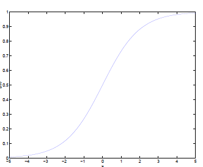
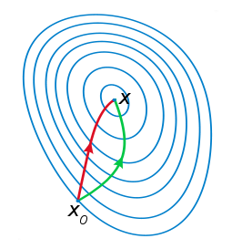
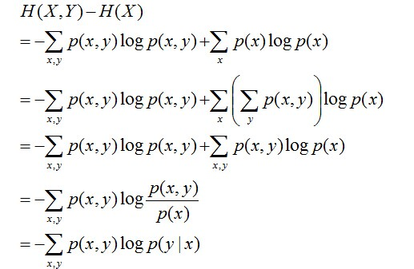
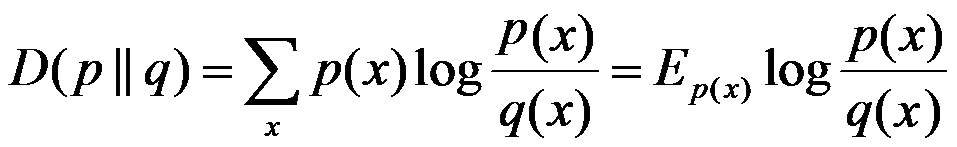
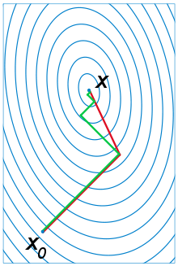
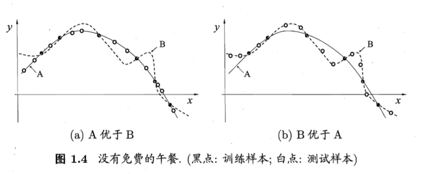

## Index

<!-- TOC -->

* [1. 请详细说说支持向量机（support vector machine，SVM）的原理](#1-请详细说说支持向量机support-vector-machinesvm的原理)
* [2. 哪些机器学习算法不需要做归一化处理？](#2-哪些机器学习算法不需要做归一化处理)
* [3. 树形结构为什么不需要归一化？](#3-树形结构为什么不需要归一化)
* [4. 在k-means或kNN，我们常用欧氏距离来计算最近的邻居之间的距离，有时也用曼哈顿距离，请对比下这两种距离的差别](#4-在k-means或knn我们常用欧氏距离来计算最近的邻居之间的距离有时也用曼哈顿距离请对比下这两种距离的差别)
* [5. 数据归一化（或者标准化，注意归一化和标准化不同）的原因](#5-数据归一化或者标准化注意归一化和标准化不同的原因)
* [6. 请简要说说一个完整机器学习项目的流程](#6-请简要说说一个完整机器学习项目的流程)
* [7. 逻辑斯蒂回归为什么要对特征进行离散化。](#7-逻辑斯蒂回归为什么要对特征进行离散化)
* [8. 简单介绍下LR](#8-简单介绍下lr)
* [9. overfitting怎么解决](#9-overfitting怎么解决)
* [10. LR 和 SVM 的联系与区别](#10-lr-和-svm-的联系与区别)
* [11. 什么是熵](#11-什么是熵)
* [12. 说说梯度下降法](#12-说说梯度下降法)
* [13. 牛顿法和梯度下降法有什么不同？](#13-牛顿法和梯度下降法有什么不同)
* [14. 熵、联合熵、条件熵、相对熵、互信息的定义](#14-熵联合熵条件熵相对熵互信息的定义)
* [15. 说说你知道的核函数](#15-说说你知道的核函数)
* [16. 什么是拟牛顿法（Quasi-Newton Methods）？](#16-什么是拟牛顿法quasi-newton-methods)
* [17. kmeans的复杂度？](#17-kmeans的复杂度)
* [18. 请说说随机梯度下降法的问题和挑战？](#18-请说说随机梯度下降法的问题和挑战)
* [19. 说说共轭梯度法？](#19-说说共轭梯度法)
* [20. 对所有优化问题来说, 有没有可能找到比現在已知算法更好的算法？](#20-对所有优化问题来说-有没有可能找到比現在已知算法更好的算法)

<!-- /TOC -->

## 1. 请详细说说支持向量机（support vector machine，SVM）的原理

> [请详细说说支持向量机（support vector machine，SVM）的原理](https://www.julyedu.com/question/big/kp_id/23/ques_id/919)

支持向量机，因其英文名为support vector machine，故一般简称SVM，通俗来讲，它是一种二类分类模型，其基本模型定义为特征空间上的间隔最大的线性分类器，其学习策略便是间隔最大化，最终可转化为一个凸二次规划问题的求解。

## 2. 哪些机器学习算法不需要做归一化处理？

在实际应用中，通过梯度下降法求解的模型一般都是需要归一化的，比如线性回归、logistic回归、KNN、SVM、神经网络等模型。

**但树形模型不需要归一化，因为它们不关心变量的值，而是关心变量的分布和变量之间的条件概率，如决策树、随机森林(Random Forest)。**

其他如管博士所说，我归一化和标准化主要是为了使计算更方便 比如两个变量的量纲不同 可能一个的数值远大于另一个那么他们同时作为变量的时候 可能会造成数值计算的问题，比如说求矩阵的逆可能很不精确 或者梯度下降法的收敛比较困难，还有如果需要计算欧式距离的话可能 量纲也需要调整 所以我估计lr 和 knn 标准化一下应该有好处。

至于其他的算法 我也觉得如果变量量纲差距很大的话 先标准化一下会有好处。

> [关于什么是归一化](https://www.julyedu.com/question/big/kp_id/23/ques_id/1011)

## 3. 树形结构为什么不需要归一化？

**因为数值缩放不影响分裂点位置，对树模型的结构不造成影响。**

按照特征值进行排序的，排序的顺序不变，那么所属的分支以及分裂点就不会有不同。而且，树模型是不能进行梯度下降的，因为构建树模型（回归树）寻找最优点时是通过寻找最优分裂点完成的，**因此树模型是阶跃的，阶跃点是不可导的，并且求导没意义，也就不需要归一化。**

**既然树形结构不需要归一化，那为何非树形结构比如线性模型则需要归一化呢？**

对于线性模型，特征值差别很大时，比如说 LR，我有两个特征，一个是(0,1)的，一个是(0,10000)的，运用梯度下降的时候，损失等高线是椭圆形，需要进行多次迭代才能到达最优点。

但是如果进行了归一化，那么等高线就是圆形的，促使 SGD 往原点迭代，从而导致需要的迭代次数较少。

## 4. 在k-means或kNN，我们常用欧氏距离来计算最近的邻居之间的距离，有时也用曼哈顿距离，请对比下这两种距离的差别

**欧氏距离**，最常见的两点之间或多点之间的距离表示法，又称之为欧几里得度量，它定义于欧几里得空间中，如点 `x = (x1,...,xn) `和 `y = (y1,...,yn)` 之间的距离为：

欧氏距离虽然很有用，**但也有明显的缺点。它将样本的不同属性（即各指标或各变量量纲）之间的差别等同看待，这一点有时不能满足实际要求**。例如，在教育研究中，经常遇到对人的分析和判别，个体的不同属性对于区分个体有着不同的重要性。因此，**欧氏距离适用于向量各分量的度量标准统一的情况**。

**曼哈顿距离**，我们可以定义曼哈顿距离的正式意义为L1-距离或城市区块距离，**也就是在欧几里得空间的固定直角坐标系上两点所形成的线段对轴产生的投影的距离总和**。例如在平面上，坐标`（x1, y1）`的点 `P1` 与坐标`（x2, y2）`的点 `P2` 的曼哈顿距离为：，**要注意的是，曼哈顿距离依赖座标系统的转度，而非系统在坐标轴上的平移或映射**。**当坐标轴变动时，点间的距离就会不同。**

通俗来讲，想象你在曼哈顿要从一个十字路口开车到另外一个十字路口，驾驶距离是两点间的直线距离吗？显然不是，除非你能穿越大楼。而实际驾驶距离就是这个“曼哈顿距离”，这也是曼哈顿距离名称的来源， 同时，曼哈顿距离也称为城市街区距离(City Block distance)。

曼哈顿距离和欧式距离一般用途不同，无相互替代性。

> [关于各种距离的比较参看《从K近邻算法、距离度量谈到KD树、SIFT+BBF算法》](http://blog.csdn.net/v_july_v/article/details/8203674) - CSDN

## 5. 数据归一化（或者标准化，注意归一化和标准化不同）的原因

> [面试笔试整理3：深度学习机器学习面试问题准备（必会）](https://blog.csdn.net/woaidapaopao/article/details/77806273) - CSDN

要强调：**能不归一化最好不归一化，之所以进行数据归一化是因为各维度的量纲不相同。而且需要看情况进行归一化。**

有些模型在各维度进行了不均匀的伸缩后，最优解与原来不等价（如SVM）需要归一化。

有些模型伸缩有与原来等价，如：LR则不用归一化，但是实际中往往通过迭代求解模型参数，如果目标函数太扁（想象一下很扁的高斯模型）迭代算法会发生不收敛的情况，所以最坏进行数据归一化。

补充：**其实本质是由于loss函数不同造成的**，SVM用了欧拉距离，如果一个特征很大就会把其他的维度dominated。而 LR 可以通过权重调整使得损失函数不变。

## 6. 请简要说说一个完整机器学习项目的流程

1. **抽象成数学问题**

   明确问题是进行机器学习的第一步。机器学习的训练过程通常都是一件非常耗时的事情，胡乱尝试时间成本是非常高的。

   这里的抽象成数学问题，指的我们明确我们可以获得什么样的数据，目标是一个分类还是回归或者是聚类的问题，如果都不是的话，如果划归为其中的某类问题。

2. **获取数据**

   数据决定了机器学习结果的上限，而算法只是尽可能逼近这个上限。
   数据要有代表性，否则必然会过拟合。

   而且对于分类问题，数据偏斜不能过于严重，不同类别的数据数量不要有数个数量级的差距。

   而且还要对数据的量级有一个评估，多少个样本，多少个特征，可以估算出其对内存的消耗程度，判断训练过程中内存是否能够放得下。如果放不下就得考虑改进算法或者使用一些降维的技巧了。如果数据量实在太大，那就要考虑分布式了。

3. **特征预处理与特征选择**

   良好的数据要能够提取出良好的特征才能真正发挥效力。

   特征预处理、数据清洗是很关键的步骤，往往能够使得算法的效果和性能得到显著提高。归一化、离散化、因子化、缺失值处理、去除共线性等，数据挖掘过程中很多时间就花在它们上面。这些工作简单可复制，收益稳定可预期，是机器学习的基础必备步骤。

   筛选出显著特征、摒弃非显著特征，需要机器学习工程师反复理解业务。这对很多结果有决定性的影响。特征选择好了，非常简单的算法也能得出良好、稳定的结果。这需要运用特征有效性分析的相关技术，如相关系数、卡方检验、平均互信息、条件熵、后验概率、逻辑回归权重等方法。

4. **训练模型与调优**

   直到这一步才用到我们上面说的算法进行训练。现在很多算法都能够封装成黑盒供人使用。但是真正考验水平的是调整这些算法的（超）参数，使得结果变得更加优良。这需要我们对算法的原理有深入的理解。理解越深入，就越能发现问题的症结，提出良好的调优方案。

5. **模型诊断**

   如何确定模型调优的方向与思路呢？这就需要对模型进行诊断的技术。

   过拟合、欠拟合 判断是模型诊断中至关重要的一步。常见的方法如交叉验证，绘制学习曲线等。过拟合的基本调优思路是增加数据量，降低模型复杂度。欠拟合的基本调优思路是提高特征数量和质量，增加模型复杂度。

   误差分析 也是机器学习至关重要的步骤。通过观察误差样本，全面分析误差产生误差的原因:是参数的问题还是算法选择的问题，是特征的问题还是数据本身的问题……
   诊断后的模型需要进行调优，调优后的新模型需要重新进行诊断，这是一个反复迭代不断逼近的过程，需要不断地尝试， 进而达到最优状态。

6. **模型融合**

   一般来说，模型融合后都能使得效果有一定提升。而且效果很好。

   工程上，主要提升算法准确度的方法是分别在模型的前端（特征清洗和预处理，不同的采样模式）与后端（模型融合）上下功夫。因为他们比较标准可复制，效果比较稳定。而直接调参的工作不会很多，毕竟大量数据训练起来太慢了，而且效果难以保证。

7. **上线运行**

   这一部分内容主要跟工程实现的相关性比较大。工程上是结果导向，模型在线上运行的效果直接决定模型的成败。 不单纯包括其准确程度、误差等情况，还包括其运行的速度(时间复杂度)、资源消耗程度（空间复杂度）、稳定性是否可接受。

   这些工作流程主要是工程实践上总结出的一些经验。并不是每个项目都包含完整的一个流程。这里的部分只是一个指导性的说明，只有大家自己多实践，多积累项目经验，才会有自己更深刻的认识。

## 7. 逻辑斯蒂回归为什么要对特征进行离散化。

> [连续特征的离散化：在什么情况下将连续的特征离散化之后可以获得更好的效果？](https://www.zhihu.com/question/31989952) - 知乎

**在工业界，很少直接将连续值作为逻辑回归模型的特征输入，而是将连续特征离散化为一系列0、1特征交给逻辑回归模型**，这样做的优势有以下几点：

0. 离散特征的增加和减少都很容易，易于模型的快速迭代；
1. 稀疏向量内积乘法运算速度快，计算结果方便存储，容易扩展；
2. **离散化后的特征对异常数据有很强的鲁棒性**：比如一个特征是年龄>30是1，否则0。如果特征没有离散化，一个异常数据“年龄300岁”会给模型造成很大的干扰；
3. **逻辑回归属于广义线性模型，表达能力受限；单变量离散化为N个后，每个变量有单独的权重，相当于为模型引入了非线性，能够提升模型表达能力，加大拟合；**
4. 离散化后可以进行特征交叉，由`M+N`个变量变为`M*N`个变量，进一步引入非线性，提升表达能力；
5. 特征离散化后，模型会更稳定，比如如果对用户年龄离散化，20-30作为一个区间，不会因为一个用户年龄长了一岁就变成一个完全不同的人。当然处于区间相邻处的样本会刚好相反，所以怎么划分区间是门学问；
6. 特征离散化以后，起到了简化了逻辑回归模型的作用，降低了模型过拟合的风险。

李沐曾经说过：**模型是使用离散特征还是连续特征，其实是一个“海量离散特征+简单模型” 同 “少量连续特征+复杂模型”的权衡**。既可以离散化用线性模型，也可以用连续特征加深度学习。就看是喜欢折腾特征还是折腾模型了。通常来说，前者容易，而且可以n个人一起并行做，有成功经验；后者目前看很赞，能走多远还须拭目以待。

## 8. 简单介绍下LR

> [Logistic Regression 的前世今生（理论篇）](http://blog.csdn.net/cyh_24/article/details/50359055)
>
> [机器学习算法与Python实践之（七）逻辑回归](http://blog.csdn.net/zouxy09/article/details/20319673)

把 LR 从头到脚都给讲一遍。建模，现场数学推导，每种解法的原理，正则化，LR 和 maxent （最大熵）模型啥关系，lr 为啥比线性回归好。有不少会背答案的人，问逻辑细节就糊涂了。

原理都会? 那就问工程，并行化怎么做，有几种并行化方式，读过哪些开源的实现。还会，那就准备收了吧，顺便逼问LR模型发展历史。

**虽然逻辑斯蒂回归姓回归，不过其实它的真实身份是二分类器。先弄清楚一个概念：线性分类器。**

给定一些数据点，它们分别属于两个不同的类，现在要找到一个线性分类器把这些数据分成两类。

如果用 x 表示数据点，用 y 表示类别（y 可以取 1 或者 -1，分别代表两个不同的类），一个线性分类器的学习目标便是要在 n 维的数据空间中找到一个超平面（hyper plane），这个超平面的方程可以表示为（ `wT` 中的 `T` 代表转置）：

可能有读者对类别取 1 或 -1 有疑问，事实上，这个 1 或 -1 的分类标准起源于 logistic回归。

Logistic回归目的是从特征学习出一个 0/1 分类模型，而这个模型是将特性的线性组合作为自变量，由于自变量的取值范围是负无穷到正无穷。因此，使用logistic函数（或称作sigmoid函数）将自变量映射到 (0,1) 上，映射后的值被认为是属于 y=1 的概率。

假设函数

其中x是n维特征向量，函数g就是logistic函数。

而  的图像是：

可以看到，将无穷映射到了 (0,1)。

而假设函数就是特征属于 y=1 的概率。

从而，当我们要判别一个新来的特征属于哪个类时，只需求即可，若大于 0.5 就是 y=1 的类，反之属于 y=0 类。

## 9. overfitting怎么解决

overfitting 就是过拟合, 其直观的表现如下图所示，随着训练过程的进行，模型复杂度增加，在training data 上的 error 渐渐减小，但是在验证集上的 error 却反而渐渐增大——因为训练出来的网络过拟合了训练集, 对训练集外的数据却不 work, 这称之为泛化(generalization)性能不好。**泛化性能是训练的效果评价中的首要目标**，没有良好的泛化，就等于南辕北辙, 一切都是无用功。

过拟合是泛化的反面，好比乡下快活的刘姥姥进了大观园会各种不适应，但受过良好教育的林黛玉进贾府就不会大惊小怪。实际训练中, 降低过拟合的办法一般如下：

- 正则化(Regularization)

  L2正则化：目标函数中增加所有权重w参数的平方之和, 逼迫所有w尽可能趋向零但不为零. 因为过拟合的时候, 拟合函数需要顾忌每一个点, 最终形成的拟合函数波动很大, 在某些很小的区间里, 函数值的变化很剧烈, 也就是某些w非常大. 为此, L2正则化的加入就惩罚了权重变大的趋势.
  L1正则化：目标函数中增加所有权重w参数的绝对值之和, 逼迫更多w为零(也就是变稀疏. L2因为其导数也趋0, 奔向零的速度不如L1给力了). 大家对稀疏规则化趋之若鹜的一个关键原因在于它能实现特征的自动选择。一般来说，xi的大部分元素（也就是特征）都是和最终的输出yi没有关系或者不提供任何信息的，在最小化目标函数的时候考虑xi这些额外的特征，虽然可以获得更小的训练误差，但在预测新的样本时，这些没用的特征权重反而会被考虑，从而干扰了对正确yi的预测。稀疏规则化算子的引入就是为了完成特征自动选择的光荣使命，它会学习地去掉这些无用的特征，也就是把这些特征对应的权重置为0。

- 随机失活(dropout)

  在训练的运行的时候，让神经元以超参数 p 的概率被激活(也就是 1-p 的概率被设置为0), 每个 w 因此随机参与, 使得任意 w 都不是不可或缺的, 效果类似于数量巨大的模型集成。

- 逐层归一化(batch normalization)

  这个方法给每层的输出都做一次归一化(网络上相当于加了一个线性变换层), 使得下一层的输入接近高斯分布. 这个方法相当于下一层的w训练时避免了其输入以偏概全, 因而泛化效果非常好. 

- 提前终止(early stopping)

  理论上可能的局部极小值数量随参数的数量呈指数增长, 到达某个精确的最小值是不良泛化的一个来源. 实践表明, 追求细粒度极小值具有较高的泛化误差。这是直观的，因为我们通常会希望我们的误差函数是平滑的, 精确的最小值处所见相应误差曲面具有高度不规则性, 而我们的泛化要求减少精确度去获得平滑最小值, 所以很多训练方法都提出了提前终止策略. 典型的方法是根据交叉叉验证提前终止: 若每次训练前, 将训练数据划分为若干份, 取一份为测试集, 其他为训练集, 每次训练完立即拿此次选中的测试集自测. 因为每份都有一次机会当测试集, 所以此方法称之为交叉验证. 交叉验证的错误率最小时可以认为泛化性能最好, 这时候训练错误率虽然还在继续下降, 但也得终止继续训练了.  

## 10. LR 和 SVM 的联系与区别

> [机器学习常见面试问题（一）](https://blog.csdn.net/timcompp/article/details/62237986) - CSDN
>
> [SVM系列第十一讲--损失函数](https://www.jianshu.com/p/fe14cd066077) - 简书

**联系： **

- LR 和 SVM 都可以处理分类问题，且一般都用于处理线性二分类问题（在改进的情况下可以处理多分类问题） 
- 两个方法都可以增加不同的正则化项，如 l1、l2 等等。所以在很多实验中，两种算法的结果是很接近的。 

**区别： **

- LR 是参数模型，SVM 是非参数模型。 
- 从目标函数来看，区别在于逻辑回归采用的是logistical loss，SVM 采用的是 hinge loss（合页损失函数），这两个损失函数的目的都是增加对分类影响较大的数据点的权重，减少与分类关系较小的数据点的权重
- SVM 的处理方法是只考虑 support vectors，也就是和分类最相关的少数点，去学习分类器。而逻辑回归通过非线性映射，大大减小了离分类平面较远的点的权重，相对提升了与分类最相关的数据点的权重。 
- 逻辑回归相对来说模型更简单，好理解，特别是大规模线性分类时比较方便。而 SVM 的理解和优化相对来说复杂一些，SVM 转化为对偶问题后, 分类只需要计算与少数几个支持向量的距离, 这个在进行复杂核函数计算时优势很明显, 能够大大简化模型和计算。 
- logic 能做的 svm能做，但可能在准确率上有问题，svm 能做的 logic 有的做不了。

## 11. 什么是熵

> [最大熵模型中的数学推导](http://blog.csdn.net/v_july_v/article/details/40508465)

从名字上来看，熵给人一种很玄乎，不知道是啥的感觉。其实，**熵的定义很简单，即用来表示随机变量的不确定性**。之所以给人玄乎的感觉，大概是因为为何要取这样的名字，以及怎么用。

熵的概念最早起源于物理学，用于度量一个热力学系统的无序程度。**在信息论里面，熵是对不确定性的测量。**

**熵的引入**

事实上，熵的英文原文为entropy，最初由德国物理学家鲁道夫·克劳修斯提出，其表达式为：

它表示一个系统在不受外部干扰时，其内部最稳定的状态。后来一中国学者翻译 entropy 时，考虑到entropy 是能量 Q 跟温度 T 的商，且跟火有关，便把 entropy 形象的翻译成“熵”。

我们知道，任何粒子的常态都是随机运动，也就是"无序运动"，如果让粒子呈现"有序化"，必须耗费能量。所以，温度（热能）可以被看作"有序化"的一种度量，**而"熵"可以看作是"无序化"的度量。**

**如果没有外部能量输入，封闭系统趋向越来越混乱（熵越来越大）**。比如，如果房间无人打扫，不可能越来越干净（有序化），只可能越来越乱（无序化）。而要让一个系统变得更有序，必须有外部能量的输入。

**1948年，香农Claude E. Shannon引入信息（熵），将其定义为离散随机事件的出现概率**。一个系统越是有序，信息熵就越低；反之，一个系统越是混乱，信息熵就越高。所以说，信息熵可以被认为是系统有序化程度的一个度量。

## 12. 说说梯度下降法

> [说说梯度下降法](https://www.julyedu.com/question/big/kp_id/23/ques_id/955)

## 13. 牛顿法和梯度下降法有什么不同？

> [机器学习中常见的最优化算法](http://blog.csdn.net/wtq1993/article/details/51607040)

**牛顿法（Newton's method）**

牛顿法是一种在实数域和复数域上近似求解方程的方法。方法使用函数 `f(x)` 的泰勒级数的前面几项来寻找方程 `f(x) = 0` 的根。牛顿法最大的特点就在于它的收敛速度很快。

具体步骤：

1. 首先，选择一个接近函数 `f (x)` 零点的 `x0`，计算相应的 `f (x0)` 和切线斜率 `f'(x0)`（这里`f'` 表示函数 `f`  的导数）。

2. 然后我们计算穿过点 `(x0,f(x0))` 并且斜率为 `f'(x0)` 的直线和 `x` 轴的交点的 `x` 坐标，也就是求如下方程的解：

   

我们将新求得的点的 `x` 坐标命名为 `x1`，通常 `x1` 会比 `x0` 更接近方程 `f(x) = 0`的解。

因此我们现在可以利用 `x1` 开始下一轮迭代。迭代公式可化简为如下所示：

已经证明，如果 `f'` 是连续的，并且待求的零点 `x` 是孤立的，那么在零点 `x` 周围存在一个区域，只要初始值 `x0` 位于这个邻近区域内，那么牛顿法必定收敛。 并且，如果 `f'(x)` 不为 `0`, 那么牛顿法将具有平方收敛的性能. 粗略的说，这意味着每迭代一次，牛顿法结果的有效数字将增加一倍。

由于牛顿法是基于当前位置的切线来确定下一次的位置，所以牛顿法又被很形象地称为是"切线法"。牛顿法的搜索路径（二维情况）如下图所示：

**关于牛顿法和梯度下降法的效率对比：**

1. 从收敛速度上看 ，**牛顿法是二阶收敛，梯度下降是一阶收敛**，前者牛顿法收敛速度更快。但牛顿法仍然是局部算法，只是在局部上看的更细致，**梯度法仅考虑方向，牛顿法不但考虑了方向还兼顾了步子的大小，其对步长的估计使用的是二阶逼近**。

2. 根据 wiki 上的解释，从几何上说，牛顿法就是用一个二次曲面去拟合你当前所处位置的局部曲面，而梯度下降法是用一个平面去拟合当前的局部曲面，通常情况下，二次曲面的拟合会比平面更好，所以牛顿法选择的下降路径会更符合真实的最优下降路径。

**注：红色的牛顿法的迭代路径，绿色的是梯度下降法的迭代路径。**

**牛顿法的优缺点总结：**

- **优点**：二阶收敛，收敛速度快；
- **缺点**：牛顿法是一种迭代算法，每一步都需要求解目标函数的Hessian（海森）矩阵的逆矩阵，计算比较复杂。

## 14. 熵、联合熵、条件熵、相对熵、互信息的定义

> [最大熵模型中的数学推导](https://blog.csdn.net/v_july_v/article/details/40508465) - CSDN

为了更好的理解，需要了解的概率必备知识有：

- 大写字母 `X` 表示随机变量，小写字母 `x` 表示随机变量 `X` 的某个具体的取值；

- `P(X)` 表示随机变量 `X` 的概率分布，`P(X,Y)` 表示随机变量 `X`、`Y` 的联合概率分布，`P(Y|X)` 表示已知随机变量 `X` 的情况下随机变量 `Y` 的条件概率分布；

- `p(X = x)` 表示随机变量X取某个具体值的概率，简记为 `p(x)`；

- `p(X = x, Y = y)` 表示联合概率，简记为 `p(x,y)`，`p(Y = y|X = x)` 表示条件概率，简记为`p(y|x)`，且有：`p(x,y) = p(x) * p(y|x)`。

**熵：**如果一个随机变量 `X` 的可能取值为 `X = {x1, x2,…, xk}`，其概率分布为`P(X = xi) = pi（i = 1,2, ..., n）`，则随机变量X的熵定义为：

把最前面的负号放到最后，便成了：

上面两个熵的公式，无论用哪个都行，而且两者等价，一个意思（这两个公式在下文中都会用到）。

**联合熵：**两个随机变量 `X`，`Y` 的联合分布，可以形成联合熵 Joint Entropy，用 `H(X,Y)` 表示。

**条件熵：**在随机变量 `X` 发生的前提下，随机变量 `Y` 发生所新带来的熵定义为 `Y` 的条件熵，用 `H(Y|X)` 表示，**用来衡量在已知随机变量 `X` 的条件下随机变量 `Y` 的不确定性。**

**且有此式子成立：**`H(Y|X) = H(X,Y) – H(X)`，整个式子表示 `(X,Y)` 发生所包含的熵减去X单独发生包含的熵。至于怎么得来的请看推导：

简单解释下上面的推导过程。整个式子共6行，其中

- 第二行推到第三行的依据是边缘分布 `p(x)` 等于联合分布 `p(x,y)` 的和；
- 第三行推到第四行的依据是把公因子 `logp(x)` 乘进去，然后把 `x`,`y` 写在一起；
- 第四行推到第五行的依据是：因为两个 sigma 都有 `p(x,y)`，故提取公因子 `p(x,y)` 放到外边，然后把里边的 `-（log p(x,y) - log p(x)）` 写成 `- log (p(x,y)/p(x) )` ；
- 第五行推到第六行的依据是：`p(x,y) = p(x) * p(y|x)`，故 `p(x,y) / p(x) =  p(y|x)`。

**相对熵：**又称互熵，交叉熵，鉴别信息，Kullback熵，Kullback-Leible散度等。设 `p(x)`、`q(x)` 是 `X` 中取值的两个概率分布，则 `p` 对 `q` 的相对熵是：

**在一定程度上，相对熵可以度量两个随机变量的“距离”**，且有 `D(p||q) ≠D(q||p)`。另外，值得一提的是，`D(p||q)` 是必然大于等于 `0` 的。

**互信息：**两个随机变量 `X`，`Y` 的互信息定义为 `X`，`Y` 的联合分布和各自独立分布乘积的相对熵，用 `I(X,Y)` 表示：

且有 `I(X,Y)=D(P(X,Y) || P(X)P(Y))`。下面，咱们来计算下 `H(Y)-I(X,Y)` 的结果，如下：

通过上面的计算过程，我们发现竟然有 `H(Y)-I(X,Y) = H(Y|X)`。故通过条件熵的定义，有：`H(Y|X) = H(X,Y) - H(X)`，而根据互信息定义展开得到 `H(Y|X) = H(Y) - I(X,Y)`，把前者跟后者结合起来，便有 `I(X,Y)= H(X) + H(Y) - H(X,Y)`，此结论被多数文献作为互信息的定义。

## 15. 说说你知道的核函数

> [说说你知道的核函数](https://www.julyedu.com/question/big/kp_id/23/ques_id/965)

几种常用的核函数来代替自己构造核函数：

- 线性核函数
- 多项式核函数
- 高斯（RBF）核函数
- sigmoid核函数

**选择核函数的方法：**

- 如果特征的数量大到和样本数量差不多，则选用LR或者线性核的SVM；
- 如果特征的数量小，样本的数量正常，则选用SVM+高斯核函数；
- 如果特征的数量小，而样本的数量很大，则需要手工添加一些特征从而变成第一种情况。

**调参：**

| 核函数                               | 公式                                                         | 调参                                                         |
| ------------------------------------ | ------------------------------------------------------------ | ------------------------------------------------------------ |
| linear kernel                        |  |                                                              |
| Polynomial kernel                    |  | -d：多项式核函数的最高次项次数，-g：gamma参数，-r：核函数中的coef0 |
| Gaussian radial basis function (RBF) |  | -g：gamma参数，默认值是1/k                                   |
| Sigmoid kernel                       |  | -g：gamma参数，-r：核函数中的coef0                           |

其中有两个重要的参数，即 C（惩罚系数） 和 gamma，**gamma 越大，支持向量越少，gamma 越小，支持向量越多**。

而支持向量的个数影响训练和预测的速度。**C 越高，容易过拟合。C 越小，容易欠拟合**。

## 16. 什么是拟牛顿法（Quasi-Newton Methods）？

> [机器学习中常见的最优化算法](https://blog.csdn.net/wtq1993/article/details/51607040)

**拟牛顿法是求解非线性优化问题最有效的方法之一**，于20世纪50年代由美国Argonne国家实验室的物理学家W.C.Davidon所提出来。Davidon设计的这种算法在当时看来是非线性优化领域最具创造性的发明之一。不久R. Fletcher和M. J. D. Powell证实了这种新的算法远比其他方法快速和可靠，使得非线性优化这门学科在一夜之间突飞猛进。

**拟牛顿法的本质思想是改善牛顿法每次需要求解复杂的Hessian矩阵的逆矩阵的缺陷，它使用正定矩阵来近似Hessian矩阵的逆，从而简化了运算的复杂度**。拟牛顿法和最速下降法一样只要求每一步迭代时知道目标函数的梯度。通过测量梯度的变化，构造一个目标函数的模型使之足以产生超线性收敛性。这类方法大大优于最速下降法，尤其对于困难的问题。

另外，因为拟牛顿法不需要二阶导数的信息，所以有时比牛顿法更为有效。如今，优化软件中包含了大量的拟牛顿算法用来解决无约束，约束，和大规模的优化问题。

**具体步骤：**

拟牛顿法的基本思想如下。首先构造目标函数在当前迭代 `xk` 的二次模型：

这里 `Bk` 是一个对称正定矩阵，于是我们取这个二次模型的最优解作为搜索方向，并且得到新的迭代点：

其中我们要求步长 `ak` 满足 Wolfe 条件。这样的迭代与牛顿法类似，区别就在于用近似的 Hessian矩阵 `Bk` 代替真实的Hessian矩阵。所以拟牛顿法最关键的地方就是每一步迭代中矩阵 `Bk` 的更新。现在假设得到一个新的迭代 `xk+1`，并得到一个新的二次模型：   

我们尽可能地利用上一步的信息来选取 `Bk`。具体地，我们要求

从而得到

这个公式被称为割线方程。常用的拟牛顿法有 DFP 算法和 BFGS 算法。

## 17. kmeans的复杂度？

时间复杂度：O(tKmn)，其中，t为迭代次数，K为簇的数目，m为记录数，n为维数
空间复杂度：O((m+K)n)，其中，K为簇的数目，m为记录数，n为维数

## 18. 请说说随机梯度下降法的问题和挑战？

> 那到底如何优化随机梯度法呢？详情请点击：论文公开课第一期：详解梯度下降等各类优化算法（含视频和PPT下载）（链接：https://ask.julyedu.com/question/7913）相关课程

## 19. 说说共轭梯度法？

**共轭梯度法是介于梯度下降法（最速下降法）与牛顿法之间的一个方法**，它仅需利用一阶导数信息，但克服了梯度下降法收敛慢的缺点，又避免了牛顿法需要存储和计算Hessian矩阵并求逆的缺点，**共轭梯度法不仅是解决大型线性方程组最有用的方法之一，也是解大型非线性最优化最有效的算法之一**。在各种优化算法中，共轭梯度法是非常重要的一种。其优点是所需存储量小，具有逐步收敛性，稳定性高，而且不需要任何外来参数。

下图为共轭梯度法和梯度下降法搜索最优解的路径对比示意图：

**注：绿色为梯度下降法，红色代表共轭梯度法**

## 20. 对所有优化问题来说, 有没有可能找到比現在已知算法更好的算法？

> [如果你是面试官，你怎么去判断一个面试者的深度学习水平？](https://www.zhihu.com/question/41233373/answer/145404190)

**没有免费的午餐定理：**

对于训练样本（黑点），不同的算法A/B在不同的测试样本（白点）中有不同的表现，这表示：对于一个学习算法 A，若它在某些问题上比学习算法 B 更好，则必然存在一些问题，在那里 B 比 A 好。

也就是说：对于所有问题，无论学习算法 A 多聪明，学习算法  B 多笨拙，它们的期望性能相同。

但是：没有免费午餐定理假设所有问题出现几率相同，实际应用中，不同的场景，会有不同的问题分布，所以，在优化算法时，针对具体问题进行分析，是算法优化的核心所在。

