## Index

<!-- TOC -->

* [41. 防止过拟合的方法](#41-防止过拟合的方法)
* [42. 机器学习中，为何要经常对数据做归一化](#42-机器学习中为何要经常对数据做归一化)
  - [42.1 归一化为什么能提高梯度下降法求解最优解的速度？](#421-归一化为什么能提高梯度下降法求解最优解的速度)
  - [42.2 归一化有可能提高精度](#422-归一化有可能提高精度)
  - [42.3 归一化的类型](#423-归一化的类型)
* [43. 什么最小二乘法？](#43-什么最小二乘法)
* [44. 梯度下降法找到的一定是下降最快的方向么？](#44-梯度下降法找到的一定是下降最快的方向么)
  - [44.1 随机梯度下降&amp;批量梯度下降](#441-随机梯度下降批量梯度下降)
* [45. 简单说说贝叶斯定理](#45-简单说说贝叶斯定理)
* [46. 怎么理解决策树、xgboost能处理缺失值？而有的模型(svm)对缺失值比较敏感。](#46-怎么理解决策树xgboost能处理缺失值而有的模型svm对缺失值比较敏感)
* [47. 标准化与归一化的区别？](#47-标准化与归一化的区别)
* [48. 随机森林如何处理缺失值？](#48-随机森林如何处理缺失值)
* [49. 随机森林如何评估特征重要性？](#49-随机森林如何评估特征重要性)
* [50. 优化 Kmeans？](#50-优化-kmeans)
* [51. Kmeans 初始类簇中心点的选取](#51-kmeans-初始类簇中心点的选取)
* [52. 解释对偶的概念](#52-解释对偶的概念)
* [53. 如何进行特征选择？](#53-如何进行特征选择)
* [54. 衡量分类器的好坏？](#54-衡量分类器的好坏)
  - [54.1 分类评价指标](#541-分类评价指标)
* [54.2 ROC 曲线](#542-roc-曲线)
* [54.3 AUC](#543-auc)
* [54.4 为什么使用 ROC 曲线](#544-为什么使用-roc-曲线)
* [55. 机器学习和统计里面的 AUC 的物理意义是啥？](#55-机器学习和统计里面的-auc-的物理意义是啥)
* [56. 数据预处理](#56-数据预处理)
* [57. 观察增益 gain, alpha 和 gamma 越大，增益越小？](#57-观察增益-gain-alpha-和-gamma-越大增益越小)
* [58. 什麽造成梯度消失问题?](#58-什麽造成梯度消失问题)
* [59. 简单说说特征工程](#59-简单说说特征工程)
* [60. 你知道有哪些数据处理和特征工程的处理？](#60-你知道有哪些数据处理和特征工程的处理)

<!-- /TOC -->

## 41. 防止过拟合的方法

过拟合的原因是算法的学习能力过强；一些假设条件（如样本独立同分布）可能是不成立的；训练样本过少不能对整个空间进行分布估计。 

**处理方法：**

- 早停止：如在训练中多次迭代后发现模型性能没有显著提高就停止训练
- 数据集扩增：原有数据增加、原有数据加随机噪声、重采样
- 正则化，正则化可以限制模型的复杂度
- 交叉验证
- 特征选择/特征降维
- 创建一个验证集是最基本的防止过拟合的方法。我们最终训练得到的模型目标是要在验证集上面有好的表现，而不训练集

## 42. 机器学习中，为何要经常对数据做归一化

> [为什么一些机器学习模型需要对数据进行归一化？](http://www.cnblogs.com/LBSer/p/4440590.html)

机器学习模型被互联网行业广泛应用，如排序（参见：[排序学习实践](http://www.cnblogs.com/LBSer/p/4439542.html)）、推荐、反作弊、定位（参见：[基于朴素贝叶斯的定位算法](http://www.cnblogs.com/LBSer/p/4020370.html)）等。

一般做机器学习应用的时候大部分时间是花费在特征处理上，其中很关键的一步就是对特征数据进行归一化。

**为什么要归一化呢？很多同学并未搞清楚，维基百科给出的解释：**

- 归一化后加快了梯度下降求最优解的速度；

- 归一化有可能提高精度。

**下面再简单扩展解释下这两点。**

### 42.1 归一化为什么能提高梯度下降法求解最优解的速度？

如下两图所示（来源：斯坦福机器学习视频）

蓝色的圈圈图代表的是两个特征的等高线。其中左图两个特征 `X1` 和 `X2` 的区间相差非常大，`X1` 区间是 `[0,2000]`，`X2` 区间是 `[1,5]`，像这种有的数据那么大，有的数据那么小，两类之间的幅度相差这么大，其所形成的等高线非常尖。当使用梯度下降法寻求最优解时，很有可能走“之字型”路线（垂直等高线走），从而导致需要迭代很多次才能收敛；

而右图对两个原始特征进行了归一化，其对应的等高线显得很圆，在梯度下降进行求解时能较快的收敛。

**因此如果机器学习模型使用梯度下降法求最优解时，归一化往往非常有必要，否则很难收敛甚至不能收敛。**

### 42.2 归一化有可能提高精度
一些分类器需要计算样本之间的距离（如欧氏距离），例如 KNN。如果一个特征值域范围非常大，那么距离计算就主要取决于这个特征，从而与实际情况相悖（**比如这时实际情况是值域范围小的特征更重要**）。

### 42.3 归一化的类型
1. **线性归一化**

   

   这种归一化方法比较适用在数值比较集中的情况。这种方法有个缺陷，如果 max 和 min不 稳定，很容易使得归一化结果不稳定，使得后续使用效果也不稳定。**实际使用中可以用经验常量值来替代 max 和 min。**

2. **标准差标准化**

   经过处理的数据符合标准正态分布，即均值为 0，标准差为 1，其转化函数为：

   

   其中 `μ` 为所有样本数据的均值，`σ` 为所有样本数据的标准差。

3. **非线性归一化**

   **经常用在数据分化比较大的场景，有些数值很大，有些很小。**通过一些数学函数，将原始值进行映射。**该方法包括 log、指数，正切等。**需要根据数据分布的情况，决定非线性函数的曲线，比如 `log(V, 2)` 还是 `log(V, 10)` 等。

## 43. 什么最小二乘法？

我们口头中经常说：一般来说，平均来说。如平均来说，不吸烟的健康优于吸烟者，之所以要加“平均”二字，是因为凡事皆有例外，总存在某个特别的人他吸烟但由于经常锻炼所以他的健康状况可能会优于他身边不吸烟的朋友。**而最小二乘法的一个最简单的例子便是算术平均。**

**最小二乘法（又称最小平方法）是一种数学优化技术。它通过最小化误差的平方和寻找数据的最佳函数匹配。**利用最小二乘法可以简便地求得未知的数据，并使得这些求得的数据与实际数据之间误差的平方和为最小。用函数表示为：

**使误差「所谓误差，当然是观察值与实际真实值的差量」平方和达到最小以寻求估计值的方法，就叫做最小二乘法，用最小二乘法得到的估计，叫做最小二乘估计。**当然，取平方和作为目标函数只是众多可取的方法之一。

最小二乘法的一般形式可表示为：

有效的最小二乘法是勒让德在 1805 年发表的，基本思想就是认为测量中有误差，所以所有方程的累积误差为

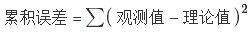

我们求解出导致累积误差最小的参数即可：

勒让德在论文中对最小二乘法的优良性做了几点说明：

- 最小二乘使得误差平方和最小，并在各个方程的误差之间建立了一种平衡，从而防止某一个极端误差取得支配地位
- 计算中只要求偏导后求解线性方程组，计算过程明确便捷
- 最小二乘可以导出算术平均值作为估计值

对于最后一点，从统计学的角度来看是很重要的一个性质。推理如下：

> 假设真值为 `θ`, `x1,⋯,xn`为 `n` 次测量值, 每次测量的误差为 `ei=xi−θ`，按最小二乘法，误差累积为 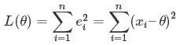
>
> 求解 `θ` 使 `L(θ)` 达到最小，正好是算术平均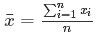。

由于算术平均是一个历经考验的方法，而以上的推理说明，算术平均是最小二乘的一个特例，所以从另一个角度说明了最小二乘方法的优良性，使我们对最小二乘法更加有信心。

最小二乘法发表之后很快得到了大家的认可接受，并迅速的在数据分析实践中被广泛使用。不过历史上又有人把最小二乘法的发明归功于高斯，这又是怎么一回事呢。高斯在1809年也发表了最小二乘法，并且声称自己已经使用这个方法多年。高斯发明了小行星定位的数学方法，并在数据分析中使用最小二乘方法进行计算，准确的预测了谷神星的位置。

最小二乘法跟SVM有什么联系呢？请参见[《支持向量机通俗导论（理解SVM的三层境界）》](http://blog.csdn.net/v_july_v/article/details/7624837)。

## 44. 梯度下降法找到的一定是下降最快的方向么？

梯度下降法并不是下降最快的方向，它只是目标函数在当前的点的切平面（当然高维问题不能叫平面）上下降最快的方向。在practical implementation中，牛顿方向（考虑海森矩阵）才一般被认为是下降最快的方向，可以达到 superlinear 的收敛速度。梯度下降类的算法的收敛速度一般是 linear 甚至sublinear 的（在某些带复杂约束的问题）。by林小溪（https://www.zhihu.com/question/30672734/answer/139689869）。

一般解释梯度下降，会用下山来举例。假设你现在在山顶处，必须抵达山脚下（也就是山谷最低处）的湖泊。但让人头疼的是，你的双眼被蒙上了无法辨别前进方向。换句话说，你不再能够一眼看出哪条路径是最快的下山路径

最好的办法就是走一步算一步，先用脚向四周各个方向都迈出一步，试探一下周围的地势，用脚感觉下哪个方向是下降最大的方向。换言之，每走到一个位置的时候，求解当前位置的梯度，沿着梯度的负方向（当前最陡峭的位置向下）走一步。就这样，每要走一步都根据上一步所在的位置选择当前最陡峭最快下山的方向走下一步，一步步走下去，一直走到我们感觉已经到了山脚。

当然这样走下去，我们走到的可能并不一定是真正的山脚，而只是走到了某一个局部的山峰低处。换句话说，**梯度下降不一定能够找到全局的最优解，也有可能只是一个局部最优解。当然，如果损失函数是凸函数，梯度下降法得到的解就一定是全局最优解。**

@zbxzc（http://blog.csdn.net/u014568921/article/details/44856915）：更进一步，我们来定义输出误差，即对于任意一组权值向量，那它得到的输出和我们预想的输出之间的误差值。定义误差的方法很多，不同的误差计算方法可以得到不同的权值更新法则，这里我们先用这样的定义：

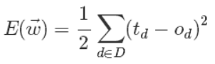

上面公式中 `D` 代表了所有的输入实例，或者说是样本，`d` 代表了一个样本实例，`od` 表示感知器的输出，`td` 代表我们预想的输出。

这样，我们的目标就明确了，就是想找到一组权值让这个误差的值最小，显然我们用误差对权值求导将是一个很好的选择，**导数的意义是提供了一个方向，沿着这个方向改变权值，将会让总的误差变大，更形象的叫它为梯度。**

既然梯度确定了 E 最陡峭的上升的方向，那么梯度下降的训练法则是：

梯度上升和梯度下降其实是一个思想，上式中权值更新的 `+` 号改为 `-` 号也就是梯度上升了。**梯度上升用来求函数的最大值，梯度下降求最小值。**

这样每次移动的方向确定了，但每次移动的距离却不知道。这个可以由步长（也称学习率）来确定，记为 `α`。这样权值调整可表示为：

总之，**梯度下降法的优化思想是用当前位置负梯度方向作为搜索方向，因为该方向为当前位置的最快下降方向，所以也被称为是“最速下降法”。最速下降法越接近目标值，步长越小，前进越慢。**梯度下降法的搜索迭代示意图如下图所示：

正因为梯度度下降法在接近最优解的区域收敛速度明显变慢，所以利用梯度下降法求解需要很多次的迭代。**在机器学习中，基于基本的梯度下降法发展了两种梯度下降方法，分别为随机梯度下降法和批量梯度下降法。**

### 44.1 随机梯度下降&批量梯度下降

by@wtq1993，http://blog.csdn.net/wtq1993/article/details/51607040

普通的梯度下降算法在更新回归系数时要遍历整个数据集，是一种批处理方法，这样训练数据特别忙庞大时，可能出现如下问题：

- 收敛过程可能非常慢；
- 如果误差曲面上有多个局极小值，那么不能保证这个过程会找到全局最小值。

为了解决上面的问题，实际中我们应用的是梯度下降的一种变体被称为随机梯度下降。

上面公式中的误差是针对于所有训练样本而得到的，**而随机梯度下降的思想是根据每个单独的训练样本来更新权值**，这样我们上面的梯度公式就变成了：

经过推导后，我们就可以得到最终的权值更新的公式：

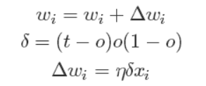

有了上面权重的更新公式后，我们就可以通过输入大量的实例样本，来根据我们预期的结果不断地调整权值，从而最终得到一组权值使得我们的算法能够对一个新的样本输入得到正确的或无限接近的结果。

这里做一个对比：

设代价函数为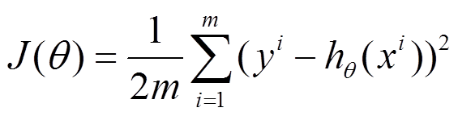

批量梯度下降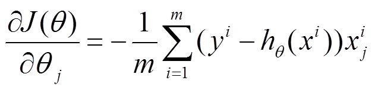

参数更新为：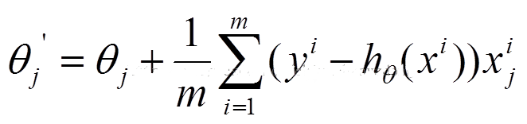

`i` 是样本编号下标，`j` 是样本维数下标，`m` 为样例数目，`n` 为特征数目。所以更新一个 `θj` 需要遍历整个样本集

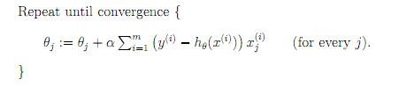

随机梯度下降参数更新为：

`i` 是样本编号下标，`j` 是样本维数下标，`m` 为样例数目，`n` 为特征数目。所以更新一个 `θj` 只需要一个样本就可以。

下面两幅图可以很形象的对比各种优化方法（图来源：http://sebastianruder.com/optimizing-gradient-descent/）：

SGD各优化方法在损失曲面上的表现

从上图可以看出， Adagrad、Adadelta 与 RMSprop 在损失曲面上能够立即转移到正确的移动方向上达到快速的收敛。而 Momentum 与 NAG 会导致偏离(off-track)。同时 NAG 能够在偏离之后快速修正其路线，因为其根据梯度修正来提高响应性。

SGD 各优化方法在损失曲面鞍点处上的表现

## 45. 简单说说贝叶斯定理

在引出贝叶斯定理之前，先学习几个定义：

**条件概率（又称后验概率）**就是事件A在另外一个事件B已经发生条件下的发生概率。**条件概率表示为P(A|B)，读作 “在 B 条件下 A 的概率”。**

比如，在同一个样本空间 `Ω` 中的事件或者子集 `A` 与 `B`，如果随机从 `Ω` 中选出的一个元素属于 `B` ，那么这个随机选择的元素还属于 `A` 的概率就定义为在 `B` 的前提下A的条件概率，所以：`P(A|B) = |A∩B|/|B|`，接着分子、分母都除以 `|Ω|` 得到

**联合概率**表示两个事件共同发生的概率。`A` 与 `B` 的联合概率表示为  或者 。

**边缘概率（又称先验概率）**是某个事件发生的概率。**边缘概率是这样得到的：在联合概率中，把最终结果中那些不需要的事件通过合并成它们的全概率，而消去它们（对离散随机变量用求和得全概率，对连续随机变量用积分得全概率），这称为边缘化（marginalization），比如 A 的边缘概率表示为`P(A)`，B 的边缘概率表示为 `P(B)`。**

- 接着，考虑一个问题：`P(A|B)` 是在 `B` 发生的情况下 `A` 发生的可能性。
- 首先，事件 `B` 发生之前，我们对事件 `A` 的发生有一个基本的概率判断，称为 `A` 的先验概率，用 `P(A)` 表示；
- 其次，事件 `B` 发生之后，我们对事件 `A` 的发生概率重新评估，称为 `A` 的后验概率，用 `P(A|B)` 表示；
- 类似的，事件 `A` 发生之前，我们对事件 `B` 的发生有一个基本的概率判断，称为 `B` 的先验概率，用 `P(B)` 表示；
- 同样，事件 `A` 发生之后，我们对事件 `B` 的发生概率重新评估，称为 `B` 的后验概率，用 `P(B|A)` 表示。

贝叶斯定理便是基于下述贝叶斯公式：

上述公式的推导其实非常简单，就是从条件概率推出。

根据条件概率的定义，在事件 `B` 发生的条件下事件 `A` 发生的概率是

同样地，在事件 `A` 发生的条件下事件 `B` 发生的概率

整理与合并上述两个方程式，便可以得到：

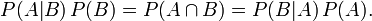

接着，上式两边同除以 `P(B)`，若 `P(B)` 是非零的，我们便可以得到贝叶斯定理的公式表达式：

所以，贝叶斯公式可以直接根据条件概率的定义直接推出。即因为 `P(A,B) = P(A)P(B|A) = P(B)P(A|B)`，所以 `P(A|B) = P(A)P(B|A)  / P(B)`。更多请参见此文：[《从贝叶斯方法谈到贝叶斯网络》](http://blog.csdn.net/v_july_v/article/details/40984699)。

## 46. 怎么理解决策树、xgboost能处理缺失值？而有的模型(svm)对缺失值比较敏感。

> [怎么理解决策树、xgboost能处理缺失值？而有的模型(svm)对缺失值比较敏感呢?](https://www.zhihu.com/question/58230411) - 知乎

## 47. 标准化与归一化的区别？

> [机器学习中，为何要经常对数据做归一化](https://www.julyedu.com/question/big/kp_id/23/ques_id/1011)

简单来说，**标准化是依照特征矩阵的列处理数据**，其通过求 `z-score` 的方法，将样本的特征值转换到同一量纲下。

**归一化是依照特征矩阵的行处理数据**，其目的在于样本向量在点乘运算或其他核函数计算相似性时，拥有统一的标准，也就是说都转化为“单位向量”。

## 48. 随机森林如何处理缺失值？

**方法一（na.roughfix）：**简单粗暴，对于训练集,同一个 class 下的数据，如果是**分类变量缺失**，用**众数补上**，如果是**连续型变量缺失**，用**中位数补**。

**方法二（rfImpute）：**这个方法计算量大，至于比方法一好坏？不好判断。**先用 `na.roughfix` 补上缺失值，然后构建森林并计算 proximity matrix，再回头看缺失值，如果是分类变量，则用没有缺失的观测实例的 proximity 中的权重进行投票。如果是连续型变量，则用 proximity 矩阵进行加权平均的方法补缺失值。然后迭代 4-6 次，这个补缺失值的思想和 KNN 有些类似 12。**

## 49. 随机森林如何评估特征重要性？

衡量变量重要性的方法有两种，`Decrease GINI` 和 `Decrease Accuracy`：

- **Decrease GINI：** 对于回归问题，直接使用 `argmax(VarVarLeftVarRight)` 作为评判标准，即当前节点训练集的方差 `Var` 减去左节点的方差 `VarLeft` 和右节点的方差 `VarRight`。
- **Decrease Accuracy：**对于一棵树 `Tb(x)`，我们用 OOB 样本可以得到测试误差1；然后随机改变 OOB 样本的第 `j` 列：保持其他列不变，对第 `j` 列进行随机的上下置换，得到误差2 。至此，我们可以用误差1 `-`误差2 来刻画变量j的重要性。基本思想就是，如果一个变量 `j` 足够重要，那么改变它会极大的增加测试误差；反之，如果改变它测试误差没有增大，则说明该变量不是那么的重要。

## 50. 优化 Kmeans？

使用 `kd` 树或者 `ball tree`

将所有的观测实例构建成一颗 `kd` 树，之前每个聚类中心都是需要和每个观测点做依次距离计算，现在这些聚类中心根据 `kd` 树只需要计算附近的一个局部区域即可。

## 51. Kmeans 初始类簇中心点的选取

k-means++ 算法选择初始 seeds 的基本思想就是：**初始的聚类中心之间的相互距离要尽可能的远。**
1. 从输入的数据点集合中随机选择一个点作为第一个聚类中心
2. 对于数据集中的每一个点 `x`，计算它与最近聚类中心(指已选择的聚类中心)的距离 `D(x)`
3. 选择一个新的数据点作为新的聚类中心，选择的原则是：`D(x)` 较大的点，被选取作为聚类中心的概率较大
4. 重复 2 和 3 直到 `k` 个聚类中心被选出来
5. 利用这 `k` 个初始的聚类中心来运行标准的 `k-means` 算法

## 52. 解释对偶的概念

> 一般来说是以一对一的方式，常常（但并不总是）通过某个[对合](https://zh.wikipedia.org/wiki/%E5%B0%8D%E5%90%88)算子，把一种概念、公理或数学结构转化为另一种概念、公理或数学结构：如果 *A* 的对偶是 *B*，那么 *B* 的对偶是 *A*。由于对合有时候会存在[不动点](https://zh.wikipedia.org/wiki/%E4%B8%8D%E5%8A%A8%E7%82%B9)，因此 *A* 的对偶有时候会是 *A* 自身。比如[射影几何](https://zh.wikipedia.org/wiki/%E5%B0%84%E5%BD%B1%E5%87%A0%E4%BD%95)中的[笛沙格定理](https://zh.wikipedia.org/wiki/%E7%AC%9B%E6%B2%99%E6%A0%BC%E5%AE%9A%E7%90%86)，即是在这一意义下的自对偶。

一个优化问题可以从两个角度进行考察，一个是 primal 问题，一个是 dual 问题，就是对偶问题，**一般情况下对偶问题给出主问题最优值的下界，在强对偶性成立的情况下由对偶问题可以得到主问题的最优下界，对偶问题是凸优化问题**，可以进行较好的求解，SVM 中就是将 primal 问题转换为 dual 问题进行求解，从而进一步引入核函数的思想。

## 53. 如何进行特征选择？

特征选择是一个重要的数据预处理过程，主要有两个原因：

- 一是减少特征数量、降维，使模型泛化能力更强，减少过拟合;
- 二是增强对特征和特征值之间的理解

**常见的特征选择方式：**

1. **去除方差较小的特征**
2. **正则化**。L1 正则化能够生成稀疏的模型。L2 正则化的表现更加稳定，由于有用的特征往往对应系数非零。
3. **随机森林**，**对于分类问题，通常采用基尼不纯度或者信息增益，对于回归问题，通常采用的是方差或者最小二乘拟合。**一般不需要 feature engineering、调参等繁琐的步骤。它的两个主要问题：
   - 重要的特征有可能得分很低（关联特征问题）
   - 这种方法对特征变量类别多的特征越有利（偏向问题）。
4. **稳定性选择**。是一种基于二次抽样和选择算法相结合较新的方法，选择算法可以是回归、SVM或其他类似的方法。**它的主要思想是在不同的数据子集和特征子集上运行特征选择算法，不断的重复，最终汇总特征选择结果，比如可以统计某个特征被认为是重要特征的频率（被选为重要特征的次数除以它所在的子集被测试的次数）**。理想情况下，重要特征的得分会接近100%。稍微弱一点的特征得分会是非0的数，而最无用的特征得分将会接近于0。

## 54. 衡量分类器的好坏？

> [面试笔试整理3：深度学习机器学习面试问题准备（必会）](https://blog.csdn.net/woaidapaopao/article/details/77806273)

这里首先要知道 TP、FN（真的判成假的）、FP（假的判成真）、TN四种（可以画一个表格）。 

几种常用的指标：

**精度precision** = TP/(TP+FP) = TP/~P （~p为预测为真的数量）

**召回率 recall** = TP/(TP+FN) = TP/ P

**F1值：** 2/F1 = 1/recall + 1/precision

**ROC曲线：**ROC 空间是一个以伪阳性率（FPR，false positive rate）为 X 轴，真阳性率（TPR, true positive rate）为 Y 轴的二维坐标系所代表的平面。其中真阳率 TPR = TP / P = recall， 伪阳率 FPR = FP / N

---

> [机器学习之分类性能度量指标 : ROC曲线、AUC值、正确率、召回率](https://www.jianshu.com/p/c61ae11cc5f6) - 简书
>
> [分类 (Classification)：ROC 和曲线下面积](https://developers.google.com/machine-learning/crash-course/classification/roc-and-auc?hl=zh-cn)

### 54.1 分类评价指标

**混淆矩阵**

- True Positive(TP)：将正类预测为正类的数量.
- True Negative(TN)：将负类预测为负类的数量.
- False Positive(FP)：将负类预测为正类数 → 误报 (Type I error).
- False Negative(FN)：将正类预测为负类数 → 漏报 (Type II error).

**准确率**（accuracy）

**精确率**（precision）【查准率】

> 准确率与精确率的区别：
>
> > 在正负样本不平衡的情况下，**准确率**这个评价指标有很大的缺陷。比如在互联网广告里面，点击的数量是很少的，一般只有千分之几，如果用acc，即使全部预测成负类（不点击）acc 也有 99% 以上，没有意义。

**召回率**（recall, sensitivity, true positive rate）【查全率】

**F1值**——精确率和召回率的调和均值

> 只有当精确率和召回率都很高时，F1值才会高

### 54.2 ROC 曲线

**ROC曲线**：接收者操作特征曲线（[receiver operating characteristic curve](https://en.wikipedia.org/wiki/Receiver_operating_characteristic)），是反映敏感性和特异性连续变量的综合指标，roc曲线上每个点反映着对同一信号刺激的感受性。

对于分类器，或者说分类算法，评价指标主要有precision，recall，F-score等，以及这里要讨论的ROC和AUC。下图是一个ROC曲线的示例：

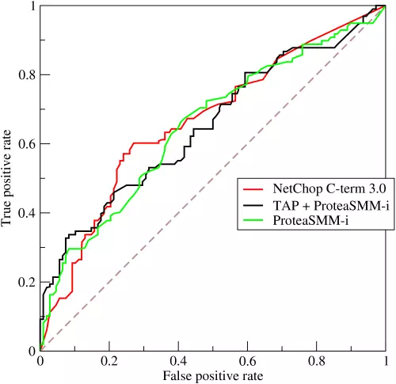

- 横坐标：**1-Specificity**，伪正类率(False positive rate， FPR)，**预测为正但实际为负**的样本占**所有负例样本**的比例；

- 纵坐标：**Sensitivity**，真正类率(True positive rate， TPR)，**预测为正且实际为正**的样本占**所有正例样本**的比例。

在一个二分类模型中，假设采用逻辑回归分类器，其给出针对每个实例为正类的概率，那么通过设定一个阈值如0.6，概率大于等于0.6的为正类，小于0.6的为负类。对应的就可以算出一组(FPR,TPR)，在平面中得到对应坐标点。随着阈值的逐渐减小，越来越多的实例被划分为正类，但是这些正类中同样也掺杂着真正的负实例，即TPR和FPR会同时增大。阈值最大时，对应坐标点为(0,0)，阈值最小时，对应坐标点(1,1)。

如下面这幅图，(a)图中实线为ROC曲线，线上每个点对应一个阈值。

(a) 理想情况下，TPR应该接近1，FPR应该接近0。ROC曲线上的每一个点对应于一个threshold，对于一个分类器，每个threshold下会有一个TPR和FPR。比如Threshold最大时，TP=FP=0，对应于原点；Threshold最小时，TN=FN=1，对应于右上角的点(1,1)。
(b) P和N得分不作为特征间距离d的一个函数，随着阈值theta增加，TP和FP都增加。

- 横轴FPR：1-TNR，1-Specificity，FPR越大，预测正类中实际负类越多。
- 纵轴TPR：Sensitivity(正类覆盖率)，TPR越大，预测正类中实际正类越多。
- 理想目标：TPR=1，FPR=0，即图中(0,1)点，故ROC曲线越靠拢(0,1)点，越偏离45度对角线越好，Sensitivity、Specificity越大效果越好。

### 54.3 AUC

AUC ([Area Under Curve](https://en.wikipedia.org/wiki/Receiver_operating_characteristic#Area_under_the_curve)) 被定义为**ROC曲线下的面积**，显然这个面积的数值**不会大于1**。又由于ROC曲线一般都处于 `y=x` 这条直线的上方，所以**AUC的取值范围一般在0.5和1之间**。

**使用AUC值作为评价标准是因为很多时候ROC曲线并不能清晰的说明哪个分类器的效果更好，而作为一个数值，对应AUC更大的分类器效果更好。**

AUC的计算有两种方式，**梯形法**和**ROC AUCH法**，都是以逼近法求近似值，具体见[wikipedia](https://en.wikipedia.org/wiki/Receiver_operating_characteristic#Area_under_the_curve)。

**AUC意味着什么**

那么AUC值的含义是什么呢？根据(Fawcett, 2006)，AUC的值的含义是：

> The AUC value is equivalent to the probability that a randomly chosen positive example is ranked higher than a randomly chosen negative example.

这句话有些绕，我尝试解释一下：首先AUC值是一个概率值，当你随机挑选一个正样本以及一个负样本，当前的分类算法根据计算得到的Score值将这个正样本排在负样本前面的概率就是AUC值。当然，**AUC值越大，当前的分类算法越有可能将正样本排在负样本前面，即能够更好的分类**。

从AUC判断分类器（预测模型）优劣的标准：

- AUC = 1，是完美分类器，采用这个预测模型时，存在至少一个阈值能得出完美预测。绝大多数预测的场合，不存在完美分类器。
- 0.5 < AUC < 1，优于随机猜测。这个分类器（模型）妥善设定阈值的话，能有预测价值。
- AUC = 0.5，跟随机猜测一样（例：丢铜板），模型没有预测价值。
- AUC < 0.5，比随机猜测还差；但只要总是反预测而行，就优于随机猜测。

三种AUC值示例：

简单说：**AUC值越大的分类器，正确率越高**。

### 54.4 为什么使用 ROC 曲线

既然已经这么多评价标准，为什么还要使用 ROC 和 AUC 呢？

因为 ROC 曲线有个很好的特性：**当测试集中的正负样本的分布变化的时候，ROC曲线能够保持不变**。在实际的数据集中经常会出现类不平衡（class imbalance）现象，即负样本比正样本多很多（或者相反），而且测试数据中的正负样本的分布也可能随着时间变化。

## 55. 机器学习和统计里面的 AUC 的物理意义是啥？

AUC 是评价模型好坏的常见指标之一，详见：[如何理解机器学习和统计中的AUC？](https://www.zhihu.com/question/39840928)

## 56. 数据预处理

1. **缺失值，填充缺失值fillna**：
i. 离散：None,
ii. 连续：均值。
iii. 缺失值太多，则直接去除该列
2. **连续值：**离散化。有的模型（如决策树）需要离散值
3. **对定量特征二值化**。核心在于设定一个阈值，大于阈值的赋值为 1，小于等于阈值的赋值为 0。
4. **皮尔逊相关系数，去除高度相关的列**

## 57. 观察增益 gain, alpha 和 gamma 越大，增益越小？

> [xgboost中的数学原理](https://blog.csdn.net/a358463121/article/details/68617389)

**xgboost 寻找分割点的标准是最大化 gain**. 考虑传统的枚举每个特征的所有可能分割点的贪心法效率太低，**xgboost实现了一种近似的算法。大致的思想是根据百分位法列举几个可能成为分割点的候选者，然后从候选者中计算 Gain 按最大值找出最佳的分割点。**它的计算公式分为四项, 可以由正则化项参数调整(**lamda 为叶子权重平方和的系数, gama 为叶子数量**):

- 第一项是假设分割的左孩子的权重分数, 
- 第二项为右孩子, 
- 第三项为不分割总体分数, 
- 最后一项为引入一个节点的复杂度损失

由公式可知, gama 越大 gain 越小, lamda越大, gain 可能小也可能大.

原问题是 alpha 而不是 lambda, 这里 paper上没有提到, xgboost实现上有这个参数. 上面是我从paper上理解的答案,下面是[搜索到的](
https://zhidao.baidu.com/question/2121727290086699747.html?fr=iks&word=xgboost+lamda&ie=gbk) ：

lambda[默认1]权重的 L2 正则化项。(和Ridge regression类似)。 这个参数是用来控制 XGBoost 的正则化部分的。虽然大部分数据科学家很少用到这个参数，但是这个参数在减少过拟合上还是可以挖掘出更多用处的。L1、alpha[默认1]权重的 L1 正则化项。(和Lasso regression类似)。 可以应用在很高维度的情况下，使得算法的速度更快。

gamma[默认0]在节点分裂时，只有分裂后损失函数的值下降了，才会分裂这个节点。Gamma指定了节点分裂所需的最小损失函数下降值。 这个参数的值越大，算法越保守。

## 58. 什麽造成梯度消失问题?

> [如果你是面试官，你怎么去判断一个面试者的深度学习水平？](https://www.zhihu.com/question/41233373/answer/145404190) - 知乎

Yes you should understand backdrop－Andrej Karpathy

How does the ReLu solve the vanishing gradient problem?

神经网络的训练中，通过改变神经元的权重，使网络的输出值尽可能逼近标签以降低误差值，训练普遍使用 BP 算法，核心思想是，计算出输出与标签间的损失函数值，然后计算其相对于每个神经元的梯度，进行权值的迭代。

**梯度消失会造成权值更新缓慢，模型训练难度增加。**造成梯度消失的一个原因是，许多激活函数将输出值挤压在很小的区间内，在激活函数两端较大范围的定义域内梯度为 0，造成学习停止。

简而言之，就是 sigmoid 函数 `f(x)` 的导数为 `f(x)*(1-f(x))`， 因为 `f(x)` 的输出在 `0-1`之间，所以随着深度的增加，从顶端传过来的导数每次都乘以两个小于 `1` 的数，很快就变得特别特别小。

## 59. 简单说说特征工程

首先，大多数机器学习从业者主要在公司做什么呢？不是做数学推导，也不是发明多高大上的算法，而是做特征工程，如下图所示（图来自：http://www.julyedu.com/video/play/18）

进一步，特征工程主要是做如下工作（图来自机器学习第九期第五次课 特征工程）

## 60. 你知道有哪些数据处理和特征工程的处理？

