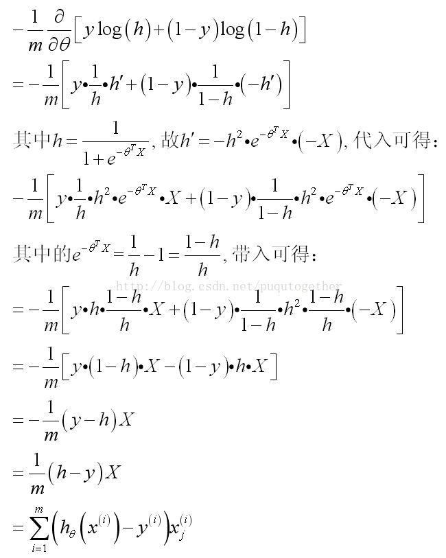
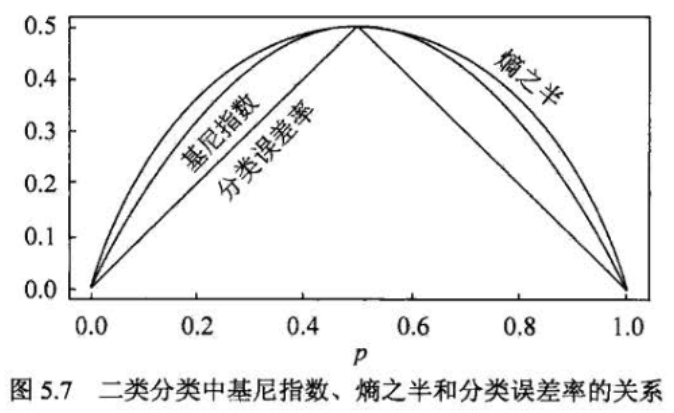
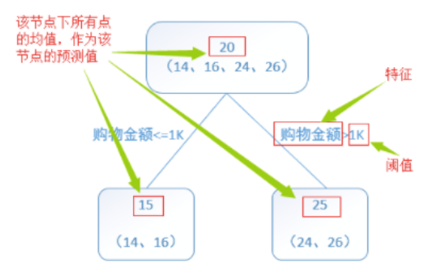
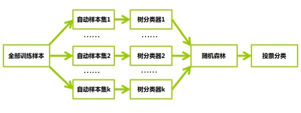
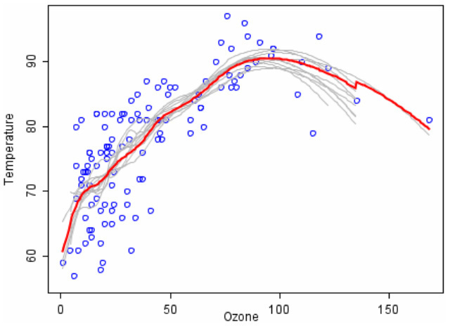

# 1. K近邻

## 1.1 模型

k 近邻法中，当训练集、距离度量、 K 值以及分类决策规则确定后，对于任何一个新的输入实例，它所属的类唯一地确定。这相当于根据上述要素将特征空间划分为一些子空间，确定子空间里的每个点所属的类。

## 1.2 距离度量

特征空间中两个实例点的距离可以反映出两个实例点之间的相似性程度。 K 近邻模型的特征空间一般是 N 维实数向量空间，使用的距离可以是欧式距离，也可以是其他距离。

- 欧氏距离：**最常见的两点之间或多点之间的距离表示法**，又称之为欧几里得度量，它定义于欧几里得空间中 

  

- 曼哈顿距离：我们可以定义曼哈顿距离的正式意义为 `L1` 距离或城市区块距离，也就是在欧几里得空间的固定直⻆坐标系上两点所形成的线段对轴产生的投射的距离总和。

  通俗来讲，想想你在曼哈顿要从一个十字路口开车到另一个十字路口，驾驶距离是两点间的直线距离吗？显然不是，除非你能穿越大楼。而实际驾驶距离就是这个“曼哈顿距离”,此即曼哈顿距离名称的来源，同时，曼哈顿距离也称为城市街区距离。 

  

- 切比雪夫距离：

  

- 闵可夫斯基距离：它不是一种距离，而是一组距离的定义。

  

 

  当 k=1 时，即曼哈顿距离

  当 k=2 时，即欧式距离

  当 ，即切比雪夫距离 

- 标准化欧氏距离：对样本集先进行标准化 ，经过简单的推导就可以得到来标准化欧氏距离。 

  

- 夹⻆余弦：几何中夹⻆余弦可用来衡量两个向量方向的相似度，机器学习中借用这一概念来衡量向量之间的相似度。

  

 

## 1.3 K 值的选择

K 值得选择会对 K 近邻法的结果产生重要影响。

- 如果选择较小的 K 值，就相当于用较小的领域中的训练实例进行预测， “学习”近似误差会减小，只有与输入实例较近或相似的训练实例才会对预测结果起作用，与此同时带来的问题是“学习”的估计误差会增大，**换句话说， K 值得减小就意味着整体模型变得复杂，容易发成过拟合（容易受到训练数据的噪声而产生的过拟合的影响）**。
- 如果选择较大的 K 值，就相当于用较大领域中的训练实例进行预测，其优点是可以减小学习的估计误差，但缺点是学习的近似误差会增大。这时候，与输入实例较远的训练实例也会对预测器作用，使预测发生错误，**且 K 值得增大就意味着整体的模型变得简单**。 

- 如果 K=N。那么无论输入实例是什么，都将简单地预测它属于在训练实例中最多的类。这时，模型过于简单，完全忽略训练实例中的大量有用信息，是不可取的（最近邻列表中可能包含远离其近邻的数据点） 

**在实际应用中， K 值一般取一个比较小的数值。通常采用交叉验证法来选取最优的 K 值（经验规则： K 一般低于训练样本数的平方根）。 **

## 1.4 分类决策规则

K 近邻法中的分类决策规则往往是多数表决，即由输入实例的 K 个邻近的训练实例中的多数类决定输入实例的类。 

## 1.5 K 近邻的优缺点

### 1.5.1 优点

- 简单、易于理解、易于实现、无需估计参数、无需训练。
- 适合对稀有事件进行分类（如大概流式率很低时，比如 0.5%，构造流失预测模型）；
- 特别适合多酚类问题，如根据基因特征来判断其功能分类， KNN 比 SVM 的表现要好。 

### 1.5.2 缺点

- 懒惰算法，对测试样本分类时的计算量大，内存开销大，评分慢。

- 可解释性较差，无法给出决策树那样的规则。

- 当样本不平衡时，如一个类的样本容量很大，而其他类样本容量很小时，有可能导致当输入一个新样本时，该样本的 K 个邻居中大容量类的样本占多数。

- KNN 是一种懒惰算法，平时不好好学习，考试（对测试样本分类）时才临阵磨枪（临时去找K个近邻），懒惰的后果，构造模型很简单，但在测试样本分类地系统开销大，因为要扫描全部训练样本并计算距离。已经有一些方法提高计算的效率，例如压缩训练样本量。 

- 决策树和基于规则的分类器都是积极学习 `eager learner` 的例子，因为一旦训练数据可用，它们就开始习从输入属性到类标号的映射模型。一个相反的策略是推迟对训练数据的建模，直到需要分类测试样例时再进行。采用这种策略的技术被称为消极学习法 `lazy learner` 。最近邻分类器就是这样的一种方法。 

## 1.6 K 近邻的应用

TODO

# 2. 线性回归

## 2.1 线性回归模型

特征映射相关技术，包括特征哈希、特征学习、Kernel 等。 

## 2.2 目标函数

映入一个函数来衡量  表示真实值 y 好坏的程度， 该函数称为损失函数（lossfunction，也称为错误函数）。数学表示如下： 

如果不考虑诸如过拟合等其他问题，这就是我们需要优化的目标函数。 

## 2.3 目标函数的概率解释

一般地，**机器学习中不同的模型会有相应的目标函数。而回归模型（尤其是线性回归类）的目标函数通常用平方损失函数来作为优化的目标函数（即真实值与预测值之差的平方和）**。

为什么要选用误差平方和作为目标函数呢？答案可以从概率论中的中心极限定理、高斯分布等知识中找到。 

### 2.3.1 中心极限定理

目标函数的概率解释需要用到中心极限定理。**中心极限定理本身就是研究独立随机变量和的极限分布为正态分布的问题**。 

公式推导：TODO

### 2.3.2 高斯分布

主要说明的是误差服从高斯分布。

TODO

### 2.3.3 极大似然估计与损失函数极小化等价 

推导：TODO

经过最大似然估计推导出来的待优化的目标函数与平方损失函数是等价的。因此可以得出结论：

**线性回归误差平方损失极小化与极大似然估计等价。其实在概率模型中，目标函数的原函数（或对偶函数）极小化（或极大化）与极大似然估计等价，这是一个带有普遍性的结论。比如在最大熵模型中，有对偶函数极大化与极大似然估计等价的结论**。 

## 2.4 参数估计

如何调整参数  使得  取得最小值？方法有很多，这里介绍几种比较经典的方法，即最小二乘法、梯度下降法以及牛顿法。 

### 2.4.1 最小二乘法

目标函数的矩阵形式为 ：

最小二乘法求解，对  求导，梯度（矩阵求导）：

TODO

令其为零，求得驻点： 

TODO

### 2.4.2 梯度下降法

TODO

## 2.5 线性回归的优缺点

### 2.5.1 优点

- 线性回归的理解和解释都非常直观，还能通过正则化来避免过拟合。此外，线性模型很容易通过随机梯度下降来更新数据模型。

### 2.5.2 缺点

- 线性回归在处理非线性关系时非常糟糕，在识别复杂的模式上也不够灵活，而添加正确的相互作用项或多项式又极为棘手且耗时。

## 2.6 线性回归的应用

TODO

# 3. 逻辑斯蒂回归

## 3.1 逻辑斯蒂分布

TODO

## 3.2 逻辑斯蒂回归模型

线性回归的应用场合大多是回归分析，一般不用在分类问题上。原因可以概括为以下两个：

- 回归模型是连续型模型，即预测出的值都是连续值（实数值），非离散值； 

- 预测结果受样本噪声的影响比较大。 

### 3.2.1 LR 模型表达式

### 3.2.2 理解 LR 模型

#### 3.2.2.1 对数几率

TODO

#### 3.2.2.2 函数映射

TODO

#### 3.2.2.3 概率解释

## 3.3 模型参数估计

### 3.3.1 Sigmoid函数

此外非常重要的， sigmoid 函数求导后为： 

<a href="https://www.codecogs.com/eqnedit.php?latex=\begin{align*}&space;{g}'(x)&space;&=&space;\left&space;(&space;\frac{1}{1&space;&plus;&space;e^{-x}}&space;\right&space;)'&space;=&space;\frac{e^{-x}}{(1&space;&plus;&space;e^{-x})^2}&space;\\&space;&=&space;\frac{1}{1&space;&plus;&space;e^{-x}}&space;\cdot&space;\frac{e^{-x}}{1&space;&plus;&space;e^{-x}}&space;=&space;\frac{1}{1&space;&plus;&space;e^{-x}}&space;\cdot&space;\left&space;(&space;1&space;-&space;\frac{1}{1&space;&plus;&space;e^{-x}}&space;\right&space;)&space;\\&space;&=&space;g(x)&space;\cdot&space;(1&space;-&space;g(x))&space;\end{align*}" target="_blank"></a>

TODO

### 3.3.2 参数估计推导

上一节的公式不仅可以理解为在已观测的样本空间中的概率分布表达式。如果从统计学的角度可 以理解为参数  似然性的函数表达式（即似然函数表达式）。就是利用已知的样本分布，找到最有可能（即最大概率）导致这种分布的参数值；或者说什么样的参数才能使我们观测到目前这组数据的概率最大。参数在整个样本空间的似然函数可表示为（目标函数是最大化似然函数，假设样本之间是相互独立的，那么整个样本集生成的概率即为所有样本生成概率的乘积）： 

为了方便参数求解，对这个公式取对数，可得对数似然函数： 

最大化对数似然函数其实就是最小化交叉熵误差（Cross Entropy Error）

先不考虑累加和，我们针对每一个参数  求偏导：

<a href="https://www.codecogs.com/eqnedit.php?latex=\begin{align*}&space;\frac{\partial&space;}{\partial&space;\theta_j}l(\theta)&space;&=&space;\left&space;(&space;y&space;\frac{1}{h_{\theta}(x)}&space;-&space;(1&space;-&space;y)&space;\frac{1}{1&space;-&space;h_{\theta}(x)}&space;\right&space;)&space;\frac{\partial&space;}{\partial&space;\theta_j}&space;h_{\theta}(x)&space;\\&space;&=&space;\left&space;(&space;\frac{y(1&space;-&space;h_{\theta}(x))&space;-&space;(1&space;-&space;y)h_{\theta}(x)}{h_{\theta}(x)(1&space;-&space;h_{\theta}(x))}&space;\right&space;)&space;h_{\theta}(x)&space;(1&space;-&space;h_{\theta}(x))&space;\frac{\partial&space;}{\partial&space;\theta_j}&space;\theta^Tx&space;\\&space;&=&space;(y&space;-&space;h_{\theta}(x))x_j&space;\end{align*}" target="_blank"></a>

详细的推导见下图：

最后，通过扫描样本，迭代下述公式可求得参数： 

其中  表示学习率，又称学习步长。此外还有 Batch GD，共轭梯度，拟牛顿法（LBFGS），ADMM分布学习算法等都可以用来求解参数。另作优化算法一章进行补充。

以上的推导是 LR 模型的核心部分，在机器学习相关面试中， LR 模型公式推导可能是考察频次最高的一个点。要将其熟练推导。 

### 3.3.3 分类边界

 TODO

## 3.4 延伸

### 3.4.1 生成模型与判别模型

TODO

### 3.4.2 多分类

Softmax 回归是直接对逻辑回归在多分类的推广，相应的模型也可以叫做多元逻辑回归（Multinomial Logistic Regression）。模型通过 softmax 函数来对概率建模 。

TODO

### 3.4.3 LR 与 SVM

两种方法都是常用的分类算法，从目标函数来看，区别在于逻辑回归采用的是 logistical loss，svm 采用的是hinge loss。这两个损失函数的目的都是增加对分类影响较大的数据点的权重，减少与分类关系较小的数据点的权重。 SVM 的处理方法是只考虑 support vectors，也就是和分类最相关的少数点，去学习分类器。而逻辑回归通过非线性映射，大大减小了离分类平面较远的点的权重，相对提升了与分类最相关的数据点的权重。两者的根本目的都是一样的。

此外，根据需要，两个方法都可以增加不同的正则化项，如 L1,L2 等等。所以在很多实验中，两种算法的结果是很接近的。但是逻辑回归相对来说模型更简单，好理解，实现起来，特别是大规模线性分类时比较方便。而 SVM 的理解和优化相对来说复杂一些。但是 SVM 的理论基础更加牢固，有一套结构化风险最小化的理论基础，虽然一般使用的人不太会去关注。还有很重要的一点， SVM 转化为对偶问题后，分类只需要计算与少数几个支持向量的距离，这个在进行复杂核函数计算时优势很明显，能够大大简化模型和计算量。

两者对异常的敏感度也不一样。同样的线性分类情况下，如果异常点较多的话，无法剔除，首先LR， LR 中每个样本都是有贡献的，最大似然后会自动压制异常的贡献，SVM + 软间隔对异常还是比较敏感，因为其训练只需要支持向量，有效样本本来就不高，一旦被干扰，预测结果难以预料。 

## 3.5 逻辑斯蒂回归的优缺点

### 3.5.1 优点

- 适合需要得到一个分类概率的场景
- 计算代价不高，容易理解实现。LR在时间和内存需求上相当高效。它可以应用于分布式数据，并且还有在线算法实现，用较少的资源处理大型数据
- LR 对于数据中小噪声的鲁棒性很好，并且不会受到轻微的多重共线性的特别影响。（严重的多重共线性则可以使用逻辑回归结合 L2 正则化来解决，但是若要得到一个简约模型，L2 正则化并不是最好的选择，因为它建立的模型涵盖了全部的特征。）

### 3.5.2 缺点

- 容易欠拟合，分类精度不高
- 数据特征有缺失或者特征空间很大时表现效果并不好

## 3.6 逻辑斯蒂回归的应用

LR 是解决工业规模问题最流行的算法。在工业应用上，如果需要分类的数据拥有很多有意义的特征，每个特征都对最后的分类结果有或多或少的影响，那么最简单最有效的办法就是将这些特征线性加权，一起参与到决策过程中。比如预测广告的点击率，从原始数据集中筛选出符合某种要求的有用的子数据集等等。

# 4. 决策树

## 4.1 决策树模型的两种解释

分类决策树模型是⼀种描述对实例进行分类的树形结构。决策树由结点和有向边组成。

结点有两种类型：

- 内部结点
- 叶节点

内部结点表示一个特征或属性，叶节点表示一个类。 

### 4.1.1 决策树与if-then规则 

可以将决策树看成一个 if-then 规则的集合。即由决策树的根结点到叶节点的每一条路径构建一条规则；路径上内部结点的特征对应着规则的条件，而叶结点的类对应着规则的结论。

决策树的路径或其对应的 if-then 规则集合的重要性质：互斥且完备（每一个实例都被一条路径或一条规则所覆盖，且只被一条路径或一条规则所覆盖，这里的覆盖是指实例的特征与路径上的特征一致或实例满足规则的条件） 

### 4.1.2 决策树与条件概率分布 

决策树还表示给定特征条件下类的条件概率分布，它定义在特征空间的一个划分。将特征空间划分为互不相交的单元，并在每个单元定义一个类的概率分布就构成了一个条件概率分布。决策树的每一条路径对应于划分中的一个单元。

假设 X 为表示特征的随机变量， Y 为表示类的随机变量，那么这个条件概率分布可以表示为 `P(X|Y)` , 各叶结点上的条件概率往往偏向于某一个类，即属于某一类的概率越大。决策树分类时将该结点的实例强行分到条件概率大的那一类去。 

## 4.2 特征选择

### 4.2.1 特征选择问题

若利用一个特征进行分类的结果与随机分类的结果没有很大差异，则称这个特征是没有分类能力的。**特征选择的准则是信息增益或信息增益比**。直观上，若一个特征具有更好的分类能力，或者说，按照这一特征将训练数据集分割为子集，使得各个子集在当前条件下有最好的分类，那么就更应该选择这个特征。信息增益可以表示这一直观的准则。 

### 4.2.2 信息增益

#### 4.2.2.1 熵

在信息论与概率统计中，熵表示随机变量**不确定性**的度量。 设 X 是一个取有限个值得离散随机变量，其概率分布为 

则随机变量 X 的熵定义为 

若  等于0，定义 `0log0 = 0`，熵的单位为比特或者纳特。 

#### 4.2.2.2 条件熵

`H(Y|X)`表示在已知随机变量 X 的条件下随机变量 Y 的不确定性定义为 X 给定条件下 Y 的条件概率分布的熵对 X 的数学期望 

经验熵和经验条件熵：当熵和条件熵中的概率由数据估计（特别是极大似然估计）得到时，所对应的熵与条件熵分别称为经验熵和条件经验熵。 

#### 4.2.2.3 信息增益

**信息增益表示得知特征 X 的信息而使得类 Y 的信息的不确定性减少的程度**。特征 A 对训练数据集 D 的信息增益 `g(D, A)`，定义为集合 D 的经验熵 H(D) 与特征 A 给定条件下 D 的经验条件熵 `H(D|A)`之差，即 

一般地，**熵 H(Y) 与条件熵 H(Y|X) 之差称为互信息**。**决策树学习中的信息增益等价于训练数据集中类与特征的互信息**。 

于是我们可以应用信息增益准则来选择特征，信息增益表示由于特征 A 而使得对数据集 D 的分类的不确定性减少的程度。对数据集 D 而言，信息增益依赖于特征，不同的特征往往具有不同的信息增益。**信息增益大的特征具有更强的分类能力**。 

#### 4.2.2.4 信息增益算法

根据信息增益准则的特征选择方法为对训练数据集（或子集） D，计算其每个特征的信息增益，并比较它们的大小，选择信息增益最大的特征。 

算法步骤：TODO

### 4.2.3 信息增益比

**以信息增益作为划分训练数据集的特征，存在偏向于选择取值较多的特征的问题**。使用信息增益比可以对这一问题进行校正。

**信息增益比表示特征 A 对训练数据集 D 的信息增益比**。  定义为其信息增益 `g(D, A)` 与训练数据集 D 关于特征 A 的值的熵  之比，即 

### 4.2.4 基尼系数

分类问题中，假设有 K 个类，样本点属于第 k 类的概率为 ，则概率分布的基尼系数定义为 

若样本集合 D 根据特征 A 是否取某一可能值 a 被分割成  和  两部分，即 

则在特征 A 的条件下，集合 D 的基尼指数定义为 

基尼系数 `Gini(D)` 表示集合 D 的不确定性，表示经 `A=a` 分割后集合 D 的不确定性。基尼系数越大，样本集合的不确定性越大，与熵类似。

从下图可以看出基尼指数和熵之半的曲线很接近，都可以近似地代表分类误差率。 

## 4.3 决策树的生成

### 4.3.1 ID3 算法

ID3算法的核心是在决策树各个结点上应用信息增益准则选择特征，递归地建构决策树。

其具体方法为：从根结点开始，对结点计算所有可能的特征的信息增益，选择信息增益最大的特征作为结点的特征，由该特征的不同取值建立子结点；再对子结点递归地调用以上方法，构建决策树；直到所有特征的信息增益均很小或没有特征可以选择为止。最后得到一个决策树。**ID3相当于用极大似然法进行概率模型的选择**。但是ID3算法只有树的生成，所以该算法生成的树容易产生过拟合。 

具体算法步骤：TODO

### 4.3.2 C4.5

与 ID3 算法相似， C4.5 算法对 ID3 算法进行了改进， C4.5 在生成的过程中，用信息增益比来选择特征 

### 4.3.3 CART

分类树与回归树（classification and regression tree， CART）模型（Breiman）由特征选择、树生成及剪枝组成，既可用于分类也可用于回归。 CART 是在给定输入随机变量 X 条件下输出变量 Y 的条件概率分布的学习方法。它假定决策树是二叉树，内部取值为“是”（左分支）和“否”（右分支）。

它的基本步骤为

- 决策树生成：基于训练数据集生成决策树，生成的决策树要尽量大。
- 决策树剪枝：**用验证数据集对已生成的树进行剪枝并选择最优子树，这是用损失函数最小作为剪枝的标准**。 

#### 4.3.3.1 分类树

**对分类树用基尼系数（Gini index）最小化准则，进行特征选择，生成二叉树**。

具体算法步骤如下：

- 设结点的训练数据集为 D，计算现有特征对该数据集的基尼指数。此时，对每一个特征 A，对其可能取的每个值 a，根据样本点对 `A = a` 的测试为"是"或者“否”将 D 分割为  和  两部分，计算其基尼系数。
- 在所有可能的特征 A 以及他们所有可能的切分点 a 中，选择基尼系数最小的特征及其对应的切分点作为最优特征与最优切分点。依最优特征与最优切分点，从现结点生成两个子结点，将训练数据集依特征分配到两个子结点中去。
- 对两个子结点递归地调用上述两个步骤，直至满足停止条件。
- 生成 CART 决策树 

#### 4.3.3.2 回归树

首先看一个简单的回归树生成实例： 

接下来具体说说回归树是如何进行特征选择生成二叉回归树的。 

利用最小二乘回归树生成算法来生成回归树

具体算法步骤：TODO

## 4.4 决策树的剪枝

### 4.4.1 剪枝

决策树的过拟合指的是学习时过多地考虑如何提高对训练数据的正确分类，从而构建出过于复杂的决策树。解决过拟合的办法是考虑决策树的复杂度，对已生成的决策树进行简化，即剪枝（从已生成的树上裁剪掉一些子树或叶结点，并将其根结点或父结点作为新的叶结点，从而简化分类树模型）。 

剪枝算法：TODO

其中， C(T) 表示模型对训练数据的预测误差，即模型与训练数据的拟合程度， `|T|`  表示模型复杂度，参数 `a ≥ 0` 控制两者之间的影响。较大的 a 促使选择较简单的模型，较小的 a 促使选择较复杂的模型。 `a = 0` 意味着只考虑模型与训练数据的拟合程度，不考虑模型的复杂度。 

决策树生成只考虑了通过信息增益（或信息增益比）对训练数据进行更好的拟合。**而决策树剪枝通过优化损失函数还考虑了减小模型复杂度**。**决策树生成学习局部的模型，而决策树剪枝学习整体的模型**。**此损失函数的极小化等价于正则化的极大似然估计，即利用损失函数最小原则进行剪枝就是用正则化的极大似然估计进行模型选择**。 

### 4.4.2 CART 剪枝

CART 剪枝算法从“完全生长”的决策树的底端减去一些子树，使决策树变小（模型变简单），从而能够对未知数据有更准确的预测 

具体步骤：TODO

## 4.5 决策树的优缺点

### 4.5.1 优点

TODO

### 4.5.2 缺点

TODO

## 4.6 决策树的应用

TODO

# 5. 随机森林

## 5.1 基本原理

顾名思义，是用随机的方式建立一个森林，森林里面有很多的决策树组成，**随机森林的每一棵决策树之间是没有关联的**。在得到森林之后，当有一个新的输入样本进入的时候，就让森林中的每一棵决策树分别进行一下判断，看看这个样本应该属于哪一类（对于分类算法），然后看看哪一类被选择最多，就预测这个样本为那一类。

我们可以这样比喻随机森林算法：每一棵决策树就是一个精通于某一个窄领域的专家（因为我们从 M 个特征中选择 m 个让每一棵决策树进行学习），这样在随机森林中就有了很多个精通不同领域的专家，对一个新的问题（新的输入数据），可以用不同的⻆度去看待它，最终由各个专家，投票得到结果。

随机森林算法有很多优点：

- 在数据集上表现良好
- 在当前的很多数据集上，相对其他算法有着很大的优势
- 它能够处理很高维度（feature很多）的数据，并且不用做特征选择
- 在训练完后，它能够给出哪些 feature 比较重要
- 在创建随机森林的时候，对 generlization error 使用的是无偏估计
- 训练速度快
- 在训练过程中，能够检测到 feature 间的互相影响
- 容易做成并行化方法
- 实现比较简单 

## 5.2 随机森林的生成

### 5.2.1 生成步骤

步骤如下：

- 如果训练集大小为 N，对于每棵树而言，**随机且有放回地从训练集中抽取 N 个训练样本（bootstrap抽样方法）**，作为该树的训练集；每棵树的训练集都是不同的，但里面包含重复的训练样本
- 如果每个样本的特征维度为 M，指定一个常数 m，且 m<M ，随机地从 M 个特征中选取 m 个特征子集，每次树进行分裂时，从这 m 个特征中选择最优的；
- 每棵树都尽可能最大程度地生长，并且没有剪枝过程。 

### 5.2.2 影响分类效果的参数

随机森林的分类效果（即错误率）与以下两个因素有关：

- 森林中任意两棵树的相关性：相关性越大，错误率越大
- 森林中每棵树的分类能力：每棵树的分类能力越强，整个森林的错误率越低

**减小特征选择个数 m，树的相关性和分类能力也会相应的降低；增大 m，两者也会随之增大**。所以关键问题是如何选择最优的 m（或者是范围），这也是随机森林唯一的一个参数。 

### 5.2.3 袋外误差率

如何选择最优的特征个数 m，要解决这个问题，我们主要依据计算得到的袋外错误率oob error（out-of-bag error）。

**随机森林有一个重要的优点就是，没有必要对它进行交叉验证或者用一个独立的测试集来获得误差的一个无偏估计。它可以在内部进行评估，也就是说在生成的过程中就可以对误差建立一个无偏估计**。

我们知道，在构建每棵树时，我们对训练集使用了不同的 bootstrap  sample（随机且有放回地抽取）。所以对于每棵树而言，部分训练实例没有参与这棵树的生成，它们称为第 k 棵树的 oob 样本。

袋外错误率（oob error）计算方式如下：

- 对每个样本计算它作为 oob 样本的树对它的分类情况
- 以简单多数投票作为该样本的分类结果
- 最后用误分个数占样本总数的比率作为随机森林的 oob 误分率 

## 5.3 随机采样与完全分裂

在建立每一棵决策树的过程中，有两点需要注意，分别是采样与完全分裂。 

### 5.3.1 随机采样

首先是两个随机采样的过程， random forest对输入的数据要进行、列的采样。对于行采样，采用有放回的方式，也就是在采样得到的样本集合中，可能有重复的样本。假设输入样本为 N 个，那么采样的样本也为 N 个。这样使得在训练的时候，每一棵树的输入样本都不是全部的样本，使
得相对不容易出现 over-fitting。然后进行列采样，从 M 个 feature 中，选择 m 个 (m << M)。 

#### 5.3.1.1 有放回抽样的解释

如果不是有放回的抽样，那么每棵树的训练样本都是不同的，都是没有交集的，这样每棵树都是”有偏的”，都是绝对”片面的”（当然这样说可能不对），也就是说每棵树训练出来都是有很大的差异的；而随机森林最后分类取决于多棵树（弱分类器）的投票表决，这种表决应该是”求同”，因此使用完全不同的训练集来训练每棵树这样对最终分类结果是没有帮助的，这样无异于是”盲人摸象”。

#### 5.3.1.2 对 Bagging 的改进

随机森林对 Bagging 的改进就在于随机采用的不同，即以下两点：

- Random forest 是选与输入样本的数目相同多的次数（可能一个样本会被选取多次，同时也会造成一些样本不会被选取到），而 bagging 一般选取比输入样本的数目少的样本；
- bagging 是用全部特征来得到分类器，而 Random forest 是需要从全部特征中选取其中的一部分来训练得到分类器； 一般 Random forest 效果比 bagging 效果好！

### 5.3.2 完全分裂

之后就是对采样之后的数据使用完全分裂的方式建立出决策树，这样决策树的某一个叶子节点要么是无法继续分裂的，要么里面的所有样本的都是指向的同一个分类。一般很多的决策树算法都一个重要的步骤 - 剪枝，但是这里不这样干，由于之前的两个随机采样的过程保证了随机性，所以就算不剪枝，也不会出现over-fitting。 按这种算法得到的随机森林中的每一棵都是很弱的，但是大家组合起来就很厉害了。

## 5.4 随机森林的变体

也可以使用 SVM、Logistic 回归等其他分类器，习惯上，这些分类器组成的“总分类器”，仍然叫做随机森林。

比如回归问题，图中离散点为臭氧(横轴)和温度(纵轴)的关系，试拟合变化曲线，记原始数据为 D，长度为 N (即图中有 N 个离散点)

算法过程为：

- 1）做100次 bootstrap，每次得到的数据 Di，Di 的长度为 N
- 2）对于每一个 Di，使用局部回归(LOESS)拟合一条曲线(图 中灰色线是其中的10条曲线)
- 3）将这些曲线取平均，即得到红色的最终拟合曲线
- 4）显然，红色的曲线更加稳定，并且没有过拟合明显减弱

# 6. AdaBoost

 

# Reference

- [盘点｜最实用的机器学习算法优缺点分析，没有比这篇说得更好了](https://juejin.im/post/5930cc4c2f301e006bd4b2a9) - 掘金
- [机器学习 —— 基础整理（五）线性回归；二项Logistic回归；Softmax回归及其梯度推导；广义线性模型](https://www.cnblogs.com/Determined22/p/6362951.html)
- [Stanford机器学习课程笔记——LR的公式推导和过拟合问题解决方案](https://blog.csdn.net/puqutogether/article/details/43191099)
- [什么是无偏估计？](https://www.zhihu.com/question/22983179) - 知乎

