## Index

<!-- TOC -->

* [1. CNN的卷积核是单层的还是多层的？](#1-cnn的卷积核是单层的还是多层的)
* [2. 什么是卷积？](#2-什么是卷积)
* [3. 什么是 CNN 的池化 pool 层？](#3-什么是-cnn-的池化-pool-层)
* [4. 简述下什么是生成对抗网络](#4-简述下什么是生成对抗网络)
* [5. 学梵高作画的原理是什么？](#5-学梵高作画的原理是什么)
* [6. 请简要介绍下 tensorflow 的计算图](#6-请简要介绍下-tensorflow-的计算图)
* [7. 你有哪些 deep learning（rnn、cnn）调参的经验？](#7-你有哪些-deep-learningrnncnn调参的经验)

  - [7.1 参数初始化](#71-参数初始化)

  - [7.2 数据预处理方式](#72-数据预处理方式)

  - [7.3 训练技巧](#73-训练技巧)

  - [7.4 Ensemble](#74-ensemble)
* [8. CNN在各个领域应用的共性](#8-cnn在各个领域应用的共性)
* [9. LSTM 结构推导，为什么比 RNN 好？](#9-lstm-结构推导为什么比-rnn-好)
* [10. Sigmoid、Tanh、ReLu这三个激活函数有什么缺点或不足，有没改进的激活函数。](#10-sigmoidtanhrelu这三个激活函数有什么缺点或不足有没改进的激活函数)
* [11. 为什么引入非线性激励函数？](#11-为什么引入非线性激励函数)
* [12. 请问人工神经网络中为什么ReLu要好过于tanh和sigmoid function？](#12-请问人工神经网络中为什么relu要好过于tanh和sigmoid-function)
* [13. 为什么LSTM模型中既存在sigmoid又存在tanh两种激活函数，而不是选择统一一种sigmoid或者tanh？这样做的目的是什么？](#13-为什么lstm模型中既存在sigmoid又存在tanh两种激活函数而不是选择统一一种sigmoid或者tanh这样做的目的是什么)
* [14. 如何解决RNN梯度爆炸和弥散的问题？](#14-如何解决rnn梯度爆炸和弥散的问题)
* [15. 什麽样的资料集不适合用深度学习？](#15-什麽样的资料集不适合用深度学习)
* [16. 广义线性模型是怎被应用在深度学习中？](#16-广义线性模型是怎被应用在深度学习中)
* [17. 如何解决梯度消失和梯度膨胀](#17-如何解决梯度消失和梯度膨胀)
* [18. 简述神经网络的发展历史](#18-简述神经网络的发展历史)
* [19. 深度学习常用方法](#19-深度学习常用方法)

  - [19.1 反向传播](#191-反向传播)

  - [19.2 随机梯度下降](#192-随机梯度下降)

  - [19.3 学习率衰减](#193-学习率衰减)

  - [19.4 dropout](#194-dropout)

  - [19.5 max pooling](#195-max-pooling)

  - [19.6 批标准化](#196-批标准化)

  - [19.7 long short-term memory](#197-long-short-term-memory)

  - [19.8 skip-gram](#198-skip-gram)

  - [19.9 连续词袋](#199-连续词袋)

  - [19.10 迁移学习](#1910-迁移学习)
* [20. 请简述神经网络的发展史。](#20-请简述神经网络的发展史)

<!-- /TOC -->

## 1. CNN的卷积核是单层的还是多层的？

一般而言，深度卷积网络是一层又一层的。**层的本质是特征图, 存贮输入数据或其中间表示值**。一组卷积核则是联系前后两层的网络参数表达体, 训练的目标就是每个卷积核的权重参数组。

描述网络模型中某层的厚度，通常用名词通道 channel 数或者特征图 feature map 数。**不过人们更习惯把作为数据输入的前层的厚度称之为通道数（比如 RGB 三色图层称为输入通道数为 3），把作为卷积输出的后层的厚度称之为特征图数**。

卷积核( filter )一般是 3D 多层的，除了面积参数, 比如 `3x3` 之外, 还有厚度参数 `H`（2D 的视为厚度 1). 还有一个属性是卷积核的个数 `N`。

- 卷积核的厚度 `H`, 一般等于前层厚度 `M`(输入通道数或 feature map 数). 特殊情况 `M > H`。

- 卷积核的个数 `N`, 一般等于后层厚度(后层 feature maps 数，因为相等所以也用 `N` 表示)。

- 卷积核通常从属于后层，为后层提供了各种查看前层特征的视角，这个视角是自动形成的。

- 卷积核厚度等于 1 时为 2D 卷积，**对应平面点相乘然后把结果加起来，相当于点积运算**；

- 卷积核厚度大于 1 时为 3D 卷积，**每片分别平面点求卷积，然后把每片结果加起来**，作为 3D 卷积结果；

- `1x1` 卷积属于 3D 卷积的一个特例，有厚度无面积, 直接把每片单个点乘以权重再相加。

归纳之，**卷积的意思就是把一个区域，不管是一维线段，二维方阵，还是三维长方块，全部按照卷积核的维度形状，对应逐点相乘再求和，浓缩成一个标量值也就是降到零维度，作为下一层的一个 feature map 的一个点的值**！

> 可以比喻一群渔夫坐一个渔船撒网打鱼，鱼塘是多层水域，每层鱼儿不同。船每次移位一个 stride 到一个地方，每个渔夫撒一网，得到收获，然后换一个距离 stride 再撒，如此重复直到遍历鱼塘。
>
> - A 渔夫盯着鱼的品种，遍历鱼塘后该渔夫描绘了鱼塘的鱼品种分布；
> - B 渔夫盯着鱼的重量，遍历鱼塘后该渔夫描绘了鱼塘的鱼重量分布；
> - 还有 N-2 个渔夫，各自兴趣各干各的；
> - 最后得到 N 个特征图，描述了鱼塘的一切！
>
> 2D 卷积表示渔夫的网就是带一圈浮标的渔网，只打上面一层水体的鱼；
>
> 3D 卷积表示渔夫的网是多层嵌套的渔网，上中下层水体的鱼儿都跑不掉；
>
> `1x1` 卷积可以视为每次移位 stride，甩钩钓鱼代替了撒网；

下面解释一下特殊情况的 `M > H`：

实际上，除了输入数据的通道数比较少之外，中间层的 feature map 数很多，这样中间层算卷积会累死计算机（鱼塘太深，每层鱼都打，需要的鱼网太重了）。所以很多深度卷积网络把全部通道/特征图划分一下，每个卷积核只看其中一部分（渔夫 A 的渔网只打捞深水段，渔夫 B 的渔网只打捞浅水段）。这样整个深度网络架构是横向开始分道扬镳了，到最后才又融合。这样看来，很多网络模型的架构不完全是突发奇想，而是是被参数计算量逼得。特别是现在需要在移动设备上进行 AI 应用计算(也叫推断), 模型参数规模必须更小, 所以出现很多减少握手规模的卷积形式, 现在主流网络架构大都如此。

## 2. 什么是卷积？

对图像（不同的数据窗口数据）和滤波矩阵（一组固定的权重：因为每个神经元的多个权重固定，所以又可以看做一个恒定的滤波器 filter）做内积（逐个元素相乘再求和）的操作就是所谓的『卷积』操作，也是卷积神经网络的名字来源。

非严格意义上来讲，下图中红框框起来的部分便可以理解为一个滤波器，即带着一组固定权重的神经元。多个滤波器叠加便成了卷积层。


OK，举个具体的例子。比如下图中，图中左边部分是原始输入数据，图中中间部分是滤波器 filter，图中右边是输出的新的二维数据。

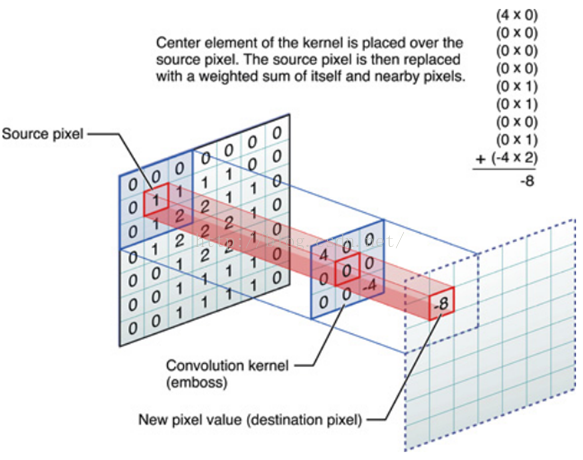

分解上图

对应位置上是数字先相乘后相加 =

中间滤波器 filter 与数据窗口做内积，其具体计算过程则是：

`4*0 + 0*0 + 0*0 + 0*0 + 0*1 + 0*1 + 0*0 + 0*1 + -4*2 = -8`

## 3. 什么是 CNN 的池化 pool 层？

**池化，简言之，即取区域平均或最大**，如下图所示（图引自cs231n）

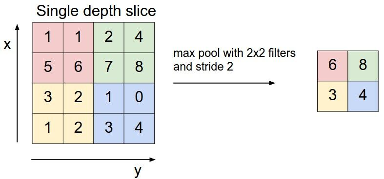

上图所展示的是取区域最大，即上图左边部分中 左上角 `2x2` 的矩阵中 `6` 最大，右上角 `2x2` 的矩阵中 `8` 最大，左下角 `2x2` 的矩阵中 `3` 最大，右下角 `2x2` 的矩阵中 `4` 最大，所以得到上图右边部分的结果：`6 8 3 4`。

## 4. 简述下什么是生成对抗网络

> [最简单易懂的GAN（生成对抗网络）教程：从理论到实践（附代码）](https://www.leiphone.com/news/201706/ty7H504cn7l6EVLd.html)

GAN 之所以是对抗的，是因为 GAN 的内部是竞争关系，一方叫 generator（生成器），**它的主要工作是生成图片，并且尽量使得其看上去是来自于训练样本的**。另一方是 discriminator（鉴别器），**其目标是判断输入图片是否属于真实训练样本**。

更直白的讲，将 generator 想象成假币制造商，而 discriminator 是警察。generator 目的是尽可能把假币造的跟真的一样，从而能够骗过 discriminator，即生成样本并使它看上去好像来自于真实训练样本一样。

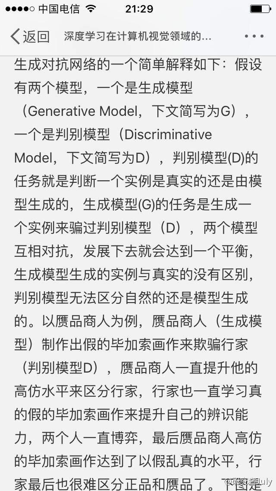

如下图中的左右两个场景：


## 5. 学梵高作画的原理是什么？


这里有篇如何做梵高风格画的实验教程[《教你从头到尾利用DL学梵高作画：GTX 1070 cuda 8.0 tensorflow gpu版》](http://blog.csdn.net/v_july_v/article/details/52658965)，至于其原理请看这个视频：[NeuralStyle艺术化图片（学梵高作画背后的原理）](http://www.julyedu.com/video/play/42/523)。

## 6. 请简要介绍下 tensorflow 的计算图

Tensorflow 是一个通过计算图的形式来表述计算的编程系统，计算图也叫数据流图，可以把计算图看做是一种有向图，**Tensorflow 中的每一个节点都是计算图上的一个 Tensor, 也就是张量，而节点之间的边描述了计算之间的依赖关系(定义时)和数学操作(运算时)**。如下两图表示：

```python
a=x*y
b=a+z
c=tf.reduce_sum(b)
```

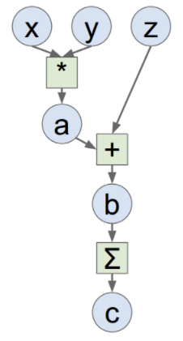

## 7. 你有哪些 deep learning（rnn、cnn）调参的经验？

> [你有哪些deep learning（rnn、cnn）调参的经验？](https://www.zhihu.com/question/41631631/answer/94816420) - 知乎

### 7.1 参数初始化
下面几种方式, 随便选一个, 结果基本都差不多。但是一定要做。否则可能会减慢收敛速度，影响收敛结果，甚至造成 Nan 等一系列问题。

下面的 `n_in` 为网络的输入大小，`n_out` 为网络的输出大小，`n` 为 `n_in` 或  `(n_in+n_out)*0.5`

Xavier 初始法论文：http://jmlr.org/proceedings/papers/v9/glorot10a/glorot10a.pdf

He 初始化论文：https://arxiv.org/abs/1502.01852

- uniform 均匀分布初始化：`w = np.random.uniform(low=-scale, high=scale, size=[n_in,n_out])`
  - Xavier 初始法，适用于普通激活函数 (tanh,sigmoid)：`scale = np.sqrt(3/n)`
  - He初始化，适用于ReLU：`scale = np.sqrt(6/n)`

- normal 高斯分布初始化：`w = np.random.randn(n_in,n_out) * stdev` # stdev 为高斯分布的标准差，均值设为 0
  - Xavier 初始法，适用于普通激活函数 (tanh,sigmoid)：`stdev = np.sqrt(n)`
  - He 初始化，适用于 ReLU：`stdev = np.sqrt(2/n)`

- svd 初始化：对 RNN 有比较好的效果。参考论文：https://arxiv.org/abs/1312.6120

### 7.2 数据预处理方式

- zero-center , 这个挺常用的. 

```python
X -= np.mean(X, axis = 0) # zero-center 
X /= np.std(X, axis = 0) # normalize
```

- PCA whitening, 这个用的比较少.

### 7.3 训练技巧

- 要做梯度归一化, 即算出来的梯度除以 minibatch size

- clip c (梯度裁剪): 限制最大梯度, 其实是 `value = sqrt(w1^2+w2^2….)` ,如果 value 超过了阈值,就算一个衰减系系数,让 value 的值等于阈值: `5,10,15`

- dropout 对小数据防止过拟合有很好的效果, 值一般设为 0.5,小数据上 dropout + sgd 在我的大部分实验中，效果提升都非常明显. 因此可能的话，建议一定要尝试一下。**dropout 的位置比较有讲究, 对于 RNN, 建议放到输入 -> RNN 与 RNN -> 输出的位置**. 关于 RNN 如何用 dropout , 可以参考这篇论文:http://arxiv.org/abs/1409.2329

- `adam`, `adadelta` 等,在小数据上,我这里实验的效果不如 `sgd`,  `sgd` 收敛速度会慢一些，但是最终收敛后的结果，一般都比较好。如果使用 `sgd` 的话,可以选择从 `1.0` 或者 `0.1` 的学习率开始, 隔一段时间, 在验证集上检查一下, 如果 `cost` 没有下降,  就对学习率减半.  我看过很多论文都这么搞, 我自己实验的结果也很好. 当然, 也可以先用 `ada` 系列先跑, 最后快收敛的时候, 更换成 `sgd` 继续训练.同样也会有提升. 据说 `adadelta` 一般在分类问题上效果比较好，`adam` 在生成问题上效果比较好。

- 除了 `gate` 之类的地方, 需要把输出限制成 `0-1` 之外,尽量不要用 `sigmoid` ,可以用 `tanh` 或者 `relu` 之类的激活函数.
  1. `sigmoid`函数在 `-4` 到 `4` 的区间里，才有较大的梯度。之外的区间，梯度接近 0，很容易造成梯度消失问题。
  2. 输入 0 均值，`sigmoid`函数的输出不是 0 均值的。

- rnn 的 `dim` 和 `embdding size` , **一般从 128 上下开始调整. batch size, 一般从 128 左右开始调整. batch size 合适最重要, 并不是越大越好**.

- `word2vec` 初始化, 在小数据上, 不仅可以有效提高收敛速度, 也可以可以提高结果.

- 尽量对数据做 `shuffle`
- LSTM 的 forget gate 的 bias , 用 `1.0` 或者更大的值做初始化, 可以取得更好的结果, 来自这篇论文:http://jmlr.org/proceedings/papers/v37/jozefowicz15.pdf, 我这里实验设成 1.0 , 可以提高收敛速度. 实际使用中, 不同的任务, 可能需要尝试不同的值.

- Batch Normalization 据说可以提升效果，不过我没有尝试过，建议作为最后提升模型的手段，参考论文：Accelerating Deep Network Training by Reducing Internal Covariate Shift

- 如果你的模型包含全连接层（MLP），并且输入和输出大小一样，可以考虑将 MLP 替换成 Highway Network , 我尝试对结果有一点提升，建议作为最后提升模型的手段，原理很简单，就是给输出加了一个 gate 来控制信息的流动，详细介绍请参考论文: http://arxiv.org/abs/1505.00387

- 来自@张馨宇的技巧：一轮加正则，一轮不加正则，反复进行。

### 7.4 Ensemble

Ensemble 是论文刷结果的终极核武器, 深度学习中一般有以下几种方式

- 同样的参数, 不同的初始化方式

- 不同的参数,通过 cross-validation , 选取最好的几组

- 同样的参数, 模型训练的不同阶段，即不同迭代次数的模型。

- 不同的模型, 进行线性融合. 例如 RNN 和传统模型.

更多深度学习技巧，请参见专栏：[炼丹实验室 - 知乎专栏](https://zhuanlan.zhihu.com/easyml)

## 8. CNN在各个领域应用的共性

**问：CNN最成功的应用是在CV，那为什么NLP和Speech的很多问题也可以用CNN解出来？为什么AlphaGo里也用了CNN？这几个不相关的问题的相似性在哪里？CNN通过什么手段抓住了这个共性？**

> - Deep Learning -Yann LeCun, Yoshua Bengio & Geoffrey Hinton
> - Learn TensorFlow and deep learning, without a Ph.D.
> - The Unreasonable Effectiveness of Deep Learning -LeCun 16 NIPS Keynote

**以上几个不相关问题的相关性在于，都存在局部与整体的关系，由低层次的特征经过组合，组成高层次的特征，并且得到不同特征之间的空间相关性**。如下图：低层次的直线／曲线等特征，组合成为不同的形状，最后得到汽车的表示。

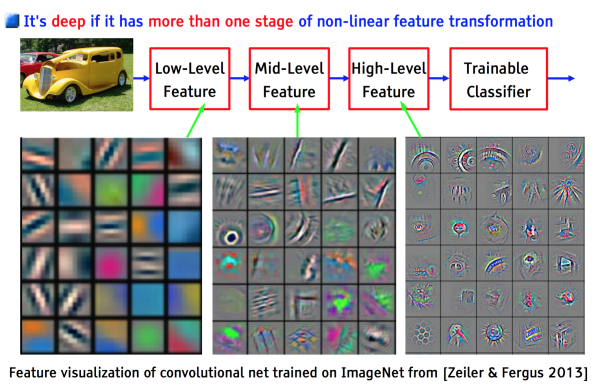

CNN 抓住此共性的手段主要有四个：

- 局部连接
- 权值共享
- 池化操作
- 多层次结构。

局部连接使网络可以提取数据的局部特征；权值共享大大降低了网络的训练难度，一个Filter只提取一个特征，在整个图片（或者语音／文本） 中进行卷积；池化操作与多层次结构一起，实现了数据的降维，将低层次的局部特征组合成为较高层次的特征，从而对整个图片进行表示。如下图：

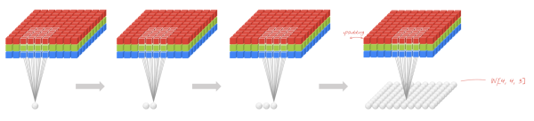


上图中，如果每一个点的处理使用相同的 Filter，则为全卷积，如果使用不同的 Filter，则为 Local-Conv。

> 本题解析来源：@许韩，链接：https://zhuanlan.zhihu.com/p/25005808
> 另，关于CNN，这里有篇文章[《 CNN笔记：通俗理解卷积神经网络》](http://blog.csdn.net/v_july_v/article/details/51812459)

## 9. LSTM 结构推导，为什么比 RNN 好？

**推导 forget gate，input gate，cell state， hidden information 等的变化；因为 LSTM 有进有出且当前的 cell informaton 是通过 input gate 控制之后叠加的，RNN 是叠乘，因此 LSTM 可以防止梯度消失或者爆炸**

## 10. Sigmoid、Tanh、ReLu这三个激活函数有什么缺点或不足，有没改进的激活函数。

> [面试笔试整理3：深度学习机器学习面试问题准备（必会）](http://blog.csdn.net/woaidapaopao/article/details/77806273)

sigmoid、Tanh、ReLU 的缺点在 121 问题中已有说明，为了解决 ReLU 的 dead cell 的情况，发明了 Leaky Relu， 即在输入小于 0 时不让输出为 0，而是乘以一个较小的系数，从而保证有导数存在。同样的目的，还有一个 ELU，函数示意图如下。

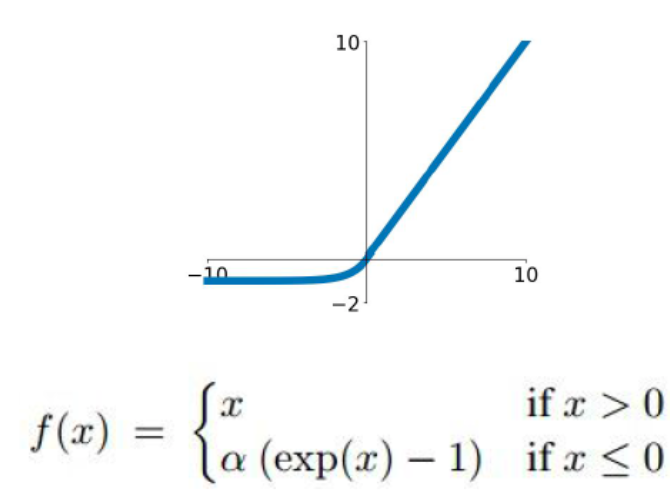

还有一个激活函数是 Maxout，即使用两套 `w,b`参数，输出较大值。本质上 Maxout 可以看做 Relu 的泛化版本，因为如果一套 `w,b` 全都是 0 的话，那么就是普通的 ReLU。Maxout 可以克服 Relu 的缺点，但是参数数目翻倍。 

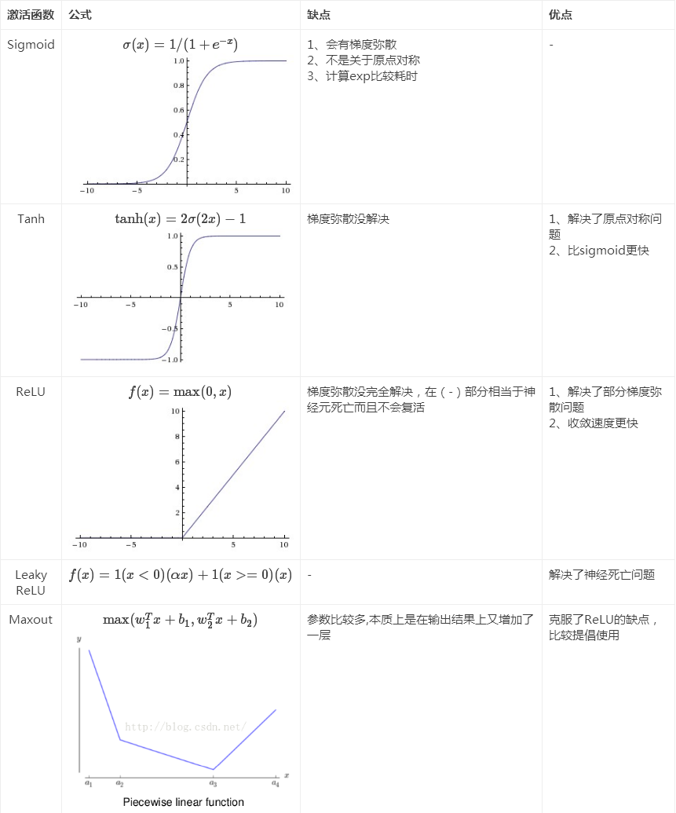

## 11. 为什么引入非线性激励函数？

> [请问人工神经网络中的activation function的作用具体是什么？为什么ReLu要好过于tanh和sigmoid function?](https://www.zhihu.com/question/29021768)

- 第一，对于神经网络来说，网络的每一层相当于 `f(wx+b)=f(w'x)`，对于线性函数，其实相当于 `f(x)=x`，那么在线性激活函数下，每一层相当于用一个矩阵去乘以 `x`，那么多层就是反复的用矩阵去乘以输入。根据矩阵的乘法法则，多个矩阵相乘得到一个大矩阵。所以线性激励函数下，多层网络与一层网络相当。比如，两层的网络 `f(W1*f(W2x))=W1W2x=Wx`。

- 第二，**非线性变换是深度学习有效的原因之一。原因在于非线性相当于对空间进行变换，变换完成后相当于对问题空间进行简化，原来线性不可解的问题现在变得可以解了**。

下图可以很形象的解释这个问题，左图用一根线是无法划分的。经过一系列变换后，就变成线性可解的问题了。

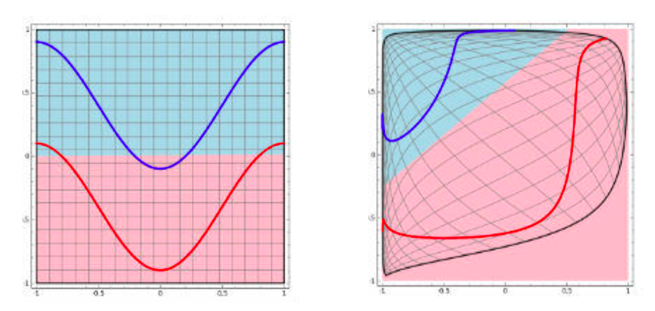

**如果不用激励函数（其实相当于激励函数是 `f(x) = x`），在这种情况下你每一层输出都是上层输入的线性函数，很容易验证，无论你神经网络有多少层，输出都是输入的线性组合，与没有隐藏层效果相当，这种情况就是最原始的感知机（Perceptron）了**。

正因为上面的原因，我们决定引入非线性函数作为激励函数，这样深层神经网络就有意义了（不再是输入的线性组合，可以逼近任意函数）。最早的想法是 sigmoid 函数或者 tanh 函数，输出有界，很容易充当下一层输入（以及一些人的生物解释）。

## 12. 请问人工神经网络中为什么ReLu要好过于tanh和sigmoid function？

> [请问人工神经网络中的activation function的作用具体是什么？为什么ReLu要好过于tanh和sigmoid function?](https://www.zhihu.com/question/29021768)

先看 sigmoid、tanh 和 RelU 的函数图：

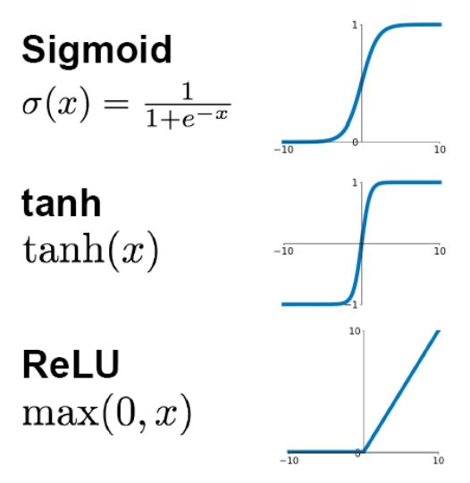

- 第一，采用 sigmoid 等函数，算激活函数时（指数运算），计算量大，反向传播求误差梯度时，求导涉及除法和指数运算，计算量相对大，而采用 Relu 激活函数，整个过程的计算量节省很多。

- 第二，对于深层网络，sigmoid 函数反向传播时，很容易就会出现梯度消失的情况（在 sigmoid 接近饱和区时，变换太缓慢，导数趋于 0，这种情况会造成信息丢失），这种现象称为饱和，从而无法完成深层网络的训练。而 ReLU 就不会有饱和倾向，不会有特别小的梯度出现。

- 第三，Relu 会使一部分神经元的输出为 0，这样就造成了网络的稀疏性，并且减少了参数的相互依存关系，缓解了过拟合问题的发生（以及一些人的生物解释 balabala）。当然现在也有一些对 relu 的改进，比如 prelu，random relu 等，在不同的数据集上会有一些训练速度上或者准确率上的改进，具体的大家可以找相关的 paper 看。

多加一句，**现在主流的做法，会多做一步 batch normalization，尽可能保证每一层网络的输入具有相同的分布[1]。而最新的 paper[2]，他们在加入 bypass connection 之后，发现改变 batch normalization 的位置会有更好的效果**。大家有兴趣可以看下。

> [1] Ioffe S, Szegedy C. Batch normalization: Accelerating deep network training by reducing internal covariate shift[J]. arXiv preprint arXiv:1502.03167, 2015.
>
> [2] He, Kaiming, et al. "Identity Mappings in Deep Residual Networks." arXiv preprint arXiv:1603.05027 (2016). 

## 13. 为什么LSTM模型中既存在sigmoid又存在tanh两种激活函数，而不是选择统一一种sigmoid或者tanh？这样做的目的是什么？

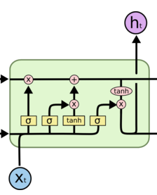

sigmoid 用在了各种 gate 上，产生 `0~1` 之间的值，这个一般只有 sigmoid 最直接了。

tanh 用在了状态和输出上，是对数据的处理，这个用其他激活函数或许也可以。

二者目的不一样

另可参见

> A Critical Review of Recurrent Neural Networks for Sequence Learning

的 section4.1，说了那两个 tanh 都可以替换成别的。

> [为什么LSTM模型中既存在sigmoid又存在tanh两种激活函数？](https://www.zhihu.com/question/46197687)

## 14. 如何解决RNN梯度爆炸和弥散的问题？

> [深度学习与自然语言处理(7)_斯坦福cs224d 语言模型，RNN，LSTM与GRU](https://blog.csdn.net/han_xiaoyang/article/details/51932536) - CSDN

为了解决梯度爆炸问题，Thomas Mikolov 首先提出了一个简单的启发性的解决方案，就是当梯度大于一定阈值的的时候，将它截断为一个较小的数。具体如算法1所述：

算法：**当梯度爆炸时截断梯度**（伪代码）

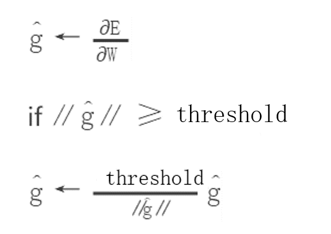

下图可视化了梯度截断的效果。它展示了一个小的 RNN（其中 `W` 为权值矩阵，`b` 为 bias 项）的决策面。这个模型是一个一小段时间的 RNN 单元组成；实心箭头表明每步梯度下降的训练过程。当梯度下降过程中，模型的目标函数取得了较高的误差时，梯度将被送到远离决策面的位置。截断模型产生了一个虚线，它将误差梯度拉回到离原始梯度接近的位置。

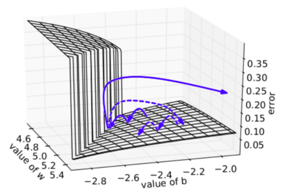

梯度爆炸，梯度截断可视化 

为了解决梯度弥散的问题，我们介绍了两种方法。

- **第一种方法是将随机初始化改为一个有关联的矩阵初始化**。

- **第二种方法是使用 ReLU（Rectified Linear Units）代替 sigmoid 函数**。ReLU 的导数不是 0 就是 1.因此，神经元的梯度将始终为 1，而不会当梯度传播了一定时间之后变小。

## 15. 什麽样的资料集不适合用深度学习？

> [如果你是面试官，你怎么去判断一个面试者的深度学习水平？](https://www.zhihu.com/question/41233373) - 知乎

- 数据集太小，数据样本不足时，深度学习相对其它机器学习算法，没有明显优势。

- **数据集没有局部相关特性**，目前深度学习表现比较好的领域主要是图像／语音／自然语言处理等领域，这些领域的一个共性是局部相关性。图像中像素组成物体，语音信号中音位组合成单词，文本数据中单词组合成句子，这些特征元素的组合一旦被打乱，表示的含义同时也被改变。对于没有这样的局部相关性的数据集，不适于使用深度学习算法进行处理。

  举个例子：预测一个人的健康状况，相关的参数会有年龄、职业、收入、家庭状况等各种元素，将这些元素打乱，并不会影响相关的结果。

## 16. 广义线性模型是怎被应用在深度学习中？

> [如果你是面试官，你怎么去判断一个面试者的深度学习水平？](https://www.zhihu.com/question/41233373/answer/145404190) - 知乎

> A Statistical View of Deep Learning (I): Recursive GLMs

**深度学习从统计学角度，可以看做递归的广义线性模型**。

广义线性模型相对于经典的线性模型(`y=wx+b`)，核心在于引入了连接函数 `g(.)`，形式变为： `y=g−1(wx+b)`。

**深度学习时递归的广义线性模型，神经元的激活函数，即为广义线性模型的链接函数。逻辑回归（广义线性模型的一种）的 Logistic 函数即为神经元激活函数中的 Sigmoid 函数**，很多类似的方法在统计学和神经网络中的名称不一样，容易引起初学者（这里主要指我）的困惑。

下图是一个对照表

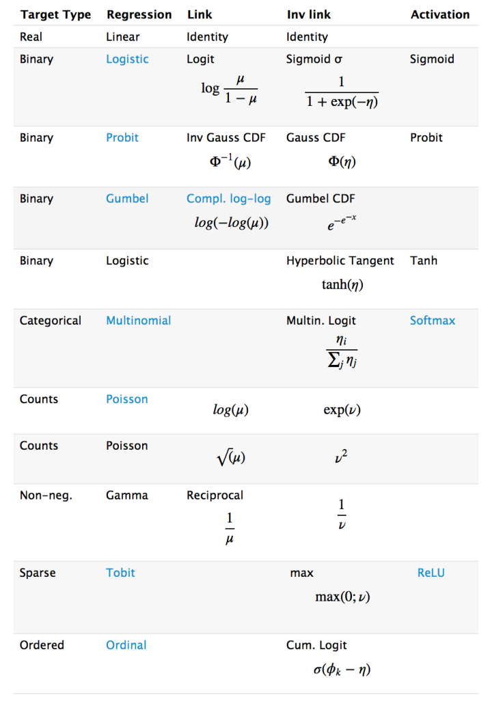

## 17. 如何解决梯度消失和梯度膨胀

- 梯度消失：

  根据链式法则，如果每一层神经元对上一层的输出的偏导乘上权重结果都小于 1 的话，那么即使这个结果是 0.99，在经过足够多层传播之后，误差对输入层的偏导会趋于 0

  可以采用 ReLU 激活函数有效的解决梯度消失的情况，也可以用 Batch Normalization 解决这个问题。关于深度学习中 Batch Normalization 为什么效果好？参见：https://www.zhihu.com/question/38102762

- 梯度膨胀

  根据链式法则，如果每一层神经元对上一层的输出的偏导乘上权重结果都大于 1 的话，在经过足够多层传播之后，误差对输入层的偏导会趋于无穷大

  可以通过激活函数来解决，或用 Batch Normalization 解决这个问题。

## 18. 简述神经网络的发展历史

> [神经网络概述和发展史](https://www.jianshu.com/p/539ae437da7b)

1949 年 Hebb 提出了神经心理学学习范式——Hebbian 学习理论

1952 年，IBM 的 Arthur Samuel 写出了西洋棋程序

1957 年，Rosenblatt 的感知器算法是第二个有着神经系统科学背景的机器学习模型.

3 年之后，Widrow 因发明 Delta 学习规则而载入 ML 史册，该规则马上就很好的应用到了感知器的训练中

感知器的热度在 1969 被 Minskey 一盆冷水泼灭了。他提出了著名的 XOR 问题，论证了感知器在类似 XOR 问题的线性不可分数据的无力。

尽管 BP 的思想在 70 年代就被 Linnainmaa 以 “自动微分的翻转模式” 被提出来，但直到 1981 年才被 Werbos 应用到多层感知器 (MLP) 中，NN 新的大繁荣。

1991 年的 Hochreiter 和 2001 年的 Hochreiter 的工作，都表明在使用 BP 算法时，NN 单元饱和之后会发生梯度损失。又发生停滞。

时间终于走到了当下，随着计算资源的增长和数据量的增长。一个新的 NN 领域——深度学习出现了。

简言之，MP 模型 + sgn—->单层感知机（只能线性）+ sgn— Minsky 低谷 —>多层感知机+ BP + sigmoid —- (低谷) —> 深度学习+ pre-training + ReLU/sigmoid

**神经网络的种类：**

- 基础神经网络：单层感知器，线性神经网络，BP 神经网络，Hopfield 神经网络等

- 进阶神经网络：玻尔兹曼机，受限玻尔兹曼机，递归神经网络等

- 深度神经网络：深度置信网络，卷积神经网络，深度残差网络，LSTM 网络等

**神经网络的发展图：**


## 19. 深度学习常用方法

> [Deep Learning（深度学习）之（三）Deep Learning的常用模型或者方法](https://blog.csdn.net/boon_228/article/details/51700569) - CSDN
>
> [做AI必须要知道的十种深度学习方法](https://www.leiphone.com/news/201711/32mto6PcZqaaVlWR.html) - 雷锋网

全连接 DNN（相邻层相互连接、层内无连接）： 

AutoEncoder (尽可能还原输入)、Sparse Coding（在AE上加入L1规范）、RBM（解决概率问题）—–>特征探测器——> 栈式叠加 贪心训练 

RBM—->DBN 

- 解决全连接 DNN 的全连接问题—–> CNN 
- 解决全连接 DNN 的无法对时间序列上变化进行建模的问题 —–>RNN—解决时间轴上的梯度消失问题——->LSTM

解析来源：@SmallisBig，链接：http://blog.csdn.net/u010496169/article/details/73550487

@张雨石：现在在应用领域应用的做多的是 DNN，CNN 和 RNN。

- **DNN（深度神经网络） 是传统的全连接网络，可以用于广告点击率预估，推荐等。其使用 embedding 的方式将很多离散的特征编码到神经网络中，可以很大的提升结果**。

- **CNN 主要用于计算机视觉(Computer Vision)领域，CNN 的出现主要解决了 DNN 在图像领域中参数过多的问题**。同时，CNN 特有的卷积、池化、batch normalization、Inception、ResNet、DeepNet 等一系列的发展也使得在分类、物体检测、人脸识别、图像分割等众多领域有了长足的进步。**同时，CNN 不仅在图像上应用很多，在自然语言处理上也颇有进展，现在已经有基于 CNN 的语言模型能够达到比 LSTM 更好的效果**。在最新的 AlphaZero 中，CNN 中的 ResNet 也是两种基本算法之一。

- **GAN（生成式对抗网络） 是一种应用在生成模型的训练方法，现在有很多在 CV 方面的应用，例如图像翻译，图像超清化、图像修复等等**。

- **RNN 主要用于自然语言处理(Natural Language Processing)领域，用于处理序列到序列的问题**。**普通 RNN 会遇到梯度爆炸和梯度消失的问题。所以现在在 NLP 领域，一般会使用 LSTM 模型**。
- **在最近的机器翻译领域，Attention 作为一种新的手段，也被引入进来**。

除了 DNN、RNN 和 CNN 外， 自动编码器( AutoEncoder )、稀疏编码( Sparse Coding )、深度信念网络( DBM )、限制玻尔兹曼机( RBM )也都有相应的研究。

---

深度学习网络与 “典型” 的前馈多层网络之间是有一些区别的，如下：

- 深度学习网络比之前的网络有更多的神经元
- 深度学习网络具有更复杂的连接层的方式
- 深度学习网络需要用强大的计算能力来训练
- 深度学习网络能够进行自动特征提取

因此深度学习可以被定义为在以下四个基本网络框架中拥有大量参数和层的神经网络：

- 无监督预训练网络（Unsupervised Pre-trained Networks）
- 卷积神经网络（Convolutional Neural Networks）
- 循环神经网络（Recurrent Neural Networks）
- 递归神经网络 （Recursive Neural Networks）

在这篇文章中，我主要对后三个框架比较感兴趣。

**卷积神经网络：** 基本上就是用共享权重在空间中进行扩展的标准神经网络。设计CNN主要是为了通过内部卷积来识别图片，内部卷积可以看到待识别物体的边。

**循环神经网络：** 基本上是在时间上进行扩展的标准神经网络，因为边进入下一个时间步，而不是在同一时间步进入下一个层。设计RNN主要是为了识别序列，例如语音信号或者文本。它里面的循环意味着网络中存在短暂的记忆。

**递归神经网络：** 更类似于分层网络，其中输入序列没有真正的时间面，而是输入必须以树状方式分层处理。

以下10种方法可以应用于所有这些体系结构。

### 19.1 反向传播

反向传播是 “误差反向传播” 的简称，它是一种计算函数（在神经网络中以函数形式存在）偏微分的方法。当你要用一个基于梯度的方法来解决一个最优问题时（注意梯度下降只是解决这类问题的一种方法），你希望在每一次迭代中计算函数梯度。

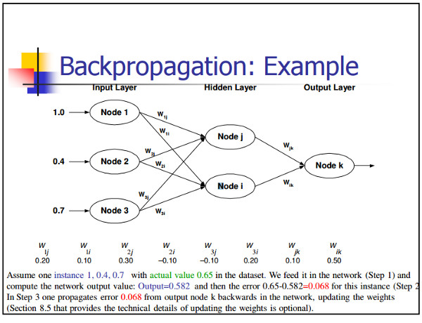

**对于神经网络而言，目标函数具有合成的形式**。那么如何计算梯度呢？一般情况下有两种常见的方法：

- **微分分析法**。当你知道这个函数的形式时，你只需要用链式法则计算导数即可；

- **用有限差分方法来近似微分**。这种方法的计算量很大，因为函数评估的数量是 O（N），其中 N 是参数的数量。与微分分析法相比，这是比较昂贵的。不过，有限差分通常在调试时验证后端实现。

### 19.2 随机梯度下降

一个直观理解梯度下降的方法是去想象一条溯源山顶的河流。这条河流会沿着山势梯度的方向流向山麓下的最低点。

 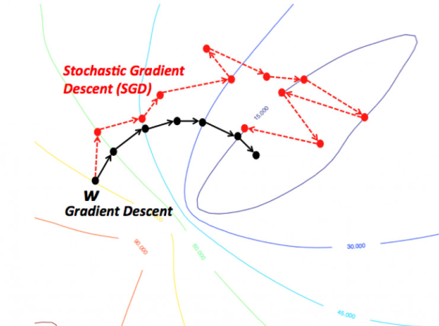

如果让人来走，可能就不一样了，你可能会先随便选一个方向，然后沿着这个方向的梯度向下走；过一会儿再随机换一个方向向下走；最后你发现自己差不多也到了谷底了。

**数学化的理解就是：**

随机梯度下降主要用来求解类似于如下求和形式的优化问题：

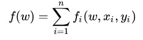

梯度下降法：

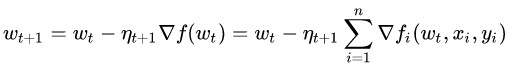

当 `n` 很大时，每次迭代计算所有的梯度会非常耗时。

随机梯度下降的想法就是每次在 `Delta f_i` 中随机选取一个计算代替上面的 `Delta f_i`，以这个随机选取的方向作为下降的方向。这样的方法反而比梯度下降能够更快地到达（局部）最优解。

### 19.3 学习率衰减

在训练模型的时候，通常会遇到这种情况：我们平衡模型的训练速度和损失（loss）后选择了相对合适的学习率（learning rate），但是训练集的损失下降到一定的程度后就不在下降了，比如 training loss一直在 0.7 和 0.9 之间来回震荡，不能进一步下降。如下图所示：

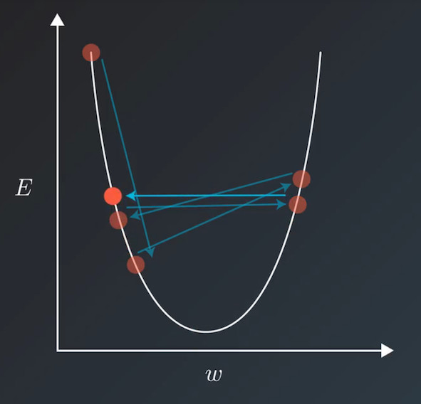

遇到这种情况通常可以通过适当降低学习率（learning rate）来实现。但是，降低学习率又会延长训练所需的时间。

**学习率衰减（learning rate decay）就是一种可以平衡这两者之间矛盾的解决方案**。**学习率衰减的基本思想是：学习率随着训练的进行逐渐衰减**。

学习率衰减基本有两种实现方法：

- **线性衰减**。例如：每过 5 个 epochs 学习率减半；
- **指数衰减**。例如：每过 5 个 epochs 将学习率乘以 0.1。

### 19.4 dropout

在当前的大规模神经网络中有两个缺点：

- 费时；
- 容易过拟合

Dropout 可以很好地解决这个问题。**Dropout 说的简单一点就是在前向传导的时候，让某个神经元的激活值以一定的概率 p 停止工作**，示意图如下：

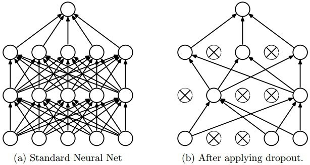

每次做完 dropout，相当于从原始的网络中找到一个更瘦的网络。

Hinton 在其论文中做了这样的类比，无性繁殖可以保留大段的优秀基因，而有性繁殖则将基因随机拆了又拆，破坏了大段基因的联合适应性；但是自然选择了有性繁殖，物竞天择，适者生存，可见有性繁殖的强大。dropout 也能达到同样的效果，它强迫一个神经单元，和随机挑选出来的其他神经单元共同工作，消除减弱了神经元节点间的联合适应性，增强了泛化能力。

### 19.5 max pooling

池化（Pooling）是卷积神经网络中另一个重要的概念，**它实际上是一种形式的向下采样**。有多种不同形式的非线性池化函数，而其中 “最大池化（Max pooling）” 是最为常见的。它是将输入的图像划分为若干个矩形区域，对每个子区域输出最大值。

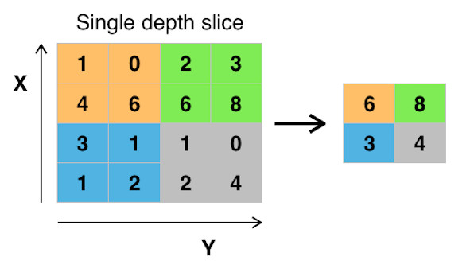

**直觉上，这种机制能够有效地原因在于，在发现一个特征之后，它的精确位置远不及它和其他特征的相对位置的关系重要**。池化层会不断地减小数据的空间大小，因此参数的数量和计算量也会下降，这在一定程度上也控制了过拟合。**通常来说，CNN的卷积层之间都会周期性地插入池化层**。 

### 19.6 批标准化

**包括深度网络在内的神经网络需要仔细调整权重初始化和学习参数。批标准化使这些变得轻松许多**。

**权重问题：**

- 无论权重的初始化如何，是随机的还是经验性的选择，它们离学习权重都会很远。考虑一个小批量，初期在所需的特征激活方面会有很多异常值。
- **深层神经网络本身是病态的**，初始层中的微小扰动都会导致后面层的非常大的变化。

**在反向传播过程中，这些现象会导致梯度弥散**。这就意味着在学习权重产生所需要的输出前，必须对梯度的异常值进行补偿，这将导致需要额外的时段来收敛。

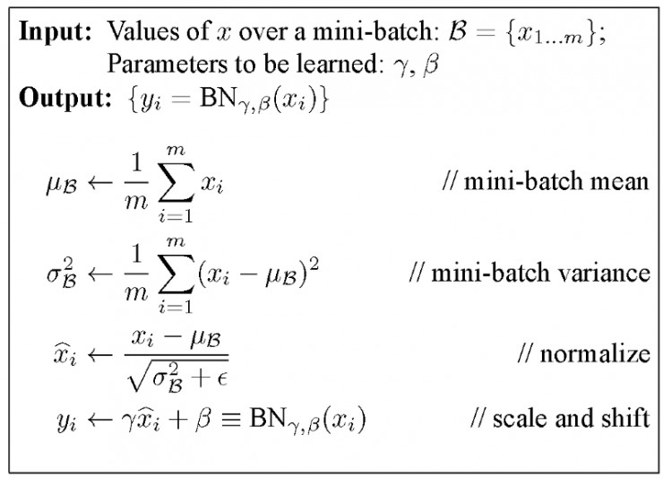

**批量归一化使这些梯度从分散到正常值并在小批量范围内流向共同目标（通过归一化）**。

**学习率问题：**

- **一般来说，学习率需要保持较低的值，使得只有一小部分的梯度来校正权重，原因是要使异常激活的梯度不影响已学习到的激活**。通过批量标准化，可以减少这些异常激活，因此也就可以使用更高的学习率来加速学习过程。

### 19.7 long short-term memory

LSTM 网络具有以下三个方面，使其与循环神经网络中的常见神经元不同：

- 它能够决定何时让输入进入神经元；

- 它能够决定何时记住上一个时间步中计算的内容；

- 它决定何时让输出传递到下一个时间步。

LSTM 的美妙之处在于它能够根据当前的输入本身来决定所有这些。 所以你看下面的图表：

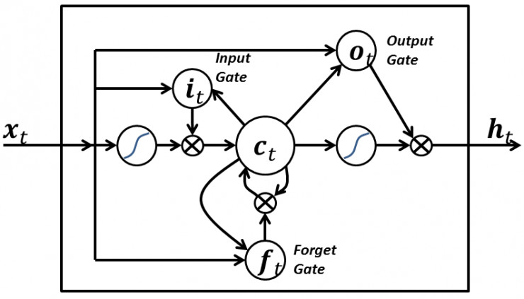

当前时间的输入信号`x(t)`决定所有上述 3 个点。 输入门决定点 1，遗忘门决定点 2，输出门决定点 3。任何一条输入都能够采取所有这三个决定。这种设计其实是受到了我们大脑如何工作的启发，并且可以基于输入来处理突然的上下文切换。

### 19.8 skip-gram

词嵌入模型的目标是为每个词项学习一个高维密集表示，其中嵌入向量之间的相似性显示了相应词之间的语义或句法相似性。**Skip-gram 是一个学习词嵌入算法的模型**。

**skip-gram 模型（以及许多其他的词语嵌入模型）背后的主要思想如下：两个词项相似，如果它们共享相似的上下文**。

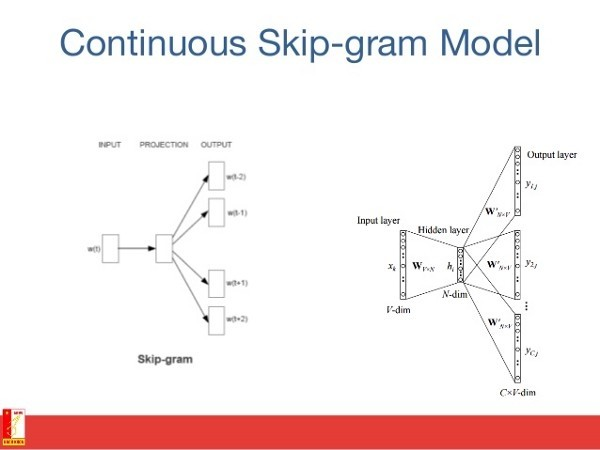

换句话说，假设你有一个句子，例如 “猫是哺乳动物”；如果你用 “狗” 而不是 “猫”，这个句子还是一个有意义的句子。因此在这个例子中，“狗” 和 “猫” 可以共享相同的上下文（即 “是哺乳动物”）。

基于上述假设，你可以考虑一个上下文窗口（一个包含 `k` 个连续项的窗口），然后你跳过其中一个单词，试着去学习一个能够得到除跳过项外的所有项的神经网络，并预测跳过的这个项。如果两个词在一个大语料库中反复共享相似的语境，则这些词的嵌入向量将具有相近的向量。

### 19.9 连续词袋

在自然语言处理问题中，我们希望学习将文档中的每个单词表示为一个数字的向量，使得出现在相似的上下文中的单词具有彼此接近的向量。在连续的单词模型中，目标是能够使用围绕特定单词的上下文并预测特定单词。

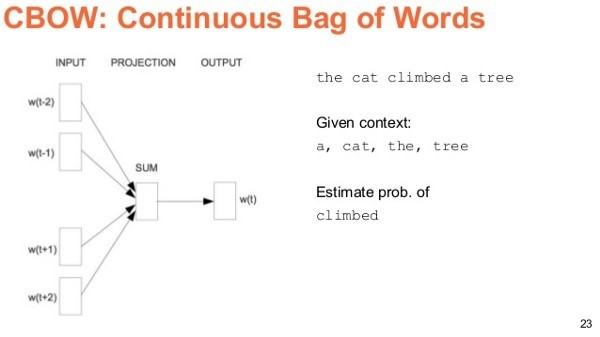

我们通过在一个大的语料库中采取大量的句子来做到这一点，每当我们看到一个单词时，我们就提取周围的单词。 然后，我们将上下文单词输入到一个神经网络，并预测在这个上下文中间的单词。

当我们有成千上万个这样的上下文单词和中间词时，我们就有一个神经网络数据集的实例。 我们训练神经网络，最后编码的隐藏层输出表示了特定单词的嵌入。 恰巧，当我们对大量的句子进行训练时，类似语境中的单词得到相似的向量。

### 19.10 迁移学习

让我们想一下如何在 CNN 中处理一张图片。假设有一张图片，你对它进行卷积处理，然后你得到的输出是像素的组合，我们姑且称之为 “边” 吧。我们再次使用卷积，这时候你得到的输出将是边的组合，我们称之为 “线” 。如果再次使用卷积，那么你将得到线的组合，等等。

**每一层都是在寻找相应的特定模式。你的神经网络最后一层一般会给出非常特定的模式。也许你在处理 ImageNet，你的网络最后一层可能是在找孩子、狗或飞机或别的任何东西。如果你向前两层看，网络可能是在找眼睛、耳朵、嘴巴或者轮子**。

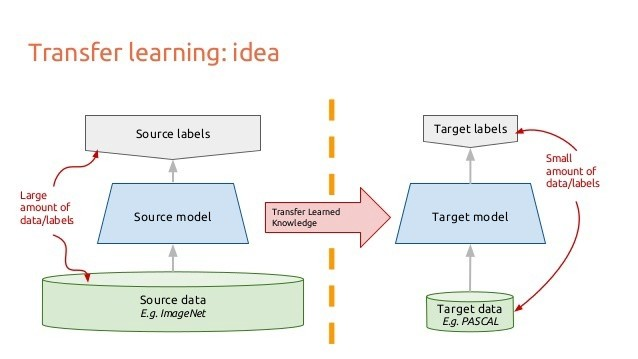

**深度卷积神经网络中的每一层的深入都是在构建越来越高层次的特征表示**。**最后两层会产生你输入模型的数据中的特定模式**。换句话说，早期的层提取的特征则广泛得多，在提取的大量的类中有很多简单的模式。

**迁移学习就是当你用一个数据集训练 CNN 时，砍掉最后的一（些）层，再用另一个不同的数据集重新训练最后一（些）层的模型**。直观地说，你在重新训练模型来识别不同的高级层次特征。作为结果，训练时间大幅减少。所以**当你没有足够的数据或者训练的资源时，迁移学习是非常有用的一个工具**。

## 20. 请简述神经网络的发展史。

> [浅析 Hinton 最近提出的 Capsule 计划](https://zhuanlan.zhihu.com/p/29435406) - 知乎

- sigmoid 会饱和，造成梯度消失。于是有了 ReLU。

- ReLU 负半轴是死区，造成梯度变 0。于是有了 LeakyReLU，PReLU。

- 强调梯度和权值分布的稳定性，由此有了 ELU，以及较新的 SELU。

- 太深了，梯度传不下去，于是有了 highway（最小生成树prim算法）。

- 干脆连 highway 的参数都不要，直接变残差，于是有了 ResNet。

- 强行稳定参数的均值和方差，于是有了 BatchNorm（批量归一化）。

- 在梯度流中增加噪声，于是有了 Dropout。

- RNN 梯度不稳定，于是加几个通路和门控，于是有了 LSTM。

- LSTM 简化一下，有了 GRU（循环神经网络）。

- GAN（生成式对抗网络） 的 JS 散度有问题，会导致梯度消失或无效，于是有了 WGAN。

- WGAN 对梯度的 clip 有问题，于是有了 WGAN-GP。

> [DCGAN、WGAN、WGAN-GP、LSGAN、BEGAN原理总结及对比](https://blog.csdn.net/qq_25737169/article/details/78857788) - CSDN


