## Index

<!-- TOC -->

* [21. 神经网络中激活函数的真正意义？一个激活函数需要具有哪些必要的属性？还有哪些属性是好的属性但不必要的？](#21-神经网络中激活函数的真正意义一个激活函数需要具有哪些必要的属性还有哪些属性是好的属性但不必要的)
* [22. 梯度下降法的神经网络容易收敛到局部最优，为什么应用广泛？](#22-梯度下降法的神经网络容易收敛到局部最优为什么应用广泛)
* [23. 简单说说CNN常用的几个模型](#23-简单说说cnn常用的几个模型)
* [24. 为什么很多做人脸的Paper会最后加入一个Local Connected Conv？](#24-为什么很多做人脸的paper会最后加入一个local-connected-conv)
* [25. 什么是梯度爆炸？](#25-什么是梯度爆炸)
* [26. 梯度爆炸会引发什么问题？](#26-梯度爆炸会引发什么问题)
* [27. 如何确定是否出现梯度爆炸？](#27-如何确定是否出现梯度爆炸)
* [28. 如何修复梯度爆炸问题？](#28-如何修复梯度爆炸问题)
* [29. LSTM神经网络输入输出究竟是怎样的？](#29-lstm神经网络输入输出究竟是怎样的)
* [30. 什么是RNN？](#30-什么是rnn)
* [31. RNN是怎么从单层网络一步一步构造的？](#31-rnn是怎么从单层网络一步一步构造的)

  - [31.1 从单层网络谈起](#311-从单层网络谈起)

  - [31.2 经典的RNN结构（N vs N）](#312-经典的rnn结构n-vs-n)

  - [31.3 N VS 1](#313-n-vs-1)

  - [31.4 1 VS N](#314-1-vs-n)

  - [31.5 N vs M](#315-n-vs-m)
* [32. 简单说下 sigmoid 激活函数](#32-简单说下-sigmoid-激活函数)
* [33. 如何理解LSTM网络](#33-如何理解lstm网络)
* [34. 请详细说说CNN的工作原理](#34-请详细说说cnn的工作原理)
* [35. CNN究竟是怎样一步一步工作的？](#35-cnn究竟是怎样一步一步工作的)
* [36. 基于深度学习的目标检测技术演进：R-CNN、Fast R-CNN、Faster R-CNN、YOLO、SSD](#36-基于深度学习的目标检测技术演进r-cnnfast-r-cnnfaster-r-cnnyolossd)
* [37. rcnn、fast-rcnn 和 faster-rcnn 三者的区别是什么](#37-rcnnfast-rcnn-和-faster-rcnn-三者的区别是什么)
* [38. 在神经网络中，有哪些办法防止过拟合？](#38-在神经网络中有哪些办法防止过拟合)
* [39. CNN是什么，CNN关键的层有哪些？](#39-cnn是什么cnn关键的层有哪些)
* [40. GRU是什么？GRU对LSTM做了哪些改动？](#40-gru是什么gru对lstm做了哪些改动)

<!-- /TOC -->

## 21. 神经网络中激活函数的真正意义？一个激活函数需要具有哪些必要的属性？还有哪些属性是好的属性但不必要的？

> [神经网络中激活函数的真正意义？一个激活函数需要具有哪些必要的属性？还有哪些属性是好的属性但不必要的？](https://www.zhihu.com/question/67366051) - 知乎

**1. 非线性：** 即导数不是常数。这个条件前面很多答主都提到了，是多层神经网络的基础，保证多层网络不退化成单层线性网络。这也是激活函数的意义所在。

**2. 几乎处处可微：** 可微性保证了在优化中梯度的可计算性。传统的激活函数如 sigmoid 等满足处处可微。对于分段线性函数比如 ReLU，只满足几乎处处可微（即仅在有限个点处不可微）。对于 SGD 算法来说，由于几乎不可能收敛到梯度接近零的位置，有限的不可微点对于优化结果不会有很大影响 [1]。

**3. 计算简单：** 正如题主所说，非线性函数有很多。极端的说，一个多层神经网络也可以作为一个非线性函数，类似于 Network In Network [2] 中把它当做卷积操作的做法。但激活函数在神经网络前向的计算次数与神经元的个数成正比，因此简单的非线性函数自然更适合用作激活函数。这也是 ReLU 之流比其它使用 Exp 等操作的激活函数更受欢迎的其中一个原因。

**4. 非饱和性（saturation）：** 饱和指的是在某些区间梯度接近于零（即梯度消失），使得参数无法继续更新的问题。最经典的例子是 Sigmoid，它的导数在x为比较大的正值和比较小的负值时都会接近于 0。更极端的例子是阶跃函数，由于它在几乎所有位置的梯度都为 0，因此处处饱和，无法作为激活函数。ReLU 在 `x>0` 时导数恒为 1，因此对于再大的正值也不会饱和。但同时对于 `x<0`，其梯度恒为 0，这时候它也会出现饱和的现象（在这种情况下通常称为 dying ReLU）。Leaky ReLU[3] 和 PReLU[4] 的提出正是为了解决这一问题。

**5. 单调性（monotonic）：** 即导数符号不变。这个性质大部分激活函数都有，除了诸如 sin、cos 等。个人理解，单调性使得在激活函数处的梯度方向不会经常改变，从而让训练更容易收敛。

**6. 输出范围有限：** 有限的输出范围使得网络对于一些比较大的输入也会比较稳定，这也是为什么早期的激活函数都以此类函数为主，如 Sigmoid、TanH。但这导致了前面提到的梯度消失问题，而且强行让每一层的输出限制到固定范围会限制其表达能力。因此现在这类函数仅用于某些需要特定输出范围的场合，比如概率输出（此时 loss 函数中的 log 操作能够抵消其梯度消失的影响[1]）、LSTM 里的 gate 函数。

**7. 接近恒等变换（identity）：** 即约等于 x。这样的好处是使得输出的幅值不会随着深度的增加而发生显著的增加，从而使网络更为稳定，同时梯度也能够更容易地回传。这个与非线性是有点矛盾的，因此激活函数基本只是部分满足这个条件，比如 TanH 只在原点附近有线性区（在原点为 0 且在原点的导数为1），而 ReLU 只在 `x>0` 时为线性。这个性质也让初始化参数范围的推导更为简单 [5][4]。额外提一句，这种恒等变换的性质也被其他一些网络结构设计所借鉴，比如 CNN 中的 ResNet[6] 和 RNN 中的 LSTM。

**8. 参数少：** 大部分激活函数都是没有参数的。像 PReLU 带单个参数会略微增加网络的大小。还有一个例外是 Maxout[7]，尽管本身没有参数，但在同样输出通道数下 `k` 路 Maxout 需要的输入通道数是其它函数的 `k` 倍，这意味着神经元数目也需要变为 `k` 倍；但如果不考虑维持输出通道数的情况下，该激活函数又能将参数个数减少为原来的 `k` 倍。

**9. 归一化（normalization）：** 这个是最近才出来的概念，对应的激活函数是 SELU[8]，主要思想是使样本分布自动归一化到零均值、单位方差的分布，从而稳定训练。在这之前，这种归一化的思想也被用于网络结构的设计，比如 Batch Normalization[9]。

## 22. 梯度下降法的神经网络容易收敛到局部最优，为什么应用广泛？

> [梯度下降法的神经网络容易收敛到局部最优，为什么应用广泛？](https://www.zhihu.com/question/68109802/answer/262143638)

深度神经网络 “容易收敛到局部最优”，很可能是一种想象，实际情况是，我们可能从来没有找到过 “局部最优”，更别说全局最优了。

很多人都有一种看法，就是 “局部最优是神经网络优化的主要难点”。这来源于一维优化问题的直观想象。在单变量的情形下，优化问题最直观的困难就是有很多局部极值，如


人们直观的想象，高维的时候这样的局部极值会更多，指数级的增加，于是优化到全局最优就更难了。然而单变量到多变量一个重要差异是，单变量的时候，Hessian 矩阵只有一个特征值，于是无论这个特征值的符号正负，一个临界点都是局部极值。但是在多变量的时候，Hessian 有多个不同的特征值，这时候各个特征值就可能会有更复杂的分布，如有正有负的不定型和有多个退化特征值（零特征值）的半定型

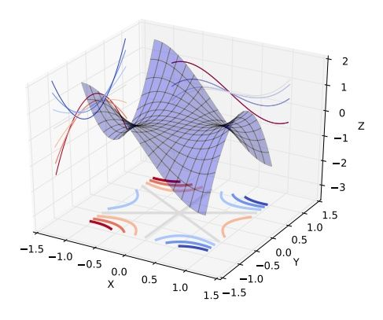

在后两种情况下，是很难找到局部极值的，更别说全局最优了。

现在看来，神经网络的训练的困难主要是鞍点的问题。在实际中，我们很可能也从来没有真的遇到过局部极值。Bengio组这篇文章 [Eigenvalues of the Hessian in Deep Learning](https://arxiv.org/abs/1611.07476) 里面的实验研究给出以下的结论：

> • Training stops at a point that has a small gradient. The norm of the gradient is not zero, therefore it does not, technically speaking, converge to a critical point.
>
> • There are still negative eigenvalues even when they are small in magnitude.

另一方面，一个好消息是，即使有局部极值，具有较差的loss的局部极值的吸引域也是很小的 [Towards Understanding Generalization of Deep Learning: Perspective of Loss Landscapes](https://arxiv.org/abs/1706.10239)

> For the landscape of loss function for deep networks, the volume of basin of attraction of good minima dominates over that of poor minima, which guarantees optimization methods with random initialization to converge to good minima.

所以，很可能我们实际上是在 “什么也没找到” 的情况下就停止了训练，然后拿到测试集上试试，“咦，效果还不错”。

补充说明，这些都是实验研究结果。理论方面，各种假设下，深度神经网络的 Landscape 的鞍点数目指数增加，而具有较差 loss 的局部极值非常少。

SGD 收敛性的很多结论都是经验性的。在 loss function landscape 是退化的情况下 loss 停滞在某个数值上训练不动的原因，很大程度上不是因为停在某个点不动了，是停在某个区域不动了。over-parameterized 的神经网络有大片的平坦区域，这里一阶二阶乃至更高阶都是退化的，甚至有实验说这样的区域时 dominant 的（虽然我觉得那个结论有点大）。这时候可以说反复迭代也没啥改进，但是这反过来说算法无需太多迭代就能找到这样一个平坦区域，这里 loss 和其中的 local minima （可能也是退化的）相差不大，是不是真的找到 local minima 也没那么重要了。

## 23. 简单说说CNN常用的几个模型


## 24. 为什么很多做人脸的Paper会最后加入一个Local Connected Conv？

> [深度学习岗位面试问题整理笔记](https://zhuanlan.zhihu.com/p/25005808)

以 FaceBook DeepFace 为例：

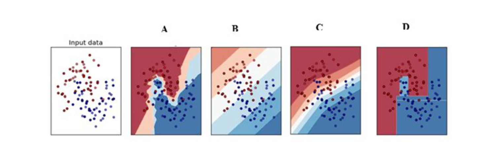

DeepFace 先进行了两次全卷积＋一次池化，提取了低层次的边缘／纹理等特征。后接了 3 个 Local-Conv 层，这里是用 Local-Conv 的原因是，人脸在不同的区域存在不同的特征（眼睛／鼻子／嘴的分布位置相对固定），**当不存在全局的局部特征分布时，Local-Conv 更适合特征的提取**。

## 25. 什么是梯度爆炸？

**误差梯度是神经网络训练过程中计算的方向和数量，用于以正确的方向和合适的量更新网络权重**。

在深层网络或循环神经网络中，误差梯度可在更新中累积，变成非常大的梯度，然后导致网络权重的大幅更新，并因此使网络变得不稳定。在极端情况下，权重的值变得非常大，以至于溢出，导致 NaN 值。

**网络层之间的梯度（值大于 1.0）重复相乘导致的指数级增长会产生梯度爆炸**。

## 26. 梯度爆炸会引发什么问题？

在深度多层感知机网络中，梯度爆炸会引起网络不稳定，最好的结果是无法从训练数据中学习，而最坏的结果是出现无法再更新的 NaN 权重值。

> 梯度爆炸导致学习过程不稳定。—《深度学习》，2016.

在循环神经网络中，梯度爆炸会导致网络不稳定，无法利用训练数据学习，最好的结果是网络无法学习长的输入序列数据。

## 27. 如何确定是否出现梯度爆炸？

训练过程中出现梯度爆炸会伴随一些细微的信号，如：

- 模型无法从训练数据中获得更新（如低损失）。

- 模型不稳定，导致更新过程中的损失出现显著变化。

- 训练过程中，模型损失变成 NaN。

- 如果你发现这些问题，那么你需要仔细查看是否出现梯度爆炸问题。

以下是一些**稍微明显一点的信号**，有助于确认是否出现梯度爆炸问题。

- 训练过程中模型梯度快速变大。

- 训练过程中模型权重变成 NaN 值。

- 训练过程中，每个节点和层的误差梯度值持续超过 1.0。

## 28. 如何修复梯度爆炸问题？

有很多方法可以解决梯度爆炸问题，本节列举了一些最佳实验方法。
1. 重新设计网络模型

  **在深度神经网络中，梯度爆炸可以通过重新设计层数更少的网络来解决**。

  **使用更小的批尺寸对网络训练也有好处**。

  在循环神经网络中，训练过程中在更少的先前时间步上进行更新（沿时间的截断反向传播，truncated Backpropagation through time）可以缓解梯度爆炸问题。

2. 使用 ReLU 激活函数

  在深度多层感知机神经网络中，梯度爆炸的发生可能是因为激活函数，如之前很流行的 Sigmoid 和 Tanh 函数。

  **使用 ReLU 激活函数可以减少梯度爆炸**。**采用 ReLU 激活函数是最适合隐藏层的新实践**。

3. 使用长短期记忆网络

  在循环神经网络中，梯度爆炸的发生可能是因为某种网络的训练本身就存在不稳定性，如随时间的反向传播本质上将循环网络转换成深度多层感知机神经网络。

  使用长短期记忆（LSTM）单元和相关的门类型神经元结构可以减少梯度爆炸问题。

  采用 LSTM 单元是适合循环神经网络的序列预测的最新最好实践。

4. 使用梯度截断（Gradient Clipping）

  **在非常深且批尺寸较大的多层感知机网络和输入序列较长的 LSTM 中，仍然有可能出现梯度爆炸**。如果梯度爆炸仍然出现，你可以在训练过程中检查和限制梯度的大小。这就是梯度截断。

  处理梯度爆炸有一个简单有效的解决方案：**如果梯度超过阈值，就截断它们**。——《Neural Network Methods in Natural Language Processing》，2017.

  具体来说，检查误差梯度的值是否超过阈值，如果超过，则截断梯度，将梯度设置为阈值。

  梯度截断可以一定程度上缓解梯度爆炸问题（梯度截断，即在执行梯度下降步骤之前将梯度设置为阈值）。 ——《深度学习》，2016.

  在 Keras 深度学习库中，你可以在训练之前设置优化器上的 `clipnorm` 或 `clipvalue` 参数，来使用梯度截断。

  默认值为 `clipnorm=1.0` 、`clipvalue=0.5`。详见：https://keras.io/optimizers/。

5. 使用权重正则化（Weight Regularization）

  如果梯度爆炸仍然存在，可以尝试另一种方法，即检查网络权重的大小，并惩罚产生较大权重值的损失函数。该过程被称为权重正则化，通常使用的是 L1 惩罚项（权重绝对值）或 L2 惩罚项（权重平方）。

  **对循环权重使用 L1 或 L2 惩罚项有助于缓解梯度爆炸**。——On the difficulty of training recurrent neural networks，2013.

  在 Keras 深度学习库中，你可以通过在层上设置 `kernel_regularizer` 参数和使用 L1 或 L2 正则化项进行权重正则化。

## 29. LSTM神经网络输入输出究竟是怎样的？

> [LSTM神经网络输入输出究竟是怎样的？](https://www.zhihu.com/question/41949741) - 知乎

**第一要明确的是神经网络所处理的单位全部都是：向量**

下面就解释为什么你会看到训练数据会是矩阵和张量

常规 Feedforward（前馈技术） 输入和输出：矩阵

- 输入矩阵形状：(n_samples, dim_input)

- 输出矩阵形状：(n_samples, dim_output)

注：真正测试/训练的时候，网络的输入和输出就是向量而已。加入 n_samples 这个维度是为了可以实现一次训练多个样本，求出平均梯度来更新权重，这个叫做 Mini-batch gradient descent。 如果 n_samples 等于 1，那么这种更新方式叫做 Stochastic Gradient Descent (SGD)。

Feedforward 的输入输出的本质都是单个向量。

常规 Recurrent （循环神经）(RNN/LSTM/GRU) 输入和输出：张量

- 输入张量形状：(time_steps, n_samples,  dim_input)

- 输出张量形状：(time_steps, n_samples,  dim_output)

注：同样是保留了 Mini-batch gradient descent 的训练方式，但不同之处在于多了 time step 这个维度。 
Recurrent 的任意时刻的输入的本质还是单个向量，只不过是将不同时刻的向量按顺序输入网络。所以你可能更愿意理解为一串向量 a sequence of vectors，或者是矩阵。

python 代码表示预测的话：

```python
import numpy as np

#当前所累积的hidden_state,若是最初的vector，则hidden_state全为0
hidden_state=np.zeros((n_samples, dim_input))

#print(inputs.shape)： （time_steps, n_samples,  dim_input)
outputs = np.zeros((time_steps, n_samples, dim_output))

for i in range(time_steps):
    #输出当前时刻的output，同时更新当前已累积的hidden_state
    outputs[i],hidden_state = RNN.predict(inputs[i],hidden_state)
#print(outputs.shape)： (time_steps, n_samples, dim_output)
```

但需要注意的是，Recurrent nets 的输出也可以是矩阵，而非三维张量，取决于你如何设计。

1. **若想用一串序列去预测另一串序列，那么输入输出都是张量 **(例如语音识别 或机器翻译 一个中文句子翻译成英文句子（一个单词算作一个向量），机器翻译还是个特例，因为两个序列的长短可能不同，要用到 seq2seq；
2. **若想用一串序列去预测一个值，那么输入是张量，输出是矩阵** （例如，情感分析就是用一串单词组成的句子去预测说话人的心情）

Feedforward 能做的是向量对向量的 one-to-one mapping，

Recurrent 将其扩展到了序列对序列 sequence-to-sequence mapping.

但单个向量也可以视为长度为 1 的序列。所以有下图几种类型：

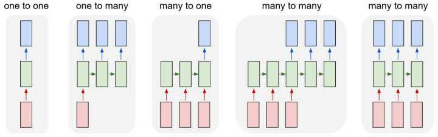


除了最左侧的 one to one 是 feedforward 能做的，右侧都是 Recurrent 所扩展的

若还想知道更多

1. 可以将 Recurrent 的横向操作视为累积已发生的事情，并且 LSTM 的 memory cell 机制会选择记忆或者忘记所累积的信息来预测某个时刻的输出。

2. 以概率的视角理解的话：就是不断的 conditioning on（调节） 已发生的事情，以此不断缩小sample space

3. RNN 的思想是: current output 不仅仅取决于 current input，还取决于 previous state（前一个状态）；可以理解成 current output 是由 current input 和 previous hidden state 两个输入计算而出的。并且每次计算后都会有信息残留于previous hidden state 中供下一次计算。

## 30. 什么是RNN？

**RNNs 的目的使用来处理序列数据**。在传统的神经网络模型中，是从输入层到隐含层再到输出层，**层与层之间是全连接的**，**每层之间的节点是无连接的**。但是这种普通的神经网络对于很多问题却无能无力。例如，你要预测句子的下一个单词是什么，一般需要用到前面的单词，因为一个句子中前后单词并不是独立的。

RNNs 之所以称为循环神经网路，即一个序列当前的输出与前面的输出也有关。具体的表现形式为网络会对前面的信息进行记忆并应用于当前输出的计算中，**即隐藏层之间的节点不再无连接而是有连接的，并且隐藏层的输入不仅包括输入层的输出还包括上一时刻隐藏层的输出**。

理论上，RNNs 能够对任何长度的序列数据进行处理。但是在实践中，为了降低复杂性往往假设当前的状态只与前面的几个状态相关，下图便是一个典型的RNNs： 

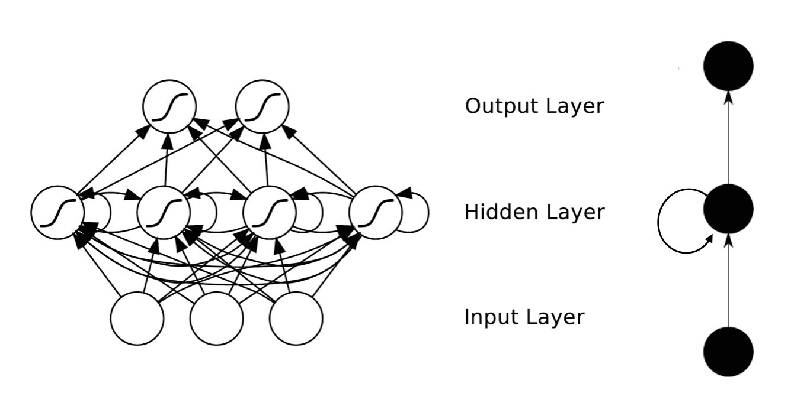

RNNs 包含输入单元(Input units)，输入集标记为 `{x0,x1,...,xt,xt+1,...}`，而输出单元(Output units)的输出集则被标记为 `{y0,y1,...,yt,yt+1.,..}` 。RNNs 还包含隐藏单元(Hidden units)，我们将其输出集标记为 `{s0,s1,...,st,st+1,...}`，这些隐藏单元完成了最为主要的工作。你会发现，在图中：有一条单向流动的信息流是从输入单元到达隐藏单元的，与此同时另一条单向流动的信息流从隐藏单元到达输出单元。在某些情况下，RNNs 会打破后者的限制，引导信息从输出单元返回隐藏单元，这些被称为 “Back Projections（反映射）”，并且隐藏层的输入还包括上一隐藏层的状态，**即隐藏层内的节点可以自连也可以互连**。 

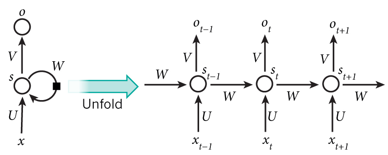


上图将循环神经网络进行展开成一个全神经网络。例如，对一个包含 5 个单词的语句，那么展开的网络便是一个五层的神经网络，每一层代表一个单词。对于该网络的计算过程如下：

1. `xt` 表示第 `t,t=1,2,3...`步(step)的输入。比如，`x1` 为第二个词的 one-hot 向量(根据上图，`x0` 为第一个词)； 
2. `st` 为隐藏层的第 `t` 步的状态，它是网络的记忆单元。 `st` 根据当前输入层的输出与上一步隐藏层的状态进行计算。`st=f(Uxt+Wst−1)`，其中 `f` 一般是非线性的激活函数，如 tanh 或 ReLU，在计算 `s0` 时，即第一个单词的隐藏层状态，需要用到 `s−1`，但是其并不存在，在实现中一般置为 0 向量；
3. `ot` 是第t步的输出，如下个单词的向量表示，`ot=softmax(Vst)`. 

## 31. RNN是怎么从单层网络一步一步构造的？

> [完全图解RNN、RNN变体、Seq2Seq、Attention机制](https://zhuanlan.zhihu.com/p/28054589) - 知乎

### 31.1 从单层网络谈起

在学习 RNN 之前，首先要了解一下最基本的单层网络，它的结构如图：


输入是 `x`，经过变换 `Wx+b` 和激活函数f得到输出 `y`。相信大家对这个已经非常熟悉了。

### 31.2 经典的RNN结构（N vs N）
在实际应用中，我们还会遇到很多序列形的数据：


如：

1. 自然语言处理问题。`x1` 可以看做是第一个单词，`x2` 可以看做是第二个单词，依次类推。

2. 语音处理。此时，`x1、x2、x3……` 是每帧的声音信号。

3. 时间序列问题。例如每天的股票价格等等。

序列形的数据就不太好用原始的神经网络处理了。为了建模序列问题，RNN 引入了隐状态 `h`（hidden state）的概念，`h` 可以对序列形的数据提取特征，接着再转换为输出。

先从 `h1` 的计算开始看：


图示中记号的含义是：

a）圆圈或方块表示的是向量。

b）一个箭头就表示对该向量做一次变换。如上图中 `h0` 和 `x1` 分别有一个箭头连接，就表示对 `h0` 和 `x1` 各做了一次变换。

在很多论文中也会出现类似的记号，初学的时候很容易搞乱，但只要把握住以上两点，就可以比较轻松地理解图示背后的含义。

`h2` 的计算和 `h1` 类似。要注意的是，在计算时，每一步使用的参数 `U、W、b` 都是一样的，**也就是说每个步骤的参数都是共享的**，这是 RNN 的重要特点，一定要牢记。

依次计算剩下来的（使用相同的参数 `U、W、b`）：

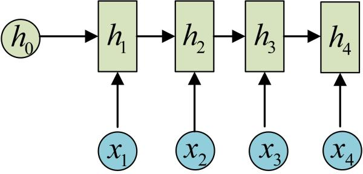

我们这里为了方便起见，只画出序列长度为 4 的情况，实际上，这个计算过程可以无限地持续下去。

我们目前的 RNN 还没有输出，得到输出值的方法就是直接通过 `h` 进行计算：

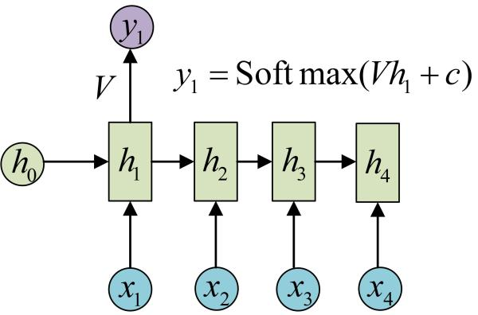

正如之前所说，一个箭头就表示对对应的向量做一次类似于 `f(Wx+b)` 的变换，这里的这个箭头就表示对 `h1` 进行一次变换，得到输出 `y1`。

剩下的输出类似进行（使用和 `y1` 同样的参数 `V` 和 `c`）：

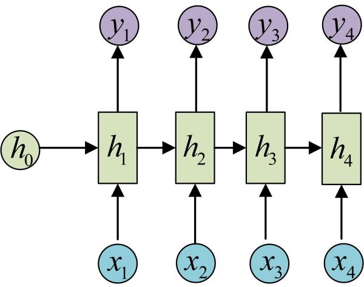

OK！大功告成！这就是最经典的 RNN 结构，我们像搭积木一样把它搭好了。它的输入是 `x1, x2, .....xn`，输出为 `y1, y2, ...yn`，也就是说，输入和输出序列必须要是等长的。

由于这个限制的存在，经典RNN的适用范围比较小，但也有一些问题适合用经典的RNN结构建模，如：

1. 计算视频中每一帧的分类标签。因为要对每一帧进行计算，因此输入和输出序列等长。

2. 输入为字符，输出为下一个字符的概率。这就是著名的 Char RNN（详细介绍请参考：The Unreasonable Effectiveness of Recurrent Neural Networks，Char RNN 可以用来生成文章、诗歌，甚至是代码。此篇博客里有自动生成歌词的实验教程《基于torch学汪峰写歌词、聊天机器人、图像着色/生成、看图说话、字幕生成》）。

### 31.3 N VS 1
有的时候，我们要处理的问题输入是一个序列，输出是一个单独的值而不是序列，应该怎样建模呢？实际上，我们只在最后一个 `h` 上进行输出变换就可以了：

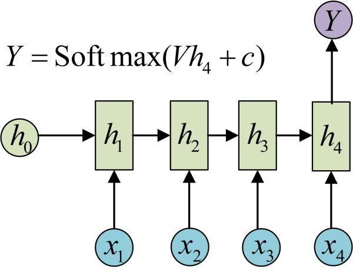

**这种结构通常用来处理序列分类问题**。如输入一段文字判别它所属的类别，输入一个句子判断其情感倾向，输入一段视频并判断它的类别等等。

### 31.4 1 VS N
输入不是序列而输出为序列的情况怎么处理？我们可以只在序列开始进行输入计算：

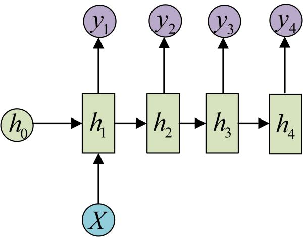

还有一种结构是把输入信息 `X` 作为每个阶段的输入：

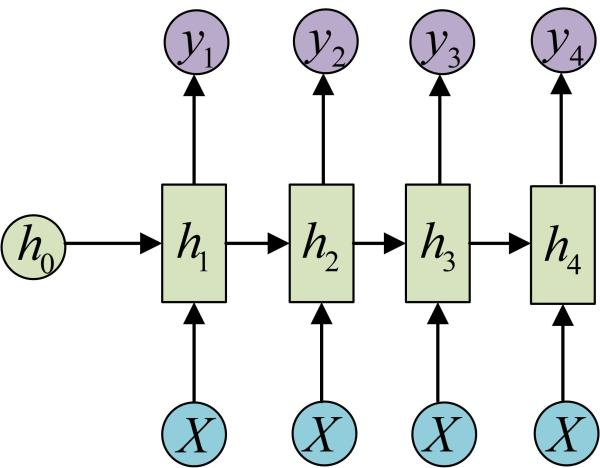

下图省略了一些 `X` 的圆圈，是一个等价表示：

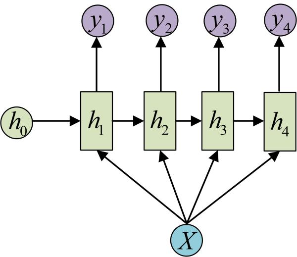

**这种 1 VS N 的结构可以处理的问题有**：

1. 从图像生成文字（image caption），此时输入的 `X` 就是图像的特征，而输出的 `y` 序列就是一段句子
2. 从类别生成语音或音乐等

### 31.5 N vs M
下面我们来介绍 RNN 最重要的一个变种：N vs M。这种结构又叫 Encoder-Decoder 模型，也可以称之为 Seq2Seq 模型。

原始的 N vs N RNN 要求序列等长，然而我们遇到的大部分问题序列都是不等长的，如机器翻译中，源语言和目标语言的句子往往并没有相同的长度。

为此，Encoder-Decoder 结构先将输入数据编码成一个上下文向量 `c`：

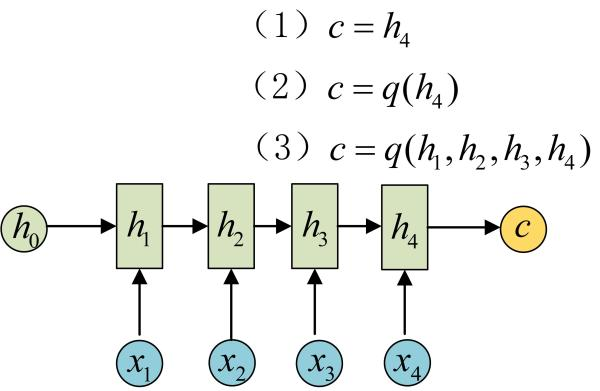


得到 `c` 有多种方式，最简单的方法就是把 Encoder 的最后一个隐状态赋值给 `c`，还可以对最后的隐状态做一个变换得到 `c`，也可以对所有的隐状态做变换。

拿到 `c` 之后，就用另一个 RNN 网络对其进行解码，这部分 RNN 网络被称为 Decoder。具体做法就是将 `c` 当做之前的初始状态 `h0` 输入到 Decoder 中：

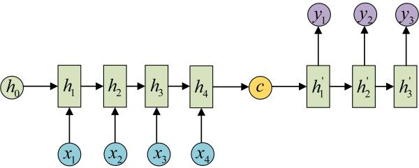

还有一种做法是将 `c` 当做每一步的输入：

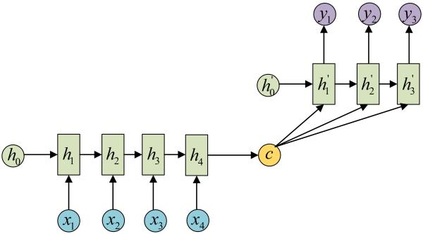

由于这种 Encoder-Decoder 结构不限制输入和输出的序列长度，因此应用的范围非常广泛，比如：

- 机器翻译。Encoder-Decoder的最经典应用，事实上这一结构就是在机器翻译领域最先提出的

- 文本摘要。输入是一段文本序列，输出是这段文本序列的摘要序列。

- 阅读理解。将输入的文章和问题分别编码，再对其进行解码得到问题的答案。

- 语音识别。输入是语音信号序列，输出是文字序列。

## 32. 简单说下 sigmoid 激活函数

常用的非线性激活函数有 sigmoid、tanh、relu 等等，前两者 **sigmoid/tanh 比较常见于全连接层**，**后者 relu 常见于卷积层**。这里先简要介绍下最基础的 sigmoid 函数（btw，在本博客中SVM那篇文章开头有提过）。

sigmoid 的函数表达式如下

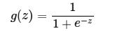

其中 `z` 是一个线性组合，比如 `z` 可以等于：`b + w1*x1 + w2*x2`。通过代入很大的正数或很小的负数到 `g(z)` 函数中可知，其结果趋近于 0 或 1。

因此，sigmoid 函数 `g(z)` 的图形表示如下（ 横轴表示定义域 `z`，纵轴表示值域 `g(z) `）：

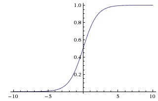

也就是说，sigmoid 函数的功能是相当于把一个实数压缩至 0 到 1 之间。当 `z` 是非常大的正数时， `g(z)` 会趋近于 1，而 `z` 是非常小的负数时，则 `g(z)` 会趋近于 0。

压缩至 0 到 1 有何用处呢？用处是这样一来便可以把激活函数看作一种 “分类的概率”，比如激活函数的输出为 0.9 的话便可以解释为 90% 的概率为正样本。

举个例子，如下图（图引自Stanford机器学习公开课）

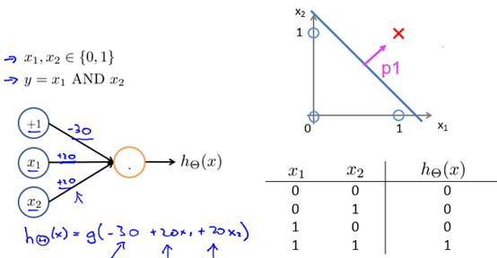

`z = b + w1*x1 + w2*x2`，其中 `b`  为偏置项 假定取 `-30`，`w1、w2`都取为 `20`

如果 `x1 = 0`，`x2 = 0`，则 `z = -30`，`g(z) = 1/( 1 + e^-z )`  趋近于 0。此外，从上图sigmoid 函数的图形上也可以看出，当 `z=-30` 的时候，`g(z)` 的值趋近于 0
如果 `x1 = 0，x2 = 1`，或 `x1 =1,x2 = 0`，则 `z = b + w1*x1 + w2*x2 = -30 + 20 = -10`，同样，`g(z)` 的值趋近于 0
如果 `x1 = 1，x2 = 1`，则 `z = b + w1*x1 + w2*x2 = -30 + 20*1 + 20*1 = 10`，此时，`g(z)` 趋近于 1。

换言之，只有 `x1` 和 `x2` 都取 1 的时候，`g(z)→1`，判定为正样本；而当只要 `x1` 或 `x2` 有一个取 0 的时候，`g(z)→0`，判定为负样本，如此达到分类的目的。

综上，sigmod 函数，是逻辑斯蒂回归的压缩函数，它的性质是可以把分隔平面压缩到 `[0,1]` 区间一个数（向量），在线性分割平面值为 0 时候正好对应 sigmod 值为 0.5，大于 0 对应 sigmod 值大于0.5、小于 0 对应 sigmod 值小于 0.5；0.5 可以作为分类的阀值；exp 的形式最值求解时候比较方便，用相乘形式作为 logistic 损失函数，使得损失函数是凸函数；**不足之处是 sigmod 函数在 `y` 趋于 0 或 1 时候有死区，控制不好在 bp 形式传递 loss 时候容易造成梯度弥撒**。

## 33. 如何理解LSTM网络

> [理解 LSTM 网络](https://www.jianshu.com/p/9dc9f41f0b29/) - 简书

> [如何理解LSTM网络](./06-如何理解LSTM网络.md)

## 34. 请详细说说CNN的工作原理

> [《CNN笔记：通俗理解卷积神经网络》](http://blog.csdn.net/v_july_v/article/details/51812459)

> [请详细说说CNN的工作原理](./07-请详细说说CNN的工作原理.md)

## 35. CNN究竟是怎样一步一步工作的？

> [卷积神经网络CNN究竟是怎样一步一步工作的？](https://www.jianshu.com/p/fe428f0b32c1)

> [CNN究竟是怎样一步一步工作的？](./08-CNN究竟是怎样一步一步工作的.md)

## 36. 基于深度学习的目标检测技术演进：R-CNN、Fast R-CNN、Faster R-CNN、YOLO、SSD

> [一文读懂目标检测：R-CNN、Fast R-CNN、Faster R-CNN、YOLO、SSD](https://blog.csdn.net/v_JULY_v/article/details/80170182)

> [基于深度学习的目标检测技术演进：R-CNN、Fast R-CNN、Faster R-CNN、YOLO、SSD](./09-基于深度学习的目标检测技术演进.md)

## 37. rcnn、fast-rcnn 和 faster-rcnn 三者的区别是什么

> [如何评价rcnn、fast-rcnn和faster-rcnn这一系列方法？](https://www.zhihu.com/question/35887527) - 知乎

首先膜拜 RBG（Ross B. Girshick）大神，不仅学术牛，工程也牛，代码健壮，文档详细，clone 下来就能跑。断断续续接触 detection 几个月，将自己所知做个大致梳理，业余级新手，理解不对的地方还请指正。

传统的 detection 主流方法是 DPM(Deformable parts models)， 在 VOC2007 上能到 43% 的 mAP，虽然 DPM 和 CNN 看起来差别很大，但 RBG 大神说 “Deformable Part Models are Convolutional Neural Networks”（http://arxiv.org/abs/1409.5403）。

CNN 流行之后，Szegedy 做过将 detection 问题作为回归问题的尝试（Deep Neural Networks for Object Detection），但是效果差强人意，在 VOC2007 上 mAP 只有 30.5%。既然回归方法效果不好，而 CNN 在分类问题上效果很好，那么为什么不把 detection 问题转化为分类问题呢？

RBG 的 RCNN 使用 region proposal（具体用的是 Selective Search  Koen van de Sande: Segmentation as Selective Search for Object Recognition）来得到有可能得到是 object 的若干（大概 `10^3` 量级）图像局部区域，然后把这些区域分别输入到 CNN 中，得到区域的 feature，再在 feature 上加上分类器，判断 feature 对应的区域是属于具体某类 object 还是背景。当然，RBG 还用了区域对应的 feature 做了针对 boundingbox 的回归，用来修正预测的 boundingbox 的位置。

RCNN 在 VOC2007 上的 mAP 是 58% 左右。RCNN 存在着重复计算的问题（proposal 的 region 有几千个，多数都是互相重叠，重叠部分会被多次重复提取 feature），于是 RBG 借鉴 Kaiming He的SPP-net 的思路单枪匹马搞出了 Fast-RCNN，跟 RCNN 最大区别就是 Fast-RCNN 将 proposal 的 region 映射到 CNN 的最后一层 conv layer 的 feature map 上，这样一张图片只需要提取一次 feature，大大提高了速度，也由于流程的整合以及其他原因，在 VOC2007 上的 mAP 也提高到了 68%。

探索是无止境的。Fast-RCNN 的速度瓶颈在 Region proposal 上，于是 RBG 和 Kaiming He 一帮人将 Region proposal 也交给 CNN 来做，提出了 Faster-RCNN。Fater-RCNN 中的 region proposal netwrok 实质是一个 Fast-RCNN，这个 Fast-RCNN 输入的 region proposal 的是固定的（把一张图片划分成 `n*n` 个区域，每个区域给出 9 个不同 ratio 和 scale 的 proposal），输出的是对输入的固定 proposal 是属于背景还是前景的判断和对齐位置的修正（regression）。Region proposal network 的输出再输入第二个 Fast-RCNN 做更精细的分类和 Boundingbox 的位置修正。

Fater-RCNN 速度更快了，而且用 VGG net 作为 feature extractor 时在 VOC2007 上 mAP 能到 73%。个人觉得制约 RCNN 框架内的方法精度提升的瓶颈是将 dectection 问题转化成了对图片局部区域的分类问题后，不能充分利用图片局部 object 在整个图片中的 context 信息。

可能 RBG 也意识到了这一点，所以他最新的一篇文章 YOLO（http://arxiv.org/abs/1506.02640）又回到了 regression 的方法下，这个方法效果很好，在 VOC2007 上 mAP 能到 63.4%，而且速度非常快，能达到对视频的实时处理（油管视频：https://www.youtube.com/channel/UC7ev3hNVkx4DzZ3LO19oebg），虽然不如 Fast-RCNN，但是比传统的实时方法精度提升了太多，而且我觉得还有提升空间。

## 38. 在神经网络中，有哪些办法防止过拟合？

缓解过拟合：

- Dropout 
- 加L1/L2正则化
- BatchNormalization
- 网络bagging

## 39. CNN是什么，CNN关键的层有哪些？

> [请详细说说CNN的工作原理](./07-请详细说说CNN的工作原理.md)

其关键层有：

- 输入层，对数据去均值，做 data augmentation 等工作
- 卷积层，局部关联抽取 feature
- 激活层，非线性变化
- 池化层，下采样
- 全连接层，增加模型非线性
- 高速通道，快速连接
- BN 层，缓解梯度弥散

## 40. GRU是什么？GRU对LSTM做了哪些改动？

GRU 是 Gated Recurrent Units，是循环神经网络的一种。

GRU 只有两个门（update 和 reset），LSTM 有三个门（forget，input，output），GRU 直接将 hidden state 传给下一个单元，而 LSTM 用 memory cell 把 hidden state 包装起来。


