## Index

<!-- TOC -->

<!-- /TOC -->

## 41. 请简述应当从哪些方向上思考和解决深度学习中出现的的over fitting问题？

如果模型的训练效果不好，可先考察以下几个方面是否有可以优化的地方。

1. 选择合适的损失函数（choosing proper loss ）

   **神经网络的损失函数是非凸的，有多个局部最低点，目标是找到一个可用的最低点**。非凸函数是凹凸不平的，但是**不同的损失函数凹凸起伏的程度不同**，例如下述的**平方损失和交叉熵损失，后者起伏更大，且后者更容易找到一个可用的最低点，从而达到优化的目的**。

   - Square Error（平方损失）
   - Cross Entropy（交叉熵损失）

2. 选择合适的 Mini-batch size

   采用合适的 Mini-batch 进行学习，**使用 Mini-batch 的方法进行学习，一方面可以减少计算量，一方面有助于跳出局部最优点**。因此要使用 Mini-batch。更进一步，batch 的选择非常重要，**batch 取太大会陷入局部最小值，batch 取太小会抖动厉害**，因此要选择一个合适的 batch size。

3. 选择合适的激活函数（New activation function）

   使用激活函数把卷积层输出结果做非线性映射，但是要选择合适的激活函数。

   - Sigmoid 函数是一个平滑函数，且具有连续性和可微性，它的最大优点就是非线性。但该函数的两端很缓，会带来猪队友的问题，易发生学不动的情况，产生梯度弥散。
   - ReLU 函数是如今设计神经网络时使用最广泛的激活函数，该函数为非线性映射，且简单，**可缓解梯度弥散**。

4. 选择合适的自适应学习率（apdative learning rate）
   - **学习率过大，会抖动厉害，导致没有优化提升**
   - **学习率太小，下降太慢，训练会很慢**

5. 使用动量（Momentum）

   **在梯度的基础上使用动量，有助于冲出局部最低点**。

如果以上五部分都选对了，效果还不好，那就是产生过拟合了，可使如下方法来防止过拟合，分别是

1. 早停法（earyly stoping）。**早停法将数据分成训练集和验证集，训练集用来计算梯度、更新权重和阈值，验证集用来估计误差，若训练集误差降低但验证集误差升高，则停止训练，同时返回具有最小验证集误差的连接权和阈值**。

2. 权重衰减（Weight Decay）。**到训练的后期，通过衰减因子使权重的梯度下降地越来越缓**。

3. Dropout。Dropout 是正则化的一种处理，以一定的概率关闭神经元的通路，阻止信息的传递。由于每次关闭的神经元不同，从而得到不同的网路模型，最终对这些模型进行融合。

4. 调整网络结构（Network Structure）。

## 42. 神经网络中，是否隐藏层如果具有足够数量的单位，它就可以近似任何连续函数？

> 通用逼近性定理指出，一个具有单个隐藏层和标准激活函数的简单前馈神经网络（即多层感知器），如果隐藏层具有足够数量的单位，它就可以近似任何连续函数。让我们在实践中看一下，看看需要多少单位来近似一些特定函数。

**方法**：我们将在 50 个数据点 `(x,y) `上训练一个 1 层神经网络，这些数据点从域 `[-1,1]` 上的以下函数中绘制，所得拟合的均方误差（mean square error，MSE）。我们将尝试以下函数（你可随时通过更改以下代码来尝试自己的函数。）

**假设**： 随着隐藏层中单位的数量增加，所得拟合的正确率（Accuracy）将会增加（误差将会减少）。

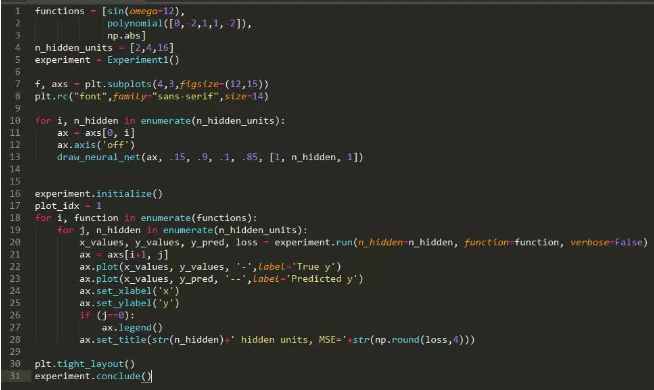

运行实验所需的时间： `91.595 s`

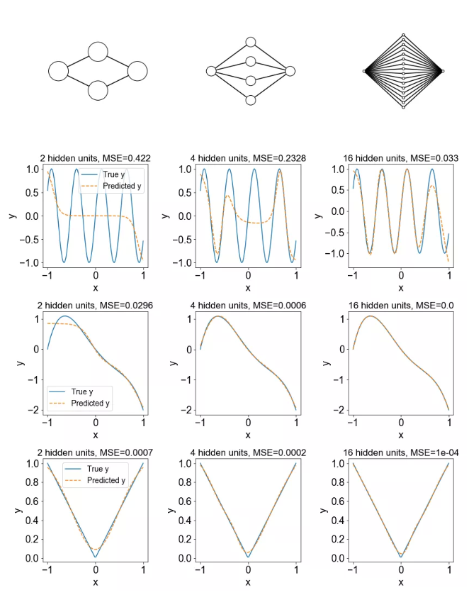

**结论**： 随着隐藏单位数量的增加，训练数据的逼近误差一般会减小。

**讨论**： 尽管通用逼近定理指出，具有足够参数的神经网络可以近似一个真实的分类 / 回归函数，但它并没有说明这些参数是否可以通过随机梯度下降这样的过程来习得。另外，你可能想知道我们是否可以从理论上计算出需要多少神经元才能很好地近似给定的函数。你可参阅论文《NEURAL NETWORKS FOR OPTIMAL APPROXIMATION OFSMOOTH AND ANALYTIC FUNCTIONS》对此的一些讨论。

论文地址：https://pdfs.semanticscholar.org/694a/d455c119c0d07036792b80abbf5488a9a4ca.pdf

## 43. 为什么更深的网络更好？ 

> 在实践中，更深的多层感知器（具有超过一个隐藏层）在许多感兴趣的任务上的表现，在很大程度上都胜过浅层感知器。为什么会出现这种情况呢？有人认为，**更深的神经网络仅需更少的参数就可以表达许多重要的函数类**。

理论上已经表明，表达简单的径向函数和组合函数需要使用浅层网络的指数级大量参数。但深度神经网络则不然。

剧透警告：我打算用实验来验证这些论文，但我不能这样做（这并不会使论文的结果无效——仅仅因为存在一组神经网络参数，并不意味着它们可以通过随机梯度下降来轻松习得）。

我唯一能做的就是，某种程度上可靠地再现来自论文《Representation Benefits of Deep Feedforward Networks》的唯一结果，这篇论文提出了一系列困难的分类问题，这些问题对更深层的神经网络而言更容易。

Representation Benefits of Deep Feedforward Networks 论文地址：https://arxiv.org/pdf/1509.08101.pdf

简单径向函数论文：https://arxiv.org/pdf/1512.03965.pdf

组合函数论文：https://arxiv.org/pdf/1603.00988.pdf

**方法**： 该数据集由沿着 x 轴的 16 个等距点组成，每对相邻点都属于相反的类。一种特殊类型的深度神经网络（一种跨层共享权重的神经网络）具有固定数量（152）的参数，但测试了层的不同数量。

**假设**： 随着具有固定数量参数的神经网络中层数的增加，困难的分类问题的正确率将得到提高。

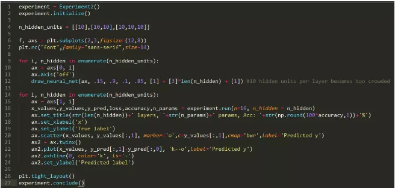

运行实验所需的时间： `28.688 s`

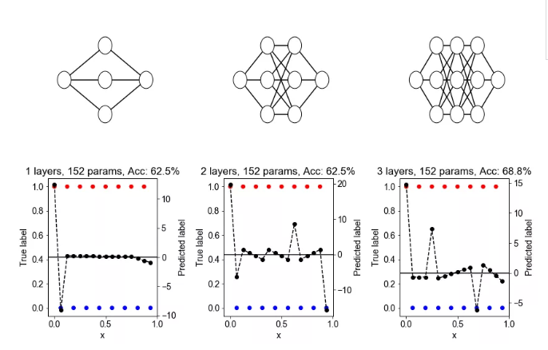

此处，红点和蓝点代表属于不同类别的点。黑色的虚线表示最接近神经网络学习的训练数据近似值（若神经网络分配的分数大于零，则被预测为红点；否则，被预测为蓝点）。零线显示为黑色。

**结论**： 在大多实验中，正确率随深度的增加而增加。

**讨论**： 似乎更深的层允许从输入到输出的学习到的函数出现更多“急弯”。这似乎跟神经网络的轨迹长度有关（即衡量输入沿着固定长度的一维路径变化时，神经网络的输出量是多少）。

轨迹长度论文：https://arxiv.org/pdf/1606.05336.pdf

## 44. 更多的数据是否有利于更深的神经网络？ 

> 深度学习和大数据密切相关；通常认为，**当数据集的规模大到足够克服过拟合时，深度学习只会比其他技术（如浅层神经网络和随机森林）更有效，并更有利于增强深层网络的表达性**。我们在一个非常简单的数据集上进行研究，这个数据集由高斯样本混合而成。

**方法**： 数据集由两个 12 维的高斯混合而成，每个高斯生成属于一个类的数据。两个高斯具有相同的协方差矩阵，但也意味着在第 `i` 个维度上有 `1/i`  单位。这个想法是基于：有一些维度，允许模型很容易区分不同的类，而其他维度则更为困难，但对区别能力还是有用的。

**假设**： 随着数据集大小的增加，所有技术方法的测试正确率都会提高，但深度模型的正确率会比非深度模型的正确率要高。我们进一步预计非深度学习技术的正确率将更快地饱和。

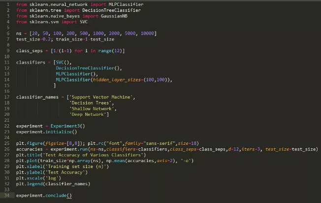

运行实验所需的时间： `138.239 s`

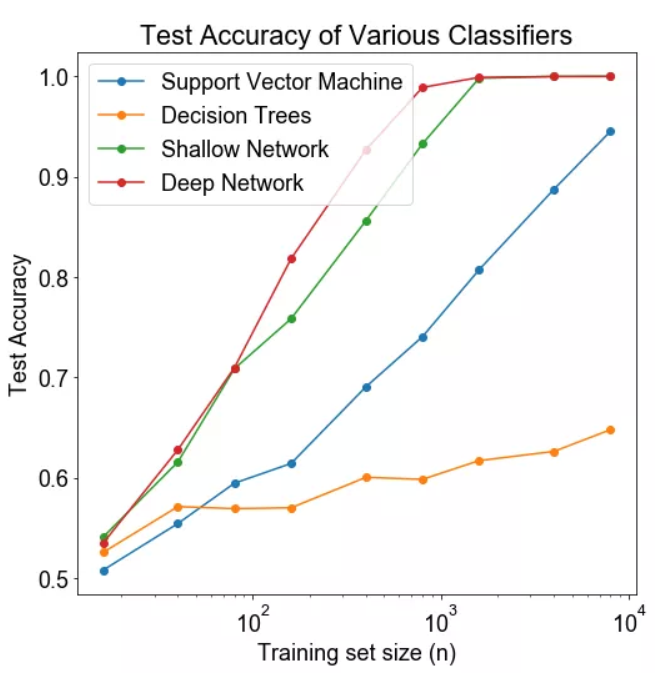

**结论**： **神经网络在数据集大小方面上表现始终优于 SVM 和随机森林**。随着数据集大小的增加，性能上的差距也随之增加，至少在神经网络的正确率开始饱和之前，这表明神经网络更有效地利用了不断增加的数据集。然而，如果有足够的数据，即使是 SVM 也会有可观的正确率。深度网络比浅层网络的表现更好。

**讨论**： 虽然增加的数据集大小确实会像我们预计的那样有利于神经网络。但有趣的是，在相对较小的数据集上，神经网络已经比其他技术表现得更好。似乎 2 层网络并没有显著的过拟合，即使我们预计某些特征（如 6-12 特征，信号水平低）导致网络过拟合。同样有趣的是，SVM 看上去似乎有足够的数据来接近于 1.0。

## 45. 不平衡数据是否会摧毁神经网络？ 

> 当数据集不平衡时（如一个类的样本比另一个类还多），那么神经网络可能就无法学会如何区分这些类。在这个实验中，我们探讨这一情况是否存在。同时我们还探讨了过采样是否可以减轻问题带来的影响，这是一种流行的补救措施，该措施使用少数类中抽样替换的样本。

**方法**：我们生成两个二维的结果（结果未在这里显示，表明相同的结果适用于更高维）高斯，每个产生属于一个类别的数据。两个高斯具有相同的协方差矩阵，但它们的意思是在第 `i` 个维度上相距 `1/i`  单位。每个训练数据集由 1,200 个数据点组成，但我们将类别不平衡从 `1:1` 变为 `1:99`。测试数据集以 `1:1` 的比例保持固定，以便于性能比较，并由 300 个点组成。我们还会在每种情况下显示决策边界。

**假设**：我们预计测试正确率会随着类别不平衡的增加而降低，但我们预计过采样可以缓解这个问题。

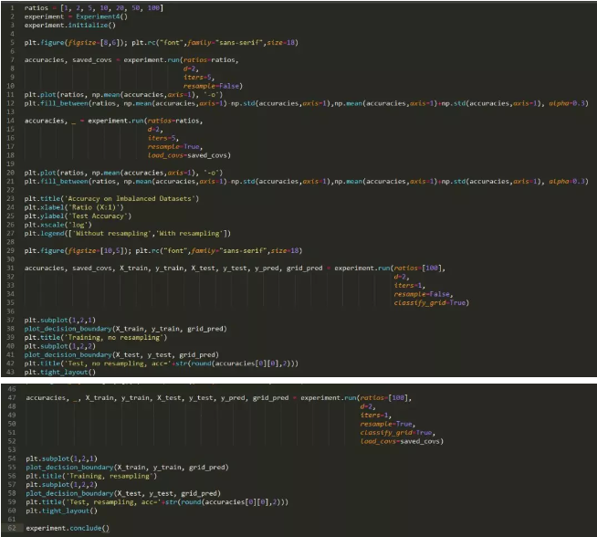

运行实验所需的时间： `392.157 s`

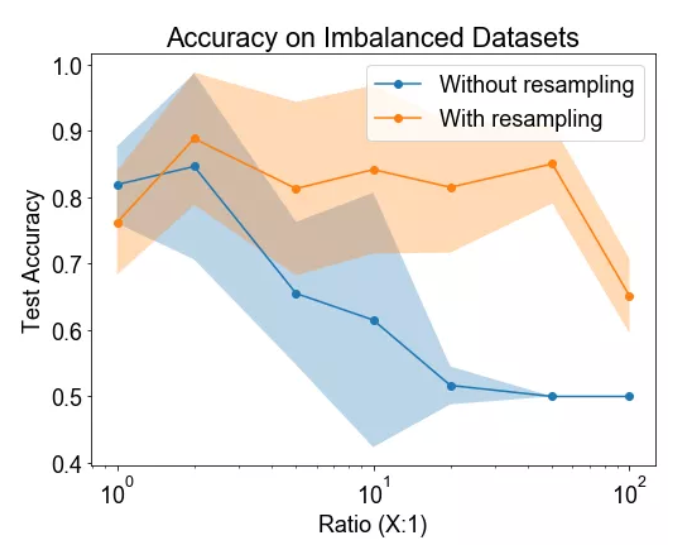

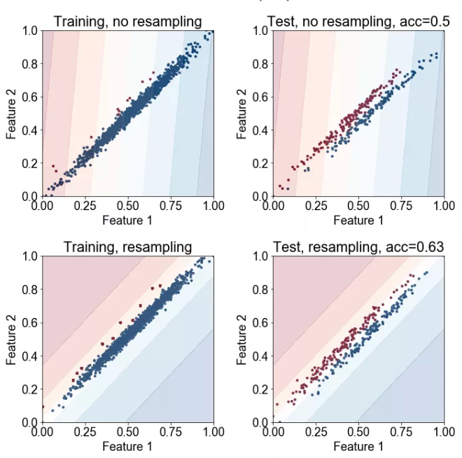

最下面的四张图显示了连同训练点（左）或测试点（右）绘制的决策边界的数量。第一行显示没有重采样法的结果，底部显示了使用重采样法的结果。

**结论**： 研究结果表明，**类的不平衡无疑地降低了分类的正确率。重采样法可以显著提高性能**。

**讨论**： 重采样法对提高分类正确率有显著的影响，这可能有点让人惊讶了，因为它并没有将分类器展示少数类中的新训练的样本。但该图显示，重采样法足以“助推（nudge）”或将决策边界推向正确的方向。在重采样法不是有效的情况下，那么可能需要复合方式来合成新的训练样本，以提高正确率。

相关论文地址：http://www.jair.org/media/953/live-953-2037-jair.pdf

## 46. 你如何判断一个神经网络是记忆还是泛化? 

> **具有许多参数的神经网络具有记忆大量训练样本的能力**。那么，神经网络是仅仅记忆训练样本（然后简单地根据最相似的训练点对测试点进行分类），还是它们实际上是在提取模式并进行归纳？这有什么不同吗？

人们认为存在不同之处的一个原因是，神经网络学习随机分配标签不同于它学习重复标签的速度。这是 Arpit 等人在论文中使用的策略之一。让我们看看是否有所区别？

相关论文地址：https://arxiv.org/pdf/1706.05394.pdf

**方法**： 首先我们生成一个 6 维高斯混合，并随机分配它们的标签。我们测量训练数据的正确率，以增加数据集的大小，了解神经网络的记忆能力。然后，我们选择一个神经网络能力范围之内的数据集大小，来记忆并观察训练过程中神经网络与真实标签之间是否存在本质上的差异。特别是，我们观察每个轮数的正确率度，来确定神经网络是真正学到真正的标签，还是随机标签。

**假设**： 我们预计，对随机标签而言，训练应该耗费更长的时间。而真正标签则不然。

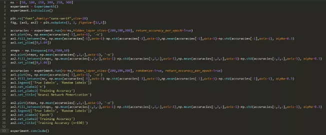

运行实验所需的时间： `432.275 s`

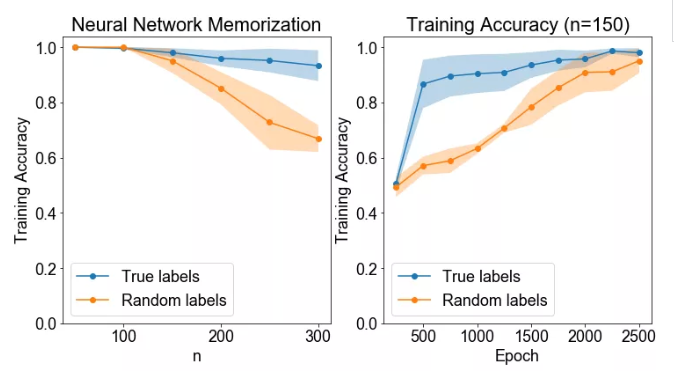

**结论**： **神经网络的记忆能力约为 150 个训练点**。但即便如此，神经网络也需要更长的时间来学习随机标签，而不是真实值（ground truth）标签。

**讨论**： 这个结果并不令人感到意外。我们希望真正的标签能够更快的学到，如果一个神经网络学会正确地分类一个特定的数据点时，它也将学会分类其他类似的数据点——如果标签是有意义的，但前提它们不是随机的！

## 47. 无监督降维提供的是帮助还是摧毁？ 

> 当处理非常高维的数据时，神经网络可能难以学习正确的分类边界。在这些情况下，可以考虑在将数据传递到神经网络之前进行无监督的降维。这做法提供的是帮助还是摧毁呢？

**方法**：我们生成两个 10 维高斯混合。高斯具有相同的协方差矩阵，但在每个维度上都有一个由 1 隔开的均值。然后，我们在数据中添加 “虚拟维度”，这些特征对于两种类型的高斯都是非常低的随机值，因此对分类来说没有用处。

然后，我们将结果数据乘以一个随机旋转矩阵来混淆虚拟维度。小型数据集大小 (n=100) 使神经网络难以学习分类边界。因此，我们将数据 PCA 为更小的维数，并查看分类正确率是否提高。

**假设**：我们预计 PCA 将会有所帮助，因为变异最多的方向（可能）与最有利于分类的方向相一致。

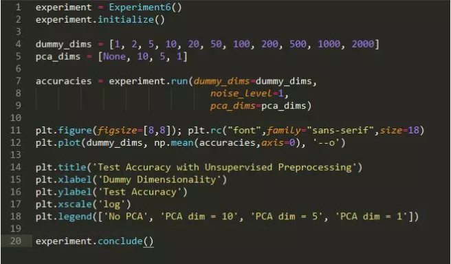

运行实验所需的时间： `182.938 s`

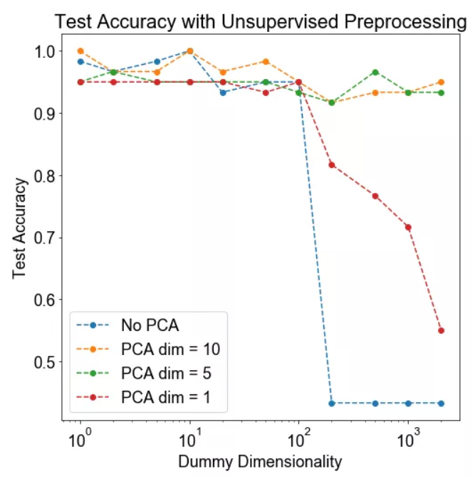

**结论**： **当维度非常大时，无监督的 PCA 步骤可以显著改善下游分类**。

**讨论**： 我们观察到一个有趣的阈值行为。当维数超过 100 时（有趣的是，这数字是数据集中数据点的数量——这值得进一步探讨），分类的质量会有显著的下降。在这些情况下，5~10 维的 PCA 可显著地改善下游分类。

## 48. 是否可以将任何非线性作为激活函数? 

> 在通过具有超出典型 ReLU() 和 tanh() 的特殊激活函数的神经网络获得小幅提高的研究，已有多篇论文报道。我们并非试图开发专门的激活函数，而是简单地询问它是否可能在神经网络中使用任何旧的非线性函数？

**方法**：我们生成著名的二维卫星数据集，并训练一个具有两个隐藏层的神经网络来学习对数据集进行分类。我们尝试了六种不同的激活函数。

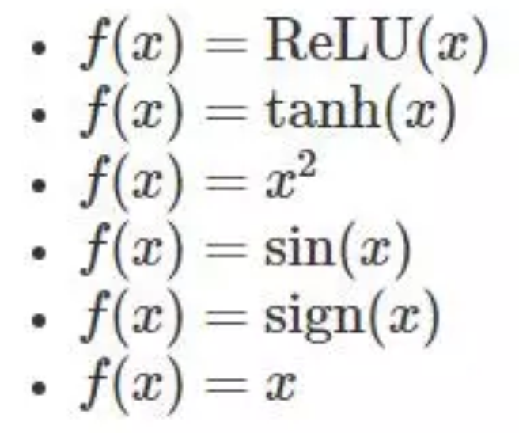

**假设**：我们预计恒等函数执行很差（因为直到最后一个 softmax 层，网络仍然保持相当的线性）。我们可能会进一步期望标准的激活函数能够发挥最好的效果。

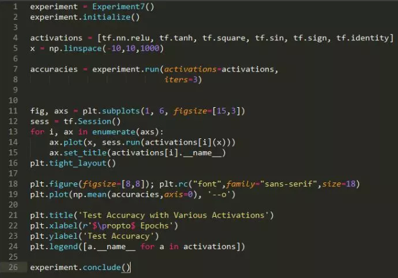

运行实验所需的时间: `22.745 s`

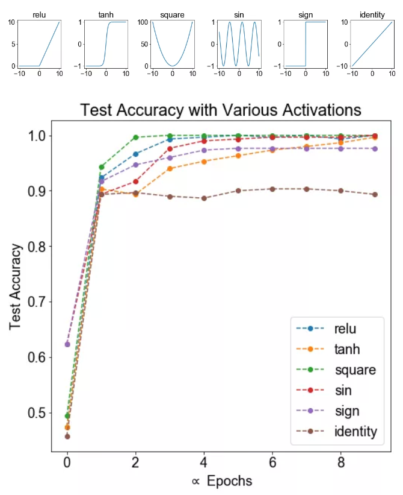

**结论**：**除去 sign(x) 外，所有的非线性激活函数对分类任务都是非常有效的**。

**讨论**：结果有些令人吃惊，因为所有函数都同样有效。事实上，像 x2 这样的对称激活函数表现得和 ReLUs 一样好！从这个实验中，我们应该谨慎地推断出太多的原因。

首先，这是一个相对较浅的神经网络。对这种网络有好处的激活函数可能与那些对深度网络有好处的函数非常不同。此外，这个任务可能过于简单，即使几乎完全线性的神经网络 f(x)=x 也能达到约 88% 的正确率。

## 49. 批大小如何影响测试正确率？

**方法**：我们生成两个 12 维高斯混合。高斯具有相同的协方差矩阵，但在每个维度上都有一个由 1 隔开的均值。该数据集由 500 个高斯组成，其中 400 个用于训练，100 个用于测试。我们在这个数据集上训练一个神经网络，使用不同的批大小，从 1 到 400。我们测量了之后的正确率。

**假设**：我们期望较大的批大小会增加正确率（较少的噪声梯度更新），在一定程度上，测试的正确率将会下降。我们预计随着批大小的增加，运行时间应有所下降。

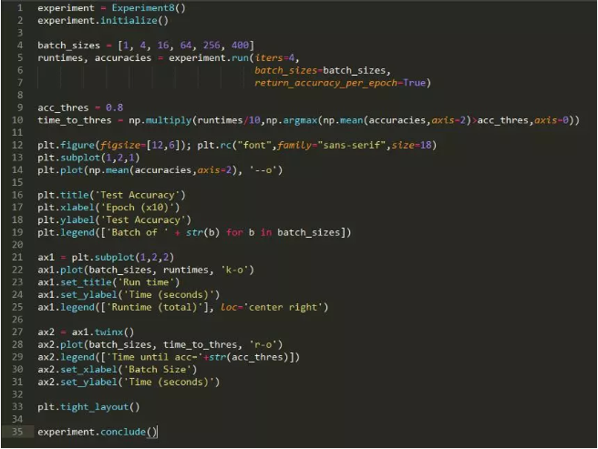

运行实验所需的时间： `293.145 s`

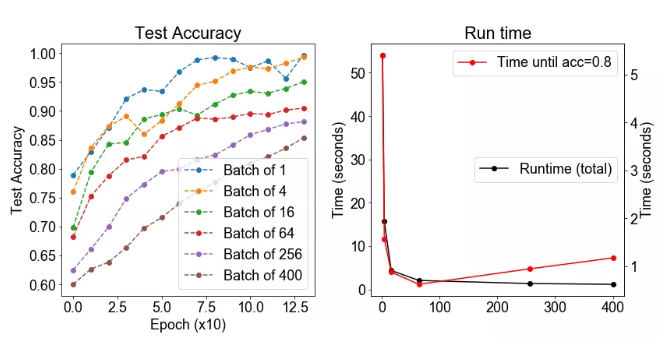

**结论**：正如我们预期那样，**运行时间确实随着批大小的增加而下降。然而，这导致了测试正确率的妥协，因为测试正确率随着批大小的增加而单调递减**。

**讨论**：这很有趣，但这与普遍的观点不一致，严格来说，即中等规模的批大小更适用于训练。这可能是由于我们没有调整不同批大小的学习率。因为更大的批大小运行速度更快。总体而言，对批大小的最佳折衷似乎是为 64 的批大小。

相关论文：https://arxiv.org/abs/1508.02788

## 50. 损失函数重要吗？

> 对于分类任务，通常使用交叉熵损失函数。如果我们像通常在回归任务中那样使用均方差，结果会怎么样？我们选择哪一个会很重要么？

**方法**： 我们生成两个 12 维高斯混合。高斯具有相同的协方差矩阵，但在每个维度上都有一个由 1 隔开的均值。该数据集由 500 个高斯组成，其中 400 个用于训练，100 个用于测试。我们使用几种不同的函数在这个数据集上训练一个神经网络，以确定最终正确率是否存在系统差异。作为阴性对照，包括一个不变的损失函数。

**假设**： 我们预计交叉熵损失函数作为分类任务的标准损失函数，表现最好，同时我们预计其他损失函数表现不佳。

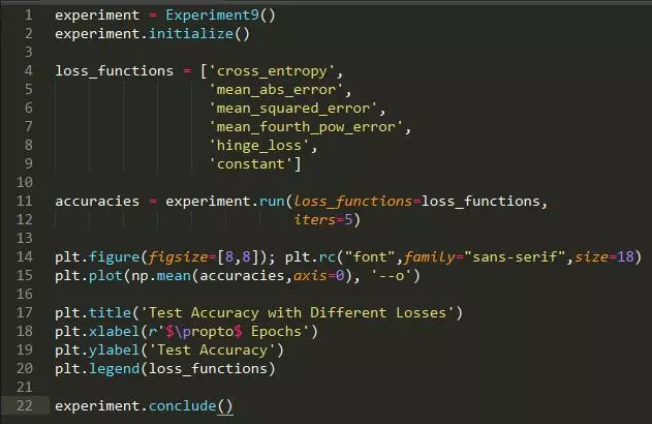

运行实验所需的时间： `36.652 s`

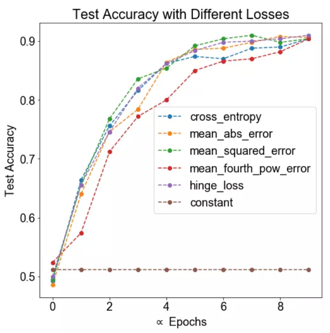

**结论**： 除去阴性对照外，所有的损失都有类似的表现。损失函数是标签与逻辑之间的区别，提升到四次幂，其性能要比其他差一些。

**讨论**： 损失函数的选择对最终结果没有实质影响，这也许不足为奇，因为这些损失函数非常相似。

## 51. 初始化如何影响训练? 

**方法**：我们生成两个 12 维高斯混合。高斯具有相同的协方差矩阵，但在每个维度都有一个由 1 隔开的均值。该数据集由 500 个高斯组成，其中 400 个用于训练，100 个用于测试。我们在这个神经网络中初始化权重值，看哪一个具有最好的训练性能。

**假设**：我们期望 Xavier 损失具有最好的性能（它是 tensorflow 中使用的默认值），而其他方法性能不佳（尤其是不断的初始化）。

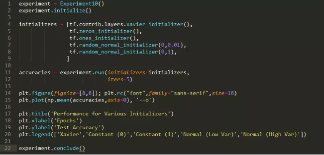

运行实验所需的时间： `34.137 s`

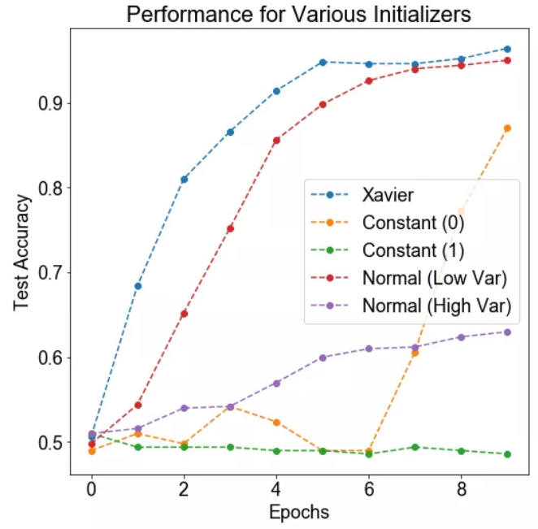

**结论**：**Xavier 和高斯（具有较低的方差）初始化会得到很好的训练**。有趣的是，常数 0 的初始化最终导致训练，而其他初始化并不会。

**讨论**：Xavire 初始化提供了最好的性能，这并不奇怪。标准偏差小的高斯也适用（但不像 Xavire 那样好）。如果方差变得太大，那么训练速度就会变得较慢，这可能是因为神经网络的大部分输出都发生了爆炸。

有趣的是，持续的初始化（理论上不应该能够训练神经网络）在几个轮数之后就会导致训练进行。这可能是由于核心并行化导致小的数值误差，最终导致了不同权重的散度。有趣的是，当权重都为 1 时，这些就都不起作用了。

## 52. 不同层的权重是否以不同的速度收敛？ 

我们的第一个问题是，不同层的权重是否以不同的速度收敛。

**方法**： 我们生成两个 12 维高斯混合。高斯具有相同的协方差矩阵，但每个维度上都有一个由 1 隔开的均值。该数据集由 500 个高斯组成，其中 400 个用于训练，100 个用于测试。我们在这个数据集上训练一个带有 3 个隐藏层（将导致 4 层权重，包括从输入到）第一层的权重）的神经网络，我们在训练过程中绘制每层 50 个权重值。我们通过绘制两个轮数之间的权重的差分来衡量收敛性。

**假设**： 我们期望后一层的权重会更快地收敛，因为它们在整个网络中进行反向传播时，后期阶段的变化会被放大。

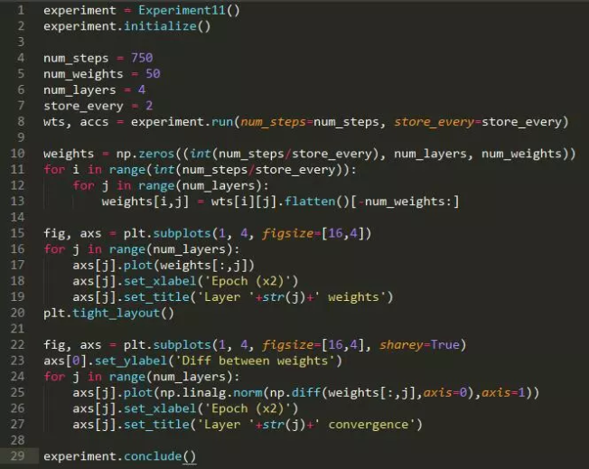

运行实验所需的时间： `3.924 s`

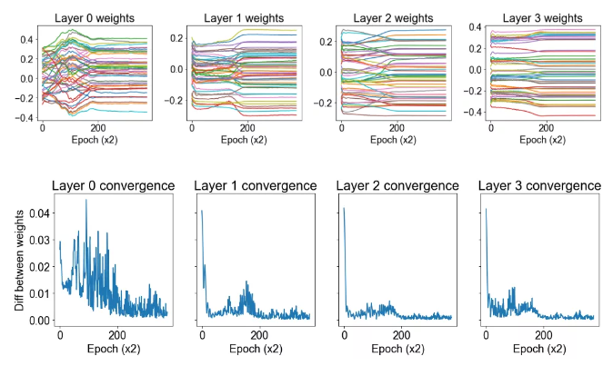

**结论**： **我们发现后一层的权重比前一层收敛得更快**。

**讨论**： 看上去第三层的权重是几乎单调地收敛到它们的最终值，而且这一过程非常快。至于前几层权重的收敛模式，比较复杂，似乎需要更长的时间才能解决。

## 53. 正则化如何影响权重？ 

**方法**：我们生成两个 12 维高斯混合。高斯具有相同的协方差矩阵，但在每个维度上都有一个由 1 隔开的均值。该数据集由 500 个高斯组成，其中 400 个用于训练，100 个用于测试。我们在这个数据集上训练一个具有 2 个隐藏层的神经网络，并在整个训练过程中绘制 50 个权重值。

然后我们在损失函数中包含 L1 或 L2 正则项之后重复这一过程。我们研究这样是否会影响权重的收敛。我们还绘制了正确率的图像，并确定它在正则化的情况下是否发生了显著的变化。

**假设**：我们预计在正则化的情况下，权重的大小会降低。在 L1 正则化的情况下，我们可能会得到稀疏的权重。如果正则化强度很高，我们就会预计正确率下降，但是正确率实际上可能会随轻度正则化而上升。

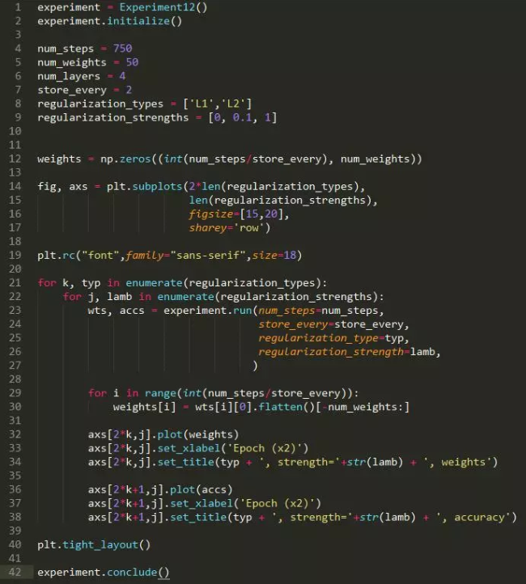

运行实验所需的时间： `17.761 s`

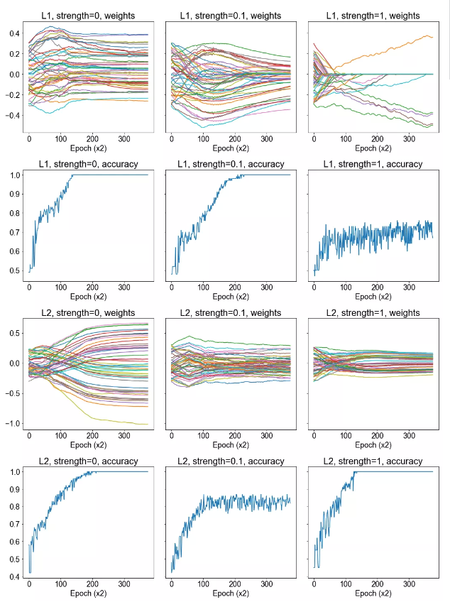

**结论**：**我们注意到正则化确实降低了权重的大小，在强 L1 正则化的情况下导致了稀疏性**。对正确率带来什么样的影响尚未清楚。

**讨论**：从我们所选的 50 个权重的样本可以清晰地看出，正则化对训练过程中习得的权重有着显著的影响。我们在 L1 正则化的情况下能够获得一定程度的稀疏性，虽然看起来有较大的正则化强度，这就导致正确率的折衷。而 L2 正则化不会导致稀疏性，它只有更小幅度的权重。同时，对正确率似乎没有什么有害的影响。

最后注意事项 

我们只是刚刚开始做了肤浅的研究。例如，所有这些实验都涉及（不是那么深的）MLP，并且有很多实验如果用 CNN 或 RNN 来做会很有趣。

如果你想添加一个实验，请考虑以下我认为值得探讨的一些观点：

- 批大小和学习率之间的关系是什么？
- 端到端的学习与训练神经网络在任务上的区别是什么？
- 什么是批标准化？它为什么有用？
- 当数据有限时，迁移学习对神经网络有没有帮助？

## 54. 什么是 fine-tuning？

在实践中，由于数据集不够大，很少有人从头开始训练网络。常见的做法是使用预训练的网络（例如在ImageNet 上训练的分类 1000 类的网络）来重新 fine-tuning（也叫微调），或者当做特征提取器。

**以下是常见的两类迁移学习场景**：

1. 卷积网络当做特征提取器。使用在 ImageNet 上预训练的网络，去掉最后的全连接层，剩余部分当做特征提取器（例如 AlexNet 在最后分类器前，是 4096 维的特征向量）。这样提取的特征叫做 CNN codes 。得到这样的特征后，可以使用线性分类器（Liner SVM、Softmax 等）来分类图像。

2. Fine-tuning 卷积网络。替换掉网络的输入层（数据），使用新的数据继续训练。Fine-tune 时可以选择 fine-tune 全部层或部分层。通常，前面的层提取的是图像的通用特征（generic features）（例如边缘检测，色彩检测），这些特征对许多任务都有用。后面的层提取的是与特定类别有关的特征，因此 fine-tune 时常常只需要 Fine-tuning 后面的层。

预训练模型 

在 ImageNet 上训练一个网络，即使使用多 GPU 也要花费很长时间。因此人们通常共享他们预训练好的网络，这样有利于其他人再去使用。例如，Caffe 有预训练好的网络地址 Model Zoo。

何时以及如何 Fine-tune

决定如何使用迁移学习的因素有很多，这是最重要的只有两个：

- 新数据集的大小

- 以及新数据和原数据集的相似程度。

有一点一定记住：**网络前几层学到的是通用特征，后面几层学到的是与类别相关的特征**。这里有使用的四个场景：

1. **新数据集比较小且和原数据集相似**。因为新数据集比较小，如果 fine-tune 可能会过拟合；又因为新旧数据集类似，我们期望他们高层特征类似，可以使用预训练网络当做特征提取器，用提取的特征训练线性分类器。

2. **新数据集大且和原数据集相似**。因为新数据集足够大，可以 fine-tune 整个网络。

3. **新数据集小且和原数据集不相似**。新数据集小，最好不要 fine-tune，和原数据集不类似，最好也不使用高层特征。这时可是使用前面层的特征来训练 SVM 分类器。

4. **新数据集大且和原数据集不相似**。因为新数据集足够大，可以重新训练。但是实践中 fine-tune 预训练模型还是有益的。新数据集足够大，可以 fine-tine 整个网络。

实践建议

预训练模型的限制。使用预训练模型，受限于其网络架构。例如，你不能随意从预训练模型取出卷积层。但是因为参数共享，可以输入任意大小图像；卷积层和池化层对输入数据大小没有要求（只要步长 stride fit），其输出大小和属于大小相关；全连接层对输入大小没有要求，输出大小固定。

学习率。**与重新训练相比，fine-tune 要使用更小的学习率**。因为训练好的网络模型权重已经平滑，我们不希望太快扭曲（distort）它们（尤其是当随机初始化线性分类器来分类预训练模型提取的特征时）。

更多参考

> CNN Features off-the-shelf: an Astounding Baseline for Recognition基于ImageNet预训练模型提取特征训练SVM分类器，陈述了几个最优结果。
>
> DeCAF2013年报告了类似发现。这篇论文使用的框架接口为Python，实现是caffe的c++。
>
> How transferable are features in deep neural networks?详细介绍了迁移学习，包括一些大学发现的layer co-adaptations。

## 55. 请简单解释下目标检测中的这个IOU评价函数（intersection-over-union）

在目标检测的评价体系中，有一个参数叫做 IoU ，简单来讲就是模型产生的目标窗口和原来标记窗口的交叠率。

具体我们可以简单的理解为：即检测结果 DetectionResult 与真实值 Ground Truth 的交集比上它们的并集，即为检测的准确率 IoU :

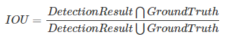

举个例子，下面是一张原图

然后我们对其做下目标检测，其 DR = DetectionResult，GT = GroundTruth。

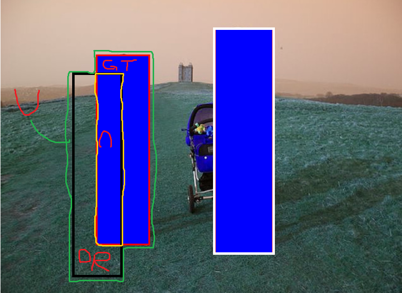

黄色边框框起来的是：

`DR⋂GT`

绿色框框起来的是：
`DR⋃GT`

不难看出，最理想的情况就是 DR 与 GT 完全重合，即 IoU = 1。

本题解析来源：https://blog.csdn.net/Eddy_zheng/article/details/52126641

## 56. 什么是边框回归 Bounding-Box regression，以及为什么要做、怎么做

这个问题可以牵扯出不少问题，比如

- 为什么要边框回归？
- 什么是边框回归？
- 边框回归怎么做的？
- 边框回归为什么宽高，坐标会设计这种形式？
- 为什么边框回归只能微调，在离真实值Ground Truth近的时候才能生效？

如图 1 所示，绿色的框表示真实值 Ground Truth, 红色的框为 Selective Search 提取的候选区域/框 Region Proposal。那么即便红色的框被分类器识别为飞机，但是由于红色的框定位不准( IoU<0.5 )， 这张图也相当于没有正确的检测出飞机。

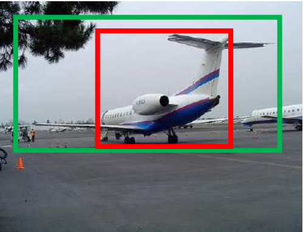

如果我们能对红色的框进行微调 fine-tuning，使得经过微调后的窗口跟 Ground Truth 更接近， 这样岂不是定位会更准确。 而 Bounding-box regression 就是用来微调这个窗口的。

**边框回归是什么？**

对于窗口一般使用四维向量 `(x,y,w,h)` 来表示， 分别表示窗口的中心点坐标和宽高。 对于图 2, 红色的框 P 代表原始的 Proposal, 绿色的框 G 代表目标的 Ground Truth， 我们的目标是寻找一种关系使得输入原始的窗口 P 经过映射得到一个跟真实窗口 G 更接近的回归窗口`G^`。

所以，边框回归的目的即是：给定 `(Px,Py,Pw,Ph)` 寻找一种映射f， 使得 `f(Px,Py,Pw,Ph)=(Gx^,Gy^,Gw^,Gh^)` 并且 `(Gx^,Gy^,Gw^,Gh^)≈(Gx,Gy,Gw,Gh)`

边框回归怎么做的？

那么经过何种变换才能从图2中的窗口 P 变为窗口G^呢？ 比较简单的思路就是: 平移+尺度放缩

先做平移 `(Δx,Δy)，Δx=Pwdx(P),Δy=Phdy(P)` 这是 R-CNN 论文的：

`G^x=Pwdx(P)+Px`,(1)

`G^y=Phdy(P)+Py`,(2)

然后再做尺度缩放 `(Sw,Sh), Sw=exp(dw(P)),Sh=exp(dh(P))`,对应论文中：

`G^w=Pwexp(dw(P))`,(3)

`G^h=Phexp(dh(P))`,(4)

观察 (1)-(4) 我们发现， 边框回归学习就是 `dx(P),dy(P),dw(P),dh(P)` 这四个变换。

下一步就是设计算法那得到这四个映射。

线性回归就是给定输入的特征向量 X, 学习一组参数 W, 使得经过线性回归后的值跟真实值 Y(Ground Truth)非常接近. 即 `Y≈WX`。 那么 Bounding-box 中我们的输入以及输出分别是什么呢？

Input:

`RegionProposal→P=(Px,Py,Pw,Ph)` 这个是什么？ 输入就是这四个数值吗？其实真正的输入是这个窗口对应的 CNN 特征，也就是 R-CNN 中的 Pool5 feature（特征向量）。 (注：训练阶段输入还包括 Ground Truth， 也就是下边提到的 `t∗=(tx,ty,tw,th))`

Output:

需要进行的平移变换和尺度缩放 `dx(P),dy(P),dw(P),dh(P)`，或者说是 `Δx,Δy,Sw,Sh`。我们的最终输出不应该是 Ground Truth 吗？ 是的， 但是有了这四个变换我们就可以直接得到 Ground Truth。

这里还有个问题， 根据 (1)~(4) 我们可以知道， P 经过 `dx(P),dy(P),dw(P),dh(P)` 得到的并不是真实值 G，而是预测值 `G^`。的确，这四个值应该是经过 Ground Truth 和 Proposal 计算得到的真正需要的平移量 `(tx,ty)` 和尺度缩放 `(tw,th)`。 

这也就是 R-CNN 中的 (6)~(9)： 

`tx=(Gx−Px)/Pw`,(6)

`ty=(Gy−Py)/Ph`,(7)

`tw=log(Gw/Pw)`,(8)

`th=log(Gh/Ph)`,(9)

那么目标函数可以表示为 `d∗(P)=wT∗Φ5(P)`，`Φ5(P)` 是输入 Proposal 的特征向量，`w∗` 是要学习的参数（`*` 表示 `x,y,w,h`， 也就是每一个变换对应一个目标函数） , `d∗(P)` 是得到的预测值。

我们要让预测值跟真实值 `t∗=(tx,ty,tw,th)` 差距最小， 得到损失函数为：

`Loss=∑iN(ti∗−w^T∗ϕ5(Pi))2`

函数优化目标为：

`W∗=argminw∗∑iN(ti∗−w^T∗ϕ5(Pi))2+λ||w^∗||2`

利用梯度下降法或者最小二乘法就可以得到 `w∗`。

本题解析来源：https://blog.csdn.net/zijin0802034/article/details/77685438

## 57. 请阐述下 Selective Search 的主要思想

1. 使用一种过分割手段，将图像分割成小区域 (1k~2k 个)
2. 查看现有小区域，按照合并规则合并可能性最高的相邻两个区域。重复直到整张图像合并成一个区域位置 
3. 输出所有曾经存在过的区域，所谓候选区域

其中合并规则如下： 优先合并以下四种区域： 

- 颜色（颜色直方图）相近的 
- 纹理（梯度直方图）相近的 
- 合并后总面积小的： 保证合并操作的尺度较为均匀，避免一个大区域陆续“吃掉”其他小区域 （例：设有区域a-b-c-d-e-f-g-h。较好的合并方式是：ab-cd-ef-gh -> abcd-efgh -> abcdefgh。 不好的合并方法是：ab-c-d-e-f-g-h ->abcd-e-f-g-h ->abcdef-gh -> abcdefgh）

合并后，总面积在其 BBOX 中所占比例大的： 保证合并后形状规则。

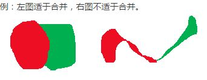

上述四条规则只涉及区域的颜色直方图、梯度直方图、面积和位置。合并后的区域特征可以直接由子区域特征计算而来，速度较快。

本题解析来源：https://zhuanlan.zhihu.com/p/23006190

## 58. 什么是非极大值抑制（NMS）？

R-CNN 会从一张图片中找出 n 个可能是物体的矩形框，然后为每个矩形框为做类别分类概率：

就像上面的图片一样，定位一个车辆，最后算法就找出了一堆的方框，我们需要判别哪些矩形框是没用的。非极大值抑制的方法是：先假设有 6 个矩形框，根据分类器的类别分类概率做排序，假设从小到大属于车辆的概率 分别为 A、B、C、D、E、F。

1. 从最大概率矩形框 F 开始，分别判断 A~E 与 F 的重叠度 IOU 是否大于某个设定的阈值;

2. 假设 B、D 与 F 的重叠度超过阈值，那么就扔掉 B、D；并标记第一个矩形框 F，是我们保留下来的。

3. 从剩下的矩形框 A、C、E 中，选择概率最大的 E，然后判断 E 与 A、C 的重叠度，重叠度大于一定的阈值，那么就扔掉；并标记 E 是我们保留下来的第二个矩形框。

就这样一直重复，找到所有被保留下来的矩形框。

非极大值抑制（NMS）顾名思义就是抑制不是极大值的元素，搜索局部的极大值。这个局部代表的是一个邻域，邻域有两个参数可变，一是邻域的维数，二是邻域的大小。这里不讨论通用的 NMS 算法，而是用于在目标检测中用于提取分数最高的窗口的。

> 例如在行人检测中，滑动窗口经提取特征，经分类器分类识别后，每个窗口都会得到一个分数。但是滑动窗口会导致很多窗口与其他窗口存在包含或者大部分交叉的情况。这时就需要用到 NMS 来选取那些邻域里分数最高（是行人的概率最大），并且抑制那些分数低的窗口。

## 59. 什么是深度学习中的 anchor（抛锚）？

当我们使用一个 `3*3` 的卷积核，在最后一个 feature map 上滑动，当滑动到特征图的某一个位置时，以当前滑动窗口中心为中心映射回原图的一个区域(注意 feature map 上的一个点是可以映射到原图的一个区域的，相当于感受野起的作用)，以原图上这个区域的中心对应一个尺度和长宽比，就是一个 anchor 了。

fast rcnn 使用 3 种尺度和 3 种长宽比（`1:1`；`1:2`；`2:1`），则在每一个滑动位置就有 `3*3 = 9` 个 anchor。

## 60. CNN的特点以及优势 

**CNN 使用范围是具有局部空间相关性的数据，比如图像，自然语言，语音**

- 局部连接：可以提取局部特征。

- 权值共享：减少参数数量，因此降低训练难度（空间、时间消耗都少了）。可以完全共享，也可以局部共享（比如对人脸，眼睛鼻子嘴由于位置和样式相对固定，可以用和脸部不一样的卷积核）

- 降维：通过池化或卷积 stride 实现。
- 多层次结构：将低层次的局部特征组合成为较高层次的特征。不同层级的特征可以对应不同任务。

## 61. 深度学习中有什么加快收敛/降低训练难度的方法？

- 瓶颈结构
- 残差
- 学习率、步长、动量
- 优化方法
- 预训练

## 62. 请简单说下计算流图的前向和反向传播

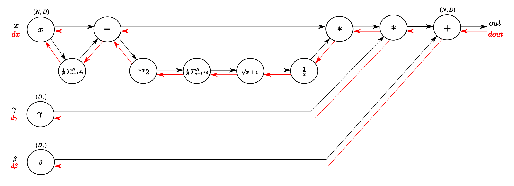

## 63. 请写出链式法则并证明

链式法则或链锁定则（英语：chain rule），是求复合函数导数的一个法则。

设 `f` 和 `g` 为两个关于 `x` 的可导函数，则复合函数 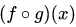 的导数 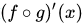 为 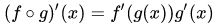

以下是一个简单的例子

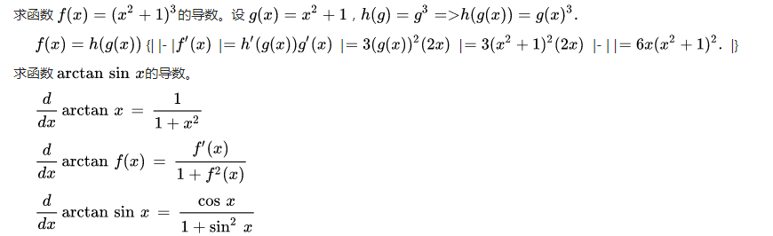

以下的简单的一个证明

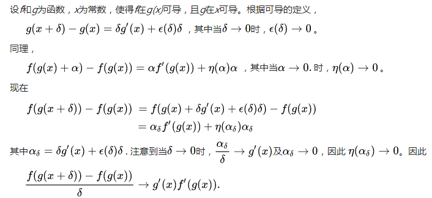

## 64. 请写出 Batch Normalization 的计算方法及其应用

机器学习流程简介

1. 一次性设置（One time setup）
   - 激活函数（Activation functions）
   - 数据预处理（Data Preprocessing）
   - 权重初始化（Weight Initialization）
   - 正则化（Regularization：避免过拟合的一种技术）
   - 梯度检查（Gradient checking）

2. 动态训练（Training dynamics）
   - 跟踪学习过程 （Babysitting the learning process）
   - 参数更新 （Parameter updates)
   - 超级参数优化（Hyperparameter optimization）
   - 批量归一化（Batch Normalization简称BN，其中，Normalization 是数据标准化或归一化、规范化，Batch 可以理解为批量，加起来就是批量标准化。解决在训练过程中中间层数据分布发生改变的问题，以防止梯度消失或爆炸、加快训练速度）

3. 评估（Evaluation）

   - 模型组合（Model ensembles）

     (训练多个独立的模型，测试时，取这些模型结果的平均值)

> 为什么输入数据需要归一化（Normalized Data），或者说，归一化后有什么好处呢？

原因在于神经网络学习过程本质就是为了学习数据分布，一旦训练数据与测试数据的分布不同，那么网络的泛化能力也大大降低，所以需要使用输入数据归一化方法，使训练数据与测试数据的分布相同。

另外一方面，加之神经网络训练时一旦网络某一层的输入数据的分布发生改变，那么这一层网络就需要去适应学习这个新的数据分布，所以如果训练过程中，训练数据的分布一直在发生变化，那么将会影响网络的训练速度。

为了让训练深度网络简单高效，研究者提出了随机梯度下降法（SGD），但是它有个毛病，就是需要我们人为的去选择参数，比如学习率、参数初始化、权重衰减系数、Dropout 比例等。这些参数的选择对训练结果至关重要，以至于我们很多时间都浪费在这些的调参上。

> 举个例子，比如某个神经元 `x = 1`, 某个  Weights 的初始值为 `0.1`, 这样后一层神经元计算结果就是 `Wx 0.1 *1 = 0.1`；如果 `x = 20`, 这样 `Wx = 0.1 * 20 = 2`。现在还不能看出什么问题, 但是, 当我们加上一层激励函数, 激活这个 `Wx` 值的时候, 问题就来了。

如果使用像 tanh 的激励函数, `Wx` 的激活值就变成了 `~0.1` 和 `~1`, 接近于 1 的部已经处在了 激励函数的饱和阶段, 也就是如果 x 无论再怎么扩大, tanh 激励函数输出值也还是接近1。

换句话说, 神经网络在初始阶段已经不对那些比较大的 x 特征范围敏感了. 这样很糟糕, 想象我轻轻拍自己的感觉和重重打自己的感觉居然没什么差别, 这就证明我的感官系统失效了. 当然我们是可以用之前提到的对数据做 normalization 预处理, 使得输入的 x 变化范围不会太大, 让输入值经过激励函数的敏感部分. 但刚刚这个不敏感问题不仅仅发生在神经网络的输入层, 而且在隐藏层中也经常会发生。

既然 x 换到了隐藏层当中, 我们能不能对隐藏层的输入结果进行像之前那样的 normalization 处理呢? 答案是可以的, 因为大牛们发明了一种技术, 叫做 batch normalization, 正是处理这种情况。

> Batch Normalization 由 Google 提出在这篇论文中《Batch Normalization Accelerating Deep Network Training by Reducing Internal Covariate Shift》提出。

**与激活函数层、卷积层、全连接层、池化层一样，BN(Batch Normalization)也属于网络的一层**。

BN 的本质原理：

- 在网络的每一层输入的时候，又插入了一个归一化层，也就是先做一个归一化处理（归一化至：均值0、方差为1），然后再进入网络的下一层。不过归一化层可不像我们想象的那么简单，它是一个可学习、有参数`（γ、β）`的网络层。

归一化公式：

以下是 Normalization 过程（引用 Google 论文中的解释）：

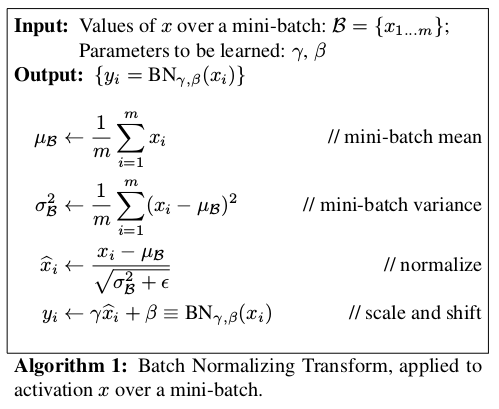

输入：输入数据 `x1..xm`（这些数据是准备进入激活函数的数据） 

计算过程中可以看到, 

1. 求数据均值； 
2. 求数据方差； 
3. 数据进行标准化（个人认为称作正态化也可以） 
4. 训练参数 `γ，β` 
5. 输出 `y` 通过 `γ` 与 `β` 的线性变换得到新的值 

**How to BN？**

怎样学 BN 的参数就是经典的 chain rule。

- 在正向传播的时候，通过可学习的 `γ` 与 `β` 参数求出新的分布值

- 在反向传播的时候，通过链式求导方式，修正 `γ` 与 `β` 以及相关权值 

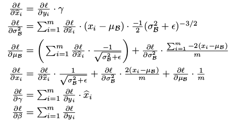

**Why is BN？**

- **因为 BN 保证每一层的输入分布稳定，这一点本身可以使得训练加速，而且另一方面它也可以帮助减少梯度消失和梯度爆炸的现象**。

**梯度消失**

关于梯度消失，以 sigmoid 函数为例子，sigmoid 函数使得输出在 `[0,1]` 之间。

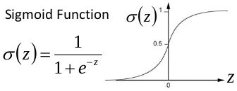

事实上 x 到了一定大小，经过 sigmoid 函数的输出范围就很小了，参考下图 

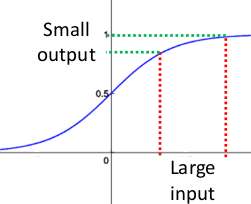

如果输入很大，其对应的斜率就很小，我们知道，其斜率（梯度）在反向传播中是权值学习速率。所以就会出现如下的问题，

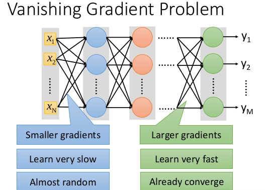

在深度网络中，如果网络的激活输出很大，其梯度就很小，学习速率就很慢。假设每层学习梯度都小于最大值 0.25，网络有 n 层，因为链式求导的原因，第一层的梯度小于 0.25 的 n 次方，所以学习速率就慢，对于最后一层只需对自身求导 1 次，梯度就大，学习速率就快。

这会造成的影响是在一个很大的深度网络中，浅层基本不学习，权值变化小，后面几层一直在学习，结果就是，后面几层基本可以表示整个网络，失去了深度的意义。

**梯度爆炸**

关于梯度爆炸，根据链式求导法，第一层偏移量的梯度 = 激活层斜率 1x 权值 1x 激活层斜率 2x… 激活层斜率 `(n-1)x` 权值 `(n-1)x` 激活层斜率 n。假如激活层斜率均为最大值 0.25，所有层的权值为 100，这样梯度就会指数增加。

参考链接

> 1 https://blog.csdn.net/myarrow/article/details/51848285
>
> 2 https://morvanzhou.github.io/tutorials/machine-learning/ML-intro/3-08-batch-normalization/

## 65. 神经网络中会用到批量梯度下降（BGD）吗？为什么用随机梯度下降（SGD）?

1. 一般不用 BGD

2. a. BGD 每次需要用到全量数据，计算量太大

   b. 引入随机因素，即便陷入局部极小，梯度也可能不为 0，这样就有机会跳出局部极小继续搜索（可以作为跳出局部极小的一种方式，但也可能跳出全局最小。还有解决局部极小的方式：多组参数初始化、使用模拟退火技术）

## 66. 当神经网络的调参效果不好时，从哪些角度思考？（不要首先归结于 overfiting）

1. 是否找到合适的损失函数？（不同问题适合不同的损失函数）（理解不同损失函数的适用场景）

2. batch size 是否合适？**batch size 太大 -> loss 很快平稳，batch size 太小 -> loss 会震荡**（理解mini-batch）

3. 是否选择了合适的激活函数？（各个激活函数的来源和差异）

4. 学习率，**学习率小收敛慢，学习率大 loss 震荡**（怎么选取合适的学习率）

5. 是否选择了合适的优化算法？（比如 adam）（理解不同优化算法的适用场景）

6. 是否过拟合？(深度学习拟合能力强，容易过拟合)（理解过拟合的各个解决方案）
   - Early Stopping
   - Regularization（正则化）         
   - Weight Decay（收缩权重）
   - Dropout（随机失活）
   - 调整网络结构

## 67. 请阐述下卷积神经网络CNN的基本原理

> [《CNN笔记：通俗理解卷积神经网络》](http://blog.csdn.net/v_july_v/article/details/51812459)
>
> [请详细说说CNN的工作原理](./07-请详细说说CNN的工作原理.md)

