## Index

<!-- TOC -->

* [1. 人工神经网络](#1-人工神经网络)

  - [1.1 神经元](#11-神经元)

  - [1.2 激活函数](#12-激活函数)

  - [1.3 神经网络](#13-神经网络)
* [2. 卷积神经网络之层级结构](#2-卷积神经网络之层级结构)
* [3. CNN之卷积计算层](#3-cnn之卷积计算层)

  - [3.1 CNN 怎么进行识别](#31-cnn-怎么进行识别)

  - [3.2 什么是卷积](#32-什么是卷积)

  - [3.3 图像上的卷积](#33-图像上的卷积)

  - [3.4 GIF动态卷积图](#34-gif动态卷积图)
* [4. CNN之激励层与池化层](#4-cnn之激励层与池化层)

  - [4.1 ReLU激励层](#41-relu激励层)

  - [4.2 池化 pool 层](#42-池化-pool-层)
* [5. 参考文献及推荐阅读](#5-参考文献及推荐阅读)

<!-- /TOC -->

## 1. 人工神经网络

### 1.1 神经元
神经网络由大量的神经元相互连接而成。每个神经元接受线性组合的输入后，最开始只是简单的线性加权，后来给每个神经元加上了非线性的激活函数，从而进行非线性变换后输出。每两个神经元之间的连接代表加权值，称之为权重（weight）。不同的权重和激活函数，则会导致神经网络不同的输出。

举个手写识别的例子，给定一个未知数字，让神经网络识别是什么数字。此时的神经网络的输入由一组被输入图像的像素所激活的输入神经元所定义。在通过非线性激活函数进行非线性变换后，神经元被激活然后被传递到其他神经元。重复这一过程，直到最后一个输出神经元被激活。从而识别当前数字是什么字。

神经网络的每个神经元如下

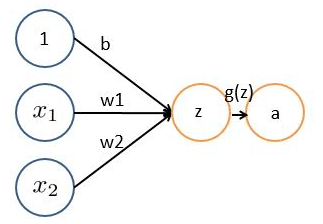


基本 `wx + b` 的形式，其中

- `x1、x2` 表示输入向量

- `w1、w2` 为权重，几个输入则意味着有几个权重，即每个输入都被赋予一个权重
- `b` 为偏置 bias
- `g(z)` 为激活函数
- `a` 为输出

如果只是上面这样一说，估计以前没接触过的十有八九又必定迷糊了。事实上，上述简单模型可以追溯到 20 世纪 50/60 年代的感知器，可以把感知器理解为一个根据不同因素、以及各个因素的重要性程度而做决策的模型。

> 举个例子，这周末北京有一草莓音乐节，那去不去呢？决定你是否去有二个因素，这二个因素可以对应二个输入，分别用 `x1、x2` 表示。此外，这二个因素对做决策的影响程度不一样，各自的影响程度用权重 `w1、w2` 表示。一般来说，音乐节的演唱嘉宾会非常影响你去不去，唱得好的前提下 即便没人陪同都可忍受，但如果唱得不好还不如你上台唱呢。所以，我们可以如下表示：
>
> `x1`：是否有喜欢的演唱嘉宾。`x1 = 1` 你喜欢这些嘉宾，`x1 = 0` 你不喜欢这些嘉宾。嘉宾因素的权重 `w1 = 7`
>
> `x2`：是否有人陪你同去。`x2 = 1` 有人陪你同去，`x2 = 0` 没人陪你同去。是否有人陪同的权重 `w2 = 3`。
>
> 这样，咱们的决策模型便建立起来了：`g(z) = g(w1*x1 + w2*x2 + b )`，`g` 表示激活函数，这里的 `b` 可以理解成 为更好达到目标而做调整的偏置项。

一开始为了简单，人们把激活函数定义成一个线性函数，即对于结果做一个线性变化，比如一个简单的线性激活函数是 `g(z) = z`，输出都是输入的线性变换。后来实际应用中发现，线性激活函数太过局限，于是人们引入了非线性激活函数。

### 1.2 激活函数

常用的非线性激活函数有 sigmoid、tanh、relu 等等，前两者 **sigmoid/tanh 比较常见于全连接层**，**后者 relu 常见于卷积层**。这里先简要介绍下最基础的 sigmoid 函数（btw，在本博客中SVM那篇文章开头有提过）。

sigmoid 的函数表达式如下


其中 `z` 是一个线性组合，比如 `z` 可以等于：`b + w1*x1 + w2*x2`。通过代入很大的正数或很小的负数到 `g(z)` 函数中可知，其结果趋近于 0 或 1。

因此，sigmoid 函数 `g(z)` 的图形表示如下（ 横轴表示定义域 `z`，纵轴表示值域 `g(z) `）：


也就是说，sigmoid 函数的功能是相当于把一个实数压缩至 0 到 1 之间。当 `z` 是非常大的正数时， `g(z)` 会趋近于 1，而 `z` 是非常小的负数时，则 `g(z)` 会趋近于 0。

压缩至 0 到 1 有何用处呢？用处是这样一来便可以把激活函数看作一种 “分类的概率”，比如激活函数的输出为 0.9 的话便可以解释为 90% 的概率为正样本。

举个例子，如下图（图引自Stanford机器学习公开课）


`z = b + w1*x1 + w2*x2`，其中 `b`  为偏置项 假定取 `-30`，`w1、w2`都取为 `20`

如果 `x1 = 0`，`x2 = 0`，则 `z = -30`，`g(z) = 1/( 1 + e^-z )`  趋近于 0。此外，从上图sigmoid 函数的图形上也可以看出，当 `z=-30` 的时候，`g(z)` 的值趋近于 0
如果 `x1 = 0，x2 = 1`，或 `x1 =1,x2 = 0`，则 `z = b + w1*x1 + w2*x2 = -30 + 20 = -10`，同样，`g(z)` 的值趋近于 0
如果 `x1 = 1，x2 = 1`，则 `z = b + w1*x1 + w2*x2 = -30 + 20*1 + 20*1 = 10`，此时，`g(z)` 趋近于 1。

换言之，只有 `x1` 和 `x2` 都取 1 的时候，`g(z)→1`，判定为正样本；而当只要 `x1` 或 `x2` 有一个取 0 的时候，`g(z)→0`，判定为负样本，如此达到分类的目的。

### 1.3 神经网络

将下图的这种单个神经元


组织在一起，便形成了神经网络。下图便是一个三层神经网络结构


上图中最左边的原始输入信息称之为输入层，最右边的神经元称之为输出层（上图中输出层只有一个神经元），中间的叫隐藏层。

啥叫输入层、输出层、隐藏层呢？

- 输入层（Input layer），众多神经元（Neuron）接受大量非线形输入讯息。输入的讯息称为输入向量。
- 输出层（Output layer），讯息在神经元链接中传输、分析、权衡，形成输出结果。输出的讯息称为输出向量。
- 隐藏层（Hidden layer），简称 “隐层”，是输入层和输出层之间众多神经元和链接组成的各个层面。如果有多个隐藏层，则意味着多个激活函数。

同时，每一层都可能由单个或多个神经元组成，每一层的输出将会作为下一层的输入数据。比如下图中间隐藏层来说，隐藏层的 3 个神经元 `a1、a2、a3` 皆各自接受来自多个不同权重的输入（因为有 `x1、x2、x3` 这三个输入，所以 `a1 a2 a3` 都会接受 `x1 x2 x3` 各自分别赋予的权重，即几个输入则几个权重），接着，`a1`、`a2`、`a3` 又在自身各自不同权重的影响下 成为的输出层的输入，最终由输出层输出最终结果。

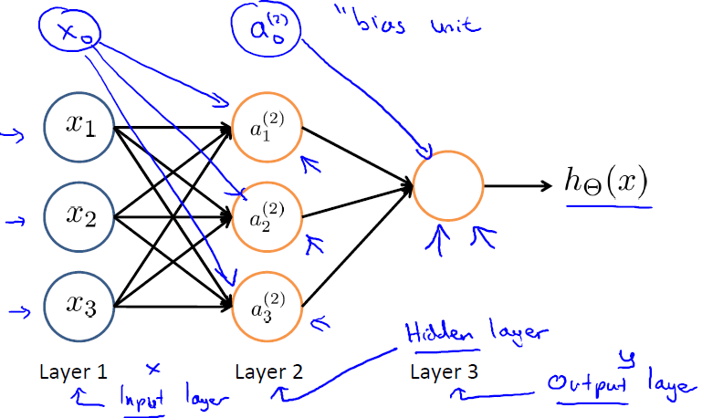


上图（图引自Stanford机器学习公开课）中

- <a href="https://www.codecogs.com/eqnedit.php?latex=a_i^j" target="_blank"></a> 表示第j层第 `i` 个单元的激活函数/神经元
- <a href="https://www.codecogs.com/eqnedit.php?latex=\Theta&space;^{(j)}" target="_blank"></a> 表示从第 `j` 层映射到第 `j+1` 层的控制函数的权重矩阵 

此外，输入层和隐藏层都存在一个偏置（bias unit)，所以上图中也增加了偏置项：`x0、a0`。针对上图，有如下公式

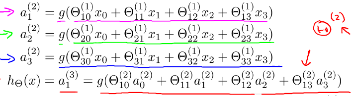

此外，上文中讲的都是一层隐藏层，但实际中也有多层隐藏层的，即输入层和输出层中间夹着数层隐藏层，层和层之间是全连接的结构，同一层的神经元之间没有连接。

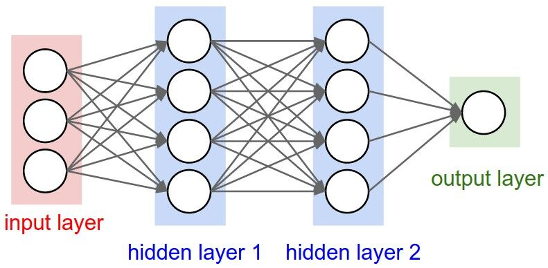

## 2. 卷积神经网络之层级结构

cs231n 课程里给出了卷积神经网络各个层级结构，如下图

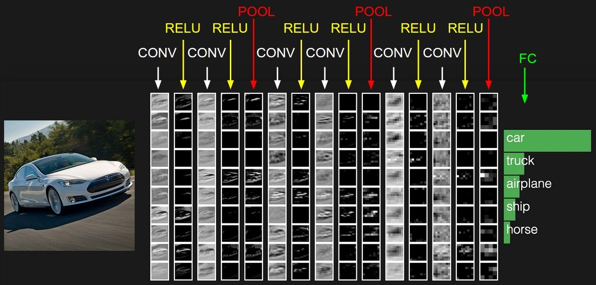

上图中CNN要做的事情是：给定一张图片，是车还是马未知，是什么车也未知，现在需要模型判断这张图片里具体是一个什么东西，总之输出一个结果：如果是车 那是什么车，所以，

最左边是数据输入层，对数据做一些处理，比如去均值（把输入数据各个维度都中心化为 0，避免数据过多偏差，影响训练效果）、归一化（把所有的数据都归一到同样的范围）、PCA/白化等等。CNN 只对训练集做 “去均值” 这一步。

中间是

- CONV：卷积计算层，线性乘积 求和。
- RELU：激励层，上文 1.2 节中有提到：ReLU 是激活函数的一种。
- POOL：池化层，简言之，即取区域平均或最大。

最右边是

- FC：全连接层

这几个部分中，卷积计算层是 CNN 的核心，下文将重点阐述。

## 3. CNN之卷积计算层
### 3.1 CNN 怎么进行识别

当我们给定一个 "X" 的图案，计算机怎么识别这个图案就是 “X” 呢？一个可能的办法就是计算机存储一张标准的 “X” 图案，然后把需要识别的未知图案跟标准 "X" 图案进行比对，如果二者一致，则判定未知图案即是一个 "X" 图案。

而且即便未知图案可能有一些平移或稍稍变形，依然能辨别出它是一个 X 图案。如此，CNN 是把未知图案和标准 X 图案一个局部一个局部的对比，如下图所示 [图来自参考文案25]

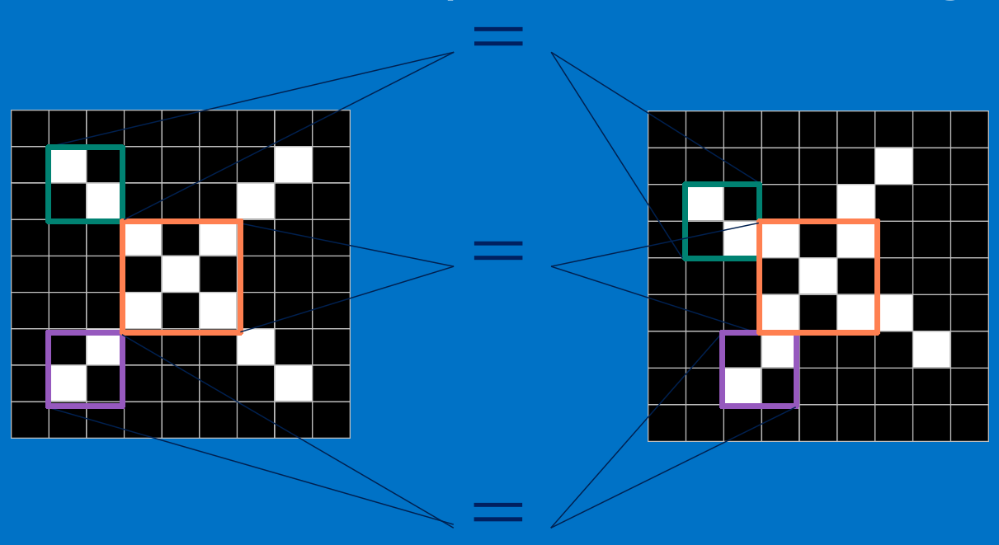

**而未知图案的局部和标准 X 图案的局部一个一个比对时的计算过程，便是卷积操作**。卷积计算结果为 1 表示匹配，否则不匹配。

接下来，我们来了解下什么是卷积操作。

### 3.2 什么是卷积

对图像（不同的数据窗口数据）和滤波矩阵（一组固定的权重：因为每个神经元的多个权重固定，所以又可以看做一个恒定的滤波器 filter）做内积（逐个元素相乘再求和）的操作就是所谓的『卷积』操作，也是卷积神经网络的名字来源。

非严格意义上来讲，下图中红框框起来的部分便可以理解为一个滤波器，即带着一组固定权重的神经元。多个滤波器叠加便成了卷积层。

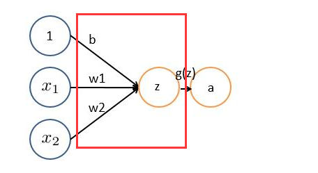

OK，举个具体的例子。比如下图中，图中左边部分是原始输入数据，图中中间部分是滤波器 filter，图中右边是输出的新的二维数据。


分解下上图

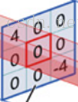对应位置上是数字先相乘后相加 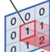= 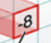

中间滤波器 filter 与数据窗口做内积，其具体计算过程则是：

`4*0 + 0*0 + 0*0 + 0*0 + 0*1 + 0*1 + 0*0 + 0*1 + -4*2 = -8`

### 3.3 图像上的卷积

在下图对应的计算过程中，输入是一定区域大小 (width*height) 的数据，和滤波器 filter（带着一组固定权重的神经元）做内积后等到新的二维数据。

具体来说，左边是图像输入，中间部分就是滤波器 filter（带着一组固定权重的神经元），不同的滤波器 filter 会得到不同的输出数据，比如颜色深浅、轮廓。相当于如果想提取图像的不同特征，则用不同的滤波器 filter，提取想要的关于图像的特定信息：颜色深浅或轮廓。

如下图所示

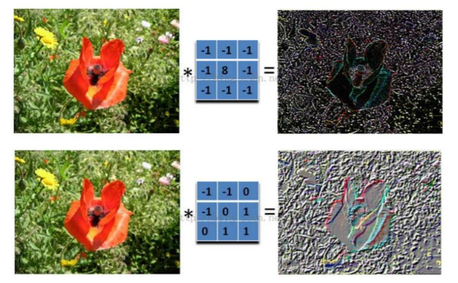

### 3.4 GIF动态卷积图

在 CNN 中，滤波器 filter（带着一组固定权重的神经元）对局部输入数据进行卷积计算。每计算完一个数据窗口内的局部数据后，数据窗口不断平移滑动，直到计算完所有数据。这个过程中，有这么几个参数： 

- 深度 depth：神经元个数，决定输出的 depth 厚度。同时代表滤波器个数。
- 步长 stride：决定滑动多少步可以到边缘。
- 填充值 zero-padding：在外围边缘补充若干圈 0，方便从初始位置以步长为单位可以刚好滑倒末尾位置，通俗地讲就是为了总长能被步长整除。 

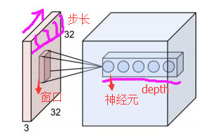

cs231n 课程中有一张卷积动图，貌似是用 d3js 和一个 util 画的，我根据 cs231n 的卷积动图依次截取了 18 张图，然后用一 gif 制图工具制作了一 gif 动态卷积图。如下 gif 图所示


可以看到：

- 两个神经元，即 `depth=2`，意味着有两个滤波器。

- 数据窗口每次移动两个步长取3*3的局部数据，即 `stride=2`。

- `zero-padding=1`。

然后分别以两个滤波器 filter 为轴滑动数组进行卷积计算，得到两组不同的结果。

如果初看上图，可能不一定能立马理解啥意思，但结合上文的内容后，理解这个动图已经不是很困难的事情：

- 左边是输入（7*7*3 中，`7*7` 代表图像的像素/长宽，`3` 代表 `R、G、B` 三个颜色通道）
- 中间部分是两个不同的滤波器 `Filter w0`、`Filter w1`
- 最右边则是两个不同的输出

随着左边数据窗口的平移滑动，滤波器 `Filter w0 / Filter w1` 对不同的局部数据进行卷积计算。

值得一提的是：

- 左边数据在变化，每次滤波器都是针对某一局部的数据窗口进行卷积，这就是所谓的 CNN 中的局部感知机制。

> 打个比方，滤波器就像一双眼睛，人类视角有限，一眼望去，只能看到这世界的局部。如果一眼就看到全世界，你会累死，而且一下子接受全世界所有信息，你大脑接收不过来。当然，即便是看局部，针对局部里的信息人类双眼也是有偏重、偏好的。比如看美女，对脸、胸、腿是重点关注，所以这 3 个输入的权重相对较大。
>
> 与此同时，数据窗口滑动，导致输入在变化，但中间滤波器 `Filter w0` 的权重（即每个神经元连接数据窗口的权重）是固定不变的，这个权重不变即所谓的 CNN 中的参数（权重）共享机制。
>
> 再打个比方，某人环游全世界，所看到的信息在变，但采集信息的双眼不变。btw，不同人的双眼 看同一个局部信息 所感受到的不同，即一千个读者有一千个哈姆雷特，所以不同的滤波器 就像不同的双眼，不同的人有着不同的反馈结果。

我第一次看到上面这个动态图的时候，只觉得很炫，另外就是据说计算过程是 “相乘后相加”，但到底具体是个怎么相乘后相加的计算过程 则无法一眼看出，网上也没有一目了然的计算过程。本文来细究下。

首先，我们来分解下上述动图，如下图

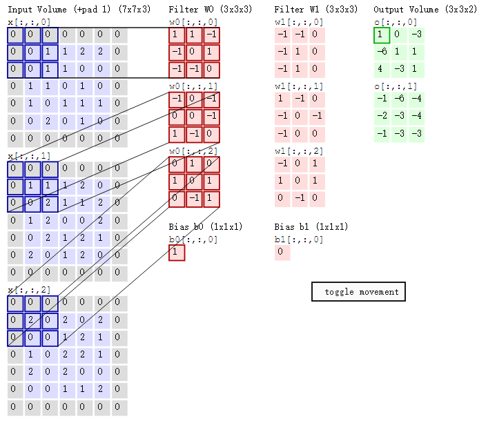

接着，我们细究下上图的具体计算过程。即上图中的输出结果 1 具体是怎么计算得到的呢？其实，类似 `wx + b`，`w` 对应滤波器 Filter w0，`x` 对应不同的数据窗口，`b` 对应 Bias b0，相当于滤波器 Filter w0与一个个数据窗口相乘再求和后，最后加上 Bias b0 得到输出结果 1，如下过程所示：

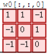 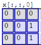

```latex
1* 0 + 1*0 + -1*0 
+
-1*0 + 0*0 + 1*1
+
-1*0 + -1*0 + 0*1
+
-1*0 + 0*0 + -1*0
+
```

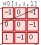 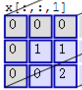

```latex
-1*0 + 0*0 + -1*0
+
0*0 + 0*1 + -1*1
+
1*0 + -1*0 + 0*2
+
```

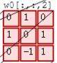 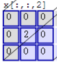

```latex
0*0 + 1*0 + 0*0
+
1*0 + 0*2 + 1*0
+
0*0 + -1*0 + 1*0
+
```

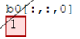

```latex
1
=
1
```

然后滤波器 Filter w0 固定不变，数据窗口向右移动 2 步，继续做内积计算，得到 0 的输出结果

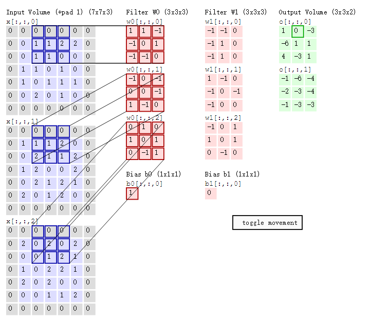

最后，换做另外一个不同的滤波器 Filter w1、不同的偏置 Bias b1，再跟图中最左边的数据窗口做卷积，可得到另外一个不同的输出。

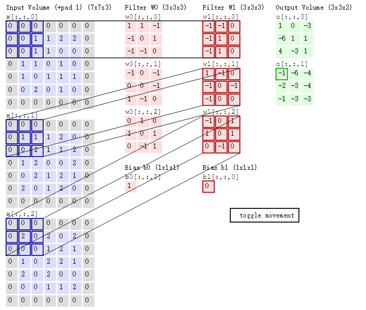

## 4. CNN之激励层与池化层
### 4.1 ReLU激励层

1.2 节介绍了激活函数 sigmoid，但实际梯度下降中，sigmoid 容易饱和、造成终止梯度传递，且没有 0 中心化。咋办呢，可以尝试另外一个激活函数：ReLU，其图形表示如下

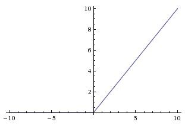

**ReLU 的优点是收敛快，求梯度简单**。

### 4.2 池化 pool 层

前头说了，池化，简言之，即取区域平均或最大，如下图所示（图引自cs231n）


上图所展示的是取区域最大，即上图左边部分中 左上角 `2x2` 的矩阵中 6 最大，右上角 `2x2` 的矩阵中 8 最大，左下角 `2x2` 的矩阵中 3 最大，右下角 `2x2` 的矩阵中 4 最大，所以得到上图右边部分的结果：`6 8 3 4`。很简单不是？

## 5. 参考文献及推荐阅读

1 人工神经网络wikipedia
2 斯坦福机器学习公开课
3 http://neuralnetworksanddeeplearning.com/
4 雨石 卷积神经网络：http://blog.csdn.net/stdcoutzyx/article/details/41596663
5 cs231n 神经网络结构与神经元激励函数：http://cs231n.github.io/neural-networks-1/，中译版

6 cs231n 卷积神经网络：http://cs231n.github.io/convolutional-networks/
7 七月在线寒老师讲的5月dl班第4次课CNN与常用框架视频，已经剪切部分放在七月在线官网：julyedu.com
8 七月在线5月深度学习班第5课CNN训练注意事项部分视频：https://www.julyedu.com/video/play/42/207
9 七月在线5月深度学习班：https://www.julyedu.com/course/getDetail/37
10 七月在线5月深度学习班课程笔记——No.4《CNN与常用框架》：http://blog.csdn.net/joycewyj/article/details/51792477

11 七月在线6月数据数据挖掘班第7课视频：数据分类与排序
12 手把手入门神经网络系列(1)_从初等数学的角度初探神经网络：http://blog.csdn.net/han_xiaoyang/article/details/50100367
13 深度学习与计算机视觉系列(6)_神经网络结构与神经元激励函数：http://blog.csdn.net/han_xiaoyang/article/details/50447834
14 深度学习与计算机视觉系列(10)_细说卷积神经网络：http://blog.csdn.net/han_xiaoyang/article/details/50542880

15 zxy 图像卷积与滤波的一些知识点：http://blog.csdn.net/zouxy09/article/details/49080029
16 zxy 深度学习CNN笔记：http://blog.csdn.net/zouxy09/article/details/8781543/
17 http://www.wildml.com/2015/11/understanding-convolutional-neural-networks-for-nlp/，中译版
18 《神经网络与深度学习》中文讲义：http://vdisk.weibo.com/s/A_pmE4iIPs9D
19 ReLU与sigmoid/tanh的区别：https://www.zhihu.com/question/29021768
20 CNN、RNN、DNN内部网络结构区别：https://www.zhihu.com/question/34681168

21 理解卷积：https://www.zhihu.com/question/22298352
22 神经网络与深度学习简史：1 感知机和BP算法、4 深度学习的伟大复兴
23 在线制作gif 动图：http://www.tuyitu.com/photoshop/gif.htm
24 支持向量机通俗导论（理解SVM的三层境界）
25 CNN究竟是怎样一步一步工作的？ 本博客把卷积操作具体怎么个计算过程写清楚了，但这篇把为何要卷积操作也写清楚了，而且配偶图非常形象，甚赞。


