## Index

<!-- TOC -->

* [1. 目标检测常见算法](#1-目标检测常见算法)
* [2. 传统的目标检测算法](#2-传统的目标检测算法)

  - [2.1 从图像识别的任务说起](#21-从图像识别的任务说起)

  - [2.2 物体检测（Object Detection）](#22-物体检测object-detection)
* [3. 候选区域/窗   深度学习分类](#3-候选区域窗--深度学习分类)

  - [3.1 R-CNN 横空出世](#31-r-cnn-横空出世)

  - [3.2 SPP Net](#32-spp-net)

  - [3.3 Fast R-CNN](#33-fast-r-cnn)

  - [3.4 Faster R-CNN](#34-faster-r-cnn)
* [4. 基于深度学习的回归方法](#4-基于深度学习的回归方法)

  - [4.1 YOLO (CVPR2016, oral)](#41-yolo-cvpr2016-oral)

  - [4.2 SSD](#42-ssd)
* [Reference](#reference)

<!-- /TOC -->

> 一文读懂目标检测：R-CNN、Fast R-CNN、Faster R-CNN、YOLO、SSD

## 1. 目标检测常见算法

**object detection，就是在给定的图片中精确找到物体所在位置，并标注出物体的类别**。所以，object detection 要解决的问题就是物体在哪里以及是什么的整个流程问题。

然而，这个问题可不是那么容易解决的，物体的尺寸变化范围很大，摆放物体的角度，姿态不定，而且可以出现在图片的任何地方，更何况物体还可以是多个类别。

目前学术和工业界出现的目标检测算法分成 3 类：
1. **传统的目标检测算法**：Cascade + HOG/DPM + Haar/SVM 以及上述方法的诸多改进、优化；

2. **候选区域/窗 + 深度学习分类**：通过提取候选区域，并对相应区域进行以深度学习方法为主的分类的方案，如：

  R-CNN（Selective Search + CNN + SVM）

  SPP-net（ROI Pooling）

  Fast R-CNN（Selective Search + CNN + ROI）

  Faster R-CNN（RPN + CNN + ROI）

  R-FCN

  等系列方法；

3. **基于深度学习的回归方法**：YOLO/SSD/DenseBox 等方法；以及最近出现的结合 RNN 算法的 RRC detection；结合 DPM 的 Deformable CNN 等

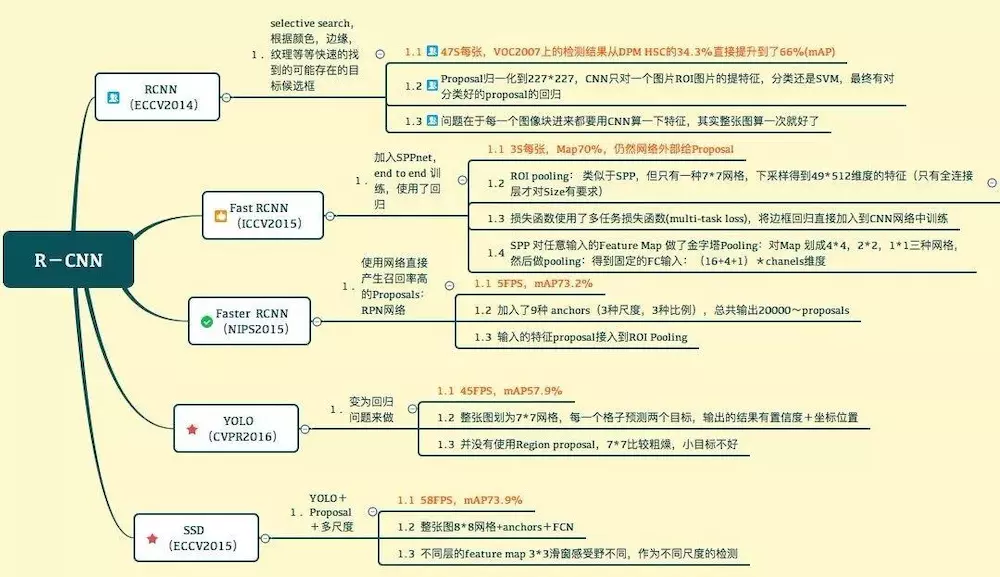

传统目标检测流程：

- 区域选择（穷举策略：采用滑动窗口，且设置不同的大小，不同的长宽比对图像进行遍历，时间复杂度高）
- 特征提取（SIFT、HOG 等；形态多样性、光照变化多样性、背景多样性使得特征鲁棒性差）
- 分类器分类（主要有 SVM、Adaboost 等）

## 2. 传统的目标检测算法

### 2.1 从图像识别的任务说起

这里有一个图像任务：既要把图中的物体识别出来，又要用方框框出它的位置。

这个任务本质上就是这两个问题：

- 图像识别
- 定位

图像识别（classification）：

- 输入：图片

- 输出：物体的类别

- 评估方法：准确率

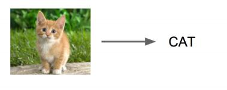

定位（localization）：

- 输入：图片

- 输出：方框在图片中的位置（`x,y,w,h`）

- 评估方法：检测评价函数 intersection-over-union（关于什么是 IOU，请参看七月在线APP题库大题查看深度学习分类下第55题：https://www.julyedu.com/question/big/kp_id/26/ques_id/2138） 

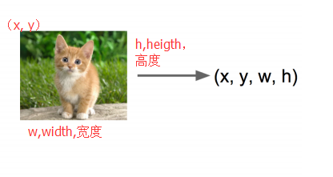

卷积神经网络 CNN 已经帮我们完成了图像识别（判定是猫还是狗）的任务了，我们只需要添加一些额外的功能来完成定位任务即可。

定位的问题的解决思路有哪些？

- 思路一：看做回归问题

  看做回归问题，我们需要预测出（`x,y,w,h`）四个参数的值，从而得出方框的位置。

  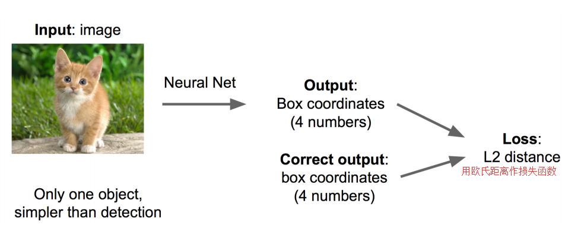

  步骤 1:

  - 先解决简单问题， 搭一个识别图像的神经网络
  - 在 AlexNet VGG GoogleLenet 上 fine-tuning 一下（[什么是微调fine-tuning](https://www.julyedu.com/question/big/kp_id/26/ques_id/2137)）

  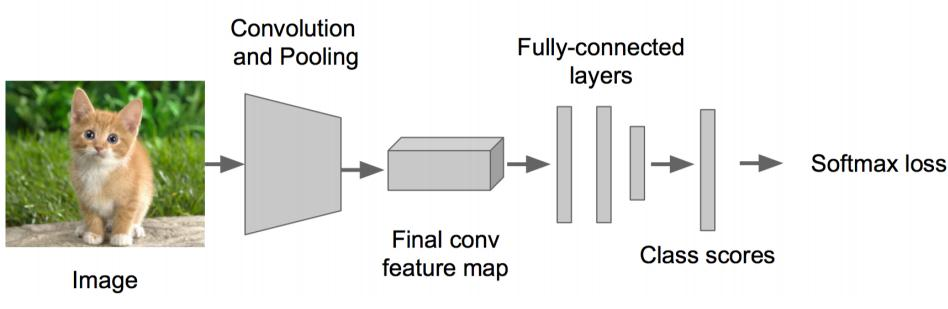

  步骤 2:

  - 在上述神经网络的尾部展开（也就说 CNN 前面保持不变，我们对 CNN 的结尾处作出改进：加了两个头：“分类头” 和 “回归头”）

  - 成为 classification + regression 模式

  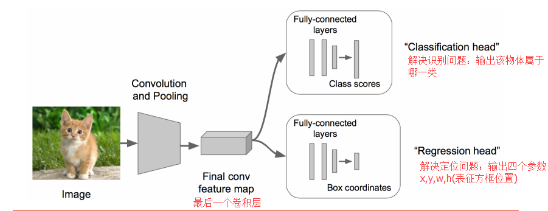

  步骤 3:

  - Regression 那个部分用欧氏距离损失
  - 使用 SGD 训练

  步骤 4:

  - 预测阶段把 2 个头部拼上
  - 完成不同的功能

  这里需要进行两次 fine-tuning

  第一次在 ALexNet 上做，第二次将头部改成 regression head，前面不变，做一次 fine-tuning

  Regression 的部分加在哪？

  有两种处理方法：

  - 加在最后一个卷积层后面（如 VGG）
  - 加在最后一个全连接层后面（如 R-CNN）

  regression 太难做了，应想方设法转换为 classification 问题。

  regression 的训练参数收敛的时间要长得多，所以上面的网络采取了用 classification 的网络来计算出网络共同部分的连接权值。

- 思路二：取图像窗口

  - 还是刚才的 classification + regression 思路
  - 咱们取不同的大小的 “框”
  - 让框出现在不同的位置，得出这个框的判定得分
  - 取得分最高的那个框

  左上角的黑框：得分0.5

  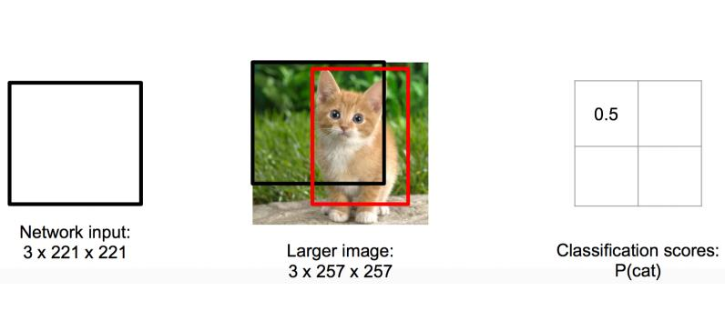

  右上角的黑框：得分0.75

  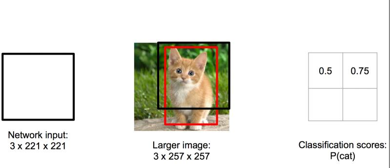

  左下角的黑框：得分0.6

  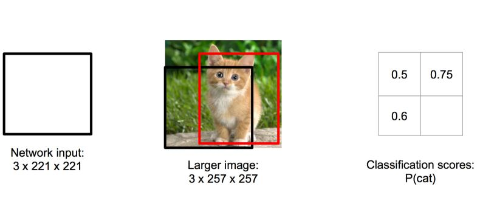

  右下角的黑框：得分0.8

  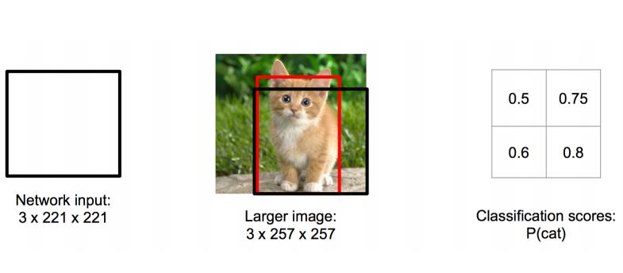

  根据得分的高低，我们选择了右下角的黑框作为目标位置的预测。

  注：有的时候也会选择得分最高的两个框，然后取两框的交集作为最终的位置预测。

  疑惑：框要取多大？

  取不同的框，依次从左上角扫到右下角。非常粗暴啊。

总结一下思路：

对一张图片，用各种大小的框（遍历整张图片）将图片截取出来，输入到 CNN，然后 CNN 会输出这个框的得分（classification）以及这个框图片对应的 `x,y,h,w`（regression）。

这方法实在太耗时间了，做个优化。

原来网络是这样的：

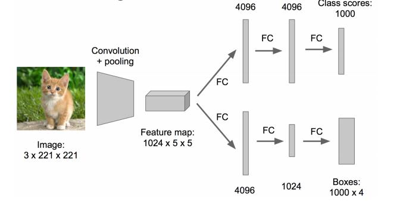

优化成这样：把全连接层改为卷积层，这样可以提提速。

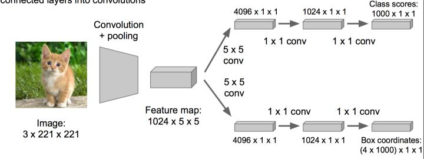

### 2.2 物体检测（Object Detection）
当图像有很多物体怎么办的？难度可是一下暴增啊。

**那任务就变成了：多物体识别 + 定位多个物体**

那把这个任务看做分类问题？

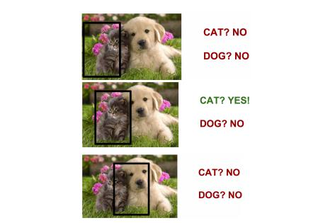

看成分类问题有何不妥？

- 你需要找很多位置， 给很多个不同大小的框
- 你还需要对框内的图像分类
- 当然， 如果你的GPU很强大， 恩， 那加油做吧…

所以，传统目标检测的主要问题是：

- 1）基于滑动窗口的区域选择策略没有针对性，时间复杂度高，窗口冗余
- 2）手工设计的特征对于多样性的变化没有很好的鲁棒性

看做 classification， 有没有办法优化下？我可不想试那么多框那么多位置啊！

## 3. 候选区域/窗 + 深度学习分类

### 3.1 R-CNN 横空出世

有人想到一个好方法：预先找出图中目标可能出现的位置，即候选区域（Region Proposal）。利用图像中的纹理、边缘、颜色等信息，可以保证在选取较少窗口(几千甚至几百）的情况下保持较高的召回率（Recall）。

所以，问题就转变成找出可能含有物体的区域/框（也就是候选区域/框，比如选 2000 个候选框），这些框之间是可以互相重叠互相包含的，这样我们就可以避免暴力枚举的所有框了。

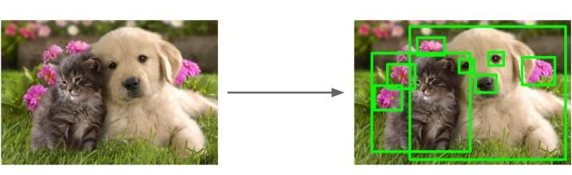

大牛们发明好多选定候选框 Region Proposal 的方法，比如 Selective Search 和 EdgeBoxes。那提取候选框用到的算法 “选择性搜索” 到底怎么选出这些候选框的呢？具体可以看一下 PAMI2015 的 “What makes for effective detection proposals？”

以下是各种选定候选框的方法的性能对比。

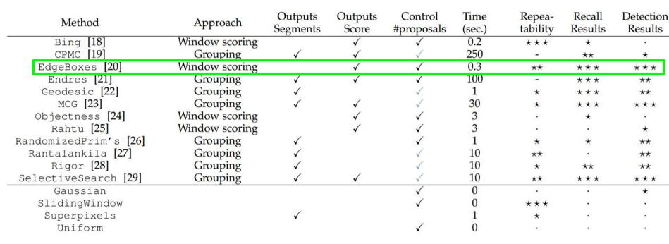

有了候选区域，剩下的工作实际就是对候选区域进行图像分类的工作（特征提取+分类）。对于图像分类，不得不提的是 2012 年 ImageNet 大规模视觉识别挑战赛（ILSVRC）上，机器学习泰斗 Geoffrey Hinton 教授带领学生 Krizhevsky 使用卷积神经网络将 ILSVRC 分类任务的 Top-5 error 降低到了 15.3%，而使用传统方法的第二名 top-5 error 高达 26.2%。此后，卷积神经网络 CNN 占据了图像分类任务的绝对统治地位。

2014年，RBG（Ross B. Girshick）使用 Region Proposal + CNN 代替传统目标检测使用的滑动窗口 + 手工设计特征，设计了 R-CNN 框架，使得目标检测取得巨大突破，并开启了基于深度学习目标检测的热潮。

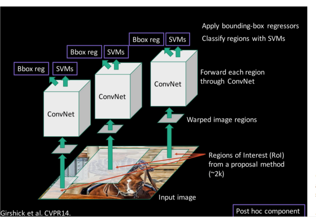

**R-CNN 的简要步骤如下**

- 输入测试图像

- 利用选择性搜索Selective Search算法在图像中从下到上提取2000个左右的可能包含物体的候选区域Region Proposal

- 因为取出的区域大小各自不同，所以需要将每个Region Proposal缩放（warp）成统一的227x227的大小并输入到CNN，将CNN的fc7层的输出作为特征

- 将每个Region Proposal提取到的CNN特征输入到SVM进行分类

具体步骤则如下

步骤一：训练（或者下载）一个分类模型（比如 AlexNet）

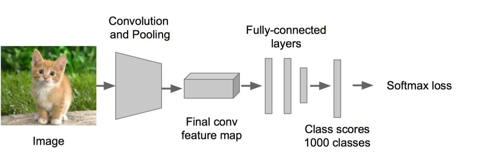

步骤二：对该模型做 fine-tuning

- 将分类数从 1000 改为 20，比如 20 个物体类别 + 1 个背景
- 去掉最后一个全连接层

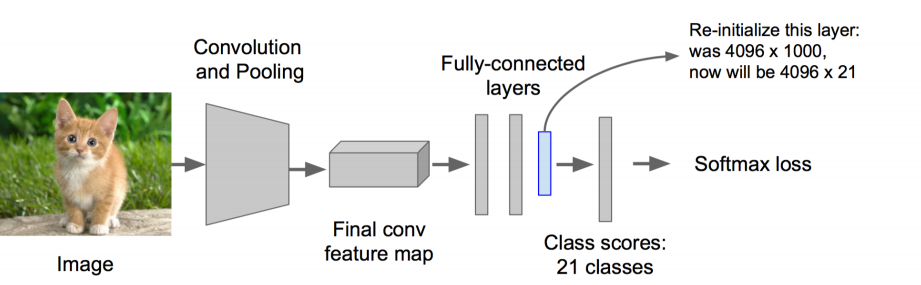

步骤三：特征提取

- 提取图像的所有候选框（选择性搜索 Selective Search）
- 对于每一个区域：修正区域大小以适合 CNN 的输入，做一次前向运算，将第五个池化层的输出（就是对候选框提取到的特征）存到硬盘

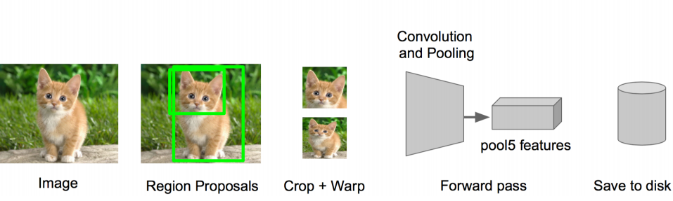

步骤四：训练一个 SVM 分类器（二分类）来判断这个候选框里物体的类别

每个类别对应一个 SVM，判断是不是属于这个类别，是就是 positive，反之 nagative。

比如下图，就是狗分类的 SVM

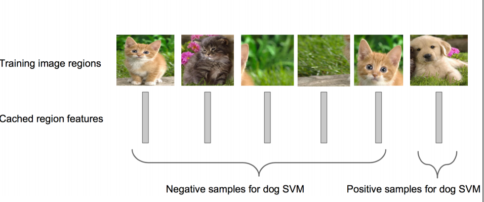

步骤五：使用回归器精细修正候选框位置：对于每一个类，训练一个线性回归模型去判定这个框是否框得完美。

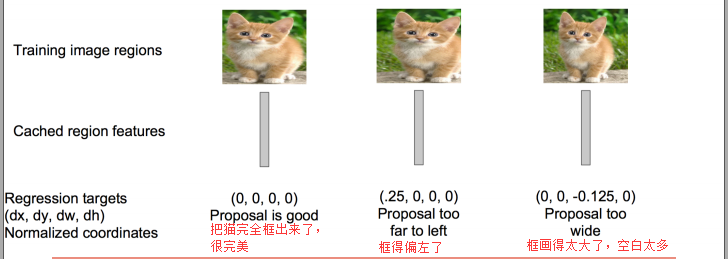

细心的同学可能看出来了问题，R-CNN 虽然不再像传统方法那样穷举，但 R-CNN 流程的第一步中对原始图片通过 Selective Search 提取的候选框 region proposal 多达 2000 个左右，而这 2000 个候选框每个框都需要进行 CNN 提特征 + SVM 分类，计算量很大，导致 R-CNN 检测速度很慢，一张图都需要 47s。

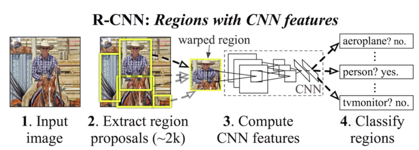

有没有方法提速呢？答案是有的，这 2000 个 region proposal 不都是图像的一部分吗，那么我们完全可以对图像提一次卷积层特征，然后只需要将 region proposal 在原图的位置映射到卷积层特征图上，这样对于一张图像我们只需要提一次卷积层特征，然后将每个 region proposal 的卷积层特征输入到全连接层做后续操作。

但现在的问题是每个 region proposal 的尺度不一样，而全连接层输入必须是固定的长度，所以直接这样输入全连接层肯定是不行的。SPP Net 恰好可以解决这个问题。

### 3.2 SPP Net

SPP：Spatial Pyramid Pooling（空间金字塔池化）

> SPP-Net 是出自2015年发表在 IEEE 上的论文-《Spatial Pyramid Pooling in Deep ConvolutionalNetworks for Visual Recognition》。

众所周知，CNN 一般都含有卷积部分和全连接部分，其中，卷积层不需要固定尺寸的图像，而全连接层是需要固定大小的输入。

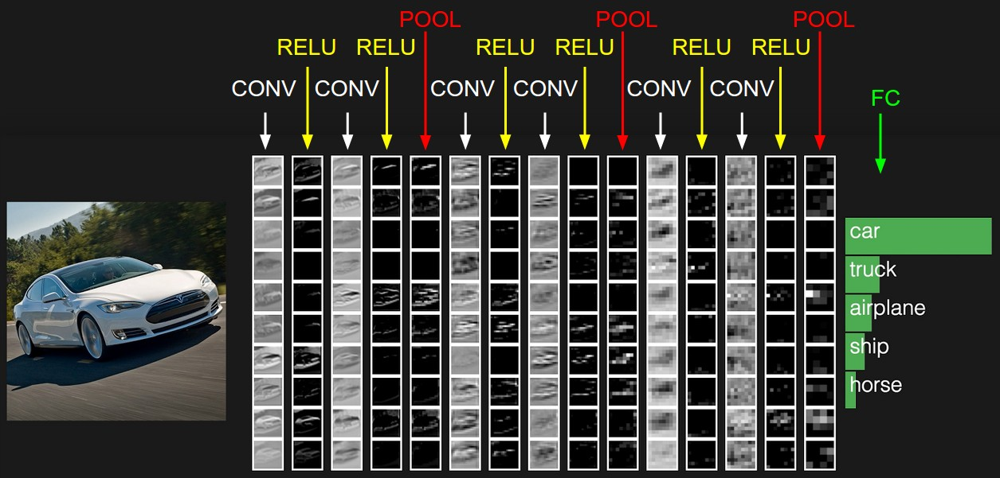

所以当全连接层面对各种尺寸的输入数据时，就需要对输入数据进行 crop（crop就是从一个大图扣出网络输入大小的 patch，比如 `227×227`），或 warp（把一个边界框 bounding box 的内容 resize 成 `227×227`）等一系列操作以统一图片的尺寸大小，比如 `224*224`（ImageNet）、`32*32` (LenNet)、`96*96` 等。

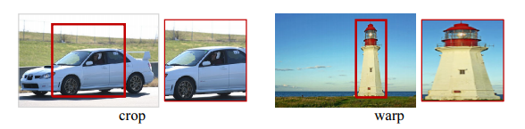

所以才如你在上文中看到的，在 R-CNN 中，“因为取出的区域大小各自不同，所以需要将每个 Region Proposal 缩放（warp）成统一的 `227x227` 的大小并输入到 CNN”。

但 warp/crop 这种预处理，导致的问题要么被拉伸变形、要么物体不全，限制了识别精确度。没太明白？说句人话就是，一张 `16:9` 比例的图片你硬是要 Resize 成 `1:1` 的图片，你说图片失真不？

> SPP Net 的作者 Kaiming He 等人逆向思考，既然由于全连接 FC 层的存在，普通的 CNN 需要通过固定输入图片的大小来使得全连接层的输入固定。那借鉴卷积层可以适应任何尺寸，为何不能在卷积层的最后加入某种结构，使得后面全连接层得到的输入变成固定的呢？

这个 “化腐朽为神奇” 的结构就是 spatial pyramid pooling layer。下图便是 R-CNN 和 SPP Net 检测流程的比较：

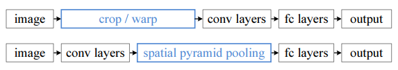

它的特点有两个:

1. 结合空间金字塔方法实现 CNNs 的多尺度输入。

   SPP Net 的第一个贡献就是在最后一个卷积层后，接入了金字塔池化层，保证传到下一层全连接层的输入固定。

   换句话说，在普通的 CNN 机构中，输入图像的尺寸往往是固定的（比如 `224*224` 像素），输出则是一个固定维数的向量。SPP Net 在普通的 CNN 结构中加入了 ROI 池化层（ROI Pooling），使得网络的输入图像可以是任意尺寸的，输出则不变，同样是一个固定维数的向量。

   简言之，**CNN 原本只能固定输入、固定输出，CNN 加上 SSP 之后，便能任意输入、固定输出**。神奇吧？

   **ROI 池化层一般跟在卷积层后面，此时网络的输入可以是任意尺度的，在 SPP layer 中每一个 pooling 的 filter 会根据输入调整大小，而 SPP 的输出则是固定维数的向量，然后给到全连接 FC 层**。

   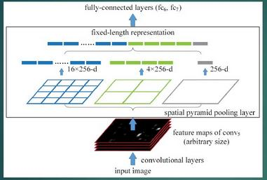

2. 只对原图提取一次卷积特征

   在 R-CNN 中，每个候选框先 resize 到统一大小，然后分别作为 CNN 的输入，这样是很低效的。

   而 SPP Net 根据这个缺点做了优化：只对原图进行一次卷积计算，便得到整张图的卷积特征 feature map，然后找到每个候选框在 feature map 上的映射 patch，将此 patch 作为每个候选框的卷积特征输入到 SPP layer 和之后的层，完成特征提取工作。

   如此这般，R-CNN 要对每个区域计算卷积，而 SPPNet 只需要计算一次卷积，从而节省了大量的计算时间，比 R-CNN 有一百倍左右的提速。

   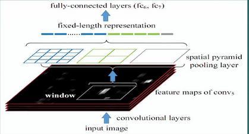

### 3.3 Fast R-CNN

SPP Net 真是个好方法，R-CNN 的进阶版 Fast R-CNN 就是在 R-CNN 的基础上采纳了 SPP Net 方法，对 R-CNN 作了改进，使得性能进一步提高。

R-CNN 与 Fast R-CNN 的区别有哪些呢？

先说 R-CNN 的缺点：

- 即使使用了 Selective Search 等预处理步骤来提取潜在的 bounding box 作为输入，但是 R-CNN 仍会有严重的速度瓶颈，原因也很明显，就是计算机对所有 region 进行特征提取时会有重复计算，Fast-RCNN 正是为了解决这个问题诞生的。

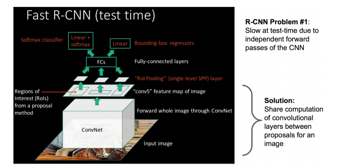

与 R-CNN 框架图对比，可以发现主要有两处不同：

- 一是最后一个卷积层后加了一个ROI pooling layer，

- 二是损失函数使用了多任务损失函数(multi-task loss)，将边框回归 Bounding Box Regression 直接加入到 CNN 网络中训练（[什么是边框回归](https://www.julyedu.com/question/big/kp_id/26/ques_id/2139)）。

1) ROI pooling layer 实际上是 SPP-NET 的一个精简版，SPP-NET 对每个 proposal 使用了不同大小的金字塔映射，而 ROI pooling layer 只需要下采样到一个 `7x7` 的特征图。对于 VGG16 网络 conv5_3 有 512 个特征图，这样所有 region proposal 对应了一个 `7*7*512` 维度的特征向量作为全连接层的输入。

换言之，这个网络层可以把不同大小的输入映射到一个固定尺度的特征向量，而我们知道，conv、pooling、relu 等操作都不需要固定 size 的输入，因此，在原始图片上执行这些操作后，虽然输入图片 size 不同导致得到的 feature map 尺寸也不同，不能直接接到一个全连接层进行分类，但是可以加入这个神奇的 ROI Pooling 层，对每个 region 都提取一个固定维度的特征表示，再通过正常的 softmax 进行类型识别。

2) R-CNN 训练过程分为了三个阶段，而 Fast R-CNN 直接使用 softmax 替代 SVM 分类，同时利用多任务损失函数边框回归也加入到了网络中，这样整个的训练过程是端到端的(除去 Region Proposal 提取阶段)。

也就是说，之前 R-CNN 的处理流程是先提 proposal，然后 CNN 提取特征，之后用 SVM 分类器，最后再做 bbox regression，而在 Fast R-CNN 中，作者巧妙的把 bbox regression 放进了神经网络内部，与 region 分类和并成为了一个 multi-task 模型，实际实验也证明，这两个任务能够共享卷积特征，并相互促进。

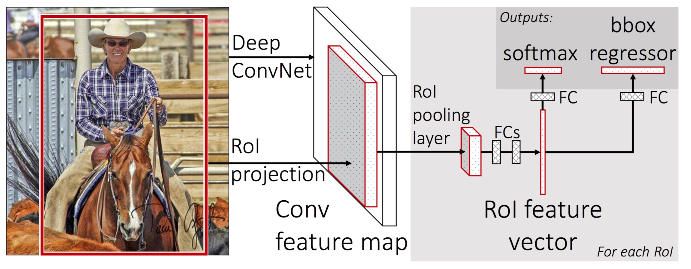

所以，Fast-RCNN 很重要的一个贡献是成功的让人们看到了 Region Proposal + CNN 这一框架实时检测的希望，原来多类检测真的可以在保证准确率的同时提升处理速度，也为后来的 Faster R-CNN 做下了铺垫。

画一画重点：

- R-CNN 有一些相当大的缺点（把这些缺点都改掉了，就成了 Fast R-CNN）。
- 大缺点：由于每一个候选框都要独自经过 CNN，这使得花费的时间非常多。
- 解决：共享卷积层，现在不是每一个候选框都当做输入进入CNN了，而是输入一张完整的图片，在第五个卷积层再得到每个候选框的特征

原来的方法：

- 许多候选框（比如两千个）--> CNN--> 得到每个候选框的特征--> 分类 + 回归

现在的方法：

- 一张完整图片--> CNN -->得到每张候选框的特征--> 分类 + 回归

所以容易看见，Fast R-CNN 相对于 R-CNN 的提速原因就在于：不过不像 R-CNN 把每个候选区域给深度网络提特征，而是整张图提一次特征，再把候选框映射到 conv5 上，而 SPP 只需要计算一次特征，剩下的只需要在 conv5 层上操作就可以了。

在性能上提升也是相当明显的：

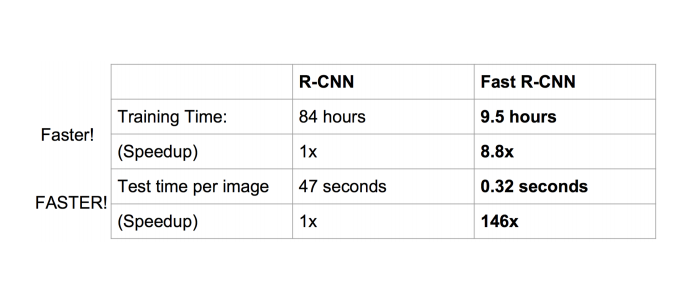

### 3.4 Faster R-CNN

Fast R-CNN 存在的问题：存在瓶颈：选择性搜索，找出所有的候选框，这个也非常耗时。那我们能不能找出一个更加高效的方法来求出这些候选框呢？

解决：加入一个提取边缘的神经网络，也就说找到候选框的工作也交给神经网络来做了。

所以，rgbd 在 Fast R-CNN 中引入 Region Proposal Network(RPN) 替代 Selective Search，同时引入 anchor box 应对目标形状的变化问题（anchor 就是位置和大小固定的 box，可以理解成事先设置好的固定的 proposal）。

具体做法：

- 将RPN放在最后一个卷积层的后面
- RPN直接训练得到候选区域

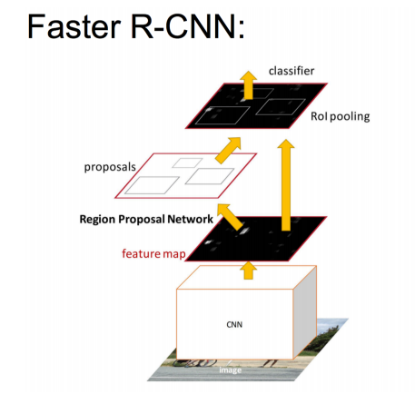

RPN简介：

- 在feature map上滑动窗口
- 建一个神经网络用于物体分类+框位置的回归
- 滑动窗口的位置提供了物体的大体位置信息
- 框的回归提供了框更精确的位置

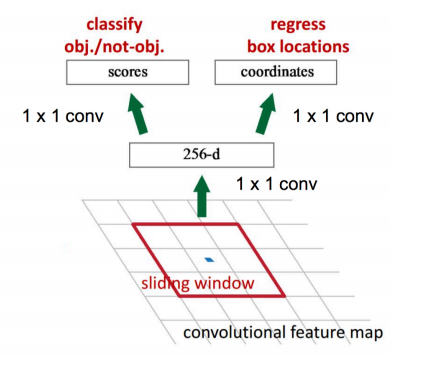

一种网络，四个损失函数：

- RPN calssification(anchor good.bad)
- RPN regression(anchor->propoasal)
- Fast R-CNN classification(over classes)
- Fast R-CNN regression(proposal ->box)

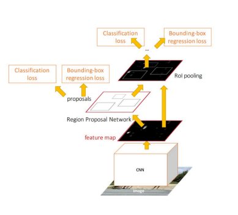

速度对比

Faster R-CNN 的主要贡献就是设计了提取候选区域的网络 RPN，代替了费时的选择性搜索 selective search，使得检测速度大幅提高。

最后总结一下各大算法的步骤：

**RCNN**

1. 在图像中确定约 1000-2000 个候选框 (使用选择性搜索 Selective Search)
2. 每个候选框内图像块缩放至相同大小，并输入到 CNN 内进行特征提取 
3. 对候选框中提取出的特征，使用分类器判别是否属于一个特定类 
4. 对于属于某一类别的候选框，用回归器进一步调整其位置

**Fast R-CNN**

1. 在图像中确定约 1000-2000 个候选框 (使用选择性搜索 Selective Search)

2. 对整张图片输进 CNN，得到 feature map

3. 找到每个候选框在 feature map 上的映射 patch，将此 patch 作为每个候选框的卷积特征输入到 SPP layer 和之后的层

4. 对候选框中提取出的特征，使用分类器判别是否属于一个特定类 

5. 对于属于某一类别的候选框，用回归器进一步调整其位置

**Faster R-CNN**

1. 对整张图片输进 CNN，得到 feature map

2. 卷积特征输入到 RPN，得到候选框的特征信息

3. 对候选框中提取出的特征，使用分类器判别是否属于一个特定类 

4. 对于属于某一类别的候选框，用回归器进一步调整其位置

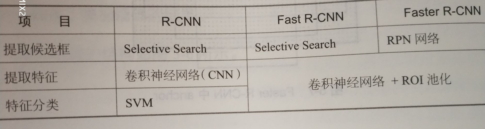

简言之，即如本文开头所列

- R-CNN（Selective Search + CNN + SVM）
- SPP-net（ROI Pooling）
- Fast R-CNN（Selective Search + CNN + ROI）
- Faster R-CNN（RPN + CNN + ROI）

总的来说，从 R-CNN, SPP-NET, Fast R-CNN, Faster R-CNN 一路走来，基于深度学习目标检测的流程变得越来越精简，精度越来越高，速度也越来越快。可以说基于 Region Proposal 的 R-CNN 系列目标检测方法是当前目标检测技术领域最主要的一个分支。

## 4. 基于深度学习的回归方法

### 4.1 YOLO (CVPR2016, oral)

> (You Only Look Once: Unified, Real-Time Object Detection)

Faster R-CNN 的方法目前是主流的目标检测方法，但是速度上并不能满足实时的要求。YOLO 一类的方法慢慢显现出其重要性，这类方法使用了回归的思想，利用整张图作为网络的输入，直接在图像的多个位置上回归出这个位置的目标边框，以及目标所属的类别。

我们直接看上面 YOLO 的目标检测的流程图：

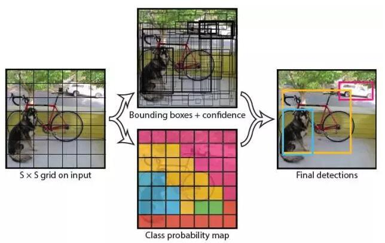

(1) 给个一个输入图像，首先将图像划分成 `7*7` 的网格

(2) 对于每个网格，我们都预测 2 个边框（包括每个边框是目标的置信度以及每个边框区域在多个类别上的概率）

(3) 根据上一步可以预测出 `7*7*2` 个目标窗口，然后根据阈值去除可能性比较低的目标窗口，最后 NMS 去除冗余窗口即可（[什么是非极大值抑制NMS](https://www.julyedu.com/question/big/kp_id/26/ques_id/2141)）。

可以看到整个过程非常简单，不再需要中间的 Region Proposal 找目标，直接回归便完成了位置和类别的判定。

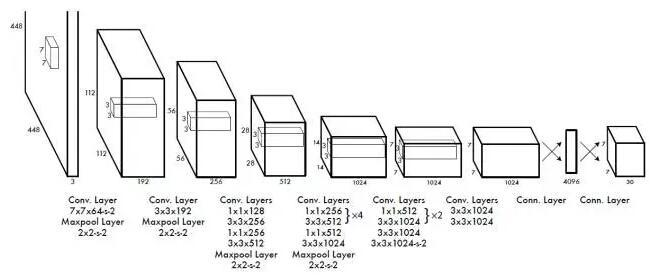

小结：

- YOLO 将目标检测任务转换成一个回归问题，大大加快了检测的速度，使得 YOLO 可以每秒处理 45 张图像。而且由于每个网络预测目标窗口时使用的是全图信息，使得 false positive 比例大幅降低（充分的上下文信息）。

- 但是 YOLO 也存在问题：没有了 Region Proposal 机制，只使用 `7*7` 的网格回归会使得目标不能非常精准的定位，这也导致了 YOLO 的检测精度并不是很高。

### 4.2 SSD 

> (SSD: Single Shot MultiBox Detector)

上面分析了 YOLO 存在的问题，使用整图特征在 `7*7` 的粗糙网格内回归对目标的定位并不是很精准。那是不是可以结合 Region Proposal 的思想实现精准一些的定位？ SSD 结合 YOLO 的回归思想以及 Faster R-CNN 的 anchor 机制做到了这点。

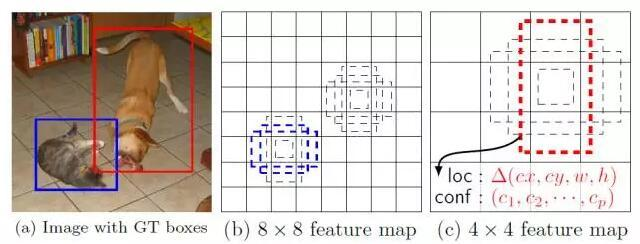

上图是 SSD 的一个框架图，**首先 SSD 获取目标位置和类别的方法跟 YOLO 一样，都是使用回归，但 是YOLO 预测某个位置使用的是全图的特征，SSD 预测某个位置使用的是这个位置周围的特征（感觉更合理一些）**。

那么如何建立某个位置和其特征的对应关系呢？可能你已经想到了，使用 Faster R-CNN 的 anchor 机制。如 SSD 的框架图所示，假如某一层特征图(图 b)大小是 `8*8`，那么就使用 `3*3` 的滑窗提取每个位置的特征，然后这个特征回归得到目标的坐标信息和类别信息(图 c)。

不同于 Faster R-CNN，这个 anchor 是在多个 feature map 上，这样可以利用多层的特征并且自然的达到多尺度（不同层的 feature map `3*3` 滑窗感受野不同）。

小结：

- SSD 结合了 YOLO 中的回归思想和 Faster R-CNN 中的 anchor 机制，使用全图各个位置的多尺度区域特征进行回归，既保持了 YOLO 速度快的特性，也保证了窗口预测的跟 Faster R-CNN 一样比较精准。SSD 在 VOC2007 上 mAP 可以达到 72.1%，速度在 GPU 上达到 58 帧每秒。

## Reference

1 https://www.cnblogs.com/skyfsm/p/6806246.html，by @Madcola

2 https://mp.weixin.qq.com/s_biz=MzI1NTE4NTUwOQ==&mid=502841131&idx=1&sn=bb3e8e6aeee2ee1f4d3f22459062b814#rd

3 https://zhuanlan.zhihu.com/p/27546796

4 https://blog.csdn.net/v1_vivian/article/details/73275259

5 https://blog.csdn.net/tinyzhao/article/details/53717136

6 Spatial Pyramid Pooling in Deep Convolutional Networks for Visual Recognition，by Kaiming He等人

7 https://zhuanlan.zhihu.com/p/24774302

8 知乎专栏作者何之源新书《21个项目玩转深度学习——基于TensorFlow的实践详解》

9 YOLO：https://blog.csdn.net/tangwei2014/article/details/50915317，https://zhuanlan.zhihu.com/p/24916786

