# 推荐系统的架构

## Index

<!-- TOC -->

* [1. HULU的推荐系统](#1-hulu的推荐系统)
* [2. 淘宝的推荐系统(详细跟简单版)](#2-淘宝的推荐系统详细跟简单版)
* [3. Netflix的推荐系统](#3-netflix的推荐系统)
* [3. 优酷的推荐系统](#3-优酷的推荐系统)
* [4. 58同城的推荐系统](#4-58同城的推荐系统)
* [Reference](#reference)

<!-- /TOC --> 

本文从互联网收集并整理了推荐系统的架构，其中包括一些大公司的推荐系统框架（数据流存储、计算、模型应用），可以参考这些资料，取长补短，最后根据自己的业务需求，技术选型来设计相应的框架。后续持续更新并收集。。。

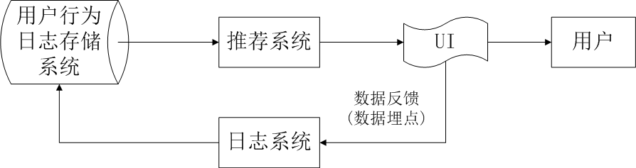

*图 1*

界面 UI 那一块包含 3 块东西：

1. 通过一定方式展示推荐物品(物品标题、缩略图、简介等)；
2. 给的推荐理由；
3. 数据反馈改进个性化推荐；

关于用户数据的存放地方：

- 数据库/缓存用来实时取数据；
- hdfs 文件上面；

抽象出来的三种推荐方式：

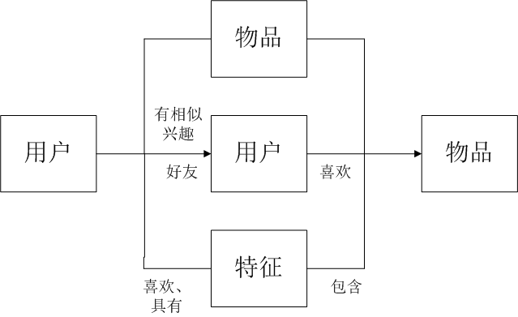

*图 2*

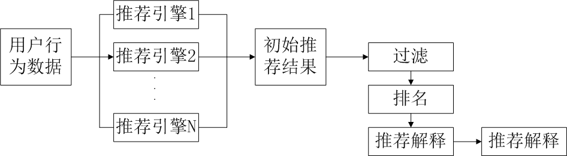

*图 3*

图 3 中，推荐引擎的构建来源于不同的数据源(也就是用户的特征有很多种类，例如统计的、行为的、主题的) + 不同的推荐模型算法，推荐引擎的架构可以试多样化的(实时推荐的 + 离线推荐的)，然后融合推荐结果（人工规则 + 模型结果），融合方式多样的，有线性加权的或者切换式的等

*图 4*

图 4 中，A 模块负责用户各类型特征的收集，B 模块的相关表是根据图 3 中的推荐引擎来生成的，B 模块的输出推荐结果用来 C 模块的输入，中间经过过滤模块(用户已经产生行为的物品，非候选物品，业务方提供的物品黑名单等)，排名模块也根据预设定的推荐目标来制定，最后推荐解释的生成（这是可能是最容易忽视，但很关键的一环，微信的好友推荐游戏，这一解释已经胜过后台的算法作用了）

## 1. HULU的推荐系统

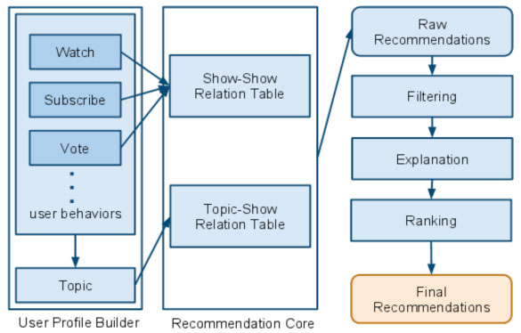

总结：这个也就跟图 3 有点类似了，葫芦的推荐系统，至少在他 blog 中写的比较简单。更多的是对推荐系统在线部分的一种描述，离线部分我猜想也是通过分布式计算或者不同的计算方式将算法产生的数据存储进入一种介质中，供推荐系统在线部分调用。系统的整个流程是这样的，首先获取用户的行为，包括(watch、subscribe、vote)，这样行为会到后台获取 show-show 对应的推荐数据。同时这些行为也会产生对应的 topic，系统也会根据 topic 到后台获取 topic-show 对应的推荐数据。两种数据进行混合，然后经过fliter、explanation、ranking 这一系列过程，最后生成用户看到的推荐数据。 

## 2. 淘宝的推荐系统(详细跟简单版)

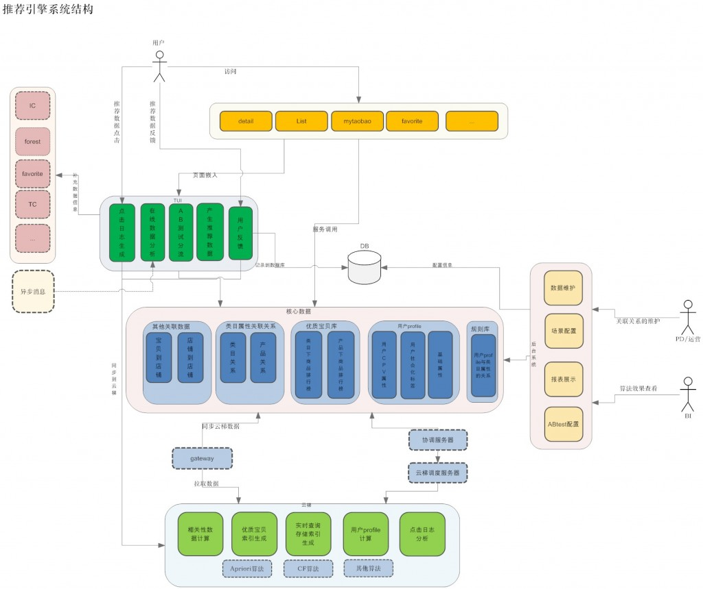

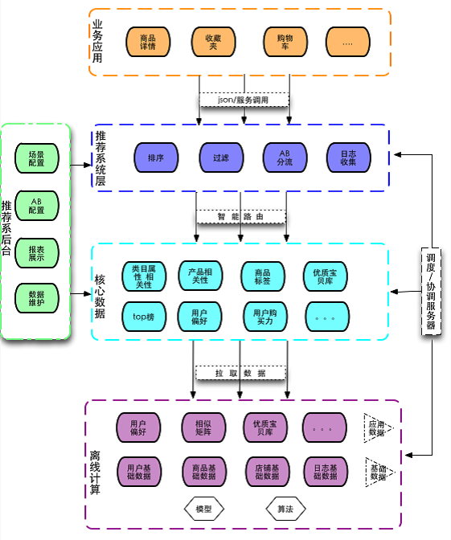

总结：淘宝的推荐系统，描述了推荐引擎搭建的整体架构，包括离线的分布式计算和存储、监控、数据统计和分析、实验平台等。给我们搭建推荐引擎提供了很好的建议。

整体流程大致这样。通过后台的分布式计算，将算法产生的算法结果数据存储进入一种介质中，首推 hbase。然后，通过一种叫做云梯的机制将算法结果推入中间层介质中，供推荐系统在线部分调用。在线部分提供引擎和实验分流，用户的行为将存储进入 hadoop 中，数据统计分析平台由 hive 来搭建，主要用来分析和统计 hadoop 中的用户行为 log。这张图不仅讲了，推荐系统的架构流程，也讲了跟这个平台有关系的人，是怎么介入的，我觉得提供的信息可很好的参考。

## 3. Netflix的推荐系统

总结：netflix 的推荐系统，描述了推荐引擎搭建的整体架构，采用了三种计算方式的结合。整体流程：用户通过 UI 产生事件跟行为，然后分发给离线（我理解的是按天存储）、近线存储（不提供历史，存储当天用户实时行为。不知道理解是否有误），离线的计算利用离线的数据建好模型供实时调用，近线的计算利用用户的实时行为计算得出规则供实时调用，最后在线的计算通过前两种方式来得到最终的推荐结果，关键问题，就是如何以无缝方式结合、管理在线和离线计算过程，当然找到这些要求之间恰当的平衡并不容易，需要深思熟虑的需求分析，细心的技术选择，战略性的推荐算法分解，最终才能为客户达成最佳的结果。

## 3. 优酷的推荐系统

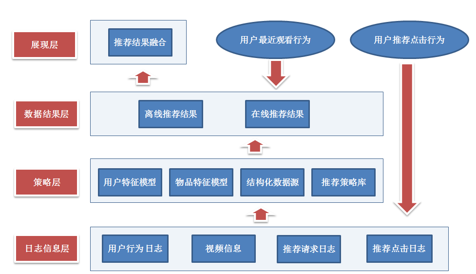

备注：上图来至 easyhadoop 举办的技术沙龙中优酷数据挖掘工程师的演讲，有关详细信息请移步 http://virtual.51cto.com/exp/Hadoop_20130330/index.html#top。作者在演讲中讲的一些"干货"跟推荐议题是很有价值的，下图简单描述。

**模型前数据准备(理解数据源，用户，物品)**

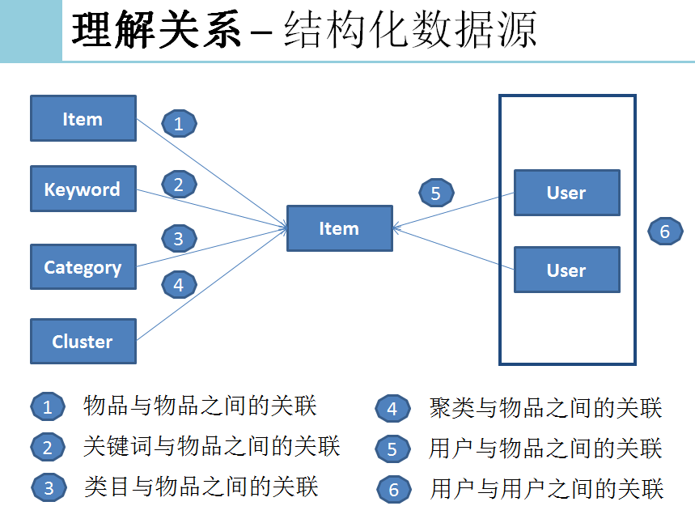

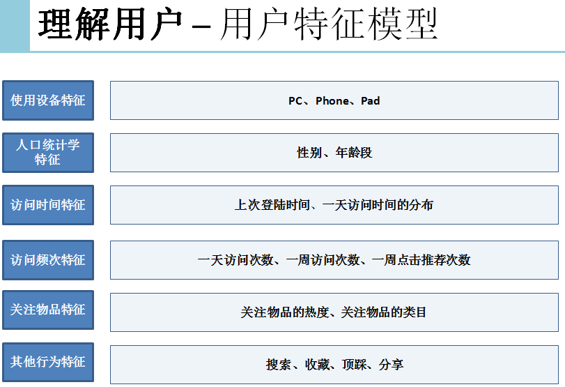

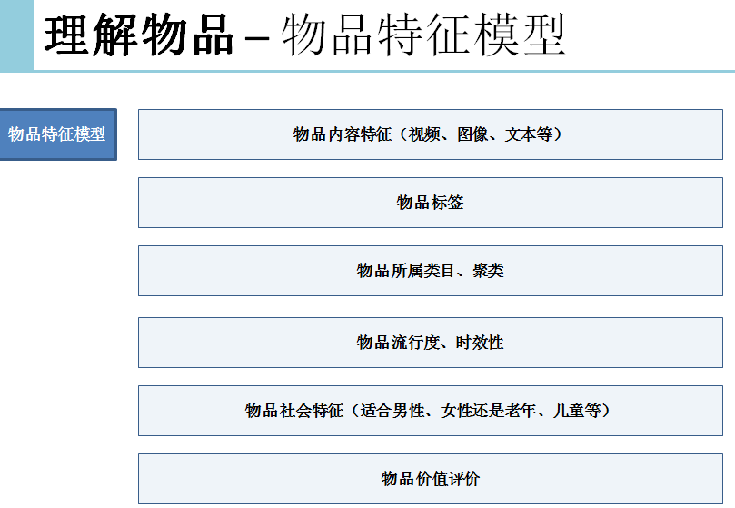

**模型策略**

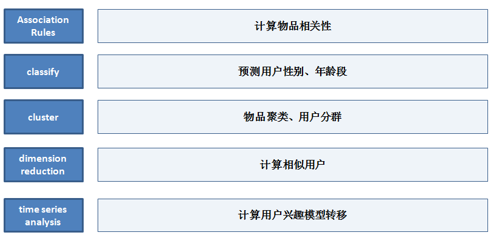

**其他考虑的场景!**

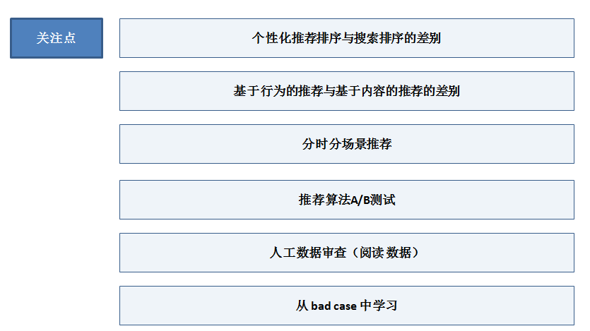

## 4. 58同城的推荐系统

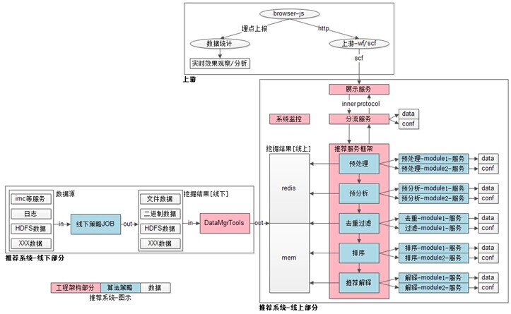

## Reference

> [推荐系统的架构](https://www.cnblogs.com/kobedeshow/p/3569525.html)
>
> [58同城推荐系统架构设计与实现-top100summit](http://www.habadog.com/2014/11/03/58-tuijian-arc-top100summit/)
>
> [从Netflix的推荐系统架构中我们可以学习到什么？](http://www.10tiao.com/html/773/201805/2247487797/1.html)
>
> [从原理到策略算法再到架构产品看推荐系统 | 附Spark实践案例](https://mp.weixin.qq.com/s/zeQYrYkFrJfnFqWa34vm4g)
>
> [实时推荐系统的3种方式](https://www.jianshu.com/p/356656ce2901)