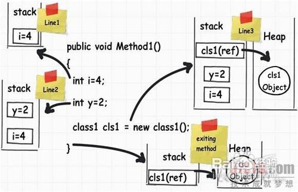
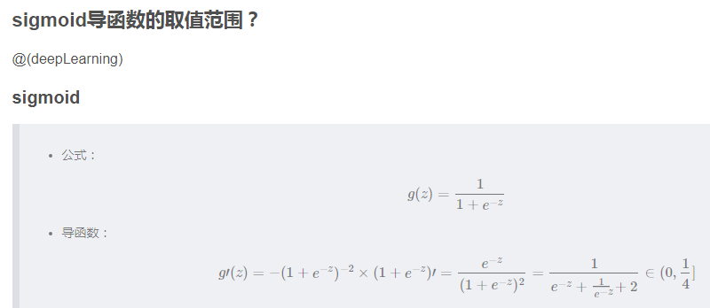
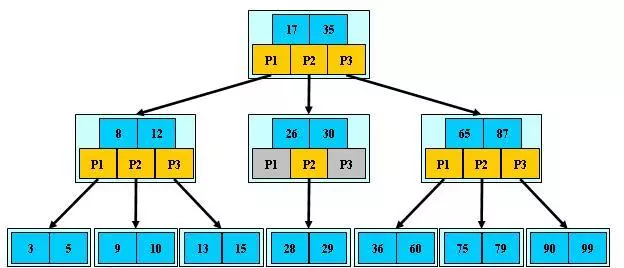
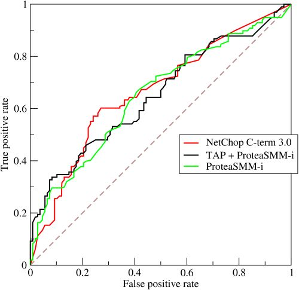

# Index

<!-- TOC -->

* [贝壳找房深度学习](#贝壳找房深度学习)

  - [1. 卷积层和全连接层的区别](#1-卷积层和全连接层的区别)

  - [2. FCN与CNN的区别](#2-fcn与cnn的区别)

  - [3. L0 L1 L2](#3-l0-l1-l2)
    - [3.1 L1 和 L2 范数的异同***](#31-l1-和-l2-范数的异同)

  - [4. 防止过拟合方法](#4-防止过拟合方法)

  - [5. 数据增强方法](#5-数据增强方法)

  - [6. python中tuple和list的区别](#6-python中tuple和list的区别)

  - [7. 复杂度了解吗，二分查找复杂度](#7-复杂度了解吗二分查找复杂度)

  - [8. 快排最好情况的复杂度](#8-快排最好情况的复杂度)

  - [9. 手撕代码：二分查找](#9-手撕代码二分查找)

  - [10. 了解堆和栈](#10-了解堆和栈)

  - [11. 用栈结构实现O(1)时间复杂度找到栈内的最小元素，如果有很多重复元素时怎么改进](#11-用栈结构实现o1时间复杂度找到栈内的最小元素如果有很多重复元素时怎么改进)

  - [12. PCA原理](#12-pca原理)

  - [13. 特征值和特征向量的含义](#13-特征值和特征向量的含义)

  - [14. SGD 中 S(stochastic)代表什么](#14-sgd-中-sstochastic代表什么)

  - [15. 数据预处理的方法](#15-数据预处理的方法)
    - [15.1 数据挖掘中使用的数据的原则](#151-数据挖掘中使用的数据的原则)
    - [15.2 常见的数据预处理方法](#152-常见的数据预处理方法)

  - [16. 稀疏矩阵](#16-稀疏矩阵)
    - [16.1 稀疏的问题](#161-稀疏的问题)
    - [16.2 机器学习中的稀疏矩阵](#162-机器学习中的稀疏矩阵)
    - [16.3 处理稀疏矩阵](#163-处理稀疏矩阵)
    - [16.4 推荐系统](#164-推荐系统)
    - [16.5 [推荐系统]欧氏距离和余弦相似度](#165-推荐系统欧氏距离和余弦相似度)

  - [17. 特征提取的方法和过程](#17-特征提取的方法和过程)

  - [18. Python numpy，scipy，pandas这些库的区别是什么？](#18-python-numpyscipypandas这些库的区别是什么)

  - [19. 机器学习算法选择](#19-机器学习算法选择)

  - [20. 监督学习／迁移学习／半监督学习／弱监督学习／非监督学习？](#20-监督学习迁移学习半监督学习弱监督学习非监督学习)
    - [20.1 机器学习算法的类型](#201-机器学习算法的类型)
    - [20.2 迁移学习](#202-迁移学习)

  - [21. Softmax Loss推一下](#21-softmax-loss推一下)

  - [22. CNN的特点以及优势](#22-cnn的特点以及优势)

  - [23. 推导 Backpropagation(BP反向传播算法)](#23-推导-backpropagationbp反向传播算法)

  - [24. Dropout 与 Bagging 集成方法的关系，Dropout 带来的意义与其强大的原因***](#24-dropout-与-bagging-集成方法的关系dropout-带来的意义与其强大的原因)

  - [25. 深度学习中有什么加快收敛/降低训练难度的方法](#25-深度学习中有什么加快收敛降低训练难度的方法)

  - [26. 什么造成过拟合，如何防止过拟合](#26-什么造成过拟合如何防止过拟合)
    - [26.1 过拟合的一些解决方案***](#261-过拟合的一些解决方案)
    - [26.2 训练误差、泛化误差；过拟合、欠拟合；模型容量，表示容量，有效容量，最优容量的概念； 奥卡姆剃刀原则*](#262-训练误差泛化误差过拟合欠拟合模型容量表示容量有效容量最优容量的概念-奥卡姆剃刀原则)

* [便利蜂](#便利蜂)

  - [1. 特征工程做的有哪些？非线性可分的情况怎么处理的？](#1-特征工程做的有哪些非线性可分的情况怎么处理的)

  - [2. SVM的核函数了解多少？](#2-svm的核函数了解多少)

  - [3. L1与L2区别？L1为啥具有稀疏性？](#3-l1与l2区别l1为啥具有稀疏性)

  - [4. xgboost的原理](#4-xgboost的原理)

  - [5. sigmoid函数的导函数的取值范围是多少？其实就是一元二次方程的y值范围，0-1/4](#5-sigmoid函数的导函数的取值范围是多少其实就是一元二次方程的y值范围0-14)

  - [6. Python中协成的概念，即微线程，具体可以看廖雪峰的网站](#6-python中协成的概念即微线程具体可以看廖雪峰的网站)
    ​    * [基本概念](#基本概念)
    ​    * [协程原理](#协程原理)
    ​    * [原理解读](#原理解读)
    ​    * [协程的方式。](#协程的方式)
    ​    * [缺点：](#缺点)
    ​    * [应用场景:](#应用场景)

  - [7. C  中vector增删改的时间复杂度，O(1)，O(n)，O(n)](#7-c中vector增删改的时间复杂度o1onon)

  - [8. MySQL中索引用的什么数据结构？B-Tree或B Tree](#8-mysql中索引用的什么数据结构b-tree或btree)

  - [9. Hash_table的底层是什么实现的？拉链法，数组 链表](#9-hash_table的底层是什么实现的拉链法数组链表)

  - [10. HBase的列式存储解释](#10-hbase的列式存储解释)

  - [11. GBDT 和 XGBOOST 的区别](#11-gbdt-和-xgboost-的区别)

  - [12. LTR、LR、FTRL、SVM、GBDT、Reinforcement Learning、Deep Learning](#12-ltrlrftrlsvmgbdtreinforcement-learningdeep-learning)
    - [12.1 LTR（Learning to Rank）](#121-ltrlearning-to-rank)
    - [12.2 LR（Logistic Regression）](#122-lrlogistic-regression)
    - [12.3 FTRL（Follow-the-regularized-Leader）](#123-ftrlfollow-the-regularized-leader)
    - [12.4 SVM（support vector machine）](#124-svmsupport-vector-machine)
    - [12.5 GBDT（Gradient Boosting Decision Tree）](#125-gbdtgradient-boosting-decision-tree)
    - [12.6 Reinforcement Learning（）](#126-reinforcement-learning)

* [链家](#链家)

  - [1. 最小二乘与极大似然函数的关系？从概率统计的角度处理线性回归并在似然概率为高斯函数的假设下同最小二乘简历了联系](#1-最小二乘与极大似然函数的关系从概率统计的角度处理线性回归并在似然概率为高斯函数的假设下同最小二乘简历了联系)

  - [2. LR为啥是个线性模型？](#2-lr为啥是个线性模型)

  - [3. 分类的评价标准，准确度，AUC，召回率等等](#3-分类的评价标准准确度auc召回率等等)

  - [4. 有的逻辑回归损失函数中为啥要加 -1*m](#4-有的逻辑回归损失函数中为啥要加--1m)

  - [5. 欠拟合的解决方法？](#5-欠拟合的解决方法)

  - [6. L2正则的本质？](#6-l2正则的本质)

  - [7. SVM引入核函数本质？](#7-svm引入核函数本质)

  - [8. Boosting和Bagging区别和联系](#8-boosting和bagging区别和联系)

  - [9. xgboost如何寻找最优特征？是有放回还是无放回的呢？](#9-xgboost如何寻找最优特征是有放回还是无放回的呢)

  - [10. RF和GBDT的区别?二者的优化目标是什么?](#10-rf和gbdt的区别二者的优化目标是什么)

* [滴滴](#滴滴)

  - [1. 介绍xgboost、gbdt、rf的区别](#1-介绍xgboostgbdtrf的区别)

  - [3. Sklearn中树模型输出的特征重要程度是本身的还是百分比？](#3-sklearn中树模型输出的特征重要程度是本身的还是百分比)

  - [4. 介绍下SVM以及它的核函数](#4-介绍下svm以及它的核函数)

  - [5. 熟悉FM算法不](#5-熟悉fm算法不)

  - [6. 算法题：两个链表的第一个公共节点](#6-算法题两个链表的第一个公共节点)

  - [7. 进程和线程的区别？](#7-进程和线程的区别)

  - [8. HBase数据库的优点？](#8-hbase数据库的优点)

* [xx](#xx)

* [乐信](#乐信)

* [新浪门户](#新浪门户)

* [58到家](#58到家)

* [百度](#百度)

* [陌陌](#陌陌)

* [美团](#美团)

* [凤凰网](#凤凰网)

* [推荐系统](#推荐系统)

  - [1. 协同过滤推荐算法](#1-协同过滤推荐算法)

  - [2.基于内容的推荐算法](#2基于内容的推荐算法)

  - [3.混合推荐算法](#3混合推荐算法)

  - [4.流行度推荐算法](#4流行度推荐算法)

  - [5.高级非传统推荐算法](#5高级非传统推荐算法)

* [Reference](#reference)

* [数据挖掘、机器学习、深度学习、推荐算法的联系与差别总结](#数据挖掘机器学习深度学习推荐算法的联系与差别总结)

* [Interview Link](#interview-link)

* [波士顿房价预测学习项目笔记](#波士顿房价预测学习项目笔记)

* [搜索排序算法](#搜索排序算法)

<!-- /TOC -->

# 贝壳找房深度学习

## 1. 卷积层和全连接层的区别

- 卷积层为局部连接；而全连接层则使用图像的全局信息。可以想象一下，最大的局部是不是就等于全局了？这首先说明全连接层使用卷积层来替代的可行性。
- 全连接层的权重矩阵是固定的，卷积层就不需要固定大小了，因为它只是对局部区域进行窗口滑动，所以用卷积层取代全连接层成为了可能

> - [深度学习---之卷积层与全连接层的区别](https://blog.csdn.net/zxyhhjs2017/article/details/78605283) - CSDN

## 2. FCN与CNN的区别

FCN的最后几层不是全连接层，而CNN是全连接层。这些全连接层都是一维的信息，丢失了二维的信息。
CNN是图像到结果的网络，从二维信息到一维信息，一般输出一个图片的结果。而FCN网络是从图像到图像的网络，从二维信息到二维信息，是一个像素级的网络，对应每个像素点的结果。

> CNN的识别是图像级的识别，也就是从图像到结果，而FCN的识别是像素级的识别，对输入图像的每一个像素在输出上都有对应的判断标注，标明这个像素最可能是属于一个什么物体/类别。CNN的识别是图像级的识别，也就是从图像到结果，而FCN的识别是像素级的识别，对输入图像的每一个像素在输出上都有对应的判断标注，标明这个像素最可能是属于一个什么物体/类别。

**上采样和下采样**

CNN从高维度到低维度，卷积+池化的过程就是下采样。FCN从低维度到高维度，反卷积的过程就是上采样。

bilinear interpolation 双线性内插

**感受野**

> 这里就涉及到一个感受野（receptive field）的概念。较浅的卷积层（靠前的）的感受域比较小，学习感知细节部分的能力强，较深的隐藏层(靠后的)，感受域相对较大，适合学习较为整体的，相对更宏观一些的特征。

感受野被定义为特定 CNN 特征正在“看”（即受其影响）的输入空间中的区域。特征的感受野可以通过其中心位置及其大小进行充分描述。

所以在做反卷积的时候，会考虑浅层的卷积信息，辅助叠加得到更好的分割结果。

> - [为什么使用卷积层替代CNN末尾的全连接层](http://www.voidcn.com/article/p-zcfjydks-bqs.html) - 程序圆
> - [图像的上采样（upsampling）与下采样（subsampled）](https://blog.csdn.net/majinlei121/article/details/46742339) - CSDN


## 3. L0 L1 L2

<a href="https://www.codecogs.com/eqnedit.php?latex=L_0" target="_blank"></a>：向量中非零向量的个数

<a href="https://www.codecogs.com/eqnedit.php?latex=L_1" target="_blank"></a>：向量中所有元素的绝对值之和

<a href="https://www.codecogs.com/eqnedit.php?latex=|x|_1&space;=&space;\sum_{i}|x_i|" target="_blank"></a>

<a href="https://www.codecogs.com/eqnedit.php?latex=L_2" target="_blank"></a>：向量中所有元素的平方和的开方

<a href="https://www.codecogs.com/eqnedit.php?latex=||x||_2&space;=&space;\sqrt{\sum_{i}|x_i|^2}" target="_blank"></a>

其中 L1 和 L2 范数分别是 Lp (p>=1) 范数的特例：

<a href="https://www.codecogs.com/eqnedit.php?latex=||x||_p&space;=&space;(\sum_{i}|x_i|^p)^&space;\frac{1}{p}" target="_blank"></a>

**范数的应用**：

- 正则化——权重衰减/参数范数惩罚

**权重衰减的目的**

- 限制模型的学习能力，通过限制参数 θ 的规模（主要是权重 w 的规模，偏置 b 不参与惩罚），使模型偏好于权值较小的目标函数，防止过拟合。

### 3.1 L1 和 L2 范数的异同***

**相同点**

- 限制模型的学习能力，通过限制参数的规模，使模型偏好于权值较小的目标函数，防止过拟合。

**不同点**

- L1 正则化可以产生稀疏权值矩阵，即产生一个稀疏模型，可以用于特征选择；一定程度上防止过拟合
- L2 正则化主要用于防止模型过拟合
- L1 适用于特征之间有关联的情况；L2 适用于特征之间没有关联的情况

> - [机器学习中正则化项L1和L2的直观理解](https://blog.csdn.net/jinping_shi/article/details/52433975) - CSDN博客
>
> - [浅谈L0,L1,L2范数及其应用](http://t.hengwei.me/post/%E6%B5%85%E8%B0%88l0l1l2%E8%8C%83%E6%95%B0%E5%8F%8A%E5%85%B6%E5%BA%94%E7%94%A8.html) - Blog
> - [机器学习中的范数规则化之（一）L0、L1与L2范数](https://blog.csdn.net/zouxy09/article/details/24971995) - CSDN

## 4. 防止过拟合方法

- 参数范数惩罚（Parameter Norm Penalties）
- 数据增强（Dataset Augmentation）
- 提前终止（Early Stopping）
- 参数绑定与参数共享（Parameter Tying and Parameter Sharing）
- Bagging 和其他集成方法
- Dropout
- 批标准化（Batch Normalization）

## 5. 数据增强方法

常用的数据增强方法有：

- 旋转 | 反射变换(Rotation/reflection): 随机旋转图像一定角度; 改变图像内容的朝向;
- 翻转变换(flip): 沿着水平或者垂直方向翻转图像;
- 缩放变换(zoom): 按照一定的比例放大或者缩小图像;
- 平移变换(shift): 在图像平面上对图像以一定方式进行平移;
- 可以采用随机或人为定义的方式指定平移范围和平移步长, 沿水平或竖直方向进行平移. 改变图像内容的位置;
- 尺度变换(scale): 对图像按照指定的尺度因子, 进行放大或缩小; 或者参照SIFT特征提取思想, 利用指定的尺度因子对图像滤波构造尺度空间. 改变图像内容的大小或模糊程度;
- 对比度变换(contrast): 在图像的HSV颜色空间，改变饱和度S和V亮度分量，保持色调H不变. 对每个像素的S和V分量进行指数运算(指数因子在0.25到4之间), 增加光照变化;
- 噪声扰动(noise): 对图像的每个像素RGB进行随机扰动, 常用的噪声模式是椒盐噪声和高斯噪声;
- 颜色变化：在图像通道上添加随机扰动。
- 输入图像随机选择一块区域涂黑，参考《Random Erasing Data Augmentation》

> - [数据增强方法总结](https://blog.csdn.net/Iriving_shu/article/details/78762567) - CSDN

## 6. python中tuple和list的区别

- set：无序，不重复，可修改
  - 把set理解key的集合，更合适，因为set中存在的就是不可变对象
- list：有序，可重复，可修改
- tuple：有序，可重复，不可修改

## 7. 复杂度了解吗，二分查找复杂度

二分查找的基本思想是将n个元素分成大致相等的两部分，去a[n/2]与x做比较，如果x=a[n/2],则找到x,算法中止；如果x<a[n/2],则只要在数组a的左半部分继续搜索x,如果x>a[n/2],则只要在数组a的右半部搜索x.

时间复杂度无非就是while循环的次数！

总共有n个元素，

渐渐跟下去就是n,n/2,n/4,....n/2^k，其中k就是循环的次数

由于你n/2^k取整后>=1

即令n/2^k=1

可得k=log2n,（是以2为底，n的对数）

所以时间复杂度可以表示O()=O(logn)

## 8. 快排最好情况的复杂度

最好情况的复杂度：O(nlgn) 

最坏情况的复杂度：O(n^2)

> - [快速排序最好，最坏，平均复杂度分析](https://blog.csdn.net/weshjiness/article/details/8660583) - CSDN

## 9. 手撕代码：二分查找

二分查找又叫折半查找，二分查找应该属于减治技术的成功应用。所谓减治法，就是将原问题分解成若干个子问题后，利用了规模为n的原问题的解与较小规模（通常是n/2）的子问题的解之间的关系。 

二分查找利用了记录按关键码有序的特点，其基本思想为：在有序表中，取中间记录作为比较对象，若给定值与中间记录的关键码相等，则查找成功；若给定值小于中间记录的关键码，则在中间记录的左半边继续查找；若给定值大于中间记录的关键码，则在中间记录右半边区继续查找。不断重复上述过程，直到查找成功，或所查找的区域无记录，查找失败。 

二分查找的时间复杂度是O(log(n))，最坏情况下的时间复杂度是O(n)。

例如： 
   在有序列表list1中[1, 3, 8, 12, 23, 31, 37, 42, 48, 58]中查找值为8的记录的。

伪代码：

```reStructuredText
1.low = 0; high = len(list1]-1 #设置初识查找区间
2.测试查找区间[low, high]是否存在，若不存在，则查找失败；否则
3.取中间mid=(low + high)/2；比较k与list1[mid]，有以下三种情况：
  3.1 若k<r[mid]，则high=mid-1；查找在左半区进行，转2；
  3.2 若k>r[mid]，则low=mid+1；查找在右半边区进行，转2；
  3.3 若k=r[mid]，则查找成功，返回记录在表中位置mid；
```

Python实现二分查找算法，代码如下：

```python
def binary_search(alist, item):
    """
    :type item: int
    :type alist: list
    :rtype bool
    """
	n = len(alist)
    start = 0
    end = n - 1
    while start <= end:
        mid = (start + end) // 2
        if alist[mid] == item:
            return True
        elif alist[mid] > item:
            end = mid -1
        else:
            start = mid + 1
    
    return False

# 递归方式实现
def binary_search(alist, item):
    n = len(alist)
    if 0 == n:
        return False
    mid = n // 2
    if alist[mid] == item:
        return True
    elif alist[mid] > item:
        return binary_search(alist[:mid], item)
    else:
        return binary_search(alist[mid+1:], item)
```

最优时间复杂度：O(1) 
最坏时间复杂度：O(logn)

## 10. 了解堆和栈

一个由C/C++编译的程序占用的内存分为以下几个部分

1、栈区（stack）— 由编译器自动分配释放 ，存放函数的参数值，局部变量的值等。其操作方式类似于数据结构中的栈。

2、堆区（heap） — 一般由程序员分配释放， 若程序员不释放，程序结束时可能由OS回收 。注意它与数据结构中的堆是两回事，分配方式倒是类似于链表。

3、全局区（静态区）（static）—，全局变量和静态变量的存储是放在一块的，初始化的全局变量和静态变量在一块区域， 未初始化的全局变量和未初始化的静态变量在相邻的另一块区域。 - 程序结束后有 
 系统释放

4、文字常量区 —常量字符串就是放在这里的。 程序结束后由系统释放

5、程序代码区—存放函数体的二进制代码。

**堆栈缓存方式**

- 栈使用的是一级缓存， 他们通常都是被调用时处于存储空间中，调用完毕立即释放。存取速度较快。
- 堆则是存放在二级缓存中，生命周期由虚拟机的垃圾回收算法来决定（并不是一旦成为孤儿对象就能被回收）。所以调用这些对象的速度要相对来得低一些。

通常函数参数，返回值，局部变量，已知变量类型（int、float等）分配在栈上

自己new、malloc、alloc或者自定义类，系统不知道多大的分配在堆上

值类型是分配在栈里面，引用类型分配在堆里面。 



**Python 内存管理机制，总结非常详细：**

> - [Python内存管理机制***](https://www.cnblogs.com/geaozhang/p/7111961.html)
> - [了解堆和栈](https://blog.csdn.net/shagua_nan/article/details/50916130)
> - [python有没有堆和栈的概念？](https://www.zhihu.com/question/34835069)

## 11. 用栈结构实现O(1)时间复杂度找到栈内的最小元素，如果有很多重复元素时怎么改进

由于栈具有后进先出（Last In First Out, LIFO）的特点，因此 push 和 pop 只需要对栈顶元素进行操作，只能访问到栈顶元素，而无法得到栈中最小的元素。

总体思想是以空间来换时间，设置两个栈，其中一个栈放元素，一个栈放最小的值，在push时，判断新push进去的元素和原先栈中的元素哪个小，小的才有资格入栈；在pop元素时候，要记得将存放最小值的栈的栈顶元素也pop出来。很简单。栈的实现用链表的实现方式。

**Python 中的数据结构与算法：**`*****`

> - [Python_数据结构与算法***](https://segmentfault.com/a/1190000014141614)

## 12. PCA原理

> 在多元统计分析中，**主成分分析**（**Principal components analysis**，**PCA**）是一种分析、简化数据集的技术。主成分分析经常用于减少数据集的维数，同时保持数据集中的对方差贡献最大的特征。这是通过保留低阶主成分，忽略高阶主成分做到的。这样低阶成分往往能够保留住数据的最重要方面。

PCA在机器学习中经常被用到，是数据预处理的重要步骤。它主要基于以下考虑：

- 高维特征中很多特征之间存在相关性，含有冗余信息
- 相比于低维数据，高维数据计算更复杂

PCA的原理就是将原来的样本数据投影到一个新的空间中，相当于我们在矩阵分析里面学习的将一组矩阵映射到另外的坐标系下。通过一个转换坐标，也可以理解成把一组坐标转换到另外一组坐标系下，但是在新的坐标系下，表示原来的原本不需要那么多的变量，只需要原来样本的**最大的一个线性无关组的特征值对应的空间的坐标即可**。

**一般来说，PCA降维后的每个样本的特征的维数，不会超过训练样本的个数**，因为超出的特征是没有意义的。

**降维的必要性：**

1. 多重共线性--预测变量之间相互关联。多重共线性会导致解空间的不稳定，从而可能导致结果的不连贯。

2. 高维空间本身具有稀疏性。一维正态分布有68%的值落于正负标准差之间，而在十维空间上只有0.02%。

3. 过多的变量会妨碍查找规律的建立。

4. 仅在变量层面上分析可能会忽略变量之间的潜在联系。例如几个预测变量可能落入仅反映数据某一方面特征的一个组内。

**降维的目的：**

1. 减少预测变量的个数

2. 确保这些变量是相互独立的

3. 提供一个框架来解释结果

降维的方法有：主成分分析、因子分析、用户自定义复合等。

**PCA算法**

将原始数据按列组成n行m列矩阵X

1. 将X的每一行（代表一个属性字段）进行零均值化，即减去这一行的均值。
2. 求出协方差矩阵C=1mXXTC=1mXXT
3. 求出协方差矩阵的特征值及对应的特征向量
4. 将特征向量按对应特征值大小从上到下按行排列成矩阵，取前k行组成矩阵P
5. Y=PX即为降维到k维后的数据

**PCA算法总结**

这里对PCA算法做一个总结。作为一个非监督学习的降维方法，它只需要特征值分解，就可以对数据进行压缩，去噪。因此在实际场景应用很广泛。为了克服PCA的一些缺点，出现了很多PCA的变种，比如第六节的为解决非线性降维的KPCA，还有解决内存限制的增量PCA方法Incremental PCA，以及解决稀疏数据降维的PCA方法Sparse PCA等。

PCA算法的主要优点有：

- 仅仅需要以方差衡量信息量，不受数据集以外的因素影响。　

- 各主成分之间正交，可消除原始数据成分间的相互影响的因素。

- 计算方法简单，主要运算是特征值分解，易于实现。

PCA算法的主要缺点有：

- 主成分各个特征维度的含义具有一定的模糊性，不如原始样本特征的解释性强。

- 方差小的非主成分也可能含有对样本差异的重要信息，因降维丢弃可能对后续数据处理有影响。

> **正常的PCA应该是协方差矩阵求特征值和特征向量**

> * [主成分分析（PCA）原理详解](https://zhuanlan.zhihu.com/p/37777074) - 知乎
> * [PCA的数学原理及推导证明](https://zhuanlan.zhihu.com/p/26951643) - 知乎
> * [主成分分析PCA工作原理和简单介绍](https://blog.csdn.net/suibianshen2012/article/details/51353484) - CSDN
> * [主成分分析（PCA）原理详解](https://blog.csdn.net/zhongkelee/article/details/44064401) - CSDN
> * [『 特征降维』PCA原理-Principal Component Analysis](https://blog.csdn.net/shine19930820/article/details/71037209) - CSDN
> * [主成分分析（PCA）原理总结](https://www.cnblogs.com/pinard/p/6239403.html) - 刘建平Pinard

## 13. 特征值和特征向量的含义

> - [特征值和特征向量](https://zh.wikipedia.org/wiki/%E7%89%B9%E5%BE%81%E5%80%BC%E5%92%8C%E7%89%B9%E5%BE%81%E5%90%91%E9%87%8F) - 维基百科
>
> 在[数学](https://zh.wikipedia.org/wiki/%E6%95%B0%E5%AD%A6)上，特别是[线性代数](https://zh.wikipedia.org/wiki/%E7%BA%BF%E6%80%A7%E4%BB%A3%E6%95%B0)中，对于一个给定的矩阵{\displaystyle A}，它的**特征向量**（eigenvector，也译**固有向量**或**本征向量**）{\displaystyle v} 经过这个线性变换[[1\]](https://zh.wikipedia.org/wiki/%E7%89%B9%E5%BE%81%E5%80%BC%E5%92%8C%E7%89%B9%E5%BE%81%E5%90%91%E9%87%8F#endnote_1transfo)之后，得到的新向量仍然与原来的{\displaystyle v} 保持在同一条[直线](https://zh.wikipedia.org/wiki/%E7%9B%B4%E7%B7%9A)上，但其[长度](https://zh.wikipedia.org/wiki/%E9%95%BF%E5%BA%A6)或方向也许会改变。即
>
> ，
>
> 为[标量](https://zh.wikipedia.org/wiki/%E7%B4%94%E9%87%8F)，即特征向量的长度在该线性变换下缩放的比例，称{\displaystyle \lambda } 为其**特征值**（本征值）。如果特征值为正，则表示{\displaystyle v} 在经过线性变换的作用后方向也不变；如果特征值为负，说明方向会反转；如果特征值为0，则是表示缩回零点。但无论怎样，仍在同一条直线上。图1给出了一个以著名油画《[蒙娜丽莎](https://zh.wikipedia.org/wiki/%E8%92%99%E5%A8%9C%E4%B8%BD%E8%8E%8E)》为题材的例子。在一定条件下（如其矩阵形式为实对称矩阵的线性变换），一个变换可以由其特征值和特征向量完全表述，也就是说：所有的特征向量组成了这向量空间的一组[基底](https://zh.wikipedia.org/wiki/%E5%9F%BA%E5%BA%95)。一个**特征空间**(eigenspace)是具有相同特征值的特征向量与一个同维数的零向量的集合，可以证明该集合是一个[线性子空间](https://zh.wikipedia.org/wiki/%E7%BA%BF%E6%80%A7%E5%AD%90%E7%A9%BA%E9%97%B4)，比如{\displaystyle \textstyle E_{\lambda }=\{u\in V\mid Au=\lambda u\}} 即为线性变换{\displaystyle A} 中以{\displaystyle \lambda } 为特征值的**特征空间**。

> **特征值和特征向量的意义就在于此!**
>
> **矩阵所充当的映射,实际上就是对特征向量的缩放,每个特征向量的缩放程度就是特征值.**
>
> - 特征值就是运动的速度
> - 特征向量就是运动的方向
> - 特征值就是拉伸的大小
> - 特征向量指明了拉伸的方向

> **矩阵的乘法，本质是一种运动。**


对于方阵而言，矩阵不会进行维度的升降，所以矩阵代表的运动实际上只有两种：

- 旋转
- 拉伸

> 特征值只有方阵才可能有 因为要想Ax=tx t是特征值 则必然要求A的列数=x的行数=A的行数
>
> 而条件数就不一样了 A的条件数被定义为A的范数乘以A的广义逆的范数 非方阵也是有可能有广义逆的 其广义逆是(A的共轭转置乘以A)的逆乘以A的共轭转置 只要A是行满秩或者列满秩的 其广义逆就存在 从而有条件数
>
> 对于2范数意义下的的条件数 其值为A的最大奇异值除以A的最小奇异值

> - [矩阵乘法的本质是什么？***](https://www.zhihu.com/question/21351965) - 知乎
> - [如何理解矩阵特征值？***](https://www.zhihu.com/question/21874816/answer/181864044) - 知乎
> - [特征值（eigenvalue）特征向量（eigenvector）特征值分解（eigenvalue decomposition）](https://blog.csdn.net/zhengwei223/article/details/78913898) - CSDN

## 14. SGD 中 S(stochastic)代表什么

**直觉上结论是：相对于非随机算法，SGD 能更有效的利用信息，特别是信息比较冗余的时候。**

**实验上结论是：相对于非随机算法， SGD 在前期迭代效果卓越。**

**理论上结论是：如果样本数量大，那么 SGD的计算复杂度依然有优势。**

> - [为什么我们更宠爱“随机”梯度下降？（SGD）](https://zhuanlan.zhihu.com/p/28060786) - 知乎
> - [从动力学角度看随机梯度下降：一些小启示](https://zhuanlan.zhihu.com/p/39354316) - 知乎
>
> - [深度学习最全优化方法总结比较（SGD，Adagrad，Adadelta，Adam，Adamax，Nadam）](https://zhuanlan.zhihu.com/p/22252270) - 知乎

## 15. 数据预处理的方法

> 数据预处理和特征选择是数据挖掘与机器学习中关注的重要问题，坊间常说：数据和特征决定了机器学习的上限，而模型和算法只是逼近这个上限而已。特征工程就是将原始数据转化为有用的特征，更好的表示预测模型处理的实际问题，提升对于未知数据的预测准确性。

### 15.1 数据挖掘中使用的数据的原则

- 尽可能赋予属性名和属性值明确的含义；
- 去除惟一属性；
- 去除重复性；
- 合理选择关联字段。

### 15.2 常见的数据预处理方法

- 数据清洗：数据清洗的目的不只是要消除错误、冗余和数据噪音，还要能将按不同的、不兼容的规则所得的各种数据集一致起来。
- 数据集成：将多个数据源中的数据合并，并存放到一个一致的数据存储（如数据仓库）中。这些数据源可能包括多个数据库、数据立方体或一般文件。
- 数据变换：找到数据的特征表示，用维度变换来减少有效变量的数目或找到数据的不变式，包括规格化、规约、切换和投影等操作。
- 数据规约：是在对发现任务和数据本身内容理解的基础上，寻找依赖于发现目标的表达数据的有用特征，以缩减数据模型，从而在尽可能保持数据原貌的前提下最大限度的精简数据量，主要有两个途径：属性选择和数据抽样，分别针对数据库中的属性和记录。

> - [数据预处理与特征选择](https://blog.csdn.net/u010089444/article/details/70053104) - CSDN
> - [机器学习-常见的数据预处理](https://blog.csdn.net/yehui_qy/article/details/53791006) - CSDN
> - [机器学习——字典学习/稀疏编码学习笔记](https://zhuanlan.zhihu.com/p/26015351)

## 16. 稀疏矩阵

### 16.1 稀疏的问题

稀疏矩阵会导致空间复杂度和时间复杂度的问题。

**空间复杂度**
非常大的矩阵需要大量的内存，而我们想要处理的一些非常大的矩阵是稀疏的。

> *在实践中，大多数大型矩阵都是稀疏的——几乎所有的项都为零。*

—第465页，《线性代数介绍》（Introduction to Linear Algebra），第五版，2016年。

一个非常大的矩阵的例子是，因为它太大而不能存储在内存中，这是一个显示从一个网站到另一个网站的链接的链接矩阵。一个更小的稀疏矩阵的例子可能是一个单词或术语的出现矩阵，在一本书中与所有已知的英语单词对应。

在这两种情况下，所包含的矩阵都是稀疏的，其零值比数据值要多。将这些稀疏矩阵表示为稠密矩阵的问题是对内存的要求，并且必须为矩阵中的每个32位或64位零值做出分配。

这显然是对内存资源的浪费，因为这些零值不包含任何信息。

**时间复杂度**
假设一个非常大的稀疏矩阵可以适应内存，我们将需要对这个矩阵执行操作。

简单地说，如果矩阵包含了大部分零值，也就是没有数据，那么在这个矩阵中执行操作可能需要很长时间，其中的大部分计算都需要或将零值相加或相乘。

> *在这样的问题上使用线性代数的一般方法是很浪费的，因为大多数O(N^3)算术运算都用于求解方程组或反转（invert）包含零操作数的矩阵。*

—第75页，《数值分析：科学计算的艺术》（Numerical Recipes: The Art of Scientific Computing），第三版，2007年。

这是矩阵运算的时间复杂度增加的问题，随着矩阵的大小而增加。

当我们考虑到即使是琐碎的机器学习方法可能需要对每一行、列甚至整个矩阵进行许多操作时，这个问题也会变得更加复杂，从而导致执行时间大大延长。

### 16.2 机器学习中的稀疏矩阵

稀疏矩阵在应用机器学习中经常出现。

在这一节中，我们将讨论一些常见的例子，以激发你对稀疏问题的认识。

**数据**
稀疏矩阵在某些特定类型的数据中出现，最值得注意的是记录活动的发生或计数的观察。

三个例子包括:

- 用户是否在一个电影目录中有曾经看过的电影。
- 用户是否在一个产品目录中有已经购买过的产品。
- 在一个歌曲目录中数出收听过的歌曲的数量。

**数据准备**
在准备数据时，稀疏矩阵会出现在编码方案中。

三种常见的例子包括:

- 独热编码，用来表示分类数据为稀疏的二进制向量。
- 计数编码，用于表示文档中词汇的频率。
- TF-IDF编码，用于表示词汇中标准化的单词频率得分。

**领域研究**
机器学习中的一些领域必须开发专门的方法来解决稀疏问题，因为输入的数据几乎总是稀疏的。

三个例子包括:

- 用于处理文本文档的自然语言处理。
- 推荐系统在一个目录中进行产品使用。
- 当处理图像时计算机视觉包含许多黑色像素（black pixel）。

> *如果在语言模型中有100,000个单词，那么特征向量长度为100,000，但是对于一个简短的电子邮件来说，几乎所有的特征都是0。*

—第22页，《人工智能：一种现代方法》（Artificial Intelligence: A Modern Approach），第三版，2009年。

### 16.3 处理稀疏矩阵

表示和处理稀疏矩阵的解决方案是使用另一个数据结构来表示稀疏数据。

零值可以被忽略，只有在稀疏矩阵中的数据或非零值需要被存储或执行。

多个数据结构可以用来有效地构造一个稀疏矩阵;下面列出了三个常见的例子。

- Dictionary of Keys。在将行和列索引映射到值时使用字典。
- List of Lists。矩阵的每一行存储为一个列表，每个子列表包含列索引和值。
- Coordinate List。一个元组的列表存储在每个元组中，其中包含行索引、列索引和值。

还有一些更适合执行高效操作的数据结构;下面列出了两个常用的示例。

- 压缩的稀疏行。稀疏矩阵用三个一维数组表示非零值、行的范围和列索引。
- 压缩的稀疏列。与压缩的稀疏行方法相同，除了列索引外，在行索引之前被压缩和读取。

被压缩的稀疏行，也称为CSR，通常被用来表示机器学习中的稀疏矩阵，因为它支持的是有效的访问和矩阵乘法。

> - [机器学习稀疏矩阵简介(附Python代码)](https://zhuanlan.zhihu.com/p/35032245) - 知乎
> - [一篇关于机器学习中的稀疏矩阵的介绍](https://zhuanlan.zhihu.com/p/34534763) - 知乎

### 16.4 推荐系统

> 嵌入层甚至可以用来处理推荐系统中的稀疏矩阵问题。

> - [深度学习系列 4: 为什么你需要使用嵌入层](https://juejin.im/post/599183c6f265da3e2e5717d2) - 掘金

### 16.5 [推荐系统]欧氏距离和余弦相似度

> **前者是看成坐标系中两个点，来计算两点之间的距离；**
>
> **后者是看成坐标系中两个向量，来计算两向量之间的夹角。**

> 余弦值越接近1，就表明夹角越接近0度，也就是两个向量越相似，夹角等于0，即两个向量相等，这就叫"余弦相似性"。

> - [欧氏距离和余弦相似度](https://blog.csdn.net/SunnyYoona/article/details/39721485) - CSDN
> - [余弦计算相似度度量](https://blog.csdn.net/SunnyYoona/article/details/39721205) - CSDN

## 17. 特征提取的方法和过程

> - 特征选择是指去掉无关特征，保留相关特征的过程，也可以认为是从所有的特征中选择一个最好的特征子集。特征选择本质上可以认为是降维的过程。
>
> - 特征提取是指将机器学习算法不能识别的原始数据转化为算法可以识别的特征的过程。比如说，文本是由一系列文字组成的，这些文字在经过分词后会形成一个词语集合，对于这些词语集合（原始数据），机器学习算法是不能直接使用的，我们需要将它们转化成机器学习算法可以识别的数值特征（固定长度的向量表示），然后再交给机器学习的算法进行操作。再比如说，图片是由一系列像素点构（原始数据）成的，这些像素点本身无法被机器学习算法直接使用，但是如果将这些像素点转化成矩阵的形式（数值特征），那么机器学习算法就可以使用了。

模式识别的大致流程如下：


特征提取与选择是在分类器设计之前完成，它主要的工作是针对数据原始特征的缺陷，降低特征维数，提高分类器的设计与性能。

> - [机器学习系列：（三）特征提取与处理](https://blog.csdn.net/u013719780/article/details/51743867) - CSDN
> - [图像特征提取三大法宝：HOG特征，LBP特征，Haar特征](http://dataunion.org/20584.html) - 数盟
> - [特征选择与特征提取](https://blog.csdn.net/henryczj/article/details/41284201) - CSDN

## 18. Python numpy，scipy，pandas这些库的区别是什么？

- Numpy是以矩阵为基础的数学计算模块，纯数学。

- Scipy基于Numpy，科学计算库，有一些高阶抽象和物理模型。比方说做个傅立叶变换，这是纯数学的，用Numpy；做个滤波器，这属于信号处理模型了，在Scipy里找。

- Pandas提供了一套名为DataFrame的数据结构，比较契合统计分析中的表结构，并且提供了计算接口，可用Numpy或其它方式进行计算。

> - NumPy：N维数组容器
>
> - SciPy：科学计算函数库
>
> - Pandas：表格容器

## 19. 机器学习算法选择

如何从各种各样的机器学习算法中选择解决自己感兴趣问题的方法，要解决该问题可以从以下几个因素来考虑：

- 数据的大小、质量及性质
- 可用计算时间
- 任务的急迫性
- 数据的使用用途

> - [如何选择机器学习算法](https://zhuanlan.zhihu.com/p/26422223) - 知乎
> - [Machine Learning:如何选择机器学习算法？](https://riboseyim.github.io/2018/04/02/Machine-Learning-Algorithms-Sheet/) - RiboseYim Blog
> - [算法太多挑花眼？此文教你如何选择正确的机器学习算法](https://www.jiqizhixin.com/articles/choosing-the-right-machine-learning-algorithm) - 机器之心
> - [8种常见算法比较](https://blog.csdn.net/qq_32425503/article/details/52164795) - CSDN

## 20. 监督学习／迁移学习／半监督学习／弱监督学习／非监督学习？

### 20.1 机器学习算法的类型

**监督学习（Supervised Learning）**

监督学习是基于样本集进行预测的算法。例如历史的销售额可以用来预测未来商品的价格。监督学习算法拥有一个由标记训练样本构成的输入变量和一个期望的输出变量。采用算法分析训练数据能够学习出输入到输出的映射函数，通过训练样本到期望结果的泛化预测新的未知样本的输出结果：

- **分类（Classification）**：如果数据用来预测一个类别变量，那么监督学习算法又称作分类，比如对一张图片标注标签（狗或者猫）。如果只有两个标签，则称作二分类问题（binary classification），当类别大于两个时，称作多类别分类问题（multi-class classification）
- **回归（Regression）**：当预测变量为连续变量时，问题就转化为一个回归问题
- **预测（Forecasting）**：一种基于过去和现在数据预测未来的处理过程，主要用于分析事物发展的趋势。例如，基于过去几年和今年的销售额估计明年的销售额问题

**半监督学习（Semi-supervised Learning）**

监督学习一个主要问题是有标签数据的获取非常耗时耗力。如果标记数据有限，可以采用未标记样本增强监督学习的性能。由于算法并不是完全监督的，所以称作半监督算法。半监督学习算法可以利用未标记样本和少量标记样本提升学习算法精度。

**非监督学习（Unsupervised Learning）**

非监督学习算法完全使用未标记数据，挖掘数据潜在的固有模式，例如聚类结构、低维流形或者稀疏树和图。

- 聚类（Clustering）：对样本数据进行分组，使得同一分组（类别）下的数据比不同分组的数据更相似，聚类算法常用于将整个数据集划分为多个组，然后对每个组内的数据进行分析，有助于找到数据内存的模式。
- 降维（Dimension Reduction）：减少可能使用的变量数目。在很多实际应用中，原始数据可能维度很高，而且特征之间存在冗余性或与任务无关，这种情况下降维有助于找到变量之间真实的潜在关系。

**强化学习（Reinforcement Learning）**

强化学习基于环境中智能体的反馈分析并优化其行为，算法在不同场景下进行测试从而发现能够产生最高奖励的动作，而不是被动地选择动作。试验与误差和延迟奖励是强化学习区别其他算法的特性。

### 20.2 迁移学习

> 迁移学习(Transfer learning) 顾名思义就是就是把已学训练好的模型参数迁移到新的模型来帮助新模型训练。考虑到大部分数据或任务是存在相关性的，所以通过迁移学习我们可以将已经学到的模型参数（也可理解为模型学到的知识）通过某种方式来分享给新模型从而加快并优化模型的学习效率不用像大多数网络那样从零学习（starting from scratch，tabula rasa）。

> - [深度学习 -> 强化学习 ->迁移学习（杨强教授报告）***)](https://blog.csdn.net/jiandanjinxin/article/details/54133521) - CSDN
> - [什么是迁移学习 (Transfer Learning)？这个领域历史发展前景如何？***](https://www.zhihu.com/question/41979241/answer/208177153)
> - [独家：一文读懂迁移学习（附学习工具包）](http://www.xtecher.com/Xfeature/view?aid=7383) - THU数据派

## 21. Softmax Loss推一下


> - [【技术综述】一文道尽softmax loss及其变种](https://zhuanlan.zhihu.com/p/34044634) - 知乎
> - [卷积神经网络系列之softmax，softmax loss和cross entropy的讲解](https://blog.csdn.net/u014380165/article/details/77284921) - CSDN
> - [详解softmax函数以及相关求导过程](https://zhuanlan.zhihu.com/p/25723112) - 知乎
> - [Softmax损失函数及梯度的计算](https://zhuanlan.zhihu.com/p/21485970) - 知乎
> - [简单易懂的softmax交叉熵损失函数求导](https://www.jianshu.com/p/c02a1fbffad6) - 简书
> - [Softmax 输出及其反向传播推导](http://shuokay.com/2016/07/20/softmax-loss/) - Memo Blog

## 22. CNN的特点以及优势 


CNN使用范围是具有局部空间相关性的数据，比如图像，自然语言，语音

- 局部感知 ： 通过在底层的局部扫描获得图像的局部特征，然后在高层综合这些特征获取图像的全局信息。作用：降低参数的数目。

- 权值共享  ： CNN中每个卷积核里面的参数即权值，原始图片卷积后会得到一副新的图片，而新图中的每个像素都来自同一个卷积核，这就是权值共享。作用：进一步降低参数数目。

- 多卷积核   ： 一个卷积核只能学习到图像的某一种特征，而设置多个卷积核时，则可以学到多种特征。每个卷积核也是通过学习得到的，那么会不会多个卷积核学到的特征相同呢！这就涉及到权值初始化的问题了！

- 降维    ： 卷积层中设置stride本身就有降维的效果，但大多是通过池化层中的max-pooling方法进行特征压缩，提取主要特征！

- 多层次结构：将低层次的局部特征组合成为较高层次的特征。不同层级的特征可以对应不同任务。

---

1. 卷积：对图像元素的矩阵变换，是提取图像特征的方法，多种卷积核可以提取多种特征。一个卷积核覆盖的原始图像的范围叫做感受野（权值共享）。一次卷积运算(哪怕是多个卷积核)提取的特征往往是局部的，难以提取出比较全局的特征，因此需要在一层卷积基础上继续做卷积计算 ，这也就是多层卷积。

2. 池化：降维的方法，按照卷积计算得出的特征向量维度大的惊人，不但会带来非常大的计算量，而且容易出现过拟合，解决过拟合的办法就是让模型尽量“泛化”，也就是再“模糊”一点，那么一种方法就是把图像中局部区域的特征做一个平滑压缩处理，这源于局部图像一些特征的相似性(即局部相关性原理)。
3. 全连接：softmax分类
   训练过程：
   卷积核中的因子(×1或×0)其实就是需要学习的参数，也就是卷积核矩阵元素的值就是参数值。一个特征如果有9个值，1000个特征就有900个值，再加上多个层，需要学习的参数还是比较多的。
   CNN的三个优点：

CNN的三个优点：

- sparse interaction(稀疏的交互)，
- parameter sharing(参数共享)，
- equivalent respresentation(等价表示)。适合于自动问答系统中的答案选择模型的训练。

> - [面试常问的深度学习(DNN、CNN、RNN)的相关问题](https://blog.csdn.net/xwd18280820053/article/details/76026523) - CSDN
> - [卷积神经网络CNN总结](https://www.cnblogs.com/skyfsm/p/6790245.html) - Blog


## 23. 推导 Backpropagation(BP反向传播算法)

神经网络大多采取**正向传播预测，反向传播误差**的结构。反向传播算法是运用在神经网络中进行网络权重等最优值计算算法，其核心就是**梯度下降 + 链式法则求偏导**，虽然看起来很繁琐并且计算复杂度有点高，但是实际上BP算法的**精确性**和**易用性**是很难被其他算法替代的，这也是现在比如CNN等很火的深度学习算法普遍采用BP算法的原因。


> - [零基础入门深度学习(3) - 神经网络和反向传播算法](https://www.zybuluo.com/hanbingtao/note/476663) - Blog
> - [梯度下降与反向传播（含过程推导及证明）](https://blog.csdn.net/dugudaibo/article/details/77017485) - CSDN
> - [如何直观地解释 backpropagation 算法？](https://www.zhihu.com/question/27239198) - 知乎
> - [Neural Network中的Back-Propagation的详细推导过程](https://blog.csdn.net/wangzuhui0430/article/details/48967131) - CSDN
> - [反向传播原理 & 卷积层backward实现](https://zhuanlan.zhihu.com/p/33802329) - 知乎
> - [一文弄懂神经网络中的反向传播法——BackPropagation](https://www.cnblogs.com/charlotte77/p/5629865.html)

## 24. Dropout 与 Bagging 集成方法的关系，Dropout 带来的意义与其强大的原因***

**集成方法**：

其主要想法是分别训练几个不同的模型，然后让所有模型表决测试样例的输出。这是机器学习中常规策略的一个例子，被称为**模型平均**（model averaging）。采用这种策略的技术被称为**集成方法**。

模型平均（model averaging）**奏效的原因**是不同的模型通常不会在测试集上产生完全相同的误差。平均上， 集成至少与它的任何成员表现得一样好，并且**如果成员的误差是独立的**，集成将显著地比其成员表现得更好。

**Bagging**：

Bagging（bootstrap aggregating）是通过结合几个模型降低泛化误差的技术 (Breiman, 1994)。

具体来说，Bagging 涉及构造 k 个**不同的数据集**。每个数据集从原始数据集中**重复采样**构成，和原始数据集具有**相同数量**的样例。这意味着，每个数据集以高概率缺少一些来自原始数据集的例子，还包含若干重复的例子（更具体的，如果采样所得的训练集与原始数据集大小相同，那所得数据集中大概有原始数据集 **2/3** 的实例）

**Dropout 的意义与强大的原因**：

简单来说，Dropout (Srivastava et al., 2014) 通过**参数共享**提供了一种廉价的 **Bagging** 集成近似，能够训练和评估**指数级数量**的神经网络。

Dropout 训练的集成包括所有从基础网络除去部分单元后形成的子网络。具体而言，只需将一些单元的**输出乘零**就能有效地删除一个单元。

通常，**隐藏层**的采样概率为 0.5，**输入**的采样概率为 0.8；超参数也可以采样，但其采样概率一般为 1

**Dropout与Bagging的不同点**：

- 在 Bagging 的情况下，所有模型都是独立的；而在 Dropout 的情况下，所有模型**共享参数**，其中每个模型继承父神经网络参数的不同子集。
- 在 Bagging 的情况下，每一个模型都会在其相应训练集上训练到收敛。而在 Dropout 的情况下，通常大部分模型都没有显式地被训练；取而代之的是，在单个步骤中我们训练一小部分的子网络，参数共享会使得剩余的子网络也能有好的参数设定。

**权重比例推断规则**：

简单来说，如果我们使用 0.5 的包含概率（keep prob），权重比例规则相当于在训练结束后**将权重除 2**，然后像平常一样使用模型；等价的，另一种方法是在训练期间将单元的状态乘 2。

无论哪种方式，我们的目标是确保在测试时一个单元的期望总输入与在训练时该单元的期望总输入是大致相同的（即使近半单位在训练时丢失）。

>  另一种深度学习算法——batch normalization,在训练时向隐藏单元引入加性和 乘性噪声重参数化模型。batch normalization的主要目的是改善优化,但噪音具有正 则化的效果,有时使Dropout变得没有必要。

> - [从bagging到dropout（deep learning笔记Ian）](https://blog.csdn.net/m0_37477175/article/details/77145459) - CSDN
> - [最好的Dropout讲解](https://cloud.tencent.com/developer/article/1164228) - 腾讯云
> - [理解dropout](https://blog.csdn.net/stdcoutzyx/article/details/49022443) - CSDN

## 25. 深度学习中有什么加快收敛/降低训练难度的方法

- 瓶颈结构
- 残差
- 学习率、步长、动量
- 优化方法
- 预训练

> - [深度学习模型训练痛点及解决方法](https://www.cnblogs.com/carsonzhu/p/9547852.html) - 博客园


## 26. 什么造成过拟合，如何防止过拟合

### 26.1 过拟合的一些解决方案***

- 参数范数惩罚（Parameter Norm Penalties）
- 数据增强（Dataset Augmentation）
- 提前终止（Early Stopping）
- 参数绑定与参数共享（Parameter Tying and Parameter Sharing）
- Bagging 和其他集成方法
- Dropout
- 批标准化（Batch Normalization）

### 26.2 训练误差、泛化误差；过拟合、欠拟合；模型容量，表示容量，有效容量，最优容量的概念； 奥卡姆剃刀原则*

**“奥卡姆剃刀”三法**

　　对于组织在[目标设置](https://wiki.mbalib.com/wiki/%E7%9B%AE%E6%A0%87%E8%AE%BE%E7%BD%AE)与执行过程中因上述种种原因而出现的目标曲解与置换，有一个根本的解决之道，即“无情地剔除所有累赘”，这也正是“奥卡姆剃刀”所倡导的“简化”法则：保持事物的简单化是对付复杂与繁琐的最有效方式。具体而言，有三种措施可以帮助我们避免目标曲解与置换现象的发生：

　　**1、精兵简政，不断简化组织结构**

　　[组织结构扁平化](https://wiki.mbalib.com/wiki/%E7%BB%84%E7%BB%87%E7%BB%93%E6%9E%84%E6%89%81%E5%B9%B3%E5%8C%96)与组织结构非层级化已经成为企业[组织变革](https://wiki.mbalib.com/wiki/%E7%BB%84%E7%BB%87%E5%8F%98%E9%9D%A9)的基本趋势。在新型的组织结构中，传统的企业组织结构中严格的[等级制度](https://wiki.mbalib.com/wiki/%E7%AD%89%E7%BA%A7%E5%88%B6%E5%BA%A6)已经不复存在，组织中上下有序的传统规则被淡化，员工之间的关系是平等的分工合作关系，基层员工被赋予更多的权力，他们有可能参与部门目标甚至于[组织目标](https://wiki.mbalib.com/wiki/%E7%BB%84%E7%BB%87%E7%9B%AE%E6%A0%87)的制定，组织内的信息不再是上下级之间的单向传递，而是一种网络化的即时式[双向沟通](https://wiki.mbalib.com/wiki/%E5%8F%8C%E5%90%91%E6%B2%9F%E9%80%9A)。在这种组织中，顾客的需要成为员工行动的向导，人们的行为具有明确的目标导向。同时，由于员工的积极参与，组织目标与个人目标之间的矛盾得到最大程度地消除。

　　**2、关注组织的核心价值，始终将组织资源集中于自己的专长**

　　也就是说，组织需要从众多可供选择的业务中筛选出最重要的、拥有[核心竞争能力](https://wiki.mbalib.com/wiki/%E6%A0%B8%E5%BF%83%E7%AB%9E%E4%BA%89%E8%83%BD%E5%8A%9B)的业务，在自己最具竞争优势的领域确定组织的目标。这样，才能确保组织集中精力，就可以以最少的代价获得最丰厚的[利润](https://wiki.mbalib.com/wiki/%E5%88%A9%E6%B6%A6)。反之，如果目标数量过多，往往会使经营者难以同时兼顾太多的业务，从而顾此失彼。[韦尔奇](https://wiki.mbalib.com/wiki/%E9%9F%A6%E5%B0%94%E5%A5%87)上任[通用电气公司](https://wiki.mbalib.com/wiki/%E9%80%9A%E7%94%A8%E7%94%B5%E6%B0%94%E5%85%AC%E5%8F%B8)总裁时，从简洁高效的角度出发，提出[“非一即二”原则](https://wiki.mbalib.com/wiki/%E2%80%9C%E9%9D%9E%E4%B8%80%E5%8D%B3%E4%BA%8C%E2%80%9D%E5%8E%9F%E5%88%99)：必须把本产品做成数一数二的产品，否则一律卖掉。

　　**3、简化流程，避免不必要的文书作业**

　　事实上，由于个体受自身[思维方式](https://wiki.mbalib.com/wiki/%E6%80%9D%E7%BB%B4%E6%96%B9%E5%BC%8F)的限制，简单的信息远比复杂的信息更有利于人们的思考与[决策](https://wiki.mbalib.com/wiki/%E5%86%B3%E7%AD%96)。因此一个优秀企业的主要特征，就是他们知道如何保持事情的简单化，不管多复杂的事情都能将其变得简单易行。

　　尽管导致组织目标曲解与置换的原因很多，但奥卡姆剃刀定律对解决目标的曲解与置换为我们提供了一种“简单”的理念与思路。

> 奥卡姆剃刀定律，是由14世纪逻辑学家、圣方济各会修士奥卡姆的威廉（William of Occam，约1285年至1349年）提出。这个原理称为“如无必要，勿增实体”，即“简单有效原理”。
>
> 应用：
>
> ①做选择时，添加必要条件，提出非必要条件，然后去计算概率，每一项选择的结果出现的概率。

> - [罗胖说的最重要的“奥卡姆剃刀原则”是什么？](https://www.jianshu.com/p/8102cb404a45) - 简书

# 便利蜂

## 1. 特征工程做的有哪些？非线性可分的情况怎么处理的？

**类别特征**：

类别特征，表示某个数据点属于某一个类别，或具有某一种类的特性。一列类别特征，默认用**自然数**表示（可以用LabelEncoder将字符串转化为自然数）。

例：颜色、性别、地址、血型、国籍、省、市、邮政编码。

- 自然数编码：默认的编码方式（见上，使用LabelEncoder可以得到），消耗内存小，训练时间快，但是特征的质量不高。

- 热独编码（**One-hot Encoding**）：如果类别特征本身**有顺序**（例：优秀、良好、合格、不合格），那么可以保留单列自然数编码。如果类别特征**没有明显的顺序**（例：红、黄、蓝），则可以使用以下方法：

  [sklearn.preprocessing.OneHotEncoder - scikit-learn 0.18.1 documentation](https://link.zhihu.com/?target=http%3A//scikit-learn.org/stable/modules/generated/sklearn.preprocessing.OneHotEncoder.html)，用于类别特征的**独热编码（One-Hot Encoding）**。运行结果与LabelBinarizer相似，不过在参数以及输入输出的格式上有细微的差别，参见文档。输出的矩阵是稀疏的，含有大量的0。

  统计学中，独热编码的变种还有effects coding、contrast coding、nonsense coding等编码方式，但在数据挖掘中都不常用。

- 聚类编码：和独热编码相比，聚类编码试图充分利用每一列0与1的信息表达能力。聚类编码时一般需要特定的专业知识（domain knowledge），例如ZIP码可以根据精确度分层为ZIP3、ZIP4、ZIP5、ZIP6，然后按层次进行编码。

- 平均数编码（**mean encoding**）：**平均数编码（mean encoding）**，针对**高基数类别特征**的**有监督编码**。当一个类别特征列包括了极多不同类别时（如家庭地址，动辄上万）时，可以采用。优点：和独热编码相比，节省内存、减少算法计算时间、有效增强模型表现。

  [平均数编码：针对高基数类别特征（类别特征）的数据预处理/特征工程 - 知乎专栏](https://zhuanlan.zhihu.com/p/26308272)

- **只出现一次的类别**：在类别特征列里，有时会有一些类别，在训练集和测试集中总共只出现一次，例如特别偏僻的郊区地址。此时，保留其原有的自然数编码意义不大，不如将所有**频数为1**的类别**合并到同一个新的类别下**。

  注意：如果特征列的频数需要被当做一个新的特征加入数据集，请在上述合并**之前**提取出频数特征。

**数值特征**：

**数值特征（numerical feature）**，可以是连续的（continuous），也可以是离散的（discrete），一般表示为一个实数值。

例：年龄、价格、身高、体重、测量数据。

**不同算法对于数值特征的处理要求不同**。下文中的一些数据处理方法（3.2.1、3.2.2、3.2.3），因为是针对某一特征列的单调变换，所以不会对基于决策树的算法（随机森林、gbdt）产生任何影响。一般而言，决策树类算法不需要预处理数值特征。

- **标准化（Standardization）**：[sklearn.preprocessing.StandardScaler - scikit-learn 0.18.1 documentation](https://link.zhihu.com/?target=http%3A//scikit-learn.org/stable/modules/generated/sklearn.preprocessing.StandardScaler.html)，转换为Z-score，使数值特征列的算数平均为0，方差（以及标准差）为1。不免疫outlier。

  $x' = \frac{x - \mu}{\sigma}$

  [sklearn.preprocessing.RobustScaler - scikit-learn 0.18.1 documentation](https://link.zhihu.com/?target=http%3A//scikit-learn.org/stable/modules/generated/sklearn.preprocessing.RobustScaler.html)。如果数值特征列中存在数值极大或极小的outlier（通过EDA发现），应该使用更稳健（robust）的统计数据：用中位数而不是算术平均数，用分位数（quantile）而不是方差。这种标准化方法有一个重要的参数：（分位数下限，分位数上限），最好通过EDA的数据可视化确定。免疫outlier。

- **归一化（Normalization）**：[sklearn.preprocessing.Normalizer - scikit-learn 0.18.1 documentation](https://link.zhihu.com/?target=http%3A//scikit-learn.org/stable/modules/generated/sklearn.preprocessing.Normalizer.html)，把每一行数据归一化，使之有unit norm，norm的种类可以选l1、l2或max。不免疫outlier。

- **区间缩放（scaling）**：[sklearn.preprocessing.MaxAbsScaler - scikit-learn 0.18.1 documentation](https://link.zhihu.com/?target=http%3A//scikit-learn.org/stable/modules/generated/sklearn.preprocessing.MaxAbsScaler.html)，将一列的数值，除以这一列的最大绝对值。不免疫outlier。

  $x' = \frac{x}{max(|X|)}$

  [sklearn.preprocessing.MinMaxScaler - scikit-learn 0.18.1 documentation](https://link.zhihu.com/?target=http%3A//scikit-learn.org/stable/modules/generated/sklearn.preprocessing.MinMaxScaler.html)。不免疫outlier。

  $x' = \frac{x - min(X)}{max(X) - min(X)}$

**非线性可分情况**：无法用直线(线性模型)将正负实例正确分开。 

**怎么办？？**

引入核函数，通过一个非线性变换将输入空间对应于一个特征空间，使得在输入空间中的超曲面模型对应于特征空间中的超平面模型(支持向量机)，这样，分类问题的学习任务通过在特征空间中求解线性支持向量机就可以完成。

> - [特征工程到底是什么？](https://www.zhihu.com/question/29316149) - 知乎
> - [特征工程实用技巧](https://zhuanlan.zhihu.com/p/26444240) - 知乎
> - [SVM边学边总结系列——非线性可分情况](https://blog.csdn.net/sgfmby1994/article/details/52432828) - CSDN
> - [机器学习入门教程：Python测试线性可分性的方法](http://www.atyun.com/14182.html)

## 2. SVM的核函数了解多少？

几种常用的核函数来代替自己构造核函数：

- 线性核函数
- 多项式核函数
- 高斯（RBF）核函数
- sigmoid核函数

选择核函数的方法：

- 如果特征的数量大到和样本数量差不多，则选用LR或者线性核的SVM；
- 如果特征的数量小，样本的数量正常，则选用SVM+高斯核函数；
- 如果特征的数量小，而样本的数量很大，则需要手工添加一些特征从而变成第一种情况。

**调参：**

| 核函数                               | 公式                                                         | 调参                                                         |
| ------------------------------------ | ------------------------------------------------------------ | ------------------------------------------------------------ |
| linear kernel                        |  |                                                              |
| Polynomial kernel                    |  | -d：多项式核函数的最高次项次数，-g：gamma参数，-r：核函数中的coef0 |
| Gaussian radial basis function (RBF) |  | -g：gamma参数，默认值是1/k                                   |
| Sigmoid kernel                       |  | -g：gamma参数，-r：核函数中的coef0                           |

其中有两个重要的参数，即 C（惩罚系数） 和 gamma，
 gamma 越大，支持向量越少，gamma 越小，支持向量越多。
 而支持向量的个数影响训练和预测的速度。
 C 越高，容易过拟合。C 越小，容易欠拟合。

> - [SVM 的核函数选择和调参](https://www.jianshu.com/p/0a24eafda4ff) - 简书
> - [svm常用核函数](https://blog.csdn.net/batuwuhanpei/article/details/52354822) - CSDN
> - [svm核函数的理解和选择](https://blog.csdn.net/Leonis_v/article/details/50688766) - CSDN

## 3. L1与L2区别？L1为啥具有稀疏性？

**L1 和 L2 范数的异同*****

**相同点**

- 限制模型的学习能力，通过限制参数的规模，使模型偏好于权值较小的目标函数，防止过拟合。

**不同点**

- L1 正则化可以产生稀疏权值矩阵，即产生一个稀疏模型，可以用于特征选择；一定程度上防止过拟合
- L2 正则化主要用于防止模型过拟合
- L1 适用于特征之间有关联的情况；L2 适用于特征之间没有关联的情况

L1为啥具有稀疏性：在这些角上，会有很多权值等于0，这就是为什么L1正则化可以产生稀疏模型，进而可以用于特征选择。

> - [机器学习中正则化项L1和L2的直观理解](https://blog.csdn.net/jinping_shi/article/details/52433975) - CSDN

## 4. xgboost的原理

CART，回归树，GBDT，XGBoost，LightGBM

XGBoost的四大改进:

1. 改进残差函数
   不用Gini作为残差，用二阶泰勒展开+树的复杂度（正则项）
   带来如下好处：
   - 可以控制树的复杂度
   - 带有关于梯度的更多信息，获得了二阶导数
   - 可以用线性分类器

2. 采用预排序
   因为每一次迭代中，都要生成一个决策树，而这个决策树是残差的决策树，所以传统的不能并行
   但是陈天奇注意到，每次建立决策树，在分裂节点的时候，比如选中A特征，就要对A进行排序，再计算残差，这个花很多时间
   于是陈天奇想到，每一次残差计算好之后，全部维度预先排序，并且此排序是可以并行的，并行排序好后，对每一个维度，计算一次最佳分裂点，求出对应的残差增益
   于是只要不断选择最好的残差作为分裂点就可以。
   也就是说，虽然森林的建立是串行的没有变，但是每一颗树枝的建立就变成是并行的了，带来的好处：

   - 分裂点的计算可并行了，不需要等到一个特征的算完再下一个了
   - 每层可以并行：
     当分裂点的计算可以并行，对每一层，比如分裂了左儿子和右儿子，那么这两个儿子上分裂哪个特征及其增益也计算好了

3. Shrinkage（缩减）
   相当于学习速率（XGBoost中的eta）。XGBoost在进行完一次迭代时，会将叶子节点的权值乘上该系数，主要是为了削弱每棵树的影响，让后面有更大的学习空间。（GBDT也有学习速率）

4. 列抽样

   XGBoost借鉴了随机森林的做法，支持列抽样，不仅防止过 拟合，还能减少计算。

> 以信息增益作为划分训练数据集的特征，存在偏向于选择取值较多的特征的问题，使用信息增益比可以对这一问题进行校正。其对应的应用为，信息增益对应ID3算法，信息增益比对应C4.5算法。

XGBoost是boosting算法的其中一种。Boosting算法的思想是将许多弱分类器集成在一起形成一个强分类器。因为XGBoost是一种提升树模型，所以它是将许多树模型集成在一起，形成一个很强的分类器。而所用到的树模型则是CART回归树模型。讲解其原理前，先讲解一下CART回归树。

CART：CART算法采用的是一种二分递归分割的技术，将当前样本分成两个子样本集，使得生成的非叶子节点都有两个分支。因此CART实际上是一颗二叉树。

**CART树的特点**

- CART不是一颗二叉树
- CART既是分类树又是回归树
- 当CART是分类树的时候，采用GINI值作为分裂节点的依据，当CART作为回归树的时候，使用样本的最小方差作为分裂节点的依据

**XGBoost的优点**

之所以XGBoost可以成为机器学习的大杀器，广泛用于数据科学竞赛和工业界，是因为它有许多优点：

1. 使用许多策略去防止过拟合，如：正则化项、Shrinkage and Column Subsampling等。

2.  目标函数优化利用了损失函数关于待求函数的二阶导数

3. 支持并行化，这是XGBoost的闪光点，虽然树与树之间是串行关系，但是同层级节点可并行。具体的对于某个节点，节点内选择最佳分裂点，候选分裂点计算增益用多线程并行。训练速度快。

4. 添加了对稀疏数据的处理。

5. 交叉验证，early stop，当预测结果已经很好的时候可以提前停止建树，加快训练速度。

6. 支持设置样本权重，该权重体现在一阶导数g和二阶导数h，通过调整权重可以去更加关注一些样本。

> - [ID3、C4.5、CART、随机森林、bagging、boosting、Adaboost、GBDT、xgboost算法总结](https://zhuanlan.zhihu.com/p/34534004) - 知乎
> - [GBDT、XGBoost、LightGBM 的使用及参数调优](https://zhuanlan.zhihu.com/p/33700459) - 知乎
> - [CART，回归树，GBDT，XGBoost，LightGBM一路理解过来](https://blog.csdn.net/a790209714/article/details/78086867) - CSDN
> - [一文读懂机器学习大杀器XGBoost原理](https://zhuanlan.zhihu.com/p/40129825) - 知乎
> - [XGBoost原理解析](https://zhuanlan.zhihu.com/p/31706381) - 知乎
> - [xgboost原理](https://blog.csdn.net/a819825294/article/details/51206410) - CSDN
> - [CART算法的原理以及实现](https://blog.csdn.net/gzj_1101/article/details/78355234)

## 5. sigmoid函数的导函数的取值范围是多少？其实就是一元二次方程的y值范围，0-1/4



> - [sigmoid导函数的取值范围？](https://blog.csdn.net/JZ_Javacy/article/details/80047316) - CSDN

## 6. Python中协成的概念，即微线程，具体可以看廖雪峰的网站

##### 基本概念

协程，又称微线程，纤程。英文名Coroutine。协程是一种用户态的轻量级线程。

##### 协程原理

协程拥有自己的寄存器上下文和栈。协程调度切换时，将寄存器上下文和栈保存到其他地方，在切回来的时候，恢复先前保存的寄存器上下文和栈。因此：协程能保留上一次调用时的状态（即所有局部状态的一个特定组合），每次过程重入时，就相当于进入上一次调用的状态，换种说法：进入上一次离开时所处逻辑流的位置。线程的切换，会保存到CPU的寄存器里。 CPU感觉不到协程的存在，协程是用户自己控制的。之前通过yield做的生产者消费者模型，就是协程，在单线程下实现并发效果。

##### 原理解读

协程原理：利用一个线程，分解一个线程成为多个“微线程”==>程序级别 
如果写爬虫，就访问别的网站，拿别人源码。http请求叫IO请求，用多线程。 
假设要访问3个url，创建3个线程，都在等待着，第一个有数据返回就继续执行，以此类推。 
在等待过程中，就什么事也没干。

##### 协程的方式。

计算机帮你创建进程、线程。线程是人为创建出来的。用一个线程，一会儿执行这个操作，一会儿执行那个操作。 
协程是只用一个线程。程序员利用io多路复用的方式，让协程： 
先访问一个url，不等待返回，就再访问第二个url，访问第三个url，然后也在等待。 
greenlet本质是实现协程的。 
注意：协程本身不高效，协程的本质只是程序员调用的，那为啥gevent这么高效率呢，是因为用了协程（greenlet）+IO多路复用的方式。 
是IO多路复用的用法才能高效。所以用的时候就用gevent就好了。 

协程的好处：

- 无需线程上下文切换的开销 
- 无需数据操作锁定及同步的开销 
- 方便切换控制流，简化编程模型 
- 高并发+高扩展性+低成本：一个CPU支持上万的协程都不是问题。所以很适合用于高并发处理。

##### 缺点：

- 无法利用多核资源：协程的本质是个单线程,它不能同时将 单个CPU 的多个核用上,协程需要和进程配合才能运行在多CPU上.当然我们日常所编写的绝大部分应用都没有这个必要，除非是cpu密集型应用。 
- 进行阻塞（Blocking）操作（如IO时）会阻塞掉整个程序

##### 应用场景:

IO密集型：用多线程+gevent（更好），多线程 
计算密集型：用多进程

> - [协程](https://www.liaoxuefeng.com/wiki/001374738125095c955c1e6d8bb493182103fac9270762a000/0013868328689835ecd883d910145dfa8227b539725e5ed000) - 廖雪峰
> - [python之协程的那些事](https://www.imooc.com/article/39428)
> - [深入浅出Python中的异步与协程](https://blog.csdn.net/qq_39521554/article/details/79796943)

## 7. C++中vector增删改的时间复杂度，O(1)，O(n)，O(n)

特别注意：使用vector需要注意以下几点：

1. 如果你要表示的向量长度较长（需要为向量内部保存很多数），容易导致内存泄漏，而且效率会很低；

2. Vector作为函数的参数或者返回值时，需要注意它的写法：

   `double Distance(vector<int>&a, vector<int>&b) `其中的“&”绝对不能少！！！

> - [c++中vector的用法详解](https://blog.csdn.net/hancunai0017/article/details/7032383)
> - [C++ 中vector的使用方法](https://blog.csdn.net/duan19920101/article/details/50617190)

## 8. MySQL中索引用的什么数据结构？B-Tree或B+Tree

目前大部分数据库系统及文件系统都采用B-Tree或其变种B+Tree作为索引结构.

**B-Tree**

是一种多路搜索树（并不是二叉的）：
 1.定义任意非叶子结点最多只有M个儿子；且M>2；
 2.根结点的儿子数为[2, M]；
 3.除根结点以外的非叶子结点的儿子数为[M/2, M]；
 4.每个结点存放至少M/2-1（取上整）和至多M-1个关键字；（至少2个关键字）
 5.非叶子结点的关键字个数=指向儿子的指针个数-1；
 6.非叶子结点的关键字：K[1], K[2], …, K[M-1]；且K[i] < K[i+1]；
 7.非叶子结点的指针：P[1], P[2], …, P[M]；其中P[1]指向关键字小于K[1]的
 子树，P[M]指向关键字大于K[M-1]的子树，其它P[i]指向关键字属于(K[i-1], K[i])的子树；
 8.所有叶子结点位于同一层；
 9.每个k对应一个data。



B-树的搜索，从根结点开始，对结点内的关键字（有序）序列进行二分查找，如果命中则结束，否则进入查询关键字所属范围的儿子结点；重复，直到所对应的儿子指针为空，或已经是叶子结点；

B-树的特性：

1. 关键字集合分布在整颗树中；
2. 任何一个关键字出现且只出现在一个结点中；
3. 搜索有可能在非叶子结点结束；
4. 其搜索性能等价于在关键字全集内做一次二分查找；
5. 自动层次控制；

B-树的自控制:
B树中每一个内部节点会包含一定数量的键值。通常，键值的数量被选定在d和2d之间。在实际中，键值占用了节点中大部分的空间。因数2将保证节点可以被拆分或组合。如果一个内部节点有2d个键值，那么添加一个键值给此节点的过程，将会拆分2d键值为2个d键值的节点，并把此键值添加给父节点。每一个拆分的节点需要最小数目的键值。相似地，如果一个内部节点和他的邻居两者都有d个键值，那么将通过它与邻居的合并来删除一个键值。删除此键值将导致此节点拥有d-1个键值;与邻居的合并则加上d个键值，再加上从邻居节点的父节点移来的一个键值。结果为完全填充的2d个键值。

**B+Tree**

B-Tree有许多变种，其中最常见的是B+Tree，例如MySQL就普遍使用B+Tree实现其索引结构。

与B-Tree相比，B+Tree有以下不同点：

1. 非叶子结点的子树指针与关键字个数相同；
2. 非叶子结点的子树指针P[i]，指向关键字值属于[K[i], K[i+1])的子树（B-树是开区间）；
3. 为所有叶子结点增加一个链指针；
4. 所有关键字都在叶子结点出现；
5. 内节点不存储data，只存储key

> - [干货：mysql索引的数据结构](https://www.jianshu.com/p/1775b4ff123a)
> - [MySQL索引背后的数据结构及算法原理](http://www.uml.org.cn/sjjm/201107145.asp)

## 9. Hash_table的底层是什么实现的？拉链法，数组+链表

> - [C++ STL中哈希表 hash_map从头到尾详细介绍](https://blog.csdn.net/u010025211/article/details/46653519)
>
> - [HashTable原理和底层实现](https://www.imooc.com/article/23015)

## 10. HBase的列式存储解释


> - [列式存储 HBase 系统架构学习](http://blog.jobbole.com/101011/)
> - [处理海量数据：列式存储综述（存储篇）](https://zhuanlan.zhihu.com/p/35622907) - 知乎

## 11. GBDT 和 XGBOOST 的区别

**Gradient boosting(GB) **

机器学习中的学习算法的目标是为了优化或者说最小化loss Function， Gradient boosting的思想是迭代生多个（M个）弱的模型，然后将每个弱模型的预测结果相加，后面的模型Fm+1(x)基于前面学习模型的Fm(x)的效果生成的。

**Gradient boosting Decision Tree(GBDT) 梯度提升决策树 **

GB算法中最典型的基学习器是决策树，尤其是CART，正如名字的含义，GBDT是GB和DT的结合。要注意的是这里的决策树是回归树，GBDT中的决策树是个弱模型，深度较小一般不会超过5，叶子节点的数量也不会超过10，对于生成的每棵决策树乘上比较小的缩减系数（学习率<0.1），有些GBDT的实现加入了随机抽样（subsample 0.5<=f <=0.8）提高模型的泛化能力。通过交叉验证的方法选择最优的参数。

**Xgboost **
Xgboost是GB算法的高效实现，xgboost中的基学习器除了可以是CART（gbtree）也可以是线性分类器（gblinear）。 

**GBDT和Xgboost的区别**

- xgboost在目标函数中显示的加上了正则化项，基学习为CART时，正则化项与树的叶子节点的数量T和叶子节点的值有关。 
- GB中使用Loss Function对f(x)的一阶导数计算出伪残差用于学习生成fm(x)，xgboost不仅使用到了一阶导数，还使用二阶导数。 
- 上面提到CART回归树中寻找最佳分割点的衡量标准是最小化均方差，xgboost寻找分割点的标准是最大化，lamda，gama与正则化项相关。

xgboost算法的步骤和GB基本相同，都是首先初始化为一个常数，gb是根据一阶导数ri，xgboost是根据一阶导数gi和二阶导数hi，迭代生成基学习器，相加更新学习器。 

**xgboost与gdbt除了上述三点的不同，xgboost在实现时还做了许多优化：**

- 在寻找最佳分割点时，考虑传统的枚举每个特征的所有可能分割点的贪心法效率太低，xgboost实现了一种近似的算法。大致的思想是根据百分位法列举几个可能成为分割点的候选者，然后从候选者中根据上面求分割点的公式计算找出最佳的分割点。 
- xgboost**考虑了训练数据为稀疏值的情况，可以为缺失值或者指定的值指定分支的默认方向，这能大大提升算法的效率**，paper提到50倍。 
  特征列排序后以块的形式存储在内存中，在迭代中可以重复使用；虽然boosting算法迭代必须串行，但是在处理每个特征列时可以做到并行。 
  按照特征列方式存储能优化寻找最佳的分割点，但是当以行计算梯度数据时会导致内存的不连续访问，严重时会导致cache miss，降低算法效率。paper中提到，可先将数据收集到线程内部的buffer，然后再计算，提高算法的效率。 
- xgboost 还考虑了当数据量比较大，内存不够时怎么有效的使用磁盘，主要是结合多线程、数据压缩、分片的方法，尽可能的提高算法的效率。

**GBDT和随机森林的相同点： **

- 都是由多棵树组成 
- 最终的结果都是由多棵树一起决定

**GBDT和随机森林的不同点： **

- 组成随机森林的树可以是分类树，也可以是回归树；而GBDT只由回归树组成 
- 组成随机森林的树可以并行生成；而GBDT只能是串行生成 
- 对于最终的输出结果而言，随机森林采用多数投票等；而GBDT则是将所有结果累加起来，或者加权累加起来 
- 随机森林对异常值不敏感，GBDT对异常值非常敏感 
- 随机森林对训练集一视同仁，GBDT是基于权值的弱分类器的集成 
- 随机森林是通过减少模型方差提高性能，GBDT是通过减少模型偏差提高性能

**RF **
学习随机森林模型前，一定要先了解决策树模型。树越深，模型越复杂。 
决策树模型的优点如下。 

- 容易理解和解释，树可以被可视化。 
- 不需要太多的数据预处理工作，即不需要进行数据归一化，创造哑变量等操作。 
- 隐含地创造了多个联合特征，并能够解决非线性问题。 

决策树模型最大的缺点是容易过拟合

随机森林由很多棵不同的决策树构成，对于一个给定的预测对象，每棵决策树都输出一个label，最后采取“投票”的方式，选择得票最多的label作为最终结果。随机森林是一种集成方法，也被认为是最近邻预测器的一种。集成方法是将一组弱分类器以一定的方式组合起来，形成一个强分类器。

> - [机器学习时代的三大神器:GBDT,XGBOOST和LightGBM](https://www.imooc.com/article/29530)
> - [RF GBDT XGBOOST的区别与联系](https://blog.csdn.net/timcompp/article/details/61919851)
> - [RF、GBDT、XGBoost面试级整理](https://blog.csdn.net/qq_28031525/article/details/70207918)

## 12. LTR、LR、FTRL、SVM、GBDT、Reinforcement Learning、Deep Learning

### 12.1 LTR（Learning to Rank）

LTR在信息检索领域使用很多，往往将它定性为判别式模型，被认为更加现代与激进，一般而言有三种方法：

- 单文档方法（Pointwise）
- 文档对方法（Pairwise）
- 文档列表方法（Listwise）

LTR有三种主要的方法：PointWise，PairWise，ListWise。

> - [Learning to rank基本算法小结](https://zhuanlan.zhihu.com/p/26539920) - 知乎
> - [Learning to Rank(LTR)](https://blog.csdn.net/clheang/article/details/45674989)
> - [机器学习排序LTR入门——线性模型](http://www.infoq.com/cn/news/2017/10/Machine-learn-LTR-linear-model)
> - [LTR排序之pair-wise-ranknet算法TensorFlow实现](https://www.deeplearn.me/1982.html)
> - [LTR（Learning to Rank）小结](https://juejin.im/post/5b7e83d96fb9a01a0158011c)
> - [LambdaMART 不太简短之介绍](https://liam.page/2016/07/10/a-not-so-simple-introduction-to-lambdamart/)
> - [Ranking SVM 简介](https://blog.csdn.net/clheang/article/details/45767103)

### 12.2 LR（Logistic Regression）

Logistic Regression本质上还是Linear Regression的一种，只是用了一个Logistic Function将线性回归的连续值映射到了`{0,1}`空间。因此Linear Regression只能对具有线性边界的分类问题有很好的预测效果，对于非线性的边界是无能为力的。

Logistic Regression就是试图找到不同类别之间的线性决策边界。

Logistic回归虽然名字里带“回归”，但是它实际上是一种分类方法，主要用于两分类问题

**Logistic回归优点：**

1. 实现简单；
2. 分类时计算量非常小，速度很快，存储资源低；

**缺点：**

1. 容易欠拟合，一般准确度不太高（正则化、减少feature数量）
2. 只能处理两分类问题（在此基础上衍生出来的softmax可以用于多分类），且必须线性可分；

> - [LR(Logistic Regression)算法详解](https://blog.csdn.net/u012897374/article/details/75331587)
> - [机器学习经典算法详解及Python实现---Logistic回归（LR）分类器](https://blog.csdn.net/suipingsp/article/details/41822313)
> - [认识Logistic回归（LR）分类器](https://zhuanlan.zhihu.com/p/28057866)
> - [逻辑回归模型(Logistic Regression, LR)基础](https://www.cnblogs.com/sparkwen/p/3441197.html)

### 12.3 FTRL（Follow-the-regularized-Leader）

在工业界，越来越多的业务需要大规模机器学习，不单参与训练的数据量大，模型特征量的规模也大。例如点击率预估，训练数据量在TB量级，特征量在亿这个量级，业内常用LR（Logistic Regression）和FM（Factorization Machines）为点击率预估建模。对LR、FM这类模型的参数学习，传统的学习算法是batch learning算法，它无法有效地处理大规模的数据集，也无法有效地处理大规模的在线数据流。这时，有效且高效的online learning算法显得尤为重要。

SGD算法[1]是常用的online learning算法，它能学习出不错的模型，但学出的模型不是稀疏的。为此，学术界和工业界都在研究这样一种online learning算法，它能学习出有效的且稀疏的模型。FTRL（Follow the Regularized Leader）算法正是这样一种算法，它由Google的H. Brendan McMahan在2010年提出的[2]，后来在2011年发表了一篇关于FTRL和AOGD、FOBOS、RDA比较的论文[3]，2013年又和Gary Holt, D. Sculley, Michael Young等人发表了一篇关于FTRL工程化实现的论文[4]。如论文[4]的内容所述，FTRL算法融合了RDA算法能产生稀疏模型的特性和SGD算法能产生更有效模型的特性。它在处理诸如LR之类的带非光滑正则化项（例如1范数，做模型复杂度控制和稀疏化）的凸优化问题上性能非常出色，国内各大互联网公司都已将该算法应用到实际产品中。

> - [FTRL算法理解](http://luowei828.blog.163.com/blog/static/310312042015112114923537/)
> - [各大公司广泛使用的在线学习算法FTRL详解](https://www.cnblogs.com/EE-NovRain/p/3810737.html)
> - [在线学习算法FTRL](https://blog.csdn.net/mytestmy/article/details/18980163)
> - [机器学习（五）--- FTRL一路走来，从LR -> SGD -> TG -> FOBOS -> RDA -> FTRL](https://blog.csdn.net/china1000/article/details/51176654)
> - [FTRL原理与工程实践（BY GOOGLE）](http://iyao.ren/?p=137)

### 12.4 SVM（support vector machine）

通俗来讲，它是一种二类分类模型，其基本模型定义为特征空间上的间隔最大的线性分类器，其学习策略便是间隔最大化，最终可转化为一个凸二次规划问题的求解。

> - [支持向量机通俗导论（理解SVM的三层境界）](https://blog.csdn.net/v_JULY_v/article/details/7624837)
> - [支持向量机(Support Vector Machines-SVM)算法笔记(一)-Python](https://www.jianshu.com/p/ba59631855a3) - 简书
> - [从零开始SVM算法(1)-SVM是什么](https://www.jianshu.com/p/924f71e28d75) - 简书
> - [支持向量机(SVM)是什么意思？](https://www.zhihu.com/question/21094489) - 知乎
> - [机器学习算法实践-支持向量机(SVM)算法原理](https://zhuanlan.zhihu.com/p/28660098) - 知乎

### 12.5 GBDT（Gradient Boosting Decision Tree）

梯度提升（Gradient boosting）是一种用于回归、分类和排序任务的机器学习技术[1](https://blog.csdn.net/yangxudong/article/details/53872141#fn:1)，属于Boosting算法族的一部分。

GBDT(Gradient Boosting Decision Tree) 又叫 MART（Multiple Additive Regression Tree)，是一种迭代的决策树算法，该算法由多棵决策树组成，所有树的结论累加起来做最终答案。它在被提出之初就和SVM一起被认为是泛化能力（generalization)较强的算法。近些年更因为被用于搜索排序的机器学习模型而引起大家关注。

由于GBDT的卓越性能，只要是研究机器学习都应该掌握这个算法，包括背后的原理和应用调参方法。目前GBDT的算法比较好的库是xgboost。

**GBDT主要的优点有：**

-  可以灵活处理各种类型的数据，包括连续值和离散值。
-  在相对少的调参时间情况下，预测的准确率也可以比较高。这个是相对SVM来说的。
- 使用一些健壮的损失函数，对异常值的鲁棒性非常强。比如 Huber损失函数和Quantile损失函数。

**GBDT的主要缺点有：**

- 由于弱学习器之间存在依赖关系，难以并行训练数据。不过可以通过自采样的SGBT来达到部分并行。

> - [梯度提升树(GBDT)原理小结](https://www.cnblogs.com/pinard/p/6140514.html) - 刘建平Pinard
> - [GBDT（MART） 迭代决策树入门教程 | 简介](https://blog.csdn.net/w28971023/article/details/8240756)
> - [GBDT 算法：原理篇](https://cloud.tencent.com/developer/article/1005611) - 腾讯云
> - [GBDT算法详解](https://www.zybuluo.com/Dounm/note/1031900)

### 12.6 Reinforcement Learning（）

TODO

> - [增强学习Reinforcement Learning经典算法梳理1：policy and value iteration](https://blog.csdn.net/songrotek/article/details/51378582)
> - [增强学习Reinforcement Learning经典算法梳理3：TD方法](https://blog.csdn.net/songrotek/article/details/51382759)
> - [模型汇总19 强化学习（Reinforcement Learning）算法基础及分类](https://t.cj.sina.com.cn/articles/view/6534384195/1857aca4300100b1w9)
> - [如何用简单例子讲解 Q - learning 的具体过程？](https://www.zhihu.com/question/26408259) - 知乎

# 链家

## 1. 最小二乘与极大似然函数的关系？从概率统计的角度处理线性回归并在似然概率为高斯函数的假设下同最小二乘简历了联系

对于最小二乘法，当从模型总体随机抽取n组样本观测值后，最合理的参数估计量应该使得模型能最好地拟合样本数据，也就是估计值和观测值之差的平方和最小。而对于最大似然法，当从模型总体随机抽取n组样本观测值后，最合理的参数估计量应该使得从模型中抽取该n组样本观测值的概率最大。显然，这是从不同原理出发的两种参数估计方法。

在最大似然法中，通过选择参数，使已知数据在某种意义下最有可能出现，而某种意义通常指似然函数最大，而似然函数又往往指数据的概率分布函数。与最小二乘法不同的是，最大似然法需要已知这个概率分布函数，这在时间中是很困难的。一般假设其满足正态分布函数的特性，在这种情况下，最大似然估计和最小二乘估计相同。

最小二乘法以估计值与观测值的差的平方和作为损失函数，极大似然法则是以最大化目标值的似然概率函数为目标函数，从概率统计的角度处理线性回归并在似然概率函数为高斯函数的假设下同最小二乘建立了的联系。

> - [最小二乘法和最大似然法](http://blog.sina.com.cn/s/blog_4b12446d010191ri.html)
> - [线性回归的损失函数为什么用最小二乘不用似然函数？](https://blog.csdn.net/Beyond_2016/article/details/80030414)

## 2. LR为啥是个线性模型？

本质就是线性的，只是特征到结果映射用的是sigmoid函数，或者说回归边界是线性的，即P(Y=1|x)=P(Y=0|x)时有`W*x=0`

## 3. 分类的评价标准，准确度，AUC，召回率等等


【准确率】accuracy

正确分类的样本/总样本：(TP+TN)/(ALL)

在不平衡分类问题中难以准确度量：比如98%的正样本只需全部预测为正即可获得98%准确率

【精确率】【查准率】precision

TP/(TP+FP)：在你预测为1的样本中实际为1的概率

查准率在检索系统中：检出的**相关**文献与**检出的全部文献**的百分比，衡量**检索的信噪比**

【召回率】【查全率】recall

TP/(TP+FN)：在实际为1的样本中你预测为1的概率

查全率在检索系统中：检出的**相关**文献与**全部相关**文献的百分比，衡量**检索的覆盖率**

【ROC】

常被用来评价一个二值分类器的优劣



ROC曲线有个很好的特性：当测试集中的正负样本的分布变化的时候，ROC曲线能够保持不变。而Precision-Recall曲线会变化剧烈，故ROC经常被使用。

【AUC】

AUC（Area Under Curve）被定义为ROC曲线下的面积，完全随机的二分类器的AUC为0.5，虽然在不同的阈值下有不同的FPR和TPR，但相对面积更大，更靠近左上角的曲线代表着一个更加稳健的二分类器。

同时针对每一个分类器的ROC曲线，又能找到一个最佳的概率切分点使得自己关注的指标达到最佳水平。

【AUC的排序本质】

大部分分类器的输出是概率输出，如果要计算准确率，需要先把概率转化成类别，就需要手动设置一个阈值，而这个超参数的确定会对优化指标的计算产生过于敏感的影响

AUC从Mann–Whitney U statistic的角度来解释：随机从标签为1和标签为0的样本集中分别随机选择两个样本，同时分类器会输出两样本为1的概率，那么我们认为分类器对**“标签1样本的预测概率>对标签0样本的预测概率 ”的概率**等价于AUC。

因而AUC反应的是分类器对样本的排序能力，这样也可以理解AUC对不平衡样本不敏感的原因了。

> - [模型评价方法](https://www.jianshu.com/p/b4d40760156c) - 简书
> - [全面梳理：准确率,精确率,召回率,查准率,查全率,假阳性,真阳性,PRC,ROC,AUC,F1](https://zhuanlan.zhihu.com/p/34079183) - 知乎
> - [准确率(Precision)、召回率(Recall)、F值(F-Measure)、ROC、AUC](https://blog.csdn.net/xwd18280820053/article/details/70674256)

## 4. 有的逻辑回归损失函数中为啥要加 `-1*m`

TODO

## 5. 欠拟合的解决方法？

模型简单，加深神经网络，svm用核函数等等


## 6. L2正则的本质？

限制解空间范围，缩小解空间，控制模型复杂度


## 7. SVM引入核函数本质？

提高维度，增加模型复杂度


## 8. Boosting和Bagging区别和联系

**什么是集成学习（ensemble learning）？ **
集成学习就是通过构建多个基分类器并将多个基分类器通过一个的规则结合起来共同完成学习任务的学习方法。 
目前集成学习方法包含两类：

- 个体学习器间存在依赖关系、必须串行生成的序列化方法。（代表：Boosting）

- 个体学习器间不存在强依赖关系、可同时生成的并行化方法。（代表：Bagging）

**Boosting**
定义： Boosting先初始从训练集中训练出一个基学习器，再根据基学习器的表现对训练样本分布进行调整，使得先前基学习器做错的训练样本在后续得到更多的关注，然后基于调整后的样本分布来训练下一个基学习器；如此重复进行，知道基学习器数目达到预先设定的值T，最终将T个基学习器进行加权结合。 
从偏差-方差的角度，Boosting更关注降低偏差。偏差指的是算法期望预测与真实预测之间的偏差程度，返佣了模型本身的泛化能力。

**Bagging**

- 自助采样法（bootstrap sampling） 
  自助采样法给定包含m个样本的数据集，从中随机取出一个样本放入采样集中，再把样本放回初始数据集（又放回采样），使得下次采样时该样本仍有可能被选中，这样，经过m次随机采样操作，得到含有m个样本的采样集，初始训练集中有的样本出现多次，有的未出现。初始训练集中约63.2%的样本出现在采样集中。 
  从偏差-方差的角度，Bagging更关注降低方差。方差度量了同等大小的训练集变动导致学习性能的变化，刻画了数据扰动所导致的影响
- Bagging 
  Bagging的样本采样基于自助采样法（bootstrap sampling）。采样出T个含有m个训练样本的采样集，然后基于每个采样集训练出一个基学习器，再将这些基学习器进行结合。

集成学习的结合策略

1. 平均法 
   - 简单平均法：所有数值型输出值的和除以总个数 
   - 加权平均法：每个个体学习器乘以其权重然后再求加和。 
2. 投票法 
   - 绝对多数投票法：标记的票数超过一半就预测为该标记，否则拒绝预测。 
   - 相对多数投票法：即预测为得票最多的标记，若同时有多个标记获得最高票，从中随机选取一个。 
   - 加权投票法：每个基学习器乘以一个权重后，选择预测为得票最多的标记。 
3. 学习法 
   通过一个学习器来进行结合。典型代表：Stacking. 
   Stacking先从初始数据集训练出初级学习器，然后“生成”一个新的数据集用于训练次级学习器。 Stacking的思想：第j个基模型对第i个训练样本的预测值将作为下一层新的训练集中第i个样本的第j个feature，然后基于新的训练集继续训练；第j个基模型对测试集中第i个样本预测结果的平均值，作为下一层测试集第i个样本第j个feature。 

**bagging与boosting的不同：**

- 样本选择上：
  - Bagging：训练集是在原始集中有放回选取的，从原始集中选出的各轮训练集之间是独立的.
  - Boosting：每一轮的训练集不变，只是训练集中每个样例在分类器中的权重发生变化.而权值是根据上一轮的分类结果进行调整.

- 样例权重：
  - Bagging：使用均匀取样，每个样例的权重相等
  - Boosting：根据错误率不断调整样例的权值，错误率越大则权重越大.

- 预测函数：
  - Bagging：所有预测函数的权重相等.
  - Boosting：每个弱分类器都有相应的权重，对于分类误差小的分类器会有更大的权重.

- 并行计算：
  - Bagging：各个预测函数可以并行生成
  - Boosting：各个预测函数只能顺序生成，因为后一个模型参数需要前一轮模型的结果.

**随机森林**

随机森林，就是bagging方法下的k棵决策树，只不过在选取分割特征的时候加入了随机性。其具体算法如下：

- 从原始训练集中使用Bootstraping方法随机有放回采样选出m个样本，共进行n_tree次采样，生成n_tree个训练集。

- 对于n_tree个训练集，分别训练n_tree个决策树模型。

- 对于单个决策树模型，假设训练样本特征的个数为n，那么每次从中随机抽取出一个大小为m(1<=m<=n)的特征子集，分裂时根据信息增益/信息增益比/基尼指数等等，在这个特征子集中选择最好的特征进行分裂。

- 每棵树都一直这样分裂下去，直到该节点的所有训练样例都属于同一类。

- 将生成的多棵决策树组成随机森林。

> - [集成学习方法Boosting和Bagging](https://blog.csdn.net/yingfengfeixiang/article/details/79729436)
> - [bagging与boosting集成学习、随机森林](https://www.cnblogs.com/DOLFAMINGO/p/9622390.html)
> - [bootstrap, boosting, bagging 几种方法的区别与联系（转载）](http://blog.sina.com.cn/s/blog_4a0824490102vb2c.html)

## 9. xgboost如何寻找最优特征？是有放回还是无放回的呢？


xgboost在训练的过程中给出各个特征的增益评分，最大增益的特征会被选出来作为分裂依据, 从而记忆了每个特征对在模型训练时的重要性 -- 从根到叶子中间节点涉及某特征的次数作为该特征重要性排序.

xgboost属于boosting集成学习方法, 样本是不放回的, 因而每轮计算样本不重复. 另一方面, xgboost支持子采样, 也就是每轮计算可以不使用全部样本, 以减少过拟合. 进一步地, xgboost 还有列采样, 每轮计算按百分比随机采样一部分特征, 既提高计算速度又减少过拟合。

## 10. RF和GBDT的区别?二者的优化目标是什么?

- GBDT是采用boosing方法，RF采用的是baggging方法

- bias和variance是解释模型泛化性能的，其实还有噪声

GBDT中的核心是通过用分类器（如CART、RF）拟合损失函数梯度，而损失函数的定义就决定了在子区域内各个步长，其中就是期望输出与分类器预测输出的查，即bias；

RF的核心就是自采样（样本随机）和属性随机（所有样本中随机选择K个子样本选择最优属性来划分），样本数相同下的不同训练集产生的各个分类器，即数据的扰动导致模型学习性能的变化，即variance。

> - [GBDT与RF的区别](https://blog.csdn.net/u010398493/article/details/77587749)
> - [RF GBDT XGBOOST的区别与联系](https://blog.csdn.net/u010159842/article/details/77506830)
> - [机器学习算法面试小结](https://zhuanlan.zhihu.com/p/29677765) - 知乎


# 滴滴

## 1. 介绍xgboost、gbdt、rf的区别


##2. 树模型的特征选择中除了信息增益、信息增益比、基尼指数这三个外，还有哪些？


## 3. Sklearn中树模型输出的特征重要程度是本身的还是百分比？


## 4. 介绍下SVM以及它的核函数


## 5. 熟悉FM算法不


## 6. 算法题：两个链表的第一个公共节点


## 7. 进程和线程的区别？


## 8. HBase数据库的优点？


# xx

- 算法题：两个数字链表求和，将结果也存到一个链表里面，注意相加超10时进位就行
- RF与xgboost的区别？怎样选取的特征？如何判断这些特征的重要程度？最后RF的层数和深度是多少？
- 还用了深层神经网络？几层？用GPU没？特征维度到底多少？服务器配置？啥？你能把全部数据放进内存？

# 乐信

- 关联规则中，置信度和支持度的概念？
- MySQL中MYISAM和InnoDB的区别
- LR，svm，rf等算法的区别
- 模型评价指标，解释AUC，准确率和召回率
- 对于同一个数据，怎样根据AUC判断模型的好坏？数据？

# 新浪门户

- 介绍LR，为啥用的是似然函数不用最小二乘？当用lr时，特征中的某些值很大，意味着这个特征重要程度很高？对吗？不对，用lr时需要对特征进行离散化。。。
- L1和L2正则的区别？
- 树模型中，特征选择方法有哪些？ID3和C4.5分裂后，节点的信息熵是变大还是变小？变小
- RF和gbdt的区别
- 介绍下深度学习，CNN中的卷积和池化
- Hadoop中shuffle过程

# 58到家

- 了解贝叶斯不？它的应用场景都有哪些？
- 知道哪些深度学习的框架？
- 网络分几层？TCP和UDP区别？写个快排吧
- 场景题：一个10T的文本，一个10M的文本，从大文本中找出与小文本中相似度大于80%的文本，提示，用SameHash
- 场景题：北京市所有小区的客户发出家政请求的可能性(回归问题)；或者从家政的全部业务流程中找出一个具体场景进行分析：家政阿姨接到派单通知后，进行家政服务的路径选择，可阿姨一天顶多服务2-3个家庭，该如何派单？

# 百度

- 怎样用的KNN进行的预测
- XGBoost与RF的区别
- RF的随机性体现在哪里？它的代码中输出的特征重要程度是怎么进行计算的？
- 实习项目中的评价标准是什么？accuracy和precision、recall这些一样吗？AUC的解释
- 了解哪些损失函数？区别是啥？
- 线性模型为何用的最小二乘作为损失函数而不用似然函数或者交叉熵？
- 了解哪些深度学习模型？keras底层用TensorFlow和theano时，代码有何不同？TensorFlow原理、流程图，session是啥？
- 编程题：两个数组的最长公共子序列和最长递增子序列，用DP写出来后

# 陌陌

- LR与SVM的区别
- GBDT与XGBoost的区别？
- 了解FM吗？GBDT的数据在使用前有什么需要注意的吗？
- 做过广告点击率预估没？LR+GBDT和GBDT+FM怎么结合的知道不？

- LR与GBDT的结合了解不
- 智力算法题(说是它的校招笔试题)：
    f(x)=p,y=0; 1-p,y=1 将这个概率函数转换为T(x)=1/2, y=0或者y=1
    提示：f(x)执行四次可能出现的结果有0,0：p^2 0,1:p(-1p) 1,0:p(1-p) 1,1(1-p)^2
    里面有两次结果的概率是一样的

# 美团

- 数据特征怎样选择的？怎样表示的？模型的选择？当时的模型参数是多少？结果效果如何？
- RF与GBDT的区别？为啥你要用集成的方法而不用准确度更高的算法模型？
- 推导LR
- 编程题：删除链表中倒数第K个节点，写出来后，面试官加难度：如果是个带环的链表呢？也就是先找到环的入口，再注意边界条件就行

- 为啥LR的输入特征一般是离散的而不是连续的？
- 了解各种优化算法不？梯度下降和随机梯度下降的区别？牛顿法和拟牛顿法的区别？为啥提出拟牛顿？因为牛顿法涉及海塞矩阵，它的逆矩阵求解很麻烦
- KNN的使用场景
- 智力题：
    1<=a,b<=99，甲手里有a+b的结果，乙手里有a*b的值，两人目前都不知道a和b的值，两人对话如下：
    1甲：你肯定不知道a，b的值是多少
    2乙：我好像知道了
    3甲：我好像也知道了
    问：a，b的值是多少
    思路：对话1说明a+b的可能性有多种组合，其对应的乘积也有多种组合，形成两个集合S和T
    对话2说明乙根据手里的乘积结果，可以得出S和T这两个集合的交集是唯一的
    对话3说明甲猜到了乙的想法，故也能猜出交集唯一。。。

# 凤凰网

- TCP和UDP的区别？
- 编程题：数组A[N+1]中每个数据的都是1<=x<=N，其中只有一个数字是重复的，请找出来。使用一些技巧性的方法，比如根据值找对应索引位置，将其变为负数，依次这样，知道发现要变的那个已经是负数，找到了。。。
- 解释rf，xgboost，gbdt的区别
- 编程题：从数组A中找出所有和为S的两个数的索引，leetcode 原题
- 顺时针打印矩阵：剑指offer上的原题


# 推荐系统

为推荐系统选择正确的推荐算法是非常重要的决定。目前为止，已经有许多推荐算法可供选择，但为你需要解决的特定问题选择一种特定的算法仍然很困难。每一种推荐算法都有其优点和缺点，当然也有其限制条件，在作出决定之前，你必须要一一考量。在实践中，你可能会测试几种算法，以发现哪一种最适合你的用户，测试中你也会直观地发现它们是什么以及它们的工作原理。

推荐系统算法通常是某类推荐模型的实现，它负责获取数据，例如用户的喜好和可推荐项的描述，以及预测给定的用户组会对哪些选项感兴趣。

推荐算法通常被分为四大类（1-4）：

- 协同过滤推荐算法
- 基于内容的推荐算法
- 混合推荐算法
- 流行度推荐算法

除了这些种类以外，还有一些高级非传统的推荐算法（5）。

推荐算法综述是分文五个部分的系列文章，本文作为第一篇，将会简要介绍推荐系统算法的主要种类。其中包括算法的简要描述、典型的输入、不同的细分类型以及其优点和缺点。在第二和第三篇中，我们将会详细介绍这些算法的区别，让你能够深入理解他们的工作原理。系列文章中的一些内容参考了一篇来自 RecSys 2014 tutorial 的文章：由[Xavier Amatriain](http://xavier.amatriain.net/)编写的[The Recommender Problem Revisited](http://www.slideshare.net/xamat/recsys-2014-tutorial-the-recommender-problem-revisited)。

### 1. 协同过滤推荐算法

- 简介：通过在用户的一系列行为中寻找特定模式来产生用户特殊推荐
- 输入：仅仅依赖于惯用数据（例如评价、购买、下载等用户偏好行为）
- 类型：
  - 基于邻域的协同过滤（基于用户和基于项）
  - 基于模型的协同过滤（矩阵因子分解、受限玻尔兹曼机、贝叶斯网络等等）
- 优点：
  - 需要最小域
  - 不需要用户和项
  - 大部分场景中能够产生足够好的结果
- 缺点：
  - 冷启动问题
  - 需要标准化产品
  - 需要很高的用户和项的比例（1：10）
  - 流行度偏见（有长尾的时候表现不够好）
  - 难于提供解释

### 2.基于内容的推荐算法

- 简介：向用户推荐和其过去喜欢项的内容（例如元数据、描述、话题等等）相似的项
- 输入：仅仅依赖于项和用户的内容/描述（除了惯用数据）
- 类型：
  - 信息检索（例如 tf-idf 和 Okapi BM25）
  - 机器学习（例如朴素贝叶斯、支持向量机、决策树等等）
- 优点：
  - 没有冷启动问题
  - 不需要惯用数据
  - 没有流行度偏见，可以推荐有罕见特性的项
  - 可以使用用户内容特性来提供解释
- 缺点：
  - 项内容必须是机器可读的和有意义的
  - 容易归档用户
  - 很难有意外，缺少多样性
  - 很难联合多个项的特性

### 3.混合推荐算法

- 简介：综合利用协同过滤推荐算法和基于内容的推荐算法各自的优点同时抵消各自的缺点
- 输入：同时使用用户和项的内容特性与惯用数据，同时从两种输入类型中获益
- 类型：
  - 加权
  - 交换
  - 混合
  - 特性组合
  - 案列
  - 特征增强
  - 元层次
- 优点：
  - 由于单独使用协同过滤推荐算法和基于内容的推荐算法
  - 没有冷启动问题
  - 没有流行度偏见，可推荐有罕见特性的项
  - 可产生意外，实现多样性
- 缺点：
  - 需要通过大量的工作才能得到正确的平衡

### 4.流行度推荐算法

- 简介：这是一种推荐流行项的方法(例如最多下载、最多看过、最大影响的项)
- 输入：使用惯用数据和项的内容（例如类目）
- 优点：
  - 相对容易实现
  - 良好的基准算法
  - 有助于解决新用户冷启动问题
- 缺点：
  - 需要标准化产品
  - 经常需要一些项的类型进行分类
  - 不会推荐新项（很少有机会被观测到）
  - 推荐列表不会改变太大

### 5.高级非传统推荐算法

- 类型：
  - 深度学习
  - 学习等级
  - Multi-armed bandits（探索/开发）
  - 上下文感知推荐
  - 张量分解
  - 分解机
  - 社会推荐
- 优点：
  - 利于勉强维持最终性能百分点
  - 你可以说你正在使用渐进的方式
- 缺点：
  - 难于理解
  - 缺乏推荐工具支持
  - 没有为你的首个推荐系统提供推荐的方式

## Reference

- [机器学习——推荐系统 知识点总结](https://blog.csdn.net/qq_34896915/article/details/75040767)
- [推荐系统杂谈](http://www.importnew.com/22728.html)
- [推荐算法和机器学习系列 - 推荐算法综述](https://blog.csdn.net/initphp/article/details/52368812)
- [面试：机器学习--推荐算法](https://blog.csdn.net/u013713010/article/details/44905669)
- [推荐系统问题总结](https://blog.csdn.net/xbmatrix/article/details/61476131)

# 数据挖掘、机器学习、深度学习、推荐算法的联系与差别总结

- 数据挖掘：data mining，是一个很宽泛的概念。字面的意思是从成吨的数据里面挖掘有用的信息。这个工作BI（商业智能）可以做，数据分析可以做，甚至市场运营也可以做。利用Excel分析数据，发现了一些有用的信息，然后通过这些信息指导你的Business的过程也是数据挖掘的过程。

- 机器学习：machine learning，是计算机科学和统计学的交叉学科，基本目标是学习一个x->y的函数（映射），来做分类或者回归的工作。之所以经常和数据挖掘合在一起讲是因为现在好多数据挖掘的工作是通过机器学习提供的算法工具实现的，例如广告的ctr预估，PB级别的点击日志在通过典型的机器学习流程可以得到一个预估模型，从而提高互联网广告的点击率和回报率；个性化推荐，还是通过机器学习的一些算法分析平台上的各种购买，浏览和收藏日志，得到一个推荐模型，来预测你喜欢的商品。

- 深度学习：deep learning，机器学习里面现在比较火的一个topic（大坑），本身是神经网络算法的衍生，在图像，语音等富媒体的分类和识别上取得了非常好的效果，所以各大研究机构和公司都投入了大量的人力做相关的研究和开发。

> 总结下，数据挖掘是个很宽泛的概念，数据挖掘常用方法大多来自于机器学习这门学科，深度学习是机器学习一类比较火的算法，本质上还是原来的神经网络。

- 推荐算法：机器学习是方法，人工智能/数据挖掘是应用，可以使用机器学习，也可以使用别的方法。数据挖掘有很多应用场景，推荐系统是其中一个业务目的明确的, 有一定历史的，成体系的，已经形成较为完善的经验积累的应用场景。数据挖掘中还有很多应用场景有待开发，连是否能挖出有价值的模式都不知道。像推荐系统，计算机视觉，nlp这些价值已知的场景，明显是要幸运一些。写书的当然什么都要写写啦，难道机器学习里有的东西，推荐系统的书就不能写了？再说这些书侧重点不同，推荐系统里讲的机器学习算法更贴近推荐业务，侧重于算法应用，应用效果，对具体业务指标的影响，给整个系统带来的局限或提升等等。肯定不会像统计学习基础那样给你讲一堆推倒过程，讲统计特性，更不会像统计学习理论那样再给你来几下证明。这些书都有说机器学习，但是角度不同。如果讲机器学习算法的书和讲推荐系统的书在讲机器学习算法时基本差不多，那么那本讲机器学习的书也基本可以扔掉了。 

# Interview Link

- [七月在线深度学习面试题***](https://www.julyedu.com/question/big/kp_id/26/ques_id/932) - 七月在线
- [机器学习算法面试小结](https://zhuanlan.zhihu.com/p/29677765) - 知乎
- [那些深度学习《面试》你可能需要知道的](https://zhuanlan.zhihu.com/p/29936999) - 知乎
- [机器学习/算法19家公司面试总结](http://www.dajiangtai.com/community/18602.do) - 大讲台
- [深度学习面试](https://blog.csdn.net/mieleizhi0522/article/details/80001770) - CSDN
- [爱奇艺-推荐算法面试](https://blog.csdn.net/u012559634/article/details/71178567) - CSDN
- [字节跳动（今日头条）推荐算法实习生面试](https://blog.csdn.net/program_developer/article/details/80340829) - CSDN
- [机器学习面试问题汇总](https://blog.csdn.net/q383700092/article/details/58605715)
- [Gainlo 面试指南](https://wizardforcel.gitbooks.io/gainlo-interview-guide/content/)
- [常见机器学习面试题](https://blog.csdn.net/xbmatrix/article/details/62056589)
- [怎么准备自然语言处理和推荐系统这一块的面试?](https://www.zhihu.com/question/26926435)


# 波士顿房价预测学习项目笔记

> - [波士顿房价预测学习项目笔记](https://www.cnblogs.com/1xin/p/6689880.html)


# 搜索排序算法


> - [PageRank算法与python实现](https://blog.csdn.net/John_xyz/article/details/78915097)
> - [PageRank算法简介及Map-Reduce实现](https://www.cnblogs.com/fengfenggirl/p/pagerank-introduction.html)
> - [100 行代码实现 PageRank 算法](https://liam.page/2017/04/04/Python-100-lines-of-PageRank/)
> - [PageRank 算法的复杂程度怎么样？](https://www.zhihu.com/question/19555545)
> - [算法学习（2）--- 谷歌PageRank算法](https://www.jianshu.com/p/5657910d7df6)
> - 