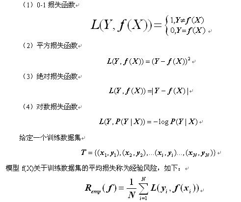
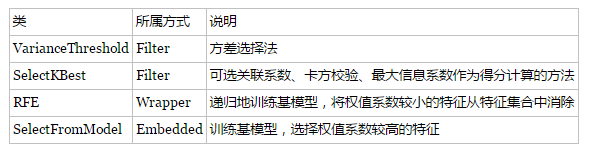
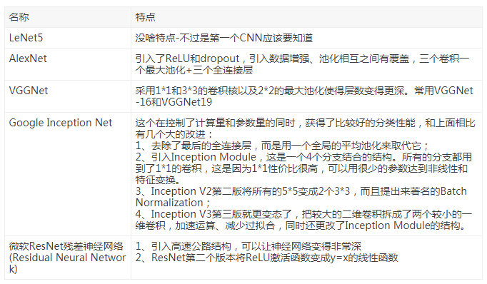

## 1. 机器学习项目流程

1. **数学抽象**

2. **数据获取**

3. **预处理与特征选择**

4. **模型训练与调优**

5. **模型诊断**

6. **模型融合/集成**

7. **上线运行**

## 2. LR 和 SVM 的联系与区别

**联系**：

- LR 和 SVM 都可以处理分类问题，且一般都用于处理线性二分类问题（在改进的情况下可以处理多分类问题）
- 两个方法都可以增加不同的正则化项，如 l1、l2 等等。所以在很多实验中，两种算法的结果是很接近的。

**区别**：

- LR 是参数模型，SVM 是非参数模型。
- 从目标函数来看，区别在于逻辑回归采用的是logistical loss，SVM 采用的是 hinge loss（合页损失函数），这两个损失函数的目的都是增加对分类影响较大的数据点的权重，减少与分类关系较小的数据点的权重
- SVM 的处理方法是只考虑 support vectors，也就是和分类最相关的少数点，去学习分类器。而逻辑回归通过非线性映射，大大减小了离分类平面较远的点的权重，相对提升了与分类最相关的数据点的权重。
- 逻辑回归相对来说模型更简单，好理解，特别是大规模线性分类时比较方便。而 SVM 的理解和优化相对来说复杂一些，SVM 转化为对偶问题后, 分类只需要计算与少数几个支持向量的距离, 这个在进行复杂核函数计算时优势很明显, 能够大大简化模型和计算。
- logic 能做的 svm能做，但可能在准确率上有问题，svm 能做的 logic 有的做不了。

## 3. 说说你知道的核函数

几种常用的核函数来代替自己构造核函数：

- 线性核函数
- 多项式核函数
- 高斯（RBF）核函数
- sigmoid核函数

**选择核函数的方法：**

- 如果特征的数量大到和样本数量差不多，则选用LR或者线性核的SVM；
- 如果特征的数量小，样本的数量正常，则选用SVM+高斯核函数；
- 如果特征的数量小，而样本的数量很大，则需要手工添加一些特征从而变成第一种情况。

## 4. LR与线性回归的区别与联系

逻辑回归的模型本质上是一个线性回归模型，逻辑回归都是以线性回归为理论支持的。但线性回归模型无法做到sigmoid的非线性形式，sigmoid可以轻松处理 `0/1` 分类问题。

## 5. 简单说下有监督学习和无监督学习的区别

**有监督学习**：对具有标记的训练样本进行学习，以尽可能对训练样本集外的数据进行分类预测。（LR, SVM, BP, RF, GBDT） 

**无监督学习**：对未标记的样本进行训练学习，比发现这些样本中的结构知识。(KMeans, DL)

## 6. 请问（决策树、Random Forest、Booting、Adaboot）GBDT和XGBoost的区别是什么？

集成学习的集成对象是学习器. Bagging 和 Boosting 属于集成学习的两类方法.

- Bagging 方法**有放回**地采样同数量样本训练每个学习器, 然后再一起集成(简单投票);
- Boosting 方法使用**全部样本**(可调权重)依次训练每个学习器, 迭代集成(平滑加权).

决策树属于最常用的学习器, 其学习过程是从根建立树, 也就是如何决策叶子节点分裂.

- ID3/C4.5 决策树用**信息熵**计算最优分裂,
- CART 决策树用**基尼指数**计算最优分裂,
- xgboost 决策树使用**二阶泰勒展开系数**计算最优分裂.

下面所提到的学习器都是决策树:

**Bagging方法: **

- 学习器间**不存在强依赖关系**, 学习器可**并行训练生成**, **集成方式一般为投票**;

- Random Forest 属于 Bagging的代表, 放回抽样, **每个学习器随机选择部分特征去优化;**

**Boosting方法: **

- 学习器之间**存在强依赖关系**、**必须串行生成**, **集成方式为加权和**;

- Adaboost 属于 Boosting, **采用指数损失函数替代原本分类任务的 0/1 损失函数;**

- GBDT 属于 Boosting 的优秀代表, **对函数残差近似值进行梯度下降, 用 CART 回归树做学习器, 集成为回归模型;**

- xgboost 属于 Boosting 的集大成者, **对函数残差近似值进行梯度下降, 迭代时利用了二阶梯度信息, 集成模型可分类也可回归.**由于它可在特征粒度上并行计算, 结构风险和工程实现都做了很多优化, 泛化, **性能和扩展性都比GBDT要好。**

而随机森林 Random Forest 是一个包含多个决策树的分类器。

至于AdaBoost，则是英文"Adaptive Boosting"（自适应增强）的缩写，关于AdaBoost可以看下这篇文章《Adaboost 算法的原理与推导》。

GBDT（Gradient Boosting Decision Tree），即梯度上升决策树算法，相当于融合决策树和梯度上升boosting 算法。

XGBoost 类似于 GBDT 的优化版，不论是精度还是效率上都有了提升。与 GBDT 相比，具体的优点有：

1. 损失函数是用泰勒展式二项逼近，而不是像 GBDT 里的就是一阶导数
2. 对树的结构进行了正则化约束，防止模型过度复杂，降低了过拟合的可能性
3. 节点分裂的方式不同，GBDT 是用的 gini系数，XGBoost 是经过优化推导后的

## 7. 免过拟合和欠拟合

**避免欠拟合（刻画不够）**

- 寻找更好的特征-----具有代表性的
- 用更多的特征-----增大输入向量的维度

**避免过拟合（刻画太细，泛化太差）**

- 增大数据集合-----使用更多的数据，噪声点比重减少
- 减少数据特征-----减小数据维度，高维空间密度小
- 正则化方法-----即在对模型的目标函数（objective function）或代价函数（cost function）加上正则项
- 交叉验证方法

### 防止过拟合方法

- 参数范数惩罚（Parameter Norm Penalties）
- 数据增强（Dataset Augmentation）
- 提前终止（Early Stopping）
- 参数绑定与参数共享（Parameter Tying and Parameter Sharing）
- Bagging 和其他集成方法
- Dropout
- 批标准化（Batch Normalization）

过拟合的原因是算法的学习能力过强；一些假设条件（如样本独立同分布）可能是不成立的；训练样本过少不能对整个空间进行分布估计。

**处理方法：**

- 早停止：如在训练中多次迭代后发现模型性能没有显著提高就停止训练
- 数据集扩增：原有数据增加、原有数据加随机噪声、重采样
- 正则化，正则化可以限制模型的复杂度
- 交叉验证
- 特征选择/特征降维
- 创建一个验证集是最基本的防止过拟合的方法。我们最终训练得到的模型目标是要在验证集上面有好的表现，而不训练集

针对过拟合问题，通常会考虑两种途径来解决：

- 减少特征的数量：
  - 人工的选择保留哪些特征；
  - 模型选择算法
- 正则化
  - 保留所有的特征，但是降低参数的量/值；
  - 正则化的好处是当特征很多时，每一个特征都会对预测y贡献一份合适的力量；

所以说，**使用正则化的目的就是为了是为了防止过拟合。**

## 8. L1和L2的区别

- **L1 正则化可以产生稀疏权值矩阵，即产生一个稀疏模型，可以用于特征选择**
- **L2 正则化可以防止模型过拟合（overfitting）。当然，一定程度上，L1也可以防止过拟合**

**简单总结一下就是**：

- L1范数: 为 `x` 向量各个元素绝对值之和。
- L2范数: 为 `x` 向量各个元素平方和的 `1/2` 次方，L2 范数又称Euclidean范数或者Frobenius范数
- Lp范数: 为 `x` 向量各个元素绝对值 `p` 次方和的 `1/p` 次方.

L1 和 L2的差别，为什么一个让绝对值最小，一个让平方最小，会有那么大的差别呢？看导数一个是 `1` 一个是 `w` 便知, **在靠进零附近, L1 以匀速下降到零, 而 L2 则完全停下来了. 这说明 L1 是将不重要的特征(或者说, 重要性不在一个数量级上)尽快剔除, L2 则是把特征贡献尽量压缩最小但不至于为零. **两者一起作用, 就是把重要性在一个数量级(重要性最高的)的那些特征一起平等共事(简言之, 不养闲人也不要超人)。

**L1 和 L2 正则先验分别服从什么分布**：

- L1 是拉普拉斯分布
- L2 是高斯分布

**先验就是优化的起跑线, 有先验的好处就是可以在较小的数据集中有良好的泛化性能，当然这是在先验分布是接近真实分布的情况下得到的了，从信息论的角度看，向系统加入了正确先验这个信息，肯定会提高系统的性能。**

**L2 先验趋向零周围, L1 先验趋向零本身。**

## 9. 稀疏模型与特征选择

上面提到 L1 正则化有助于生成一个稀疏权值矩阵，进而可以用于特征选择。**为什么要生成一个稀疏矩阵？**

稀疏矩阵指的是很多元素为 0，只有少数元素是非零值的矩阵，即得到的线性回归模型的大部分系数都是 0. 通常机器学习中特征数量很多，例如文本处理时，如果将一个词组（term）作为一个特征，那么特征数量会达到上万个（bigram）。

**在预测或分类时，那么多特征显然难以选择，但是如果代入这些特征得到的模型是一个稀疏模型，表示只有少数特征对这个模型有贡献，绝大部分特征是没有贡献的，或者贡献微小（因为它们前面的系数是0或者是很小的值，即使去掉对模型也没有什么影响），此时我们就可以只关注系数是非零值的特征。这就是稀疏模型与特征选择的关系**。

## 10. 说说常见的损失函数？

- log对数损失函数（逻辑回归）

- 平方损失函数（最小二乘法, Ordinary Least Squares ）

- 指数损失函数（Adaboost）

- Hinge损失函数（SVM）

## 11. xgboost 如何寻找最优特征？是有放回还是无放回的呢？

**xgboost 在训练的过程中给出各个特征的增益评分，最大增益的特征会被选出来作为分裂依据, 从而记忆了每个特征对在模型训练时的重要性 -- 从根到叶子中间节点涉及某特征的次数作为该特征重要性排序.**

xgboost 属于 boosting 集成学习方法, 样本是**不放回**的, 因而每轮计算样本不重复. 另一方面, **xgboost支持子采样, 也就是每轮计算可以不使用全部样本, 以减少过拟合**. 进一步地,**xgboost 还有列采样, 每轮计算按百分比随机采样一部分特征, 既提高计算速度又减少过拟合**。

## 12. 谈谈判别式模型和生成式模型？

**判别方法**：由数据直接学习决策函数 `Y = f（X）`，或者由条件分布概率 `P（Y|X）`作为预测模型，即判别模型。

**生成方法**：由数据学习联合概率密度分布函数 `P（X,Y）`,然后求出条件概率分布 `P(Y|X)` 作为预测的模型，即生成模型。

**由生成模型可以得到判别模型，但由判别模型得不到生成模型。**

**常见的判别模型有**：

- K近邻、SVM、决策树、感知机、线性判别分析（LDA）、线性回归、传统的神经网络、逻辑斯蒂回归、boosting、条件随机场

**常见的生成模型有**：

- 朴素贝叶斯、隐马尔可夫模型、高斯混合模型、文档主题生成模型（LDA）、限制玻尔兹曼机

## 13. 线性分类器与非线性分类器的区别以及优劣

线性和非线性是针对，模型参数和输入特征来讲的；比如输入 `x`，模型 `y=ax+ax^2`那么就是非线性模型，如果输入是 `x` 和 `X^2` 则模型是线性的。

- 线性分类器可解释性好，计算复杂度较低，不足之处是模型的拟合效果相对弱些。
- 非线性分类器效果拟合能力较强，不足之处是数据量不足容易过拟合、计算复杂度高、可解释性不好。

**常见的线性分类器有**：

- LR, 贝叶斯分类，单层感知机、线性回归

**常见的非线性分类器**：

- 决策树、RF、GBDT、多层感知机

SVM 两种都有（看线性核还是高斯核）

## 14. 为什么朴素贝叶斯如此“朴素”？

朴素贝叶斯太‘朴素’了，**因为它假定所有的特征在数据集中的作用是同样重要和独立的**。正如我们所知，这个假设在现实世界中是很不真实的。

## 15. 请简要说说 EM 算法（期望最大化算法）

有时候因为样本的产生和隐含变量有关（隐含变量是不能观察的），而求模型的参数时一般采用最大似然估计，由于含有了隐含变量，所以对似然函数参数求导是求不出来的，这时可以采用 EM 算法来求模型的参数的（对应模型参数个数可能有多个），EM 算法一般分为 2 步：

- E步：选取一组参数，求出在该参数下隐含变量的条件概率值；
- M步：结合E步求出的隐含变量条件概率，求出似然函数下界函数（本质上是某个期望函数）的最大值。 重复上面2步直至收敛。

## 16. KNN中的 K 如何选取的？

- **K 值的减小就意味着整体模型变得复杂，容易发生过拟合；**

- **K 值的增大就意味着整体的模型变得简单**

在实际应用中，K 值一般取一个比较小的数值，例如采用交叉验证法（简单来说，就是一部分样本做训练集，一部分做测试集）来选择最优的 K 值。

## 17. 哪些机器学习算法不需要做归一化处理？

在实际应用中，通过梯度下降法求解的模型一般都是需要归一化的，比如线性回归、logistic回归、KNN、SVM、神经网络等模型。

**但树形模型不需要归一化，因为它们不关心变量的值，而是关心变量的分布和变量之间的条件概率，如决策树、随机森林(Random Forest)**。

**为什么要归一化呢？很多同学并未搞清楚，维基百科给出的解释：**

- 归一化后加快了梯度下降求最优解的速度；
- 归一化有可能提高精度。

### 17.1 归一化的类型

1. **线性归一化**

   }{max(x)&space;-&space;min(x)})

   这种归一化方法比较适用在数值比较集中的情况。这种方法有个缺陷，如果 max 和 min不 稳定，很容易使得归一化结果不稳定，使得后续使用效果也不稳定。**实际使用中可以用经验常量值来替代 max 和 min。**

2. **标准差标准化**

   经过处理的数据符合标准正态分布，即均值为 0，标准差为 1，其转化函数为：

   

   其中 `μ` 为所有样本数据的均值，`σ` 为所有样本数据的标准差。

3. **非线性归一化**

   **经常用在数据分化比较大的场景，有些数值很大，有些很小。**通过一些数学函数，将原始值进行映射。**该方法包括 log、指数，正切等。**需要根据数据分布的情况，决定非线性函数的曲线，比如 `log(V, 2)` 还是 `log(V, 10)` 等。

## 18. 简单说说贝叶斯定理

在引出贝叶斯定理之前，先学习几个定义：

**条件概率（又称后验概率）** 就是事件 A 在另外一个事件 B 已经发生条件下的发生概率。**条件概率表示为P(A|B)，读作 “在 B 条件下 A 的概率”。**

比如，在同一个样本空间 `Ω` 中的事件或者子集 `A` 与 `B`，如果随机从 `Ω` 中选出的一个元素属于 `B` ，那么这个随机选择的元素还属于 `A` 的概率就定义为在 `B` 的前提下A的条件概率，所以：`P(A|B) = |A∩B|/|B|`，接着分子、分母都除以 `|Ω|` 得到

**联合概率**：表示两个事件共同发生的概率。`A` 与 `B` 的联合概率表示为 ) 或者 )。

**边缘概率（又称先验概率）**：是某个事件发生的概率。**边缘概率是这样得到的：在联合概率中，把最终结果中那些不需要的事件通过合并成它们的全概率，而消去它们（对离散随机变量用求和得全概率，对连续随机变量用积分得全概率），这称为边缘化（marginalization），比如 A 的边缘概率表示为P(A)，B 的边缘概率表示为 P(B)。**

贝叶斯定理便是基于下述贝叶斯公式：

## 19. 标准化与归一化的区别？

简单来说，**标准化是依照特征矩阵的列处理数据**，其通过求 `z-score` 的方法，将样本的特征值转换到同一量纲下。

**归一化是依照特征矩阵的行处理数据**，其目的在于样本向量在点乘运算或其他核函数计算相似性时，拥有统一的标准，也就是说都转化为“单位向量”。

## 20. 如何进行特征选择？

特征选择是一个重要的数据预处理过程，主要有两个原因：

- 一是减少特征数量、降维，使模型泛化能力更强，减少过拟合;
- 二是增强对特征和特征值之间的理解

**常见的特征选择方式：**

1. **去除方差较小的特征**
2. **正则化**。L1 正则化能够生成稀疏的模型。L2 正则化的表现更加稳定，由于有用的特征往往对应系数非零。
3. **随机森林**，**对于分类问题，通常采用基尼不纯度或者信息增益，对于回归问题，通常采用的是方差或者最小二乘拟合**。一般不需要 feature engineering、调参等繁琐的步骤。它的两个主要问题：
   - 重要的特征有可能得分很低（关联特征问题）
   - 这种方法对特征变量类别多的特征越有利（偏向问题）。
4. **稳定性选择**。是一种基于二次抽样和选择算法相结合较新的方法，选择算法可以是回归、SVM或其他类似的方法。**它的主要思想是在不同的数据子集和特征子集上运行特征选择算法，不断的重复，最终汇总特征选择结果，比如可以统计某个特征被认为是重要特征的频率（被选为重要特征的次数除以它所在的子集被测试的次数）**。理想情况下，重要特征的得分会接近100%。稍微弱一点的特征得分会是非0的数，而最无用的特征得分将会接近于0。

## 21. 衡量分类器的好坏？

这里首先要知道 TP、FN（真的判成假的）、FP（假的判成真）、TN四种（可以画一个表格）。

几种常用的指标：

**精度precision** = TP/(TP+FP) = TP/~P （~p为预测为真的数量）

**召回率 recall** = TP/(TP+FN) = TP/ P

**F1值：** 2/F1 = 1/recall + 1/precision

**ROC曲线**：ROC 空间是一个以伪阳性率（FPR，false positive rate）为 X 轴，真阳性率（TPR, true positive rate）为 Y 轴的二维坐标系所代表的平面。其中真阳率 TPR = TP / P = recall， 伪阳率 FPR = FP / N

### 21.1 为什么使用 ROC 曲线

既然已经这么多评价标准，为什么还要使用 ROC 和 AUC 呢？

因为 ROC 曲线有个很好的特性：**当测试集中的正负样本的分布变化的时候，ROC曲线能够保持不变**。在实际的数据集中经常会出现类不平衡（class imbalance）现象，即负样本比正样本多很多（或者相反），而且测试数据中的正负样本的分布也可能随着时间变化。

### 21.2 机器学习和统计里面的 AUC 的物理意义是啥？

AUC 是评价模型好坏的常见指标之一

## 22. 什麽造成梯度消失问题?

造成梯度消失的一个原因是，许多激活函数将输出值挤压在很小的区间内，在激活函数两端较大范围的定义域内梯度为 0，造成学习停止。

## 23. 数据不平衡问题

这主要是由于数据分布不平衡造成的。解决方法如下：

- 采样，对小样本加噪声采样，对大样本进行下采样
- 数据生成，利用已知样本生成新的样本
- 进行特殊的加权，如在 Adaboost中 或者 SVM 中
- 采用对不平衡数据集不敏感的算法
- 改变评价标准：用 AUC/ROC 来进行评价
- 采用 Bagging/Boosting/ensemble 等方法
- 在设计模型的时候考虑数据的先验分布

## 24. 常见的分类算法有哪些？

SVM、神经网络、随机森林、逻辑回归、KNN、贝叶斯

## 25. 常见的监督学习算法有哪些？

感知机、svm、人工神经网络、决策树、逻辑回归

## 26. 说说常见的优化算法及其优缺点？

温馨提示：在回答面试官的问题的时候，往往将问题往大的方面去回答，这样不会陷于小的技术上死磕，最后很容易把自己嗑死了。

**简言之：**

1. **随机梯度下降**
   - 优点：可以一定程度上解决局部最优解的问题
   - 缺点：收敛速度较慢

2. **批量梯度下降**
   - 优点：容易陷入局部最优解
   - 缺点：收敛速度较快

3. **mini_batch 梯度下降**

   综合随机梯度下降和批量梯度下降的优缺点，提取的一个中和的方法。

4. **牛顿法**

   牛顿法在迭代的时候，需要计算 Hessian 矩阵，当维度较高的时候，计算 Hessian 矩阵比较困难

5. **拟牛顿法**

   拟牛顿法是为了改进牛顿法在迭代过程中，计算 Hessian 矩阵而提取的算法，它采用的方式是通过逼近 Hessian 的方式来进行求解。

**具体而言：**

**从每个batch的数据来区分：**

- **梯度下降**：每次使用全部数据集进行训练
  - 优点：得到的是最优解
  - 缺点：运行速度慢，内存可能不够
- **随机梯度下降**：每次使用一个数据进行训练
  - 优点：训练速度快，无内存问题
  - 缺点：容易震荡，可能达不到最优解
- **Mini-batch**梯度下降
  - 优点：训练速度快，无内存问题，震荡较少
  - 缺点：可能达不到最优解

**从优化方法上来分：**

- **随机梯度下降（SGD）**

  - 缺点：

    选择合适的learning	rate比较难、

    对于所有的参数使用同样的learning rate

    容易收敛到局部最优

    可能困在saddle point

- **SGD + Momentum**

  - 优点：

    积累动量，加速训练

    局部极值附近震荡时，由于动量，跳出陷阱

    梯度方向发生变化时，动量缓解动荡。

- **Nesterov Mementum**

  - 与Mementum类似，优点：

    避免前进太快

    提高灵敏度

- **AdaGrad**

  - 优点：

    控制学习率，每一个分量有各自不同的学习率

    适合稀疏数据

  - 缺点

    依赖一个全局学习率

    学习率设置太大，其影响过于敏感

    后期，调整学习率的分母积累的太大，导致学习率很低，提前结束训练。

- **RMSProp**

  - 优点：

    解决了后期提前结束的问题。

  - 缺点：

    依然依赖全局学习率

- **Adam** Adagrad 和 RMSProp的合体

  - 优点：

    结合了 Adagrad 善于处理稀疏梯度和 RMSprop 善于处理非平稳目标的优点

    为不同的参数计算不同的自适应学习率

    也适用于大多非凸优化 - 适用于大数据集和高维空间

- **牛顿法**

  牛顿法在迭代的时候，需要计算 Hessian 矩阵，当维度较高的时候，计算 Hessian 矩阵比较困难

- **拟牛顿法**

  拟牛顿法是为了改进牛顿法在迭代过程中，计算 Hessian 矩阵而提取的算法，它采用的方式是通过逼近 Hessian 的方式来进行求解。

## 27. RF与GBDT之间的区别与联系？

**相同点**：都是由多棵树组成，最终的结果都是由多棵树一起决定。

**不同点**：

- 组成随机森林的树可以分类树也可以是回归树，而 GBDT 只由回归树组成
- 组成随机森林的树可以并行生成，而 GBDT 是串行生成
- 随机森林的结果是多数表决表决的，而 GBDT 则是多棵树累加之和
- 随机森林对异常值不敏感，而 GBDT 对异常值比较敏感
- 随机森林是减少模型的方差，而 GBDT 是减少模型的偏差
- 随机森林不需要进行特征归一化。而 GBDT 则需要进行特征归一化

## 28. 请具体说说Boosting和Bagging的区别

### 28.1 Bagging 之随机森林

随机森林改变了决策树容易过拟合的问题，这主要是由两个操作所优化的：

- Boostrap 从袋内**有放回**的抽取样本值
- 每次随机抽取一定数量的特征（通常为 `sqr(n)`）。
- 分类问题：采用 Bagging 投票的方式选择类别频次最高的
- 回归问题：直接取每颗树结果的平均值。

**常见参数：**

1、树最大深度

2、树的个数

3、节点上的最小样本数

4、特征数(`sqr(n)`)	oob(out-of-bag)

**误差分析：**

- 将各个树的未采样样本作为预测样本统计误差作为误分率，可以并行计算

**优点：**

- 不需要特征选择
- 可以总结出特征重要性
- 可以处理缺失数据
- 不需要额外设计测试集

**缺点：**

- 在回归上不能输出连续结果

### 28.2 Boosting 之 AdaBoost

**Boosting 的本质实际上是一个加法模型**，通过改变训练样本权重学习多个分类器并进行一些线性组合。而 **Adaboost 就是加法模型 + 指数损失函数 + 前项分布算法**。Adaboost 就是从弱分类器出发反复训练，在其中不断调整数据权重或者是概率分布，同时提高前一轮被弱分类器误分的样本的权值。最后用分类器进行投票表决（但是分类器的重要性不同）。

### 28.3 Boosting 之 GBDT

**将基分类器变成二叉树，回归用二叉回归树，分类用二叉分类树**。和上面的 Adaboost 相比，**回归树的损失函数为平方损失，同样可以用指数损失函数定义分类问题**。但是对于一般损失函数怎么计算呢？

**GBDT（梯度提升决策树）是为了解决一般损失函数的优化问题，方法是用损失函数的负梯度在当前模型的值来模拟回归问题中残差的近似值。 **

注：**由于 GBDT 很容易出现过拟合的问题，所以推荐的 GBDT 深度不要超过 6，而随机森林可以在 15 以上。 **

### 28.4 Boosting 之 Xgboost

这个工具主要有以下几个特点：

- 支持线性分类器
- 可以自定义损失函数，并且可以用二阶偏导
- 加入了正则化项：叶节点数、每个叶节点输出 score 的 L2-norm
- 支持特征抽样
- 在一定情况下支持并行，只有在建树的阶段才会用到，每个节点可以并行的寻找分裂特征。

## 29. LR 和随机森林区别

**随机森林等树算法都是非线性的，而 LR 是线性的。LR 更侧重全局优化，而树模型主要是局部的优化。**

## 30. 机器学习特征工程操作，以及它的意义

数据预处理：

特征选择：

特征工程包括**数据与特征处理、特征选择和降纬三部分**。

### 30.1 数据与特征处理包括

1. 数据选择、清洗、采样
   - 数据格式化
   - 数据清洗，填充缺失值、去掉脏数据，将不可信的样本丢掉，缺省值极多的字段考虑不用
   - 采样：针对正负样本不平衡的情况，当正样本远大于负样本时，且量都很大时，使用下采样，量不大时，可采集更多的数据或oversampling或修改损失函数；采样过程中可利用分层抽样保持不同类别数据的比例
2. 不同类型数据的特征处理
   - **数值型：**幅度调整/归一化、log等变化、统计值（例如max、min、mean、std）、离散化、分桶等
   - **类别型：**one-hot 编码等
   - **时间型：** 提取出连续值的持续时间和间隔时间；提取出离散值的“年”、“月”、“日”、“一年中哪个星期/季度”、“一周中的星期几”、“工作日/周末”等信息
   - **文本型：**使用 `If-idf` 特征
   - **统计型：**加减平均、分位线、次序、比例

意义：

- 对数据进行预处理，可提高数据质量，提高挖掘质量。对数据进行清洗可填充缺失值、光滑噪声数据，识别和删除离群点数据，保证数据的一致性；
- 使用正确的采样方法可解决因数据不平衡带来的预测偏差；
- 对不同的数据类型进行不同的特征处理有助于提高特征的可用性，例如对数值型数据进行归一化可将数据转化到统一量纲下；对类别型数据，可用one-hot编码方法将类别数据数字化，数字化特征之后可更用来计算距离、相似性等；可从时间型数据当中提取中更多的时间特征，例如年、月和日等，这些特征对于业务场景以及模型的预测往往有很大的帮助。统计型特征处理有助于从业务场景中挖掘更丰富的信息。

### 30.2 特征选择包括：

1. **Filter**

   使用方差、Pearson相关系数、互信息等方法过滤特征，评估单个特征和结果值之间的相关程度，留下 Top 相关的特征部分。

2. **Wrapper**

   可利用“递归特征删除算法”，把特征选择看做一个特征子集搜索问题，筛选各种特征子集，用模型评估效果。

3. **Embedded**

   可利用正则化方式选择特征，使用带惩罚项的基模型，除了选择出特征外，同时也进行了降纬。

意义：

- 剔除对结果预测不大的特征，减小冗余，选择有意义的特征输入模型，提高计算性能。

### 30.3 降纬

**方法：**主成分分析法（PCA）和线性判别分析（LDA）

**意义：**通过 PCA 或 LDA 方法，将较高纬度样本空间映射到较低维度的样本空间，从而达到降纬的目的，减少模型的训练时间，提高模型的计算性能。

## 31. 对于维度极低的特征，选择线性还是非线性分类器？

非线性分类器，低维空间可能很多特征都跑到一起了，导致线性不可分。

1. 如果 Feature 的数量很大，跟样本数量差不多，这时候选用 LR 或者是 Linear Kernel 的 SVM
2. 如果 Feature 的数量比较小，样本数量一般，不算大也不算小，选用 SVM + Gaussian Kernel
3. 如果 Feature 的数量比较小，而样本数量很多，需要手工添加一些 feature 变成第一种情况。

## 32. 请问怎么处理特征向量的缺失值

一方面，**缺失值较多. 直接将该特征舍弃掉**，否则可能反倒会带入较大的 noise，对结果造成不良影响。

另一方面**缺失值较少, 其余的特征缺失值都在 10% 以内**，我们可以采取很多的方式来处理:

- 把 NaN 直接作为一个特征，假设用 0 表示
- 用均值填充
- 用随机森林等算法预测填充

## 33. SVM、LR、决策树的对比

**模型复杂度：**

- SVM 支持核函数，可处理线性非线性问题
- LR 模型简单，训练速度快，适合处理线性问题
- 决策树容易过拟合，需要进行剪枝

**损失函数：**

- SVM hinge loss（铰链损失）
- LR L2 正则化
- adaboost 指数损失

**数据敏感度：**

- SVM 添加容忍度对 outlier 不敏感，只关心支持向量，且需要先做归一化;
- LR 对远点敏感

**数据量：**

- 数据量大就用 LR
- 数据量小且特征少就用 SVM 非线性核

## 34. 什么是 ill-condition 病态问题？

**训练完的模型，测试样本稍作修改就会得到差别很大的结果，就是病态问题**，模型对未知数据的预测能力很差，即泛化误差大。

## 35. 简述 KNN 最近邻分类算法的过程？

1. 计算测试样本和训练样本中每个样本点的距离（常见的距离度量有欧式距离，马氏距离等）；
2. 对上面所有的距离值进行排序；
3. 选前 `k` 个最小距离的样本；
4. 根据这 `k` 个样本的标签进行投票，得到最后的分类类别；

## 36. 常用的聚类划分方式有哪些？列举代表算法

1. **基于划分的聚类: ** K-means，k-medoids，CLARANS。
2. **基于层次的聚类：**AGNES（自底向上），DIANA（自上向下）。
3. **基于密度的聚类：**DBSACN，OPTICS，BIRCH(CF-Tree)，CURE。
4. **基于网格的方法：**STING，WaveCluster。
5. **基于模型的聚类：**EM, SOM，COBWEB。

## 37. 深度学习中的偏差与方差

- 神经网络的拟合能力非常强，因此它的**训练误差**（偏差）通常较小；
- 但是过强的拟合能力会导致较大的方差，使模型的测试误差（**泛化误差**）增大；
- 因此深度学习的核心工作之一就是研究如何降低模型的泛化误差，这类方法统称为**正则化方法**。

## 38. 请写出你对 VC 维的理解和认识

VC 维是模型的复杂程度，模型假设空间越大，VC 维越高。某种程度上说，VC 维给机器学习可学性提供了理论支撑。

1. 测试集合的 loss 是否和训练集合的 loss 接近？**VC 维越小，理论越接近，越不容易 overfitting**
2. 训练集合的 loss 是否足够小？ **VC 维越大，loss 理论越小，越不容易 underfitting**

我们对模型添加的**正则项**可以对模型复杂度( VC维 )进行控制，平衡这两个部分。

## 39. 解释朴素贝叶斯算法里面的先验概率、似然估计和边际似然估计？

先验概率就是因变量（二分法）在数据集中的比例。这是在你没有任何进一步的信息的时候，是对分类能做出的最接近的猜测。

例如，在一个数据集中，因变量是二进制的（1 和 0）。例如，1（垃圾邮件）的比例为 70％ 和 0（非垃圾邮件）的为 30％。因此，我们可以估算出任何新的电子邮件有 70％ 的概率被归类为垃圾邮件。

**似然估计是在其他一些变量的给定的情况下，一个观测值被分类为 1 的概率**。例如，“FREE”这个词在以前的垃圾邮件使用的概率就是似然估计。**边际似然估计就是，“FREE”这个词在任何消息中使用的概率**

## 40. KNN和KMEANS聚类（kmeans clustering）有什么不同？

答：不要被它们的名字里的 “K” 误导。

你应该知道，这两种算法之间的根本区别是，KMEANS本质上是无监督学习而 KNN 是监督学习。

**KMEANS 是聚类算法。KNN 是分类（或回归）算法。**

KMEAN 算法把一个数据集分割成簇，使得形成的簇是同构的，每个簇里的点相互靠近。该算法试图维持这些簇之间有足够的可分离性。由于无监督的性质，这些簇没有任何标签。**KNN 算法尝试基于其k（可以是任何数目）个周围邻居来对未标记的观察进行分类**。它也被称为懒惰学习法，因为它涉及最小的模型训练。因此，它不用训练数据对未看见的数据集进行泛化。

## 41. 真阳性率和召回有什么关系？写出方程式

答：真阳性率=召回。是的，它们有相同的公式（TP / TP + FN）。

注意：要了解更多关于**估值矩阵**的知识。

## 42. 什么时候Ridge回归优于Lasso回归？

答：你可以引用 ISLR 的作者 Hastie 和 Tibshirani 的话。他们断言：

> 在对少量变量有中等或大尺度的影响的时候用 lasso 回归。
>
> 在对多个变量只有小或中等尺度影响的时候，使用 Ridge 回归。

从概念上讲，我们可以说，**Lasso 回归（L1）同时做变量选择和参数收缩，而 Ridge 回归只做参数收缩，并最终在模型中包含所有的系数**。

**在有相关变量时，Ridge 回归可能是首选**。此外，Ridge 回归在用最小二乘估计有更高的偏差的情况下效果最好。因此，**选择合适的模型取决于我们的模型的目标**。

## 43. 如何在一个数据集上选择重要的变量？给出解释

答：以下是你可以使用的选择变量的方法：

1. **选择重要的变量之前除去相关变量**
2. 用线性回归然后基于 P 值选择变量
3. 使用前向选择，后向选择，逐步选择
4. 使用随机森林和 Xgboost，然后画出变量重要性图
5. 使用 lasso 回归
6. 测量可用的特征集的的信息增益，并相应地选择前 `n` 个特征量。

## 44. 是否有可能捕获连续变量和分类变量之间的相关性？如果可以的话，怎样做？

是的，我们可以**用 ANCOVA（协方差分析）技术来捕获连续型变量和分类变量之间的相关性。**

## 45. Gradient boosting 算法（GBM）和随机森林都是基于树的算法，它们有什么区别？

答：**最根本的区别是，随机森林算法使用 bagging 技术做出预测。 GBM 采用 boosting 技术做预测**。

在 bagging 技术中，数据集用随机采样的方法被划分成使 `n` 个样本。然后，使用单一的学习算法，在所有样本上建模。接着利用投票或者求平均来组合所得到的预测。

Bagging 是并行进行的。而 boosting 是在第一轮的预测之后，算法将分类出错的预测加高权重，使得它们可以在后续一轮中得到校正。这种给予分类出错的预测高权重的顺序过程持续进行，一直到达到停止标准为止。

随机森林通过减少方差（主要方式）提高模型的精度。生成树之间是不相关的，以把方差的减少最大化。在另一方面，**GBM 提高了精度，同时减少了模型的偏差和方差**。

注意：多了解关于**基于树的建模知识**。

## 46. 分类问题中分层抽样和随机抽样

**在做分类问题时，我们应该使用分层抽样而不是随机抽样。随机抽样不考虑目标类别的比例。相反，分层抽样有助于保持目标变量在所得分布样本中的分布。**

## 47. 在应用机器学习算法之前纠正和清理数据的步骤是什么？

1. 将数据导入
2. 看数据：重点看元数据，即对字段解释、数据来源等信息；导入数据后，提取部分数据进行查看
3. 缺失值清洗
   - 根据需要对缺失值进行处理，可以删除数据或填充数据
   - 重新取数：如果某些非常重要的字段缺失，需要和负责采集数据的人沟通，是否可以再获得
4. 数据格式清洗：统一数据的时间、日期、全半角等显示格式
5. 逻辑错误的数据
   - 重复的数据
   - 不合理的值
6. 不一致错误的处理：指对矛盾内容的修正，最常见的如身份证号和出生年月日不对应。

不同业务中数据清洗的任务略有不同，比如数据有不同来源的话，数据格式清洗和不一致错误的处理就尤为突出。数据预处理是数据类岗位工作内容中重要的部分。

## 48. 在 K-Means 中如何拾取 k？

K-Means 算法的最大缺点是不能自动选择分类数 `k`，常见的确定 `k` 的方法有：

- 根据先验知识来确定
- k=2N ，N 为样本数
- 拐点法：把聚类结果的 F-test 值对聚类个数的曲线画出来，选择图中的拐点
- 基于信息准则判断，如果模型有似然函数，则可以用 BIC、DIC 来进行决策 具体的 `k` 的选择往往和业务联系紧密，如希望能将用户进行分类，就有先验的分类要求

## 49. CNN在各个领域应用的共性

CNN 抓住此共性的手段主要有四个：

- 局部连接
- 权值共享
- 池化操作
- 多层次结构。

## 50. Sigmoid、Tanh、ReLu这三个激活函数有什么缺点或不足，有没改进的激活函数。

## 51. 请问人工神经网络中为什么ReLu要好过于tanh和sigmoid function？

- 第一，采用 sigmoid 等函数，算激活函数时（指数运算），计算量大，反向传播求误差梯度时，求导涉及除法和指数运算，计算量相对大，而采用 Relu 激活函数，整个过程的计算量节省很多。
- 第二，对于深层网络，sigmoid 函数反向传播时，很容易就会出现梯度消失的情况（在 sigmoid 接近饱和区时，变换太缓慢，导数趋于 0，这种情况会造成信息丢失），这种现象称为饱和，从而无法完成深层网络的训练。而 ReLU 就不会有饱和倾向，不会有特别小的梯度出现。
- 第三，Relu 会使一部分神经元的输出为 0，这样就造成了网络的稀疏性，并且减少了参数的相互依存关系，缓解了过拟合问题的发生（以及一些人的生物解释 balabala）。当然现在也有一些对 relu 的改进，比如 prelu，random relu 等，在不同的数据集上会有一些训练速度上或者准确率上的改进，具体的大家可以找相关的 paper 看。

多加一句，**现在主流的做法，会多做一步 batch normalization，尽可能保证每一层网络的输入具有相同的分布[1]。而最新的 paper[2]，他们在加入 bypass connection 之后，发现改变 batch normalization 的位置会有更好的效果**。大家有兴趣可以看下。

## 52. 为什么LSTM模型中既存在sigmoid又存在tanh两种激活函数，而不是选择统一一种sigmoid或者tanh？这样做的目的是什么？

sigmoid 用在了各种 gate 上，产生 `0~1` 之间的值，这个一般只有 sigmoid 最直接了。

tanh 用在了状态和输出上，是对数据的处理，这个用其他激活函数或许也可以。

## 53. 如何解决RNN梯度爆炸和弥散的问题？

**当梯度爆炸时截断梯度**

为了解决梯度弥散的问题，我们介绍了两种方法。

- **第一种方法是将随机初始化改为一个有关联的矩阵初始化**。
- **第二种方法是使用 ReLU（Rectified Linear Units）代替 sigmoid 函数**。ReLU 的导数不是 0 就是 1.因此，神经元的梯度将始终为 1，而不会当梯度传播了一定时间之后变小。

## 54. 什麽样的资料集不适合用深度学习？

- 数据集太小，数据样本不足时，深度学习相对其它机器学习算法，没有明显优势。
- **数据集没有局部相关特性**，目前深度学习表现比较好的领域主要是图像／语音／自然语言处理等领域，这些领域的一个共性是局部相关性。图像中像素组成物体，语音信号中音位组合成单词，文本数据中单词组合成句子，这些特征元素的组合一旦被打乱，表示的含义同时也被改变。对于没有这样的局部相关性的数据集，不适于使用深度学习算法进行处理。

## 55. 如何解决梯度消失和梯度膨胀

- 梯度消失：

  根据链式法则，如果每一层神经元对上一层的输出的偏导乘上权重结果都小于 1 的话，那么即使这个结果是 0.99，在经过足够多层传播之后，误差对输入层的偏导会趋于 0

  可以采用 ReLU 激活函数有效的解决梯度消失的情况，也可以用 Batch Normalization 解决这个问题。

- 梯度膨胀

  根据链式法则，如果每一层神经元对上一层的输出的偏导乘上权重结果都大于 1 的话，在经过足够多层传播之后，误差对输入层的偏导会趋于无穷大

  可以通过激活函数来解决，或用 Batch Normalization 解决这个问题。

## 56. 请简述神经网络的发展史。

- sigmoid 会饱和，造成梯度消失。于是有了 ReLU。
- ReLU 负半轴是死区，造成梯度变 0。于是有了 LeakyReLU，PReLU。
- 强调梯度和权值分布的稳定性，由此有了 ELU，以及较新的 SELU。
- 太深了，梯度传不下去，于是有了 highway（最小生成树prim算法）。
- 干脆连 highway 的参数都不要，直接变残差，于是有了 ResNet。
- 强行稳定参数的均值和方差，于是有了 BatchNorm（批量归一化）。
- 在梯度流中增加噪声，于是有了 Dropout。
- RNN 梯度不稳定，于是加几个通路和门控，于是有了 LSTM。
- LSTM 简化一下，有了 GRU（循环神经网络）。
- GAN（生成式对抗网络） 的 JS 散度有问题，会导致梯度消失或无效，于是有了 WGAN。
- WGAN 对梯度的 clip 有问题，于是有了 WGAN-GP。

## 57. 神经网络中激活函数的真正意义？一个激活函数需要具有哪些必要的属性？还有哪些属性是好的属性但不必要的？

**1. 非线性：** 即导数不是常数。这个条件前面很多答主都提到了，是多层神经网络的基础，保证多层网络不退化成单层线性网络。这也是激活函数的意义所在。

**2. 几乎处处可微：** 可微性保证了在优化中梯度的可计算性。传统的激活函数如 sigmoid 等满足处处可微。对于分段线性函数比如 ReLU，只满足几乎处处可微（即仅在有限个点处不可微）。对于 SGD 算法来说，由于几乎不可能收敛到梯度接近零的位置，有限的不可微点对于优化结果不会有很大影响 [1]。

**3. 计算简单：** 正如题主所说，非线性函数有很多。极端的说，一个多层神经网络也可以作为一个非线性函数，类似于 Network In Network [2] 中把它当做卷积操作的做法。但激活函数在神经网络前向的计算次数与神经元的个数成正比，因此简单的非线性函数自然更适合用作激活函数。这也是 ReLU 之流比其它使用 Exp 等操作的激活函数更受欢迎的其中一个原因。

**4. 非饱和性（saturation）：** 饱和指的是在某些区间梯度接近于零（即梯度消失），使得参数无法继续更新的问题。最经典的例子是 Sigmoid，它的导数在x为比较大的正值和比较小的负值时都会接近于 0。更极端的例子是阶跃函数，由于它在几乎所有位置的梯度都为 0，因此处处饱和，无法作为激活函数。ReLU 在 `x>0` 时导数恒为 1，因此对于再大的正值也不会饱和。但同时对于 `x<0`，其梯度恒为 0，这时候它也会出现饱和的现象（在这种情况下通常称为 dying ReLU）。Leaky ReLU[3] 和 PReLU[4] 的提出正是为了解决这一问题。

**5. 单调性（monotonic）：** 即导数符号不变。这个性质大部分激活函数都有，除了诸如 sin、cos 等。个人理解，单调性使得在激活函数处的梯度方向不会经常改变，从而让训练更容易收敛。

**6. 输出范围有限：** 有限的输出范围使得网络对于一些比较大的输入也会比较稳定，这也是为什么早期的激活函数都以此类函数为主，如 Sigmoid、TanH。但这导致了前面提到的梯度消失问题，而且强行让每一层的输出限制到固定范围会限制其表达能力。因此现在这类函数仅用于某些需要特定输出范围的场合，比如概率输出（此时 loss 函数中的 log 操作能够抵消其梯度消失的影响[1]）、LSTM 里的 gate 函数。

**7. 接近恒等变换（identity）：** 即约等于 x。这样的好处是使得输出的幅值不会随着深度的增加而发生显著的增加，从而使网络更为稳定，同时梯度也能够更容易地回传。这个与非线性是有点矛盾的，因此激活函数基本只是部分满足这个条件，比如 TanH 只在原点附近有线性区（在原点为 0 且在原点的导数为1），而 ReLU 只在 `x>0` 时为线性。这个性质也让初始化参数范围的推导更为简单 [5][4]。额外提一句，这种恒等变换的性质也被其他一些网络结构设计所借鉴，比如 CNN 中的 ResNet[6] 和 RNN 中的 LSTM。

**8. 参数少：** 大部分激活函数都是没有参数的。像 PReLU 带单个参数会略微增加网络的大小。还有一个例外是 Maxout[7]，尽管本身没有参数，但在同样输出通道数下 `k` 路 Maxout 需要的输入通道数是其它函数的 `k` 倍，这意味着神经元数目也需要变为 `k` 倍；但如果不考虑维持输出通道数的情况下，该激活函数又能将参数个数减少为原来的 `k` 倍。

**9. 归一化（normalization）：** 这个是最近才出来的概念，对应的激活函数是 SELU[8]，主要思想是使样本分布自动归一化到零均值、单位方差的分布，从而稳定训练。在这之前，这种归一化的思想也被用于网络结构的设计，比如 Batch Normalization[9]。

## 58. 简单说说CNN常用的几个模型

## 59. 什么是梯度爆炸？

**误差梯度是神经网络训练过程中计算的方向和数量，用于以正确的方向和合适的量更新网络权重**。

在深层网络或循环神经网络中，误差梯度可在更新中累积，变成非常大的梯度，然后导致网络权重的大幅更新，并因此使网络变得不稳定。在极端情况下，权重的值变得非常大，以至于溢出，导致 NaN 值。

**网络层之间的梯度（值大于 1.0）重复相乘导致的指数级增长会产生梯度爆炸**。

### 59.1 梯度爆炸会引发什么问题？

在深度多层感知机网络中，梯度爆炸会引起网络不稳定，最好的结果是无法从训练数据中学习，而最坏的结果是出现无法再更新的 NaN 权重值。

> 梯度爆炸导致学习过程不稳定。—《深度学习》，2016.

在循环神经网络中，梯度爆炸会导致网络不稳定，无法利用训练数据学习，最好的结果是网络无法学习长的输入序列数据。

### 59.2 如何确定是否出现梯度爆炸？

训练过程中出现梯度爆炸会伴随一些细微的信号，如：

- 模型无法从训练数据中获得更新（如低损失）。
- 模型不稳定，导致更新过程中的损失出现显著变化。
- 训练过程中，模型损失变成 NaN。
- 如果你发现这些问题，那么你需要仔细查看是否出现梯度爆炸问题。

以下是一些**稍微明显一点的信号**，有助于确认是否出现梯度爆炸问题。

- 训练过程中模型梯度快速变大。
- 训练过程中模型权重变成 NaN 值。
- 训练过程中，每个节点和层的误差梯度值持续超过 1.0。

### 59.3 如何修复梯度爆炸问题？

有很多方法可以解决梯度爆炸问题，本节列举了一些最佳实验方法。

1. 重新设计网络模型
2. 使用 ReLU 激活函数
3. 使用长短期记忆网络
4. 使用梯度截断（Gradient Clipping）
5. 使用权重正则化（Weight Regularization）

如果梯度爆炸仍然存在，可以尝试另一种方法，即检查网络权重的大小，并惩罚产生较大权重值的损失函数。该过程被称为权重正则化，通常使用的是 L1 惩罚项（权重绝对值）或 L2 惩罚项（权重平方）。

**对循环权重使用 L1 或 L2 惩罚项有助于缓解梯度爆炸**。

## 60. LSTM神经网络输入输出究竟是怎样的？

1. **若想用一串序列去预测另一串序列，那么输入输出都是张量 **(例如语音识别 或机器翻译 一个中文句子翻译成英文句子（一个单词算作一个向量），机器翻译还是个特例，因为两个序列的长短可能不同，要用到 seq2seq；
2. **若想用一串序列去预测一个值，那么输入是张量，输出是矩阵** （例如，情感分析就是用一串单词组成的句子去预测说话人的心情）

## 61. 在神经网络中，有哪些办法防止过拟合？

缓解过拟合：

- Dropout
- 加L1/L2正则化
- BatchNormalization
- 网络bagging

如果模型的训练效果不好，可先考察以下几个方面是否有可以优化的地方。

1. 选择合适的损失函数（choosing proper loss ）

   **神经网络的损失函数是非凸的，有多个局部最低点，目标是找到一个可用的最低点**。非凸函数是凹凸不平的，但是**不同的损失函数凹凸起伏的程度不同**，例如下述的**平方损失和交叉熵损失，后者起伏更大，且后者更容易找到一个可用的最低点，从而达到优化的目的**。

   - Square Error（平方损失）
   - Cross Entropy（交叉熵损失）

2. 选择合适的 Mini-batch size

   采用合适的 Mini-batch 进行学习，**使用 Mini-batch 的方法进行学习，一方面可以减少计算量，一方面有助于跳出局部最优点**。因此要使用 Mini-batch。更进一步，batch 的选择非常重要，**batch 取太大会陷入局部最小值，batch 取太小会抖动厉害**，因此要选择一个合适的 batch size。

3. 选择合适的激活函数（New activation function）

   使用激活函数把卷积层输出结果做非线性映射，但是要选择合适的激活函数。

   - Sigmoid 函数是一个平滑函数，且具有连续性和可微性，它的最大优点就是非线性。但该函数的两端很缓，会带来猪队友的问题，易发生学不动的情况，产生梯度弥散。
   - ReLU 函数是如今设计神经网络时使用最广泛的激活函数，该函数为非线性映射，且简单，**可缓解梯度弥散**。

4. 选择合适的自适应学习率（apdative learning rate）

   - **学习率过大，会抖动厉害，导致没有优化提升**
   - **学习率太小，下降太慢，训练会很慢**

5. 使用动量（Momentum）

   **在梯度的基础上使用动量，有助于冲出局部最低点**。

如果以上五部分都选对了，效果还不好，那就是产生过拟合了，可使如下方法来防止过拟合，分别是

1. 早停法（earyly stoping）。**早停法将数据分成训练集和验证集，训练集用来计算梯度、更新权重和阈值，验证集用来估计误差，若训练集误差降低但验证集误差升高，则停止训练，同时返回具有最小验证集误差的连接权和阈值**。
2. 权重衰减（Weight Decay）。**到训练的后期，通过衰减因子使权重的梯度下降地越来越缓**。
3. Dropout。Dropout 是正则化的一种处理，以一定的概率关闭神经元的通路，阻止信息的传递。由于每次关闭的神经元不同，从而得到不同的网路模型，最终对这些模型进行融合。
4. 调整网络结构（Network Structure）。

## 62. CNN是什么，CNN关键的层有哪些？

其关键层有：

- 输入层，对数据去均值，做 data augmentation 等工作
- 卷积层，局部关联抽取 feature
- 激活层，非线性变化
- 池化层，下采样
- 全连接层，增加模型非线性
- 高速通道，快速连接
- BN 层，缓解梯度弥散

## 63. GRU是什么？GRU对LSTM做了哪些改动？

GRU 是 Gated Recurrent Units，是循环神经网络的一种。

GRU 只有两个门（update 和 reset），LSTM 有三个门（forget，input，output），GRU 直接将 hidden state 传给下一个单元，而 LSTM 用 memory cell 把 hidden state 包装起来。

## 64. CNN的特点以及优势

**CNN 使用范围是具有局部空间相关性的数据，比如图像，自然语言，语音**

- 局部连接：可以提取局部特征。
- 权值共享：减少参数数量，因此降低训练难度（空间、时间消耗都少了）。可以完全共享，也可以局部共享（比如对人脸，眼睛鼻子嘴由于位置和样式相对固定，可以用和脸部不一样的卷积核）
- 降维：通过池化或卷积 stride 实现。
- 多层次结构：将低层次的局部特征组合成为较高层次的特征。不同层级的特征可以对应不同任务。

## 65. 深度学习中有什么加快收敛/降低训练难度的方法？

- 瓶颈结构
- 残差
- 学习率、步长、动量
- 优化方法
- 预训练

## 66. 机器学习流程简介

1. 一次性设置（One time setup）

   - 激活函数（Activation functions）
   - 数据预处理（Data Preprocessing）
   - 权重初始化（Weight Initialization）
   - 正则化（Regularization：避免过拟合的一种技术）
   - 梯度检查（Gradient checking）

2. 动态训练（Training dynamics）

   - 跟踪学习过程 （Babysitting the learning process）
   - 参数更新 （Parameter updates)
   - 超级参数优化（Hyperparameter optimization）
   - 批量归一化（Batch Normalization简称BN，其中，Normalization 是数据标准化或归一化、规范化，Batch 可以理解为批量，加起来就是批量标准化。解决在训练过程中中间层数据分布发生改变的问题，以防止梯度消失或爆炸、加快训练速度）

3. 评估（Evaluation）

   - 模型组合（Model ensembles）

     (训练多个独立的模型，测试时，取这些模型结果的平均值)

## 67. 神经网络中会用到批量梯度下降（BGD）吗？为什么用随机梯度下降（SGD）?

1. 一般不用 BGD

2. a. BGD 每次需要用到全量数据，计算量太大

   b. 引入随机因素，即便陷入局部极小，梯度也可能不为 0，这样就有机会跳出局部极小继续搜索（可以作为跳出局部极小的一种方式，但也可能跳出全局最小。还有解决局部极小的方式：多组参数初始化、使用模拟退火技术）

## 68. 当神经网络的调参效果不好时，从哪些角度思考？（不要首先归结于 overfiting）

1. 是否找到合适的损失函数？（不同问题适合不同的损失函数）（理解不同损失函数的适用场景）
2. batch size 是否合适？**batch size 太大 -> loss 很快平稳，batch size 太小 -> loss 会震荡**（理解mini-batch）
3. 是否选择了合适的激活函数？（各个激活函数的来源和差异）
4. 学习率，**学习率小收敛慢，学习率大 loss 震荡**（怎么选取合适的学习率）
5. 是否选择了合适的优化算法？（比如 adam）（理解不同优化算法的适用场景）
6. 是否过拟合？(深度学习拟合能力强，容易过拟合)（理解过拟合的各个解决方案）
   - Early Stopping
   - Regularization（正则化）
   - Weight Decay（收缩权重）
   - Dropout（随机失活）
   - 调整网络结构

## 69. 主要推荐方法的对比

各种推荐方法都有其各自的优点和缺点，见表 1。

| 推荐方法     | 优点                                                         | 缺点                                                         |
| ------------ | ------------------------------------------------------------ | ------------------------------------------------------------ |
| 基于内容推荐 | 推荐结果直观，容易解释；不需要领域知识                       | 稀疏问题；新用户问题；复杂属性不好处理；要有足够数据构造分类器 |
| 协同过滤推荐 | 新异兴趣发现、不需要领域知识；随着时间推移性能提高；推荐个性化、自动化程度高；能处理复杂的非结构化对象 | 稀疏问题；可扩展性问题；新用户问题；质量取决于历史数据集；系统开始时推荐质量差； |
| 基于规则推荐 | 能发现新兴趣点；不需要领域知识                               | 规则抽取难、耗时；产品名同义性问题；个性化程度低；           |
| 基于效用推荐 | 无冷开始和稀疏问题；对用户偏好变化敏感；能考虑非产品特性     | 用户必须输入效用函数；推荐是静态的，灵活性差；属性重叠问题； |
| 基于知识推荐 | 能把用户需求映射到产品上；能考虑非产品属性                   | 知识难获得；推荐是静态的                                     |

