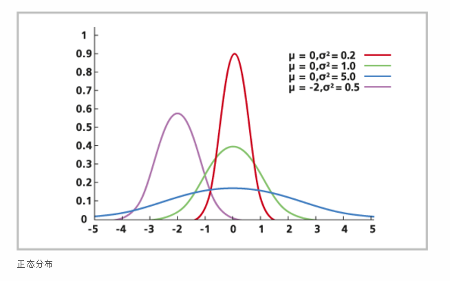
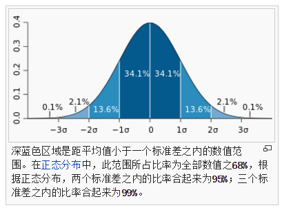
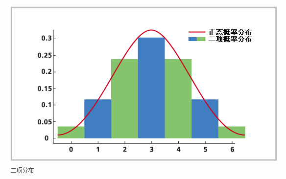
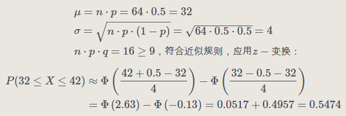
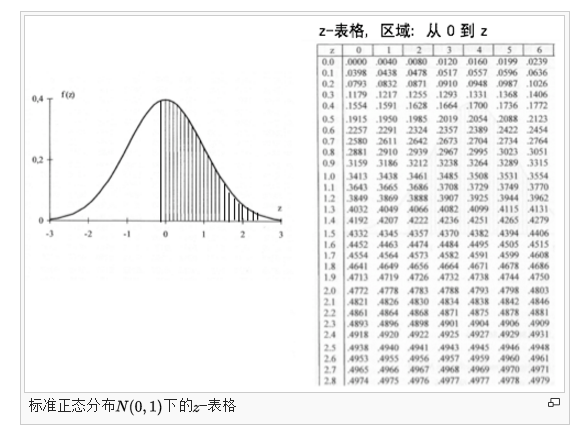
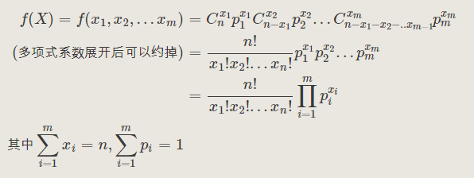
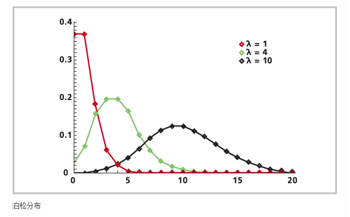
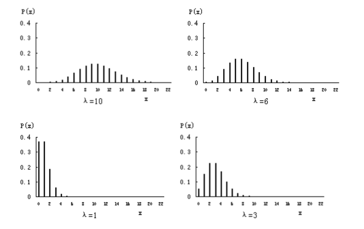
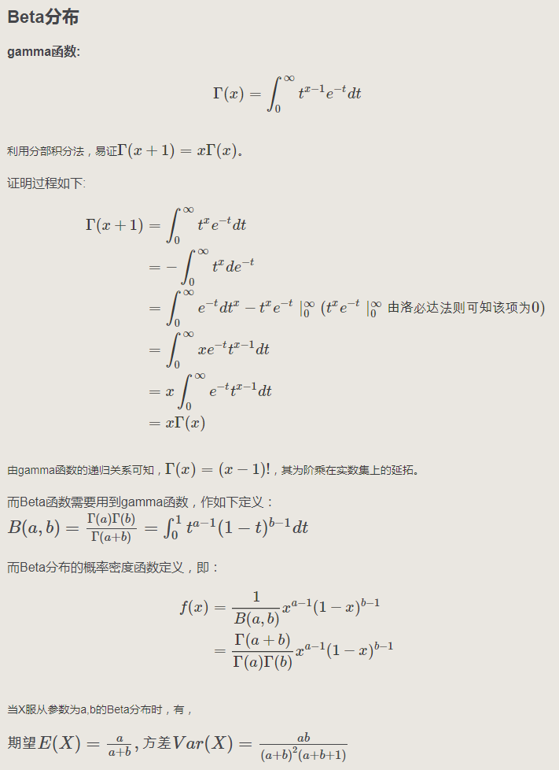
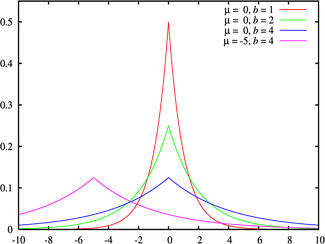

# 数据分布

## 1. 正态分布（高斯分布）

正态分布（Normal distribution）又名高斯分布（Gaussiandistribution），若随机变量 X 服从一个数学期望为`μ`、方差为 `σ^2`的高斯分布，记为 `N(μ，σ^2)`。

其概率密度函数为正态分布的期望值 `μ` 决定了其分布位置，其标准差 `σ` 决定了分布的幅度。

我们通常所说的标准正态分布是 `μ = 0,σ = 1` 的正态分布。

**正态分布**的[概率密度函数](http://zh.wikipedia.org/wiki/%E6%A6%82%E7%8E%87%E5%AF%86%E5%BA%A6%E5%87%BD%E6%95%B0)均值为μ [方差](http://zh.wikipedia.org/wiki/%E6%96%B9%E5%B7%AE)为σ2 (或[标准差](http://zh.wikipedia.org/wiki/%E6%A8%99%E6%BA%96%E5%B7%AE)σ)是[高斯函数](http://zh.wikipedia.org/wiki/%E9%AB%98%E6%96%AF%E5%87%BD%E6%95%B8)的一个实例：

当 `μ=0，σ=1` 时，正态分布就成为标准正态分布 `N（0，1)` 。概率密度函数为：

正态分布的密度函数的特点是：关于 `μ` 对称，并在 `μ` 处取最大值，在正（负）无穷远处取值为 0，在 `μ±σ` 处有拐点，形状呈现中间高两边低，图像是一条位于 x 轴上方的钟形曲线。

以上摘自：https://blog.csdn.net/zhaozhn5/article/details/78336366

概述：量存在正态分布，比如同一个人测量一件物品长度的误差、比如相同环境下同一种族的身高分布。

---

某一地区的人群生长环境相似，我们随机选 20 个男性，量出他们的身高，近似地服从正态分布。

正态分布，即高斯分布，是自然界最常见的数据分布了。 

用均值（数学期望）、标准差来确定一个正态分布概率密度图。比如 `N(-2,0.5)`，就是均值为 `-2`，标准差为 `0.5` 的正态分布。而 `N(0,1)` 称为标准正态分布。 

### 1.1 中心极限定理

通常，由于总体过大，我们以样本为研究对象，并用样本的统计量估算总体的统计量。 

比如，我们根据样本均值，估算出总体均值。 

我们从总体中 100 取出多个样本，每个样本 10 条数据，取每个样本的均值，得到 100 个样本均值。当样本均值够多时，就会发现这些样本均值服务正态分布。取这个样本均值的正态分布的均值，理论上最接近总体均值了。这就是大数定理，即，中心极限定理。

### 1.2 抽样分布

上面提到的样本均值，算是一种样本统计量。 

就是说，当我们在一个数据集中抽出多个样本时，这些样本的样本统计量会服从固定的抽样分布。 

这样，我们只要看抽样分布与假定的总体分布差距大小，就知道总体分布的情况了。 

常见的三大抽样分布：卡方分布、t分布、F分布，都是基于正态分布导出的，用来检验正态总体。

### 1.3 卡方分布

结论：卡方检验在很多课本中被认为是非参数检验的一员，但从分布假设来说，他属于参数检验。卡方分布（x2）是K个服从 正太分布的随机变量的平方和所服从分布。其参数只有自由度一个，当自由度很大时，X2近似服从正太分布。

### 1.4 t 分布

结论：t 分布并不是仅仅用于小样本（虽然小样本中用的风生水起）中，大样本依旧可以使用。t 分布与正太分布相比多了自由度参数，在小样本中，能够更好的剔除异常值对于小样本的影响，从而能够准确的抓住数据的集中趋势和离散趋势。

### 1.5 F 分布

结论：F 分布是两个服从卡方分布的随机变量各自除以他们的自由度的商。

> [正态分布/卡方分布/F分布/T分布](https://blog.csdn.net/zhaozhn5/article/details/78336366) - CSDN
>
> [F分布、t分布、正太分布与卡方分布的联系与区别](https://zhuanlan.zhihu.com/p/42136925) - 知乎
>
> [连续分布——正态分布、卡方分布、t分布、F分布](https://blog.csdn.net/a345017062/article/details/52621586) - CSDN

## 2. 伯努利分布 Bernoulli

伯努利分布又名二点分布，0-1分布。

首先介绍伯努利实验。只有两种可能结果的单次随机实验叫做伯努利实验，即可以用是与否来概括实验结果。如果独立重复 n 次伯努利实验，则称之为 n 重伯努利实验。

若进行一次伯努利实验，且 `P(X=1)=p,P(X=0)=1−p`，那么称随机变量 X 服从伯努利分布。

伯努利分布的概率密度函数为：

## 3. 二项式分布 Binomial

二项分布可基于对一系列潜在事件实际发生情况的观测对事件的发生次数建模。例如，二项分布可用于采集在临床研究中死于心脏病的人数、拥挤电梯中在第二层走出电梯的人数，或是某动物种群中携带特定遗传性状的动物数量。

**二项分布描述的是发生次数，而不是量值。它可以对完成比赛的参赛者数量建模，但不能对参赛者的速度建模。**
二项分布的公式如下：

其中：

- `n` 是观测值数量。
- `p` 是发生概率。
- `x` 是成功次数（从 0 到 n）。

使用二项分布的一个常见例子是，在抛掷硬币 10 次 (n = 10) 的情况下判断硬币正面朝上的次数概率。可能出现的情况是，10 次中有 0 次正面朝上、10 次中有 1 次正面朝上，以此类推；因此，x = 0、1、2、3、4、5、6、7、8、9、10。p 是每个 x 的概率。

所有试验都是相互独立的，并且每个试验只有成功和失败这两种结果。

如果 n 值较大且 p 值较小，则二项分布接近泊松分布。这种情况下使用泊松分布会更加简便。

二项分布将返回代表 n 次试验中成功次数的随机变量，其中每次试验的成功概率为 p（例如，硬币正面朝上的概率为 p）。

在离散分布中如果试验次数n值非常大，而且单次试验的概率p值又不是很小的情况下，正态分布可以用来近似的代替二项分布。一个粗略的使用正态分布的近似规则是：

从二项分布中获得 ：

> 期望值： `μ=np`
>
> 方差： `σ²=np(1-p)`

如果 `σ>3`，则必须采用下面的近似修正方法：

**注：q=1-p，EF:二项分布； ZF:正态分布**

上（下）临界值分别增加（减少）修正值0.5的目的是在 `σ` 值很大时获得更精确的近似值，只有 `σ` 很小时，修正值0.5可以不被考虑。

例如，随机试验为连续 64 次掷硬币，获得的国徽数位于 32 和 42 之间的概率是多少？用正态分布计算如下，

在运用 z- 表格时注意到利用密度函数的对称性来求出 z 为负值时的区域面积。

---

二项分布是 n 重伯努利实验成功次数所服从的离散概率分布。

假设 n 重伯努利实验的成功次数为 X, 成功的概率为 p，那么我们称 `X～B(n,p)`。

二项分布的概率密度函数是： 

则伯努利分布是二项分布的一种特殊表现形式，即 `n=1`。

经典案例是掷硬币，即硬币正面朝上的概率为 p，那么掷 n 次硬币，正面朝上的次数服从二项分布。

## 4. 多项式分布 Multinomial

多项式分布是二项分布的推广，仍然是进行n次独立实验，但是每次实验的结果不再只有两种，而是可以有m种。这m种结果彼此互斥，且发生的概率之和为1。 
多项式分布的概率密度函数是： 

经典案例是掷骰子，骰子的每个面朝上的概率分别为 `{p1,p2,...,p6}`，特别的，这些概率值并不需要相等，只要每个面朝上这个事件彼此独立的就可以了，比如掷一个不规则的骰子。

## 5. 泊松分布 Poisson

泊松分布是一种离散型概率分布。泊松分布适合在给定一个**已知平均值**的情况下对**固定时间步长内**事件的发生次数概率进行建模。这些事件与它们最后一次发生的状态无关。X 轴上是 0、1、2、3、4（以此类推）等事件的离散值（通常表示事件的发生次数），Y 轴上是现象的发生概率（通常是给定一个已知平均值）。这些事件可以是十字路口的事故发生次数、出生缺陷数量或一平方公里内驼鹿的数量。泊松分布可以**对小概率事件**进行建模。这种分布有时也被称为**小数定律 (Law of small numbers)**，因为事件不经常发生，但仍有很多机会让它发生。

泊松分布的公式如下：

其中：

- `e` 是自然对数的底。
- `x` 是事件的可能发生次数（正整数）。
- `λ`（即，平均值）是一个正数，代表指定区间内事件的预期发生次数。如果事件在 1 小时内（60 分钟）每 10 分钟发生一次，则 `λ` 为 6。

泊松分布与二项分布类似，但**泊松分布是在不知道事件的可能发生总次数的情况下对小概率事件建模**。泊松分布的建模对象是十字路口的事故发生次数，而二项分布的建模对象是事故发生次数与经由十字路口的汽车数量之间的相对关系。

> 期望值：`λ`（即，平均值）
>
> 方差：方差 `σ²` 与均数 `λ` 相等，即 `σ²=λ`

### 5.1 Poisson 分布的性质

- Poisson 分布是一种单参数的离散型分布，其参数为 `λ`，它表示单位时间或空间内某事件平均发生的次数，又称强度参数。
- Poisson 分布的方差 `σ²` 与均数 `λ` 相等，即 `σ²=λ`
- Poisson 分布是非对称性的，在 `λ` 不大时呈偏态分布，随着 `λ` 的增大，迅速接近正态分布。一般来说，当 `λ=20` 时，可以认为近似正态分布，Poisson 分布资料可按正态分布处理。
- Poisson 分布的累计概率常用的有左侧累计和右侧累计两种。单位时间或空间内事件发生的次数。

### 5.2 Poisson 对应不同λ的分布图

分布当总体均数值小于 5 时为偏峰，愈小分布愈偏，随着增大，分布趋向对称。

---

在统计学上，只要某类事件满足三个条件，它就服从"泊松分布"。

三个条件分别是：

- 事件 X 的发生是小概率事件。
- 事件 X 的发生是随机而且互相独立的。
- 事件 X 发生的概率相对稳定。

泊松分布的公式如下：

各个参数的含义：单位时间(或单位面积)内随机事件的平均发生率；k 事件 X 发生的频数；`P（X=k）` 事件 X 发生 k 次的概率。

泊松分布与二项分布的关系：

- 当二项分布的 n 很大而 p 很小时，泊松分布可作为二项分布的近似，其中 `λ` 为 `np`。通常当 `n≧20,p≦0.05` 时，就可以用泊松公式近似得计算。事实上，泊松分布也是由二项分布推导而来。

应用实例：http://www.ruanyifeng.com/blog/2013/01/poisson_distribution.html

泊松分布的期望为 `E(X)=λ`，方差 `D(X)=λ`。

## 6. 指数分布

## 7. Beta 分布

## 8. Dirichlet 分布

## 9. 拉普拉斯分布

在[概率论](https://thebetterwiki.com/zh/%E6%A6%82%E7%8E%87%E8%AE%BA)与[统计学](https://thebetterwiki.com/zh/%E7%BB%9F%E8%AE%A1%E5%AD%A6)中，**拉普拉斯分布**(Laplace distribution)是以[皮埃尔-西蒙·拉普拉斯](https://thebetterwiki.com/zh/%E7%9A%AE%E5%9F%83%E5%B0%94-%E8%A5%BF%E8%92%99%C2%B7%E6%8B%89%E6%99%AE%E6%8B%89%E6%96%AF)的名字命名的一种连续[概率分布](https://thebetterwiki.com/zh/%E6%A6%82%E7%8E%87%E5%88%86%E5%B8%83)。由于它可以看作是两个不同位置的[指数分布](https://thebetterwiki.com/zh/%E6%8C%87%E6%95%B0%E5%88%86%E5%B8%83)背靠背拼接在一起，所以它也叫作**双指数分布**。两个相互独立同概率分布指数[随机变量](https://thebetterwiki.com/zh/%E9%9A%8F%E6%9C%BA%E5%8F%98%E9%87%8F)之间的差别是按照指数分布的随机时间[布朗运动](https://thebetterwiki.com/zh/%E5%B8%83%E6%9C%97%E8%BF%90%E5%8A%A8)，所以它遵循拉普拉斯分布。

**概率分布、概率密度以及分位数函数**

如果随机变量的[概率密度函数](https://thebetterwiki.com/zh/%E6%A6%82%E7%8E%87%E5%AF%86%E5%BA%A6%E5%87%BD%E6%95%B0)分布为：

<a href="https://www.codecogs.com/eqnedit.php?latex=\begin{align*}&space;f(x|\mu&space;,b)&space;&=&space;\frac{1}{2b}exp\left&space;(&space;-&space;\frac{|x&space;-&space;\mu|}{b}&space;\right&space;)&space;\\&space;&=&space;\frac{1}{2b}\left\{\begin{matrix}&space;exp\left&space;(&space;-&space;\frac{\mu&space;-&space;x}{b}&space;\right&space;)&space;\hspace{0.5cm}&space;if&space;\&space;x&space;<&space;\mu&space;&&space;\\&space;\\&space;exp\left&space;(&space;-&space;\frac{x&space;-&space;\mu}{b}&space;\right&space;)&space;\hspace{0.5cm}&space;if&space;\&space;x&space;\geq&space;\mu&space;&&space;\end{matrix}\right.&space;\end{align*}" target="_blank"></a>

那么它就是拉普拉斯分布。其中，`μ` 是位置参数，`b > 0` 是尺度参数。如果 `μ = 0`，那么，正半部分恰好是尺度为 1/2 的指数分布。

拉普拉斯分布的概率密度函数让我们联想到[正态分布](https://thebetterwiki.com/zh/%E6%AD%A3%E6%80%81%E5%88%86%E5%B8%83)，但是，**正态分布**是用相对于 `μ` **平均值的差的平方**来表示，而**拉普拉斯概率密度**用相对于**平均值的差的绝对值**来表示。因此，拉普拉斯分布的尾部比正态分布更加平坦。

> [拉普拉斯分布（Laplace distribution）](https://www.cnblogs.com/yifdu25/p/8146446.html)

## 10. 二项分布、泊松分布、正态分布关系

1）泊松分布，二项分布都是离散分布；正态分布是连续分布

2）二项分布什么时候趋近于泊松分布，什么时候趋近于正态分布？

这么说吧：二项分布有两个参数，一个 n 表示试验次数，一个 p 表示一次试验成功概率。

现在考虑一列二项分布，其中试验次数 n 无限增加，而 p 是 n 的函数。

如果 np 存在有限极限 λ，则这列二项分布就趋于参数为 λ 的 泊松分布。反之，如果 np 趋于无限大（如 p 是一个定值），则根据德莫佛-拉普拉斯(De’Moivre-Laplace)中心极限定理，这列二项分布将趋近于正态分布。

3）实际运用中当 n 很大时一般都用正态分布来近似计算二项分布，但是如果同时 np 又比较小（比起n来说很小），那么用泊松分布近似计算更简单些，毕竟泊松分布跟二项分布一样都是离散型分布。

> [二项分布、泊松分布、正态分布的关系](http://hongyitong.github.io/2016/11/13/%E4%BA%8C%E9%A1%B9%E5%88%86%E5%B8%83%E3%80%81%E6%B3%8A%E6%9D%BE%E5%88%86%E5%B8%83%E3%80%81%E6%AD%A3%E6%80%81%E5%88%86%E5%B8%83/)

---

---

# 参数估计

> [机器学习必知概念：贝叶斯估计、最大似然估计、最大后验估计](https://juejin.im/post/5b3a302d518825623675ec1a) - 掘金
>
> [贝叶斯估计、最大似然估计、最大后验概率估计](http://noahsnail.com/2018/05/17/2018-05-17-%E8%B4%9D%E5%8F%B6%E6%96%AF%E4%BC%B0%E8%AE%A1%E3%80%81%E6%9C%80%E5%A4%A7%E4%BC%BC%E7%84%B6%E4%BC%B0%E8%AE%A1%E3%80%81%E6%9C%80%E5%A4%A7%E5%90%8E%E9%AA%8C%E6%A6%82%E7%8E%87%E4%BC%B0%E8%AE%A1/)
>
> [从最大似然估计开始，你需要打下的机器学习基石](https://www.jiqizhixin.com/articles/2018-01-09-6) - 机器之心
>
> [基础：常见的参数估计方法](https://www.jianshu.com/p/f4ea000892ca) - 简书
>
> [统计学（四）：几种常见的参数估计方法](https://blog.csdn.net/ch1209498273/article/details/78313859) - CSDN
>
> [数学基础（二）——参数估计与矩阵运算基础](https://blog.csdn.net/qq_41010142/article/details/79959153) - CSDN
>
> [机器学习的数学基础：矩阵篇](http://www.hahack.com/math/math-matrix/) 
>
>

参数估计有点估计(point estimation)和区间估计(interval estimation)两种。

**点估计：**

点估计是依据样本估计总体分布中所含的未知参数或未知参数的函数。通常它们是总体的某个特征值，如数学期望、方差和相关系数等。点估计问题就是要构造一个只依赖于样本的量，作为未知参数或未知参数的函数的估计值。

例如，设一批产品的废品率为 `θ`。为估计 `θ`，从这批产品中随机地抽出 n 个作检查，以 X 记其中的废品个数，用 `X/n` 估计 `θ`，这就是一个点估计。

构造点估计常用的方法是：

- **矩估计法**。用样本矩估计总体矩，如用样本均值估计总体均值。
- **最大似然估计法**。于1912年由英国统计学家R.A.费希尔提出，用来求一个样本集的相关概率密度函数的参数。（在以后的文章中专门讨论）
- **最小二乘法**。主要用于线性统计模型中的参数估计问题。
- **贝叶斯估计法**。基于贝叶斯学派(见贝叶斯统计)的观点而提出的估计法。

可以用来估计未知参数的估计量很多，于是产生了怎样选择一个优良估计量的问题。首先必须对优良性定出准则，这种准则是不唯一的，可以根据实际问题和理论研究的方便进行选择。

优良性准则有两大类：

- 一类是小样本准则，即在样本大小固定时的优良性准则；
- 另一类是大样本准则，即在样本大小趋于无穷时的优良性准则。

最重要的小样本优良性准则是无偏性及与此相关的一致最小方差无偏估计，其次有容许性准则，最小化最大准则，最优同变准则等。大样本优良性准则有相合性、最优渐近正态估计和渐近有效估计等。

**区间估计：**

区间估计是依据抽取的样本，根据一定的正确度与精确度的要求，构造出适当的区间，作为总体分布的未知参数或参数的函数的真值所在范围的估计。例如人们常说的有百分之多少的把握保证某值在某个范围内，即是区间估计的最简单的应用。

1934年统计学家 J.奈曼创立了一种严格的区间估计理论。

求置信区间常用的三种方法：

- 利用已知的抽样分布。
- 利用区间估计与假设检验的联系。（请参考几种常见的参数估计）
- 利用大样本理论。

## 1. 矩阵估计

## 2. 最小二乘估计 OLS

> [最小二乘法线性回归：矩阵视角](https://zhuanlan.zhihu.com/p/33899560) - 知乎
>
> [最小二乘法的本质是什么？](https://www.zhihu.com/question/37031188) - 知乎
>
> [最大似然估计和最小二乘估计的区别与联系](https://blog.csdn.net/xidianzhimeng/article/details/20847289) - CSDN

## 3. 贝叶斯估计

使用贝叶斯估计计算参数比较困难，所以简化为最大后验估计。 

## 4. 最大似然估计 MLE

> [从最大似然估计开始，你需要打下的机器学习基石](https://www.jiqizhixin.com/articles/2018-01-09-6) - 机器之心
>
> [极大似然估计详解](https://blog.csdn.net/zengxiantao1994/article/details/72787849) - CSDN
>
> [最大似然估计法（MLE）](https://blog.csdn.net/ziyuzhao123/article/details/25327815) - CSDN
>
> [极大似然估计详解](https://blog.csdn.net/zengxiantao1994/article/details/72787849) - CSDN
>
> [如何通俗地理解“最大似然估计法”?](https://www.matongxue.com/madocs/447.html) - 马同学高等数学

### 4.1 正态分布估计

### 4.2  泊松分布估计

### 4.3 均分分布估计

## 5. 最大后验估计 MAP

