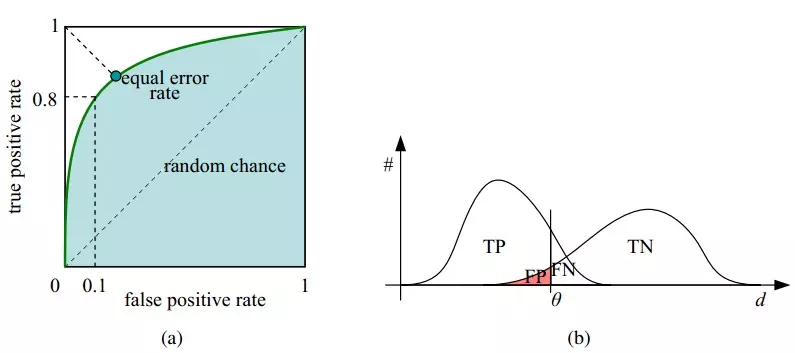
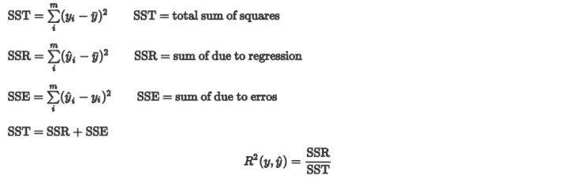

# 一、机器学习

## 1. 方差与偏差

- **偏差**与**方差**分别是用于衡量一个模型**泛化误差**的两个方面；
  - 模型的**偏差**，指的是模型预测的**期望值**与**真实值**之间的差；
  - 模型的**方差**，指的是模型预测的**期望值**与**预测值**之间的差平方和；

- 在**监督学习**中，模型的**泛化误差**可**分解**为偏差、方差与噪声之和。

  <div align="center"><a href="https://www.codecogs.com/eqnedit.php?latex=Err(x)&space;=&space;Bias^2&space;&plus;&space;Variance&space;&plus;&space;Noise" target="_blank"></a></div>

- **偏差**用于描述模型的**拟合能力**
  **方差**用于描述模型的**稳定性**


- 偏差：`Bias`反映的是模型在样本上的输出与真实值之间的误差，即模型本身的精准度，即算法本身的拟合能力
- 方差：`Variance`反映的是模型每一次输出结果与模型输出期望之间的误差，即模型的稳定性。反应预测的波动情况。
- 误差：`Err(x)` 也叫泛化误差
- 欠拟合会出现高偏差问题
- 过拟合会出现高方差问题

### 1.1 导致偏差和方差的原因

- 偏差通常是由于我们对学习算法做了错误的假设，或者模型的复杂度不够；
  - 比如真实模型是一个二次函数，而我们假设模型为一次函数，这就会导致偏差的增大（欠拟合）；
  - **由偏差引起的误差**通常在**训练误差**上就能体现，或者说训练误差主要是由偏差造成的
- 方差通常是由于模型的复杂度相对于训练集过高导致的；
  - 比如真实模型是一个简单的二次函数，而我们假设模型是一个高次函数，这就会导致方差的增大（过拟合）；
  - **由方差引起的误差**通常体现在测试误差相对训练误差的**增量**上。

### 1.2 深度学习中的偏差与方差

- 神经网络的拟合能力非常强，因此它的**训练误差**（偏差）通常较小；
- 但是过强的拟合能力会导致较大的方差，使模型的测试误差（**泛化误差**）增大；
- 因此深度学习的核心工作之一就是研究如何降低模型的泛化误差，这类方法统称为**正则化方法**。

### 1.3 偏差与方差的计算公式

- 记在**训练集 D** 上学得的模型为

  <div align="center"><a href="https://www.codecogs.com/eqnedit.php?latex=f(x;D)" target="_blank"></a></div>

  模型的**期望预测**为

  <div align="center"><a href="https://www.codecogs.com/eqnedit.php?latex=\hat&space;f(x)&space;=&space;\Bbb&space;E_{D}[f(x;&space;D)]" target="_blank"></a></div>

- **偏差**（Bias）

  <div align="center"><a href="https://www.codecogs.com/eqnedit.php?latex=bias^2(x)&space;=&space;(\hat&space;f(x)&space;-&space;y)^2" target="_blank"></a></div>

  > **偏差**度量了学习算法的期望预测与真实结果的偏离程度，即刻画了学习算法本身的拟合能力；

- **方差**（Variance）

  <div align="center"><a href="https://www.codecogs.com/eqnedit.php?latex=var(x)&space;=&space;\Bbb&space;E_{D}[(f(x;&space;D)&space;-&space;\hat&space;f(x))^2]" target="_blank"></a></div>

  > **方差**度量了同样大小的**训练集的变动**所导致的学习性能的变化，即刻画了数据扰动所造成的影响（模型的稳定性）；

- **噪声**则表达了在当前任务上任何学习算法所能达到的期望泛化误差的下界，即刻画了学习问题本身的难度。
- “**偏差-方差分解**”表明模型的泛化能力是由算法的能力、数据的充分性、任务本身的难度共同决定的。

### 1.4 避免过拟合和欠拟合

**避免欠拟合（刻画不够）**

- 寻找更好的特征-----具有代表性的
- 用更多的特征-----增大输入向量的维度

**避免过拟合（刻画太细，泛化太差）**

- 增大数据集合-----使用更多的数据，噪声点比重减少
- 减少数据特征-----减小数据维度，高维空间密度小
- 正则化方法-----即在对模型的目标函数（objective function）或代价函数（cost function）加上正则项
- 交叉验证方法

### 1.5 偏差与方差的权衡（过拟合与模型复杂度的权衡）

- 给定学习任务，

  - 当训练不足时，模型的**拟合能力不够**（数据的扰动不足以使模型产生显著的变化），此时**偏差**主导模型的泛化误差；
  - 随着训练的进行，模型的**拟合能力增强**（模型能够学习数据发生的扰动），此时**方差**逐渐主导模型的泛化误差；
  - 当训练充足后，模型的**拟合能力过强**（数据的轻微扰动都会导致模型产生显著的变化），此时即发生**过拟合**（训练数据自身的、非全局的特征也被模型学习了）

- 偏差和方差的关系和**模型容量**（模型复杂度）、**欠拟合**和**过拟合**的概念紧密相联

  

  - 当模型的容量增大（x 轴）时， 偏差（用点表示）随之减小，而方差（虚线）随之增大
  - 沿着 x 轴存在**最佳容量**，**小于最佳容量会呈现欠拟合**，**大于最佳容量会导致过拟合**。

  > 《深度学习》 5.4.4 权衡偏差和方差以最小化均方误差

## 2. 生成模型与判别模型

- 监督学习的任务是学习一个模型，对给定的输入预测相应的输出

- 这个模型的一般形式为一个**决策函数**或一个**条件概率分布**（后验概率）：

  <div align="center"><a href="https://www.codecogs.com/eqnedit.php?latex=Y&space;=&space;f(X)&space;or&space;P(Y|X)" target="_blank"></a></div>

  - **决策函数**：输入 X 返回 Y；其中 Y 与一个**阈值**比较，然后根据比较结果判定 X 的类别
  - **条件概率分布**：输入 X 返回 **X 属于每个类别的概率**；将其中概率最大的作为 X 所属的类别

- 监督学习模型可分为**生成模型**与**判别模型**

  - 判别模型直接学习决策函数或者条件概率分布

    - 直观来说，**判别模型**学习的是类别之间的最优分隔面，反映的是不同类数据之间的差异

  - 生成模型学习的是联合概率分布`P(X,Y)`，然后根据条件概率公式计算`P(Y|X)`

    <div align="center"><a href="https://www.codecogs.com/eqnedit.php?latex=P(Y|X)&space;=&space;\frac{P(X,Y)}{P(X)}" target="_blank"></a></div>

**两者之间的联系**

- 由生成模型可以得到判别模型，但由判别模型得不到生成模型。

- 当存在“隐变量”时，只能使用生成模型

  > 隐变量：当我们找不到引起某一现象的原因时，就把这个在起作用，但无法确定的因素，叫“隐变量”

**优缺点**

- 判别模型
  - 优点
    - 直接面对预测，往往学习的准确率更高
    - 由于直接学习 `P(Y|X)` 或 `f(X)`，可以对数据进行各种程度的抽象，定义特征并使用特征，以简化学习过程
  - 缺点
    - 不能反映训练数据本身的特性
    - ...
- 生成模型
  - 优点
    - 可以还原出联合概率分布 `P(X,Y)`，判别方法不能
    - 学习收敛速度更快——即当样本容量增加时，学到的模型可以更快地收敛到真实模型
    - 当存在“隐变量”时，只能使用生成模型
  - 缺点
    - 学习和计算过程比较复杂

**常见模型**

- 判别模型
  - K 近邻、感知机（神经网络）、决策树、逻辑斯蒂回归、**最大熵模型**、SVM、提升方法、**条件随机场**
- 生成模型
  - 朴素贝叶斯、隐马尔可夫模型、混合高斯模型、贝叶斯网络、马尔可夫随机场

## 3. 先验概率与后验概率

> [先验概率，后验概率，似然概率，条件概率，贝叶斯，最大似然](https://blog.csdn.net/suranxu007/article/details/50326873) - CSDN博客

**条件概率**（似然概率）

- 一个事件发生后另一个事件发生的概率。
- 一般的形式为 `P(X|Y)`，表示 y 发生的条件下 x 发生的概率。
- 有时为了区分一般意义上的**条件概率**，也称**似然概率**

**先验概率**

- 事件发生前的预判概率
- 可以是基于历史数据的统计，可以由背景常识得出，也可以是人的主观观点给出。
- 一般都是**单独事件**发生的概率，如 `P(A)`、`P(B)`。

**后验概率**

- 基于先验概率求得的**反向条件概率**，形式上与条件概率相同（若 `P(X|Y)` 为正向，则 `P(Y|X)` 为反向）

**贝叶斯公式**

<div align="center"><a href="https://www.codecogs.com/eqnedit.php?latex=P(Y|X)&space;=&space;\frac{P(X|Y)&space;*&space;P(Y)}{P(X)}" target="_blank"></a></div>

**最大似然理论：**

认为`P(x|y)`最大的类别`y`，就是当前文档所属类别。即`Max P(x|y) = Max p(x1|y)*p(x2|y)*...p(xn|y), for all y`

**贝叶斯理论：**

认为需要增加先验概率`p(y)`，因为有可能某个`y`是很稀有的类别几千年才看见一次，即使`P(x|y)`很高，也很可能不是它。

所以`y = Max P(x|y) * P(y)`,其中`p(y)`一般是数据集里统计出来的。

## 4. 超参数选择

> [超参数的选择与交叉验证](https://blog.csdn.net/u013709270/article/details/75212750) - CSDN博客
>
> [十、如何选择神经网络的超参数](https://blog.csdn.net/dugudaibo/article/details/77366245) - CSDN博客

**Grid Search**

- 网格搜索
- 在高维空间中对一定区域进行遍历

**Random Search**

- 在高维空间中随机选择若干超参数

### 4.1 超参数有哪些
与超参数对应的是参数。参数是可以在模型中通过BP（反向传播）进行更新学习的参数，例如各种权值矩阵，偏移量等等。超参数是需要进行程序员自己选择的参数，无法学习获得。 

常见的超参数有模型（SVM，Softmax，Multi-layer Neural Network,…)，迭代算法（Adam,SGD,…)，学习率（learning rate)(不同的迭代算法还有各种不同的超参数，如beta1,beta2等等，但常见的做法是使用默认值，不进行调参）,正则化方程的选择(L0,L1,L2)，正则化系数，dropout的概率等等。

### 4.2 确定调节范围

超参数的种类多，调节范围大，需要先进行简单的测试确定调参范围。

#### 4.2.1 模型
模型的选择很大程度上取决于具体的实际问题，但必须通过几项基本测试。 

首先，模型必须可以正常运行，即代码编写正确。可以通过第一个epoch的loss估计，即估算第一个epoch的loss，并与实际结果比较。**注意此过程需要设置正则项系数为0，因为正则项引入的loss难以估算**。 

其次，**模型必须可以对于小数据集过拟合，即得到loss接近于0，accuracy接近于1的模型**。否则应该尝试其他或者更复杂的模型。 

最后，**如果 val_acc 与 acc 相差很小，可能是因为模型复杂度不够，需要尝试更为复杂的模型。**

#### 4.2.2 学习率

- loss 基本不变：学习率过低 

- loss 震动明显或者溢出：学习率过高 

根据以上两条原则，可以得到学习率的大致范围。

#### 4.2.3 正则项系数

- val_acc 与 acc 相差较大：正则项系数过小 
- loss 逐渐增大：正则项系数过大 

根据以上两条原则，可以得到正则项系数的大致范围。

### 4.3 交叉验证

对于训练集再次进行切分，得到训练集以及验证集。通过训练集训练得到的模型，在验证集验证，从而确定超参数。（选取在验证集结果最好的超参数） 

交叉验证的具体实例详见CS231n作业笔记1.7：基于特征的图像分类之调参和CS231n作业笔记1.2: KNN的交叉验证。

#### 4.3.1 先粗调，再细调

先通过数量少，间距大的粗调确定细调的大致范围。然后在小范围内部进行间距小，数量大的细调。

#### 4.3.2 尝试在对数空间内进行调节

即在对数空间内部随机生成测试参数，而不是在原空间生成，通常用于学习率以及正则项系数等的调节。出发点是该超参数的指数项对于模型的结果影响更显著；而同阶的数据之间即便原域相差较大，对于模型结果的影响反而不如不同阶的数据差距大。

#### 4.3.3. 随机搜索参数值，而不是格点搜索


通过随机搜索，可以更好的发现趋势。图中所示的是通过随机搜索可以发现数据在某一维上的变化更加明显，得到明显的趋势。

### 4.4 神经网路中的超参数

1. 学习率 `η`
2. 正则化参数 `λ`
3. 神经网络的层数 `L`
4. 每一个隐层中神经元的个数 `j`
5. 学习的回合数 `Epoch`
6. 小批量数据 `minibatch` 的大小
7. 输出神经元的编码方式
8. 代价函数的选择
9. 权重初始化的方法
10. 神经元激活函数的种类
11. 参加训练模型数据的规模

## 5. 余弦相似度（Cos距离）与欧氏距离的区别和联系

> [欧氏距离和余弦相似度的区别是什么？](https://www.zhihu.com/question/19640394) - 知乎

- 欧式距离和余弦相似度都能度量 2 个向量之间的相似度
- 放到向量空间中看，欧式距离衡量两点之间的**直线距离**，而余弦相似度计算的是两个向量之间的**夹角**
- **没有归一化时**，欧式距离的范围是 `(0, +∞]`，而余弦相似度的范围是` (0, 1]`；余弦距离是计算**相似程度**，而欧氏距离计算的是**相同程度**（对应值的相同程度）
- **归一化的情况下**，可以将空间想象成一个超球面（三维），欧氏距离就是球面上两点的直线距离，而向量余弦值等价于两点的球面距离，本质是一样。

## 6. 混淆矩阵、模型度量指标：准确率、精确率、召回率、F1 值、ROC、AUC等

> [机器学习之分类性能度量指标 : ROC曲线、AUC值、正确率、召回率](https://www.jianshu.com/p/c61ae11cc5f6) - 简书
>
> [分类 (Classification)：ROC 和曲线下面积](https://developers.google.com/machine-learning/crash-course/classification/roc-and-auc?hl=zh-cn)


### 6.1 分类评价指标

**混淆矩阵**

- True Positive(TP)：将正类预测为正类的数量.
- True Negative(TN)：将负类预测为负类的数量.
- False Positive(FP)：将负类预测为正类数 → 误报 (Type I error).
- False Negative(FN)：将正类预测为负类数 → 漏报 (Type II error).


**准确率**（accuracy）

<div align="center"><a href="https://www.codecogs.com/eqnedit.php?latex=ACC&space;=&space;\frac{TP&space;&plus;&space;TN}{TP&space;&plus;&space;TN&space;&plus;&space;FP&space;&plus;&space;FN}" target="_blank"></a></div>

**精确率**（precision）【查准率】

<div align="center"><a href="https://www.codecogs.com/eqnedit.php?latex=P&space;=&space;\frac{TP}{TP&space;&plus;&space;FP}" target="_blank"></a></div>

> 准确率与精确率的区别：
>
> > 在正负样本不平衡的情况下，**准确率**这个评价指标有很大的缺陷。比如在互联网广告里面，点击的数量是很少的，一般只有千分之几，如果用acc，即使全部预测成负类（不点击）acc 也有 99% 以上，没有意义。

**召回率**（recall, sensitivity, true positive rate）【查全率】

<div align="center"><a href="https://www.codecogs.com/eqnedit.php?latex=R&space;=&space;\frac{TP}{TP&space;&plus;&space;FN}" target="_blank"></a></div>

**F1值**——精确率和召回率的调和均值

<div align="center"><a href="https://www.codecogs.com/eqnedit.php?latex=\frac{2}{F_{1}}&space;=&space;\frac{1}{P}&space;&plus;&space;\frac{1}{R}" target="_blank"></a></div>

<div align="center"><a href="https://www.codecogs.com/eqnedit.php?latex=F_{1}&space;=&space;\frac{2TP}{2TP&space;&plus;&space;FP&space;&plus;&space;FN}" target="_blank"></a></div>

> 只有当精确率和召回率都很高时，F1值才会高

**ROC**

**ROC曲线**：接收者操作特征曲线（[receiver operating characteristic curve](https://en.wikipedia.org/wiki/Receiver_operating_characteristic)），是反映敏感性和特异性连续变量的综合指标，roc曲线上每个点反映着对同一信号刺激的感受性。

对于分类器，或者说分类算法，评价指标主要有precision，recall，F-score等，以及这里要讨论的ROC和AUC。下图是一个ROC曲线的示例：


- 横坐标：**1-Specificity**，伪正类率(False positive rate， FPR)，**预测为正但实际为负**的样本占**所有负例样本**的比例；

- 纵坐标：**Sensitivity**，真正类率(True positive rate， TPR)，**预测为正且实际为正**的样本占**所有正例样本**的比例。

在一个二分类模型中，假设采用逻辑回归分类器，其给出针对每个实例为正类的概率，那么通过设定一个阈值如0.6，概率大于等于0.6的为正类，小于0.6的为负类。对应的就可以算出一组(FPR,TPR)，在平面中得到对应坐标点。随着阈值的逐渐减小，越来越多的实例被划分为正类，但是这些正类中同样也掺杂着真正的负实例，即TPR和FPR会同时增大。阈值最大时，对应坐标点为(0,0)，阈值最小时，对应坐标点(1,1)。

如下面这幅图，(a)图中实线为ROC曲线，线上每个点对应一个阈值。



(a) 理想情况下，TPR应该接近1，FPR应该接近0。ROC曲线上的每一个点对应于一个threshold，对于一个分类器，每个threshold下会有一个TPR和FPR。比如Threshold最大时，TP=FP=0，对应于原点；Threshold最小时，TN=FN=1，对应于右上角的点(1,1)。
(b) P和N得分不作为特征间距离d的一个函数，随着阈值theta增加，TP和FP都增加。

- 横轴FPR：1-TNR，1-Specificity，FPR越大，预测正类中实际负类越多。
- 纵轴TPR：Sensitivity(正类覆盖率)，TPR越大，预测正类中实际正类越多。
- 理想目标：TPR=1，FPR=0，即图中(0,1)点，故ROC曲线越靠拢(0,1)点，越偏离45度对角线越好，Sensitivity、Specificity越大效果越好。


**AUC**

AUC ([Area Under Curve](https://en.wikipedia.org/wiki/Receiver_operating_characteristic#Area_under_the_curve)) 被定义为**ROC曲线下的面积**，显然这个面积的数值**不会大于1**。又由于ROC曲线一般都处于 `y=x` 这条直线的上方，所以**AUC的取值范围一般在0.5和1之间**。

**使用AUC值作为评价标准是因为很多时候ROC曲线并不能清晰的说明哪个分类器的效果更好，而作为一个数值，对应AUC更大的分类器效果更好。**

AUC的计算有两种方式，**梯形法**和**ROC AUCH法**，都是以逼近法求近似值，具体见[wikipedia](https://en.wikipedia.org/wiki/Receiver_operating_characteristic#Area_under_the_curve)。

**AUC意味着什么**

那么AUC值的含义是什么呢？根据(Fawcett, 2006)，AUC的值的含义是：

> The AUC value is equivalent to the probability that a randomly chosen positive example is ranked higher than a randomly chosen negative example.

这句话有些绕，我尝试解释一下：首先AUC值是一个概率值，当你随机挑选一个正样本以及一个负样本，当前的分类算法根据计算得到的Score值将这个正样本排在负样本前面的概率就是AUC值。当然，**AUC值越大，当前的分类算法越有可能将正样本排在负样本前面，即能够更好的分类**。

从AUC判断分类器（预测模型）优劣的标准：

- AUC = 1，是完美分类器，采用这个预测模型时，存在至少一个阈值能得出完美预测。绝大多数预测的场合，不存在完美分类器。
- 0.5 < AUC < 1，优于随机猜测。这个分类器（模型）妥善设定阈值的话，能有预测价值。
- AUC = 0.5，跟随机猜测一样（例：丢铜板），模型没有预测价值。
- AUC < 0.5，比随机猜测还差；但只要总是反预测而行，就优于随机猜测。

三种AUC值示例：


简单说：**AUC值越大的分类器，正确率越高**。

**为什么使用ROC曲线**

既然已经这么多评价标准，为什么还要使用ROC和AUC呢？

因为ROC曲线有个很好的特性：**当测试集中的正负样本的分布变化的时候，ROC曲线能够保持不变**。在实际的数据集中经常会出现类不平衡（class imbalance）现象，即负样本比正样本多很多（或者相反），而且测试数据中的正负样本的分布也可能随着时间变化。

### 6.2 回归评价指标

> [机器学习评估指标](https://zhuanlan.zhihu.com/p/36305931) - 知乎
>
> [机器学习-浅谈模型评估的方法和指标](https://www.jianshu.com/p/498ea0d8017d) - 简书

**MAE（平均绝对误差）**

平均绝对误差MAE（Mean Absolute Error）又被称为 **L1范数损失**。(`n = m -1`)

<div align="center"><a href="https://www.codecogs.com/eqnedit.php?latex=MAE(y,\hat{y})&space;=&space;\frac{1}{m}\sum_{i=1}^{n}|y_i&space;-&space;\hat{y_i}|" target="_blank"></a></div>

MAE有哪些不足？

- MAE虽能较好衡量回归模型的好坏，**但是绝对值的存在导致函数不光滑，在某些点上不能求导**，可以考虑将绝对值改为残差的平方，这就是均方误差。

**MSE（均方误差）**

均方误差MSE（Mean Squared Error）又被称为 **L2范数损失 **。

<div align="center"><a href="https://www.codecogs.com/eqnedit.php?latex=MSE(y,\hat{y})&space;=&space;\frac{1}{m}\sum_{i=1}^{m}(y_i&space;-&space;\hat{y_i})^2" target="_blank"></a></div>

还有没有比MSE更合理一些的指标？

- 由于MSE与我们的目标变量的量纲不一致，**为了保证量纲一致性，我们需要对MSE进行开方 **。

**RMSE（均方根误差）**

<div align="center"><a href="https://www.codecogs.com/eqnedit.php?latex=RMSE(y,\hat{y})&space;=&space;\sqrt{\frac{1}{m}\sum_{i=1}^{m}(y_i&space;-&space;\hat{y_i})^2}" target="_blank"></a></div>

RMSE有没有不足的地方？有没有规范化（无量纲化的指标）？

- 上面的几种衡量标准的取值大小与具体的应用场景有关系，很难定义统一的规则来衡量模型的好坏。比如说利用机器学习算法预测上海的房价RMSE在2000元，我们是可以接受的，但是当四五线城市的房价RMSE为2000元，我们还可以接受吗？下面介绍的**决定系数就是一个无量纲化的指标**。

**R^2（决定系数）**

变量之所以有价值，就是因为变量是变化的。什么意思呢？比如说一组因变量为[0, 0, 0, 0, 0]，显然该因变量的结果是一个常数0，我们也没有必要建模对该因变量进行预测。假如一组的因变量为[1, 3, 7, 10, 12]，该因变量是变化的，也就是有变异，因此需要通过建立回归模型进行预测。这里的变异可以理解为一组数据的方差不为0。

**决定系数又称为`R^2 score`，反映因变量的全部变异能通过回归关系被自变量解释的比例。**



- 如果结果是0，就说明模型预测不能预测因变量。

- 如果结果是1。就说明是函数关系。 

- 如果结果是0-1之间的数，就是我们模型的好坏程度。 

化简上面的公式 ,分子就变成了我们的均方误差MSE，下面分母就变成了方差:


**以上评估指标有没有缺陷，如果有，该怎样改进？**

以上的评估指标是基于误差的均值对进行评估的，均值对异常点（outliers）较敏感，**如果样本中有一些异常值出现，会对以上指标的值有较大影响，即均值是非鲁棒的**。

### 6.3 解决评估指标鲁棒性问题

我们通常用以下两种方法解决评估指标的鲁棒性问题：

- 剔除异常值
- 设定一个相对误差 ，当该值超过一定的阈值时，则认为其是一个异常点，剔除这个异常点，将异常点剔除之 后。再计算平均误差来对模型进行评价。
- 使用误差的分位数来代替
- 如利用中位数来代替平均数。例如 MAPE:

<div align="center"><a href="https://www.codecogs.com/eqnedit.php?latex=MAPE&space;=&space;median(|y_i&space;-&space;\hat{y_i}|&space;/&space;y_i)" target="_blank"></a></div>

MAPE是一个相对误差的中位数，当然也可以使用别的分位数。

## 7. 如何处理数据中的缺失值

可以分为以下 2 种情况：

1. **缺失值较多**

   - 直接舍弃该列特征，否则可能会带来较大的噪声，从而对结果造成不良影响。

2. **缺失值较少**

   - 当缺失值较少（<10%）时，可以考虑对缺失值进行填充，以下是几种常用的填充策略：

   1. 用一个**异常值**填充（比如 0），将缺失值作为一个特征处理

      `data.fillna(0)`

   2. 用**均值**|**条件均值**填充

      > 如果数据是不平衡的，那么应该使用条件均值填充
      >
      > 所谓**条件均值**，指的是与缺失值所属标签相同的所有数据的均值

      `data.fillna(data.mean())`

   3. 用相邻数据填充

      ```
      # 用前一个数据填充
      data.fillna(method='pad')
      # 用后一个数据填充
      data.fillna(method='bfill') 
      ```

   4. 插值

      `data.interpolate()`

   5. 拟合

      > 简单来说，就是将缺失值也作为一个预测问题来处理：将数据分为正常数据和缺失数据，对有值的数据采用随机森林等方法拟合，然后对有缺失值的数据进行预测，用预测的值来填充。

## 8. 介绍一个完整的机器学习项目流程

1. **数学抽象**

   明确问题是进行机器学习的第一步。机器学习的训练过程通常都是一件非常耗时的事情，胡乱尝试时间成本是非常高的。

   这里的抽象成数学问题，指的是根据数据明确任务目标，是分类、还是回归，或者是聚类。

2. **数据获取**

   数据决定了机器学习结果的上限，而算法只是尽可能逼近这个上限。

   数据要有代表性，否则必然会过拟合。

   对于分类问题，数据偏斜不能过于严重（平衡），不同类别的数据数量不要有数个数量级的差距。

   对数据的量级要有一个评估，多少个样本，多少个特征，据此估算出内存需求。如果放不下就得考虑改进算法或者使用一些降维技巧，或者采用分布式计算。

3. **预处理与特征选择**

   良好的数据要能够提取出良好的特征才能真正发挥效力。

   预处理/数据清洗是很关键的步骤，往往能够使得算法的效果和性能得到显著提高。归一化、离散化、因子化、缺失值处理、去除共线性等，数据挖掘过程中很多时间就花在它们上面。这些工作简单可复制，收益稳定可预期，是机器学习的基础必备步骤。

   筛选出显著特征、摒弃非显著特征，需要机器学习工程师反复理解业务。这对很多结果有决定性的影响。特征选择好了，非常简单的算法也能得出良好、稳定的结果。这需要运用特征有效性分析的相关技术，如相关系数、卡方检验、平均互信息、条件熵、后验概率、逻辑回归权重等方法。

4. **模型训练与调优**

   直到这一步才用到我们上面说的算法进行训练。

   现在很多算法都能够封装成黑盒使用。但是真正考验水平的是调整这些算法的（超）参数，使得结果变得更加优良。这需要我们对算法的原理有深入的理解。理解越深入，就越能发现问题的症结，提出良好的调优方案。

5. **模型诊断**

   如何确定模型调优的方向与思路呢？这就需要对模型进行诊断的技术。

   过拟合、欠拟合 判断是模型诊断中至关重要的一步。常见的方法如交叉验证，绘制学习曲线等。过拟合的基本调优思路是增加数据量，降低模型复杂度。欠拟合的基本调优思路是提高特征数量和质量，增加模型复杂度。

   误差分析也是机器学习至关重要的步骤。通过观察误差样本，全面分析误差产生误差的原因:是参数的问题还是算法选择的问题，是特征的问题还是数据本身的问题......

   诊断后的模型需要进行调优，调优后的新模型需要重新进行诊断，这是一个反复迭代不断逼近的过程，需要不断地尝试， 进而达到最优状态。

6. **模型融合/集成**

   一般来说，模型融合后都能使得效果有一定提升。而且效果很好。

   工程上，主要提升算法准确度的方法是分别在模型的前端（特征清洗和预处理，不同的采样模式）与后端（模型融合）上下功夫。因为他们比较标准可复制，效果比较稳定。而直接调参的工作不会很多，毕竟大量数据训练起来太慢了，而且效果难以保证。

7. **上线运行**

   这一部分内容主要跟工程实现的相关性更大。工程上是结果导向，模型在线上运行的效果直接决定模型的成败。不单纯包括其准确程度、误差等情况，还包括其运行的速度(时间复杂度)、资源消耗程度（空间复杂度）、稳定性是否可接受。

   这些工作流程主要是工程实践上总结出的一些经验。并不是每个项目都包含完整的一个流程。这里的部分只是一个指导性的说明，只有多实践，多积累项目经验，才会有自己更深刻的认识。

## 9. 数据清洗与特征处理

> [数据清洗方法](./note/数据清洗方法)
>
> [机器学习中的数据清洗与特征处理综述](https://tech.meituan.com/machinelearning_data_feature_process.html) - 美团技术团队
>
> [【机器学习InAction系列】数据清洗与特征处理综述](https://cloud.tencent.com/developer/article/1057749) - 腾讯云


## 10. 关联规则挖掘的 3 个度量指标：支持度、置信度、提升度

**支持度**（Support）

- `X → Y `的支持度表示项集 `{X,Y} `在总项集中出现的概率

  <a href="https://www.codecogs.com/eqnedit.php?latex=Support(X&space;\rightarrow&space;Y)&space;=&space;\frac{P(X&space;\bigcup&space;Y)}{P(I)}&space;=&space;\frac{num(X&space;\bigcup&space;Y)}{num(I)}" target="_blank"></a>

- 其中，`I` 表示总事务集，`num()`表示事务集中特定项集出现的次数，`P(X)=num(X)/num(I)`

**置信度**（Confidence）

- `X → Y `的置信度表示在先决条件 `X` 发生的情况下，由规则 `X → Y` 推出 `Y` 的概率。

  <a href="https://www.codecogs.com/eqnedit.php?latex=Confidence(X&space;\rightarrow&space;Y)&space;=&space;P(Y|X)&space;=&space;\frac{P(X&space;\cup&space;Y)}{P(X)}&space;=&space;\frac{num(X&space;\cup&space;Y)}{num(X)}" target="_blank"></a>

**提升度**（Lift）

- `X → Y` 的提升度表示含有 `X` 的条件下，同时含有 `Y` 的概率，与 `Y` 总体发生的概率之比。

  <a href="https://www.codecogs.com/eqnedit.php?latex=\begin{align*}&space;Lift(X&space;\rightarrow&space;Y)&space;&=&space;\frac{P(Y|X)}{P(Y)}&space;=&space;\frac{Confidence(X&space;\rightarrow&space;Y)}{num(Y)&space;/&space;num(I)}&space;\\&space;&=&space;\frac{P(X&space;\cup&space;Y)}{P(X)P(Y)}&space;=&space;\frac{num(X&space;\cup&space;Y)num(I)}{num(X)num(Y)}&space;\end{align*}" target="_blank"></a>

### 10.1 规则的有效性：

- 满足最小支持度和最小置信度的规则，叫做“强关联规则”

  > 最小支持度和最小置信度是人工设置的阈值

- `Lift(X→Y) > 1` 的 X→Y 是有效的强关联规则

- `Lift(X→Y) <=1` 的 X→Y 是有效的强关联规则

- 特别地，`Lift(X→Y) = 1` 时，X 与 Y 相互独立。

### 10.2 **判断规则的有效性**

问题：已知有1000名顾客买年货，分为甲乙两组，每组各500人，其中甲组有500人买了茶叶，同时又有450人买了咖啡；乙组有450人买了咖啡，如表所示，请问“茶叶→咖啡”是一条有效的关联规则吗？

| 组次          | 买茶叶的人数 | 买咖啡的人数 |
| ------------- | ------------ | ------------ |
| 甲组（500人） | 500          | 450          |
| 乙组（500人） | 0            | 450          |

答：

- “茶叶→咖啡”的支持度：`Support(X→Y) = 450 / 1000 = 45%`
- “茶叶→咖啡”的置信度：`Confidence(X→Y) = 450 / 500 = 90%`
- “茶叶→咖啡”的提升度：`Lift(X→Y) = 90% / 90% = 1`

由于提升度 `Lift(X→Y) = 1`，表示 `X` 与 `Y` 相互独立。也就是说，是否购买咖啡，与是否购买茶叶无关联。规则“茶叶→咖啡”不成立，或者说几乎没有关联，虽然它的置信度高达90%，但它不是一条有效的关联规则。

## 11. 信息熵、KL 散度（相对熵）与交叉熵

什么是熵？

- 熵是为消除不确定性所需要获得的信息量

> 《深度学习》 3.13 信息论

信息论的基本想法是一个不太可能的事件居然发生了，要比一个非常可能的事件发生，能提供更多的信息。

该想法可描述为以下性质：

1. 非常可能发生的事件信息量要比较少，并且极端情况下，确保能够发生的事件应该没有信息量。
2. 比较不可能发生的事件具有更高的信息量。
3. 独立事件应具有增量的信息。例如，投掷的硬币两次正面朝上传递的信息量，应该是投掷一次硬币正面朝上的信息量的两倍。

### 11.1 自信息与信息熵

自信息（self-information）是一种量化以上性质的函数，定义一个事件 x 的自信息为：

<div align="center"></div>

> 当该对数的底数为 e 时，单位为奈特（nats，本书标准）；当以 2 为底数时，单位为比特（bit）或香农（shannons）

自信息只处理单个的输出。此时，用信息熵（Information-entropy）来对整个概率分布中的不确定性总量进行量化：

<div align="center"></div>

> 信息熵也称香农熵（Shannon entropy）
>
> 信息论中，记 `0log0 = 0`

### 11.2 相对熵（KL 散度）与交叉熵

P 对 Q 的 **KL散度**（Kullback-Leibler divergence）：

<div align="center"></div>

**KL 散度在信息论中度量的是那个直观量**：

在离散型变量的情况下， KL 散度衡量的是，当我们使用一种被设计成能够使得概率分布 Q 产生的消息的长度最小的编码，发送包含由概率分布 P 产生的符号的消息时，所需要的额外信息量。

**KL 散度的性质**：
- 非负；KL 散度为 0 当且仅当P 和 Q 在离散型变量的情况下是相同的分布，或者在连续型变量的情况下是“几乎处处”相同的
- 不对称；$D_p(q) != D_q(p)$

**交叉熵**（cross-entropy）：

<div align="center"></div>

> [信息量，信息熵，交叉熵，KL散度和互信息（信息增益）](https://blog.csdn.net/haolexiao/article/details/70142571) - CSDN博客

**交叉熵与 KL 散度的关系**：

<div align="center"></div>

**针对 Q 最小化交叉熵等价于最小化 P 对 Q 的 KL 散度**，因为 Q 并不参与被省略的那一项。

最大似然估计中，最小化 KL 散度其实就是在最小化分布之间的交叉熵。

> 《深度学习》 ch5.5 - 最大似然估计

**求投掷均匀正六面体骰子的熵**

- 问题描述：向空中投掷硬币，落地后有两种可能的状态，一个是正面朝上，另一个是反面朝上，每个状态出现的概率为1/2。如投掷均匀的正六面体的骰子，则可能会出现的状态有6个，每一个状态出现的概率均为1/6。试通过计算来比较状态的不确定性与硬币状态的不确定性的大小。

- 答：

    硬币：<div align="center"></div>

    六面体：<div align="center"></div>

## 12. 


## Reference

### 《神经网络与深度学习》3小时课程概要

- [神经网络与深度学习](https://nndl.github.io/) - book

- [微积分总结微积分总结 Summary of Calculus](https://hujiaweibujidao.github.io/files/calculus_summary.pdf) - pdf

- [#机器学习数学基础# 可导，可微，导数，偏导数...都是些啥？](https://cloud.tencent.com/developer/article/1061415)