## Index

<!-- TOC -->

* [121. 给你一个缺失值多于30\x的数据集？比方说，在50个变量中，有8个变量的缺失值都多于30\x。你对此如何处理？](#121-给你一个缺失值多于30的数据集比方说在50个变量中有8个变量的缺失值都多于30你对此如何处理)
* [122. “买了这个的客户，也买了......”亚马逊的建议是哪种算法的结果？](#122-买了这个的客户也买了亚马逊的建议是哪种算法的结果)
* [123. 你怎么理解第一类和第二类错误？](#123-你怎么理解第一类和第二类错误)
* [124. 分类问题中分层抽样和随机抽样](#124-分类问题中分层抽样和随机抽样)
* [125. 请简单阐述下决策树、回归、SVM、神经网络等算法各自的优缺点？](#125-请简单阐述下决策树回归svm神经网络等算法各自的优缺点)

  - [125.1 正则化算法（Regularization Algorithms）](#1251-正则化算法regularization-algorithms)

  - [125.2 集成算法（Ensemble algorithms）](#1252-集成算法ensemble-algorithms)

  - [125.3 决策树算法（Decision Tree Algorithm）](#1253-决策树算法decision-tree-algorithm)

  - [125.4 回归（Regression）算法](#1254-回归regression算法)

  - [125.5 人工神经网络](#1255-人工神经网络)

  - [125.6 深度学习（Deep Learning）](#1256-深度学习deep-learning)

  - [125.7 支持向量机（Support Vector Machines）](#1257-支持向量机support-vector-machines)

  - [125.8 降维算法（Dimensionality Reduction Algorithms）](#1258-降维算法dimensionality-reduction-algorithms)

  - [125.9 聚类算法（Clustering Algorithms）](#1259-聚类算法clustering-algorithms)

  - [125.10 基于实例的算法（Instance-based Algorithms）](#12510-基于实例的算法instance-based-algorithms)

  - [125.11 贝叶斯算法（Bayesian Algorithms）](#12511-贝叶斯算法bayesian-algorithms)

  - [125.12 关联规则学习算法（Association Rule Learning Algorithms）](#12512-关联规则学习算法association-rule-learning-algorithms)

  - [125.13 图模型（Graphical Models）](#12513-图模型graphical-models)
* [126. 在应用机器学习算法之前纠正和清理数据的步骤是什么？](#126-在应用机器学习算法之前纠正和清理数据的步骤是什么)
* [127. 在 K-Means 中如何拾取 k？](#127-在-k-means-中如何拾取-k)
* [128. 如何理解模型的过拟合与欠拟合，以及如何解决？](#128-如何理解模型的过拟合与欠拟合以及如何解决)

  - [128.1 欠拟合（underfiting / high bias）](#1281-欠拟合underfiting--high-bias)

  - [128.2 过拟合（overfiting / high variance）](#1282-过拟合overfiting--high-variance)
* [129. 请详细说说文字特征提取](#129-请详细说说文字特征提取)
* [130. 请详细说说图像特征提取](#130-请详细说说图像特征提取)
* [131. 了解xgboost么，请详细说说它的原理](#131-了解xgboost么请详细说说它的原理)
* [132. 请详细说说梯度提升树(GBDT)的原理](#132-请详细说说梯度提升树gbdt的原理)
* [133. 请说说Adaboost 算法的原理与推导](#133-请说说adaboost-算法的原理与推导)
* [134. 请详细说说协同过滤的原理](#134-请详细说说协同过滤的原理)

  - [134.1 推荐引擎的分类](#1341-推荐引擎的分类)

  - [134.2 协同过滤推荐](#1342-协同过滤推荐)
    - [134.2.1 协同过滤推荐步骤](#13421-协同过滤推荐步骤)
    - [134.2.2 基于基于用户相似度与项目相似度](#13422-基于基于用户相似度与项目相似度)
* [135. 机器学习中的L0、L1与L2范数到底是什么意思？](#135-机器学习中的l0l1与l2范数到底是什么意思)
* [136. 请详细说说决策树的构造原理](#136-请详细说说决策树的构造原理)
* [137. 怎么确定 LDA（线性判别分析） 的 topic 个数？](#137-怎么确定-lda线性判别分析-的-topic-个数)
* [138. sklearn 随机森林的特征重要度是不是偏好数值型变量呢？](#138-sklearn-随机森林的特征重要度是不是偏好数值型变量呢)

<!-- /TOC -->

## 121. 给你一个缺失值多于30%的数据集？比方说，在50个变量中，有8个变量的缺失值都多于30%。你对此如何处理？

答：我们可以用下面的方法来处理：

1. 把缺失值分成单独的一类，这些缺失值说不定会包含一些趋势信息。

2. 我们可以毫无顾忌地删除它们。

3. 或者，我们可以用目标变量来检查它们的分布，如果发现任何模式，我们将保留那些缺失值并给它们一个新的分类，同时删除其他缺失值。

## 122. “买了这个的客户，也买了......”亚马逊的建议是哪种算法的结果？

答：**这种推荐引擎的基本想法来自于协同过滤**。

**协同过滤算法考虑用于推荐项目的“用户行为”**。它们利用的是其他用户的购买行为和针对商品的交易历史记录、评分、选择和购买信息。针对商品的其他用户的行为和偏好用来推荐项目（商品）给新用户。在这种情况下，项目（商品）的特征是未知的。

注意：了解更多关于推荐系统的知识。

## 123. 你怎么理解第一类和第二类错误？

答：**第一类错误是当原假设为真时，我们却拒绝了它，也被称为“假阳性”。第二类错误是当原假设为是假时，我们接受了它，也被称为“假阴性”**。

在混淆矩阵里，我们可以说，当我们把一个值归为阳性（1）但其实它是阴性（0）时，发生第一类错误。而当我们把一个值归为阴性（0）但其实它是阳性（1）时，发生了第二类错误。

## 124. 分类问题中分层抽样和随机抽样

**当你在解决一个分类问题时，出于验证的目的，你已经将训练集随机抽样地分成训练集和验证集。你对你的模型能在未看见的数据上有好的表现非常有信心，因为你的验证精度高。但是，在得到很差的精度后，你大失所望。什么地方出了错？**

答：**在做分类问题时，我们应该使用分层抽样而不是随机抽样。随机抽样不考虑目标类别的比例。相反，分层抽样有助于保持目标变量在所得分布样本中的分布。**

## 125. 请简单阐述下决策树、回归、SVM、神经网络等算法各自的优缺点？

> [英文版脑图](https://static.coggle.it/diagram/WHeBqDIrJRk-kDDY/t/categories-of-algorithms-non-exhaustive)

- 正则化算法（Regularization Algorithms）
- 集成算法（Ensemble Algorithms）

- 决策树算法（Decision Tree Algorithm）

- 回归（Regression）

- 人工神经网络（Artificial Neural Network）

- 深度学习（Deep Learning）

- 支持向量机（Support Vector Machine）

- 降维算法（Dimensionality Reduction Algorithms）

- 聚类算法（Clustering Algorithms）

- 基于实例的算法（Instance-based Algorithms）

- 贝叶斯算法（Bayesian Algorithms）

- 关联规则学习算法（Association Rule Learning Algorithms）

- 图模型（Graphical Models）

### 125.1 正则化算法（Regularization Algorithms）

它是另一种方法（通常是回归方法）的拓展，这种方法会基于模型复杂性对其进行惩罚，它喜欢相对简单能够更好的泛化的模型。

例子：

- 岭回归（Ridge Regression）

- 最小绝对收缩与选择算子（LASSO）

- GLASSO

- 弹性网络（Elastic Net）

- 最小角回归（Least-Angle Regression）

**优点：**

- 其惩罚会减少过拟合

- 总会有解决方法

**缺点：**

- 惩罚会造成欠拟合

- 很难校准

### 125.2 集成算法（Ensemble algorithms）

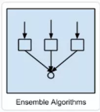

集成方法是由多个较弱的模型集成模型组，其中的模型可以单独进行训练，并且它们的预测能以某种方式结合起来去做出一个总体预测。

**该算法主要的问题是要找出哪些较弱的模型可以结合起来，以及结合的方法**。这是一个非常强大的技术集，因此广受欢迎。

例子：

- Boosting

- Bootstrapped Aggregation（Bagging）

- AdaBoost

- 层叠泛化（Stacked Generalization）（blending）

- 梯度推进机（Gradient Boosting Machines，GBM）

- 梯度提升回归树（Gradient Boosted Regression Trees，GBRT）

- 随机森林（Random Forest）

**优点：**

- 当先最先进的预测几乎都使用了算法集成。它比使用单个模型预测出来的结果要精确的多

**缺点：**

- 需要大量的维护工作

### 125.3 决策树算法（Decision Tree Algorithm）

决策树学习使用一个决策树作为一个预测模型，它将对一个 item（表征在分支上）观察所得映射成关于该 item 的目标值的结论（表征在叶子中）。

**树模型中的目标是可变的，可以采一组有限值，被称为分类树；在这些树结构中，叶子表示类标签，分支表示表征这些类标签的连接的特征。**

例子：

- 分类和回归树（Classification and Regression Tree，CART）

- Iterative Dichotomiser 3（ID3）

- C4.5 和 C5.0（一种强大方法的两个不同版本）

**优点：**

- 容易解释

- 非参数型

**缺点：**

- 趋向过拟合

- 可能或陷于局部最小值中

- 没有在线学习

### 125.4 回归（Regression）算法

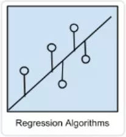

**回归是用于估计两种变量之间关系的统计过程**。当用于分析因变量和一个 多个自变量之间的关系时，该算法能提供很多建模和分析多个变量的技巧。具体一点说，**回归分析可以帮助我们理解当任意一个自变量变化，另一个自变量不变时，因变量变化的典型值**。最常见的是，回归分析能在给定自变量的条件下估计出因变量的条件期望。

回归算法是统计学中的主要算法，它已被纳入统计机器学习。

例子：

- 普通最小二乘回归（Ordinary Least Squares Regression，OLSR）

- 线性回归（Linear Regression）

- 逻辑回归（Logistic Regression）

- 逐步回归（Stepwise Regression）

- 多元自适应回归样条（Multivariate Adaptive Regression Splines，MARS）

- 本地散点平滑估计（Locally Estimated Scatterplot Smoothing，LOESS）

**优点：**

- 直接、快速
- 知名度高

**缺点：**

- 要求严格的假设

- 需要处理异常值

### 125.5 人工神经网络

人工神经网络是受生物神经网络启发而构建的算法模型。

它是一种模式匹配，常被用于回归和分类问题，但拥有庞大的子域，由数百种算法和各类问题的变体组成。

例子：

- 感知器

- 反向传播

- Hopfield 网络

- 径向基函数网络（Radial Basis Function Network，RBFN）

**优点：**

- 在语音、语义、视觉、各类游戏（如围棋）的任务中表现极好

- 算法可以快速调整，适应新的问题

**缺点：**

- 需要大量数据进行训练
- 训练要求很高的硬件配置
- 模型处于「黑箱状态」，难以理解内部机制
- 元参数（Metaparameter）与网络拓扑选择困难。

### 125.6 深度学习（Deep Learning）

深度学习是人工神经网络的最新分支，它受益于当代硬件的快速发展。

众多研究者目前的方向主要集中于构建更大、更复杂的神经网络，目前有许多方法正在聚焦半监督学习问题，其中用于训练的大数据集只包含很少的标记。

例子：

- 深玻耳兹曼机（Deep Boltzmann Machine，DBM）

- Deep Belief Networks（DBN）

- 卷积神经网络（CNN）

- Stacked Auto-Encoders

**优点/缺点：**见神经网络

### 125.7 支持向量机（Support Vector Machines）

给定一组训练事例，其中每个事例都属于两个类别中的一个，支持向量机（SVM）训练算法可以在被输入新的事例后将其分类到两个类别中的一个，使自身成为非概率二进制线性分类器。

SVM 模型将训练事例表示为空间中的点，它们被映射到一幅图中，由一条明确的、尽可能宽的间隔分开以区分两个类别。随后，新的示例会被映射到同一空间中，并基于它们落在间隔的哪一侧来预测它属于的类别。

**优点：**

- 在非线性可分问题上表现优秀

**缺点：**

- 非常难以训练

- 很难解释

### 125.8 降维算法（Dimensionality Reduction Algorithms）

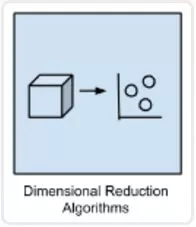

和集簇方法类似，**降维追求并利用数据的内在结构，目的在于使用较少的信息总结或描述数据**。

**这一算法可用于可视化高维数据或简化接下来可用于监督学习中的数据。许多这样的方法可针对分类和回归的使用进行调整。**

例子：

- 主成分分析（Principal Component Analysis (PCA)）

- 主成分回归（Principal Component Regression (PCR)）

- 偏最小二乘回归（Partial Least Squares Regression (PLSR)）

- Sammon 映射（Sammon Mapping）

- 多维尺度变换（Multidimensional Scaling (MDS)）

- 投影寻踪（Projection Pursuit）

- 线性判别分析（Linear Discriminant Analysis (LDA)）

- 混合判别分析（Mixture Discriminant Analysis (MDA)）

- 二次判别分析（Quadratic Discriminant Analysis (QDA)）

- 灵活判别分析（Flexible Discriminant Analysis (FDA)）

**优点：**

- 可处理大规模数据集

- 无需在数据上进行假设

**缺点：**

- 难以搞定非线性数据

- 难以理解结果的意义

### 125.9 聚类算法（Clustering Algorithms）

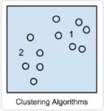

聚类算法是指对一组目标进行分类，属于同一组（亦即一个类，cluster）的目标被划分在一组中，与其他组目标相比，同一组目标更加彼此相似（在某种意义上）。

例子：

- K-均值（k-Means）

- k-Medians 算法

- Expectation Maximi 封层 ation (EM)

- 最大期望算法（EM）

- 分层集群（Hierarchical Clstering）

**优点：**

- 让数据变得有意义

**缺点：**

- 结果难以解读，针对不寻常的数据组，结果可能无用。

### 125.10 基于实例的算法（Instance-based Algorithms）

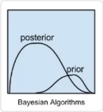

基于实例的算法（有时也称为基于记忆的学习）是这样学 习算法，不是明确归纳，而是将新的问题例子与训练过程中见过的例子进行对比，这些见过的例子就在存储器中。

**之所以叫基于实例的算法是因为它直接从训练实例中建构出假设**。这意味这，假设的复杂度能随着数据的增长而变化：最糟的情况是，假设是一个训练项目列表，分类一个单独新实例计算复杂度为 O（n）

例子：

- K 最近邻（k-Nearest Neighbor (kNN)）

- 学习向量量化（Learning Vector Quantization (LVQ)）

- 自组织映射（Self-Organizing Map (SOM)）

- 局部加权学习（Locally Weighted Learning (LWL)）

**优点：**

- 算法简单、结果易于解读

**缺点：**

- 内存使用非常高

- 计算成本高

- 不可能用于高维特征空间

### 125.11 贝叶斯算法（Bayesian Algorithms）

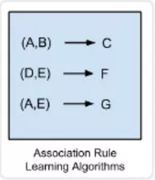

**贝叶斯方法是指明确应用了贝叶斯定理来解决如分类和回归等问题的方法。**

例子：

- 朴素贝叶斯（Naive Bayes）

- 高斯朴素贝叶斯（Gaussian Naive Bayes）

- 多项式朴素贝叶斯（Multinomial Naive Bayes）

- 平均一致依赖估计器（Averaged One-Dependence Estimators (AODE)）

- 贝叶斯信念网络（Bayesian Belief Network (BBN)）

- 贝叶斯网络（Bayesian Network (BN)）

**优点：**

- 快速、易于训练、给出了它们所需的资源能带来良好的表现

**缺点：**

- 如果输入变量是相关的，则会出现问题

### 125.12 关联规则学习算法（Association Rule Learning Algorithms）

**关联规则学习方法能够提取出对数据中的变量之间的关系的最佳解释**。比如说一家超市的销售数据中存在规则 {洋葱，土豆}=> {汉堡}，那说明当一位客户同时购买了洋葱和土豆的时候，他很有可能还会购买汉堡肉。

例子：

- Apriori 算法（Apriori algorithm）

- Eclat 算法（Eclat algorithm）

- FP-growth

### 125.13 图模型（Graphical Models）

**图模型或概率图模型（PGM/probabilistic graphical model）是一种概率模型，一个图（graph）可以通过其表示随机变量之间的条件依赖结构（conditional dependence structure）。**

例子：

- 贝叶斯网络（Bayesian network）

- 马尔可夫随机域（Markov random field）

- 链图（Chain Graphs）

- 祖先图（Ancestral graph）

**优点：**

- 模型清晰，能被直观地理解

**缺点：**

- 确定其依赖的拓扑很困难，有时候也很模糊。

## 126. 在应用机器学习算法之前纠正和清理数据的步骤是什么？

1. 将数据导入

2. 看数据：重点看元数据，即对字段解释、数据来源等信息；导入数据后，提取部分数据进行查看

3. 缺失值清洗
   - 根据需要对缺失值进行处理，可以删除数据或填充数据
   - 重新取数：如果某些非常重要的字段缺失，需要和负责采集数据的人沟通，是否可以再获得

4. 数据格式清洗：统一数据的时间、日期、全半角等显示格式

5. 逻辑错误的数据
   - 重复的数据
   - 不合理的值

6. 不一致错误的处理：指对矛盾内容的修正，最常见的如身份证号和出生年月日不对应。

不同业务中数据清洗的任务略有不同，比如数据有不同来源的话，数据格式清洗和不一致错误的处理就尤为突出。数据预处理是数据类岗位工作内容中重要的部分。

## 127. 在 K-Means 中如何拾取 k？

K-Means 算法的最大缺点是不能自动选择分类数 `k`，常见的确定 `k` 的方法有：

- 根据先验知识来确定
- k=2N ，N 为样本数
- 拐点法：把聚类结果的 F-test 值对聚类个数的曲线画出来，选择图中的拐点
- 基于信息准则判断，如果模型有似然函数，则可以用 BIC、DIC 来进行决策
具体的 `k` 的选择往往和业务联系紧密，如希望能将用户进行分类，就有先验的分类要求

## 128. 如何理解模型的过拟合与欠拟合，以及如何解决？

### 128.1 欠拟合（underfiting / high bias）
训练误差和验证误差都很大，这种情况称为欠拟合。出现欠拟合的原因是模型尚未学习到数据的真实结构。因此，模拟在训练集和验证集上的性能都很差。

**解决办法：**

- 做特征工程，添加更多的特征项。如果欠拟合是由于特征项不够，没有足够的信息支持模型做判断。
- 增加模型复杂度。如果模型太简单，不能够应对复杂的任务。可以使用更复杂的模型，减小正则化系数。具体来说可以使用核函数，集成学习方法。
- 集成学习方法 boosting（如GBDT）能有效解决 high bias

### 128.2 过拟合（overfiting / high variance）
模型在训练集上表现很好，但是在验证集上却不能保持准确，也就是模型泛化能力很差。这种情况很可能是模型过拟合。

**造成原因主要有以下几种：**

- 训练数据集样本单一，样本不足。如果训练样本只有负样本，然后那生成的模型去预测正样本，这肯定预测不准。所以训练样本要尽可能的全面，覆盖所有的数据类型。
- 训练数据中噪声干扰过大。噪声指训练数据中的干扰数据。过多的干扰会导致记录了很多噪声特征，忽略了真实输入和输出之间的关系。
- 模型过于复杂。模型太复杂，已经能够死记硬背记录下了训练数据的信息，但是遇到没有见过的数据的时候不能够变通，泛化能力太差。我们希望模型对不同的模型都有稳定的输出。模型太复杂是过拟合的重要因素。

**针对过拟合的上述原因，对应的预防和解决办法如下：**

- 在训练和建立模型的时候，从相对简单的模型开始，不要一开始就把特征做的非常多，模型参数跳的非常复杂。
- 增加样本，要覆盖全部的数据类型。数据经过清洗之后再进行模型训练，防止噪声数据干扰模型
- 正则化。在模型算法中添加惩罚函数来防止过拟合。常见的有L1，L2正则化。
- 集成学习方法bagging(如随机森林）能有效防止过拟合
- 减少特征个数(不是太推荐)

注意：**降维不能解决过拟合。降维只是减小了特征的维度，并没有减小特征所有的信息。**

## 129. 请详细说说文字特征提取

很多机器学习问题涉及自然语言处理（NLP），必然要处理文字信息。文字必须转换成可以量化的特征向量。下面我们就来介绍最常用的文字表示方法：**词库模型（Bag-of-words model）**。

词库表示法：

> 词库模型是文字模型化的最常用方法。对于一个文档（document），忽略其词序和语法，句法，将其仅仅看做是一个词集合，或者说是词的一个组合，文档中每个词的出现都是独立的，不依赖于其他词是否出现，或者说当这篇文章的作者在任意一个位置选择一个词汇都不受前面句子的影响而独立选择的。**词库模型可以看成是独热编码的一种扩展，它为每个单词设值一个特征值**。词库模型依据是用类似单词的文章意思也差不多。**词库模型可以通过有限的编码信息实现有效的文档分类和检索**。

一批文档的集合称为文集（corpus）。让我们用一个由两个文档组成的文集来演示词库模型：

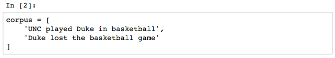

文集包括 8 个词：`UNC, played, Duke, in, basketball, lost, the, game`。文件的单词构成词汇表（vocabulary）。词库模型用文集的词汇表中每个单词的特征向量表示每个文档。

文集有 8 个单词，那么每个文档就是由一个包含 8 位元素的向量构成。**构成特征向量的元素数量称为维度（dimension）**。**用一个词典（dictionary）来表示词汇表与特征向量索引的对应关系**。

**在大多数词库模型中，特征向量的每一个元素是用二进制数表示单词是否在文档中**。例如，第一个文档的第一个词是 `UNC`，词汇表的第一个单词是 `UNC`，因此特征向量的第一个元素就是 1。词汇表的最后一个单词是 `game` 。第一个文档没有这个词，那么特征向量的最后一个元素就是 0。

`CountVectorizer` 类会把文档全部转换成小写，然后将文档词块化（tokenize）。文档词块化是把句子分割成词块（token）或有意义的字母序列的过程。词块大多是单词，但是他们也可能是一些短语，如标点符号和词缀。`CountVectorizer` 类通过正则表达式用空格分割句子，然后抽取长度大于等于 2 的字母序列。

`scikit-learn` 实现代码如下：

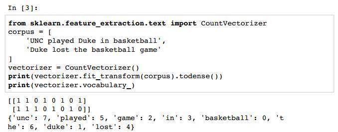

再增加一个文档到文集里：

通过 `CountVectorizer` 类可以得出上面的结果。词汇表里面有 10 个单词，但 `a` 不在词汇表里面，是因为 `a` 的长度不符合 `CountVectorizer` 类的要求。

对比文档的特征向量，会发现前两个文档相比第三个文档更相似。如果用欧氏距离（Euclidean distance）计算它们的特征向量会比其与第三个文档距离更接近。**两向量的欧氏距离就是两个向量欧氏范数（Euclidean norm）或 L2 范数差的绝对值**：

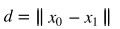

向量的欧氏范数是其元素平方和的平方根：

`scikit-learn` 里面的 `euclidean_distances` 函数可以计算若干向量的距离，表示两个语义最相似的文档其向量在空间中也是最接近的。

如果我们用新闻报道内容做文集，词汇表就可以用成千上万个单词。每篇新闻的特征向量都会有成千上万个元素，很多元素都会是 0。体育新闻不会包含财经新闻的术语，同样文化新闻也不会包含财经新闻的术语。有许多零元素的高维特征向量成为稀疏向量（sparse vectors）。

**用高维数据可以量化机器学习任务时会有一些问题，不只是出现在自然语言处理领域。**

- 第一个问题就是高维向量需要占用更大内存。NumPy 提供了一些数据类型只显示稀疏向量的非零元素，可以有效处理这个问题。

- 第二个问题就是著名的维度灾难（curse of dimensionality，Hughes effect），维度越多就要求更大的训练集数据保证模型能够充分学习。如果训练样本不够，那么算法就可以拟合过度导致归纳失败。

下面，介绍一些降维的方法。在第7章，PCA 降维里面，还会介绍用数值方法降维。

**停用词过滤：**

**特征向量降维的一个基本方法是单词全部转换成小写**。这是因为单词的大小写一般不会影响意思。而首字母大写的单词一般只是在句子的开头，而词库模型并不在乎单词的位置和语法。

**另一种方法是去掉文集常用词。这里词称为停用词（Stop-word）**，像 `a，an，the，助动词do，be，will，介词on，around，beneath` 等。**停用词通常是构建文档意思的功能词汇，其字面意义并不体现。**

`CountVectorizer` 类可以通过设置 `stop_words` 参数过滤停用词，默认是英语常用的停用词。

这样停用词就没有了，前两篇文档依然相比其与第三篇的内容更接近。

**词根还原与词形还原：**

停用词去掉之后，可能还会剩下许多词，还有一种常用的方法就是词根还原（stemming ）与词形还原（lemmatization）。

**特征向量里面的单词很多都是一个词的不同形式，比如 jumping 和 jumps 都是 jump 的不同形式**。词根还原与词形还原就是为了将单词从不同的时态、派生形式还原。

这两个文档意思差不多，但是其特征向量完全不同，因为单词的形式不同。两个单词都是有一个动词 eat 和一个 sandwich，这些特征应该在向量中反映出来。

**词形还原**就是用来处理可以表现单词意思的词元（lemma）或形态学的词根（morphological root）的过程。词元是单词在词典中查询该词的基本形式。词根还原与词形还原类似，但它不是生成单词的形态学的词根。而是把附加的词缀都去掉，构成一个词块，可能不是一个正常的单词。**词形还原通常需要词法资料的支持，比如 WordNet 和单词词类（part of speech）**。**词根还原算法通常需要用规则产生词干（stem）并操作词块，不需要词法资源，也不在乎单词的意思**。

让我们分析一下单词 `gathering` 的词形还原：

第一句的 `gathering` 是动词，其词元是 `gather`。后一句的 `gathering` 是名词，其词元是 `gathering`。我们用 Python 的 [NLTK（Natural Language Tool Kit）](http://www.nltk.org/install.html)库来处理。

`NLTK` 的 `WordNetLemmatizer` 可以用 `gathering` 的词类确定词元。

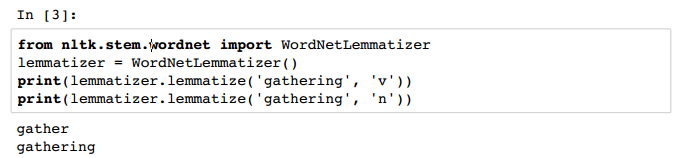

把词形还原应用到之前的例子里

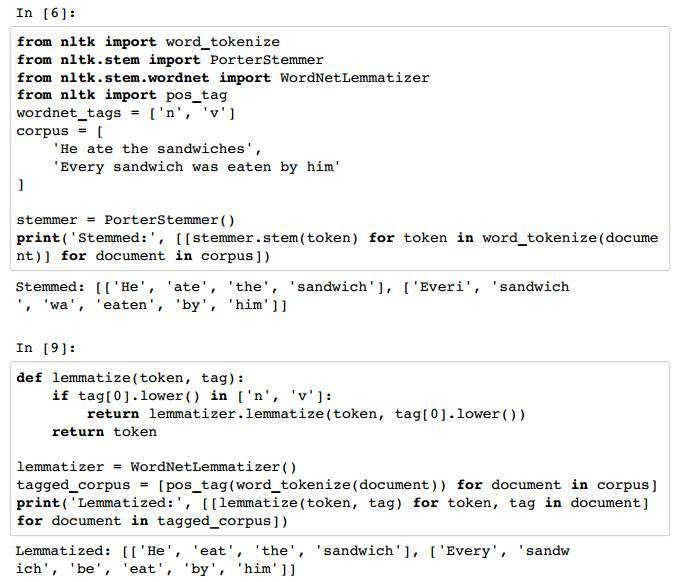

**通过词根还原与词形还原可以有效降维，去掉不必要的单词形式，特征向量可以更有效的表示文档的意思。**

**带 TF-IDF 权重的扩展词库：**

前面用词库模型构建了判断单词是个在文档中出现的特征向量。这些特征向量与单词的语法，顺序，频率无关。不过直觉告诉我们文档中单词的频率对文档的意思有重要作用。一个文档中某个词多次出现，相比只出现过一次的单词更能体现反映文档的意思。

现在我们就将单词频率加入特征向量，然后介绍由词频引出的两个问题。

我们用一个整数来代码单词的频率。代码如下：

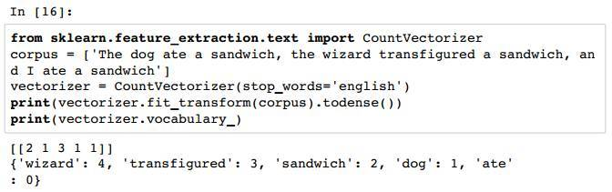

结果中第一行是单词的频率，dog 频率为 1，sandwich 频率为 3。注意和前面不同的是，`binary=True` 没有了，因为 `binary` 默认是 `False`，这样返回的是词汇表的词频，不是二进制结果[1 1 1 1 1]。**这种单词频率构成的特征向量为文档的意思提供了更多的信息，但是在对比不同的文档时，需要考虑文档的长度**。

很多单词可能在两个文档的频率一样，但是两个文档的长度差别很大，一个文档比另一个文档长很多倍。`scikit-learn` 的 `TfdfTransformer` 类可以解决这个问题，通过对词频（term frequency）特征向量归一化来实现不同文档向量的可比性。

默认情况下，`TfdfTransformer` 类用 L2 范数对特征向量归一化：

`f(t,d)` 是第 个文档（document）第 个单词（term）的频率， 是频率向量的 L2 范数。另外，还有对数词频调整方法（logarithmically scaled term frequencies），把词频调整到一个更小的范围，或者词频放大法（augmented term frequencies），适用于消除较长文档的差异。

对数词频公式如下：

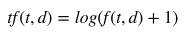

`TfdfTransformer` 类计算对数词频调整时，需要将参数 `sublinear_tf` 设置为 `True`。词频放大公式如下：

归一化，对数调整词频和词频放大三支方法都消除文档不同大小对词频的影响。

但是，**另一个问题仍然存在，那就是特征向量里高频词的权重更大，即使这些词在文集内其他文档里面也经常出现。这些单词并没有突出代表单个文档的意思。**

比如，一个文集里大多数文档都是关于杜克大学篮球队的，那么高频词就是 `basketball，Coach K，flop`。这些词可以被看成是该文集的停用词，因为它们太普遍对区分文档的意思没任何作用。

**逆向文件频率（inverse document frequency，IDF）就是用来度量文集中单词频率的**。

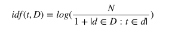

其中， 是文集中文档数量， 表示包含单词 的文档数量。单词的 `TF-IDF` 值就是其频率与逆向文件频率的乘积。

`TfdfTransformer` 类默认返回 `TF-IDF` 值，其参数 `use_idf` 默认为 `True`。由于 `TF-IDF` 加权特征向量经常用来表示文本，所以 `scikit-learn` 提供了 `TfidfVectorizer` 类将 `CountVectorizer` 和 `TfdfTransformer` 类封装在一起。

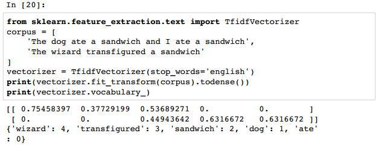

通过 `TF-IDF` 加权之后，我们会发现在文集中较常见的词，如 `sandwich` 被调整了。

**通过哈希技巧实现特征向量：**

前面我们是用包含文集所有词块的词典来完成文档词块与特征向量的映射的。这么做有两个缺点。

- 首先是文集需要被调用两次。第一次是创建词典，第二次是创建文档的特征向量。

- 另外，词典必须储存在内存里，如果文集特别大就会很耗内存。通过哈希表可以有效的解决这些问题。可以将词块用哈希函数来确定它在特征向量的索引位置，可以不创建词典，这称为哈希技巧（hashing trick）。

`scikitlearn` 提供了 `HashingVectorizer` 来实现这个技巧：

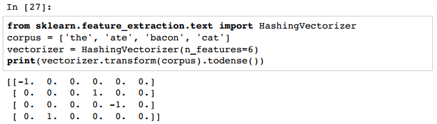

哈希技巧是无固定状态的（stateless），，它把任意的数据块映射到固定数目的位置，并且保证相同的输入一定产生相同的输出，不同的输入尽可能产生不同的输出。它可以用并行，线上，流式传输创建特征向量，因为它初始化是不需要文集输入。`n_features` 是一个可选参数，默认值是 ，这里 2 的 20 次方。

这里设置成 6 是为了演示。另外，注意有些单词频率是负数。由于 Hash 碰撞可能发生，所以 `HashingVectorizer` 用有符号哈希函数（signed hash function）。特征值和它的词块的哈希值带同样符号，如果 cats 出现过两次，被哈希成 -3，文档特征向量的第四个元素要减去 2。如果 dogs 出现过两次，被哈希成 3，文档特征向量的第四个元素要加上 2。

**用带符号哈希函数可以把词块发生哈希碰撞的概率相互抵消掉，信息损失比信息损失的同时出现信息冗余要好。哈希技巧的一个不足是模型的结果更难察看，由于哈希函数不能显示哪个词块映射到特征向量的哪个位置了。**

## 130. 请详细说说图像特征提取

计算机视觉是一门研究如何使机器 “看” 的科学，让计算机学会处理和理解图像。这门学问有时需要借助机器学习。

本节介绍一些机器学习在计算机视觉领域应用的基础技术。通过像素值提取特征数字图像通常是一张光栅图或像素图，将颜色映射到网格坐标里。一张图片可以看成是一个每个元素都是颜色值的矩阵。表示图像基本特征就是将矩阵每行连起来变成一个行向量。

光学文字识别（Optical character recognition，OCR）是机器学习的经典问题。下面我们用这个技术来识别手写数字。

`scikit-learn` 的 `digits` 数字集包括至少 1700 种 0-9 的手写数字图像。每个图像都有 8x8 像像素构成。每个像素的值是 0-16，白色是 0，黑色是 16。如下图所示：

我们将 8x8 矩阵转换成 64 维向量来创建一个特征向量：

这样表示可以有效的处理一些基本任务，比如识别手写字母等。但是，记录每个像素的数值在大图像处理时不太好用。一个 100x100 像素的图像其灰度图产生的特征向量是 10000 维度，而 1920x1080 像素的图像是 2073600。

和 `TF-IDF` 特征向量不同，大部分图像都不是稀疏的。**这种表示法的缺点不只是特征向量的维度灾难，还有就是某个位置的学习结果在经过对图像的放缩，旋转或变换之后可能就不对了，非常敏感，缺乏稳定性。**

另外，这种方法对图像的亮度也十分敏感。所以这种方法在处理照片和其他自然景色图像时不怎么有用。**现代计算机视觉应用通常手工实现特征提取，或者用深度学习自动化解决无监督问题**。

**对感兴趣的点进行特征提取：**

前面创建的特征矢量包含了图像的每个像素，既包含了图像特征的有用信息，也包含了一堆噪声。查看图像后，我们会发现所有的图像都有一个白边，这些像素是没用的。

人们不需要观察物体的每个属性就可以很快的识别出很多物体。我们可以根据轮廓识别出汽车，并不需要观察后视镜，我们也可以通过一个鼻子或嘴巴判断图像是一个人。

这些直觉就可以用来建立一种表示图像大多数信息属性的方法。而这些有信息量的属性，称为兴趣点（points of interest），是由丰富的纹理包围，基本可以重建图像。边缘（edges）和角点（corners）是两种常用的兴趣点类型。边是像素快速变化的分界线（boundary），角是两条边的交集。

我们用 `scikit-image` 库抽取下图的兴趣点：

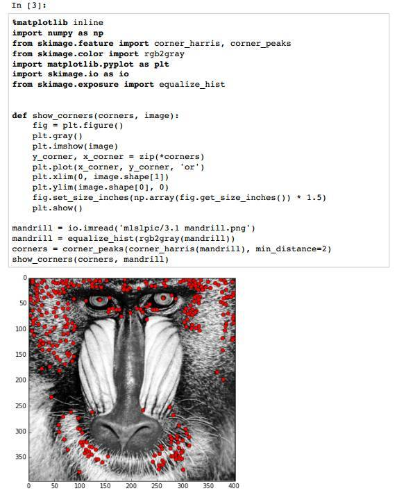

上图就是兴趣点的提取结果。图片的 230400 个像素中，466 个兴趣点被提取。这种提取方式更紧凑，而且当图片的亮度发生统一变化时，这些兴趣点依然存在。

**SIFT 和 SURF：**

**尺度不变特征转换（Scale-Invariant Feature Transform，SIFT）是一种特征提取方法**，相比前面使用的方法，SIFT 对图像的尺寸，旋转，亮度变化更不敏感。每个 SIFT 特征都是一个描述图片上某个区域边缘和角点的向量。和兴趣点不同，SIFT 还可以获取每个兴趣点和它周围点的综合信息。

**加速稳健特征（Speeded-Up Robust Features，SURF）是另一个抽取图像兴趣点的方法**，其特征向量对图像的尺寸，旋转，亮度变化是不变的。SURF 的算法可以比 SIFT 更快，更有效的识别出兴趣点。

两种方法的具体理论解释在数字图像处理类的教材中都有介绍，这样用 `mahotas` 库来应用 SURF 方法处理下面的图片。

和兴趣点抽取类似，抽取 SURF 只是机器学习中创建特征向量的第一步。训练集的每个实例都会抽取不同的 SURF。第六章的 K-Means 聚类，会介绍聚类方法抽取 SURF 来学习特征，可以作为一种图像分类方法。

`mahotas` 代码如下：

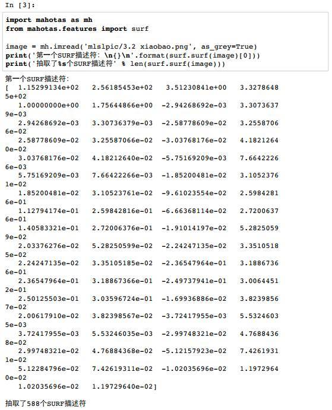

**数据标准化：**

许多评估方法在处理标准化数据集时可以获得更好的效果。标准化数据均值为 0，单位方差(UnitVariance)。**均值为 0 的解释变量是关于原点对称的，特征向量的单位方差表示其特征值全身统一单位，统一量级的数据**。

例如，假设特征向量由两个解释变量构成，第一个变量值范围 [0,1]，第二个变量值范围 [0,1000000]，这时就要把第二个变量的值调整为 [0,1]，这样才能保证数据是单位方差。

**如果变量特征值的量级比其他特征值的方差还大，这个特征值就会主导学习算法的方向，导致其他变量的影响被忽略**。有些机器学习算法会在数据不标准时引入很小的优化参数值。解释变量的值可以通过正态分布进行标准化，减去均值后除以标准差。

`scikit-learn` 的 `scale` 函数可以实现：

## 131. 了解xgboost么，请详细说说它的原理

> [了解xgboost么，请详细说说它的原理](https://www.julyedu.com/question/big/kp_id/23/ques_id/2590)

TODO

## 132. 请详细说说梯度提升树(GBDT)的原理

> [请详细说说梯度提升树(GBDT)的原理](https://www.julyedu.com/question/big/kp_id/23/ques_id/2591)

TODO

## 133. 请说说Adaboost 算法的原理与推导

> [请说说Adaboost 算法的原理与推导](https://www.julyedu.com/question/big/kp_id/23/ques_id/2595)

TODO

## 134. 请详细说说协同过滤的原理

> [推荐引擎算法学习导论：协同过滤、聚类、分类](https://blog.csdn.net/v_july_v/article/details/7184318)
> [协同过滤推荐算法和基于内容的过滤算法](https://time.geekbang.org/article/1947)

### 134.1 推荐引擎的分类

推荐引擎根据不同依据如下分类：

根据其是不是为不同的用户推荐不同的数据，分为：

- 基于大众行为（网站管理员自行推荐，或者基于系统所有用户的反馈统计计算出的当下比较流行的物品）
- 及个性化推荐引擎（帮你找志同道合，趣味相投的朋友，然后在此基础上实行推荐）；

根据其数据源，分为：

- 基于人口统计学的（用户年龄或性别相同判定为相似用户）
- 基于内容的（物品具有相同关键词和Tag，没有考虑人为因素）
- 基于协同过滤的推荐（发现物品，内容或用户的相关性推荐，分为三个子类，下文阐述）

根据其建立方式，分为：

- 基于物品和用户本身的（用户-物品二维矩阵描述用户喜好，聚类算法）
- 基于关联规则的（The Apriori algorithm算法是一种最有影响的挖掘布尔关联规则频繁项集的算法）
- 基于模型的推荐（机器学习，所谓机器学习，即让计算机像人脑一样持续学习，是人工智能领域内的一个子领域）。

关于上述第二个分类(根据其数据源)中的基于协同过滤的推荐：随着 Web2.0 的发展，Web 站点更加提倡用户参与和用户贡献，因此**基于协同过滤的推荐机制**因运而生。它的原理很简单，**就是根据用户对物品或者信息的偏好，发现物品或者内容本身的相关性，或者是发现用户的相关性，然后再基于这些关联性进行推荐。**

而基于协同过滤的推荐，又分三个子类：

- 基于用户的推荐(通过共同口味与偏好找相似邻居用户，K-邻居算法，你朋友喜欢，你也可能喜欢)，
- 基于项目的推荐(发现物品之间的相似度，推荐类似的物品，你喜欢物品A，C与A相似，可能也喜欢C)，
- 基于模型的推荐(基于样本的用户喜好信息构造一个推荐模型，然后根据实时的用户喜好信息预测推荐)。

我们看到，此**协同过滤算法最大限度的利用用户之间，或物品之间的相似相关性，而后基于这些信息的基础上实行推荐**。下文还会具体介绍此协同过滤。

不过一般实践中，我们通常还是把推荐引擎分两类：

- 第一类称为协同过滤，即基于相似用户的协同过滤推荐（用户与系统或互联网交互留下的一切信息、蛛丝马迹，或用户与用户之间千丝万缕的联系），以及基于相似项目的协同过滤推荐（尽最大可能发现物品间的相似度）；
- 第二类便是基于内容分析的推荐（调查问卷，电子邮件，或者推荐引擎对本 blog 内容的分析）。

### 134.2 协同过滤推荐

协同过滤是利用集体智慧的一个典型方法。要理解什么是协同过滤 (Collaborative Filtering, 简称 CF)，首先想一个简单的问题，如果你现在想看个电影，但你不知道具体看哪部，你会怎么做？大部分的人会问问周围的朋友或者称之为广义上的邻居(neighborhood)，看看最近有什么好看的电影推荐，而我们一般更倾向于从口味比较类似的朋友那里得到推荐。这就是协同过滤的核心思想。如下图，你能从图中看到多少信息？

#### 134.2.1 协同过滤推荐步骤

做协同过滤推荐，一般要做好以下几个步骤：

1）若要做协同过滤，那么收集用户偏好则成了关键。可以通过用户的行为诸如评分（如不同的用户对不同的作品有不同的评分，而评分接近则意味着喜好口味相近，便可判定为相似用户），投票，转发，保存，书签，标记，评论，点击流，页面停留时间，是否购买等获得。如下面第2点所述：所有这些信息都可以数字化，如一个二维矩阵表示出来。

2）收集了用户行为数据之后，我们接下来便要对数据进行减噪与归一化操作(得到一个用户偏好的二维矩阵，一维是用户列表，另一维是物品列表，值是用户对物品的偏好，一般是 [0,1] 或者 [-1, 1] 的浮点数值)。

下面再简单介绍下减噪和归一化操作。

**所谓减噪：**用户行为数据是用户在使用应用过程中产生的，它可能存在大量的噪音和用户的误操作，我们可以通过经典的数据挖掘算法过滤掉行为数据中的噪音，这样可以是我们的分析更加精确（类似于网页的去噪处理）。

**所谓归一化：**将各个行为的数据统一在一个相同的取值范围中，从而使得加权求和得到的总体喜好更加精确。最简单的归一化处理，便是将各类数据除以此类中的最大值，以保证归一化后的数据取值在 [0,1] 范围中。至于所谓的加权，很好理解，因为每个人占的权值不同，类似于一场唱歌比赛中对某几个选手进行投票决定其是否晋级，观众的投票抵 1 分，专家评委的投票抵 5 分，最后得分最多的选手直接晋级。

3）找到相似的用户和物品，通过什么途径找到呢？便是计算相似用户或相似物品的相似度。

4）相似度的计算有多种方法，不过都是基于向量Vector的，其实也就是计算两个向量的距离，距离越近相似度越大。在推荐中，用户-物品偏好的二维矩阵下，我们将某个或某几个用户对莫两个物品的偏好作为一个向量来计算两个物品之间的相似度，或者将两个用户对某个或某几个物品的偏好作为一个向量来计算两个用户之间的相似度。

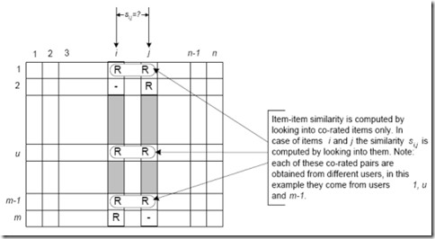

所以说，很简单，找物品间的相似度，用户不变，找多个用户对物品的评分；找用户间的相似度，物品不变，找用户对某些个物品的评分。

5）而计算出来的这两个相似度则将作为基于用户、项目的两项协同过滤的推荐。

常见的计算相似度的方法有：

- 欧几里德距离
- 皮尔逊相关系数（如两个用户对多个电影的评分，采取皮尔逊相关系数等相关计算方法，可以抉择出他们的口味和偏好是否一致）
- Cosine相似度
- Tanimoto系数。

下面，简单介绍其中的欧几里得距离与皮尔逊相关系数：

- 欧几里德距离（Euclidean Distance）是最初用于计算欧几里德空间中两个点的距离，假设 `x`，`y` 是 `n` 维空间的两个点，它们之间的欧几里德距离是：

  

  可以看出，当 n=2 时，欧几里德距离就是平面上两个点的距离。当用欧几里德距离表示相似度，一般采用以下公式进行转换：**距离越小，相似度越大（同时，避免除数为0）**：

  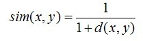

- 余弦相似度Cosine-based Similarity

  两个项目 `i` ，`j` 视作为两个 m 维用户空间向量，相似度计算通过计算两个向量的余弦夹角，那么，对于 `m*n` 的评分矩阵，`i` ，`j` 的相似度 `sim( i , j )` 计算公式：

  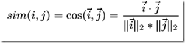

  （其中 " · "记做两个向量的内积）

- 皮尔逊相关系数一般用于计算两个定距变量间联系的紧密程度，为了使计算结果精确，需要找出共同评分的用户。记用户集 U 为既评论了 `i` 又评论了 `j` 的用户集，那么对应的皮尔森相关系数计算公式为：

  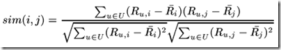

  其中 `Ru,i` 为用户 `u` 对项目 `i` 的评分，对应带横杠的为这个用户集 U 对项目 `i` 的评分评分。

6）相似邻居计算。邻居分为两类：

- 固定数量的邻居 K-neighborhoods （或Fix-size neighborhoods），不论邻居的“远近”，只取最近的 `K` 个，作为其邻居，如下图 A 部分所示；

- 基于相似度门槛的邻居，落在以当前点为中心，距离为 K 的区域中的所有点都作为当前点的邻居，如下图B部分所示。

  

> 再介绍一下 K 最近邻(k-Nearest Neighbor，KNN)分类算法：这是一个理论上比较成熟的方法，也是最简单的机器学习算法之一。该方法的思路是：**如果一个样本在特征空间中的 k 个最相似(即特征空间中最邻近)的样本中的大多数属于某一个类别，则该样本也属于这个类别**。

7）经过 4) 计算出来的基于用户的 CF(基于用户推荐之用：通过共同口味与偏好找相似邻居用户，K-邻居算法，你朋友喜欢，你也可能喜欢)，基于物品的 CF(基于项目推荐之用：发现物品之间的相似度，推荐类似的物品，你喜欢物品 A，C 与 A 相似，那么你可能也喜欢 C)。

#### 134.2.2 基于基于用户相似度与项目相似度

上述 3.1 节中三个相似度公式是基于项目相似度场景下的，而实际上，基于用户相似度与基于项目相似度计算的一个基本的区别是，基于用户相似度是基于评分矩阵中的行向量相似度求解，基于项目相似度计算式基于评分矩阵中列向量相似度求解，然后三个公式分别都可以适用，如下图：

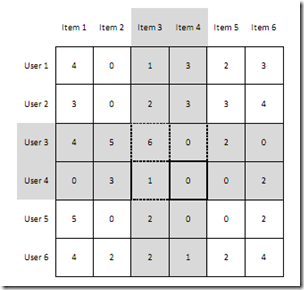

（其中，为 0 的表示未评分）

基于项目相似度计算式计算如 Item3，Item4 两列向量相似度；

基于用户相似度计算式计算如 User3，User4 量行向量相似度。

千言万语不如举个例子。我们来看一个具体的基于用户相似度计算的例子。

假设我们有一组用户，他们表现出了对一组图书的喜好。用户对一本图书的喜好程度越高，就会给其更高的评分。我们来通过一个矩阵来展示它，行代表用户，列代表图书。

如下图所示，所有的评分范围从 1 到 5，5 代表喜欢程度最高。第一个用户（行1）对第一本图书（列1）的评分是 4，空的单元格表示用户未给图书评分。

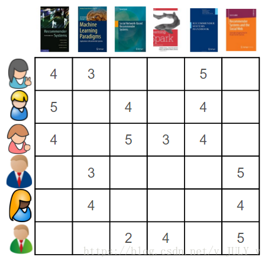

使用基于用户的协同过滤方法，我们首先要做的是基于用户给图书做出的评价，计算用户之间的相似度。

让我们从一个单一用户的角度考虑这个问题，看图 1 中的第一行，要做到这一点，常见的做法是将使用包含了用户喜好项的向量（或数组）代表每一个用户。相较于使用多样化的相似度量这种做法，更直接。

在这个例子中，我们将**使用余弦相似性去计算用户间的相似度**。

当我们把第一个用户和其他五个用户进行比较时，就能直观的看到他和其他用户的相似程度。

对于大多数相似度量，向量之间相似度越高，代表彼此更相似。本例中，第一个用户第二、第三个用户非常相似，有两本共同书籍，与第四、第五个用户的相似度低一些，只有一本共同书籍，而与最后一名用户完全不相似，因为没有一本共同书籍。

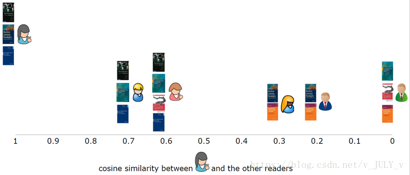

更一般的，我们可以计算出每个用户的相似性，并且在相似矩阵中表示它们。这是一个对称矩阵，单元格的背景颜色表明用户相似度的高低，更深的红色表示它们之间更相似。

所以，我们找到了与第一个用户最相似的第二个用户，删除用户已经评价过的书籍，给最相似用户正在阅读的书籍加权，然后计算出总和。

在这种情况下，我们计算出 n=2，表示为了产生推荐，需要找出与目标用户最相似的两个用户，这两个用户分别是第二个和第三个用户，然后第一个用户已经评价了第一和第五本书，故产生的推荐书是第三本（4.5分），和第四本（3分）。

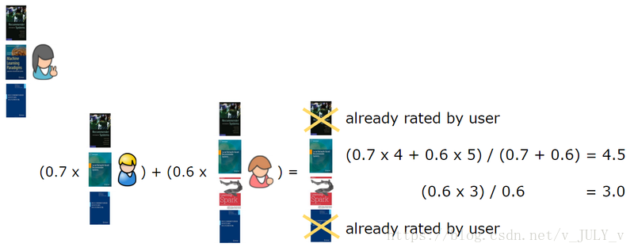

此外，什么时候用 item-base，什么时候用 user-base 呢：http://weibo.com/1580904460/zhZ9AiIkZ?mod=weibotime？

**一般说来，如果 item 数目不多，比如不超过十万，而且不显著增长的话，就用 item-based 好了。为何？如@wuzh670所说，如果 item 数目不多 + 不显著增长，说明 item 之间的关系在一段时间内相对稳定(对比 user 之间关系)，对于实时更新 item-similarity 需求就降低很多，推荐系统效率提高很多，故用 item-based 会明智些**。

**反之，当 item 数目很多，建议用 user-base**。当然，实践中具体情况具体分析。如下图所示（摘自项亮的《推荐系统实践》一书）：

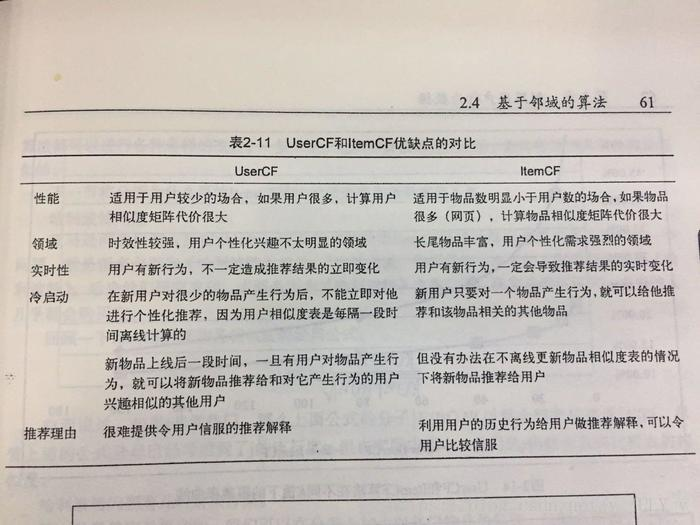

## 135. 机器学习中的L0、L1与L2范数到底是什么意思？

> [机器学习中的L0、L1与L2范数到底是什么意思？](https://www.julyedu.com/question/big/kp_id/23/ques_id/2600)

TODO

## 136. 请详细说说决策树的构造原理

> [请详细说说决策树的构造原理](https://www.julyedu.com/question/big/kp_id/23/ques_id/2601)

TODO

## 137. 怎么确定 LDA（线性判别分析） 的 topic 个数？

> [怎么确定LDA的topic个数？](https://www.julyedu.com/question/big/kp_id/23/ques_id/2602)

TODO

## 138. sklearn 随机森林的特征重要度是不是偏好数值型变量呢？

> 我在做 kaggle 的 Titanic 问题时使用随机森林和 xgboost 发现两个数值型的变量重要度非常高，远远高过性别这种在数据分析时候认为很重要的特征
>
> 看 sklearn 文档说特征重要度是按照特征对不纯度减少的贡献来排的，刚才在网上找到了一篇论文大概是说这种特征重要度的衡量方式会偏好那些类别多的变量（feature selection based on impurity reduction is biased towards preferring variables with more categories）。
>
> sklearn 的文档说 sklearn 的决策树都是 CART 树，CART 树在对待数值型特征的时候也可以理解成一个类别数等于样本数的类别型特征吧。那么是因为这个原因导致随机森林偏好数值型特征吗？

1. 类别型本身也是转化成数值型处理的，在 CART 里，转化成 是否是某个属性取值 的 01 结果
2. 应该没有你说的这种偏好。不过数值型的字段，可以多次用来切分。一个极端的例子，给树足够的深度，如果一个数值型的字段，每个样本取值都不一样，可以切到足够细（甚至一个叶子节点一个样本），但是显然这时候过拟合了。性别只可以切分一次，属性取值比较有限。

