## Index

<!-- TOC -->

* [21. 什么是最大熵](#21-什么是最大熵)

  - [21.1 无偏原则](#211-无偏原则)
* [22. LR与线性回归的区别与联系](#22-lr与线性回归的区别与联系)
* [24. 请问（决策树、Random Forest、Booting、Adaboot）GBDT和XGBoost的区别是什么？](#24-请问决策树random-forestbootingadabootgbdt和xgboost的区别是什么)
* [25. 机器学习中的正则化到底是什么意思？](#25-机器学习中的正则化到底是什么意思)

  - [25.1 过拟合和欠拟合](#251-过拟合和欠拟合)

  - [25.2 L1正则化和L2正则化](#252-l1正则化和l2正则化)
  - [25.3 那添加L1和L2正则化有什么用？](#253-那添加l1和l2正则化有什么用)
  - [25.4 稀疏模型与特征选择](#254-稀疏模型与特征选择)
  - [25.5 L1正则化和特征选择](#255-l1正则化和特征选择)
  - [25.6 L2 正则化](#256-l2-正则化)
  - [25.7 L2 正则化和过拟合](#257-l2-正则化和过拟合)
* [26. 说说常见的损失函数？](#26-说说常见的损失函数)

  - [26.1 log对数损失函数（逻辑回归）](#261-log对数损失函数逻辑回归)
  - [26.2 平方损失函数（最小二乘法, Ordinary Least Squares ）](#262-平方损失函数最小二乘法-ordinary-least-squares-)
  - [26.3 指数损失函数（Adaboost）](#263-指数损失函数adaboost)[26.4 Hinge损失函数（SVM）](#264-hinge损失函数svm)
  - [26.5 其它损失函数](#265-其它损失函数)
* [27. 为什么 xgboost 要用泰勒展开，优势在哪里？](#27-为什么-xgboost-要用泰勒展开优势在哪里)
* [28. 协方差和相关性有什么区别？](#28-协方差和相关性有什么区别)
* [29. xgboost 如何寻找最优特征？是有放回还是无放回的呢？](#29-xgboost-如何寻找最优特征是有放回还是无放回的呢)
* [30. 谈谈判别式模型和生成式模型？](#30-谈谈判别式模型和生成式模型)
* [31. 线性分类器与非线性分类器的区别以及优劣](#31-线性分类器与非线性分类器的区别以及优劣)
* [32. L1和L2的区别](#32-l1和l2的区别)
* [33. L1和L2正则先验分别服从什么分布](#33-l1和l2正则先验分别服从什么分布)
* [34. 简单介绍下logistics回归？](#34-简单介绍下logistics回归)
* [35. 说一下Adaboost，权值更新公式。当弱分类器是Gm时，每个样本的的权重是w1，w2...，请写出最终的决策公式。](#35-说一下adaboost权值更新公式当弱分类器是gm时每个样本的的权重是w1w2请写出最终的决策公式)
* [36. Google是怎么利用贝叶斯方法，实现"拼写检查"的功能。](#36-google是怎么利用贝叶斯方法实现拼写检查的功能)
* [37. 为什么朴素贝叶斯如此“朴素”？](#37-为什么朴素贝叶斯如此朴素)
* [38. 请大致对比下plsa和LDA的区别](#38-请大致对比下plsa和lda的区别)
* [39. 请简要说说 EM 算法（期望最大化算法）](#39-请简要说说-em-算法期望最大化算法)
* [40. KNN中的K如何选取的？](#40-knn中的k如何选取的)

<!-- /TOC -->

## 21. 什么是最大熵

> [什么是最大熵](https://www.julyedu.com/question/big/kp_id/23/ques_id/979)

**熵是随机变量不确定性的度量，不确定性越大，熵值越大；若随机变量退化成定值，熵为0。**如果没有外界干扰，随机变量总是趋向于无序，在经过足够时间的稳定演化，它应该能够达到的最大程度的熵。  

为了准确的估计随机变量的状态，我们一般习惯性最大化熵，认为在所有可能的概率模型（分布）的集合中，熵最大的模型是最好的模型。换言之，在已知部分知识的前提下，关于未知分布最合理的推断就是符合已知知识最不确定或最随机的推断，其原则是承认已知事物（知识），且对未知事物不做任何假设，没有任何偏见。

例如，投掷一个骰子，如果问"每个面朝上的概率分别是多少"，你会说是等概率，即各点出现的概率均为1/6。因为对这个"一无所知"的骰子，什么都不确定，而假定它每一个朝上概率均等则是最合理的做法。从投资的角度来看，这是风险最小的做法，而从信息论的角度讲，就是保留了最大的不确定性，也就是说让熵达到最大。

### 21.1 无偏原则

下面再举个大多数有关最大熵模型的文章中都喜欢举的一个例子。

例如，一篇文章中出现了“学习”这个词，那这个词是主语、谓语、还是宾语呢？换言之，已知“学习”可能是动词，也可能是名词，故“学习”可以被标为主语、谓语、宾语、定语等等。

令 `x1` 表示“学习”被标为名词， `x2` 表示“学习”被标为动词。

令 `y1` 表示“学习”被标为主语， `y2` 表示被标为谓语， `y3` 表示宾语， `y4` 表示定语。

且这些概率值加起来的和必为1，即 ，， 则根据无偏原则，认为这个分布中取各个值的概率是相等的，故得到：

因为没有任何的先验知识，所以这种判断是合理的。如果有了一定的先验知识呢？

即进一步，若已知：“学习”被标为定语的可能性很小，只有0.05，即 ，剩下的依然根据无偏原则，可得：

再进一步，当“学习”被标作名词 `x1` 的时候，它被标作谓语 `y2` 的概率为 0.95，即 ，此时仍然需要坚持无偏见原则，使得概率分布尽量平均。但怎么样才能得到尽量无偏见的分布？

实践经验和理论计算都告诉我们，**在完全无约束状态下，均匀分布等价于熵最大（有约束的情况下，不一定是概率相等的均匀分布。比如，给定均值和方差，熵最大的分布就变成了正态分布 ）。**

于是，问题便转化为了：计算 `X` 和 `Y` 的分布，使得 `H(Y|X)` 达到最大值，并且满足下述条件：

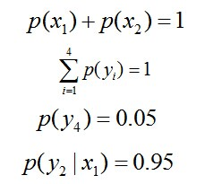

因此，也就引出了最大熵模型的本质，它要解决的问题就是已知 `X`，计算 `Y` 的概率，且尽可能让 `Y` 的概率最大（实践中，`X` 可能是某单词的上下文信息，`Y` 是该单词翻译成 me，I，us、we 的各自概率），从而根据已有信息，尽可能最准确的推测未知信息，这就是最大熵模型所要解决的问题。

相当于已知 `X`，计算 `Y` 的最大可能的概率，转换成公式，便是要最大化下述式子 `H(Y|X)`：

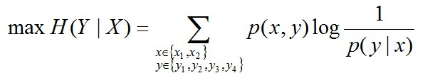

且满足以下4个约束条件：

## 22. LR与线性回归的区别与联系

LR工业上一般指Logistic Regression(逻辑回归)而不是Linear Regression(线性回归). LR在线性回归的实数范围输出值上施加sigmoid函数将值收敛到 `0~1` 范围, 其目标函数也因此从差平方和函数变为对数损失函数, 以提供最优化所需导数（sigmoid函数是softmax函数的二元特例, 其导数均为函数值的 `f*(1-f)`形式）。请注意, LR往往是解决二元 `0/1` 分类问题的, 只是它和线性回归耦合太紧, 不自觉也冠了个回归的名字(马甲无处不在). 若要求多元分类,就要把sigmoid换成大名鼎鼎的softmax了。

个人感觉**逻辑回归和线性回归首先都是广义的线性回归**，其次**经典线性模型的优化目标函数是最小二乘**，而**逻辑回归则是似然函数**，另外线性回归在整个实数域范围内进行预测，敏感度一致，而分类范围，需要在[0,1]。逻辑回归就是一种减小预测范围，将预测值限定为[0,1]间的一种回归模型，因而对于这类问题来说，**逻辑回归的鲁棒性比线性回归的要好**。

逻辑回归的模型本质上是一个线性回归模型，逻辑回归都是以线性回归为理论支持的。但线性回归模型无法做到sigmoid的非线性形式，sigmoid可以轻松处理 `0/1` 分类问题。

##23. 简单说下有监督学习和无监督学习的区别

**有监督学习：**对具有标记的训练样本进行学习，以尽可能对训练样本集外的数据进行分类预测。（LR, SVM, BP, RF, GBDT）
**无监督学习：**对未标记的样本进行训练学习，比发现这些样本中的结构知识。(KMeans, DL)

## 24. 请问（决策树、Random Forest、Booting、Adaboot）GBDT和XGBoost的区别是什么？

集成学习的集成对象是学习器.  Bagging 和 Boosting 属于集成学习的两类方法. 

- Bagging 方法**有放回**地采样同数量样本训练每个学习器, 然后再一起集成(简单投票); 

- Boosting 方法使用**全部样本**(可调权重)依次训练每个学习器, 迭代集成(平滑加权).

决策树属于最常用的学习器, 其学习过程是从根建立树, 也就是如何决策叶子节点分裂. 

- ID3/C4.5 决策树用**信息熵**计算最优分裂, 
- CART 决策树用**基尼指数**计算最优分裂, 
- xgboost 决策树使用**二阶泰勒展开系数**计算最优分裂.

下面所提到的学习器都是决策树:

**Bagging方法: **

学习器间**不存在强依赖关系**, 学习器可**并行训练生成**, **集成方式一般为投票**; 

Random Forest 属于 Bagging的代表, 放回抽样, **每个学习器随机选择部分特征去优化;**

**Boosting方法: **

学习器之间**存在强依赖关系**、**必须串行生成**, **集成方式为加权和**;

Adaboost 属于 Boosting, **采用指数损失函数替代原本分类任务的 0/1 损失函数;**

GBDT 属于 Boosting 的优秀代表, **对函数残差近似值进行梯度下降, 用 CART 回归树做学习器, 集成为回归模型;**

xgboost 属于 Boosting 的集大成者, **对函数残差近似值进行梯度下降, 迭代时利用了二阶梯度信息, 集成模型可分类也可回归.** 由于它可在特征粒度上并行计算, 结构风险和工程实现都做了很多优化, 泛化, **性能和扩展性都比GBDT要好。**

关于决策树，这里有篇[《决策树算法》](http://blog.csdn.net/v_july_v/article/details/7577684)。

而随机森林 Random Forest 是一个包含多个决策树的分类器。

至于AdaBoost，则是英文"Adaptive Boosting"（自适应增强）的缩写，关于AdaBoost可以看下这篇文章《Adaboost 算法的原理与推导》。

GBDT（Gradient Boosting Decision Tree），即梯度上升决策树算法，相当于融合决策树和梯度上升boosting 算法。

XGBoost 类似于 GBDT 的优化版，不论是精度还是效率上都有了提升。与 GBDT 相比，具体的优点有：

1. 损失函数是用泰勒展式二项逼近，而不是像 GBDT 里的就是一阶导数
2. 对树的结构进行了正则化约束，防止模型过度复杂，降低了过拟合的可能性
3. 节点分裂的方式不同，GBDT 是用的 gini系数，XGBoost 是经过优化推导后的

## 25. 机器学习中的正则化到底是什么意思？

经常在各种文章或资料中看到正则化，但一直没有一篇好的文章理清到底什么是正则化？

说到正则化，得先从过拟合问题开始谈起。

### 25.1 过拟合和欠拟合

1. The Problem of Overfitting(过拟合问题)

   拟合问题举例-线性回归之房价问题：

  1.1 欠拟合(underfit, 也称High-bias，图片来源：斯坦福大学机器学习第七课“正则化”)

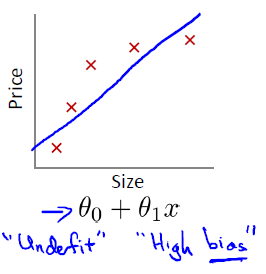

  1.2 合适的拟合：

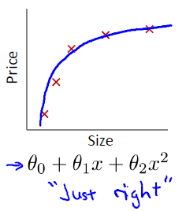

  1.3 过拟合(overfit,也称High variance)

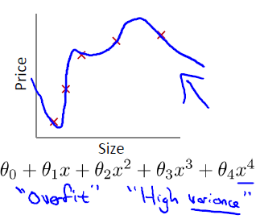

**什么是过拟合(Overfitting):**

如果我们有非常多的特征，那么所学的 Hypothesis 有可能对训练集拟合的非常好()，但是对于新数据预测的很差。

2. 过拟合例子2-逻辑回归：

   与上一个例子相似，依次是欠拟合，合适的拟合以及过拟合：

  2.1 欠拟合

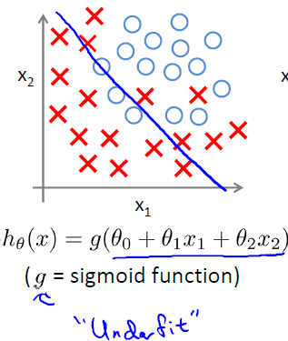

  2.2 合适的拟合

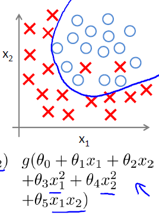

  2.3 过拟合

**如何解决过拟合问题：**

针对过拟合问题，通常会考虑两种途径来解决：

- 减少特征的数量：
  - 人工的选择保留哪些特征；
  - 模型选择算法

- 正则化
  - 保留所有的特征，但是降低参数的量/值；
  - 正则化的好处是当特征很多时，每一个特征都会对预测y贡献一份合适的力量；

所以说，**使用正则化的目的就是为了是为了防止过拟合。**

什么是规则？比如明星再红也不能违法，这就是规则，一个限制。同理，规划化就是给需要训练的目标函数加上一些规则（限制），让它们不要自我膨胀，不要过于上下无规则的横跳，不能无法无天。

### 25.2 L1正则化和L2正则化

机器学习中几乎都可以看到损失函数后面会添加一个额外项，常用的额外项一般有两种，一般英文称作 `ℓ1-norm` 和 `ℓ2-norm`，中文称作 `L1` 正则化和 `L2` 正则化，或者 `L1` 范数和 `L2` 范数。

`L1` 正则化和 `L2` 正则化可以看做是损失函数的惩罚项。所谓『惩罚』是指对损失函数中的某些参数做一些限制。

对于线性回归模型，使用 `L1` 正则化的模型建叫做 Lasso回归，使用 `L2` 正则化的模型叫做 Ridge回归（岭回归）。

下图是 Python 中 Lasso回归的损失函数，式中加号后面一项  即为 `L1` 正则化项。

下图是 Python 中 Ridge 回归的损失函数，式中加号后面一项  即为 `L2` 正则化项。

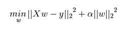

一般回归分析中回归 `w` 表示特征的系数，从上式可以看到正则化项是对系数做了处理（限制）。`L1` 正则化和 `L2` 正则化的说明如下：

- L1 正则化是指权值向量 `w` 中各个元素的绝对值之和，通常表示为 
- L2 正则化是指权值向量 `w` 中各个元素的平方和然后再求平方根（可以看到 Ridge 回归的 `L2` 正则化项有平方符号），通常表示为 

一般都会在正则化项之前添加一个系数，Python 中用 `α` 表示，一些文章也用 `λ` 表示。这个系数需要用户指定。

### 25.3 那添加L1和L2正则化有什么用？

- **L1 正则化可以产生稀疏权值矩阵，即产生一个稀疏模型，可以用于特征选择**
- **L2  正则化可以防止模型过拟合（overfitting）。当然，一定程度上，L1也可以防止过拟合**

### 25.4 稀疏模型与特征选择

上面提到 L1 正则化有助于生成一个稀疏权值矩阵，进而可以用于特征选择。**为什么要生成一个稀疏矩阵？**

稀疏矩阵指的是很多元素为 0，只有少数元素是非零值的矩阵，即得到的线性回归模型的大部分系数都是 0. 通常机器学习中特征数量很多，例如文本处理时，如果将一个词组（term）作为一个特征，那么特征数量会达到上万个（bigram）。

**在预测或分类时，那么多特征显然难以选择，但是如果代入这些特征得到的模型是一个稀疏模型，表示只有少数特征对这个模型有贡献，绝大部分特征是没有贡献的，或者贡献微小（因为它们前面的系数是0或者是很小的值，即使去掉对模型也没有什么影响），此时我们就可以只关注系数是非零值的特征。这就是稀疏模型与特征选择的关系。**

### 25.5 L1正则化和特征选择

假设有如下带 L1 正则化的损失函数： 

其中 `J0` 是原始的损失函数，加号后面的一项是 `L1` 正则化项，`α` 是正则化系数。注意到 `L1` 正则化是权值的绝对值之和，`J` 是带有绝对值符号的函数，因此 `J` 是不完全可微的。

机器学习的任务就是要通过一些方法（比如梯度下降）求出损失函数的最小值。当我们在原始损失函数 `J0` 后添加 `L1` 正则化项时，相当于对 `J0` 做了一个约束。令 `L=α∑w|w|`，则 `J=J0+L`，此时我们的任务变成在 `L` 约束下求出 `J0` 取最小值的解。

考虑二维的情况，即只有两个权值 `w1` 和 `w2` ，此时 `L=|w1|+|w2|` 对于梯度下降法，求解 `J0` 的过程可以画出等值线，同时 `L1` 正则化的函数 `L` 也可以在 `w1w2` 的二维平面上画出来。

如下图：

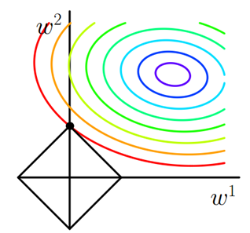

图中等值线是 `J0` 的等值线，黑色方形是 `L` 函数的图形。

在图中，**当 `J0` 等值线与 `L`图形首次相交的地方就是最优解。**上图中 `J0` 与 `L` 在 `L` 的一个顶点处相交，这个顶点就是最优解。注意到这个顶点的值是 `(w1,w2)=(0,w)`。可以直观想象，因为 `L` 函数有很多『突出的角』（二维情况下四个，多维情况下更多），`J0` 与这些角接触的机率会远大于与 `L` 其它部位接触的机率，而在这些角上，会有很多权值等于 0，这就是为什么 `L1` 正则化可以产生稀疏模型，进而可以用于特征选择。

而正则化前面的系数 `α`，可以控制 `L` 图形的大小。`α` 越小，`L` 的图形越大（上图中的黑色方框）； `α` 越大，`L` 的图形就越小，可以小到黑色方框只超出原点范围一点点，这是最优点的值 `(w1,w2)=(0,w)` 中的 `w` 可以取到很小的值。

### 25.6 L2 正则化

类似，假设有如下带 `L2` 正则化的损失函数： 

同样可以画出他们在二维平面上的图形，如下：

二维平面下 `L2` 正则化的函数图形是个圆，与方形相比，被磨去了棱角。因此 `J0` 与 `L` 相交时使得 `w1` 或 `w2` 等于零的机率小了许多，这就是为什么 `L2` 正则化不具有稀疏性的原因。

`PRML`一书对这两个图是这么解释的

上图中的模型是线性回归，有两个特征，要优化的参数分别是 `w1` 和 `w2` ，左图的正则化是 `L2`，右图是 `L1`。**蓝色线就是优化过程中遇到的等高线，一圈代表一个目标函数值，圆心就是样本观测值（假设一个样本），半径就是误差值，受限条件就是红色边界（就是正则化那部分），二者相交处，才是最优参数。**

可见右边的最优参数只可能在坐标轴上，所以就会出现 0 权重参数，使得模型稀疏。

### 25.7 L2 正则化和过拟合

拟合过程中通常都倾向于让权值尽可能小，最后构造一个所有参数都比较小的模型。因为一般认为参数值小的模型比较简单，能适应不同的数据集，也在一定程度上避免了过拟合现象。

可以设想一下对于一个线性回归方程，若参数很大，那么只要数据偏移一点点，就会对结果造成很大的影响；但如果参数足够小，数据偏移得多一点也不会对结果造成什么影响，专业一点的说法是『抗扰动能力强』。

**那为什么L2正则化可以获得值很小的参数？**

以线性回归中的梯度下降法为例。假设要求的参数为 `θ`，`hθ(x)` 是我们的假设函数，那么线性回归的代价函数如下：

那么在梯度下降法中，最终用于迭代计算参数 `θ` 的迭代式为：

 

其中 `α` 是 `learning rate.` 上式是没有添加 `L2` 正则化项的迭代公式，如果在原始代价函数之后添加 `L2` 正则化，则迭代公式会变成下面的样子：

其中 `λ` 就是正则化参数。从上式可以看到，与未添加 `L2` 正则化的迭代公式相比，每一次迭代，`θj` 都要先乘以一个小于 `1` 的因子，从而使得 `θj` 不断减小，因此总得来看，`θ` 是不断减小的。

最开始也提到 `L1` 正则化一定程度上也可以防止过拟合。之前做了解释，当 `L1` 的正则化系数很小时，得到的最优解会很小，可以达到和 `L2` 正则化类似的效果。

最后再补充一个角度：**正则化其实就是对模型的参数设定一个先验，这是贝叶斯学派的观点。L1 正则是laplace先验，l2 是高斯先验，分别由参数sigma确定。在数据少的时候，先验知识可以防止过拟合。**

举两个最简单的例子。

1. 抛硬币，推断正面朝上的概率。如果只能抛5次，很可能5次全正面朝上，这样你就得出错误的结论：正面朝上的概率是1--------过拟合！如果你在模型里加正面朝上概率是0.5的先验，结果就不会那么离谱。这其实就是正则。

2. 最小二乘回归问题：加 L2 范数正则等价于加了高斯分布的先验，加 L1 范数正则相当于加拉普拉斯分布先验。

## 26. 说说常见的损失函数？

> [机器学习-损失函数](http://www.csuldw.com/2016/03/26/2016-03-26-loss-function/)

对于给定的输入 `X` ，由 `f(X)` 给出相应的输出 `Y`，这个输出的预测值 `f(X)` 与真实值 `Y` 可能一致也可能不一致（要知道，有时损失或误差是不可避免的），用一个损失函数来度量预测错误的程度。损失函数记为 `L(Y, f(X))` ，用来估量你模型的预测值 `f(x)` 与真实值 `Y` 的不一致程度。

**损失函数越小，模型的鲁棒性就越好。**损失函数是经验风险函数的核心部分，也是结构风险函数重要组成部分。**模型的结构风险函数包括了经验风险项和正则项**，通常可以表示成如下式子：

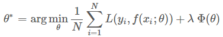

其中，前面的均值函数表示的是经验风险函数，`L` 代表的是损失函数，后面的 `Φ` 是正则化项（regularizer）或者叫惩罚项（penalty term），它可以是 `L1`，也可以是 `L2`，或者其他的正则函数。**整个式子表示的意思是找到使目标函数最小时的 `θ` 值。**下面主要列出几种常见的损失函数。

常用的损失函数有以下几种（基本引用自《统计学习方法》）：

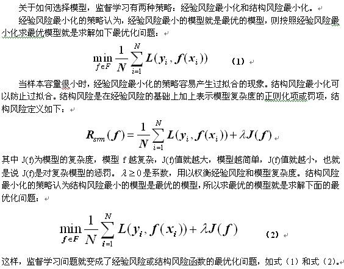

接下来，我们来重点看下 下面几种损失函数。

### 26.1 log对数损失函数（逻辑回归）

有些人可能觉得逻辑回归的损失函数就是平方损失，其实并不是。平方损失函数可以通过线性回归在假设样本是高斯分布的条件下推导得到，而逻辑回归得到的并不是平方损失。在逻辑回归的推导中，它假设样本服从伯努利分布（0-1分布），然后求得满足该分布的似然函数，接着取对数求极值等等。

而逻辑回归并没有求似然函数的极值，而是把极大化当做是一种思想，进而推导出它的经验风险函数为：最小化负的似然函数（即 `max F(y, f(x)) —> min -F(y, f(x)))`。从损失函数的视角来看，它就成了 log损失函数了。

log损失函数的标准形式：

刚刚说到，取对数是为了方便计算极大似然估计，因为在 MLE 中，直接求导比较困难，所以通常都是先取对数再求导找极值点。

损失函数 `L(Y, P(Y|X))` 表达的是样本 `X` 在分类 `Y` 的情况下，使概率 `P(Y|X)` 达到最大值（换言之，就是利用已知的样本分布，找到最有可能（即最大概率）导致这种分布的参数值；或者说什么样的参数才能使我们观测到目前这组数据的概率最大）。因为 log 函数是单调递增的，所以 `logP(Y|X)` 也会达到最大值，因此在前面加上负号之后，最大化 `P(Y|X)` 就等价于最小化 `L` 了。

逻辑回归的 `P(Y=y|x)` 表达式如下（为了将类别标签 `y` 统一为 `1` 和 `0`，下面将表达式分开表示）：

将它带入到上式，通过推导可以得到 logistic 的损失函数表达式，如下：

逻辑回归最后得到的目标式子如下：

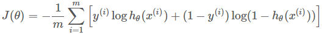

### 26.2 平方损失函数（最小二乘法, Ordinary Least Squares ）
最小二乘法是线性回归的一种，OLS 将问题转化成了一个凸优化问题。在线性回归中，它假设样本和噪声都服从高斯分布（为什么假设成高斯分布呢？其实这里隐藏了一个小知识点，就是中心极限定理，可以参考：https://blog.csdn.net/v_july_v/article/details/8308762），最后通过极大似然估计（MLE）可以推导出最小二乘式子。**最小二乘的基本原则是：最优拟合直线应该是使各点到回归直线的距离和最小的直线，即平方和最小。**

换言之，OLS 是基于距离的，而这个距离就是我们用的最多的**欧几里得距离**。为什么它会选择使用欧式距离作为误差度量呢（即Mean squared error， MSE），主要有以下几个原因：

- 简单，计算方便；
- 欧氏距离是一种很好的相似性度量标准；
- 在不同的表示域变换后特征性质不变。

平方损失（Square loss）的标准形式如下：

当样本个数为 `n` 时，此时的损失函数变为：

**`Y-f(X)` 表示的是残差，整个式子表示的是残差的平方和，而我们的目的就是最小化这个目标函数值（注：该式子未加入正则项），也就是最小化残差的平方和（residual sum of squares，RSS）。**

而在实际应用中，通常会使用均方差（MSE）作为一项衡量指标，公式如下：

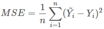

上面提到了线性回归，这里额外补充一句，我们通常说的线性有两种情况，一种是因变量 `y` 是自变量 `x` 的线性函数，一种是因变量 `y` 是参数 `α`的线性函数。在机器学习中，通常指的都是后一种情况。

### 26.3 指数损失函数（Adaboost）

学过 Adaboost 算法的人都知道，它是前向分步加法算法的特例，是一个加和模型，损失函数就是指数函数。在 Adaboost 中，经过 `m` 此迭代之后，可以得到 `fm(x)`:

Adaboost 每次迭代时的目的是为了找到最小化下列式子时的参数 `α` 和 `G`：

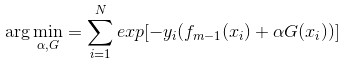

而指数损失函数(exp-loss）的标准形式如下

可以看出，Adaboost 的目标式子就是指数损失，在给定 `n` 个样本的情况下，Adaboost 的损失函数为：

关于 Adaboost 的推导，可以参考：https://blog.csdn.net/v_july_v/article/details/40718799

### 26.4 Hinge损失函数（SVM）
在机器学习算法中，hinge 损失函数和 SVM 是息息相关的。在线性支持向量机中，最优化问题可以等价于下列式子：

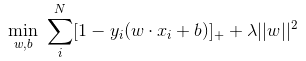

下面来对式子做个变形，令：

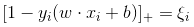

于是，原式就变成了：

如若取 ，式子就可以表示成：

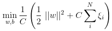

可以看出，该式子与下式非常相似：

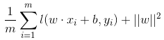

前半部分中的ll就是 hinge 损失函数，而后面相当于 `L2` 正则项。

Hinge 损失函数的标准形式

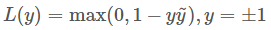

可以看出，当 `|y|>=1` 时，`L(y)=0`。

补充一下：在 libsvm 中一共有 4 中核函数可以选择，对应的是 `-t` 参数分别是：

- 0-线性核；
- 1-多项式核；
- 2-RBF核；
- 3-sigmoid核。

如此，SVM 有第二种理解，即最优化+损失最小，或如 @夏粉_百度所说 “可从损失函数和优化算法角度看SVM，boosting，LR等算法，可能会有不同收获”。

关于 SVM 的更多理解请参考：[支持向量机通俗导论（理解SVM的三层境界）](http://blog.csdn.net/v_july_v/article/details/7624837)

### 26.5 其它损失函数

除了以上这几种损失函数，常用的还有：

- 0-1损失函数

  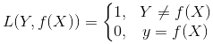

- 绝对值损失函数

  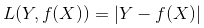

以下是几种损失函数的可视化图像：

## 27. 为什么 xgboost 要用泰勒展开，优势在哪里？

**xgboost 使用了一阶和二阶偏导, 二阶导数有利于梯度下降的更快更准.使用泰勒展开取得函数做自变量的二阶导数形式, 可以在不选定损失函数具体形式的情况下, 仅仅依靠输入数据的值就可以进行叶子分裂优化计算, 本质上也就把损失函数的选取和模型算法优化/参数选择分开了. 这种去耦合增加了xgboost的适用性, 使得它按需选取损失函数, 可以用于分类, 也可以用于回归。**

## 28. 协方差和相关性有什么区别？

**相关性是协方差的标准化格式。**协方差本身很难做比较。例如：如果我们计算工资（$）和年龄（岁）的协方差，因为这两个变量有不同的度量，所以我们会得到不能做比较的不同的协方差。

为了解决这个问题，我们计算相关性来得到一个介于 `-1` 和 `1` 之间的值，就可以忽略它们各自不同的度量。

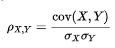

## 29. xgboost 如何寻找最优特征？是有放回还是无放回的呢？

**xgboost 在训练的过程中给出各个特征的增益评分，最大增益的特征会被选出来作为分裂依据, 从而记忆了每个特征对在模型训练时的重要性 -- 从根到叶子中间节点涉及某特征的次数作为该特征重要性排序.**

xgboost 属于 boosting 集成学习方法, 样本是**不放回**的, 因而每轮计算样本不重复. 另一方面, **xgboost支持子采样, 也就是每轮计算可以不使用全部样本, 以减少过拟合**. 进一步地,**xgboost 还有列采样, 每轮计算按百分比随机采样一部分特征, 既提高计算速度又减少过拟合**。

## 30. 谈谈判别式模型和生成式模型？

**判别方法：**由数据直接学习决策函数 `Y = f（X）`，或者由条件分布概率 `P（Y|X）`作为预测模型，即判别模型。

**生成方法：**由数据学习联合概率密度分布函数 `P（X,Y）`,然后求出条件概率分布 `P(Y|X)` 作为预测的模型，即生成模型。

**由生成模型可以得到判别模型，但由判别模型得不到生成模型。**

**常见的判别模型有：**

- K近邻、SVM、决策树、感知机、线性判别分析（LDA）、线性回归、传统的神经网络、逻辑斯蒂回归、boosting、条件随机场

**常见的生成模型有：**

- 朴素贝叶斯、隐马尔可夫模型、高斯混合模型、文档主题生成模型（LDA）、限制玻尔兹曼机

## 31. 线性分类器与非线性分类器的区别以及优劣

线性和非线性是针对，模型参数和输入特征来讲的；比如输入 `x`，模型 `y=ax+ax^2`那么就是非线性模型，如果输入是 `x` 和 `X^2` 则模型是线性的。

- 线性分类器可解释性好，计算复杂度较低，不足之处是模型的拟合效果相对弱些。

- 非线性分类器效果拟合能力较强，不足之处是数据量不足容易过拟合、计算复杂度高、可解释性不好。

**常见的线性分类器有：**

- LR, 贝叶斯分类，单层感知机、线性回归

**常见的非线性分类器：**

- 决策树、RF、GBDT、多层感知机

SVM 两种都有（看线性核还是高斯核）

## 32. L1和L2的区别

L1 范数（L1 norm）是指向量中各个元素绝对值之和，也有个美称叫“稀疏规则算子”（Lasso regularization）。 

比如 向量 A=[1，-1，3]， 那么A的L1范数为 |1|+|-1|+|3|.

**简单总结一下就是： **

- L1范数: 为 `x` 向量各个元素绝对值之和。 
- L2范数: 为 `x` 向量各个元素平方和的 `1/2` 次方，L2 范数又称Euclidean范数或者Frobenius范数 
- Lp范数: 为 `x` 向量各个元素绝对值 `p` 次方和的 `1/p` 次方.

在支持向量机学习过程中，L1 范数实际是一种对于成本函数求解最优的过程，因此，L1 范数正则化通过向成本函数中添加 L1 范数，使得学习得到的结果满足稀疏化，从而方便人类提取特征，即 L1 范数可以使权值稀疏，方便特征提取。 

L2 范数可以防止过拟合，提升模型的泛化能力。

L1 和 L2的差别，为什么一个让绝对值最小，一个让平方最小，会有那么大的差别呢？看导数一个是 `1` 一个是 `w` 便知, **在靠进零附近, L1 以匀速下降到零, 而 L2 则完全停下来了. 这说明 L1 是将不重要的特征(或者说, 重要性不在一个数量级上)尽快剔除, L2 则是把特征贡献尽量压缩最小但不至于为零. **两者一起作用, 就是把重要性在一个数量级(重要性最高的)的那些特征一起平等共事(简言之, 不养闲人也不要超人)。

## 33. L1和L2正则先验分别服从什么分布

面试中遇到的，L1 和 L2 正则先验分别服从什么分布，**L1 是拉普拉斯分布，L2 是高斯分布**。

**先验就是优化的起跑线, 有先验的好处就是可以在较小的数据集中有良好的泛化性能，当然这是在先验分布是接近真实分布的情况下得到的了，从信息论的角度看，向系统加入了正确先验这个信息，肯定会提高系统的性能。**

对参数引入高斯正态先验分布相当于 L2 正则化, 这个大家都熟悉：

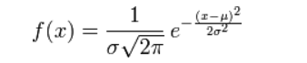

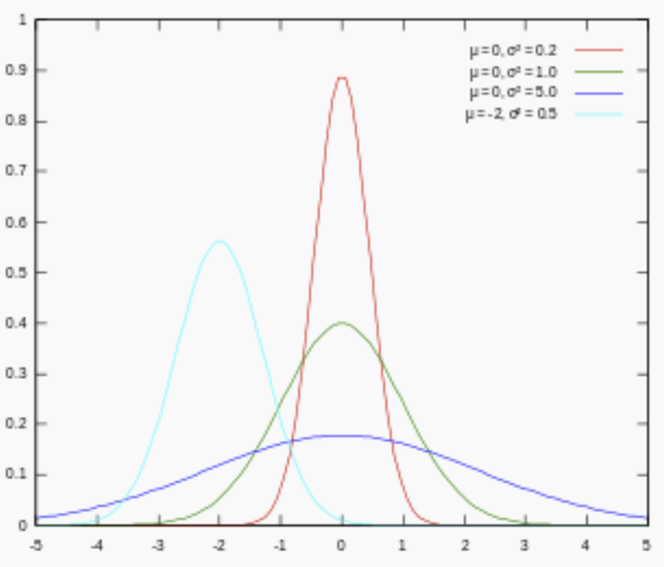

对参数引入拉普拉斯先验等价于 L1 正则化, 如下图：

从上面两图可以看出, **L2 先验趋向零周围, L1 先验趋向零本身。**

## 34. 简单介绍下logistics回归？

Logistic 回归目的是从特征学习出一个 `0/1` 分类模型，而这个模型是将特性的线性组合作为自变量，由于自变量的取值范围是负无穷到正无穷。因此，使用 logistic函数（或称作sigmoid函数）将自变量映射到 (0,1)上，映射后的值被认为是属于 `y=1` 的概率。

假设函数 

其中 `x` 是 `n` 维特征向量，函数 `g` 就是 logistic函数。

而   的图像是

可以看到，将无穷映射到了 `(0,1)`。

而假设函数就是特征属于 `y=1` 的概率。

从而，当我们要判别一个新来的特征属于哪个类时，只需求即可，若大于 0.5 就是 `y=1` 的类，反之属于 `y=0` 类。

## 35. 说一下Adaboost，权值更新公式。当弱分类器是Gm时，每个样本的的权重是w1，w2...，请写出最终的决策公式。

> [Adaboost 算法的原理与推导](http://blog.csdn.net/v_july_v/article/details/40718799)
>
> [说一下Adaboost，权值更新公式。当弱分类器是Gm时，每个样本的的权重是w1，w2...，请写出最终的决策公式。](https://www.julyedu.com/question/big/kp_id/23/ques_id/1002)

## 36. Google是怎么利用贝叶斯方法，实现"拼写检查"的功能。

> [Google是怎么利用贝叶斯方法，实现"拼写检查"的功能。](https://www.julyedu.com/question/big/kp_id/23/ques_id/1004)

## 37. 为什么朴素贝叶斯如此“朴素”？

因为它假定所有的特征在数据集中的作用是同样重要和独立的。正如我们所知，这个假设在现实世界中是很不真实的，因此，说朴素贝叶斯真的很“朴素”。

**朴素贝叶斯模型(Naive Bayesian Model)的朴素(Naive)的含义是"很简单很天真"地假设样本特征彼此独立. 这个假设现实中基本上不存在, 但特征相关性很小的实际情况还是很多的, 所以这个模型仍然能够工作得很好。**

## 38. 请大致对比下plsa和LDA的区别

> [通俗理解LDA主题模型](http://blog.csdn.net/v_july_v/article/details/41209515)

pLSA 中，主题分布和词分布确定后，以一定的概率 、 分别选取具体的主题和词项，生成好文档。而后根据生成好的文档反推其主题分布、词分布时，最终用 EM 算法（极大似然估计思想）求解出了两个未知但固定的参数的值：（由  转换而来）和 （由  转换而来）。

文档 `d` 产生主题 `z` 的概率，主题 `z` 产生单词 `w` 的概率都是两个固定的值。

举个文档 `d` 产生主题 `z` 的例子。给定一篇文档 `d`，主题分布是一定的，比如 `{ P(zi|d), i = 1,2,3 }` 可能就是 `{0.4,0.5,0.1}`  ，表示 `z1`、`z2`、`z3`，这3个主题被文档 `d` 选中的概率都是个固定的值：`P(z1|d) = 0.4`、`P(z2|d) = 0.5`、`P(z3|d) = 0.1`，如下图所示（图截取自沈博PPT上）：

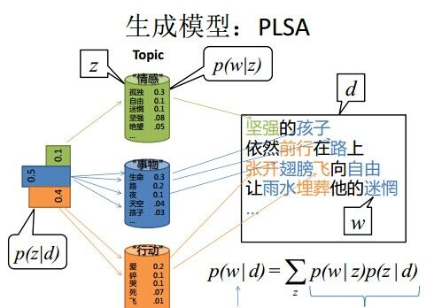

但在贝叶斯框架下的 LDA 中，我们不再认为主题分布（各个主题在文档中出现的概率分布）和词分布（各个词语在某个主题下出现的概率分布）是唯一确定的（而是随机变量），而是有很多种可能。但一篇文档总得对应一个主题分布和一个词分布吧，怎么办呢？LDA 为它们弄了两个 Dirichlet 先验参数，这个 Dirichlet 先验为某篇文档随机抽取出某个主题分布和词分布。

文档 `d` 产生主题 `z`（准确的说，其实是 Dirichlet 先验为文档 `d` 生成主题分布 `Θ`，然后根据主题分布 `Θ` 产生主题 `z`）的概率，主题 `z` 产生单词 `w` 的概率都不再是某两个确定的值，而是随机变量。

还是再次举下文档 `d` 具体产生主题 `z` 的例子。给定一篇文档 `d` ，现在有多个主题 `z1`、`z2`、`z3`，它们的主题分布 `{ P(zi|d), i = 1,2,3 }` 可能是 `{0.4,0.5,0.1}`，也可能是 `{0.2,0.2,0.6}`，即这些主题被 `d` 选中的概率都不再认为是确定的值，可能是 `P(z1|d) = 0.4`、`P(z2|d) = 0.5`、`P(z3|d) = 0.1`，也有可能是 `P(z1|d) = 0.2`、`P(z2|d) = 0.2`、`P(z3|d) = 0.6` 等等，而主题分布到底是哪个取值集合我们不确定（为什么？这就是贝叶斯派的核心思想，把未知参数当作是随机变量，不再认为是某一个确定的值），但其先验分布是 dirichlet 分布，所以可以从无穷多个主题分布中按照 dirichlet 先验随机抽取出某个主题分布出来。如下图所示（图截取自沈博PPT上）：

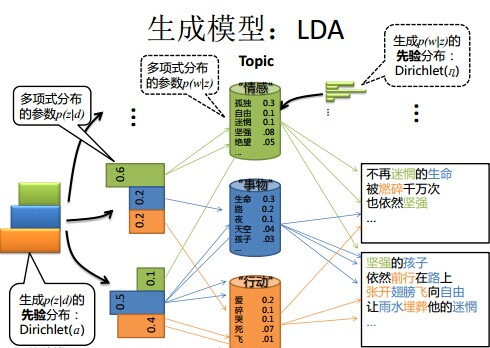

换言之，LDA 在 pLSA 的基础上给这两参数（、）加了两个先验分布的参数（贝叶斯化）：一个主题分布的先验分布 Dirichlet 分布 ，和一个词语分布的先验分布 Dirichlet分布。综上，LDA 真的只是 pLSA 的贝叶斯版本，文档生成后，两者都要根据文档去推断其主题分布和词语分布，只是用的参数推断方法不同，在 pLSA 中用极大似然估计的思想去推断两未知的固定参数，而 LDA则把这两参数弄成随机变量，且加入 dirichlet 先验。

## 39. 请简要说说 EM 算法（期望最大化算法）

> [机器学习&数据挖掘笔记_16（常见面试之机器学习算法思想简单梳理）](http://www.cnblogs.com/tornadomeet/p/3395593.html)
>
> [从最大似然到EM算法浅解](https://blog.csdn.net/zouxy09/article/details/8537620) - CSDN

有时候因为样本的产生和隐含变量有关（隐含变量是不能观察的），而求模型的参数时一般采用最大似然估计，由于含有了隐含变量，所以对似然函数参数求导是求不出来的，这时可以采用 EM 算法来求模型的参数的（对应模型参数个数可能有多个），EM 算法一般分为2步：

- E步：选取一组参数，求出在该参数下隐含变量的条件概率值；
- M步：结合E步求出的隐含变量条件概率，求出似然函数下界函数（本质上是某个期望函数）的最大值。
  重复上面2步直至收敛。

公式如下所示：

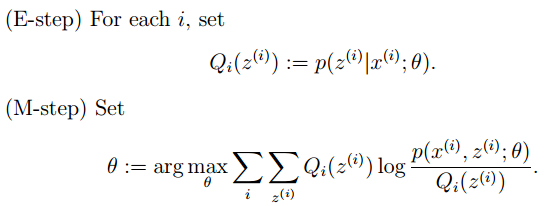

M 步公式中下界函数的推导过程：

EM 算法一个常见的例子就是 GMM 模型，每个样本都有可能由 `k` 个高斯产生，只不过由每个高斯产生的概率不同而已，因此每个样本都有对应的高斯分布（`k` 个中的某一个），此时的隐含变量就是每个样本对应的某个高斯分布。

GMM 的 E 步公式如下（计算每个样本对应每个高斯的概率）：

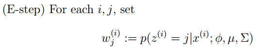

更具体的计算公式为：

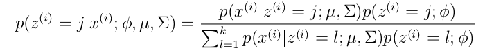

M 步公式如下（计算每个高斯的比重，均值，方差这3个参数）：

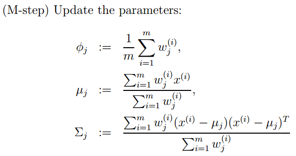

## 40. KNN中的K如何选取的？

关于什么是KNN，可以查看此文：[《从K近邻算法、距离度量谈到KD树、SIFT+BBF算法》](http://blog.csdn.net/v_july_v/article/details/8203674)。KNN 中的 K 值选取对 K 近邻算法的结果会产生重大影响。如李航博士的一书「统计学习方法」上所说：

> 如果选择较小的 K 值，就相当于用较小的领域中的训练实例进行预测，“学习”近似误差会减小，只有与输入实例较近或相似的训练实例才会对预测结果起作用，与此同时带来的问题是“学习”的估计误差会增大，**换句话说，K 值的减小就意味着整体模型变得复杂，容易发生过拟合；**
>
> 如果选择较大的 K 值，就相当于用较大领域中的训练实例进行预测，其优点是可以减少学习的估计误差，但缺点是学习的近似误差会增大。这时候，与输入实例较远（不相似的）训练实例也会对预测器作用，使预测发生错误，**且 K 值的增大就意味着整体的模型变得简单。**
>
> K=N，则完全不足取，因为此时无论输入实例是什么，都只是简单的预测它属于在训练实例中最多的类，模型过于简单，忽略了训练实例中大量有用信息。

在实际应用中，K 值一般取一个比较小的数值，例如采用交叉验证法（简单来说，就是一部分样本做训练集，一部分做测试集）来选择最优的 K 值。

