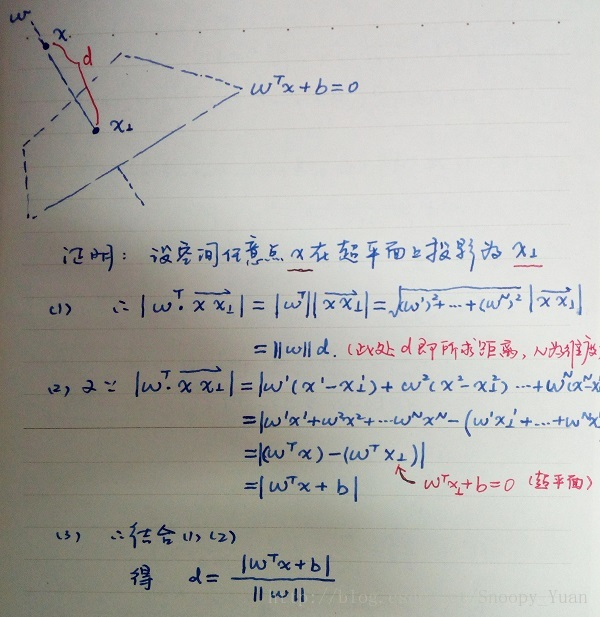
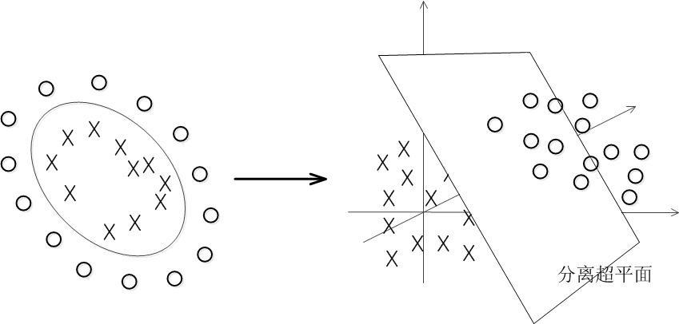
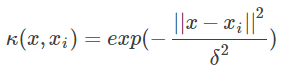
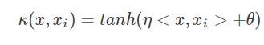
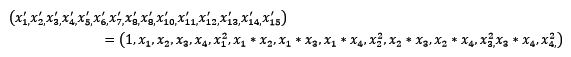
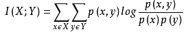

## Index

<!-- TOC -->

* [61. 准备机器学习面试应该了解哪些理论知识？](#61-准备机器学习面试应该了解哪些理论知识)
* [62. 数据不平衡问题](#62-数据不平衡问题)
* [63. 特征比数据量还大时，选择什么样的分类器？](#63-特征比数据量还大时选择什么样的分类器)
* [64. 常见的分类算法有哪些？](#64-常见的分类算法有哪些)
* [65. 常见的监督学习算法有哪些？](#65-常见的监督学习算法有哪些)
* [66. 说说常见的优化算法及其优缺点？](#66-说说常见的优化算法及其优缺点)
* [67. 特征向量的归一化方法有哪些？](#67-特征向量的归一化方法有哪些)
* [68. RF与GBDT之间的区别与联系？](#68-rf与gbdt之间的区别与联系)
* [69. 试证明样本空间中任意点 x 到超平面 (w,b) 的距离为式（6.2）](#69-试证明样本空间中任意点-x-到超平面-wb-的距离为式62)
* [70. 请比较下EM算法、HMM、CRF](#70-请比较下em算法hmmcrf)

  - [70.1 EM算法](#701-em算法)

  - [70.2 HMM算法](#702-hmm算法)

  - [70.3 条件随机场CRF](#703-条件随机场crf)

  - [70.4 HMM和CRF对比](#704-hmm和crf对比)
* [71. 带核的SVM为什么能分类非线性问题？](#71-带核的svm为什么能分类非线性问题)
* [72. 请说说常用核函数及核函数的条件](#72-请说说常用核函数及核函数的条件)

  - [72.1 线性核函数](#721-线性核函数)

  - [72.2 多项式核函数](#722-多项式核函数)

  - [72.3 高斯（RBF）核函数](#723-高斯rbf核函数)

  - [72.4 sigmoid 核函数](#724-sigmoid-核函数)

  - [72.5 核函数的选择](#725-核函数的选择)
* [73. 请具体说说Boosting和Bagging的区别](#73-请具体说说boosting和bagging的区别)

  - [73.1 Bagging 之随机森林](#731-bagging-之随机森林)

  - [73.2 Boosting 之 AdaBoost](#732-boosting-之-adaboost)

  - [73.3 Boosting 之 GBDT](#733-boosting-之-gbdt)

  - [73.4 Boosting 之 Xgboost](#734-boosting-之-xgboost)
* [74. 逻辑回归相关问题](#74-逻辑回归相关问题)

  - [74.1 公式推导一定要会](#741-公式推导一定要会)

  - [74.2 逻辑回归的基本概念](#742-逻辑回归的基本概念)

  - [74.3 L1-norm 和 L2-norm](#743-l1-norm-和-l2-norm)

  - [74.4 LR 和 SVM 对比](#744-lr-和-svm-对比)

  - [74.5 LR 和随机森林区别](#745-lr-和随机森林区别)

  - [74.6 常用的优化方法](#746-常用的优化方法)
* [75. 什么是共线性, 跟过拟合有什么关联?](#75-什么是共线性-跟过拟合有什么关联)
* [76. 机器学习中，有哪些特征选择的工程方法？](#76-机器学习中有哪些特征选择的工程方法)

  - [76.1 特征工程是什么？](#761-特征工程是什么)

  - [76.2 数据预处理](#762-数据预处理)
    - [76.2.1 无量纲化](#7621-无量纲化)
    - [76.2.2 对定量特征二值化](#7622-对定量特征二值化)
    - [76.2.3 对定性特征哑编码](#7623-对定性特征哑编码)
    - [76.2.4 缺失值计算](#7624-缺失值计算)
    - [76.2.5 数据变换](#7625-数据变换)
    - [76.2.6 回顾](#7626-回顾)

  - [76.3 特征选择](#763-特征选择)
    - [76.3.1 Filter](#7631-filter)
    - [76.3.2 Wrapper](#7632-wrapper)
    - [76.3.3 Embedded](#7633-embedded)
    - [76.3.4 回顾](#7634-回顾)

  - [76.4 降维](#764-降维)
    - [76.4.1 主成分分析法（PCA）](#7641-主成分分析法pca)
    - [76.4.2 线性判别分析法（LDA）](#7642-线性判别分析法lda)
* [77. 用贝叶斯机率说明 Dropout 的原理](#77-用贝叶斯机率说明-dropout-的原理)
* [78. 对于维度极低的特征，选择线性还是非线性分类器？](#78-对于维度极低的特征选择线性还是非线性分类器)
* [79. 请问怎么处理特征向量的缺失值](#79-请问怎么处理特征向量的缺失值)
* [80. SVM、LR、决策树的对比](#80-svmlr决策树的对比)

<!-- /TOC -->

## 61. 准备机器学习面试应该了解哪些理论知识？

> [面试官如何判断面试者的机器学习水平？](https://www.zhihu.com/question/62482926) - 知乎


看下来，这些问题的答案基本都在本BAT机器学习面试1000题系列里了。

## 62. 数据不平衡问题

这主要是由于数据分布不平衡造成的。解决方法如下：

- 采样，对小样本加噪声采样，对大样本进行下采样
- 数据生成，利用已知样本生成新的样本
- 进行特殊的加权，如在 Adaboost中 或者 SVM 中
- 采用对不平衡数据集不敏感的算法
- 改变评价标准：用 AUC/ROC 来进行评价
- 采用 Bagging/Boosting/ensemble 等方法
- 在设计模型的时候考虑数据的先验分布

## 63. 特征比数据量还大时，选择什么样的分类器？

> [机器学习面试题大全](http://blog.sina.com.cn/s/blog_178bcad000102x70r.html)

线性分类器，因为维度高的时候，数据一般在维度空间里面会比较稀疏，很有可能线性可分。

## 64. 常见的分类算法有哪些？

SVM、神经网络、随机森林、逻辑回归、KNN、贝叶斯

## 65. 常见的监督学习算法有哪些？ 

感知机、svm、人工神经网络、决策树、逻辑回归

## 66. 说说常见的优化算法及其优缺点？

温馨提示：在回答面试官的问题的时候，往往将问题往大的方面去回答，这样不会陷于小的技术上死磕，最后很容易把自己嗑死了。

**简言之：**

1. **随机梯度下降**

  优点：可以一定程度上解决局部最优解的问题

  缺点：收敛速度较慢

2. **批量梯度下降**

  优点：容易陷入局部最优解

  缺点：收敛速度较快

3. **mini_batch梯度下降**

  综合随机梯度下降和批量梯度下降的优缺点，提取的一个中和的方法。

4. **牛顿法**

  牛顿法在迭代的时候，需要计算 Hessian 矩阵，当维度较高的时候，计算 Hessian 矩阵比较困难

5. **拟牛顿法**

  拟牛顿法是为了改进牛顿法在迭代过程中，计算 Hessian 矩阵而提取的算法，它采用的方式是通过逼近 Hessian 的方式来进行求解。

**具体而言：**

**从每个batch的数据来区分：**

- **梯度下降**：每次使用全部数据集进行训练
  - 优点：得到的是最优解
  - 缺点：运行速度慢，内存可能不够

- **随机梯度下降**：每次使用一个数据进行训练
  - 优点：训练速度快，无内存问题
  - 缺点：容易震荡，可能达不到最优解

- **Mini-batch**梯度下降
  - 优点：训练速度快，无内存问题，震荡较少
  - 缺点：可能达不到最优解

**从优化方法上来分：**

- **随机梯度下降（SGD）**

  - 缺点：

    选择合适的learning	rate比较难、

    对于所有的参数使用同样的learning rate	

    容易收敛到局部最优

    可能困在saddle point

- **SGD + Momentum**

  - 优点：

    积累动量，加速训练

    局部极值附近震荡时，由于动量，跳出陷阱

    梯度方向发生变化时，动量缓解动荡。

- **Nesterov Mementum**

  - 与Mementum类似，优点：

    避免前进太快

    提高灵敏度

- **AdaGrad**

  - 优点：

    控制学习率，每一个分量有各自不同的学习率

    适合稀疏数据

  - 缺点

    依赖一个全局学习率

    学习率设置太大，其影响过于敏感

    后期，调整学习率的分母积累的太大，导致学习率很低，提前结束训练。

- **RMSProp**

  - 优点：

    解决了后期提前结束的问题。

  - 缺点：

    依然依赖全局学习率

- **Adam**
  Adagrad 和 RMSProp的合体

  - 优点：

    结合了 Adagrad 善于处理稀疏梯度和 RMSprop 善于处理非平稳目标的优点

    为不同的参数计算不同的自适应学习率

    也适用于大多非凸优化 - 适用于大数据集和高维空间

- **牛顿法**

  牛顿法在迭代的时候，需要计算 Hessian 矩阵，当维度较高的时候，计算 Hessian 矩阵比较困难

- **拟牛顿法**

  拟牛顿法是为了改进牛顿法在迭代过程中，计算 Hessian 矩阵而提取的算法，它采用的方式是通过逼近 Hessian 的方式来进行求解。

## 67. 特征向量的归一化方法有哪些？

**线性函数转换，表达式如下：**

y=(x-MinValue)/(MaxValue-MinValue)

**对数函数转换，表达式如下：**

y=log10 (x)

**反余切函数转换 ，表达式如下：**

y=arctan(x)*2/PI

**减去均值，除以方差：**

y=(x-means)/ variance

## 68. RF与GBDT之间的区别与联系？

**相同点：**都是由多棵树组成，最终的结果都是由多棵树一起决定。

**不同点：**

- 组成随机森林的树可以分类树也可以是回归树，而 GBDT 只由回归树组成
- 组成随机森林的树可以并行生成，而 GBDT 是串行生成
- 随机森林的结果是多数表决表决的，而 GBDT 则是多棵树累加之和
- 随机森林对异常值不敏感，而 GBDT 对异常值比较敏感
- 随机森林是减少模型的方差，而 GBDT 是减少模型的偏差
- 随机森林不需要进行特征归一化。而 GBDT 则需要进行特征归一化

## 69. 试证明样本空间中任意点 `x` 到超平面 (w,b) 的距离为式（6.2）



## 70. 请比较下EM算法、HMM、CRF

这三个放在一起不是很恰当，但是有互相有关联，所以就放在这里一起说了。注意重点关注算法的思想。 

### 70.1 EM算法 
EM算法是用于含有隐变量模型的极大似然估计或者极大后验估计，**有两步组成：E步，求期望（expectation）；M步，求极大（maxmization）**。本质上EM算法还是一个迭代算法，通过不断用上一代参数对隐变量的估计来对当前变量进行计算，直到收敛。 

注意：**EM算法是对初值敏感的，而且EM是不断求解下界的极大化逼近求解对数似然函数的极大化的算法，也就是说EM算法不能保证找到全局最优值。对于EM的导出方法也应该掌握。 **

### 70.2 HMM算法 
**隐马尔可夫模型是用于标注问题的生成模型。有几个参数`（π，A，B）`：初始状态概率向量 `π`，状态转移矩阵 `A`，观测概率矩阵 `B`。称为马尔科夫模型的三要素。 **

**马尔科夫三个基本问题：**

- **概率计算问题：**给定模型和观测序列，计算模型下观测序列输出的概率。–》**前向后向算法**

- **学习问题：**已知观测序列，估计模型参数，即用极大似然估计来估计参数。–》**Baum-Welch(也就是EM算法)和极大似然估计。**

- **预测问题：**已知模型和观测序列，求解对应的状态序列。–》**近似算法（贪心算法）和维比特算法（动态规划求最优路径）**

### 70.3 条件随机场CRF

给定一组输入随机变量的条件下另一组输出随机变量的条件概率分布密度。**条件随机场假设输出变量构成马尔科夫随机场，而我们平时看到的大多是线性链条随机场，也就是由输入对输出进行预测的判别模型。求解方法为极大似然估计或正则化的极大似然估计。 **

### 70.4 HMM和CRF对比

之所以总把 HMM 和 CRF 进行比较，**主要是因为 CRF 和 HMM 都利用了图的知识，但是 CRF 利用的是马尔科夫随机场（无向图），而 HMM 的基础是贝叶斯网络（有向图）。而且 CRF 也有：概率计算问题、学习问题和预测问题。大致计算方法和 HMM 类似，只不过不需要 EM 算法进行学习问题。**

其根本还是在于基本的理念不同，一个是生成模型，一个是判别模型，这也就导致了求解方式的不同。

## 71. 带核的SVM为什么能分类非线性问题？ 

**核函数的本质是两个函数的內积**，通过核函数将其隐射到高维空间，在高维空间非线性问题转化为线性问题, SVM得到超平面是高维空间的线性分类平面, 如图:



其分类结果也视为低维空间的非线性分类结果, 因而带核的SVM就能分类非线性问题。

## 72. 请说说常用核函数及核函数的条件

我们通常说的核函数指的是正定和函数，其充要条件是对于任意的 `x` 属于 `X`，要求 `K` 对应的 `Gram` 矩阵要是半正定矩阵。**RBF 核径向基，这类函数取值依赖于特定点间的距离，所以拉普拉斯核其实也是径向基核**。SVM 关键是选取核函数的类型。

**常用核函数主要有：**

- 线性内核
- 多项式内核
- 径向基内核（RBF）
- sigmoid核。

### 72.1 线性核函数


线性核，**主要用于线性可分的情况**，我们可以看到特征空间到输入空间的维度是一样的，其参数少速度快，对于线性可分数据，其分类效果很理想，**因此我们通常首先尝试用线性核函数来做分类，看看效果如何，如果不行再换别的**

### 72.2 多项式核函数


**多项式核函数可以实现将低维的输入空间映射到高纬的特征空间，但是多项式核函数的参数多，当多项式的阶数比较高的时候，核矩阵的元素值将趋于无穷大或者无穷小，计算复杂度会大到无法计算。**

### 72.3 高斯（RBF）核函数 



**高斯径向基函数是一种局部性强的核函数，其可以将一个样本映射到一个更高维的空间内，该核函数是应用最广的一个，无论大样本还是小样本都有比较好的性能，而且其相对于多项式核函数参数要少，因此大多数情况下在不知道用什么核函数的时候，优先使用高斯核函数。**

### 72.4 sigmoid 核函数 



**采用 sigmoid 核函数，支持向量机实现的就是一种多层神经网络。**

### 72.5 核函数的选择

因此，在选用核函数的时候，**如果我们对我们的数据有一定的先验知识，就利用先验来选择符合数据分布的核函数；如果不知道的话，通常使用交叉验证的方法，来试用不同的核函数，误差最小的即为效果最好的核函数，或者也可以将多个核函数结合起来，形成混合核函数。**

在吴恩达的课上，也曾经给出过一系列的选择核函数的方法：

- **如果特征的数量大到和样本数量差不多，则选用LR或者线性核的SVM**
- **如果特征的数量小，样本的数量正常，则选用SVM+高斯核函数**
- **如果特征的数量小，而样本的数量很大，则需要手工添加一些特征从而变成第一种情况**

## 73. 请具体说说Boosting和Bagging的区别

### 73.1 Bagging 之随机森林 
随机森林改变了决策树容易过拟合的问题，这主要是由两个操作所优化的：

- Boostrap 从袋内**有放回**的抽取样本值

- 每次随机抽取一定数量的特征（通常为 `sqr(n)`）。 

- 分类问题：采用 Bagging 投票的方式选择类别频次最高的 

- 回归问题：直接取每颗树结果的平均值。

**常见参数：**

1、树最大深度

2、树的个数 

3、节点上的最小样本数

4、特征数(`sqr(n)`)	 oob(out-of-bag)

**误差分析：**

- 将各个树的未采样样本作为预测样本统计误差作为误分率，可以并行计算

**优点：**

- 不需要特征选择

- 可以总结出特征重要性

- 可以处理缺失数据

- 不需要额外设计测试集

**缺点：**

- 在回归上不能输出连续结果

### 73.2 Boosting 之 AdaBoost 

**Boosting 的本质实际上是一个加法模型**，通过改变训练样本权重学习多个分类器并进行一些线性组合。而 **Adaboost 就是加法模型 + 指数损失函数 + 前项分布算法**。Adaboost 就是从弱分类器出发反复训练，在其中不断调整数据权重或者是概率分布，同时提高前一轮被弱分类器误分的样本的权值。最后用分类器进行投票表决（但是分类器的重要性不同）。 

### 73.3 Boosting 之 GBDT 
**将基分类器变成二叉树，回归用二叉回归树，分类用二叉分类树**。和上面的 Adaboost 相比，**回归树的损失函数为平方损失，同样可以用指数损失函数定义分类问题**。但是对于一般损失函数怎么计算呢？

**GBDT（梯度提升决策树）是为了解决一般损失函数的优化问题，方法是用损失函数的负梯度在当前模型的值来模拟回归问题中残差的近似值。 **

注：**由于 GBDT 很容易出现过拟合的问题，所以推荐的 GBDT 深度不要超过 6，而随机森林可以在 15 以上。 **

### 73.4 Boosting 之 Xgboost 

这个工具主要有以下几个特点：

- 支持线性分类器

- 可以自定义损失函数，并且可以用二阶偏导

- 加入了正则化项：叶节点数、每个叶节点输出 score 的 L2-norm

- 支持特征抽样

- 在一定情况下支持并行，只有在建树的阶段才会用到，每个节点可以并行的寻找分裂特征。

## 74. 逻辑回归相关问题

### 74.1 公式推导一定要会

> [8. 简单介绍下LR](./04-1-20七月在线面试题.md)

### 74.2 逻辑回归的基本概念 

这个最好从广义线性模型的角度分析，逻辑回归是假设 `y` 服从 `Bernoulli(柏努利)` 分布。

### 74.3 L1-norm 和 L2-norm 

其实稀疏的根本还是在于 L0-norm 也就是直接统计参数不为 `0` 的个数作为规则项，但实际上却不好执行于是引入了 L1-norm；**而 L1-norm 本质上是假设参数先验是服从 `Laplace(拉普拉斯)` 分布的，而 L2-norm 是假设参数先验为 `Gaussian(高斯)` 分布**，我们在网上看到的通常用图像来解答这个问题的原理就在这。 

**但是 L1-norm 的求解比较困难，可以用坐标轴下降法或是最小角回归法求解。**

### 74.4 LR 和 SVM 对比 

> [机器学习中的损失函数 （着重比较：hinge loss vs softmax loss）](https://blog.csdn.net/u010976453/article/details/78488279) - CSDN
>
> [机器学习-损失函数](http://www.csuldw.com/2016/03/26/2016-03-26-loss-function/)

首先，**LR 和 SVM 最大的区别在于损失函数的选择，LR 的损失函数为 Log 损失（或者说是逻辑损失都可以）、而 SVM 的损失函数为 hinge loss(铰链损失)**

其次，两者都是线性模型。 

最后，SVM只考虑支持向量（也就是和分类相关的少数点） 

### 74.5 LR 和随机森林区别 

**随机森林等树算法都是非线性的，而 LR 是线性的。LR 更侧重全局优化，而树模型主要是局部的优化。** 

### 74.6 常用的优化方法 

> [几种常用的优化方法](https://blog.csdn.net/u014568921/article/details/46534041) - CSDN
>
> [常用优化方法及其原理](https://liangyaorong.github.io/blog/2017/%E5%B8%B8%E7%94%A8%E4%BC%98%E5%8C%96%E6%96%B9%E6%B3%95%E5%8F%8A%E5%85%B6%E5%8E%9F%E7%90%86/)

逻辑回归本身是可以用公式求解的，但是因为需要求逆的复杂度太高，所以才引入了梯度下降算法。 

**一阶方法：** **梯度下降、随机梯度下降、mini 随机梯度下降降法**。随机梯度下降不但速度上比原始梯度下降要快，局部最优化问题时可以一定程度上抑制局部最优解的发生。 

**二阶方法：**牛顿法、拟牛顿法

这里详细说一下牛顿法的基本原理和牛顿法的应用方式。

> 牛顿法其实就是通过切线与 `x` 轴的交点不断更新切线的位置，直到达到曲线与 `x` 轴的交点得到方程解。在实际应用中我们因为常常要求解凸优化问题，也就是要求解函数一阶导数为 `0` 的位置，而牛顿法恰好可以给这种问题提供解决方法。实际应用中牛顿法首先选择一个点作为起始点，并进行一次二阶泰勒展开得到导数为 `0` 的点进行一个更新，直到达到要求，这时牛顿法也就成了二阶求解问题，比一阶方法更快。我们常常看到的 `x` 通常为一个多维向量，这也就引出了 Hessian 矩阵的概念（就是 `x` 的二阶导数矩阵）。

缺点：牛顿法是定长迭代，没有步长因子，所以不能保证函数值稳定的下降，严重时甚至会失败。还有就是牛顿法要求函数一定是二阶可导的。而且计算 Hessian 矩阵的逆复杂度很大。 

**拟牛顿法：** 不用二阶偏导而是构造出 Hessian 矩阵的近似正定对称矩阵的方法称为拟牛顿法。**拟牛顿法的思路就是用一个特别的表达形式来模拟 Hessian 矩阵或者是他的逆使得表达式满足拟牛顿条件**。主要有 DFP 法（逼近 Hession 的逆）、BFGS（直接逼近 Hession 矩阵）、 L-BFGS（可以减少 BFGS 所需的存储空间）。

## 75. 什么是共线性, 跟过拟合有什么关联?

**共线性：**多变量线性回归中，变量之间由于存在高度相关关系而使回归估计不准确。

共线性会造成冗余，导致过拟合。

**解决方法：**排除变量的相关性／加入权重正则。

本题解析来源：@抽象猴，链接：https://www.zhihu.com/question/41233373/answer/145404190

## 76. 机器学习中，有哪些特征选择的工程方法？


本题解析来源：@jasonfreak，链接：http://www.cnblogs.com/jasonfreak/p/5448385.html

目录

1 特征工程是什么？

2 数据预处理

　　2.1 无量纲化

　　　　2.1.1 标准化

　　　　2.1.2 区间缩放法

　　　　2.1.3 标准化与归一化的区别

　　2.2 对定量特征二值化

　　2.3 对定性特征哑编码

　　2.4 缺失值计算

　　2.5 数据变换

　　2.6 回顾

3 特征选择

　　3.1 Filter

　　　　3.1.1 方差选择法

　　　　3.1.2 相关系数法

　　　　3.1.3 卡方检验

　　　　3.1.4 互信息法

　　3.2 Wrapper

　　　　3.2.1 递归特征消除法

　　3.3 Embedded

　　　　3.3.1 基于惩罚项的特征选择法

　　　　3.3.2 基于树模型的特征选择法

　　3.4 回顾

4 降维

　　4.1 主成分分析法（PCA）

　　4.2 线性判别分析法（LDA）

　　4.3 回顾

5 总结

6 参考资料

### 76.1 特征工程是什么？

有这么一句话在业界广泛流传：**数据和特征决定了机器学习的上限，而模型和算法只是逼近这个上限而已**。那特征工程到底是什么呢？顾名思义，其本质是一项工程活动，目的是最大限度地从原始数据中提取特征以供算法和模型使用。通过总结和归纳，人们认为特征工程包括以下方面：


特征处理是特征工程的核心部分，sklearn 提供了较为完整的特征处理方法，包括数据预处理，特征选择，降维等。首次接触到 sklearn，通常会被其丰富且方便的算法模型库吸引，但是这里介绍的特征处理库也十分强大！

本文中使用 sklearn 中的 IRIS（鸢尾花）数据集来对特征处理功能进行说明。IRIS 数据集由 Fisher 在1936 年整理，包含 4 个特征（Sepal.Length（花萼长度）、Sepal.Width（花萼宽度）、Petal.Length（花瓣长度）、Petal.Width（花瓣宽度）），特征值都为正浮点数，单位为厘米。目标值为鸢尾花的分类（Iris Setosa（山鸢尾）、Iris Versicolour（杂色鸢尾），Iris Virginica（维吉尼亚鸢尾））。

导入IRIS数据集的代码如下：

```python
from sklearn.datasets import load_iris

# 导入IRIS数据集
iris = load_iris()

#特征矩阵
iris.data

#目标向量
iris.target
```

### 76.2 数据预处理

通过特征提取，我们能得到未经处理的特征，这时的特征可能有以下问题：

- **不属于同一量纲：**即特征的规格不一样，不能够放在一起比较。无量纲化可以解决这一问题。

- **信息冗余：**对于某些定量特征，其包含的有效信息为区间划分，例如学习成绩，假若只关心“及格”或不“及格”，那么需要将定量的考分，转换成 “1” 和 “0” 表示及格和未及格。二值化可以解决这一问题。

- **定性特征不能直接使用：**某些机器学习算法和模型只能接受定量特征的输入，那么需要将定性特征转换为定量特征。最简单的方式是为每一种定性值指定一个定量值，但是这种方式过于灵活，增加了调参的工作。通常使用哑编码的方式将定性特征转换为定量特征：假设有 N 种定性值，则将这一个特征扩展为 N 种特征，当原始特征值为第 `i` 种定性值时，第 `i` 个扩展特征赋值为 1，其他扩展特征赋值为 0。哑编码的方式相比直接指定的方式，不用增加调参的工作，对于线性模型来说，使用哑编码后的特征可达到非线性的效果。

- **存在缺失值：**缺失值需要补充。

- **信息利用率低：**不同的机器学习算法和模型对数据中信息的利用是不同的，之前提到在线性模型中，使用对定性特征哑编码可以达到非线性的效果。类似地，对定量变量多项式化，或者进行其他的转换，都能达到非线性的效果。

我们使用 sklearn 中的 `preproccessing` 库来进行数据预处理，可以覆盖以上问题的解决方案。

#### 76.2.1 无量纲化

无量纲化使不同规格的数据转换到同一规格。**常见的无量纲化方法有标准化和区间缩放法。标准化的前提是特征值服从正态分布，标准化后，其转换成标准正态分布。区间缩放法利用了边界值信息，将特征的取值区间缩放到某个特点的范围，例如[0, 1]等。**

**标准化：**

经过处理的数据符合标准正态分布，即均值为 0，标准差为 1，其转化函数为：

<a href="https://www.codecogs.com/eqnedit.php?latex=x^*&space;=&space;\frac{x&space;-&space;\mu&space;}{\sigma&space;}" target="_blank"></a>

其中 `μ` 为所有样本数据的均值，`σ` 为所有样本数据的标准差。

使用 `preproccessing` 库的 `StandardScaler` 类对数据进行标准化的代码如下：

```python
from sklearn.preprocessing import StandardScaler

#标准化，返回值为标准化后的数据
StandardScaler().fit_transform(iris.data)
```

**区间缩放法：**

区间缩放法的思路有多种，常见的一种为利用两个最值进行缩放，公式表达为：

<a href="https://www.codecogs.com/eqnedit.php?latex=x'&space;=&space;\frac{x&space;-&space;min(x)}{max(x)&space;-&space;min(x)}" target="_blank"></a>

这种归一化方法比较适用在数值比较集中的情况。这种方法有个缺陷，如果 max 和 min不 稳定，很容易使得归一化结果不稳定，使得后续使用效果也不稳定。**实际使用中可以用经验常量值来替代 max 和 min。**

使用 `preproccessing` 库的 `MinMaxScaler` 类对数据进行区间缩放的代码如下：

```python
from sklearn.preprocessing import MinMaxScaler

#区间缩放，返回值为缩放到[0, 1]区间的数据
MinMaxScaler().fit_transform(iris.data)
```

**标准化与归一化的区别：**

简单来说，**标准化是依照特征矩阵的列处理数据，其通过求z-score的方法，将样本的特征值转换到同一量纲下。归一化是依照特征矩阵的行处理数据，其目的在于样本向量在点乘运算或其他核函数计算相似性时，拥有统一的标准，也就是说都转化为“单位向量”。规则为 l2 的归一化公式如下：**

<a href="https://www.codecogs.com/eqnedit.php?latex=x'&space;=&space;\frac{x}{\sqrt{\sum_i^mx[j]^2}}" target="_blank"></a>

使用 `preproccessing` 库的 `Normalizer` 类对数据进行归一化的代码如下：

```python
from sklearn.preprocessing import Normalizer

#归一化，返回值为归一化后的数据
Normalizer().fit_transform(iris.data)
```

#### 76.2.2 对定量特征二值化

定量特征二值化的核心在于设定一个阈值，大于阈值的赋值为1，小于等于阈值的赋值为0，公式表达如下：

<a href="https://www.codecogs.com/eqnedit.php?latex=x'&space;=&space;\left\{\begin{matrix}&space;1,x&space;>&space;threshold&space;&&space;\\&space;0,x&space;\leq&space;threshold&space;&&space;\end{matrix}\right." target="_blank">&space;threshold&space;&&space;\\&space;0,x&space;\leq&space;threshold&space;&&space;\end{matrix}\right." title="x' = \left\{\begin{matrix} 1,x > threshold & \\ 0,x \leq threshold & \end{matrix}\right." /></a>

使用 `preproccessing` 库的 `Binarizer` 类对数据进行二值化的代码如下：

```python
from sklearn.preprocessing import Binarizer

#二值化，阈值设置为3，返回值为二值化后的数据
Binarizer(threshold=3).fit_transform(iris.data)
```

#### 76.2.3 对定性特征哑编码

由于 IRIS 数据集的特征皆为定量特征，故使用其目标值进行哑编码（实际上是不需要的）。使用 `preproccessing` 库的 `OneHotEncoder` 类对数据进行哑编码的代码如下：

```python
from sklearn.preprocessing import OneHotEncoder

#哑编码，对IRIS数据集的目标值，返回值为哑编码后的数据
OneHotEncoder().fit_transform(iris.target.reshape((-1,1)))
```

#### 76.2.4 缺失值计算

由于 IRIS 数据集没有缺失值，故对数据集新增一个样本，4 个特征均赋值为 NaN，表示数据缺失。使用 `preproccessing` 库的 `Imputer` 类对数据进行缺失值计算的代码如下：

```python
from numpy import vstack, array, nan
from sklearn.preprocessing import Imputer

#缺失值计算，返回值为计算缺失值后的数据
#参数missing_value为缺失值的表示形式，默认为NaN
#参数strategy为缺失值填充方式，默认为mean（均值）
Imputer().fit_transform(vstack((array([nan, nan, nan, nan]), iris.data)))
```

#### 76.2.5 数据变换

常见的数据变换有基于多项式的、基于指数函数的、基于对数函数的。4 个特征，度为 2 的多项式转换公式如下：



使用 `preproccessing` 库的 `PolynomialFeatures` 类对数据进行多项式转换的代码如下：

```python
from sklearn.preprocessing import PolynomialFeatures

#多项式转换
#参数degree为度，默认值为2
PolynomialFeatures().fit_transform(iris.data)
```

基于单变元函数的数据变换可以使用一个统一的方式完成，使用 `preproccessing` 库的 `FunctionTransformer` 对数据进行对数函数转换的代码如下：

```python
from numpy import log1p
from sklearn.preprocessing import FunctionTransformer

#自定义转换函数为对数函数的数据变换
#第一个参数是单变元函数
FunctionTransformer(log1p).fit_transform(iris.data)
```

#### 76.2.6 回顾


### 76.3 特征选择
当数据预处理完成后，我们需要选择有意义的特征输入机器学习的算法和模型进行训练。通常来说，从两个方面考虑来选择特征：

- **特征是否发散：**如果一个特征不发散，例如方差接近于 0，也就是说样本在这个特征上基本上没有差异，这个特征对于样本的区分并没有什么用。
- **特征与目标的相关性：**这点比较显见，与目标相关性高的特征，应当优选选择。除方差法外，本文介绍的其他方法均从相关性考虑。

根据特征选择的形式又可以将特征选择方法分为 3 种：

- **Filter：**过滤法，按照发散性或者相关性对各个特征进行评分，设定阈值或者待选择阈值的个数，选择特征。
- **Wrapper：**包装法，根据目标函数（通常是预测效果评分），每次选择若干特征，或者排除若干特征。
- **Embedded：**嵌入法，先使用某些机器学习的算法和模型进行训练，得到各个特征的权值系数，根据系数从大到小选择特征。类似于Filter方法，但是是通过训练来确定特征的优劣。

我们使用  sklearn 中的 `feature_selection` 库来进行特征选择。

#### 76.3.1 Filter

1. **方差选择法：**

使用方差选择法，先要计算各个特征的方差，然后根据阈值，选择方差大于阈值的特征。使用 `feature_selection` 库的 `VarianceThreshold` 类来选择特征的代码如下：

```python
from sklearn.feature_selection import VarianceThreshold

#方差选择法，返回值为特征选择后的数据
#参数threshold为方差的阈值
VarianceThreshold(threshold=3).fit_transform(iris.data)
```

2. **相关系数法：**

使用相关系数法，先要计算各个特征对目标值的相关系数以及相关系数的 P 值。用 `feature_selection` 库的 `SelectKBest` 类结合相关系数来选择特征的代码如下：

```python
from sklearn.feature_selection import SelectKBest
from scipy.stats import pearsonr

#选择K个最好的特征，返回选择特征后的数据
#第一个参数为计算评估特征是否好的函数，该函数输入特征矩阵和目标向量，输出二元组（评分，P值）的数组，数组第i项为第i个特征的评分和P值。在此定义为计算相关系数
#参数k为选择的特征个数
SelectKBest(lambda X, Y: array(map(lambda x:pearsonr(x, Y), X.T)).T, k=2).fit_transform(iris.data, iris.target)
```

3. **卡方检验：**

**经典的卡方检验是检验定性自变量对定性因变量的相关性**。假设自变量有 N 种取值，因变量有 M 种取值，考虑自变量等于 `i` 且因变量等于 `j` 的样本频数的观察值与期望的差距，构建统计量：

<a href="https://www.codecogs.com/eqnedit.php?latex=x^2&space;=&space;\sum&space;\frac{(A&space;-&space;E)^2}{E}" target="_blank"></a>

这个统计量的含义简而言之就是自变量对因变量的相关性。用 `feature_selection` 库的 `SelectKBest` 类结合卡方检验来选择特征的代码如下：

```python
from sklearn.feature_selection import SelectKBest
from sklearn.feature_selection import chi2

#选择K个最好的特征，返回选择特征后的数据
SelectKBest(chi2, k=2).fit_transform(iris.data, iris.target)
```

4. **互信息法：**

**经典的互信息也是评价定性自变量对定性因变量的相关性的**，互信息计算公式如下：



为了处理定量数据，最大信息系数法被提出，使用 `feature_selection` 库的 `SelectKBest` 类结合最大信息系数法来选择特征的代码如下：

```python
from sklearn.feature_selection import SelectKBest
from minepy import MINE

#由于MINE的设计不是函数式的，定义mic方法将其为函数式的，返回一个二元组，二元组的第2项设置成固定的P值0.5
def mic(x, y):
     m = MINE()
     m.compute_score(x, y)
     return (m.mic(), 0.5)

#选择K个最好的特征，返回特征选择后的数据
SelectKBest(lambda X, Y: array(map(lambda x:mic(x, Y), X.T)).T, k=2).fit_transform(iris.data, iris.target)
```

#### 76.3.2 Wrapper

1. **递归特征消除法：**

递归消除特征法使用一个基模型来进行多轮训练，每轮训练后，消除若干权值系数的特征，再基于新的特征集进行下一轮训练。使用 `feature_selection` 库的 `RFE` 类来选择特征的代码如下：

```python
from sklearn.feature_selection import RFE
from sklearn.linear_model import LogisticRegression

#递归特征消除法，返回特征选择后的数据
#参数estimator为基模型
#参数n_features_to_select为选择的特征个数
RFE(estimator=LogisticRegression(), n_features_to_select=2).fit_transform(iris.data, iris.target)
```

#### 76.3.3 Embedded

1. **基于惩罚项的特征选择法：**

使用带惩罚项的基模型，除了筛选出特征外，同时也进行了降维。使用 `feature_selection` 库的 `SelectFromModel` 类结合带 L1 惩罚项的逻辑回归模型，来选择特征的代码如下：

```python
from sklearn.feature_selection import SelectFromModel
from sklearn.linear_model import LogisticRegression
 
#带L1惩罚项的逻辑回归作为基模型的特征选择
SelectFromModel(LogisticRegression(penalty="l1", C=0.1)).fit_transform(iris.data, iris.target)
```

L1 惩罚项降维的原理在于保留多个对目标值具有同等相关性的特征中的一个，所以没选到的特征不代表不重要。故，可结合 L2 惩罚项来优化。具体操作为：若一个特征在 L1 中的权值为 1，选择在 L2 中权值差别不大且在 L1 中权值为 0 的特征构成同类集合，将这一集合中的特征平分 L1 中的权值，故需要构建一个新的逻辑回归模型：

```python
from sklearn.linear_model import LogisticRegression
 
class LR(LogisticRegression):
     def __init__(self, threshold=0.01, dual=False, tol=1e-4, C=1.0,
                 fit_intercept=True, intercept_scaling=1, class_weight=None,
                 random_state=None, solver='liblinear', max_iter=100,
                 multi_class='ovr', verbose=0, warm_start=False, n_jobs=1):

        #权值相近的阈值
        self.threshold = threshold
         LogisticRegression.__init__(self, penalty='l1', dual=dual, tol=tol, C=C,
                  fit_intercept=fit_intercept, intercept_scaling=intercept_scaling, class_weight=class_weight,
                  random_state=random_state, solver=solver, max_iter=max_iter,
                  multi_class=multi_class, verbose=verbose, warm_start=warm_start, n_jobs=n_jobs)
         #使用同样的参数创建L2逻辑回归
         self.l2 = LogisticRegression(penalty='l2', dual=dual, tol=tol, C=C, fit_intercept=fit_intercept, intercept_scaling=intercept_scaling, class_weight = class_weight, random_state=random_state, solver=solver, max_iter=max_iter, multi_class=multi_class, verbose=verbose, warm_start=warm_start, n_jobs=n_jobs)
 
     def fit(self, X, y, sample_weight=None):
         #训练L1逻辑回归
         super(LR, self).fit(X, y, sample_weight=sample_weight)
         self.coef_old_ = self.coef_.copy()
         #训练L2逻辑回归
         self.l2.fit(X, y, sample_weight=sample_weight)
 
         cntOfRow, cntOfCol = self.coef_.shape
         #权值系数矩阵的行数对应目标值的种类数目
         for i in range(cntOfRow):
             for j in range(cntOfCol):
                 coef = self.coef_[i][j]
                 #L1逻辑回归的权值系数不为0
                 if coef != 0:
                     idx = [j]
                     #对应在L2逻辑回归中的权值系数
                     coef1 = self.l2.coef_[i][j]
                     for k in range(cntOfCol):
                         coef2 = self.l2.coef_[i][k]
                         #在L2逻辑回归中，权值系数之差小于设定的阈值，且在L1中对应的权值为0
                         if abs(coef1-coef2) < self.threshold and j != k and self.coef_[i][k] == 0:
                             idx.append(k)
                     #计算这一类特征的权值系数均值
                     mean = coef / len(idx)
                     self.coef_[i][idx] = mean
         return self
```

使用 `feature_selection` 库的 `SelectFromModel` 类结合带 L1 以及 L2 惩罚项的逻辑回归模型，来选择特征的代码如下：

```python
from sklearn.feature_selection import SelectFromModel

#带L1和L2惩罚项的逻辑回归作为基模型的特征选择
#参数threshold为权值系数之差的阈值
SelectFromModel(LR(threshold=0.5, C=0.1)).fit_transform(iris.data, iris.target)
```

2. **基于树模型的特征选择法：**

树模型中 GBDT 也可用来作为基模型进行特征选择，使用 `feature_selection` 库的 `SelectFromModel` 类结合 GBDT 模型，来选择特征的代码如下：

```python
from sklearn.feature_selection import SelectFromModel
from sklearn.ensemble import GradientBoostingClassifier

#GBDT作为基模型的特征选择
SelectFromModel(GradientBoostingClassifier()).fit_transform(iris.data, iris.target)
```

#### 76.3.4 回顾


### 76.4 降维
当特征选择完成后，可以直接训练模型了，但是可能由于特征矩阵过大，导致计算量大，训练时间长的问题，因此降低特征矩阵维度也是必不可少的。常见的降维方法除了以上提到的基于 L1 惩罚项的模型以外，另外还有主成分分析法（PCA）和线性判别分析（LDA），线性判别分析本身也是一个分类模型。

PCA 和 LDA 有很多的相似点，其本质是要将原始的样本映射到维度更低的样本空间中，但是 PCA 和 LDA 的映射目标不一样：**PCA 是为了让映射后的样本具有最大的发散性；而 LDA 是为了让映射后的样本有最好的分类性能。所以说 PCA 是一种无监督的降维方法，而 LDA 是一种有监督的降维方法。**

#### 76.4.1 主成分分析法（PCA）

使用 `decomposition` 库的 `PCA` 类选择特征的代码如下：

```python
from sklearn.decomposition import PCA

#主成分分析法，返回降维后的数据
#参数n_components为主成分数目
PCA(n_components=2).fit_transform(iris.data)
```

#### 76.4.2 线性判别分析法（LDA）

使用 `lda` 库的 `LDA` 类选择特征的代码如下：

```python
from sklearn.lda import LDA

#线性判别分析法，返回降维后的数据
#参数n_components为降维后的维数
LDA(n_components=2).fit_transform(iris.data, iris.target)
```

## 77. 用贝叶斯机率说明 Dropout 的原理

> [最好的Dropout讲解](http://bi.dataguru.cn/article-10459-1.html) - 炼数成金

回想一下使用 Bagging 学习,我们定义 `k` 个不同的模型,从训练集有替换采样 构造 `k` 个不同的数据集,然后在训练集上训练模型 `i`。

Dropout 的目标是在指数 级数量的神经网络上近似这个过程。Dropout 训练与 Bagging 训练不太一样。

**在 Bagging 的情况下,所有模型是独立的。**

**在 Dropout 的情况下, 模型是共享参数的,**其中每个模型继承的父神经网络参 数的不同子集。参数共享使得在有限可用的内存下代表指数数量的模型变得可能。 在 Bagging 的情况下,每一个模型在其相应训练集上训练到收敛。

在 Dropout 的情况下,通常大部分模型都没有显式地被训练,通常该模型很大,以致到宇宙毁灭都不 能采样所有可能的子网络。取而代之的是,可能的子网络的一小部分训练单个步骤,参数共享导致剩余的子网络能有好的参数设定。

## 78. 对于维度极低的特征，选择线性还是非线性分类器？

非线性分类器，低维空间可能很多特征都跑到一起了，导致线性不可分。
1. 如果 Feature 的数量很大，跟样本数量差不多，这时候选用 LR 或者是 Linear Kernel 的 SVM
2. 如果 Feature 的数量比较小，样本数量一般，不算大也不算小，选用 SVM + Gaussian Kernel
3. 如果 Feature 的数量比较小，而样本数量很多，需要手工添加一些 feature 变成第一种情况。

## 79. 请问怎么处理特征向量的缺失值

一方面，**缺失值较多. 直接将该特征舍弃掉**，否则可能反倒会带入较大的 noise，对结果造成不良影响。

另一方面**缺失值较少, 其余的特征缺失值都在 10% 以内**，我们可以采取很多的方式来处理:

- 把 NaN 直接作为一个特征，假设用 0 表示
- 用均值填充
- 用随机森林等算法预测填充

## 80. SVM、LR、决策树的对比

**模型复杂度：**

- SVM 支持核函数，可处理线性非线性问题
- LR 模型简单，训练速度快，适合处理线性问题
- 决策树容易过拟合，需要进行剪枝

**损失函数：**

- SVM hinge loss（铰链损失）
- LR L2 正则化
- adaboost 指数损失

**数据敏感度：**

- SVM 添加容忍度对 outlier 不敏感，只关心支持向量，且需要先做归一化;
- LR 对远点敏感

**数据量：**

- 数据量大就用 LR
- 数据量小且特征少就用 SVM 非线性核


