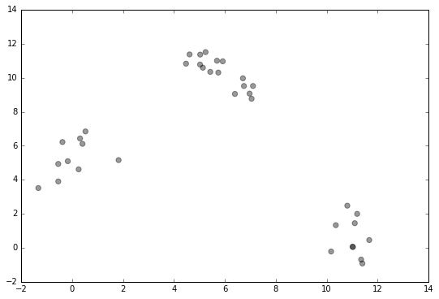
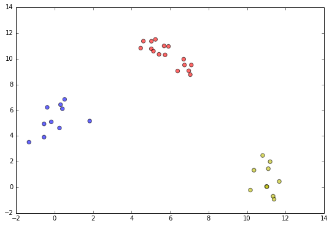
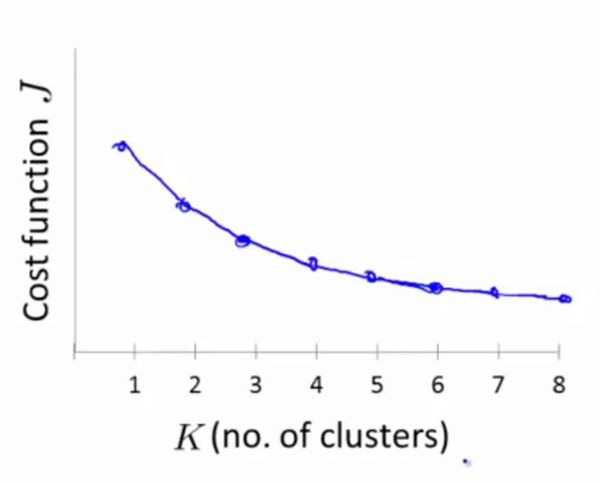
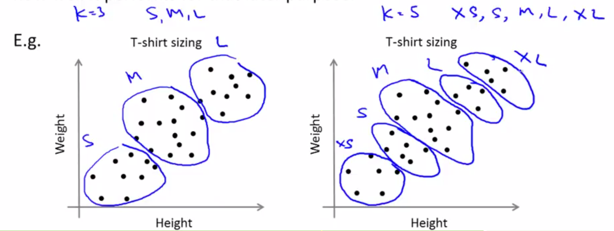
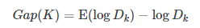
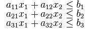
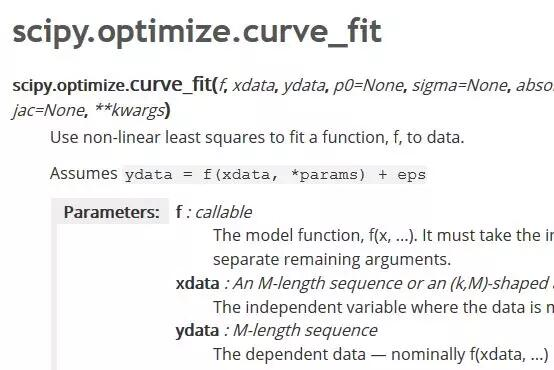
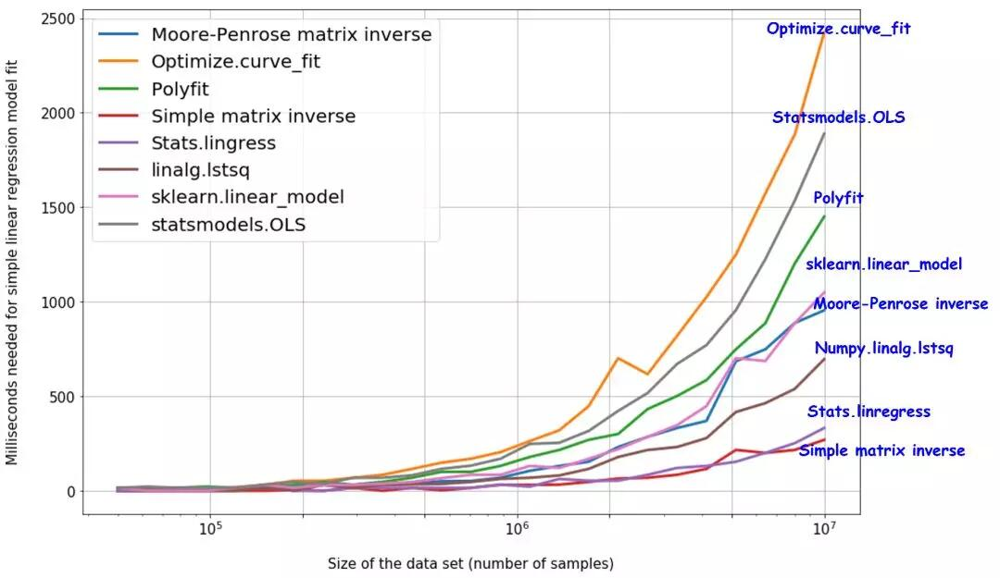

## Index

<!-- TOC -->

* [81. 什么是 ill-condition 病态问题？](#81-什么是-ill-condition-病态问题)
* [82. 简述 KNN 最近邻分类算法的过程？](#82-简述-knn-最近邻分类算法的过程)
* [83. 常用的聚类划分方式有哪些？列举代表算法](#83-常用的聚类划分方式有哪些列举代表算法)
* [84. 什么是偏差与方差？](#84-什么是偏差与方差)

  - [84.1 导致偏差和方差的原因](#841-导致偏差和方差的原因)
  - [84.2 深度学习中的偏差与方差](#842-深度学习中的偏差与方差)

  - [84.3 偏差与方差的计算公式](#843-偏差与方差的计算公式)

  - [84.4 避免过拟合和欠拟合](#844-避免过拟合和欠拟合)

  - [84.5 偏差与方差的权衡（过拟合与模型复杂度的权衡）](#845-偏差与方差的权衡过拟合与模型复杂度的权衡)

  - [84.6 防止过拟合方法](#846-防止过拟合方法)
* [85. 解决 bias 和 Variance 问题的方法是什么？](#85-解决-bias-和-variance-问题的方法是什么)
* [86. 采用 EM 算法求解的模型有哪些，为什么不用牛顿法或梯度下降法？](#86-采用-em-算法求解的模型有哪些为什么不用牛顿法或梯度下降法)
* [87. xgboost 怎么给特征评分？](#87-xgboost-怎么给特征评分)
* [88. 什么是 OOB？随机森林中 OOB 是如何计算的，它有什么优缺点？](#88-什么是-oob随机森林中-oob-是如何计算的它有什么优缺点)
* [89. 推导朴素贝叶斯分类 P(c|d)，文档 d（由若干 word 组成），求该文档属于类别 c 的概率， 并说明公式中哪些概率可以利用训练集计算得到](#89-推导朴素贝叶斯分类-pcd文档-d由若干-word-组成求该文档属于类别-c-的概率-并说明公式中哪些概率可以利用训练集计算得到)
* [90. 请写出你了解的机器学习特征工程操作，以及它的意义](#90-请写出你了解的机器学习特征工程操作以及它的意义)

  - [90.1 数据与特征处理包括](#901-数据与特征处理包括)

  - [90.2 特征选择包括：](#902-特征选择包括)

  - [90.3 降纬](#903-降纬)
* [91. 请写出你对 VC 维的理解和认识](#91-请写出你对-vc-维的理解和认识)
* [92. kmeans 聚类中，如何确定k的大小](#92-kmeans-聚类中如何确定k的大小)

  - [92.1 按需选择](#921-按需选择)

  - [92.2 观察法](#922-观察法)

  - [92.3 手肘法 Elbow Method](#923-手肘法-elbow-method)

  - [92.4 Gap Statistic（差距统计）法](#924-gap-statistic差距统计法)
* [93. 请用 Python 实现线性回归，并思考更高效的实现方式](#93-请用-python-实现线性回归并思考更高效的实现方式)
* [94. 怎么理解 “机器学习的各种模型与他们各自的损失函数一一对应？”](#94-怎么理解-机器学习的各种模型与他们各自的损失函数一一对应)
* [95. 给你一个有 1000 列和 1 百万行的训练数据集。这个数据集是基于分类问题的](#95-给你一个有-1000-列和-1-百万行的训练数据集这个数据集是基于分类问题的)
* [96. 问2：在 PCA 中有必要做旋转变换吗？](#96-问2在-pca-中有必要做旋转变换吗)
* [97. 给你一个数据集，这个数据集有缺失值，且这些缺失值分布在离中值有 1 个标准偏差的范围内。百分之多少的数据不会受到影响？为什么？](#97-给你一个数据集这个数据集有缺失值且这些缺失值分布在离中值有-1-个标准偏差的范围内百分之多少的数据不会受到影响为什么)
* [98. 给你一个癌症检测的数据集。你已经建好了分类模型，取得了 96％ 的精度。为什么你还是不满意你的模型性能？你可以做些什么呢？](#98-给你一个癌症检测的数据集你已经建好了分类模型取得了-96-的精度为什么你还是不满意你的模型性能你可以做些什么呢)
* [99. 为什么朴素贝叶斯如此“朴素”？](#99-为什么朴素贝叶斯如此朴素)
* [100. 解释朴素贝叶斯算法里面的先验概率、似然估计和边际似然估计？](#100-解释朴素贝叶斯算法里面的先验概率似然估计和边际似然估计)
* [101. 时间序列数据在决策树和时间序列回归模型中的表现](#101-时间序列数据在决策树和时间序列回归模型中的表现)
* [102. 关于帮助食品配送公司节省更多钱的问题](#102-关于帮助食品配送公司节省更多钱的问题)
* [103. 你意识到你的模型受到低偏差和高方差问题的困扰。应该使用哪种算法来解决问题呢？为什么？](#103-你意识到你的模型受到低偏差和高方差问题的困扰应该使用哪种算法来解决问题呢为什么)
* [104. 给你一个数据集。该数据集包含很多变量，你知道其中一些是高度相关的。](#104-给你一个数据集该数据集包含很多变量你知道其中一些是高度相关的)
* [105. 模型融合的问题](#105-模型融合的问题)
* [106. KNN和KMEANS聚类（kmeans clustering）有什么不同？](#106-knn和kmeans聚类kmeans-clustering有什么不同)
* [107. 真阳性率和召回有什么关系？写出方程式](#107-真阳性率和召回有什么关系写出方程式)
* [108. 截距在回归模型里的意义](#108-截距在回归模型里的意义)
* [109. 多重共线性问题](#109-多重共线性问题)
* [110. 什么时候Ridge回归优于Lasso回归？](#110-什么时候ridge回归优于lasso回归)
* [111. 全球平均温度的上升导致世界各地的海盗数量减少。这是否意味着海盗的数量减少引起气候变化？](#111-全球平均温度的上升导致世界各地的海盗数量减少这是否意味着海盗的数量减少引起气候变化)
* [112. 如何在一个数据集上选择重要的变量？给出解释](#112-如何在一个数据集上选择重要的变量给出解释)
* [113. 是否有可能捕获连续变量和分类变量之间的相关性？如果可以的话，怎样做？](#113-是否有可能捕获连续变量和分类变量之间的相关性如果可以的话怎样做)
* [114. Gradient boosting 算法（GBM）和随机森林都是基于树的算法，它们有什么区别？](#114-gradient-boosting-算法gbm和随机森林都是基于树的算法它们有什么区别)
* [115. 运行二元分类树算法很容易，但是你知道一个树是如何做分割的吗，即树如何决定把哪些变量分到哪个根节点和后续节点上？](#115-运行二元分类树算法很容易但是你知道一个树是如何做分割的吗即树如何决定把哪些变量分到哪个根节点和后续节点上)
* [116. 你已经建了一个有10000棵树的随机森林模型。在得到0.00的训练误差后，你非常高兴。但是，验证错误是34.23。到底是怎么回事？你还没有训练好你的模型吗？](#116-你已经建了一个有10000棵树的随机森林模型在得到000的训练误差后你非常高兴但是验证错误是3423到底是怎么回事你还没有训练好你的模型吗)
* [117. 你有一个数据集，变量个数 p 大于观察值个数 n。为什么用 OLS 是一个不好的选择？用什么技术最好？为什么？](#117-你有一个数据集变量个数-p-大于观察值个数-n为什么用-ols-是一个不好的选择用什么技术最好为什么)
* [118. 什么是凸包？（提示：想一想SVM）其他方法还包括子集回归、前向逐步回归。](#118-什么是凸包提示想一想svm其他方法还包括子集回归前向逐步回归)
* [119. 我们知道，一位有效编码会增加数据集的维度。但是，标签编码不会。为什么？](#119-我们知道一位有效编码会增加数据集的维度但是标签编码不会为什么)
* [120. 你会在时间序列数据集上使用什么交叉验证技术？是用 k 倍或 LOOCV？](#120-你会在时间序列数据集上使用什么交叉验证技术是用-k-倍或-loocv)

<!-- /TOC -->

## 81. 什么是 ill-condition 病态问题？

**训练完的模型，测试样本稍作修改就会得到差别很大的结果，就是病态问题**，模型对未知数据的预测能力很差，即泛化误差大。

## 82. 简述 KNN 最近邻分类算法的过程？

1. 计算测试样本和训练样本中每个样本点的距离（常见的距离度量有欧式距离，马氏距离等）；
2. 对上面所有的距离值进行排序；
3. 选前 `k` 个最小距离的样本；
4. 根据这 `k` 个样本的标签进行投票，得到最后的分类类别；

## 83. 常用的聚类划分方式有哪些？列举代表算法

1. **基于划分的聚类: ** K-means，k-medoids，CLARANS。
2. **基于层次的聚类：**AGNES（自底向上），DIANA（自上向下）。
3. **基于密度的聚类：**DBSACN，OPTICS，BIRCH(CF-Tree)，CURE。
4. **基于网格的方法：**STING，WaveCluster。
5. **基于模型的聚类：**EM, SOM，COBWEB。

## 84. 什么是偏差与方差？

- **偏差**与**方差**分别是用于衡量一个模型**泛化误差**的两个方面；
  - 模型的**偏差**，指的是模型预测的**期望值**与**真实值**之间的差；
  - 模型的**方差**，指的是模型预测的**期望值**与**预测值**之间的差平方和；

- 在**监督学习**中，模型的**泛化误差**可**分解**为偏差、方差与噪声之和。

  <div align="center"><a href="https://www.codecogs.com/eqnedit.php?latex=Err(x)&space;=&space;Bias^2&space;&plus;&space;Variance&space;&plus;&space;Noise" target="_blank"></a></div>

- **偏差**用于描述模型的**拟合能力**
  **方差**用于描述模型的**稳定性**


- 偏差：`Bias`反映的是模型在样本上的输出与真实值之间的误差，即模型本身的精准度，即算法本身的拟合能力
- 方差：`Variance`反映的是模型每一次输出结果与模型输出期望之间的误差，即模型的稳定性。反应预测的波动情况。
- 误差：`Err(x)` 也叫泛化误差
- 欠拟合会出现高偏差问题
- 过拟合会出现高方差问题

### 84.1 导致偏差和方差的原因

- 偏差通常是由于我们对学习算法做了错误的假设，或者模型的复杂度不够；
  - 比如真实模型是一个二次函数，而我们假设模型为一次函数，这就会导致偏差的增大（欠拟合）；
  - **由偏差引起的误差**通常在**训练误差**上就能体现，或者说训练误差主要是由偏差造成的
- 方差通常是由于模型的复杂度相对于训练集过高导致的；
  - 比如真实模型是一个简单的二次函数，而我们假设模型是一个高次函数，这就会导致方差的增大（过拟合）；
  - **由方差引起的误差**通常体现在测试误差相对训练误差的**增量**上。

### 84.2 深度学习中的偏差与方差

- 神经网络的拟合能力非常强，因此它的**训练误差**（偏差）通常较小；
- 但是过强的拟合能力会导致较大的方差，使模型的测试误差（**泛化误差**）增大；
- 因此深度学习的核心工作之一就是研究如何降低模型的泛化误差，这类方法统称为**正则化方法**。

### 84.3 偏差与方差的计算公式

- 记在**训练集 D** 上学得的模型为

  <div align="center"><a href="https://www.codecogs.com/eqnedit.php?latex=f(x;D)" target="_blank"></a></div>

  模型的**期望预测**为

  <div align="center"><a href="https://www.codecogs.com/eqnedit.php?latex=\hat&space;f(x)&space;=&space;\Bbb&space;E_{D}[f(x;&space;D)]" target="_blank"></a></div>

- **偏差**（Bias）

  <div align="center"><a href="https://www.codecogs.com/eqnedit.php?latex=bias^2(x)&space;=&space;(\hat&space;f(x)&space;-&space;y)^2" target="_blank"></a></div>

  > **偏差**度量了学习算法的期望预测与真实结果的偏离程度，即刻画了学习算法本身的拟合能力；

- **方差**（Variance）

  <div align="center"><a href="https://www.codecogs.com/eqnedit.php?latex=var(x)&space;=&space;\Bbb&space;E_{D}[(f(x;&space;D)&space;-&space;\hat&space;f(x))^2]" target="_blank"></a></div>

  > **方差**度量了同样大小的**训练集的变动**所导致的学习性能的变化，即刻画了数据扰动所造成的影响（模型的稳定性）；

- **噪声**则表达了在当前任务上任何学习算法所能达到的期望泛化误差的下界，即刻画了学习问题本身的难度。
- “**偏差-方差分解**”表明模型的泛化能力是由算法的能力、数据的充分性、任务本身的难度共同决定的。

### 84.4 避免过拟合和欠拟合

**避免欠拟合（刻画不够）**

- 寻找更好的特征-----具有代表性的
- 用更多的特征-----增大输入向量的维度

**避免过拟合（刻画太细，泛化太差）**

- 增大数据集合-----使用更多的数据，噪声点比重减少
- 减少数据特征-----减小数据维度，高维空间密度小
- 正则化方法-----即在对模型的目标函数（objective function）或代价函数（cost function）加上正则项
- 交叉验证方法

### 84.5 偏差与方差的权衡（过拟合与模型复杂度的权衡）

- 给定学习任务，

  - 当训练不足时，模型的**拟合能力不够**（数据的扰动不足以使模型产生显著的变化），此时**偏差**主导模型的泛化误差；
  - 随着训练的进行，模型的**拟合能力增强**（模型能够学习数据发生的扰动），此时**方差**逐渐主导模型的泛化误差；
  - 当训练充足后，模型的**拟合能力过强**（数据的轻微扰动都会导致模型产生显著的变化），此时即发生**过拟合**（训练数据自身的、非全局的特征也被模型学习了）

- 偏差和方差的关系和**模型容量**（模型复杂度）、**欠拟合**和**过拟合**的概念紧密相联

  

  - 当模型的容量增大（x 轴）时， 偏差（用点表示）随之减小，而方差（虚线）随之增大
  - 沿着 x 轴存在**最佳容量**，**小于最佳容量会呈现欠拟合**，**大于最佳容量会导致过拟合**。

  > 《深度学习》 5.4.4 权衡偏差和方差以最小化均方误差

### 84.6 防止过拟合方法

- 参数范数惩罚（Parameter Norm Penalties）
- 数据增强（Dataset Augmentation）
- 提前终止（Early Stopping）
- 参数绑定与参数共享（Parameter Tying and Parameter Sharing）
- Bagging 和其他集成方法
- Dropout
- 批标准化（Batch Normalization）

## 85. 解决 bias 和 Variance 问题的方法是什么？

**High bias （欠拟合）解决方案：**Boosting、复杂模型（非线性模型、增加神经网络中的层）、更多特征
**High Variance（过拟合）解决方案：**bagging、简化模型、降维

具体而言

**高偏差, **可以用 boosting 模型, 对预测残差进行优化, 直接降低了偏差. 也可以用高模型容量的复杂模型(比如非线性模型, 深度神经网络), 更多的特征, 来增加对样本的拟合度.

**高方差, **一般使用平均值法, 比如 bagging, 或者模型简化/降维方法, 来降低方差.

高偏差和高方差都是不好的, 我们应该加以避免. 但是它们又是此消彼长的关系, 所以必须权衡考虑. 一般情况下, 交叉验证训练可以取得比较好的平衡:

> 将原始样本均分成 `K` 组, 将每组样本分别做一次验证集,其余的 `K-1` 组子集数据作为训练集,这样会得到 `K` 个模型, 这 `K` 个模型可以并发训练以加速. 用这 `K` 个模型最终的验证集的分类准确率的平均数作为此 `K-CV` 下分类器的性能指标. `K` 一般大于等于 `3`, 而 `K-CV` 的实验共需要建立 `k ` 个 models，并计算 `k` 次 test sets 的平均预测正确率。

在实作上，`k` 要够大才能使各回合中的 训练样本数够多，一般而言 `k=10` (作为一个经验参数)算是相当足够了。

## 86. 采用 EM 算法求解的模型有哪些，为什么不用牛顿法或梯度下降法？

用 EM 算法求解的模型一般有 GMM 或者协同过滤，k-means 其实也属于 EM。

**EM 算法一定会收敛，但是可能收敛到局部最优**。由于求和的项数将随着隐变量的数目指数上升，会给梯度计算带来麻烦。

## 87. xgboost 怎么给特征评分？

在训练的过程中，通过 Gini 指数选择分离点的特征，一个特征被选中的次数越多，那么该特征评分越高。

```python
[python] # feature importance  
print(model.feature_importances_)  
# plot  pyplot.bar(range(len(model.feature_importances_)), model.feature_importances_)  
pyplot.show()  ==========  
# plot feature importance  
plot_importance(model)  
pyplot.show()
```

## 88. 什么是 OOB？随机森林中 OOB 是如何计算的，它有什么优缺点？

bagging 方法中 Bootstrap 每次约有 `1/3` 的样本不会出现在 Bootstrap 所采集的样本集合中，当然也就没有参加决策树的建立，把这 `1/3` 的数据称为袋外数据 oob（out of bag）,它可以用于取代测试集误差估计方法。

袋外数据(oob)误差的计算方法如下：

> 对于已经生成的随机森林,用袋外数据测试其性能,假设袋外数据总数为 O ,用这 O 个袋外数据作为输入,带进之前已经生成的随机森林分类器,分类器会给出 O 个数据相应的分类,因为这 O 条数据的类型是已知的,则用正确的分类与随机森林分类器的结果进行比较,统计随机森林分类器分类错误的数目,设为 X ,则袋外数据误差大小=X/O ;这已经经过证明是**无偏估计**的,所以在随机森林算法中不需要再进行交叉验证或者单独的测试集来获取测试集误差的无偏估计。 

## 89. 推导朴素贝叶斯分类 P(c|d)，文档 d（由若干 word 组成），求该文档属于类别 c 的概率， 并说明公式中哪些概率可以利用训练集计算得到

根据贝叶斯公式：

<a href="https://www.codecogs.com/eqnedit.php?latex=P(c|d)&space;=&space;\frac{P(d|c)P(c)}{P(d)}" target="_blank"></a>

这里，分母 `P(d)` 不必计算，因为对于每个类都是相等的。 分子中，`P(c)` 是每个类别的先验概率，可以从训练集直接统计，`P(d|c)` 根据独立性假设，可以写成如下 `P(d|c)=￥P(wi|c)`（`￥`符号表示对 `d` 中每个词 `i` 在 `c` 类下概率的连乘），`P(wi|c)` 也可以从训练集直接统计得到。 至此，对未知类别的 `d` 进行分类时，类别为 `c=argmaxP(c)￥P(wi|c)`。

## 90. 请写出你了解的机器学习特征工程操作，以及它的意义

特征工程包括**数据与特征处理、特征选择和降纬三部分**。

### 90.1 数据与特征处理包括

1. 数据选择、清洗、采样
   - 数据格式化
   - 数据清洗，填充缺失值、去掉脏数据，将不可信的样本丢掉，缺省值极多的字段考虑不用
   - 采样：针对正负样本不平衡的情况，当正样本远大于负样本时，且量都很大时，使用下采样，量不大时，可采集更多的数据或oversampling或修改损失函数；采样过程中可利用分层抽样保持不同类别数据的比例

2. 不同类型数据的特征处理
   - **数值型：**幅度调整/归一化、log等变化、统计值（例如max、min、mean、std）、离散化、分桶等
   - **类别型：**one-hot 编码等
   - **时间型：** 提取出连续值的持续时间和间隔时间；提取出离散值的“年”、“月”、“日”、“一年中哪个星期/季度”、“一周中的星期几”、“工作日/周末”等信息
   - **文本型：**使用 `If-idf` 特征
   - **统计型：**加减平均、分位线、次序、比例

意义：
- 对数据进行预处理，可提高数据质量，提高挖掘质量。对数据进行清洗可填充缺失值、光滑噪声数据，识别和删除离群点数据，保证数据的一致性；
- 使用正确的采样方法可解决因数据不平衡带来的预测偏差；
- 对不同的数据类型进行不同的特征处理有助于提高特征的可用性，例如对数值型数据进行归一化可将数据转化到统一量纲下；对类别型数据，可用one-hot编码方法将类别数据数字化，数字化特征之后可更用来计算距离、相似性等；可从时间型数据当中提取中更多的时间特征，例如年、月和日等，这些特征对于业务场景以及模型的预测往往有很大的帮助。统计型特征处理有助于从业务场景中挖掘更丰富的信息。

### 90.2 特征选择包括：

1. **Filter**

   使用方差、Pearson相关系数、互信息等方法过滤特征，评估单个特征和结果值之间的相关程度，留下 Top 相关的特征部分。

2. **Wrapper**

   可利用“递归特征删除算法”，把特征选择看做一个特征子集搜索问题，筛选各种特征子集，用模型评估效果。

3. **Embedded**

   可利用正则化方式选择特征，使用带惩罚项的基模型，除了选择出特征外，同时也进行了降纬。

意义：

- 剔除对结果预测不大的特征，减小冗余，选择有意义的特征输入模型，提高计算性能。

### 90.3 降纬

**方法：**主成分分析法（PCA）和线性判别分析（LDA）

**意义：**通过 PCA 或 LDA 方法，将较高纬度样本空间映射到较低维度的样本空间，从而达到降纬的目的，减少模型的训练时间，提高模型的计算性能。

## 91. 请写出你对 VC 维的理解和认识

VC 维是模型的复杂程度，模型假设空间越大，VC 维越高。某种程度上说，VC 维给机器学习可学性提供了理论支撑。

1. 测试集合的 loss 是否和训练集合的 loss 接近？**VC 维越小，理论越接近，越不容易 overfitting**
2. 训练集合的 loss 是否足够小？ **VC 维越大，loss 理论越小，越不容易 underfitting**

我们对模型添加的**正则项**可以对模型复杂度( VC维 )进行控制，平衡这两个部分。

## 92. kmeans 聚类中，如何确定k的大小

> [K-means怎么选K?](http://sofasofa.io/forum_main_post.php?postid=1000282)

这是一个老生常谈的经典问题，面试中也经常问。

K-均值聚类算法首先会随机确定 `k` 个中心位置，然后将各个数据项分配给最临近的中心点。待分配完成之后，聚类中心就会移到分配给该聚类的所有节点的平均位置处，然后整个分配过程重新开始。这一过程会一直重复下去，直到分配过程不再产出变化为止。


如上图所示，有 A,B,C,D,E 五个数据项，随机生成两个数据项（黑点处），将距离最近的的数据合为一类，取平均后生成新的两个数据项（黑点处），再次将距离最近的数据合为一类，如此重复，直到数据固定。

对于 K-means 中 `K` 的选择，通常有四种方法。

- 按需选择
- 观察法
- 手肘法
- Gap Statistics（差距统计）方法

### 92.1 按需选择

简单地说就是按照建模的需求和目的来选择聚类的个数。比如说，一个游戏公司想把所有玩家做聚类分析，分成顶级、高级、中级、菜鸟四类，那么 K=4；如果房地产公司想把当地的商品房分成高中低三档，那么 K=3。按需选择虽然合理，但是未必能保证在做 K-Means 时能够得到清晰的分界线。

### 92.2 观察法

就是用肉眼看，看这些点大概聚成几堆。这个方法虽然简单，但是同时也模棱两可。







第一张是原始点，第二张分成了两类，第三张是三类，第四张是四类。至于 K 到底是选 3 还是选 4，可能每个人都有不同的选择。

**观察法的另一个缺陷就是：**原始数据维数要低，一般是两维（平面散点）或者三维（立体散点），否则人类肉眼则无法观察。对于高维数据，我们通常利用 PCA 降维，然后再进行肉眼观察。

### 92.3 手肘法 Elbow Method

手肘法本质上也是一种间接的观察法。这里需要一点 K-Means 的背景知识。当 K-Means 算法完成后，我们将得到 K 个聚类的中心点 `Mi,i=1,2,⋯,Ki=1,2,⋯,K`。以及每个原始点所对应的聚类 `Ci，i=1,2,⋯,K`。我们通常采用所有样本点到它所在的聚类的中心点的距离的和作为模型的度量，记为 `DK`。


这里距离可以采用欧式距离。

对于不同的 `K`，最后我们会得到不同的中心点和聚类，所有会有不同的度量。

我们把 `K` 作为横坐标，`DK` 作为纵坐标，可以得到下面的折线。


很显然 `K` 越大，距离和越小。但是我们注意到 `K=3` 是一个拐点，就像是我们的肘部一样，K=1 到 3 下降很快，K=3 之后趋于平稳。手肘法认为这个拐点就是最佳的 `K`。

换句话说，曲线类似于人的手肘，“肘关节”部分对应的 `K` 值就是最恰当的 `K` 值


但是并不是所有代价函数曲线都存在明显的“肘关节”，例如下面的曲线：



一般来说，K-Means 得到的聚类结果是服务于我们的后续目的（如通过聚类进行市场分析），所以不能脱离实际而单纯以数学方法来选择  `K`  值。在下面这个例子中，假定我们的衣服想要是分为 S,M,L 三个尺码，就设定  K=3，如果我们想要 XS、S、M、L、XL 5 个衣服的尺码，就设定  K=5：



手肘法是一个经验方法，而且肉眼观察也因人而异，特别是遇到模棱两可的时候。相比于直接观察法，手肘法的一个优点是，适用于高维的样本数据。有时候人们也会把手肘法用于不同的度量上，如组内方差组间方差比。

### 92.4 Gap Statistic（差距统计）法

这个方法是源自斯坦福几个 machine learning 大牛的 paper Estimating the number of clusters in a data set via the gap statistic 。

这里我们要继续使用上面的 `DK`。Gap Statistic的定义为



这里 `E(logDk)` 指的是 `logDk` 的期望。**这个数值通常通过蒙特卡洛模拟产生**，我们在样本里所在的矩形区域中（高维的话就是立方体区域）按照均匀分布随机地产生和原始样本数一样多的随机样本，并对这个随机样本做 K-Means，从而得到一个 `DK`。如此往复多次，通常 20 次，我们可以得到 20 个 `logDK`。对这 20 个数值求平均值，就得到了 `E(logDK)` 的近似值。最终可以计算 Gap Statisitc。而Gap statistic 取得最大值所对应的 `K` 就是最佳的 `K`。

用上图的例子，我们计算了 `K=1,2,..9` 对应的 Gap Statisitc. 


**Gap Statistic 的优点是**，我们不再需要肉眼了。我们只需要找到最大 gap statistic 所对应的K即可。所以这种方法也适用于“批量化作业”。如果我们要做 1000 次聚类分析，不需要肉眼去看 1000 次了。

## 93. 请用 Python 实现线性回归，并思考更高效的实现方式

> [线性规划](http://blog.sina.com.cn/s/blog_61e8042b0100eepi.html)


在数学中，**线性规划 (Linear Programming，简称 LP) 问题是目标函数和约束条件都是线性的最优化问题。**

线性规划是最优化问题中的重要领域之一。很多运筹学中的实际问题都可以用线性规划来表述。线性规划的某些特殊情况，例如网络流、多商品流量等问题，都被认为非常重要，并有大量对其算法的专门研究。很多其他种类的最优化问题算法都可以分拆成线性规划子问题，然后求得解。

在历史上，由线性规划引申出的很多概念，启发了最优化理论的核心概念，诸如“对偶”、“分解”、“凸性”的重要性及其一般化等。同样的，在微观经济学和商业管理领域，线性规划被大量应用于解决收入极大化或生产过程的成本极小化之类的问题。

线性规划


标准型

**描述线性规划问题的常用和最直观形式是标准型。标准型包括以下三个部分：**

一个需要极大化的线性函数，例如
<a href="https://www.codecogs.com/eqnedit.php?latex=c_1\ast&space;1&space;&plus;&space;c_2\ast&space;2" target="_blank"></a>

以下形式的问题约束，例如:



和非负变量， 例如:


线性规划问题通常可以用矩阵形式表达成：

maximize：<a href="https://www.codecogs.com/eqnedit.php?latex=c^T\textup{x}" target="_blank"></a>
subject to：<a href="https://www.codecogs.com/eqnedit.php?latex=A\textup{x}&space;\leq&space;\textup{b},\textup{x}\geq&space;0" target="_blank"></a>

其他类型的问题，例如极小化问题，不同形式的约束问题，和有负变量的问题，都可以改写成其等价问题的标准型。

但时至今日，深度学习早已成为数据科学的新宠。即便往前推 10 年，SVM、boosting 等算法也能在准确率上完爆线性回归。

**那么，为什么我们还需要线性回归呢？**

一方面，线性回归所能够模拟的关系其实远不止线性关系。线性回归中的“线性”指的是系数的线性，而通过对特征的非线性变换，以及广义线性模型的推广，输出和特征之间的函数关系可以是高度非线性的。**另一方面，也是更为重要的一点，线性模型的易解释性使得它在物理学、经济学、商学等领域中占据了难以取代的地位。**

**如何用Python来实现线性回归？**

由于机器学习库 `scikit-learn` 的广泛流行，常用的方法是从该库中调用 `linear_model` 来拟合数据。虽然这可以提供机器学习的其他流水线特征（例如：数据归一化，模型系数正则化，将线性模型传递到另一个下游模型）的其他优点，但是当一个数据分析师需要快速而简便地确定回归系数（和一些基本相关统计量）时，这通常不是最快速简便的方法。

下面，我将介绍一些更快更简洁的方法，但是它们所提供信息量和建模的灵活性不尽相同。

以下方法使用 `SciPy` 包，是基于 Python 的 Numpy 扩展构建的数学算法和函数的集合。通过为用户提供便于操作和可视化数据的高级命令和类，为交互式 Python 会话增加了强大的功能。

**8 种方法实现线性回归**

- 方法一：`Scipy.polyfit( ) or numpy.polyfit( )`

  

  这是一个最基本的最小二乘多项式拟合函数（least squares polynomial fit function），接受数据集和任何维度的多项式函数（由用户指定），并返回一组使平方误差最小的系数。这里给出函数的详细描述。对于简单的线性回归来说，可以选择 1 维函数。但是如果你想拟合更高维的模型，则可以从线性特征数据中构建多项式特征并拟合模型。

- 方法二：`Stats.linregress( )`

  

  这是一个高度专业化的线性回归函数，可以在 `SciPy` 的统计模块中找到。然而因为它仅被用来优化计算两组测量数据的最小二乘回归，所以其灵活性相当受限。因此，不能使用它进行广义线性模型和多元回归拟合。但是，由于其特殊性，它是简单线性回归中最快速的方法之一。除了拟合的系数和截距项之外，它还返回基本统计量，如 `R2`系数和标准差。

- 方法三：`Optimize.curve_fit( )`

  

  这与 `Polyfit` 方法是一致的，但本质上更具一般性。这个强大的函数来自 `scipy.optimize` 模块，可以通过最小二乘最小化将任意的用户自定义函数拟合到数据集上。

  对于简单的线性回归来说，可以只写一个线性的 `mx + c` 函数并调用这个估计函数。不言而喻，它也适用于多元回归，并返回最小二乘度量最小的函数参数数组以及协方差矩阵。

- 方法四：`numpy.linalg.lstsq`

  

  这是通过矩阵分解计算线性方程组的最小二乘解的基本方法。来自 `numpy` 包的简便线性代数模块。在该方法中，通过计算欧几里德2-范数 `||b-ax||2` 最小化的向量 `x`来求解等式 `ax = b`。

  该方程可能有无数解、唯一解或无解。如果 `a` 是方阵且满秩，则 `x`（四舍五入）是方程的“精确”解。

  你可以使用这个方法做一元或多元线性回归来得到计算的系数和残差。一个小诀窍是，在调用函数之前必须在x数据后加一列 1 来计算截距项。这被证明是更快速地解决线性回归问题的方法之一。

- 方法五：`Statsmodels.OLS ( )`

  Statsmodels 是一个小型的 Python包，它为许多不同的统计模型估计提供了类和函数，还提供了用于统计测试和统计数据探索的类和函数。每个估计对应一个泛结果列表。可根据现有的统计包进行测试，从而确保统计结果的正确性。

  对于线性回归，可以使用该包中的 OLS 或一般最小二乘函数来获得估计过程中的完整的统计信息。

  一个需要牢记的小技巧是，必须手动给数据 `x` 添加一个常数来计算截距，否则默认情况下只会得到系数。以下是 OLS 模型的完整汇总结果的截图。结果中与 R 或 Julia 等统计语言一样具有丰富的内容。

  

- 方法六和七：使用矩阵的逆求解析解

  对于条件良好的线性回归问题（其中，至少满足数据点个数>特征数量），系数求解等价于存在一个简单的闭式矩阵解，使得最小二乘最小化。由下式给出：

  

  这里有两个选择：

  - 使用简单的乘法求矩阵的逆

  - 首先计算 `x` 的 Moore-Penrose 广义伪逆矩阵，然后与 `y` 取点积。由于第二个过程涉及奇异值分解（SVD），所以它比较慢，但是它可以很好地适用于没有良好条件的数据集。

- 方法八：`sklearn.linear_model.LinearRegression( )`

  **这是大多数机器学习工程师和数据科学家使用的典型方法**。当然，对于现实世界中的问题，它可能被交叉验证和正则化的算法如 Lasso 回归和 Ridge（岭） 回归所取代，而不被过多使用，但是这些高级函数的核心正是这个模型本身。

**八种方法效率比拼：**




一个可以用来确定可扩展性的好办法是不断增加数据集的大小，执行模型并取所有的运行时间绘制成趋势图。

[源代码及其运行结果：](https://github.com/tirthajyoti/PythonMachineLearning/blob/master/Linear_Regression_Methods.ipynb)

由于其简单，即使多达 1000 万个数据点，`stats.linregress` 和简单的矩阵求逆还是最快速的方法。

简单矩阵逆求解的方案更快

作为数据科学家，我们必须一直探索多种解决方案来对相同的任务进行分析和建模，并为特定问题选择最佳方案。

本文的目标主要是讨论这些方法的相对运行速度和计算复杂度。我们在一个数据量持续增加的合成数据集（最多达1000万个样本）上进行测试，并给出每种方法的运算时间。

令人惊讶的是，与广泛被使用的 `scikit-learnlinear_model` 相比，简单矩阵的逆求解的方案反而更加快速。


## 94. 怎么理解 “机器学习的各种模型与他们各自的损失函数一一对应？”

寒：**首先你要明确 超参数 和 参数 的差别**，超参数通常是你为了定义模型，需要提前敲定的东西(比如多项式拟合的最高次数，svm选择的核函数)，参数是你确定了超参数(比如用最高 3 次的多项式回归)，学习到的参数(比如多项式回归的系数)

另外可以把机器学习视作 `表达 + 优化`，其中表达的部分，各种模型会有各种不同的形态(线性回归 逻辑回归 SVM 树模型)，但是确定了用某个模型(比如逻辑回归)去解决问题，你需要知道当前模型要达到更好的效果，优化方向在哪，这个时候就要借助损失函数了。

下面就是一个小例子，一样的打分函数，选用不同的 loss function 会变成不同的模型


图取自 http://cs231n.github.io/linear-classify/


## 95. 给你一个有 1000 列和 1 百万行的训练数据集。这个数据集是基于分类问题的

**经理要求你来降低该数据集的维度以减少模型计算时间。你的机器内存有限。你会怎么做？（你可以自由做各种实际操作假设）**

答：你的面试官应该非常了解很难在有限的内存上处理高维的数据。以下是你可以使用的处理方法：

1. 由于我们的 RAM 很小，首先要关闭机器上正在运行的其他程序，包括网页浏览器，以确保大部分内存可以使用。
2. 我们可以随机采样数据集。这意味着，我们可以创建一个较小的数据集，比如有 1000 个变量和 30 万行，然后做计算。
3. 为了降低维度，我们可以**把数值变量和分类变量分开，同时删掉相关联的变量**。**对于数值变量，我们将使用相关性分析。对于分类变量，我们可以用卡方检验。**
4. 另外，我们还可以使用 PCA（主成分分析），并挑选可以解释在数据集中有最大偏差的成分。
5. 利用在线学习算法，如 VowpalWabbit（在Python中可用）是一个可能的选择。
6. 利用 Stochastic GradientDescent（随机梯度下降）法建立线性模型也很有帮助。
7. 我们也可以用我们对业务的理解来估计各预测变量对响应变量的影响大小。但是，这是一个主观的方法，如果没有找出有用的预测变量可能会导致信息的显著丢失。

注意：对于第 4 和第 5 点，请务必阅读有关在线学习算法和随机梯度下降法的内容。这些是高阶方法。


## 96. 问2：在 PCA 中有必要做旋转变换吗？

**如果有必要，为什么？如果你没有旋转变换那些成分，会发生什么情况？**

答：是的，旋转（正交）是必要的，**因为它把由主成分捕获的方差之间的差异最大化。这使得主成分更容易解释**。但是不要忘记我们做 PCA 的目的是选择更少的主成分（与特征变量个数相较而言），那些选上的主成分能够解释数据集中最大方差。

**通过做旋转，各主成分的相对位置不发生变化，它只能改变点的实际坐标。如果我们没有旋转主成分，PCA 的效果会减弱，那样我们会不得不选择更多个主成分来解释数据集里的方差。**

注意：对 PCA（主成分分析）需要了解更多。

## 97. 给你一个数据集，这个数据集有缺失值，且这些缺失值分布在离中值有 1 个标准偏差的范围内。百分之多少的数据不会受到影响？为什么？

答：这个问题给了你足够的提示来开始思考！由于数据分布在中位数附近，让我们先假设这是一个正态分布。

我们知道，在一个正态分布中，约有 68％ 的数据位于跟平均数（或众数、中位数）1 个标准差范围内的，那样剩下的约 32% 的数据是不受影响的。

因此，约有 32% 的数据将不受到缺失值的影响。


## 98. 给你一个癌症检测的数据集。你已经建好了分类模型，取得了 96％ 的精度。为什么你还是不满意你的模型性能？你可以做些什么呢？

答：如果你分析过足够多的数据集，你应该可以判断出来癌症检测结果是**不平衡数据**。**在不平衡数据集中，精度不应该被用来作为衡量模型的标准**，因为96％（按给定的）可能只有正确预测多数分类，但我们感兴趣是那些少数分类（4％），是那些被诊断出癌症的人。

**因此，为了评价模型的性能，应该用灵敏度（真阳性率），特异性（真阴性率），F值用来确定这个分类器的“聪明”程度**。如果在那 4% 的数据上表现不好，我们可以采取以下步骤：

1. 我们可以使用欠采样、过采样或 SMOTE 让数据平衡。
2. 我们可以通过概率验证和利用 AUC-ROC 曲线找到最佳阀值来调整预测阀值。
3. 我们可以给分类分配权重，那样较少的分类获得较大的权重。
4. 我们还可以使用异常检测。

注意：要更多地了解不平衡分类


## 99. 为什么朴素贝叶斯如此“朴素”？

答：朴素贝叶斯太‘朴素’了，**因为它假定所有的特征在数据集中的作用是同样重要和独立的**。正如我们所知，这个假设在现实世界中是很不真实的。


## 100. 解释朴素贝叶斯算法里面的先验概率、似然估计和边际似然估计？

先验概率就是因变量（二分法）在数据集中的比例。这是在你没有任何进一步的信息的时候，是对分类能做出的最接近的猜测。

例如，在一个数据集中，因变量是二进制的（1 和 0）。例如，1（垃圾邮件）的比例为 70％ 和 0（非垃圾邮件）的为 30％。因此，我们可以估算出任何新的电子邮件有 70％ 的概率被归类为垃圾邮件。

**似然估计是在其他一些变量的给定的情况下，一个观测值被分类为 1 的概率**。例如，“FREE”这个词在以前的垃圾邮件使用的概率就是似然估计。**边际似然估计就是，“FREE”这个词在任何消息中使用的概率**

## 101. 时间序列数据在决策树和时间序列回归模型中的表现

**你正在一个时间序列数据集上工作。经理要求你建立一个高精度的模型。你开始用决策树算法，因为你知道它在所有类型数据上的表现都不错。后来，你尝试了时间序列回归模型，并得到了比决策树模型更高的精度。**

**这种情况会发生吗？为什么？**

众所周知，**时间序列数据有线性关系**。另一方面，**决策树算法是已知的检测非线性交互最好的算法**。

**为什么决策树没能提供好的预测的原因是它不能像回归模型一样做到对线性关系的那么好的映射**。

因此，我们知道了如果我们有一个满足线性假设的数据集，一个线性回归模型能提供强大的预测。

## 102. 关于帮助食品配送公司节省更多钱的问题

**给你分配了一个新的项目，是关于帮助食品配送公司节省更多的钱。问题是，公司的送餐队伍没办法准时送餐。结果就是他们的客户很不高兴**。

**最后为了使客户高兴，他们只好以免餐费了事。哪个机器学习算法能拯救他们？**

你的大脑里可能已经开始闪现各种机器学习的算法。但是等等！这样的提问方式只是来测试你的机器学习基础。这不是一个机器学习的问题，而是一个**路径优化问题**。

**机器学习问题由三样东西组成：**

1. 模式已经存在。
2. 不能用数学方法解决（指数方程都不行）。
3. 有相关的数据。

## 103. 你意识到你的模型受到低偏差和高方差问题的困扰。应该使用哪种算法来解决问题呢？为什么？

低偏差意味着模型的预测值接近实际值。换句话说，该模型有足够的灵活性，以模仿训练数据的分布。貌似很好，但是别忘了，一个灵活的模型没有泛化能力。这意味着，当这个模型用在对一个未曾见过的数据集进行测试的时候，它会令人很失望。

在这种情况下，我们**可以使用 bagging 算法（如随机森林），以解决高方差问题。bagging 算法把数据集分成重复随机取样形成的子集。然后，这些样本利用单个学习算法生成一组模型。接着，利用投票（分类）或平均（回归）把模型预测结合在一起。**

另外，为了应对大方差，我们可以：

1. 使用正则化技术，惩罚更高的模型系数，从而降低了模型的复杂性。

2. 使用可变重要性图表中的前 `n` 个特征。可以用于当一个算法在数据集中的所有变量里很难寻找到有意义信号的时候。

## 104. 给你一个数据集。该数据集包含很多变量，你知道其中一些是高度相关的。

**经理要求你用 PCA。你会先去掉相关的变量吗？为什么？**

答：你可能会说不，但是这有可能是不对的。**丢弃相关变量会对 PCA 有实质性的影响，因为有相关变量的存在，由特定成分解释的方差被放大。**

例如：在一个数据集有 3 个变量，其中有 2 个是相关的。如果在该数据集上用 PCA，第一主成分的方差会是与其不相关变量的差异的两倍。此外，加入相关的变量使 PCA 错误地提高那些变量的重要性，这是有误导性的。

## 105. 模型融合的问题

**花了几个小时后，现在你急于建一个高精度的模型。结果，你建了 5 个 GBM （Gradient Boosted Models），想着 boosting 算法会显示魔力。不幸的是，没有一个模型比基准模型表现得更好。最后，你决定将这些模型结合到一起。尽管众所周知，结合模型通常精度高，但你就很不幸运。你到底错在哪里？**

答：据我们所知，**组合的学习模型是基于合并弱的学习模型来创造一个强大的学习模型的想法。但是，只有当各模型之间没有相关性的时候组合起来后才比较强大**。由于我们已经试了 5 个 GBM，但没有提高精度，**表明这些模型是相关的**。

**具有相关性的模型的问题是，所有的模型提供相同的信息**。例如：如果模型 1 把 User1122 归类为 1，模型 2 和模型 3 很有可能会做有同样分类，即使它的实际值应该是 0，因此，只有弱相关的模型结合起来才会表现更好。

## 106. KNN和KMEANS聚类（kmeans clustering）有什么不同？

答：不要被它们的名字里的 “K” 误导。

你应该知道，这两种算法之间的根本区别是，KMEANS本质上是无监督学习而 KNN 是监督学习。

**KMEANS 是聚类算法。KNN 是分类（或回归）算法。** 

KMEAN 算法把一个数据集分割成簇，使得形成的簇是同构的，每个簇里的点相互靠近。该算法试图维持这些簇之间有足够的可分离性。由于无监督的性质，这些簇没有任何标签。**KNN 算法尝试基于其k（可以是任何数目）个周围邻居来对未标记的观察进行分类**。它也被称为懒惰学习法，因为它涉及最小的模型训练。因此，它不用训练数据对未看见的数据集进行泛化。

## 107. 真阳性率和召回有什么关系？写出方程式

答：真阳性率=召回。是的，它们有相同的公式（TP / TP + FN）。

注意：要了解更多关于**估值矩阵**的知识。

## 108. 截距在回归模型里的意义

**你建了一个多元回归模型。你的模型 R2 为并不如你设想的好。为了改进，你去掉截距项，模型 R 的平方从 0.3 变为 0.8。这是否可能？怎样才能达到这个结果？**

答：是的，这有可能。我们需要了**解截距项在回归模型里的意义**。截距项显示模型预测没有任何自变量，比如平均预测。公式 `R² = 1 – ∑(y – y´)²/∑(y – ymean)²`中的 `y´`是预测值。 

**当有截距项时，R² 值评估的是你的模型基于均值模型的表现**。在没有截距项（ymean）时，当分母很大时，该模型就没有这样的估值效果了，`∑(y – y´)²/∑(y – ymean)²` 式的值会变得比实际的小，而R2 会比实际值大。

## 109. 多重共线性问题

**在分析了你的模型后，经理告诉你，你的模型有多重共线性。你会如何验证他说的是真的？在不丢失任何信息的情况下，你还能建立一个更好的模型吗？**

答：**要检查多重共线性，我们可以创建一个相关矩阵，用以识别和除去那些具有 75％ 以上相关性（决定阈值是主观的）的变量**。此外，我们可以**计算 VIF（方差膨胀因子）来检查多重共线性的存在**。

**VIF 值 <= 4 表明没有多重共线性，而值 > = 10 意味着严重的多重共线性。**

此外，我们还可以**用容差作为多重共线性的指标**。但是，删除相关的变量可能会导致信息的丢失。为了留住这些变量，我们可以使用惩罚回归模型，如 Ridge 和 Lasso 回归。

我们还可以在相关变量里添加一些随机噪声，使得变量变得彼此不同。但是，增加噪音可能会影响预测的准确度，因此应谨慎使用这种方法。

## 110. 什么时候Ridge回归优于Lasso回归？

答：你可以引用 ISLR 的作者 Hastie 和 Tibshirani 的话。他们断言：

> 在对少量变量有中等或大尺度的影响的时候用 lasso 回归。
>
> 在对多个变量只有小或中等尺度影响的时候，使用 Ridge 回归。

从概念上讲，我们可以说，**Lasso 回归（L1）同时做变量选择和参数收缩，而 Ridge 回归只做参数收缩，并最终在模型中包含所有的系数**。

**在有相关变量时，Ridge 回归可能是首选**。此外，Ridge 回归在用最小二乘估计有更高的偏差的情况下效果最好。因此，**选择合适的模型取决于我们的模型的目标**。

## 111. 全球平均温度的上升导致世界各地的海盗数量减少。这是否意味着海盗的数量减少引起气候变化？

答：看完这个问题后，你应该知道这是一个“因果关系和相关性”的经典案例。我们不能断定海盗的数量减少是引起气候变化的原因，因为可能有其他因素（潜伏或混杂因素）影响了这一现象。全球平均温度和海盗数量之间有可能有相关性，但基于这些信息，我们不能说因为全球平均气温的上升而导致了海盗的消失。

注意：多了解**关于因果关系和相关性的知识**。

## 112. 如何在一个数据集上选择重要的变量？给出解释

答：以下是你可以使用的选择变量的方法：

1. **选择重要的变量之前除去相关变量**

2. 用线性回归然后基于 P 值选择变量

3. 使用前向选择，后向选择，逐步选择

4. 使用随机森林和 Xgboost，然后画出变量重要性图

5. 使用 lasso 回归

6. 测量可用的特征集的的信息增益，并相应地选择前 `n` 个特征量。

## 113. 是否有可能捕获连续变量和分类变量之间的相关性？如果可以的话，怎样做？

是的，我们可以**用 ANCOVA（协方差分析）技术来捕获连续型变量和分类变量之间的相关性。**

## 114. Gradient boosting 算法（GBM）和随机森林都是基于树的算法，它们有什么区别？

答：**最根本的区别是，随机森林算法使用 bagging 技术做出预测。 GBM 采用 boosting 技术做预测**。

在 bagging 技术中，数据集用随机采样的方法被划分成使 `n` 个样本。然后，使用单一的学习算法，在所有样本上建模。接着利用投票或者求平均来组合所得到的预测。

Bagging 是并行进行的。而 boosting 是在第一轮的预测之后，算法将分类出错的预测加高权重，使得它们可以在后续一轮中得到校正。这种给予分类出错的预测高权重的顺序过程持续进行，一直到达到停止标准为止。

随机森林通过减少方差（主要方式）提高模型的精度。生成树之间是不相关的，以把方差的减少最大化。在另一方面，**GBM 提高了精度，同时减少了模型的偏差和方差**。

注意：多了解关于**基于树的建模知识**。

## 115. 运行二元分类树算法很容易，但是你知道一个树是如何做分割的吗，即树如何决定把哪些变量分到哪个根节点和后续节点上？

**分类树利用基尼系数与节点熵来做决定**。简而言之，树算法找到最好的可能特征，它可以将数据集分成最纯的可能子节点。树算法找到可以把数据集分成最纯净的可能的子节点的特征量。基尼系数是，如果总体是完全纯的，那么我们从总体中随机选择 2 个样本，而这 2 个样本肯定是同一类的而且它们是同类的概率也是 1。我们可以用以下方法计算基尼系数：

1. 利用成功和失败的概率的平方和 `(p^2+q^2)` 计算子节点的基尼系数

2. 利用该分割的节点的加权基尼分数计算基尼系数以分割

**熵是衡量信息不纯的一个标准（二分类）：**

<a href="https://www.codecogs.com/eqnedit.php?latex=Entropy&space;=&space;-p&space;\log_2p&space;-&space;q&space;\log_2q" target="_blank"></a>

这里的 `p` 和 `q` 是分别在该节点成功和失败的概率。当一个节点是均匀时熵为零。当 2 个类同时以 50% 对 50% 的概率出现在同一个节点上的时候，它是最大值。**熵越低越好**。

## 116. 你已经建了一个有10000棵树的随机森林模型。在得到0.00的训练误差后，你非常高兴。但是，验证错误是34.23。到底是怎么回事？你还没有训练好你的模型吗？

答：该模型过度拟合。训练误差为 0.00 意味着分类器已在一定程度上模拟了训练数据，这样的分类器是不能用在未看见的数据上的。

因此，当该分类器用于未看见的样本上时，由于找不到已有的模式，就会返回的预测有很高的错误率。在随机森林算法中，用了多于需求个数的树时，这种情况会发生。因此，**为了避免这些情况，我们要用交叉验证来调整树的数量**。

## 117. 你有一个数据集，变量个数 p 大于观察值个数 n。为什么用 OLS 是一个不好的选择？用什么技术最好？为什么？

答：在这样的高维数据集中，我们不能用传统的回归技术，因为它们的假设往往不成立。当 `p>nN`，我们不能计算唯一的最小二乘法系数估计，方差变成无穷大，因此 OLS 无法在此使用的。

为了应对这种情况，我们可以使用惩罚回归方法，如 lasso、LARS、ridge，这些可以缩小系数以减少方差。**准确地说，当最小二乘估计具有较高方差的时候，ridge 回归最有效**。

其他方法还包括子集回归、前向逐步回归。

## 118. 什么是凸包？（提示：想一想SVM）其他方法还包括子集回归、前向逐步回归。

答：**当数据是线性可分的，凸包就表示两个组数据点的外边界**。

一旦凸包建立，我们得到的最大间隔超平面（MMH）作为两个凸包之间的垂直平分线。 MMH 是能够最大限度地分开两个组的线。

## 119. 我们知道，一位有效编码会增加数据集的维度。但是，标签编码不会。为什么？

答：对于这个问题不要太纠结。这只是在问这两者之间的区别。

用一位有效编码编码，数据集的维度（也即特征）增加是因为它为分类变量中存在的的每一级都创建了一个变量。

例如：假设我们有一个变量“颜色”。这变量有 3 个层级，即红色、蓝色和绿色。对“颜色”变量进行一位有效编码会生成含 0 和 1 值的Color.Red，Color.Blue和Color.Green 三个新变量。在标签编码中，分类变量的层级编码为 0 和 1，因此不生成新变量。**标签编码主要是用于二进制变量**。

## 120. 你会在时间序列数据集上使用什么交叉验证技术？是用 k 倍或 LOOCV？

答：都不是。对于时间序列问题，`k` 倍可能会很麻烦，因为第 4 年或第 5 年的一些模式有可能跟第 3 年的不同，而对数据集的重复采样会将分离这些趋势，我们可能最终是对过去几年的验证，这就不对了。

相反，我们可以采用如下所示的 5 倍正向链接策略：

fold 1 : training [1], test [2]
fold 2 : training [1 2], test [3]
fold 3 : training [1 2 3], test [4]
fold 4 : training [1 2 3 4], test [5]
fold 5 : training [1 2 3 4 5], test [6]

1，2，3，4，5，6 代表的是年份。

