# Python 设计模式

- [python之路，Day24 常用设计模式学习](https://www.cnblogs.com/alex3714/articles/5760582.html)

## 1. 设计模式介绍

> **设计模式（Design Patterns）**
>
> ​					——可复用面向对象软件的基础

设计模式（Design pattern）是一套被反复使用、多数人知晓的、经过分类编目的、代码设计经验的总结。使用设计模式是为了可重用代码、让代码更容易被他人理解、保证代码可靠性。 毫无疑问，设计模式于己于他人于系统都是多赢的，设计模式使代码编制真正工程化，设计模式是软件工程的基石，如同大厦的一块块砖石一样。项目中合理的运用设计模式可以完美的解决很多问题，每种模式在现在中都有相应的原理来与之对应，每一个模式描述了一个在我们周围不断重复发生的问题，以及该问题的核心解决方案，这也是它能被广泛应用的原因。

## 2. 设计模式分类

经典的《设计模式》一书归纳出23种设计模式，这23种模式又可归为：

- 创建型
- 结构型
- 行为型

### 2.1 创建型模式

前面讲过，社会化的分工越来越细，自然在软件设计方面也是如此，因此对象的创建和对象的使用分开也就成为了必然趋势。因为对象的创建会消耗掉系统的很多资源，所以单独对对象的创建进行研究，从而能够高效地创建对象就是创建型模式要探讨的问题。这里有6个具体的创建型模式可供研究，它们分别是：

- 简单工厂模式（Simple Factory）

- 工厂方法模式（Factory Method）

- 抽象工厂模式（Abstract Factory）

- 创建者模式（Builder）

- 原型模式（Prototype）

- 单例模式（Singleton）

> 说明：严格来说，简单工厂模式不是GoF总结出来的23种设计模式之一。

### 2.2 结构型模式

在解决了对象的创建问题之后，对象的组成以及对象之间的依赖关系就成了开发人员关注的焦点，因为如何设计对象的结构、继承和依赖关系会影响到后续程序的维护性、代码的健壮性、耦合性等。对象结构的设计很容易体现出设计人员水平的高低，这里有7个具体的结构型模式可供研究，它们分别是：

- 外观模式（Facade）

- 适配器模式（Adapter）

- 代理模式（Proxy）

- 装饰模式（Decorator）

- 桥模式（Bridge）

- 组合模式（Composite）

- 享元模式（Flyweight）

### 2.3 行为型模式

在对象的结构和对象的创建问题都解决了之后，就剩下对象的行为问题了，如果对象的行为设计的好，那么对象的行为就会更清晰，它们之间的协作效率就会提高，这里有11个具体的行为型模式可供研究，它们分别是：

- 模板方法模式（Template Method）

- 观察者模式（Observer）

- 状态模式（State）

- 策略模式（Strategy）

- 职责链模式（Chain of Responsibility）

- 命令模式（Command）

- 访问者模式（Visitor）

- 调停者模式（Mediator）

- 备忘录模式（Memento）

- 迭代器模式（Iterator）

- 解释器模式（Interpreter）

## 3. 设计模式的六大原则

**1、开闭原则（Open Close Principle）**

开闭原则就是说**对扩展开放，对修改关闭**。在程序需要进行拓展的时候，不能去修改原有的代码，实现一个热插拔的效果。所以一句话概括就是：为了使程序的扩展性好，易于维护和升级。想要达到这样的效果，我们需要使用接口和抽象类，后面的具体设计中我们会提到这点。

**2、里氏代换原则（Liskov Substitution Principle）**

里氏代换原则(Liskov Substitution Principle LSP)面向对象设计的基本原则之一。 里氏代换原则中说，任何基类可以出现的地方，子类一定可以出现。 LSP是继承复用的基石，只有当衍生类可以替换掉基类，软件单位的功能不受到影响时，基类才能真正被复用，而衍生类也能够在基类的基础上增加新的行为。里氏代换原则是对“开-闭”原则的补充。实现“开-闭”原则的关键步骤就是抽象化。而基类与子类的继承关系就是抽象化的具体实现，所以里氏代换原则是对实现抽象化的具体步骤的规范。—— From Baidu 百科

**3、依赖倒转原则（Dependence Inversion Principle）**

这个是开闭原则的基础，具体内容：是对接口编程，依赖于抽象而不依赖于具体。

**4、接口隔离原则（Interface Segregation Principle）**

这个原则的意思是：使用多个隔离的接口，比使用单个接口要好。还是一个降低类之间的耦合度的意思，从这儿我们看出，其实设计模式就是一个软件的设计思想，从大型软件架构出发，为了升级和维护方便。所以上文中多次出现：降低依赖，降低耦合。

**5、迪米特法则（最少知道原则）（Demeter Principle）**

为什么叫最少知道原则，就是说：一个实体应当尽量少的与其他实体之间发生相互作用，使得系统功能模块相对独立。

**6、合成复用原则（Composite Reuse Principle）**

原则是尽量使用合成/聚合的方式，而不是使用继承。

## 工厂模式

工厂模式（Factory Pattern）是 Java 中最常用的设计模式之一。这种类型的设计模式属于创建型模式，它提供了一种创建对象的最佳方式。

在工厂模式中，我们在创建对象时不会对客户端暴露创建逻辑，并且是通过使用一个共同的接口来指向新创建的对象。

> **意图**：
>
> - 定义一个用于创建对象的接口，让子类决定实例化哪一个类。Factory Method 使**一**个类的实例化延迟到其子类。 
>
> **适用性**：
>
> - 当一个类不知道它所必须创建的对象的类的时候。
>
> - 当一个类希望由它的子类来指定它所创建的对象的时候。
>
> - 当类将创建对象的职责委托给多个子类中的某一个。

### 1. 简单工厂模式

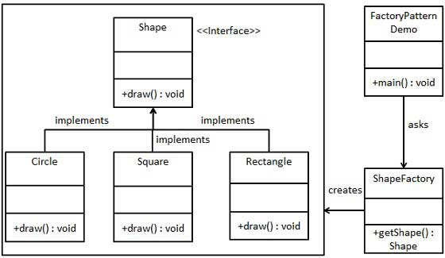

<details><summary>简单工厂模式Code</summary>

```python
class ShapeFactory(object):
    '''工厂类'''
    def getShape(self):
      return self.shape_name

class Circle(ShapeFactory):
  def __init__(self):
    self.shape_name = "Circle"
  def draw(self):
    print('draw circle')

class Rectangle(ShapeFactory):
  def __init__(self):
    self.shape_name = "Retangle"
  def draw(self):
    print('draw Rectangle')

class Shape(object):
  '''接口类，负责决定创建哪个ShapeFactory的子类'''
  def create(self, shape):
    if shape == 'Circle':
      return Circle()
    elif shape == 'Rectangle':
      return Rectangle()
    else:
      return None

fac = Shape()
obj = fac.create('Circle')
obj.draw()
obj.getShape()
```

</details>

优点：客户端不需要修改代码。

缺点： 当需要增加新的运算类的时候，不仅需新加运算类，还要修改工厂类，违反了开闭原则。

### 2. 工厂方法模式

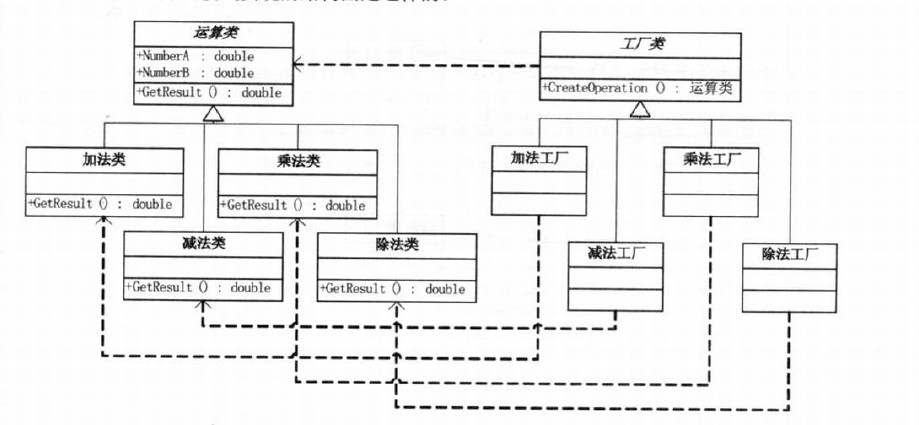

这个和简单工厂有区别，简单工厂模式只有一个工厂，工厂方法模式对每一个产品都有相应的工厂

好处：增加一个运算类（例如N次方类），只需要增加运算类和相对应的工厂，两个类，不需要修改工厂类。

缺点：增加运算类，会修改客户端代码，工厂方法只是把简单工厂的内部逻辑判断移到了客户端进行。

<details><summary>简单工厂模式Code</summary>

```python
class ShapeFactory(object):
    '''工厂类'''
    def getShape(self):
        return self.shape_name

class Circle(ShapeFactory):
    def __init__(self):
        self.shape_name = "Circle"
    def draw(self):
        print('draw circle')

class Rectangle(ShapeFactory):
    def __init__(self):
        self.shape_name = "Retangle"
    def draw(self):
        print('draw Rectangle')

class ShapeInterfaceFactory(object):
    '''接口基类'''
    def create(self):
        '''把要创建的工厂对象装配进来'''
        raise  NotImplementedError

class ShapeCircle(ShapeInterfaceFactory):
    def create(self):
        return Circle()

class ShapeRectangle(ShapeInterfaceFactory):
    def create(self):
        return Rectangle()

shape_interface = ShapeCircle()
obj = shape_interface.create()
obj.getShape()
obj.draw()

shape_interface2 = ShapeRectangle()
obj2 = shape_interface2.create()
obj2.draw()
```

</details>

下面这个是用学校＼课程来描述了一个工厂模式

<details><summary>简单工厂模式Code</summary>

```python
#_*_coding:utf-8_*_
__author__ = 'Mr.Miaow'
 
'''
工厂方法模式是简单工厂模式的衍生，解决了许多简单工厂模式的问题。
首先完全实现‘开－闭 原则’，实现了可扩展。其次更复杂的层次结构，可以应用于产品结果复杂的场合。 　　
工厂方法模式的对简单工厂模式进行了抽象。有一个抽象的Factory类（可以是抽象类和接口），这个类将不在负责具体的产品生产，而是只制定一些规范，具体的生产工作由其子类去完成。在这个模式中，工厂类和产品类往往可以依次对应。即一个抽象工厂对应一个抽象产品，一个具体工厂对应一个具体产品，这个具体的工厂就负责生产对应的产品。 　　
工厂方法模式(Factory Method pattern)是最典型的模板方法模式(Templete Method pattern)应用。
'''

class AbstractSchool(object):
    name = ''
    addr = ''
    principal = ''
 
    def enroll(self,name,course):
        pass
    def info(self):
        pass
    
class AbstractCourse(object):
    def __init__(self,name,time_range,study_type,fee):
        self.name = name
        self.time_range = time_range
        self.study_type = study_type
        self.fee = fee
 
    def enroll_test(self):
        '''
        参加这门课程前需要进行的测试
        :return:
        '''
        print("课程[%s]测试中..." % self.name) 
    def print_course_outline(self):
        '''打印课程大纲'''
        pass
    
class LinuxOPSCourse(AbstractCourse):
    '''
    运维课程
    '''
    def print_course_outline(self):
        outline='''
        Linux 基础
        Linux 基本服务使用
        Linux 高级服务篇
        Linux Shell编程
        '''
        print(outline)
    def enroll_test(self):
        print("不用测试,是个人就能学...")

class PythonCourse(AbstractCourse):
    '''python自动化开发课程'''
    def print_course_outline(self):
        outline='''
        python 介绍
        python 基础语法
        python 函数式编程
        python 面向对象
        python 网络编程
        python web开发基础
        '''
        print(outline)
    def enroll_test(self):
        print("-------python入学测试-------")
        print("-------500道题答完了-------")
        print("-------通过了-------")

class BJSchool(AbstractSchool):
    name = "老男孩北京校区"
    def create_course(self,course_type):
        if course_type == 'py_ops':
            course = PythonCourse("Python自动化开发",
                         7,'面授',11000)
        elif course_type == 'linux':
            course = LinuxOPSCourse("Linux运维课程",
                         5,'面授',12800)
        return course
 
    def enroll(self,name,course):
        print("开始为新学员[%s]办入学手续... "% name)
        print("帮学员[%s]注册课程[%s]..." % (name,course))
        course.enroll_test()
    def info(self):
        print("------[%s]-----"%self.name)
        
class SHSchool(AbstractSchool):
    name = "老男孩上海分校"
    def create_course(self,course_type):
        if course_type == 'py_ops':
            course = PythonCourse("Python自动化开发",
                         8,'在线',6500)
        elif course_type == 'linux':
            course = LinuxOPSCourse("Linux运维课程",
                         6,'在线',8000)
        return course
    def enroll(self,name,course):
        print("开始为新学员[%s]办入学手续... "% name)
        print("帮学员[%s]注册课程[%s]..." % (name,course))
        #course.level_test()
    def info(self):
        print("--------[%s]-----" % self.name )
        
school1 = BJSchool()
school2 = SHSchool()
 
school1.info()
c1=school1.create_course("py_ops")
school1.enroll("张三",c1)
 
school2.info()
c2=school1.create_course("py_ops")
school2.enroll("李四",c2)
```

</details>

### 3. 抽象工厂模式

每一个模式都是针对一定问题的解决方案。抽象工厂模式与工厂方法模式的最大区别就在于，工厂方法模式针对的是一个产品等级结构；而抽象工厂模式则需要面对多个产品等级结构。

在学习抽象工厂具体实例之前，应该明白两个重要的概念：产品族和产品等级。

所谓产品族，是指位于不同产品等级结构中，功能相关联的产品组成的家族。比如AMD的主板、芯片组、CPU组成一个家族，Intel的主板、芯片组、CPU组成一个家族。而这两个家族都来自于三个产品等级：主板、芯片组、CPU。一个等级结构是由相同的结构的产品组成，示意图如下：

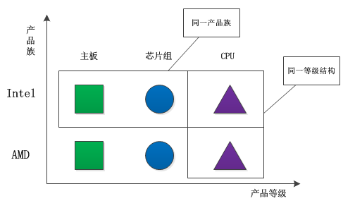

显然，每一个产品族中含有产品的数目，与产品等级结构的数目是相等的。产品的等级结构与产品族将产品按照不同方向划分，形成一个二维的坐标系。横轴表示产品的等级结构，纵轴表示产品族，上图共有两个产品族，分布于三个不同的产品等级结构中。只要指明一个产品所处的产品族以及它所属的等级结构，就可以唯一的确定这个产品。

上面所给出的三个不同的等级结构具有平行的结构。因此，如果采用工厂方法模式，就势必要使用三个独立的工厂等级结构来对付这三个产品等级结构。由于这三个产品等级结构的相似性，会导致三个平行的工厂等级结构。随着产品等级结构的数目的增加，工厂方法模式所给出的工厂等级结构的数目也会随之增加。如下图：

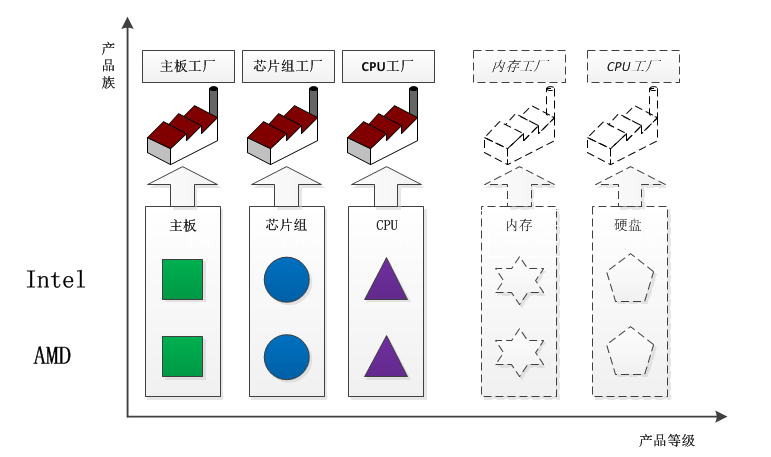

那么，是否可以使用同一个工厂等级结构来对付这些相同或者极为相似的产品等级结构呢？当然可以的，而且这就是抽象工厂模式的好处。同一个工厂等级结构负责三个不同产品等级结构中的产品对象的创建。

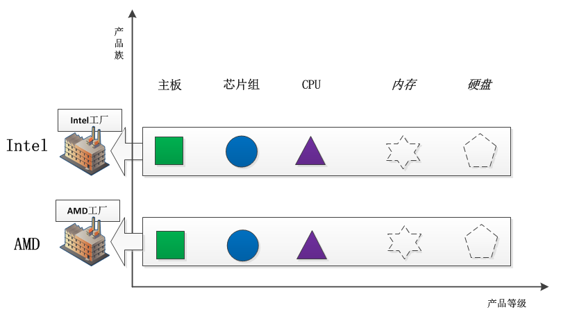

可以看出，一个工厂等级结构可以创建出分属于不同产品等级结构的一个产品族中的所有对象。显然，这时候抽象工厂模式比简单工厂模式、工厂方法模式更有效率。对应于每一个产品族都有一个具体工厂。而每一个具体工厂负责创建属于同一个产品族，但是分属于不同等级结构的产品。

#### 3.1 抽象工厂模式结构

抽象工厂模式是对象的创建模式，它是工厂方法模式的进一步推广。

假设一个子系统需要一些产品对象，而这些产品又属于一个以上的产品等级结构。那么为了将消费这些产品对象的责任和创建这些产品对象的责任分割开来，可以引进抽象工厂模式。这样的话，消费产品的一方不需要直接参与产品的创建工作，而只需要向一个公用的工厂接口请求所需要的产品。

通过使用抽象工厂模式，可以处理具有相同（或者相似）等级结构中的多个产品族中的产品对象的创建问题。如下图所示：

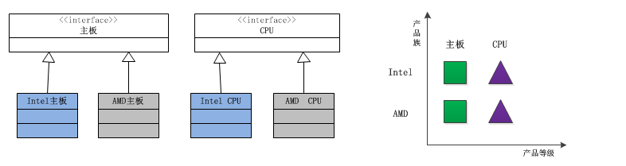

由于这两个产品族的等级结构相同，因此使用同一个工厂族也可以处理这两个产品族的创建问题，这就是抽象工厂模式。

根据产品角色的结构图，就不难给出工厂角色的结构设计图。

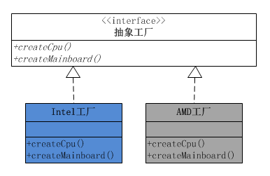

可以看出，每一个工厂角色都有两个工厂方法，分别负责创建分属不同产品等级结构的产品对象。

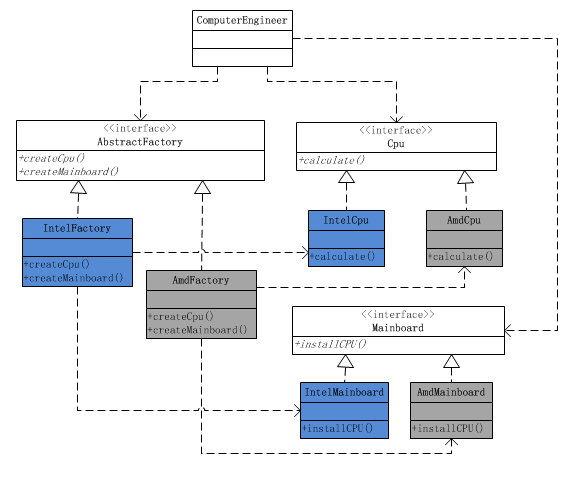

抽象工厂的功能是为一系列相关对象或相互依赖的对象创建一个接口。一定要注意，这个接口内的方法不是任意堆砌的，而是一系列相关或相互依赖的方法。比如上面例子中的主板和CPU，都是为了组装一台电脑的相关对象。不同的装机方案，代表一种具体的电脑系列。

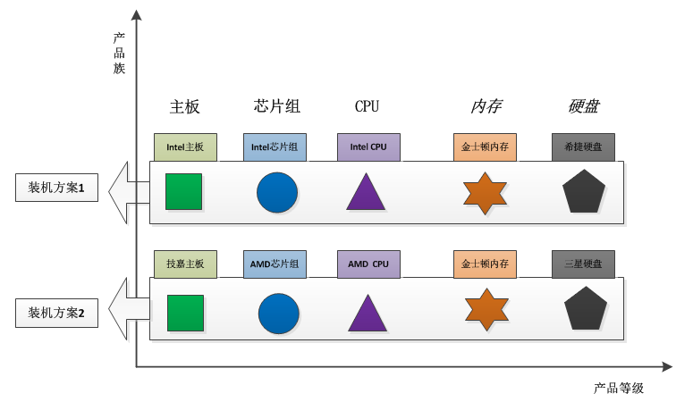

由于抽象工厂定义的一系列对象通常是相关或相互依赖的，这些产品对象就构成了一个产品族，也就是抽象工厂定义了一个产品族。

这就带来非常大的灵活性，切换产品族的时候，只要提供不同的抽象工厂实现就可以了，也就是说现在是以一个产品族作为一个整体被切换。

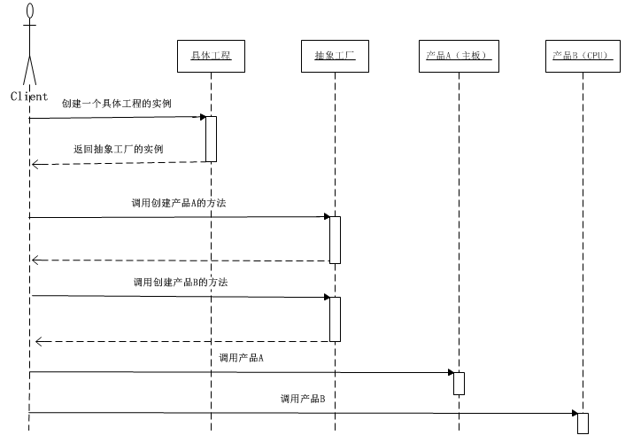

#### 3.2 在什么情况下应当使用抽象工厂模式

**1.一个系统不应当依赖于产品类实例如何被创建、组合和表达的细节，这对于所有形态的工厂模式都是重要的。**

**2.这个系统的产品有多于一个的产品族，而系统只消费其中某一族的产品。**

**3.同属于同一个产品族的产品是在一起使用的，这一约束必须在系统的设计中体现出来**。（比如：Intel主板必须使用Intel CPU、Intel芯片组）

**4.系统提供一个产品类的库，所有的产品以同样的接口出现，从而使客户端不依赖于实现。**

#### 3.3 抽象工厂模式的起源

抽象工厂模式的起源或者最早的应用，是用于创建分属于不同操作系统的视窗构建。比如：命令按键（Button）与文字框（Text)都是视窗构建，在UNIX操作系统的视窗环境和Windows操作系统的视窗环境中，这两个构建有不同的本地实现，它们的细节有所不同。

在每一个操作系统中，都有一个视窗构建组成的构建家族。在这里就是Button和Text组成的产品族。而每一个视窗构件都构成自己的等级结构，由一个抽象角色给出抽象的功能描述，而由具体子类给出不同操作系统下的具体实现。

#### 3.4 抽象工厂模式的优点

- **分离接口和实现**

  客户端使用抽象工厂来创建需要的对象，而客户端根本就不知道具体的实现是谁，客户端只是面向产品的接口编程而已。也就是说，客户端从具体的产品实现中解耦。

- **使切换产品族变得容易**

  因为一个具体的工厂实现代表的是一个产品族，比如上面例子的从Intel系列到AMD系列只需要切换一下具体工厂。

#### 3.5 抽象工厂模式的缺点

- **不太容易扩展新的产品**

  如果需要给整个产品族添加一个新的产品，那么就需要修改抽象工厂，这样就会导致修改所有的工厂实现类。

<details><summary>抽象工厂code</summary>

```python
#_*_coding:utf-8_*_
__author__ = 'Mr.Miaow'

class AbstractFactory(object):
    computer_name = ''
    def createCpu(self):
        pass
    def createMainboard(self):
        pass
 
class IntelFactory(AbstractFactory):
    computer_name = 'Intel I7-series computer '
    def createCpu(self):
        return IntelCpu('I7-6500') 
    def createMainboard(self):
        return IntelMainBoard('Intel-6000')
 
class AmdFactory(AbstractFactory):
    computer_name = 'Amd 4 computer '
    def createCpu(self):
        return AmdCpu('amd444')
    def createMainboard(self):
        return AmdMainBoard('AMD-4000')

class AbstractCpu(object):
    series_name = ''
    instructions = ''
    arch=''
 
class IntelCpu(AbstractCpu):
    def __init__(self,series):
        self.series_name = series
 
class AmdCpu(AbstractCpu):
    def __init__(self,series):
        self.series_name = series
 
class AbstractMainboard(object):
    series_name = ''
 
class IntelMainBoard(AbstractMainboard):
    def __init__(self,series):
        self.series_name = series
 
class AmdMainBoard(AbstractMainboard):
    def __init__(self,series):
        self.series_name = series
 
class ComputerEngineer(object):
    def makeComputer(self,computer_obj):
        self.prepareHardwares(computer_obj)
    def prepareHardwares(self,computer_obj):
        self.cpu = computer_obj.createCpu()
        self.mainboard = computer_obj.createMainboard()
        info = '''------- computer [%s] info:
    	cpu: %s
    	mainboard: %s
 
-------- End --------
        '''%(computer_obj.computer_name,self.cpu.series_name,self.mainboard.series_name)
        print(info)
if __name__ == "__main__":
    engineer = ComputerEngineer()
 
    computer_factory = IntelFactory()
    engineer.makeComputer(computer_factory)
 
    computer_factory2 = AmdFactory()
    engineer.makeComputer(computer_factory2)
```

</details>

### 4. 建造者模式

> **意图**：
>
> 将一个复杂对象的构建与它的表示分离，使得同样的构建过程可以创建不同的表示。
>
> **适用性**：
>
> 当创建复杂对象的算法应该独立于该对象的组成部分以及它们的装配方式时。
>
> 当构造过程必须允许被构造的对象有不同的表示时。

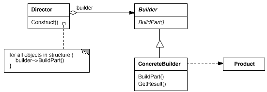

<details><summary>建造者模式code</summary>

```python
#_*_coding:utf-8_*_
__author__ = 'Mr.Miaow'
#
#建造者模式
 
#相关模式：思路和模板方法模式很像，模板方法是封装算法流程，对某些细节，提供接口由子类修改，建造者模式更为高层一点，将所有细节都交由子类实现。
# 建造者模式：将一个复杂对象的构建与他的表示分离，使得同样的构建过程可以创建不同的表示。
# 基本思想
# 某类产品的构建由很多复杂组件组成；
# 这些组件中的某些细节不同，构建出的产品表象会略有不同；
# 通过一个指挥者按照产品的创建步骤来一步步执行产品的创建；
# 当需要创建不同的产品时，只需要派生一个具体的建造者，重写相应的组件构建方法即可。
 
def printInfo(info):
    print(info)
 
#建造者基类
class PersonBuilder():
    def BuildHead(self):
        pass
    def BuildBody(self):
        pass
    def BuildArm(self):
        pass
    def BuildLeg(self):
        pass
 
#胖子
class PersonFatBuilder(PersonBuilder):
    type = '胖子'
    def BuildHead(self):
        printInfo("构建%s的头" % self.type)
    def BuildBody(self):
        printInfo("构建%s的身体" % self.type)
    def BuildArm(self):
        printInfo("构建%s的手" % self.type)
    def BuildLeg(self):
        printInfo("构建%s的脚" % self.type)
 
#瘦子
class PersonThinBuilder(PersonBuilder):
    type = '瘦子'
    def BuildHead(self):
        printInfo("构建%s的头" % self.type)
    def BuildBody(self):
        printInfo("构建%s的身体" % self.type)
    def BuildArm(self):
        printInfo("构建%s的手" % self.type)
    def BuildLeg(self):
        printInfo("构建%s的脚" % self.type)
 
#指挥者
class PersonDirector():
    pb = None;
    def __init__(self, pb):
        self.pb = pb
    def CreatePereson(self):
        self.pb.BuildHead()
        self.pb.BuildBody()
        self.pb.BuildArm()
        self.pb.BuildLeg()
 
def clientUI():
    pb = PersonThinBuilder()
    pd = PersonDirector(pb)
    pd.CreatePereson()
 
    pb = PersonFatBuilder()
    pd = PersonDirector(pb)
    pd.CreatePereson()
    return

if __name__ == '__main__':
    clientUI()
```

</details>

### 5. 单例模式

> **意图**： 
>
> 保证一个类仅有一个实例，并提供一个访问它的全局访问点。
>
> **适用性**：
>
> 当类只能有一个实例而且客户可以从一个众所周知的访问点访问它时。
>
> 当这个唯一实例应该是通过子类化可扩展的，并且客户应该无需更改代码就能使用一个扩展的实例时。

<details><summary>适配器模式code</summary>


```python
#实现__new__方法
#并在将一个类的实例绑定到类变量_instance上,
#如果cls._instance为None说明该类还没有实例化过,实例化该类,并返回
#如果cls._instance不为None,直接返回cls._instance
class Singleton(object):
    def __new__(cls, *args, **kwargs):
        if not hasattr(cls,'_instance'):
            orig = super(Singleton,cls)
            cls._instance =  orig.__new__(cls)
        return cls._instance
 
class MyClass(Singleton):
    def __init__(self,name):
        self.name = name
 
a = MyClass("Alex")
b = MyClass("Jack")
 
print(a.name)
print(b.name)
```

</details>

### 6. 适配器模式

> **意图**：
>
> 将一个类的接口转换成客户希望的另外一个接口。Adapter 模式使得原本由于接口不兼容而不能一起工作的那些类可以一起工作。 
>
> **适用性**：
>
> 你想使用一个已经存在的类，而它的接口不符合你的需求。
>
> 你想创建一个可以复用的类，该类可以与其他不相关的类或不可预见的类（即那些接口可能不一定兼容的类）协同工作

<details><summary>适配器模式code</summary>

```python
#_*_coding:utf-8_*_
__author__ = 'Mr.Miaow'
 
#适配器模式
# 将一个类的接口转换成客户希望的另外一个接口。使得原本由于接口不兼容而不能一起工作的那些类可以一起工作。
# 应用场景：希望复用一些现存的类，但是接口又与复用环境要求不一致。
 
def printInfo(info):
    print(info)
 
#球员类
class Player():
    name = ''
    def __init__(self,name):
        self.name = name 
    def Attack(self,name):
        pass
    def Defense(self):
        pass
 
#前锋
class Forwards(Player):
    def __init__(self,name):
        Player.__init__(self,name)
    def Attack(self):
        printInfo("前锋%s 进攻" % self.name)
    def Defense(self,name):
        printInfo("前锋%s 防守" % self.name)
 
#中锋（目标类）
class Center(Player):
   def __init__(self,name):
       Player.__init__(self,name)
   def Attack(self):
       printInfo("中锋%s 进攻" % self.name)
   def Defense(self):
       printInfo("中锋%s 防守" % self.name)
 
#后卫
class Guards(Player):
   def __init__(self,name):
       Player.__init__(self,name)
   def Attack(self):
       printInfo("后卫%s 进攻" % self.name) 
   def Defense(self):
       printInfo("后卫%s 防守" % self.name)
 
#外籍中锋（待适配类）
#中锋
class ForeignCenter(Player):
    name = ''
    def __init__(self,name):
        Player.__init__(self,name)
    def ForeignAttack(self):
        printInfo("外籍中锋%s 进攻" % self.name)
    def ForeignDefense(self):
        printInfo("外籍中锋%s 防守" % self.name)

#翻译（适配类）
class Translator(Player):
    foreignCenter = None
    def __init__(self,name):
        self.foreignCenter = ForeignCenter(name)
    def Attack(self):
        self.foreignCenter.ForeignAttack()
    def Defense(self):
        self.foreignCenter.ForeignDefense()
 
def clientUI():
    b = Forwards('巴蒂尔')
    m = Guards('姚明')
    ym = Translator('麦克格雷迪')
 
    b.Attack()
    m.Defense()
    ym.Attack()
    ym.Defense()
    return
 
if __name__ == '__main__':
    clientUI()
```

</details>

### 7. 桥接模式

> 参考:http://www.cnblogs.com/houleixx/archive/2008/02/23/1078877.html

> 生活中的一个例子:
>
> 就拿汽车在路上行驶的来说。即有小汽车又有公共汽车，它们都不但能在市区中的公路上行驶，也能在高速公路上行驶。这你会发现，对于交通工具（汽车）有不同的类型，然而它们所行驶的环境（路）也在变化，在软件系统中就要适应两个方面的变化？怎样实现才能应对这种变化呢？
>
> **概述**：
>
> 在软件系统中，某些类型由于自身的逻辑，它具有两个或多个维度的变化，那么如何应对这种“多维度的变化”？如何利用面向对象的技术来使得该类型能够轻松的沿着多个方向进行变化，而又不引入额外的复杂度？这就要使用Bridge模式。
>
> **意图**：
>
> 　　　将抽象部分与实现部分分离，使它们都可以独立的变化。
>
> ​                                                                    ——《设计模式》GOF
>
> **效果及实现要点**：
>
> 1．Bridge模式使用“对象间的组合关系”解耦了抽象和实现之间固有的绑定关系，使得抽象和实现可以沿着各自的维度来变化。
>
> 2．所谓抽象和实现沿着各自维度的变化，即“子类化”它们，得到各个子类之后，便可以任意它们，从而获得不同路上的不同汽车。
>
> 3．Bridge模式有时候类似于多继承方案，但是多继承方案往往违背了类的单一职责原则（即一个类只有一个变化的原因），复用性比较差。Bridge模式是比多继承方案更好的解决方法。
>
> 4．Bridge模式的应用一般在“两个非常强的变化维度”，有时候即使有两个变化的维度，但是某个方向的变化维度并不剧烈——换言之两个变化不会导致纵横交错的结果，并不一定要使用Bridge模式。
>
> **适用性**：
>
> 在以下的情况下应当使用桥梁模式：
>
> 1．如果一个系统需要在构件的抽象化角色和具体化角色之间增加更多的灵活性，避免在两个层次之间建立静态的联系。
>
> 2．设计要求实现化角色的任何改变不应当影响客户端，或者说实现化角色的改变对客户端是完全透明的。
>
> 3．一个构件有多于一个的抽象化角色和实现化角色，系统需要它们之间进行动态耦合。
>
> 4．虽然在系统中使用继承是没有问题的，但是由于抽象化角色和具体化角色需要独立变化，设计要求需要独立管理这两者。
>
> **总结**：
>
> Bridge模式是一个非常有用的模式，也非常复杂，它很好的符合了开放-封闭原则和优先使用对象，而不是继承这两个面向对象原则

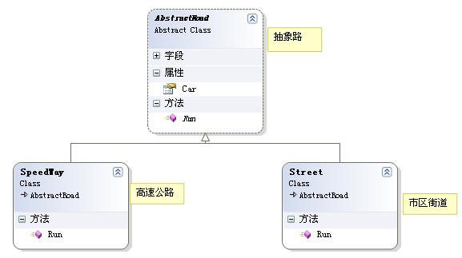

<details><summary>桥接模式code</summary>

```python
class AbstractRoad(object):
    '''公路基类'''
    car = None

class AbstractCar(object):
    '''车辆基类'''
    def run(self):
        pass

class Street(AbstractRoad):
    '''市区街道'''
    def run(self):
        self.car.run()
        print("在市区街道上行驶")

class SpeedWay(AbstractRoad):
    '''高速公路'''
    def run(self):
        self.car.run()
        print("在高速公路上行驶")
        
class Car(AbstractCar):
    '''小汽车'''
    def run(self):
        print("小汽车在")

class Bus(AbstractCar):
    '''公共汽车'''
    def run(self):
        print("公共汽车在")

if __name__ == "__main__":
    #小汽车在高速上行驶
    road1 = SpeedWay()
    road1.car = Car()
    road1.run()
 
    #
    road2 = SpeedWay()
    road2.car = Bus()
    road2.run()
```

</details>

**应用设计模式**:

- 桥接模式（Bridge）来做(多维度变化);
- 结合上面的例子,增加一个维度"人",不同的人开着不同的汽车在不同的路上行驶(三个维度)
- 结合上面增加一个类"人",并重新调用.

<details><summary>代码实现:</summary>

```python
class AbstractRoad(object):
    '''公路基类'''
    car = None
 
class AbstractCar(object):
    '''车辆基类'''
    def run(self):
        pass
 
class People(object):
    pass
 
class Street(AbstractRoad):
    '''市区街道'''
    def run(self):
        self.car.run()
        print("在市区街道上行驶")
 
class SpeedWay(AbstractRoad):
    '''高速公路'''
    def run(self):
        self.car.run()
        print("在高速公路上行驶")

class Car(AbstractCar):
    '''小汽车'''
    def run(self):
        print("小汽车在")
 
class Bus(AbstractCar):
    '''公共汽车'''
    road = None
    def run(self):
        print("公共汽车在")
 
#加上人
class Man(People):
    def drive(self):
        print("男人开着")
        self.road.run()
        
#加上人
class Woman(People):
    def drive(self):
        print("女人开着")
        self.road.run()
        
if __name__ == "__main__":
    #小汽车在高速上行驶
    road1 = SpeedWay()
    road1.car = Car()
    road1.run()
 
    #
    road2 = SpeedWay()
    road2.car = Bus()
    road2.run()
 
    #人开车
    road3 = Street()
    road3.car = Car()
 
    p1 = Man()
    p1.road = road3
    p1.drive()
```

</details>

### 8. 组合模式

> **意图**：
>
> 将对象组合成树形结构以表示“部分-整体”的层次结构。C o m p o s i t e 使得用户对单个对象和组合对象的使用具有一致性。 
>
> **适用性**：
>
> 你想表示对象的部分-整体层次结构。
>
> 你希望用户忽略组合对象与单个对象的不同，用户将统一地使用组合结构中的所有对象。

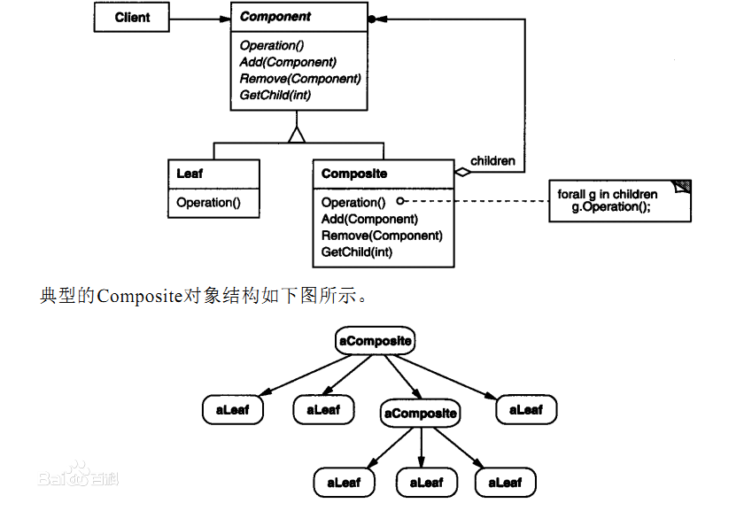

<details><summary>组合模式code</summary>

```python
# 应用组合模式的会员卡消费
#     那么我们就根据我们会员卡的消费，来模拟一下组合模式的实现吧！let's go！
#     首先：
#            1.我们的部件有，总店，分店，加盟店！
#            2.我们的部件共有的行为是：刷会员卡
#            3.部件之间的层次关系，也就是店面的层次关系是，总店下有分店、分店下可以拥有加盟店。
#
# 有了我们这几个必要条件后，我的要求就是目前店面搞活动当我在总店刷卡后，就可以累积相当于在所有下级店面刷卡的积分总额，设计的代码如下

class Store(object):
    '''店面基类'''
    #添加店面
    def add(self,store):
        pass
    #删除店面
    def remove(self,store):
        pass
    def pay_by_card(self):
        pass
 
class BranchStore(Store):
    def __init__(self,name):
        self.name = name
        self.my_store_list = []
    def pay_by_card(self):
        print("店面[%s]的积分已累加进该会员卡" %self.name)
        for s in self.my_store_list:
            s.pay_by_card() 
    #添加店面
    def add(self,store):
        self.my_store_list.append(store)
    #删除店面
    def remove(self,store):
        self.my_store_list.remove(store)
 
class JoinStore(Store):
    '''加盟店'''
    def __init__(self,name):
        self.name = name
    def pay_by_card(self):
        print("店面[%s]的积分已累加进该会员卡" %self.name)
    def add(self,store):
        print("无添加子店权限")
    def remove(self,store):
        print("无删除子店权限")
 
if __name__ == "__main__":
    store = BranchStore("朝阳总店")
    branch = BranchStore("海滨分店")
    join_branch = JoinStore("昌平加盟1店")
    join_branch2 = JoinStore("昌平加盟2店")
 
    branch.add(join_branch)
    branch.add(join_branch2)
 
    store.add(branch)
 
    store.pay_by_card()
    print(store.my_store_list)

# 这样在累积所有子店面积分的时候，就不需要去关心子店面的个数了，也不用关系是否是叶子节点还是组合节点了，也就是说不管是总店刷卡，还是加盟店刷卡，都可以正确有效的计算出活动积分。
#
# 什么情况下使用组合模式
#
# 引用大话设计模式的片段：“当发现需求中是体现部分与整体层次结构时，以及你希望用户可以忽略组合对象与单个对象的不同，统一地使用组合结构中的所有对象时，就应该考虑组合模式了。”
```

</details>

### 9. 外观模式

> **意图**：
>
> 为子系统中的一组接口提供一个一致的界面，Facade模式定义了一个高层接口，这个接口使得这一子系统更加容易使用。
>
> **适用性**：
>
> 当你要为一个复杂子系统提供一个简单接口时。子系统往往因为不断演化而变得越来越复杂。大多数模式使用时都会产生更多更小的类。这使得子系统更具可重用性，也更容易对子系统进行定制，但这也给那些不需要定制子系统的用户带来一些使用上的困难。Facade 可以提供一个简单的缺省视图，这一视图对大多数用户来说已经足够，而那些需要更多的可定制性的用户可以越过facade层。
>
> 客户程序与抽象类的实现部分之间存在着很大的依赖性。引入facade 将这个子系统与客户以及其他的子系统分离，可以提高子系统的独立性和可移植性。
>
> 当你需要构建一个层次结构的子系统时，使用facade模式定义子系统中每层的入口点。如果子系统之间是相互依赖的，你可以让它们仅通过facade进行通讯，从而简化了它们之间的依赖关系。

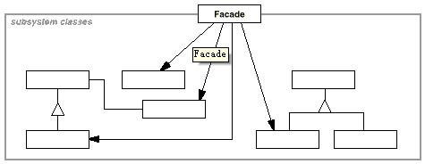

<details><summary>外观模式code</summary>

```python
#_*_coding:utf-8_*_
__author__ = 'Mr.Miaow'
#外观模式（Facade），为子系统中的一组接口提供一个一致的界面，定义一个高层接口，这个接口使得这一子系统更加容易使用。
# 在以下情况下可以考虑使用外观模式：
# (1) 设计初期阶段，应该有意识的将不同层分离，层与层之间建立外观模式。
# (2) 开发阶段，子系统越来越复杂，增加外观模式提供一个简单的调用接口。
# (3) 维护一个大型遗留系统的时候，可能这个系统已经非常难以维护和扩展，但又包含非常重要的功能，为其开发一个外观类，以便新系统与其交互。
 
# 优点编辑
# （1）实现了子系统与客户端之间的松耦合关系。
# （2）客户端屏蔽了子系统组件，减少了客户端所需处理的对象数目，并使得子系统使用起来更加容易。

def printInfo(info):
    print(info)
 
class Stock():
    name = '股票1'
    def buy(self):
        printInfo('买 '+self.name)
    def sell(self):
        printInfo('卖 '+self.name)
 
class ETF():
    name = '指数型基金'
    def buy(self):
        printInfo('买 '+self.name)
    def sell(self):
        printInfo('卖 '+self.name)
 
class Future():
    name = '期货'
    def buy(self):
        printInfo('买 '+self.name)
    def sell(self):
        printInfo('卖 '+self.name)
 
class NationDebt():
    name = '国债'
    def buy(self):
        printInfo('买 '+self.name)
    def sell(self):
        printInfo('卖 '+self.name)
 
class Option():
    name = '权证'
    def buy(self):
        printInfo('买 '+self.name)
    def sell(self):
        printInfo('卖 '+self.name)
 
#基金
class Fund():
    def __init__(self):
        self.stock = Stock()
        self.etf = ETF()
        self.future = Future()
        self.debt = NationDebt()
        self.option = Option()
 
    def buyFund(self):
        self.stock.buy()
        self.etf.buy()
        self.debt.buy()
        self.future.buy()
        self.option.buy()
 
    def sellFund(self):
        self.stock.sell()
        self.etf.sell()
        self.future.sell()
        self.debt.sell()
        self.option.sell()
 
def clientUI():
    myFund = Fund()
    myFund.buyFund()
    myFund.sellFund()
    return

if __name__ == '__main__':
    clientUI()
```

</details>

### 10. 享元模式

> **意图**：
>
> 运用共享技术有效地支持大量细粒度的对象。
>
> **适用性**：
>
> 一个应用程序使用了大量的对象。
>
> 完全由于使用大量的对象，造成很大的存储开销。
>
> 对象的大多数状态都可变为外部状态。
>
> 如果删除对象的外部状态，那么可以用相对较少的共享对象取代很多组对象。
>
> 应用程序不依赖于对象标识。由于Flyweight 对象可以被共享，对于概念上明显有别的对象，标识测试将返回真值。

<details><summary>享元模式code</summary>

```python
# Flyweight模式，顾名思义，就是共享元数据
# 在我们面向对象设计过程中，我们常常会面临着对象实例过多的问题，如果对象实例过多这将是我们系统性能提高的一个瓶颈。
# 假设我们要设计一个星空场景，现在我们需要实例星星对象，我们可以实例每一颗星星，但随着我们实例星星对象增多整个场景就越来越慢了，
# 如果你实例了1000+颗星星要你去维护，这可是一个吃力不讨好的工作。我们必须找到一个合适的方法解决以上问题，这就是今天要介绍的享元模式（Flyweight）。
 
# 享元模式（Flyweight）：运用共享的技术有效地支持大量细粒度的对象。
#
# 抽象享元角色（Flyweight）：此角色是所有的具体享元类的超类，为这些类规定出需要实现的公共接口或抽象类。那些需要外部状态(External State)的操作可以通过方法的参数传入。抽象享元的接口使得享元变得可能，但是并不强制子类实行共享，因此并非所有的享元对象都是可以共享的。
#
# 具体享元(ConcreteFlyweight)角色：实现抽象享元角色所规定的接口。如果有内部状态的话，必须负责为内部状态提供存储空间。享元对象的内部状态必须与对象所处的周围环境无关，从而使得享元对象可以在系统内共享。有时候具体享元角色又叫做单纯具体享元角色，因为复合享元角色是由单纯具体享元角色通过复合而成的。
#
# 复合享元(UnsharableFlyweight)角色：复合享元角色所代表的对象是不可以共享的，但是一个复合享元对象可以分解成为多个本身是单纯享元对象的组合。复合享元角色又称做不可共享的享元对象。这个角色一般很少使用。
#
# 享元工厂(FlyweightFactoiy)角色：本角色负责创建和管理享元角色。本角色必须保证享元对象可以被系统适当地共享。当一个客户端对象请求一个享元对象的时候，享元工厂角色需要检查系统中是否已经有一个符合要求的享元对象，如果已经有了，享元工厂角色就应当提供这个已有的享元对象；如果系统中没有一个适当的享元对象的话，享元工厂角色就应当创建一个新的合适的享元对象。
#
# 客户端(Client)角色：本角色还需要自行存储所有享元对象的外部状态。
#
# 内部状态与外部状态：在享元对象内部并且不会随着环境改变而改变的共享部分，可以称之为享元对象的内部状态，反之随着环境改变而改变的，不可共享的状态称之为外部状态。
 
class FlyweightBase(object):
    _instances = dict()
    def __init__(self,*args,**kwargs):
        #继承的子类必须初始化
        raise NotImplementedError
    def __new__(cls, *args, **kwargs):
        #print(cls._instances,type(cls))
        return cls._instances.setdefault(
            (cls,args,tuple(kwargs.items())),
            super(FlyweightBase,cls).__new__(cls)
        ) 
    def test_data(self):
        pass
    
class Spam(FlyweightBase):
    '''精子类'''
    def __init__(self,a,b):
        self.a = a
        self.b = b
    def test_data(self):
        print("精子准备好了",self.a,self.b)
        
class Egg(FlyweightBase):
    '''卵类'''
    def __init__(self,x,y):
        self.x = x
        self.y = y
    def test_data(self):
        print("卵子准备好了",self.x,self.y)
 
spam1 = Spam(1,'abc')
spam2 = Spam(1,'abc')
spam3 = Spam(3,'DEF')
 
egg1 = Egg(1,'abc')
#egg2 = Egg(4,'abc')
assert spam1 is spam2
assert egg1 is not spam1
print(id(spam1),id(spam2))
spam2.test_data()
egg1.test_data()
print(egg1._instances)
print(egg1._instances.keys())
```

</details>

### 11. 代理模式

> **意图**：为其他对象提供一种代理以控制对这个对象的访问。
>
> **主要解决**：在直接访问对象时带来的问题，比如说：要访问的对象在远程的机器上。在面向对象系统中，有些对象由于某些原因（比如对象创建开销很大，或者某些操作需要安全控制，或者需要进程外的访问），直接访问会给使用者或者系统结构带来很多麻烦，我们可以在访问此对象时加上一个对此对象的访问层。
>
> **何时使用**：想在访问一个类时做一些控制。
>
> **如何解决**：增加中间层。
>
> **关键代码**：实现与被代理类组合。
>
> **应用实例**： 
>
> - 1、Windows 里面的快捷方式。 
> - 2、猪八戒去找高翠兰结果是孙悟空变的，可以这样理解：把高翠兰的外貌抽象出来，高翠兰本人和孙悟空都实现了这个接口，猪八戒访问高翠兰的时候看不出来这个是孙悟空，所以说孙悟空是高翠兰代理类。 
> - 3、买火车票不一定在火车站买，也可以去代售点。 
> - 4、一张支票或银行存单是账户中资金的代理。支票在市场交易中用来代替现金，并提供对签发人账号上资金的控制。 
> - 5、spring aop。
>
> **优点**： 
>
> - 1、职责清晰。 
> - 2、高扩展性。 
> - 3、智能化。
>
> **缺点**： 
>
> - 1、由于在客户端和真实主题之间增加了代理对象，因此有些类型的代理模式可能会造成请求的处理速度变慢。 
> - 2、实现代理模式需要额外的工作，有些代理模式的实现非常复杂。
>
> **使用场景**：
>
> 按职责来划分，通常有以下使用场景： 
>
> - 1、远程代理。 
> - 2、虚拟代理。 
> - 3、Copy-on-Write 代理。 
> - 4、保护（Protect or Access）代理。 
> - 5、Cache代理。 
> - 6、防火墙（Firewall）代理。 
> - 7、同步化（Synchronization）代理。 
> - 8、智能引用（Smart Reference）代理。

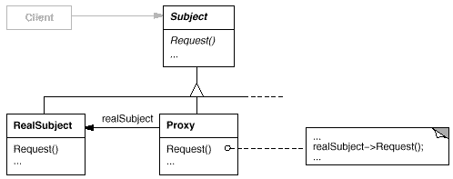

<details><summary>代理模式code</summary>

```python
#_*_coding:utf-8_*_
__author__ = 'Mr.Miaow'
 
#
# 代理模式
# 应用特性：需要在通信双方中间需要一些特殊的中间操作时引用，多加一个中间控制层。
# 结构特性：建立一个中间类，创建一个对象，接收一个对象，然后把两者联通起来
 
class sender_base:
    def __init__(self):
        pass
    def send_something(self, something):
        pass
 
class send_class(sender_base):
    def __init__(self, receiver):
        self.receiver = receiver 
    def send_something(self, something):
        print("SEND " + something + ' TO ' + self.receiver.name)
 
class agent_class(sender_base):
    def __init__(self, receiver):
        self.send_obj = send_class(receiver) 
    def send_something(self, something):
        self.send_obj.send_something(something)
 
class receive_class:
    def __init__(self, someone):
        self.name = someone

if '__main__' == __name__:
    receiver = receive_class('Alex')
    agent = agent_class(receiver)
    agent.send_something('agentinfo')
 
    print(receiver.__class__  )
    print(agent.__class__ )
```

</details>

### 12. 模板方法模式

在模板模式（Template Pattern）中，一个抽象类公开定义了执行它的方法的方式/模板。它的子类可以按需要重写方法实现，但调用将以抽象类中定义的方式进行。这种类型的设计模式属于行为型模式。

> **意图**：定义一个操作中的算法的骨架，而将一些步骤延迟到子类中。模板方法使得子类可以不改变一个算法的结构即可重定义该算法的某些特定步骤。
>
> **主要解决**：一些方法通用，却在每一个子类都重新写了这一方法。
>
> **何时使用**：有一些通用的方法。
>
> **如何解决**：将这些通用算法抽象出来。
>
> **关键代码**：在抽象类实现，其他步骤在子类实现。
>
> **应用实例**： 
>
> - 1、在造房子的时候，地基、走线、水管都一样，只有在建筑的后期才有加壁橱加栅栏等差异。 
> - 2、西游记里面菩萨定好的 81 难，这就是一个顶层的逻辑骨架。 
> - 3、Spirng 中对 Hibernate 的支持，将一些已经定好的方法封装起来，比如开启事务、获取 Session、关闭 Session 等，程序员不重复写那些已经规范好的代码，直接丢一个实体就可以保存。
>
> **优点**： 
>
> - 1、封装不变部分，扩展可变部分。 
> - 2、提取公共代码，便于维护。 
> - 3、行为由父类控制，子类实现。
>
> **缺点**：
>
> - 每一个不同的实现都需要一个子类来实现，导致类的个数增加，使得系统更加庞大。
>
> **使用场景**： 
>
> - 1、有多个子类共有的方法，且逻辑相同。 
> - 2、重要的、复杂的方法，可以考虑作为模板方法。

<details><summary>模板方法模式code</summary>

```python
#_*_coding:utf-8_*_
__author__ = 'Mr.Miaow'
 
# 模板方法模式概述
# 在现实生活中，很多事情都包含几个实现步骤，例如请客吃饭，无论吃什么，一般都包含点单、吃东西、买单等几个步骤，通常情况下这几个步骤的次序是：点单 --> 吃东西 --> 买单。在这三个步骤中，点单和买单大同小异，最大的区别在于第二步——吃什么？吃面条和吃满汉全席可大不相同
#
# 在软件开发中，有时也会遇到类似的情况，某个方法的实现需要多个步骤（类似“请客”），其中有些步骤是固定的（类似“点单”和“买单”），而有些步骤并不固定，存在可变性（类似“吃东西”）。为了提高代码的复用性和系统的灵活性，可以使用一种称之为模板方法模式的设计模式来对这类情况进行设计，在模板方法模式中，将实现功能的每一个步骤所对应的方法称为基本方法（例如“点单”、“吃东西”和“买单”），而调用这些基本方法同时定义基本方法的执行次序的方法称为模板方法（例如“请客”）。在模板方法模式中，可以将相同的代码放在父类中，例如将模板方法“请客”以及基本方法“点单”和“买单”的实现放在父类中，而对于基本方法“吃东西”，在父类中只做一个声明，将其具体实现放在不同的子类中，在一个子类中提供“吃面条”的实现，而另一个子类提供“吃满汉全席”的实现。通过使用模板方法模式，一方面提高了代码的复用性，另一方面还可以利用面向对象的多态性，在运行时选择一种具体子类，实现完整的“请客”方法，提高系统的灵活性和可扩展性。
# 模板方法模式定义如下：
# 模板方法模式：定义一个操作中算法的框架，而将一些步骤延迟到子类中。模板方法模式使得子类可以不改变一个算法的结构即可重定义该算法的某些特定步骤。
#
# Template Method Pattern:  Define the skeleton of an algorithm in an  operation, deferring some steps to subclasses. Template Method lets  subclasses redefine certain steps of an algorithm without changing the  algorithm's structure.
# 模板方法模式是一种基于继承的代码复用技术，它是一种类行为型模式。
# 模板方法模式是结构最简单的行为型设计模式，在其结构中只存在父类与子类之间的继承关系。通过使用模板方法模式，可以将一些复杂流程的实现步骤封装在一系列基本方法中，在抽象父类中提供一个称之为模板方法的方法来定义这些基本方法的执行次序，而通过其子类来覆盖某些步骤，从而使得相同的算法框架可以有不同的执行结果。模板方法模式提供了一个模板方法来定义算法框架，而某些具体步骤的实现可以在其子类中完成。
#
 
class Register(object):
    '''用户注册接口'''
    def register(self):
        pass
    def login(self):
        pass
    def auth(self):
        self.register()
        self.login()
 
class RegisterByQQ(Register):
    '''qq注册'''
    def register(self):
        print("---用qq注册-----")
    def login(self):
        print('----用qq登录-----')

class RegisterByWeiChat(Register):
    '''微信注册'''
    def register(self):
        print("---用微信注册-----")
    def login(self):
        print('----用微信登录-----')

if __name__ == "__main__":
    register1 = RegisterByQQ()
    register1.login()
 
    register2 = RegisterByWeiChat()
    register2.login()
```

</details>

### 13. 责任链模式

> **意图**：
>
> 使多个对象都有机会处理请求，从而避免请求的发送者和接收者之间的耦合关系。将这些对象连成一条链，并沿着这条链传递该请求，直到有一个对象处理它为止。
>
> **适用性**：
>
> 有多个的对象可以处理一个请求，哪个对象处理该请求运行时刻自动确定。
>
> 你想在不明确指定接收者的情况下，向多个对象中的一个提交一个请求。
>
> 可处理一个请求的对象集合应被动态指定。

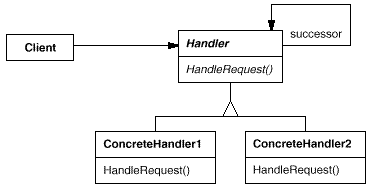

<details><summary>责任链模式code</summary>

```python
#_*_coding:utf-8_*_
__author__ = 'Mr.Miaow'
 
# 职责链模式（Chain of Responsibility）：使多个对象都有机会处理请求，从而避免请求的发送者和接收者之间的耦合关系。将这些对象连成一条链，并沿着这条链传递该请求，直到有一个对象处理它为止。
# 适用场景：
# 1、有多个的对象可以处理一个请求，哪个对象处理该请求运行时刻自动确定；
# 2、在不明确指定接收者的情况下，向多个对象中的一个提交一个请求；
# 3、处理一个请求的对象集合应被动态指定。
 
class BaseHandler(object):
    '''处理基类'''
    def successor(self,successor):
        #与下一个责任者关联
        self._successor = successor
 
class RequestHandlerL1(BaseHandler):
    '''第一级请求处理者'''
    name = "TeamLeader"
    def handle(self,request):
        if request < 500 :
            print("审批者[%s],请求金额[%s],审批结果[审批通过]"%(self.name,request))
        else:
            print("\033[31;1m[%s]无权审批,交给下一个审批者\033[0m" %self.name)
            self._successor.handle(request)
 
class RequestHandlerL2(BaseHandler):
    '''第二级请求处理者'''
    name = "DeptManager"
    def handle(self,request):
        if request < 5000 :
            print("审批者[%s],请求金额[%s],审批结果[审批通过]"%(self.name,request))
        else:
            print("\033[31;1m[%s]无权审批,交给下一个审批者\033[0m" %self.name)
            self._successor.handle(request)
 
class RequestHandlerL3(BaseHandler):
    '''第三级请求处理者'''
    name = "CEO"
    def handle(self,request):
        if request < 10000 :
            print("审批者[%s],请求金额[%s],审批结果[审批通过]"%(self.name,request))
        else:
            print("\033[31;1m[%s]要太多钱了,不批\033[0m"%self.name)
            #self._successor.handle(request)
 
class RequestAPI(object):
    h1 = RequestHandlerL1()
    h2 = RequestHandlerL2()
    h3 = RequestHandlerL3()
 
    h1.successor(h2)
    h2.successor(h3)
    def __init__(self,name,amount):
        self.name = name
        self.amount = amount
    def handle(self):
        '''统一请求接口'''
        self.h1.handle(self.amount)
 
if __name__ == "__main__":
    r1 = RequestAPI("Alex",30000)
    r1.handle()
    print(r1.__dict__)
```

</details>

### 14. 观察者模式

> **意图**：
>
> 定义对象间的一种一对多的依赖关系,当一个对象的状态发生改变时, 所有依赖于它的对象都得到通知并被自动更新。
>
> **适用性**：
>
> 当一个抽象模型有两个方面, 其中一个方面依赖于另一方面。将这二者封装在独立的对象中以使它们可以各自独立地改变和复用。
>
> 当对一个对象的改变需要同时改变其它对象, 而不知道具体有多少对象有待改变。
>
> 当一个对象必须通知其它对象，而它又不能假定其它对象是谁。换言之, 你不希望这些对象是紧密耦合的。

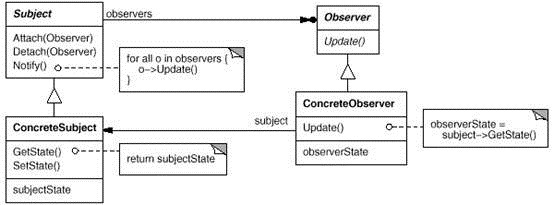

<details><summary>观察者模式code</summary>

```python
#_*_coding:utf-8_*_
__author__ = 'Mr.Miaow'
#
# 观察者（Observer）模式又名发布-订阅（Publish/Subscribe）模式
# 当我们希望一个对象的状态发生变化，那么依赖与它的所有对象都能相应变化(获得通知),那么就可以用到Observer模式， 其中的这些依赖对象就是观察者的对象，那个要发生变化的对象就是所谓’观察者’
 
class ObserverBase(object):
    '''观察者基类''' 
    def __init__(self):
        self._observerd_list = []
    def attach(self,observe_subject):
        '''
        添加要观察的对象
        :param observe_subject:
        :return:
        '''
        if observe_subject not in self._observerd_list:
            self._observerd_list.append(observe_subject)
            print("[%s]已经将[%s]加入观察队列..."%(self.name,observe_subject) )
    def detach(self,observe_subject):
        '''
        解除观察关系
        :param observe_subject:
        :return:
        '''
        try:
            self._observerd_list.remove(observe_subject)
            print("不再观察[%s]" %observe_subject)
        except ValueError:
            pass
    def notify(self):
        '''
        通知所有被观察者
        :return:
        '''
        for objserver in self._observerd_list:
            objserver.update(self)
 
class Observer(ObserverBase):
    '''观察者类'''
    def __init__(self,name):
        super(Observer,self).__init__()
        self.name = name
        self._msg = ''
    @property
    def msg(self):
        '''
        当前状况
        :return:
        '''
        return self._msg
    @msg.setter
    def msg(self,content):
        self._msg = content
        self.notify()
 
class GCDViewer(object):
    '''
    共军被观察者
    '''
    def update(self,observer_subject):
        print("共军:收到[%s]消息[%s] "%(observer_subject.name,observer_subject.msg) )

class GMDViewer(object):
    '''
    国军被观察者
    '''
    def update(self,observer_subject):
        print("国军:收到[%s]消息[%s] "%(observer_subject.name,observer_subject.msg) )
 
if __name__ == "__main__":
    observer1 = Observer("共军放哨者")
    observer2 = Observer("国军放哨者")
 
    gongjun1 = GCDViewer()
    guojun1 = GMDViewer()
 
    observer1.attach(gongjun1)
    observer1.attach(guojun1)
 
    observer2.attach(guojun1)
 
    observer1.msg = "\033[32;1m敌人来了...\033[0m"
 
    observer2.msg ="\033[31;1m前方发现敌人,请紧急撤离,不要告诉共军\033[0m"
```

</details>

### 15. 策略模式

> **意图**：定义一系列的算法,把它们一个个封装起来, 并且使它们可相互替换。
>
> **主要解决**：在有多种算法相似的情况下，使用 if...else 所带来的复杂和难以维护。
>
> **何时使用**：一个系统有许多许多类，而区分它们的只是他们直接的行为。
>
> **如何解决**：将这些算法封装成一个一个的类，任意地替换。
>
> **关键代码**：实现同一个接口。
>
> **应用实例**：
>
> - 1、诸葛亮的锦囊妙计，每一个锦囊就是一个策略。 
> - 2、旅行的出游方式，选择骑自行车、坐汽车，每一种旅行方式都是一个策略。 
> - 3、JAVA AWT 中的 LayoutManager。
>
> **优点**： 
>
> - 1、算法可以自由切换。 
> - 2、避免使用多重条件判断。 
> - 3、扩展性良好。
>
> **缺点**： 
>
> - 1、策略类会增多。 
> - 2、所有策略类都需要对外暴露。
>
> **使用场景**： 
>
> - 1、如果在一个系统里面有许多类，它们之间的区别仅在于它们的行为，那么使用策略模式可以动态地让一个对象在许多行为中选择一种行为。 
> - 2、一个系统需要动态地在几种算法中选择一种。 
> - 3、如果一个对象有很多的行为，如果不用恰当的模式，这些行为就只好使用多重的条件选择语句来实现。

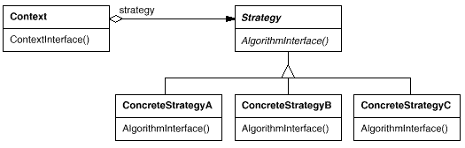

<details><summary>策略模式code</summary>

```python
#_*_coding:utf-8_*_
__author__ = 'Mr.Miaow'

class TravelStrategy(object):
    '''
    出行策略
    '''
    def travelAlgorithm(self):
        pass
 
class AirplaneStrategy(TravelStrategy):
    def travelAlgorithm(self):
        print("坐飞机出行....")
 
class TrainStrategy(TravelStrategy):
    def travelAlgorithm(self):
        print("坐高铁出行....")

class CarStrategy(TravelStrategy):
    def travelAlgorithm(self):
        print("自驾出行....")
 
class BicycleStrategy(TravelStrategy):
    def travelAlgorithm(self):
        print("骑车出行....")
 
class TravelInterface(object):
    def __init__(self,travel_strategy):
        self.travel_strategy = travel_strategy
    def set_strategy(self,travel_strategy):
        self.travel_strategy = travel_strategy
    def travel(self):
        return self.travel_strategy.travelAlgorithm()
 
#坐飞机
travel = TravelInterface(AirplaneStrategy())
travel.travel()
 
#改开车
travel.set_strategy(TrainStrategy())
travel.travel()
```

</details>

