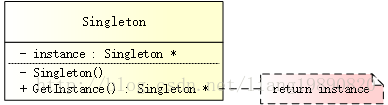

# 设计模式

> 写在开头，本文来自于[一去、二三里](https://blog.csdn.net/liang19890820/article/details/66974516)对于部分知识拿出来学习，用做笔记。

## 1. 简介

设计模式（Design Pattern）代表了最佳的实践，在面向对象的编程中被很多老鸟们反复使用。使用设计模式有很多好处：

- 可重用代码
- 保证代码可靠性
- 使代码更易被他人理解
- ……

毫无疑问，设计模式于己、于人、于系统都是多赢的。《设计模式》之于程序员，就好比《圣经》之于耶稣信徒一样，意义可想而知！

## 2. 设计模式的类型

根据《设计模式》参考书，共有 23 种设计模式，这些模式可以分为三类：

| 类型 | 描述 |
| :---- | :---- |
| 创建型模式（Creational Patterns） | 用于构建对象，以便它们可以从实现系统中分离出来。 |
| 结构型模式（Structural Patterns） | 用于在许多不同的对象之间形成大型对象结构。 |
| 行为型模式（Behavioral Patterns） | 用于管理对象之间的算法、关系和职责。 |

### 2.1 创建型模式

- [单例模式](https://blog.csdn.net/liang19890820/article/details/61615495)（Singleton Pattern） 

  保证一个类仅有一个实例，并提供一个访问它的全局访问点。

- [抽象工厂模式](https://blog.csdn.net/liang19890820/article/details/70653800) （Abstract Factory Pattern） 

  提供一个创建一系列相关或相互依赖对象的接口，而无需指定它们具体的类。

- 建造者模式（Builder Pattern） 

  将一个复杂对象的构建与它的表示分离，使得同样的构建过程可以创建不同的表示。

- 工厂方法模式 （Factory Method Pattern） 

  定义一个用于创建对象的接口，让子类决定将哪一个类实例化。Factory Method 使一个类的实例化延迟到其子类。

- 原型模式（Prototype Pattern） 

  用原型实例指定创建对象的种类，并且通过拷贝这个原型来创建新的对象。

### 2.2 结构型模式

- 适配器模式（Adapter Pattern） 

  将一个类的接口转换成客户希望的另外一个接口。Adapter 模式使得原本由于接口不兼容而不能一起工作的那些类可以一起工作。

- 桥接模式（Bridge Pattern） 

  将抽象部分与它的实现部分分离，使它们都可以独立地变化。

- 装饰者模式（Decorator Pattern） 

  动态地给一个对象添加一些额外的职责。就扩展功能而言，它比生成子类方式更为灵活。

- 组合模式（Composite Pattern） 

  将对象组合成树形结构以表示“部分-整体”的层次结构。它使得客户对单个对象和复合对象的使用具有一致性。

- 外观模式（Facade Pattern） 

  为子系统中的一组接口提供一个一致的界面，Facade 模式定义了一个高层接口，这个接口使得这一子系统更加容易使用。

- 享元模式（Flyweight Pattern） 

  运用共享技术有效地支持大量细粒度的对象。

- 代理模式（Proxy Pattern） 

  为其他对象提供一个代理以控制对这个对象的访问。

### 2.3 行为型模式

- 模版方法模式 （Template Method Pattern） 

  定义一个操作中的算法的骨架，而将一些步骤延迟到子类中。Template Method 使得子类可以不改变一个算法的结构即可重定义该算法的某些特定步骤。

- 命令模式（Command Pattern） 

  将一个请求封装为一个对象，从而使你可用不同的请求对客户进行参数化；对请求排队或记录请求日志，以及支持可取消的操作。

- 迭代器模式（Iterator Pattern） 

  提供一种方法顺序访问一个聚合对象中各个元素，而又不需暴露该对象的内部表示。

- 观察者模式（Observer Pattern） 

  定义对象间的一种一对多的依赖关系，以便当一个对象的状态发生改变时，所有依赖于它的对象都得到通知并自动刷新。

- 中介者模式（Mediator Pattern） 

  用一个中介对象来封装一系列的对象交互。中介者使各对象不需要显式地相互引用，从而使其耦合松散，而且可以独立地改变它们之间的交互。

- 备忘录模式 （Memento Pattern） 

  在不破坏封装性的前提下，捕获一个对象的内部状态，并在该对象之外保存这个状态。这样以后就可将该对象恢复到保存的状态。

- 解释器模式（Interpreter Pattern） 

  给定一个语言，定义它的文法的一种表示，并定义一个解释器，该解释器使用该表示来解释语言中的句子。

- 状态模式（State Pattern） 

  允许一个对象在其内部状态改变时改变它的行为。对象看起来似乎修改了它所属的类。

- 策略模式（Strategy Pattern） 

  定义一系列的算法，把它们一个个封装起来，并且使它们可相互替换。本模式使得算法的变化可独立于使用它的客户端。

- 职责链模式 （Chain of Responsibility Pattern） 

  为解除请求的发送者和接收者之间耦合，而使多个对象都有机会处理这个请求。将这些对象连成一条链，并沿着这条链传递该请求，直到有一个对象处理它。

- 访问者模式 （Visitor Pattern） 

  表示一个作用于某对象结构中的各元素的操作。它使你可以在不改变各元素的类的前提下定义作用于这些元素的新操作。

## 3. C++常用设计模式

最常用的

- 单例
- 观察者
- 责任链

次一点的

- 工厂

- 装饰器

- 适配器等

## 4. 单例模式

> [单例模式](https://blog.csdn.net/liang19890820/article/details/61615495)

### 4.1 简述

单例模式（Singleton Pattern）是设计模式中最简单的形式之一，其目的是使得类的一个对象成为系统中的唯一实例。

这种模式涉及到一个单一的类，该类负责创建自己的对象，同时确保只有单个对象被创建。这个类提供了一种访问其唯一对象的方式，可以直接访问，不需要实例化该类的对象。

### 4.2 模式结构

UML 结构图

### 4.3 要点

单例模式的要点有三个：

- 单例类有且仅有一个实例
- 单例类必须自行创建自己的唯一实例
- 单例类必须给所有其他对象提供这一实例

从具体实现角度来说，可分为以下三点：

- 提供一个 private 构造函数（防止外部调用而构造类的实例）
- 提供一个该类的 static private 对象
- 提供一个 static public 函数，用于创建或获取其本身的静态私有对象（例如：GetInstance()）

除此之外，还有一些关键点（需要多加注意，很容易忽视）：

- 线程安全（双检锁 - DCL，即：double-checked locking）

- 资源释放

### 4.4 懒汉式/饿汉式

懒汉式的特点：

- Lazy 初始化
- 非多线程安全

优点：第一次调用才初始化，避免内存浪费。 

缺点：必须加锁（在“线程安全”部分分享如何加锁）才能保证单例，但加锁会影响效率。

饿汉式的特点：

- 非 Lazy 初始化
- 多线程安全

优点：没有加锁，执行效率会提高。 

缺点：类加载时就初始化，浪费内存。

