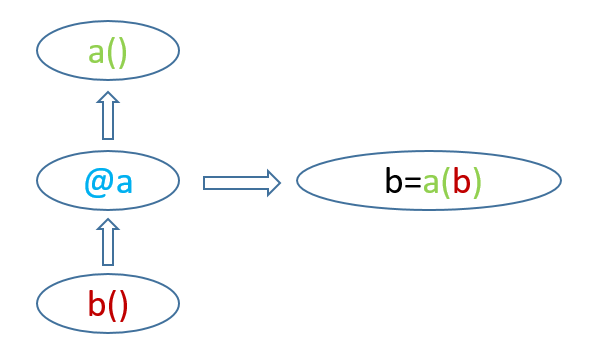

# Interview Python Summarize

## Index

<!-- TOC -->


<!-- /TOC -->


> - [关于Python的面试题***](https://github.com/miaopei/interview_python)


## 1. Python中的闭包

当一个嵌套函数在其外部区域引用了一个值时，该嵌套函数就是一个闭包。其意义就是会记录这个值。 

在通过Python的语言介绍一下，一个闭包就是你调用了一个函数A，这个函数A返回了一个函数B给你。这个返回的函数B就叫做闭包。你在调用函数A的时候传递的参数就是自由变量。 

```python
def func(name):
    def inner_func(age):
        print 'name:', name, 'age:', age
    return inner_func

bb = func('the5fire')
bb(26)  # >>> name: the5fire age: 26
```

闭包和类有点相似，相似点在于他们都提供了对数据的封装。不同的是闭包本身就是个方法。 

闭包可以被理解为一个只读的对象，你可以给他传递一个属性，但它只能提供给你一个执行的接口。因此在程序中我们经常需要这样的一个函数对象——闭包，来帮我们完成一个通用的功能，比如后面会提到的——装饰器。 

**闭包的作用：**

闭包的最大特点是可以将父函数的变量与内部函数绑定，并返回绑定变量后的函数（也即闭包），此时即便生成闭包的环境（父函数）已经释放，闭包仍然存在，这个过程很像类（父函数）生成实例（闭包），不同的是父函数只在调用时执行，执行完毕后其环境就会释放，而类则在文件执行时创建，一般程序执行完毕后作用域才释放，因此对一些需要重用的功能且不足以定义为类的行为，使用闭包会比使用类占用更少的资源，且更轻巧灵活。

## 2. 装饰器

装饰器（Decorator）相对简单，咱们先介绍它：“装饰器的功能是将被装饰的函数当作参数传递给与装饰器对应的函数（名称相同的函数），并返回包装后的被装饰的函数”，听起来有点绕，没关系，直接看示意图,其中 a 为与装饰器 @a 对应的函数， b 为装饰器修饰的函数，装饰器@a的作用是： 



**简而言之：@a 就是将 b 传递给 a()，并返回新的 b = a(b)** 

```python
def dobi(qf):	# 与装饰器对应的函数
    return qf()
@dobi	# 装饰器
def qinfeng():	# 被装饰的函数
    print('dobi')
```

上面使用@dobi来表示装饰器，其等同于：qinfeng = dobi(qinfeng)  因此装饰器本质上就是个语法糖，其作用为简化代码，以提高代码可读性 

解析过程是这样子的： 

1. python 解释器发现@dobi，就去调用与其对应的函数（ dobi 函数） 
2. dobi 函数调用前要指定一个参数，传入的就是@dobi下面修饰的函数，也就是 qinfeng() 
3. dobi() 函数执行，调用 qinfeng()，qinfeng() 打印“dobi” 

**装饰器就是一种闭包的应用，只不过其传递的是函数**

##3. 猴子补丁

monkey patch指的是在运行时动态替换，一般是在 startup 的时候. 

## 4. 在Python中有多少种运算符？

在Python中，我们有7种运算符：

- 算术运算符：`+、-、*、\`
- 关系运算符：`<、>、>=、<=、==、!=`
- 赋值运算符：`+=、-=、*=、/=、**=、//=、%=` 
  - `//` 运算符执行地板除法（向下取整除），它会返回整除结果的整数部分。
  - `**` 执行取幂运算。`a**b`会返回 `a` 的 `b` 次方。
  - `%` 执行取模运算，返回除法的余数。
- 逻辑运算符：`and、or、not`
- 位运算符：`&、|、^、~、<<、>>`
- 成员运算符：`in、not in`
  - 可以确认一个值是否是另一个值的成员
  - eg：'me' in 'disappointment'  >>> True
- 身份运算符：`is、is not`
  - 可以确认两个值是否相同
  - eg：10 is '10' >>> False

## 5. 为何不建议以下划线作为标识符的开头

因为Python并没有私有变量的概念，所以约定速成以下划线为开头来声明一个变量为私有。所以如果你不想让变量私有，就不要使用下划线开头。

## 6. Python支持什么数据类型？

**Python支持5种数据类型：**

- **Numbers（数字）——用于保存数值**
- **Strings（字符串）——字符串是一个字符序列。我们用单引号或双引号来声明字符串。**
- **Lists（列表）——列表就是一些值的有序集合，我们用方括号声明列表。**
- **Tuples（元组）——元组和列表一样，也是一些值的有序集合，区别是元组是不可变的，意味着我们无法改变元组内的值。**
- **Dictionary（字典）——字典是一种数据结构，含有键值对。我们用大括号声明字典。**

## 7. 解释 lambda 表达式，什么时候会用到它？

如果我们需要一个只有单一表达式的函数，我们可以匿名定义它。拉姆达表达式通常是在需要一个函数，但是又不想费神去命名一个函数的场合下使用，也就是指匿名函数。

假如我们想将上面Q 14中的函数定义为拉姆达表达式，可以在解释器中输入如下代码：

```python
>>> (lambda a,b:a if a>b else b)(3,3.5)
3.5
```

## 8. 什么是递归？

在调用一个函数的过程中，直接或间接地调用了函数本身这个就叫递归。但为了避免出现死循环，必须要有一个结束条件，举个例子：

```python
>>> def facto(n):
    if n==1: return 1
    return n*facto(n-1)
>>> facto(4)
24
```

## 9. 什么是生成器？

生成器会生成一系列的值用于迭代，这样看它又是一种可迭代对象。它是在for循环的过程中不断计算出下一个元素，并在适当的条件结束for循环。

我们定义一个能逐个“yield”值的函数，然后用一个for循环来迭代它。

```python
>>> def squares(n):
    i=1
    while(i<=n):
        yield i**2
        i+=1
>>> for i in squares(7):
    print(i)
1
4
9
16
...
```

## 10. 什么是迭代器？

迭代器是访问集合元素的一种方式。迭代器对象从集合的第一个元素开始访问，直到所有的元素被访问完结束。迭代器只能往前不会后退。我们使用inter()函数创建迭代器。

```python
odds=iter([1,3,5,7,9])
```

每次想获取一个对象时，我们就调用next()函数。

```python
>>> next(odds)
1
>>> next(odds)
3
>>> next(odds)
5
```

## 11. 请说说生成器和迭代器之间的区别

- 在使用生成器时，我们创建一个函数；在使用迭代器时，我们使用内置函数iter()和next()。

- 在生成器中，我们使用关键字‘yield’来每次生成/返回一个对象。

- 生成器中有多少‘yield’语句，你可以自定义。

- 每次‘yield’暂停循环时，生成器会保存本地变量的状态。而迭代器并不会使用局部变量，它只需要一个可迭代对象进行迭代。

- 使用类可以实现你自己的迭代器，但无法实现生成器。

- 生成器运行速度快，语法简洁，更简单。

- 迭代器更能节约内存。

## 12. 请谈谈Python的不足之处。

Python有以下缺陷：

- Python的可解释特征会拖累其运行速度。
- 虽然Python在很多方面都性能良好，但在移动计算和浏览器方面表现不够好。
- 由于是动态语言，Python使用鸭子类型，即duck-typing，这会增加运行时错误。

## 13. 解释Python的参数传递机制

Python使用按引用传递（pass-by-reference）将参数传递到函数中。如果你改变一个函数内的参数，会影响到函数的调用。这是Python的默认操作。不过，如果我们传递字面参数，比如字符串、数字或元组，它们是按值传递，这是因为它们是不可变的。


## Reference

- [什么是猴子补丁 - monkey patch](https://blog.csdn.net/handsomekang/article/details/40297775) - CSDN
- [Python中字典的键为什么要是不可变类型！！](https://www.jianshu.com/p/56691574ef9e)- 简书
- [Python中的闭包](https://www.the5fire.com/closure-in-python.html) - the5file Blog
- [Python 的闭包和装饰器](https://segmentfault.com/a/1190000004461404) - segmentfault

### Interview Link

- [关于Python的面试题***](https://github.com/miaopei/interview_python)

- [2018年最常见的Python面试题&答案（上篇）](https://juejin.im/post/5b6bc1d16fb9a04f9c43edc3) - 掘金
- [2018年最常见的Python面试题&答案（下篇）](https://juejin.im/post/5b8505b6e51d4538884d22bf) - 掘金
- [Python面试必须要看的15个问题](http://codingpy.com/article/essential-python-interview-questions/) - 编程派
- [百度大牛总结十条Python面试题检验你的真实水平](http://developer.51cto.com/art/201802/565802.htm) - 51CTO
- [常见面试题整理--Python代码篇](https://zhuanlan.zhihu.com/p/23582996) - 知乎
- [PYTHON 一些基础面试题目总结](https://blog.csdn.net/alvine008/article/details/39229057) - CSDN
- [大牛总结的20个经典python面试题](https://www.ctolib.com/topics-122771.html) - CTOLib码库

### 其他

- [ 算法的时间复杂度和空间复杂度-总结 ](https://blog.csdn.net/zolalad/article/details/11848739) - CSDN

